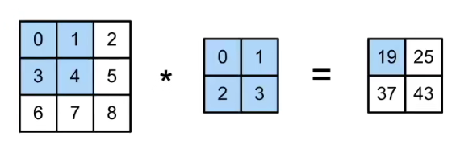
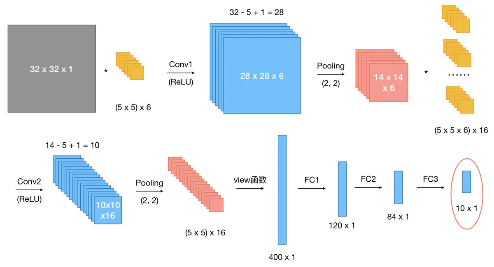
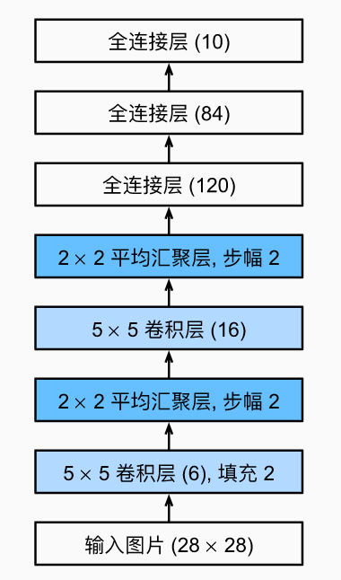
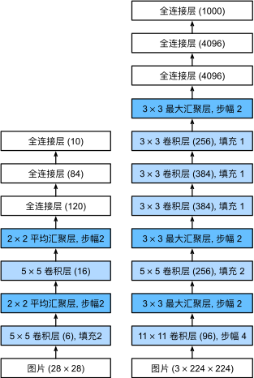
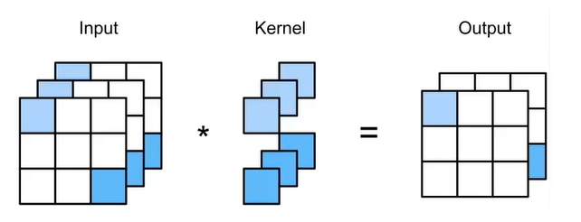
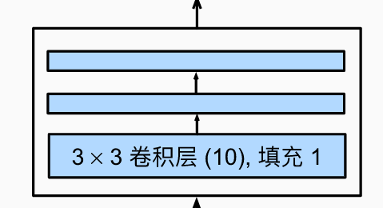
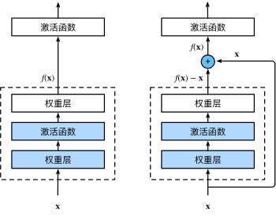
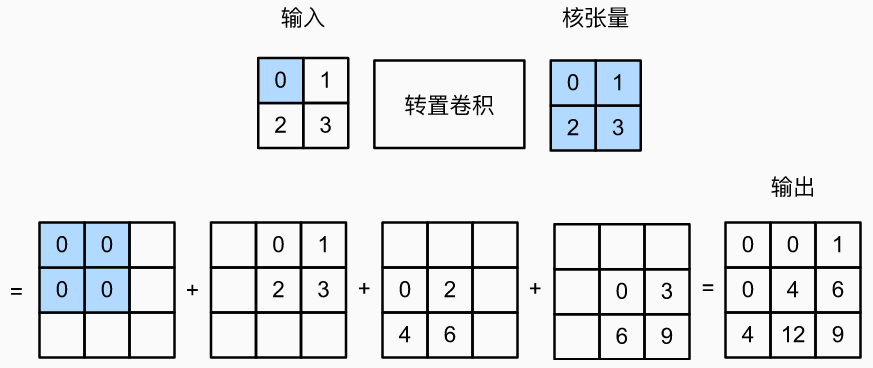
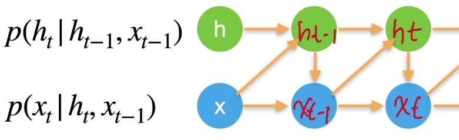
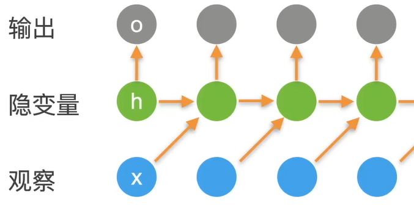

# Deep Learning Notes


## 资源

- 课程主页：https://courses.d2l.ai/zh-v2
- 教材：https://zh-v2.d2l.ai/
- 课程论坛讨论：https://discuss.d2l.ai/c/16
- pytorch论坛：https://discuss.pytorch.org/


## 基础数学

#### 基础运算

- 点乘（`.dot()`），矩阵对应位置元素相乘；
- 矩阵与向量（`.mv()`），类似于`broadcast`机制；

#### 矩阵行和与列和

```python
X = torch.tensor([[1.0, 2.0, 3.0],[4.0, 5.0, 6.0]])
```

$$
\begin{bmatrix}
1.0 & 2.0 & 3.0 \\
4.0 & 5.0 & 6.0 \\
\end{bmatrix}
$$

对于：

```python
X.sum(0, keepdim=True)
X.sum(1, keepdim=True)
```

结果为：
$$
\begin{align}
	\begin{bmatrix}
		5.0 & 7.0 & 9.0
	\end{bmatrix} 
	\tag{列和}
\\
\\
	\begin{bmatrix}
		6.0 \\ 
		15.0 \\
	\end{bmatrix} 
	\tag{行和}
\end{align}
$$


#### 导数


## 神经网络


$$
\boldsymbol{X}=[\boldsymbol{x_1}, \boldsymbol{x_2}, \boldsymbol{\cdots}, \boldsymbol{x_n}]^T \\ 

\boldsymbol{y}=[y_1, y_2, \cdots, y_n]^T
$$

### 线性回归

##### 推导

价格公式：$y=w_1x_1 + w_2x_2 + w_3x_3 + b$

向量版本：$\begin{pmatrix}\boldsymbol{w}, \boldsymbol{x}\end{pmatrix} + b$ 

损失函数：$\mathscr{L}(y,\hat{y}) = \frac{1}{2}(y - \hat{y})^2$

训练损失：$\mathscr{L}(\boldsymbol{X},\boldsymbol{y},\boldsymbol{w},b) = \frac{1}{2n}\sum_{i=1}^{n}(y_i - (\boldsymbol{x_i}, \boldsymbol{w}) - b)^2=\frac{1}{2n} \Vert{\boldsymbol{y} - \boldsymbol{Xw} - b}\Vert$

通过最小化损失来学习参数：$\boldsymbol{w^*}, \boldsymbol{b^*} = \arg \min_{\boldsymbol{w}, b} (\mathscr{L}(\boldsymbol{X},\boldsymbol{y},\boldsymbol{w},b))$

##### 显示解

$\boldsymbol{X} \gets [\boldsymbol{X}, 1] \qquad \boldsymbol{w} \gets \begin{bmatrix}\boldsymbol{w} \\ b\end{bmatrix}$

则有：

$\mathscr{L}(\boldsymbol{X},\boldsymbol{y},\boldsymbol{w}) = \frac{1}{2n}\Vert{\boldsymbol{y} - \boldsymbol{Xw}}\Vert^2 \to \frac{\partial{\mathscr{L}}}{\partial{\boldsymbol{w}}}=\frac{1}{n}(\boldsymbol{y}-\boldsymbol{Xw})^T\boldsymbol{X}$

所以最优解满足：

$\frac{\partial{\mathscr{L}}}{\partial{\boldsymbol{w}}}=0 \to \boldsymbol{w^*}=(\boldsymbol{X}^T\boldsymbol{X})^{-1}\boldsymbol{X}\boldsymbol{y}$

##### 梯度下降

- 随机挑选一个初始值$\boldsymbol{w}_0$；

- 开始迭代使$\boldsymbol{w}_t = \boldsymbol{w}_{t-1} - \eta\frac{\partial{\mathscr{L}}}{\partial{\boldsymbol{w}_{t-1}}}$；

  

  - 学习率（步长的超参数）$\eta$

- 小批量随机梯度下降：$\frac{1}{b}\sum_{i\in{I_b}}{\mathscr{L}(\boldsymbol{x}_i,y_i,\boldsymbol{w})}$

  - $b$为样本大小（批量大小），随机采样来近似损失；

---


### 分类问题

- 多输出，输出i是预测为第i类的置信度；

  

- 对类别进行有效编码：$\boldsymbol{y}=\begin{bmatrix}y_1,y_2,\cdots,y_n  \end{bmatrix}^T$

  其中：$y_i=\begin{cases}1 \qquad if \  i=y \\ 0 \qquad otherwise\end{cases}$

- 最大值为预测：$\hat{y}=\mathop{\arg\max}_{i}o_i$
- 更置信的识别正确类（大余量），即：$o_y-o_i\geq\Delta(y,i)$

##### $softmax$回归

- 希望输出是个概率（是否匹配），即：

  $\boldsymbol{\hat{y}}=softmax(\boldsymbol{o}) \leftrightarrow \hat{y}_i=\frac{\exp(o_i)}{\sum_{k}{\exp(o_k)}}$

- 概率的区别作为损失部分；

##### 交叉熵

$H(\boldsymbol{p},\boldsymbol{q}=\sum_{i}-p_i\log(q_i))$

$\mathscr{L}(\boldsymbol{y},\boldsymbol{\hat{y}}=-\sum_{i}{y_i \log{\hat{y}_i}})$

则其梯度为：

$\frac{\partial{\mathscr{L}}}{\partial{o_i}}=softmax(\boldsymbol{o})_i-y_i$

---


### 感知机

- 给定输入$\boldsymbol{x}$，权重$\boldsymbol{w}$，和偏移$b$，感知机输出：

  $o=\sigma(<\boldsymbol{w}, \boldsymbol{x}>+b) \qquad \sigma(x)=\begin{cases}1\qquad if \quad x>0 \\0 \qquad otherwise\end{cases}$

  

- 只输出一个值（区别于$softmax$的多分类问题）
- 输出值为离散值（区别于回归模型输出的是实数）

##### 感知机训练思路

$$
\begin{aligned}
& \bold{initialize} \ w=0 \ and \ b=0 \\
& \bold{repeat} \\
& \qquad \bold{if} \quad y_i \ [<w,x_i>+b] \leq 0 \ \bold{then} \\
& \qquad \qquad w \gets w + y_i + x_i \ and \ b \gets b + y_i \\
& \qquad \bold{end \ if} \\
&\bold{until} \ all \ classified \ correctly
\end{aligned}
$$

等价于使用批量大小为1的梯度下降，并使用损失函数：$\mathscr{L}(y,\boldsymbol{x},\boldsymbol{w})=\max(0,-y<\boldsymbol{w},\boldsymbol{x}>)$

##### 收敛定理

- 数据在半径$r$内
- 余量$\rho$分类两类，$y(\boldsymbol{x}^T\boldsymbol{w} + b) \geq \rho$ 且 $\Vert \boldsymbol{w} \vert^2 + b^2 \leq 1$

- 感知机保证在$\frac{r^2 + 1}{\rho ^ 2}$步后收敛

##### XOR问题


这无法用一条线划分出红绿在一边（XOR）


多次学习！因此有了多层感知机。

#### 多层感知机


- 隐藏层大小是超参数（可设置的）
- 单隐藏层（单分类问题）：
  - 输入 $\boldsymbol{x} \in \mathbb{R}^n$
  - 隐藏层 $\boldsymbol{W}_1 \in \mathbb{R}^{m \times n}$，$\boldsymbol{b}_1 \in \mathbb{R}^m$
  - 输出层 $\boldsymbol{w}_2 \in \mathbb{R}$，$b_2 \in \mathbb{R}$
  - 其中 $\boldsymbol{h}=\sigma{\boldsymbol{W}_1\boldsymbol{x}+\boldsymbol{b}_1}$，$o=\boldsymbol{w}_2^T\boldsymbol{h}+b_2$，$\boldsymbol{y}=softmax(\boldsymbol{o})$, 其中$\sigma$为激活函数
- 多隐藏层类似（层数依然是超参数）
- 多层感知机（非线性模型）=隐藏层+激活函数

##### 激活函数

- ReLU

  

- sigmoid

  

- tanh

  


### 权重衰退

- 通过限制参数值的选择范围来控制模型容量，通常不会限制$b$，小的$\theta$意味更强的正则项；
  - 当均方范数作为刚性限制：$min \mathscr{L}(\boldsymbol{w},b) \qquad subject \ to \ \Vert{w}\Vert^2 \leq \theta$
  - 当均方范数作为柔性限制：$min \mathscr{L}(\boldsymbol{w},b)+\frac{\lambda}{2}\Vert{\boldsymbol{w}}\Vert^2$，当然，此处$\lambda$作为超参数；

- 在上述柔性限制下的梯度计算：
  $$
  \begin{aligned}
  & \frac{\part}{\part{\boldsymbol{w}}}(\mathscr{L}(\boldsymbol{w},b)+\frac{\lambda}{2}\Vert{\boldsymbol{w}}\Vert^2)=\frac{\part{\mathscr{L}(\boldsymbol{w},b)}}{\part{\boldsymbol{w}}}+\lambda\boldsymbol{w}
  \\
  & \qquad +
  \\
  & \boldsymbol{w}_{t+1} = \boldsymbol{w}_t - \eta\frac{\part\cdots}{\part{\boldsymbol{w}_t}}
  \\
  & \qquad \downarrow\\
  & \boldsymbol{w}_{t+1}=(1-\eta\lambda)\boldsymbol{w}_t-\eta \frac{\part\mathscr{L(\boldsymbol{w}_t,b_t)}}{\part\boldsymbol{w}_t}
  \end{aligned}
  $$


### 丢弃法(dropout)

- 好的模型需要对输入数据鲁棒，因此在层之间加噪音，但不影响整体期望；

- 无偏差加入噪音：

  $\boldsymbol{E}(\boldsymbol{x}')=\boldsymbol{x}$

- 其中扰动为：

  $x'_i=\begin{cases} 0 \qquad &with \ probablity \ p \\ \frac{x_i}{1-p} \qquad &otherwise \end{cases}$

- 使用：$\boldsymbol{h}=dropout(\sigma(\boldsymbol{W}_1\boldsymbol{x}+b))$

- 可是使用随机数种子（随机性等等）


### 数值稳定性

- 考虑$d$层的神经网络（层数记为$t$）：

  $\boldsymbol{h}^t=f_t(\boldsymbol{\boldsymbol{h}^{t-1}}) \quad and \quad y=\mathscr{L} \circ f_d \circ \dots \circ f_1(\boldsymbol{x})$

- 损失函数关于参数$\boldsymbol{W}_t$的梯度，因此梯度会不见（过大过小溢出）

  $\frac{\part \mathscr{L}}{\part \boldsymbol{W}_t} = \frac{\part \mathscr{L}}{\part \boldsymbol{h}_d} \cdot \frac{\part \boldsymbol{h}_d}{\part \boldsymbol{h}_{d-1}} \cdots \frac{\part \boldsymbol{h}_{t+1}}{\part \boldsymbol{h}_t} \cdot \frac{\part \boldsymbol{h}_t}{\part \boldsymbol{W}_t}$

- 加入MLP后：

  $f_t(\boldsymbol{h}_{t-1})=\sigma(\boldsymbol{W}_t \cdot \boldsymbol{h}_{t-1})$

  那么偏导为：

  $\frac{\part \boldsymbol{h}_t}{\part \boldsymbol{h}_{t-1}} = diag(\sigma'(\boldsymbol{W}_t \cdot \boldsymbol{h}_{t-1})) \cdot \boldsymbol{W}_t^T$

- 解决方法：

  - 乘法变成加法（ResNet & LSTM）
  - 归一化（梯度归一化，梯度剪裁）
  - 合理的权重初始化和激活函数（训练开始时最有可能出现数值不稳定）

- 合理的权重初始化和激活函数
  - 将每层的输出和梯度都看作随机变量，让他们的方差和均值保持一致：

    $\mathbb{E}[h_i^t]=0 \qquad Var[h_i^t]=a$

    $\mathbb{E}[\frac{\part \mathscr{L}}{\part h_i^t}]=0 \qquad Var[\frac{\part \mathscr{L}}{\part h_i^t}]=b$

- 则需要激活函数近似：$f(x)=x$（使用泰勒展开判别）


### PyTorch中神经网络框架

- 以多层感知机为例：

  ```python
  net = nn.Sequential(nn.Linear(10,256), nn.ReLU(), nn.Linear(256,10))
  ```

##### 自定义网络

```python
class MLP(nn.Module):
	def __init__(self):
        super().__init__()
        self.hidden = nn.Linear(20, 256)
        self.out = nn.Linear(256, 10)
     
    def forward(self, X):
        return self.out(F.relu(self.hidden(X)))
        
net = MLP()
net(X)
```

##### 调整初始参数

```python
def init_normal(m):
    if type(m) == nn.Linear:
        nn.init.normal_(m.weight, mean=0, std=0.01)
        nn.init.zeros_(m.bias)

net.apply(init_normal)
```

##### 自定义层

```python
import torch
import torch.nn.functional as F
from torch import nn


class CenteredLayer(nn.Module):
    def __init__(self):
        super().__init__()

    def forward(self, X):
        return X - X.mean()
    

class MyLinear(nn.Module):
    def __init__(self, in_units, units):
        super().__init__()
        self.weight = nn.Parameter(torch.randn(in_units, units))
        self.bias = nn.Parameter(torch.randn(units,))
    def forward(self, X):
        linear = torch.matmul(X, self.weight.data) + self.bias.data
        return F.relu(linear)    
```

##### 模型存储

```python
import torch
from torch import nn
from torch.nn import functional as F

# 存矩阵
x = torch.arange(4)
torch.save(x, 'x-file')
x2 = torch.load('x-file')

# 存矩阵表
y = torch.zeros(4)
torch.save([x, y],'x-files')
x2, y2 = torch.load('x-files')

# 存字典
mydict = {'x': x, 'y': y}
torch.save(mydict, 'mydict')
mydict2 = torch.load('mydict')
```

```python
# 存储模型
class MLP(nn.Module):
    def __init__(self):
        super().__init__()
        self.hidden = nn.Linear(20, 256)
        self.output = nn.Linear(256, 10)

    def forward(self, x):
        return self.output(F.relu(self.hidden(x)))

net = MLP()
X = torch.randn(size=(2, 20))
Y = net(X)

torch.save(net.state_dict(), 'mlp.params')

clone = MLP()
clone.load_state_dict(torch.load('mlp.params'))
clone.eval()
```


---

### 卷积层

- 特殊的全连接层
- 在图片里找局部特征：（平移不变性和局部性）

- 扩展维度：

  $h_{i,j}=\sum_{k,l} w_{i,j,k,l} \cdot x_{k,l}=\sum_{a,b} v_{i,j,a,b} \cdot x_{i+a,j+b}$

- 对于平移不变性：（交叉相关）

  $h_{i,j}=\sum_{a,b} v_{a,b} \cdot x_{i+a,j+b}$

- 对于局部性：（）

  $h_{i,j}=\sum_{\vert a \vert \leq \Delta,\vert b \vert \leq \Delta} v_{a,b} \cdot x_{i+a,j+b}$



##### 二维卷积层

$$
\boldsymbol{Y}^{(n_k-k_h+1) \times (n_w-k_w+1)}=\boldsymbol{X}^{n_h \times n_w} \star \boldsymbol{W}^{k_h \times k_w}+b
$$

- Kernel

- 一维  $y_i=\sum_{a=1}^{h}w_ax_{i+a}$
  - 文本-语言-时序序列

- 三维 $y_{i,j,k}=\sum_{a=1}^h\sum_{b=1}^w\sum_{c=1}^dw_{a,b,c} \cdot x_{i+a,j+b,k+c}$
  - 视频-医学图像-气象图像

##### 填充

- 输入四周填充额外行列，一般取卷积核（kernel）$（k_h-1，\ k_w-1)$
  - 上侧填充$\lceil \frac{p_h}{2} \rceil$，下侧填充$\lfloor \frac{p_h}{2} \rfloor$

##### 步幅

- 每次卷积过后移动距离（默认是1-1），记为：$s_h-s_w$

##### 多输入和输出通道

- 以RGB图片为代表

**代码**

- 以下图第一个卷积层为例（Conv1）：

```python
nn.Conv2d(1, 6, kernel_size=5, padding=0, stride=1)
```



### 池化层

- **二维最大池化**：返回滑动窗口内的最大值

- 其他部分，如**步幅**，**填充**等与卷积层类似
- 池化层缓解卷积层的位置敏感性


---

### LeNet

- 经典应用场景：手写数字识别，简化后的LeNet如图所示：

  

### AlexNet

- 更深更大的LeNet，为了处理更大的模型，采用了以下策略：

  - dropout
  - ReLu （缓解梯度消失）
  - MaxPooling

  


### VGG

- AlexNet思路的拓展，使用**VGG块**
  - 大量卷积层堆叠，但是不影响数据的大小（input_size = output_size）


### NiN

- 在VGG中全连接层是很“贵”的（矩阵很“宽”），因此需要简化来提升速度

- **NiN块**：（替代全连接层）

  

  - 一个卷积层后跟两个全连接层（1x1的卷积层），卷积层步幅为1，无填充，因此输出形状跟卷积层输入一致

    

- **NiN架构**：

  - 无全连接层，交替使用NiN块和步幅为2的最大池化层（可以逐步减小高宽和增大通道数）
  - 最后使用全局平均池化层得到输出（其输入通道是类别数）


### GoogLeNet

- **Inception块**

  - 全都要（4个不同的分路径从不同层面抽取信息，在输出通道合并 (**Concatenation**)）

    

  - 输出和输入高宽相同，但是和单卷积相比，**Inception**有更少的参数和计算复杂度


### 批量归一化

- 上层更新较快，而下层变化不明显，收敛因此较慢，但是，底层信息影响着上层数据，整体收敛受底层影响

- **批量归一化**固定小批量里的均值和方差：

  $\mu_B = \frac{1}{\vert B \vert}\sum_{i \in B} \sigma^2_B = \frac{1}{\vert B \vert}\sum_{i \in B} (x_i - \mu_B)^2 + \epsilon$

  在做额外的调整（可学习的参数）：（$\gamma$：方差， $\beta$：均值，均可学习）
  
  $x_{i+1} = \gamma \frac{x_i - \mu_B}{\sigma_B} + \beta$

##### 批量归一化层

- 作用域（线性变换）：
  - 全连接层和卷积层输出上，激活函数之前
  - 全连接层和卷积层输入上
    - 全连接层：作用在特征维上
    - 卷积层：作用在通道维上
- 加速收敛不改变模型精度 


### ResNet

##### 残差块

- 残差快（加入快速通道）

  


### 数据增广

- 增加一个数据集的噪音（例：改变图片的颜色和形状）

  - 在线生成，随机生成

  - **切割**

    - 随机高宽比，随机大小，随机位置

  - **颜色**

    - 明亮度，饱和度，色调

    - ```
      我们还可以创建一个RandomColorJitter实例，并设置如何同时随机更改图像的亮度（brightness）、对比度（contrast）、饱和度（saturation）和色调（hue）
      ```


### 微调

- 通过使用在大数据集上预训练的模型来初始化权重提升模型精度
- 微调通常很快，精度更高
- 预训练模型精度要求很高


### 转置卷积

- 专职卷积可以增大输入高宽

  

  $Y[i:i+h,j:j+w]+=X[i,j]\cdot K$


### 全连接卷积神经网络（FCN）

- 将CNN最后的全连接层替换成转置卷积层，以便于预测所有像素（图像处理）


### 序列模型

pass


### RNN

##### 潜变量自回归模型

- 使用隐变量$h_t$总结过去信息：

  

##### 循环神经网络

- 更新隐藏状态：$\boldsymbol{h}_t = \phi(\boldsymbol{W}_{hh}\boldsymbol{h}_{t-1} + \boldsymbol{W}_{hx}\boldsymbol{x}_{t-1} + \boldsymbol{b}_h)$

- 输出：$\boldsymbol{o}_t = \phi(\boldsymbol{W}_{ho}\boldsymbol{h}_t + \boldsymbol{b}_o)$

  

- 梯度爆炸：迭代过程中会出现矩阵乘法链
- 使用**梯度裁剪**预防：$\boldsymbol{g} \gets min(1, \frac{\theta}{\Vert\boldsymbol{g}\Vert})\boldsymbol{g}$
- 
