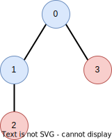
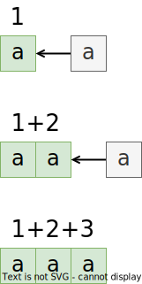

## 2023-03-13 百度笔试


### 第2题

小红拿到了一棵树，每个节点被染成了红色或者蓝色，小红定义每条边的权值为：

- 删除这条边时，形成的两个子树的同色连通块数量之差的绝对值。

小红想知道，所有边的权值之和是多少？


#### 思路



我们先观察这一棵树，假设我们将删除的边定为`0-1`，那么就有：


那么虚线部分两边子树的同色连通块就都是0了，我们再看另一种情况：


这次我们删除了`0-3`这条边，结果和上面不同了，`0-1-2`这棵子树出现了1个同色连通块，得到的权值就是1；

看完这个我们枚举一下得到的信息，遍历一下树里面常见的操作：

1. 我们有棵树，多叉树，树上有着色，需要判断同色个数；
2. 如果当前节点和其子节点同色，那么同色连通块数量反而不变；
3. ==如果当前节点和其子节点颜色都不相同，那么连通块多了一个，同色连通块`+1`；==
4. 以当前节点为根的树可以用其子树的同色连通块的个数**向上递推**；

> 这里我犯了一个错误：我误解了同色连通块这一概念，**上面图里面其实有3个同色连通块，而非原先以为的1个，因为蓝色有两个节点，他们是连通的，算作一个，两个红色块不连通，算作两个**。
>
> - 我重新高亮了修改的内容，之前有些不妥之处，总体思路应该还是对的，大概（/(ㄒoㄒ)/~~）

那么，这个是典型的回溯思路，呼之欲出的**DFS**了，但是还有一个问题，删除边的一边的权值有了，另一边呢，这可是可能有逆行部分的，例如删除`1-2`边，剩下的树就是`1-0-3`，儿子变父亲节点了，那之前计算的以`1`为节点的同色连通块数量就不能用了，怎么办？

我们转变一下思路：

1. 整棵树的同色连通块我们可以算出来；
2. 子树和子树是可以组合出根节点的同色连通块的数量；

那么，**删除边两侧的同色连通块数量一相加，不就是整棵树的同色连通块数量了吗？**这里有个暗坑，是个特殊情况我们要判断一下，如果边两侧恰好同色，==那么整体的同色连通块还要`-1`。==

到这我们已经基本上把这题拆了七七八八了，接下来是针对这两部分进行编程，因为我们发现，一次并不能全部完成，需要分成两个**DFS**。


#### 代码

首先，我们收到的是：

- `edges`，一个二维数组表示的边的连通，`edges[i][0]`和`edges[i][1]`连接；
- `colors`，每一个节点涂色的情况，`colors[i]`表示编号为`i`的节点涂色；

那么，我们写个函数来解决这个问题：

```go
func SumOfColor(edges [][]int, colors string) int
```

接下来是树的初始化，采用的是邻接表：（顺便我们定义一下全局变量）

```go
n := len(colors)			// n个节点
list := make([][]int, n)	// 邻接表
cache := make([]int, n)		// 缓存，每个节点为根时，同色连通块数目
```

```go
// 初始化邻接表
for _, edge := range edges {
    list[edge[0]] = append(list[edge[0]], edge[1])
    list[edge[1]] = append(list[edge[1]], edge[0])
}
```

接下来我们初始化`cache`，这主要是缓存我们可以轻易得到的边的一侧的同色连通块数量，另一侧要靠减法得到：（这是一个递归）

```go
// cur: 当前遍历的节点编号
// fa:  cur的父亲节点，避免在邻接表中重复遍历，这样就能保证O(n)的复杂度
var dfs1 func(cur int, fa int)
dfs1 = func(cur int, fa int) {
    curIn := false
    for _, next := range list[cur] {
        // 如果邻接表指到了父节点
        if next == fa {
            continue
        }
        // 递归
        dfs1(next, cur)
        // 用子树更新当前
        cache[cur] += cache[next]
        // 如果cur和next同色，cur加入，但只运行一次！
        if colors[next] == colors[cur] {
				curIn = true
        }
    }
    if !curIn {
        cache[cur]++
    }
}
// 运行dfs1
dfs1(0, -1)
```

好了，我们初始化完了`cache`，那么接下来第二次递归，同样的顺序，算一下`cur`和`next`之间边删除后的状态：

```go
ans := 0
var dfs2 func(cur int, fa int)
dfs2 = func(cur int, fa int) {
    for _, next := range list[cur] {
        // next不能为父节点fa
        if next != fa {
            dfs2(next, cur)
            // 计算两边，其他语言可以直接用abs
            down := cache[next]
            up := cache[0] - cache[next]
            if colors[cur] == colors[next] {
                // 同色连通块，cur和next同色，分裂时多出一个块
                up += 1
            }
            if down > up {
                ans += down - up
            } else {
                ans += up - down
            }
            // abs结束
        }
    }
}
dfs2(0, -1)
```

`abs`过程可以改成：（Go的简陋）

```go
if colors[cur] == colors[next] {
	ans = abs(2*cache[next] - cache[0] + 1)    
} else {
 	ans = abs(2*cache[next] - cache[0])   
}
```

好了，结束！！！


整体代码：

```go
func color(colors string, edges [][]int) int {
	n := len(colors)
	list := make([][]int, n)
	cache := make([]int, n)

	// 初始化邻接表
	for _, edge := range edges {
		list[edge[0]] = append(list[edge[0]], edge[1])
		list[edge[1]] = append(list[edge[1]], edge[0])
	}

	// dfs 递推加回溯，缓存每个节点向下看的个数
	var dfs func(cur int, fa int)
	dfs = func(cur int, fa int) {
		curIn := false
		for _, next := range list[cur] {
			if next == fa {
				continue
			}
			dfs(next, cur)
			cache[cur] += cache[next]
			if colors[next] == colors[cur] {
				curIn = true
			}
		}
		if !curIn {
			cache[cur]++
		}
	}

	dfs(0, -1)

	ans := 0
	var dfs2 func(cur int, fa int)
	dfs2 = func(cur int, fa int) {
		for _, next := range list[cur] {
			if next != fa {
				dfs2(next, cur)
				down := cache[next]
				up := cache[0] - cache[next]
				if colors[cur] == colors[next] {
					// 同色连通块，cur和next同色，分裂时多出一个块
                    up += 1
				}
				if down > up {
					ans += down - up
				} else {
					ans += up - down
				}
			}
		}
	}

	dfs2(0, -1)
	return ans
}
```

这是一个典型的树型DP问题，主要应用到的方法是：

1. 记忆化搜索（`cache`，这个更多是用来简化复杂度的，这里我们用了`fa == next`来判断，把复杂度降到$O(n)$；
2. 回溯，也是树型DP较常用的策略，当前节点的值由其所有子树可以推算出来；
3. DFS，更加常见的方法，通常是以上两种方法的基础载体；

> 有关树型DP的其他题，可见：[树型DP](../LeetCode/DynamicProgramming-TreeDP.md)（写得烂，多包涵）


### 第3题

给定一个整数`x`，请你构造一个仅由`{'r', 'e', 'd'}`三种字符组成的字符串，其中回文子串的数量恰好为`x`。字符串的长度不得超过$10^5$。


#### 思路

照例给出一个函数来表示这道题的解法：

```go
func buildPalindrome(x int64)
```

为什么这里没有返回值了，不是说要构造字符串吗，这里有个小技巧，ACM模式下适用，最后再揭晓。我们暂时认为有个返回吧：

```go
func buildPalindrome(x int64) string
```

> 这里我想了一下，Go其实并不惧怕这么大的字符串，毕竟也才$10^5$，优化其实还行？

字符串的回文子串，还是用三个字符构造，乍一看没啥好方法，但是我们考虑以下特殊情况，当一个字符串只有一种字符组成时（共计$k$个），其回文子串个数是多少呢？
$$
\frac{(k+1) \cdot k}{2}
$$
这个不难理解，例如`aaa`，长度为1的回文子串有3个，长度为2的有2个，长度为3的有1个。

那么，如果不巧`x`并不是正好是$k$个单一字符能构成的回文子串个数时，应该咋办？朴素的思想是往已有的字符串上加，怎么加又是个学问：

1. 首先，简化推导我们只往一边加，一般是追加；
2. 形如`a...ab...ba...a`会增加统计难度，因为`ab...ba`也是一个回文子串，我们要避免；
3. `a...ab...bc...c`除了单个字符组成的子串，不存在多个不同字符组成的回文子串；

有了上面三点，特别是第3点，我们就很清楚构造流程了，就是往后加就完事了。

> **那么，这种构造能覆盖数域上全部的`x`吗？**我们做一个数学归纳：
>
> 假设前面有构造完整的字符串`a...ab...bc...c`，长度为`k`，那么`k+1`，不失一般性，我们只要加一个`a`就能构造出回文子串恰好为`k+1`个的字符串，由数学归纳法，得证能连续覆盖自然数。

> **能在$10^5$的长度内塞下吗？**
>
> 由于长度为$k$的单一字符字符串能贡献$\frac{(k+1) \cdot k}{2}$个回文子串，我们可以认为至多使用$\sqrt{x}$的长度，$\sqrt{10^9} < 10^5$。


#### 代码

接下来就是代码了：

```go
ans := make([]byte, 1e5)
ans = ans[:0]
prints := [3]byte{'r', 'e', 'd'}
idx := 0
```

我们初始化了一下变量，`ans`开辟了$10^5$的空间，但是长度仍为0；`prints`和`idx`表示下一个字符打印什么。

```go
for x > 0 {
    j := int64(1)
    for x >= j {
        x -= j
        j++
        ans = append(ans, prints[idx])
    }
    idx = (idx + 1) % 3
}
return string(ans)
```

接下来有个简化的流程：首先去判断是否能加一个相同字符，假设前面有了`j-1`个字符，我加上第`j`个字符，回文子串增加`j`个，如果超过`x`，那么我们不选用这个字符了，选用下一个字符，并将`j`回退到1。



这样大体上就ok了。

```go
func buildPalindrome(x int64) string {
	ans := make([]byte, 1e5)
	ans = ans[:0]
	prints := [3]byte{'r', 'e', 'd'}
	idx := 0
	for x > 0 {
		j := int64(1)
		for x >= j {
			x -= j
			j++
			ans = append(ans, prints[idx])
		}
		idx = (idx + 1) % 3
	}
	return string(ans)
}
```

之前留着一个问题，如何简化，即去掉`return string(ans)`用于ACM模式，很简单，把`ans`变量删掉变成`print`函数就行。

```go
func buildPalindrome(x int64) {
	prints := [3]byte{'r', 'e', 'd'}
	idx := 0
	for x > 0 {
		j := int64(1)
		for x >= j {
			x -= j
			j++
            fmt.Print(prints[idx])
		}
		idx = (idx + 1) % 3
	}
}
```

结束！


### 彩蛋

不过真就结束了吗？完全没有！我们不知道我们构造的字符串到底是不是恰好包含`x`个回文子串，没关系，我们有这个：[647. Palindromic Substrings](https://leetcode.cn/problems/palindromic-substrings/)。我们可以通过这道题的程序来判断，那么不如来分析一下这道题？**加餐**！

这道题就是上述第3题的逆过程，我们要判断回文子串的个数，我们的做法比较简单，通过**中心拓展法**，这个法则比较好理解：


回文有两种表示形式：奇数串和偶数串，所以，我只要遍历以元素为中心和以空格为起点是否能组成回文串即可，直接上代码了：

```go
func countSubstrings(s string) int {
	n := len(s)
	ans := 0
	for i := 0; i < 2*n-1; i++ {
		l, r := i/2, (i+1)/2
		for l >= 0 && r < n && s[l] == s[r] {
			ans++
			l--
			r++
		}
	}
	return ans
}
```

那么，我们结合一下上述两道题做一个判例：

```go
func main() {
	isTrue := int64(0)
	for i := int64(1); i <= 1e5; i++ {
		if i == countSubstrings(buildPalindrome(i)) {
			isTrue++
		}
	}
	fmt.Println(isTrue)
}
```

> 当然，我们忽略了`int64`和`int`之间的转换。