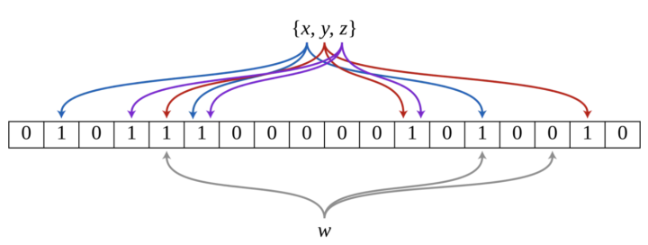
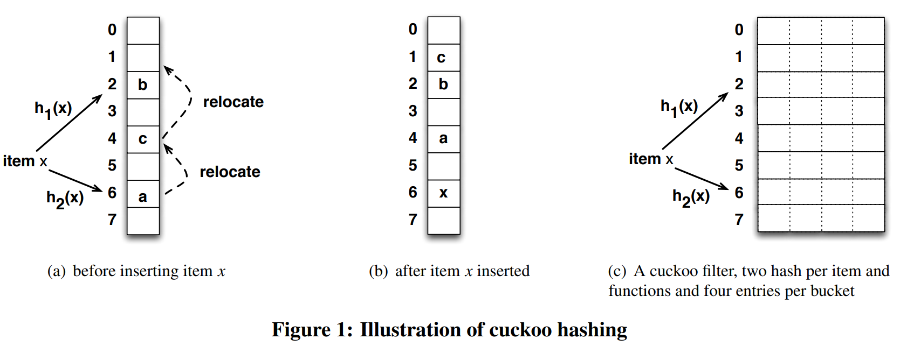

## 布隆过滤器（Bloom Filter）


#### 背景

如果在平时我们要判断一个元素是否在一个集合中，通常会采用查找比较的方法，下面分析不同的数据结构查找效率：

- 采用**线性表存储**，查找时间复杂度为 $O(N)$ ；
- 采用**平衡二叉排序树**（AVL、红黑树）存储，查找时间复杂度为 $O(logN)$ ；
- 采用**哈希表存储**，考虑到哈希碰撞，整体时间复杂度也要 $O[log(n/m)]$ ；

当需要判断一个元素是否存在于海量数据集合中，不仅查找时间慢，还会占用大量存储空间，接下来看一下布隆过滤器如何解决这个问题。


#### 布隆过滤器

布隆过滤器是一种空间效率很高的随机数据结构，专门用来检测集合中是否存在特定的元素。布隆过滤器由一个长度为 $m$ 比特的位数组与 $k$ 个独立的哈希函数组成的数据结构。位数组初始化均为 $0$ ，所有的哈希函数都可以分别把输入数据尽量均匀地散列。当要向布隆过滤器中插入一个元素时，该元素经过 $k$ 个哈希函数计算产生 $k$ 个哈希值，以哈希值作为位数组中的下标，将所有 $k$ 个对应的比特值由 $0$ 置为 $1$ 。当要查询一个元素时，同样将其经过哈希函数计算产生哈希值，然后检查对应的 $k$ 个比特值：

- 如果有任意一个比特为 $0$ ，表明该元素一定不在集合中；
- 如果所有比特均为 $1$ ，表明该元素有可能性在集合中；

由于可能出现哈希碰撞，不同元素计算的哈希值有可能一样，导致一个不存在的元素有可能对应的比特位为 $1$ ，这就是所谓“假阳性”（**false positive**）。相对地，“假阴性”（**false negative**）在 **BF** 中是绝不会出现的。因此，**Bloom Filter**不适合那些“零错误”的应用场合。而在能容忍低错误率的应用场合下，**Bloom Filter**通过极少的错误换取了存储空间的极大节省。

> 布隆过滤器认为不在的，一定不会在集合中；布隆过滤器认为在的，不一定存在集合中。


#### 算法实现步骤

1. 选取 $k$ 个哈希函数，记为 ${h_1,h_2,…,h_k}$ ，至于参数 $k$ 的选择问题，我后面再说。
2. 假设现在有 $n$ 个元素需要被映射到 `bit` 数组中，`bit` 数组的长度是 $m$ 。初始时，将 $m$ 位的 `bit` 数组的每个位置的元素都置为 $0$ 。一样地，关于参数 $m$ 的选择我之后说。
3. 现在，把这个 $n$ 个元素依次用第 $1$ 步选取的 $k$ 个哈希函数映射到 `bit` 数组的位置上，`bit` 数组被映射到的位置的元素变为 $1$ 。显然，一个元素能被映射到 $k$ 个位置上。过程如图所示，现在把元素集合 ${x,y,z}$ 通过 $3$ 个哈希函数映射到一个二进制数组中。
4. 最后，需要检查一个元素是否在已有的集合中时，同样用这 $k$ 个哈希函数把要判断的元素映射到 `bit` 数组的位置上，只要 `bit` 数组被映射到的位中有一个位不是 $1$ ，那一定说明了这个元素不在已有的集合内。如图所示，检查 $w$ 是否在集合中时，有一个哈希函数将 $w$ 映射到了 `bit` 数组的元素为 $0$ 的位置。




#### 布隆过滤器优缺点

- **优点**
  - 节省空间：不需要存储数据本身，只需要存储数据对应 `hash` 比特位；
  - 时间复杂度低：插入和查找的时间复杂度都为 $O(k)$ ， $k$ 为哈希函数的个数；
- **缺点**
  - 存在假阳性：布隆过滤器判断存在，但可能出现元素实际上不在集合中的情况；误判率取决于哈希函数的个数，对于哈希函数的个数选择，我们第4部分会讲；
  - 不支持删除元素：如果一个元素被删除，但是却不能从布隆过滤器中删除，这也是存在假阳性的原因之一；


#### 参数选择

假设 $E$ 表示错误率，$n$ 表示要插入的元素个数，$m$ 表示 `bit` 数组的长度，$k$ 表示 `hash` 函数的个数。

1. 当 `hash` 函数个数 $k = \frac{m \cdot ln2}{n}$ 时，错误率 $E$ 最小（此时 `bit` 数组中有一半的值为 $0$ ）。
2. 在错误率不大于 $E$ 的情况下，`bit` 数组的长度 $m$ 需要满足的条件为：$m \geq n \cdot lg(\frac{1}{E})$ 。
3. 结合上面两个公式，在 `hash` 函数个数 $k$ 取到最优时，要求错误率不大于 $E$ ，这时我们对 `bit` 数组长度 $m$ 的要求是：$m \geq n \cdot log_2(\frac{1}{E}) \cdot log_2(e)$ ，也就是 $m \geq 1.44n \cdot log_2(\frac{1}{E})$ 。

- https://blog.csdn.net/guoziqing506/article/details/52852515


#### 布隆过滤器的应用场景

- 爬虫系统 URL 去重
- 垃圾邮件过滤
- 黑名单


#### 如何解决布隆过滤器不支持删除的问题

1. **counting bloom filter**

   **Counting Bloom Filter** 将标准 **Bloom Filter** 位数组的每一位扩展为一个小的计数器（`Counter`），在插入元素时给对应的 $k$（ $k$ 为哈希函数个数）个 `Counter` 的值分别加 $1$ ，删除元素时给对应的 $k$ 个 `Counter` 的值分别减 $1$ 。**Counting Bloom Filter** 通过多占用几倍的存储空间的代价，给 **Bloom Filter** 增加了删除操作。

2. **布谷鸟过滤器**（**Cuckoo Filter**）
   - [Cuckoo Filter: Practically Better Than Bloom](https://www.cs.cmu.edu/~dga/papers/cuckoo-conext2014.pdf)
   - https://www.cs.tau.ac.il/~shanir/advanced-seminar-data-structures-2009/bib/pagh01cuckoo.pdf


## 布谷鸟过滤器（Cuckoo Filter）

- https://www.cnblogs.com/zhaodongge/p/15067657.html
- https://www.cs.cmu.edu/~dga/papers/cuckoo-conext2014.pdf
- https://github.com/seiflotfy/cuckoofilter


#### Cuckoo filter（布谷过滤器）的优点

1. 支持动态添加和删除元素。
2. 比布隆过滤器具有更高的性能。



对于布谷过滤器而言,采用的不是位数组，而是桶数组，每一行即为一个 `bucket` ，且每个 `bucket` 都有4个空间。每个元素 `item` 都有两个 **hash function** 决定候选 `bucket` 。


#### 插入元素

```go
bucket1 := h1(x)
bucket2 := h2(x)
```

- 如果 `bucket1` 和 `bucket2` 中有一个候选桶是 `empty` ，则选择空的候选桶插入。

- **relocate**：

  如果 `bucket1` 和 `bucket2` 中没有一个候选桶是 `empty` ，则选择其中一个候选桶 `b` ，然后先将该桶的原元素插入到它对应的另外一个候选桶中，如果另外一个候选桶不是空的则递归执行该过程，然后再将 `x` 插入到候选桶 `b` 中。

  > **Until a maximum number of displacements is reached (e.g.500 times in our implementation ). If no vacant bucket is found, this hash table is considered too full to insert.)**

- 其平均时间复杂度为 $O(1)$

> **practical implementation:** 会在上述的基础上，使得每个 `bucket` 可以存放多个 `item`，如图 1-c 所示。


#### 查找元素

- 检查 `h1(x)` 和 `h2(x)` 所对应的桶中是否包含这个元素，只要其中一个桶包含这个元素即可。


#### 删除元素

- 删除元素与查找元素相同，但是需要注意的是，查找和删除都会发生一件事，那就是**假阳性**。考虑一个极端情况，$x$ 和 $y$ 有相同的映射路径，即 `fingerprint` ，那么当只有其中一个存在在集合中时，另一个也会在查找中显示**存在**，同样也可以被删除。


#### 缺点

- **删除不完美，存在误删的概率。**删除的时候知识删除了一份指纹副本，并不能确定此指纹副本是要删除的 `key` 的指纹。同时这个问题也导致了假阳性的情况。
- **插入复杂度比较高。**随着插入元素的增多，复杂度会越来越高，因为存在桶满，踢出的操作，所以需要重新计算，但综合来讲复杂度还是常数级别。
- **存储空间的大小必须为2的指数**的限制让空间效率打了折扣。
- **同一个元素最多插入kb次**，（ `k` 指哈希函数的个数，`b` 指的桶中能装指纹的个数也可以说是桶的尺寸大小）如果布谷鸟过滤器支持删除，则必须存储同一项的多个副本。 插入同一项 `kb+1` 次将导致插入失败。 这类似于计数布隆过滤器，其中重复插入会导致计数器溢出。


## Xor过滤器（XOR Filter）

- https://zhuanlan.zhihu.com/p/543943112