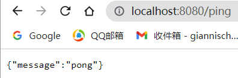

## gin框架的使用

- https://github.com/EDDYCJY/go-gin-example
- https://segmentfault.com/a/1190000013297625


### 准备

**vendor**

```shell
go mod vendor
```

**gin**

```shell
go get -u github.com/gin-gonic/gin
```

**验证**

```go
func TestGinExists(t *testing.T) {
	r := gin.Default()
	r.GET("/ping", func(c *gin.Context) {
		c.JSON(200, gin.H{
			"message": "pong",
		})
	})
	r.Run(":8080")
}
```




### 项目初始化


#### **项目目录**

```shell
gin-blog/
├── conf
├── middleware
├── models
├── pkg
├── routers
└── runtime
```

- **conf**：用于存储配置文件
- **middleware**：应用中间件
- **models**：应用数据库模型
- **pkg**：第三方包
- **routers**：路由逻辑处理
- **runtime**：应用运行时数据


#### 项目数据库

我们顽固地继续用`ClickHouse`做数据库（才不是因为我懒~），首先创建`blog`数据库：

```sql
CREATE DATABASE blog;
```

在`blog`数据库下，新建以下表：

**标签表**

```sql
CREATE TABLE blog_tag
(
    `id` UUID NOT NULL,
    `name` String DEFAULT '' COMMENT '标签名称',
    `created_on` DateTime64 DEFAULT '0' COMMENT '创建时间',
    `created_by` String DEFAULT '' COMMENT '创建人',
    `modified_on` DateTime64 DEFAULT '0' COMMENT '修改时间',
    `modified_by` String DEFAULT '' COMMENT '修改人',
    `deleted_on` DateTime64 DEFAULT '0',
    `state` UInt8 DEFAULT '1' COMMENT '状态 0为禁用、1为启用'
)
ENGINE = MergeTree
ORDER BY id
```

**文章表**

```sql
CREATE TABLE blog_article
(
    `id` UUID NOT NULL,
    `tag_id` UUID DEFAULT '00000000-0000-0000-0000-000000000000' COMMENT '标签ID',
    `title` String DEFAULT '' COMMENT '文章标题',
    `desc` String DEFAULT '' COMMENT '简述',
    `content` String,
    `created_on` DateTime64 DEFAULT '0',
    `created_by` String DEFAULT '' COMMENT '创建人',
    `modified_on` DateTime64 DEFAULT '0' COMMENT '修改时间',
    `modified_by` String DEFAULT '' COMMENT '修改人',
    `deleted_on` DateTime64 DEFAULT '0',
    `state` UInt8 DEFAULT '1' COMMENT '状态 0为禁用1为启用'
)
ENGINE = MergeTree
ORDER BY id
```

**认证表**

```sql
CREATE TABLE blog_auth
(
    `id` UUID NOT NULL,
    `username` String DEFAULT '' COMMENT '账号',
    `password` String DEFAULT '' COMMENT '密码'
)
ENGINE = MergeTree
ORDER BY id
```

```sql
INSERT INTO blog.blog_auth (`id`, `username`, `password`) VALUES ('00000000-0000-0000-0000-000000000000', 'test', '123456');
```


#### 项目配置

之前使用了`Viper`，这次使用`ini`，https://github.com/go-ini/ini

```shell
go get -u github.com/go-ini/ini
```

我们需要编写基础的应用配置文件，在`gin-blog`的`conf`目录下新建`app.ini`文件，写入内容：

```ini
#debug or release
RUN_MODE = debug

[app]
PAGE_SIZE = 10
JWT_SECRET = 23347$040412

[server]
HTTP_PORT = 8000
READ_TIMEOUT = 60
WRITE_TIMEOUT = 60

[database]
TYPE = mysql
USER = 数据库账号
PASSWORD = 数据库密码
#127.0.0.1:3306
HOST = 数据库IP:数据库端口号
NAME = blog
TABLE_PREFIX = blog_
```

建立调用配置的`setting`模块，在`gin-blog`的`pkg`目录下新建`setting`目录，新建`setting.go`文件，写入内容：

```go
package setting

import (
	"gopkg.in/ini.v1"
	"log"
	"time"
)

var (
	Cfg          *ini.File
	RunMode      string
	HTTPPort     int
	ReadTimeout  time.Duration
	WriteTimeout time.Duration
	PageSize     int
	JwtSecret    string
)

func init() {
	var err error
	if Cfg, err = ini.Load("conf/app.ini"); err != nil {
		log.Fatalf("Fail to parse 'conf/app.ini': %v", err)
	}
	LoadBase()
	LoadServer()
	LoadApp()
}

func LoadBase() {
	RunMode = Cfg.Section("").Key("RUN_MODE").MustString("debug")
}

func LoadServer() {
	if sec, err := Cfg.GetSection("server"); err != nil {
		log.Fatalf("Fail to get section 'server': %v", err)
	} else {
		HTTPPort = sec.Key("HTTP_PORT").MustInt(8080)
		ReadTimeout = time.Duration(sec.Key("READ_TIMEOUT").MustInt(60)) * time.Second
		WriteTimeout = time.Duration(sec.Key("WRITE_TIMEOUT").MustInt(60)) * time.Second
	}
}

func LoadApp() {
	if sec, err := Cfg.GetSection("app"); err != nil {
		log.Fatalf("Fail to get section 'app': %v", err)
	} else {
		JwtSecret = sec.Key("JWT_SECRET").MustString("!@)*#)!@U#@*!@!)")
		PageSize = sec.Key("PAGE_SIZE").MustInt(10)
	}
}
```

当前的目录结构：

```shell
gin-blog/
├── conf
│   └── app.ini
├── middleware
├── models
├── pkg
│   └── setting
│       └── setting.go
├── routers
├── runtime
```


### 编写API错误提示包

建立错误码的`error`模块，在`gin-blog`的`pkg`目录下新建`error`目录，新建`consts.go`和`messages.go`文件，写入内容：

`consts.go`

```go
package error

const (
	SUCCESS        = 200
	ERROR          = 500
	INVALID_PARAMS = 400

	ERROR_EXIST_TAG         = 10001
	ERROR_NOT_EXIST_TAG     = 10002
	ERROR_NOT_EXIST_ARTICLE = 10003

	ERROR_AUTH_CHECK_TOKEN_FAIL    = 20001
	ERROR_AUTH_CHECK_TOKEN_TIMEOUT = 20002
	ERROR_AUTH_TOKEN               = 20003
	ERROR_AUTH                     = 20004
)

var MsgFlags = map[int]string{
	SUCCESS:                        "ok",
	ERROR:                          "fail",
	INVALID_PARAMS:                 "请求参数错误",
	ERROR_EXIST_TAG:                "已存在该标签名称",
	ERROR_NOT_EXIST_TAG:            "该标签不存在",
	ERROR_NOT_EXIST_ARTICLE:        "该文章不存在",
	ERROR_AUTH_CHECK_TOKEN_FAIL:    "Token鉴权失败",
	ERROR_AUTH_CHECK_TOKEN_TIMEOUT: "Token已超时",
	ERROR_AUTH_TOKEN:               "Token生成失败",
	ERROR_AUTH:                     "Token错误",
}
```

`message.go`

```go
package error

func GetMessage(code int) string {
	if msg, ok := MsgFlags[code]; ok {
		return msg
	} else {
		return MsgFlags[ERROR]
	}
}
```

