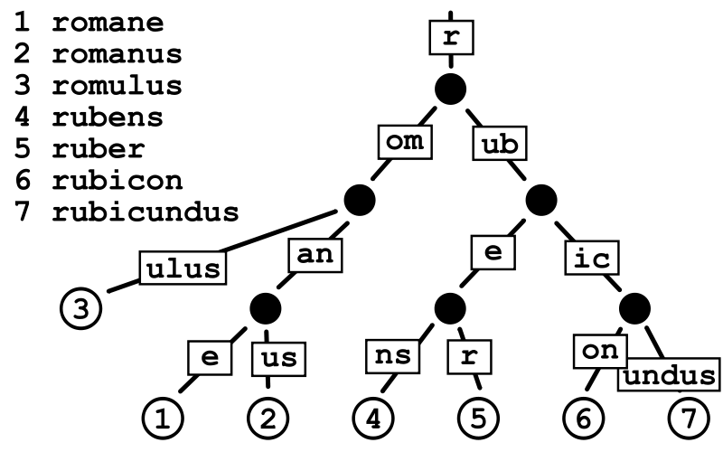
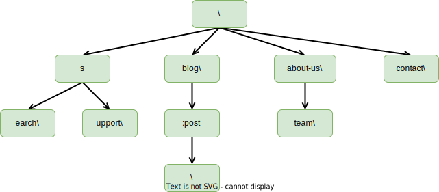
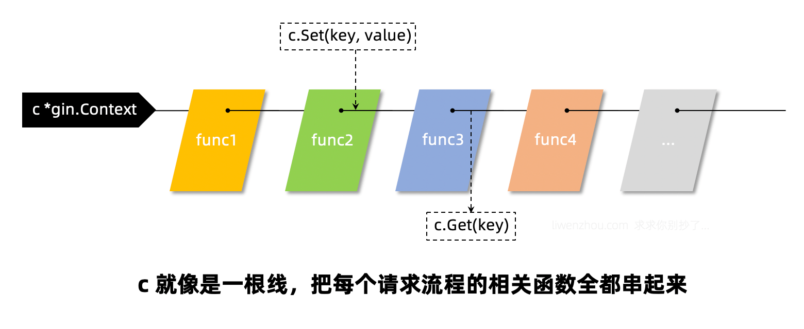

## gin框架

- https://github.com/gin-gonic/gin
- 路由、中间键参考：https://www.liwenzhou.com/posts/Go/gin-sourcecode/


### 前言

我们知道`net/http`默认的服务是这样开启的：

```go
// 注册路由
http.HandleFunc("/index", func(w http.ResponseWriter, r *http.Request) {
    w.Write([]byte("Hello World"))
})

if err := http.ListenAndServe(":8080", nil); err != nil {
    fmt.Println("start http server fail:", err)
}
```

那么我们注册的路由存在哪呢？我们细究一下调用栈：

```go
// HandleFunc registers the handler function for the given pattern
// in the DefaultServeMux.
// The documentation for ServeMux explains how patterns are matched.
func HandleFunc(pattern string, handler func(ResponseWriter, *Request)) {
	DefaultServeMux.HandleFunc(pattern, handler)
}
```

```go
// HandleFunc registers the handler function for the given pattern.
func (mux *ServeMux) HandleFunc(pattern string, handler func(ResponseWriter, *Request)) {
	if handler == nil {
		panic("http: nil handler")
	}
	mux.Handle(pattern, HandlerFunc(handler))
}
```

```go
// Handle registers the handler for the given pattern.
// If a handler already exists for pattern, Handle panics.
func (mux *ServeMux) Handle(pattern string, handler Handler) {
	mux.mu.Lock()
	defer mux.mu.Unlock()

	if pattern == "" {
		panic("http: invalid pattern")
	}
	if handler == nil {
		panic("http: nil handler")
	}
	if _, exist := mux.m[pattern]; exist {
		panic("http: multiple registrations for " + pattern)
	}

	if mux.m == nil {
		mux.m = make(map[string]muxEntry)
	}
	e := muxEntry{h: handler, pattern: pattern}
	mux.m[pattern] = e
	if pattern[len(pattern)-1] == '/' {
		mux.es = appendSorted(mux.es, e)
	}

	if pattern[0] != '/' {
		mux.hosts = true
	}
}
```

我们看到，`mux.m[pattern] = e`这句话起到了存储的作用，再看一下`mux`的数据类型`ServeMux`：

```go
// ServeMux also takes care of sanitizing the URL request path and the Host
// header, stripping the port number and redirecting any request containing . or
// .. elements or repeated slashes to an equivalent, cleaner URL.
type ServeMux struct {
	mu    sync.RWMutex
	m     map[string]muxEntry
	es    []muxEntry // slice of entries sorted from longest to shortest.
	hosts bool       // whether any patterns contain hostnames
}

type muxEntry struct {
	h       Handler
	pattern string
}
```

很直白的`map`类型，但是我们知道`map`并不是最高效的存储方式。是否可以改变，然后提升性能呢？`gin`给了我们一个思路，同样，我们也要感谢`net/http`带来的高可扩展性，可扩展的接口：

```go
// A Handler responds to an HTTP request.
//
// ServeHTTP should write reply headers and data to the ResponseWriter
// and then return. Returning signals that the request is finished; it
// is not valid to use the ResponseWriter or read from the
// Request.Body after or concurrently with the completion of the
// ServeHTTP call.
//
// Depending on the HTTP client software, HTTP protocol version, and
// any intermediaries between the client and the Go server, it may not
// be possible to read from the Request.Body after writing to the
// ResponseWriter. Cautious handlers should read the Request.Body
// first, and then reply.
//
// Except for reading the body, handlers should not modify the
// provided Request.
//
// If ServeHTTP panics, the server (the caller of ServeHTTP) assumes
// that the effect of the panic was isolated to the active request.
// It recovers the panic, logs a stack trace to the server error log,
// and either closes the network connection or sends an HTTP/2
// RST_STREAM, depending on the HTTP protocol. To abort a handler so
// the client sees an interrupted response but the server doesn't log
// an error, panic with the value ErrAbortHandler.
type Handler interface {
	ServeHTTP(ResponseWriter, *Request)
}
```

`gin`的框架是在`net/http`的基础包上拓展而来的，其大体原理是通过实现这个`Handler`接口，重新定义中间件调用链和路由查找方式。这也将是我们接下来关注的两个方面。


### 路由

gin框架使用的是定制版本的[httprouter](https://github.com/julienschmidt/httprouter)，其路由的原理是大量使用公共前缀的树结构，它基本上是一个紧凑的[Trie tree](https://baike.sogou.com/v66237892.htm)（或者只是[Radix Tree](https://baike.sogou.com/v73626121.htm)）。具有公共前缀的节点也共享一个公共父节点。


#### Radix Tree

**基数树**（Radix Tree）又称为**PAT位树**（Patricia Trie or crit bit tree），是一种更节省空间的**前缀树**（Trie Tree）。对于基数树的每个节点，如果该节点是唯一的子树的话，就和父节点合并。下图为一个基数树示例：



`Radix Tree`可以被认为是一棵简洁版的前缀树。我们**注册路由**的过程就是构造前缀树的过程，具有公共前缀的节点也**共享一个公共父节点**。假设我们现在注册有以下路由信息：

```go
r := gin.Default()

r.GET("/", func1)
r.GET("/search/", func2)
r.GET("/support/", func3)
r.GET("/blog/", func4)
r.GET("/blog/:post/", func5)
r.GET("/about-us/", func6)
r.GET("/about-us/team/", func7)
r.GET("/contact/", func8)
```

那么我们会得到一个`GET`方法对应的路由树，具体结构如下：



但是我们需要注意的是，`s`节点和`:post`是空节点，意味着里面不会有任何处理函数。

例如：`blog/:post`其中`:post`只是实际文章名称的占位符（参数）。与`hash-maps`不同，这种树结构还允许我们使用像`:post`参数这种动态部分，因为我们实际上是根据路由模式进行匹配，而不仅仅是比较哈希值（`net/http`）。

由于URL路径具有层次结构，并且只使用有限的一组字符(字节值)，所以很可能有许多常见的前缀。这使我们可以很容易地将路由简化为更小的问题。此外，**路由器为每种请求方法管理一棵单独的树**。一方面，它比在每个节点中都保存一个`method-> handle map`更加节省空间，它还使我们甚至可以在开始在前缀树中查找之前大大减少路由问题。

为了获得更好的可伸缩性，每个树级别上的子节点都按`Priority`（优先级）排序，其中优先级（最左列）就是在子节点（子节点、子子节点等等）中注册的句柄的数量。这样做有两个好处：

1. 首先优先匹配被大多数路由路径包含的节点。这样可以让尽可能多的路由快速被定位。
2. 类似于成本补偿。最长的路径可以被优先匹配，补偿体现在最长的路径需要花费更长的时间来定位，如果最长路径的节点能被优先匹配（即每次拿子节点都命中），那么路由匹配所花的时间不一定比短路径的路由长。下面展示了节点（每个`-`可以看做一个节点）匹配的路径：从左到右，从上到下。

```
   ├------------
   ├---------
   ├-----
   ├----
   ├--
   ├--
   └-
```


#### 路由树节点

我们来看一下具体的实现，首先介绍一下根结点：

```go
type Engine struct {
	RouterGroup
	...
    trees            methodTrees
	...
}

type methodTrees []methodTree

type methodTree struct {
	method string
	root   *node
}
```

不同的路由方法都会分配一棵完整的树和对应的根节点。为什么使用切片而不是map来存储`请求方法->树`的结构呢？我猜是出于节省内存的考虑吧，毕竟HTTP请求方法的数量是固定的，而且常用的就那几种，所以即使使用切片存储查询起来效率也足够了。顺着这个思路，我们可以看一下`gin`框架中`engine`的初始化方法中，确实对`tress`字段做了一次内存申请：

```go
func New() *Engine {
	debugPrintWARNINGNew()
	engine := &Engine{
		RouterGroup: RouterGroup{
			Handlers: nil,
			basePath: "/",
			root:     true,
		},
		// liwenzhou.com ...
		// 初始化容量为9的切片（HTTP1.1请求方法共9种）
		trees:                  make(methodTrees, 0, 9),
		// liwenzhou.com...
	}
	engine.RouterGroup.engine = engine
	engine.pool.New = func() interface{} {
		return engine.allocateContext()
	}
	return engine
}
```

路由树是由一个一个一个节点构成的，`gin`框架路由树的节点由`node`结构体表示，它有以下字段：

```go
type node struct {
	// 节点路径，比如上面的s，earch，和upport
	path      string
	// 和children字段对应, 保存的是分裂的分支的第一个字符
	// 例如search和support, 那么s节点的indices对应的"eu"
	// 代表有两个分支, 分支的首字母分别是e和u
	indices   string
	// 儿子节点
	children  []*node
	// 处理函数链条（切片）
	handlers  HandlersChain
	// 优先级，子节点、子子节点等注册的handler数量
	priority  uint32
	// 节点类型，包括static, root, param, catchAll
	// static: 静态节点（默认），比如上面的s，earch等节点
	// root: 树的根节点
	// catchAll: 有*匹配的节点
	// param: 参数节点
	nType     nodeType
	// 路径上最大参数个数
	maxParams uint8
	// 节点是否是参数节点，比如上面的:post
	wildChild bool
	// 完整路径
	fullPath  string
}
```


#### 路由注册

在gin的路由中，每一个`HTTP Method`(GET、POST、PUT、DELETE…)都对应了一棵 `radix tree`，我们注册路由的时候会调用下面的`addRoute`函数：

```go
// POST is a shortcut for router.Handle("POST", path, handle).
func (group *RouterGroup) POST(relativePath string, handlers ...HandlerFunc) IRoutes {
	return group.handle(http.MethodPost, relativePath, handlers)
}
```

```go
func (group *RouterGroup) handle(httpMethod, relativePath string, handlers HandlersChain) IRoutes {
	absolutePath := group.calculateAbsolutePath(relativePath)
	handlers = group.combineHandlers(handlers)
	group.engine.addRoute(httpMethod, absolutePath, handlers)
	return group.returnObj()
}
```

```go
func (engine *Engine) addRoute(method, path string, handlers HandlersChain) {
	assert1(path[0] == '/', "path must begin with '/'")
	assert1(method != "", "HTTP method can not be empty")
	assert1(len(handlers) > 0, "there must be at least one handler")

	debugPrintRoute(method, path, handlers)

	root := engine.trees.get(method)
	if root == nil {
		root = new(node)
		root.fullPath = "/"
		engine.trees = append(engine.trees, methodTree{method: method, root: root})
	}
	root.addRoute(path, handlers)

	// Update maxParams
	if paramsCount := countParams(path); paramsCount > engine.maxParams {
		engine.maxParams = paramsCount
	}

	if sectionsCount := countSections(path); sectionsCount > engine.maxSections {
		engine.maxSections = sectionsCount
	}
}
```

最关键的还是`addRoute`函数：

```go
// tree.go

// addRoute 将具有给定句柄的节点添加到路径中。
// 不是并发安全的
func (n *node) addRoute(path string, handlers HandlersChain) {
	fullPath := path
	n.priority++
	numParams := countParams(path)  // 数一下参数个数

	// 空树就直接插入当前节点
	if len(n.path) == 0 && len(n.children) == 0 {
		n.insertChild(numParams, path, fullPath, handlers)
		n.nType = root
		return
	}

	parentFullPathIndex := 0

walk:
	for {
		// 更新当前节点的最大参数个数
		if numParams > n.maxParams {
			n.maxParams = numParams
		}

		// 找到最长的通用前缀
		// 这也意味着公共前缀不包含“:”"或“*” /
		// 因为现有键不能包含这些字符。
		i := longestCommonPrefix(path, n.path)

		// 分裂边缘（此处分裂的是当前树节点）
		// 例如一开始path是search，新加入support，s是他们通用的最长前缀部分
		// 那么会将s拿出来作为parent节点，增加earch和upport作为child节点
		if i < len(n.path) {
			child := node{
				path:      n.path[i:],  // 公共前缀后的部分作为子节点
				wildChild: n.wildChild,
				indices:   n.indices,
				children:  n.children,
				handlers:  n.handlers,
				priority:  n.priority - 1, //子节点优先级-1
				fullPath:  n.fullPath,
			}

			// Update maxParams (max of all children)
			for _, v := range child.children {
				if v.maxParams > child.maxParams {
					child.maxParams = v.maxParams
				}
			}

			n.children = []*node{&child}
			// []byte for proper unicode char conversion, see #65
			n.indices = string([]byte{n.path[i]})
			n.path = path[:i]
			n.handlers = nil
			n.wildChild = false
			n.fullPath = fullPath[:parentFullPathIndex+i]
		}

		// 将新来的节点插入新的parent节点作为子节点
		if i < len(path) {
			path = path[i:]

			if n.wildChild {  // 如果是参数节点
				parentFullPathIndex += len(n.path)
				n = n.children[0]
				n.priority++

				// Update maxParams of the child node
				if numParams > n.maxParams {
					n.maxParams = numParams
				}
				numParams--

				// 检查通配符是否匹配
				if len(path) >= len(n.path) && n.path == path[:len(n.path)] {
					// 检查更长的通配符, 例如 :name and :names
					if len(n.path) >= len(path) || path[len(n.path)] == '/' {
						continue walk
					}
				}

				pathSeg := path
				if n.nType != catchAll {
					pathSeg = strings.SplitN(path, "/", 2)[0]
				}
				prefix := fullPath[:strings.Index(fullPath, pathSeg)] + n.path
				panic("'" + pathSeg +
					"' in new path '" + fullPath +
					"' conflicts with existing wildcard '" + n.path +
					"' in existing prefix '" + prefix +
					"'")
			}
			// 取path首字母，用来与indices做比较
			c := path[0]

			// 处理参数后加斜线情况
			if n.nType == param && c == '/' && len(n.children) == 1 {
				parentFullPathIndex += len(n.path)
				n = n.children[0]
				n.priority++
				continue walk
			}

			// 检查路path下一个字节的子节点是否存在
			// 比如s的子节点现在是earch和upport，indices为eu
			// 如果新加一个路由为super，那么就是和upport有匹配的部分u，将继续分列现在的upport节点
			for i, max := 0, len(n.indices); i < max; i++ {
				if c == n.indices[i] {
					parentFullPathIndex += len(n.path)
					i = n.incrementChildPrio(i)
					n = n.children[i]
					continue walk
				}
			}

			// 否则就插入
			if c != ':' && c != '*' {
				// []byte for proper unicode char conversion, see #65
				// 注意这里是直接拼接第一个字符到n.indices
				n.indices += string([]byte{c})
				child := &node{
					maxParams: numParams,
					fullPath:  fullPath,
				}
				// 追加子节点
				n.children = append(n.children, child)
				n.incrementChildPrio(len(n.indices) - 1)
				n = child
			}
			n.insertChild(numParams, path, fullPath, handlers)
			return
		}

		// 已经注册过的节点
		if n.handlers != nil {
			panic("handlers are already registered for path '" + fullPath + "'")
		}
		n.handlers = handlers
		return
	}
}
```

其实上面的代码很好理解，大家可以参照动画尝试将以下情形代入上面的代码逻辑，体味整个路由树构造的详细过程：

1. 第一次注册路由，例如注册`search`；
2. 继续注册一条没有公共前缀的路由，例如`blog`；
3. 注册一条与先前注册的路由有公共前缀的路由，例如`support`；


这里出现了另一个问题，通配符怎么处理呢？交由`insertChild`来处理罢：

```go
// tree.go
func (n *node) insertChild(numParams uint8, path string, fullPath string, handlers HandlersChain) {
  // 找到所有的参数
	for numParams > 0 {
		// 查找前缀直到第一个通配符
		wildcard, i, valid := findWildcard(path)
		if i < 0 { // 没有发现通配符
			break
		}

		// 通配符的名称必须包含':' 和 '*'
		if !valid {
			panic("only one wildcard per path segment is allowed, has: '" +
				wildcard + "' in path '" + fullPath + "'")
		}

		// 检查通配符是否有名称
		if len(wildcard) < 2 {
			panic("wildcards must be named with a non-empty name in path '" + fullPath + "'")
		}

		// 检查这个节点是否有已经存在的子节点
		// 如果我们在这里插入通配符，这些子节点将无法访问
		if len(n.children) > 0 {
			panic("wildcard segment '" + wildcard +
				"' conflicts with existing children in path '" + fullPath + "'")
		}

		if wildcard[0] == ':' { // param
			if i > 0 {
				// 在当前通配符之前插入前缀
				n.path = path[:i]
				path = path[i:]
			}

			n.wildChild = true
			child := &node{
				nType:     param,
				path:      wildcard,
				maxParams: numParams,
				fullPath:  fullPath,
			}
			n.children = []*node{child}
			n = child
			n.priority++
			numParams--

			// 如果路径没有以通配符结束
			// 那么将有另一个以'/'开始的非通配符子路径。
			if len(wildcard) < len(path) {
				path = path[len(wildcard):]

				child := &node{
					maxParams: numParams,
					priority:  1,
					fullPath:  fullPath,
				}
				n.children = []*node{child}
				n = child  // 继续下一轮循环
				continue
			}

			// 否则我们就完成了。将处理函数插入新叶子中
			n.handlers = handlers
			return
		}

		// catchAll
		if i+len(wildcard) != len(path) || numParams > 1 {
			panic("catch-all routes are only allowed at the end of the path in path '" + fullPath + "'")
		}

		if len(n.path) > 0 && n.path[len(n.path)-1] == '/' {
			panic("catch-all conflicts with existing handle for the path segment root in path '" + fullPath + "'")
		}

		// currently fixed width 1 for '/'
		i--
		if path[i] != '/' {
			panic("no / before catch-all in path '" + fullPath + "'")
		}

		n.path = path[:i]
		
		// 第一个节点:路径为空的catchAll节点
		child := &node{
			wildChild: true,
			nType:     catchAll,
			maxParams: 1,
			fullPath:  fullPath,
		}
		// 更新父节点的maxParams
		if n.maxParams < 1 {
			n.maxParams = 1
		}
		n.children = []*node{child}
		n.indices = string('/')
		n = child
		n.priority++

		// 第二个节点:保存变量的节点
		child = &node{
			path:      path[i:],
			nType:     catchAll,
			maxParams: 1,
			handlers:  handlers,
			priority:  1,
			fullPath:  fullPath,
		}
		n.children = []*node{child}

		return
	}

	// 如果没有找到通配符，只需插入路径和句柄
	n.path = path
	n.handlers = handlers
	n.fullPath = fullPath
}
```

`insertChild`函数是根据`path`本身进行分割，将`/`分开的部分分别作为节点保存，形成一棵树结构。参数匹配中的`:`和`*`的区别是，前者是匹配一个字段而后者是匹配后面所有的路径。


#### 路由匹配

我们先来看`gin`框架处理请求的入口函数`ServeHTTP`：

```go
// gin.go
func (engine *Engine) ServeHTTP(w http.ResponseWriter, req *http.Request) {
  // 这里使用了对象池
	c := engine.pool.Get().(*Context)
  // 这里有一个细节就是Get对象后做初始化
	c.writermem.reset(w)
	c.Request = req
	c.reset()

	engine.handleHTTPRequest(c)  // 我们要找的处理HTTP请求的函数

	engine.pool.Put(c)  // 处理完请求后将对象放回池子
}
```

函数很长，这里省略了部分代码，只保留相关逻辑代码：

```go
// gin.go
func (engine *Engine) handleHTTPRequest(c *Context) {
	...

	// 根据请求方法找到对应的路由树
	t := engine.trees
	for i, tl := 0, len(t); i < tl; i++ {
		if t[i].method != httpMethod {
			continue
		}
		root := t[i].root
		// 在路由树中根据path查找
		value := root.getValue(rPath, c.Params, unescape)
		if value.handlers != nil {
			c.handlers = value.handlers
			c.Params = value.params
			c.fullPath = value.fullPath
			c.Next()  // 执行函数链条
			c.writermem.WriteHeaderNow()
			return
		}
	
	...
	c.handlers = engine.allNoRoute
	serveError(c, http.StatusNotFound, default404Body)
}
```

路由匹配是由节点的 `getValue`方法实现的。`getValue`根据给定的路径（键）返回`nodeValue`值，保存注册的处理函数和匹配到的路径参数数据。

如果找不到任何处理函数，则会尝试TSR（尾随斜杠重定向）。

代码虽然很长，但还算比较工整。大家可以借助注释看一下路由查找及参数匹配的逻辑。

```go
// tree.go

type nodeValue struct {
	handlers HandlersChain
	params   Params  // []Param
	tsr      bool
	fullPath string
}

// liwenzhou.com...

func (n *node) getValue(path string, po Params, unescape bool) (value nodeValue) {
	value.params = po
walk: // Outer loop for walking the tree
	for {
		prefix := n.path
		if path == prefix {
			// 我们应该已经到达包含处理函数的节点。
			// 检查该节点是否注册有处理函数
			if value.handlers = n.handlers; value.handlers != nil {
				value.fullPath = n.fullPath
				return
			}

			if path == "/" && n.wildChild && n.nType != root {
				value.tsr = true
				return
			}

			// 没有找到处理函数 检查这个路径末尾+/ 是否存在注册函数
			indices := n.indices
			for i, max := 0, len(indices); i < max; i++ {
				if indices[i] == '/' {
					n = n.children[i]
					value.tsr = (len(n.path) == 1 && n.handlers != nil) ||
						(n.nType == catchAll && n.children[0].handlers != nil)
					return
				}
			}

			return
		}

		if len(path) > len(prefix) && path[:len(prefix)] == prefix {
			path = path[len(prefix):]
			// 如果该节点没有通配符(param或catchAll)子节点
			// 我们可以继续查找下一个子节点
			if !n.wildChild {
				c := path[0]
				indices := n.indices
				for i, max := 0, len(indices); i < max; i++ {
					if c == indices[i] {
						n = n.children[i] // 遍历树
						continue walk
					}
				}

				// 没找到
				// 如果存在一个相同的URL但没有末尾/的叶子节点
				// 我们可以建议重定向到那里
				value.tsr = path == "/" && n.handlers != nil
				return
			}

			// 根据节点类型处理通配符子节点
			n = n.children[0]
			switch n.nType {
			case param:
				// find param end (either '/' or path end)
				end := 0
				for end < len(path) && path[end] != '/' {
					end++
				}

				// 保存通配符的值
				if cap(value.params) < int(n.maxParams) {
					value.params = make(Params, 0, n.maxParams)
				}
				i := len(value.params)
				value.params = value.params[:i+1] // 在预先分配的容量内扩展slice
				value.params[i].Key = n.path[1:]
				val := path[:end]
				if unescape {
					var err error
					if value.params[i].Value, err = url.QueryUnescape(val); err != nil {
						value.params[i].Value = val // fallback, in case of error
					}
				} else {
					value.params[i].Value = val
				}

				// 继续向下查询
				if end < len(path) {
					if len(n.children) > 0 {
						path = path[end:]
						n = n.children[0]
						continue walk
					}

					// ... but we can't
					value.tsr = len(path) == end+1
					return
				}

				if value.handlers = n.handlers; value.handlers != nil {
					value.fullPath = n.fullPath
					return
				}
				if len(n.children) == 1 {
					// 没有找到处理函数. 检查此路径末尾加/的路由是否存在注册函数
					// 用于 TSR 推荐
					n = n.children[0]
					value.tsr = n.path == "/" && n.handlers != nil
				}
				return

			case catchAll:
				// 保存通配符的值
				if cap(value.params) < int(n.maxParams) {
					value.params = make(Params, 0, n.maxParams)
				}
				i := len(value.params)
				value.params = value.params[:i+1] // 在预先分配的容量内扩展slice
				value.params[i].Key = n.path[2:]
				if unescape {
					var err error
					if value.params[i].Value, err = url.QueryUnescape(path); err != nil {
						value.params[i].Value = path // fallback, in case of error
					}
				} else {
					value.params[i].Value = path
				}

				value.handlers = n.handlers
				value.fullPath = n.fullPath
				return

			default:
				panic("invalid node type")
			}
		}

		// 找不到，如果存在一个在当前路径最后添加/的路由
		// 我们会建议重定向到那里
		value.tsr = (path == "/") ||
			(len(prefix) == len(path)+1 && prefix[len(path)] == '/' &&
				path == prefix[:len(prefix)-1] && n.handlers != nil)
		return
	}
}
```


### 中间件

`gin`框架涉及中间件相关有4个常用的方法，它们分别是`c.Next()`、`c.Abort()`、`c.Set()`、`c.Get()`。


#### 中间件注册

`gin`框架中的中间件设计很巧妙，我们可以首先从我们最常用的`r := gin.Default()`的`Default`函数开始看，它内部构造一个新的`engine`之后就通过`Use()`函数注册了`Logger`中间件和`Recovery`中间件：

```go
func Default() *Engine {
	debugPrintWARNINGDefault()
	engine := New()
	engine.Use(Logger(), Recovery())  // 默认注册的两个中间件
	return engine
}
```

```go
func (engine *Engine) Use(middleware ...HandlerFunc) IRoutes {
	engine.RouterGroup.Use(middleware...)  // 实际上还是调用的RouterGroup的Use函数
	engine.rebuild404Handlers()
	engine.rebuild405Handlers()
	return engine
}
```

从下方的代码可以看出，注册中间件其实就是将中间件函数追加到`group.Handlers`中：

```go
// Use adds middleware to the group, see example code in GitHub.
func (group *RouterGroup) Use(middleware ...HandlerFunc) IRoutes {
	group.Handlers = append(group.Handlers, middleware...)
	return group.returnObj()
}
```

而我们注册路由时会将对应路由的函数和之前的中间件函数结合到一起：

```go
func (group *RouterGroup) handle(httpMethod, relativePath string, handlers HandlersChain) IRoutes {
	absolutePath := group.calculateAbsolutePath(relativePath)
	handlers = group.combineHandlers(handlers)
	group.engine.addRoute(httpMethod, absolutePath, handlers)
	return group.returnObj()
}
```

其中结合操作的函数内容如下，注意观察这里是如何实现拼接两个切片得到一个新切片的：

```go
// abortIndex represents a typical value used in abort functions.
const abortIndex int8 = math.MaxInt8 >> 1

func (group *RouterGroup) combineHandlers(handlers HandlersChain) HandlersChain {
	finalSize := len(group.Handlers) + len(handlers)
	assert1(finalSize < int(abortIndex), "too many handlers")
	mergedHandlers := make(HandlersChain, finalSize)
	copy(mergedHandlers, group.Handlers)
	copy(mergedHandlers[len(group.Handlers):], handlers)
	return mergedHandlers
}
```

也就是说，我们会将一个路由的中间件函数和处理函数结合到一起组成一条处理函数链条`HandlersChain`，而它本质上就是一个由`HandlerFunc`组成的切片：

```go
type HandlersChain []HandlerFunc
```


#### 中间件执行

我们在上面路由匹配的时候见过如下逻辑：

```go
value := root.getValue(rPath, c.Params, unescape)
if value.handlers != nil {
  c.handlers = value.handlers
  c.Params = value.params
  c.fullPath = value.fullPath
  c.Next()  // 执行函数链条
  c.writermem.WriteHeaderNow()
  return
}
```

其中`c.Next()`就是很关键的一步，它的代码很简单：

```go
func (c *Context) Next() {
	c.index++
	for c.index < int8(len(c.handlers)) {
		c.handlers[c.index](c)
		c.index++
	}
}
```

从上面的代码可以看到，这里通过索引遍历`HandlersChain`链条，从而实现依次调用该路由的每一个函数（中间件或处理请求的函数）。


我们可以在中间件函数中通过再次调用`c.Next()`实现嵌套调用（`func1`中调用`func2`；`func2`中调用`func3`）：


或者通过调用`c.Abort()`中断整个调用链条，从当前函数返回。

```go
func (c *Context) Abort() {
	c.index = abortIndex  // 直接将索引置为最大限制值，从而退出循环
}
```

那么，`Context`长啥样呢：

```go
// Context is the most important part of gin. It allows us to pass variables between middleware,
// manage the flow, validate the JSON of a request and render a JSON response for example.
type Context struct {
	writermem responseWriter
	Request   *http.Request
	Writer    ResponseWriter

	Params   Params
	handlers HandlersChain
	index    int8
	fullPath string

	engine       *Engine
	params       *Params
	skippedNodes *[]skippedNode

	// This mutex protects Keys map.
	mu sync.RWMutex

	// Keys is a key/value pair exclusively for the context of each request.
	Keys map[string]any

	// Errors is a list of errors attached to all the handlers/middlewares who used this context.
	Errors errorMsgs

	// Accepted defines a list of manually accepted formats for content negotiation.
	Accepted []string

	// queryCache caches the query result from c.Request.URL.Query().
	queryCache url.Values

	// formCache caches c.Request.PostForm, which contains the parsed form data from POST, PATCH,
	// or PUT body parameters.
	formCache url.Values

	// SameSite allows a server to define a cookie attribute making it impossible for
	// the browser to send this cookie along with cross-site requests.
	sameSite http.SameSite
}
```

`c.Set()`和`c.Get()`这两个方法多用于在多个函数之间通过`c`传递数据的，比如我们可以在认证中间件中获取当前请求的相关信息（userID等）通过`c.Set()`存入`c`，然后在后续处理业务逻辑的函数中通过`c.Get()`来获取当前请求的用户。`c`就像是一根绳子，将该次请求相关的所有的函数都串起来了。




### 总结

1. `gin`框架路由使用前缀树，路由注册的过程是构造前缀树的过程，路由匹配的过程就是查找前缀树的过程。
2. `gin`框架的中间件函数和处理函数是以切片形式的调用链条存在的，我们可以顺序调用也可以借助`c.Next()`方法实现嵌套调用。
3. 借助`c.Set()`和`c.Get()`方法我们能够在不同的中间件函数中传递数据。