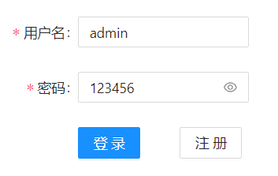

# Gin框架的使用


### 前言

参考资料：

- https://github.com/kone-net/go-chat
- https://www.bilibili.com/video/BV1524y1Q7gZ

```shell
├── app				后端
├── web				前端
│   └── ...		   前端细节 
└── go.mod
```


### 前端

- [前端技术栈](https://github.com/kone-net/go-chat#%E5%89%8D%E7%AB%AF)

由于不是前端开发，我们将使用[go-chat](https://github.com/kone-net/go-chat)的前端代码，结合**JAVA之父**的课程视频做后端的完善。简单启动一下[前端](https://github.com/kone-net/go-chat-web)：

```shell
cd web && npm install --registry=https://registry.npmmirror.com
```

如果后端地址或者端口号需要修改，修改`src/chat/common/param/Params.jsx`里面的`IP_PORT`。

开启，目前默认为`3000`：

```shell
# under dir ./goChat/web
npm start
```

```shell
Compiled successfully!                           
                                                 
You can now view chat-room in the browser.       
                                                 
  Local:            http://localhost:3000        
  On Your Network:  http://192.168.174.1:3000    
                                                 
Note that the development build is not optimized.
To create a production build, use yarn build.    
```

访问前端入口：

```http
http://127.0.0.1:3000/login
```




## 后端

将有几个独立的`markdown`组合而成。


### 日志

- [Gin-02-Logger.md](./Gin-02-Logger.md)


