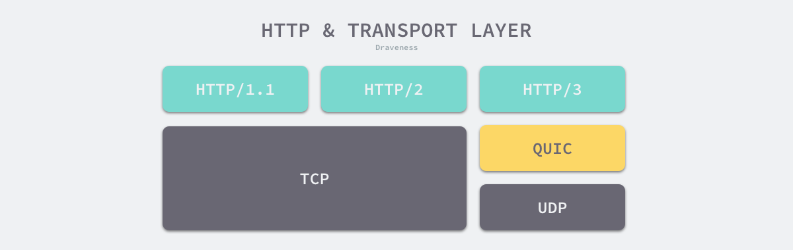
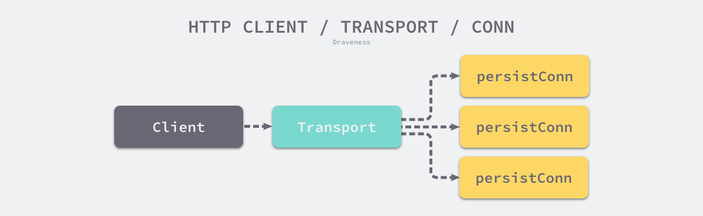
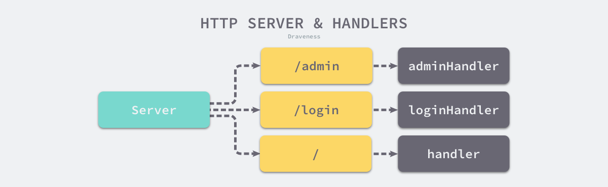

## HTTP

- reference: https://draveness.me/golang/docs/part4-advanced/ch09-stdlib/golang-net-http/


### HTTP 简介

超文本传输协议（Hypertext Transfer Protocol、HTTP 协议）是今天使用最广泛的应用层协议，1989 年由 Tim Berners-Lee 在 CERN 起草的协议已经成为了互联网的数据传输的核心[1](https://draveness.me/golang/docs/part4-advanced/ch09-stdlib/golang-net-http/#fn:1)。在过去几年的时间里，HTTP/2 和 HTTP/3 也对现有的协议进行了更新，提供更加安全和快速的传输功能。多数的编程语言都会在标准库中实现 HTTP/1.1 和 HTTP/2.0 已满足工程师的日常开发需求，今天要介绍的 Go 语言的网络库也实现了这两个大版本的 HTTP 协议。


### 设计原理

HTTP 协议是应用层协议，在通常情况下我们都会使用 TCP 作为底层的传输层协议传输数据包，但是 HTTP/3 在 UDP 协议上实现了新的传输层协议 QUIC 并使用 QUIC 传输数据，这也意味着 HTTP 既可以跑在 TCP 上，也可以跑在 UDP 上。



Go 语言标准库通过 [`net/http`](https://golang.org/pkg/net/http/) 包提供 HTTP 的客户端和服务端实现，在分析内部的实现原理之前，我们先来了解一下 HTTP 协议相关的一些设计以及标准库内部的层级结构和模块之间的关系。


#### 请求和响应

HTTP 协议中最常见的概念是 HTTP 请求与响应，我们可以将它们理解成客户端和服务端之间传递的消息，客户端向服务端发送 HTTP 请求，服务端收到 HTTP 请求后会做出计算后以 HTTP 响应的形式发送给客户端。


与其他的二进制协议不同，作为文本传输协议，HTTP 协议的协议头都是文本数据，HTTP 请求头的首行会包含请求的方法、路径和协议版本，接下来是多个 HTTP 协议头以及携带的负载。

```http
GET / HTTP/1.1
User-Agent: Mozilla/4.0 (compatible; MSIE5.01; Windows NT)
Host: draveness.me
Accept-Language: en-us
Accept-Encoding: gzip, deflate
Content-Length: <length>
Connection: Keep-Alive

<html>
    ...
</html>
```

HTTP 响应也有着比较类似的结构，其中也包含响应的协议版本、状态码、响应头以及负载，在这里就不展开介绍了。


#### 消息边界

HTTP 协议目前主要还是跑在 TCP 协议上的，TCP 协议是面向连接的、可靠的、基于字节流的传输层通信协议[2](https://draveness.me/golang/docs/part4-advanced/ch09-stdlib/golang-net-http/#fn:2)，应用层交给 TCP 协议的数据并不会以消息为单位向目的主机传输，这些数据在某些情况下会被组合成一个数据段发送给目标的主机[3](https://draveness.me/golang/docs/part4-advanced/ch09-stdlib/golang-net-http/#fn:3)。因为 TCP 协议是基于字节流的，所以基于 TCP 协议的应用层协议都需要自己划分消息的边界。


在应用层协议中，最常见的两种解决方案是基于长度或者基于终结符（Delimiter）。HTTP 协议其实同时实现了上述两种方案，在多数情况下 HTTP 协议都会在协议头中加入 `Content-Length` 表示负载的长度，消息的接收者解析到该协议头之后就可以确定当前 HTTP 请求/响应结束的位置，分离不同的 HTTP 消息，下面就是一个使用 `Content-Length` 划分消息边界的例子：

```html
HTTP/1.1 200 OK
Content-Type: text/html; charset=UTF-8
Content-Length: 138
...
Connection: close

<html>
  <head>
    <title>An Example Page</title>
  </head>
  <body>
    <p>Hello World, this is a very simple HTML document.</p>
  </body>
</html>
```

不过 HTTP 协议除了使用基于长度的方式实现边界，也会使用基于终结符的策略，当 HTTP 使用块传输（Chunked Transfer）机制时，HTTP 头中就不再包含 `Content-Length` 了，它会使用负载大小为 0 的 HTTP 消息作为终结符表示消息的边界。


#### 层级结构

Go 语言的 [`net/http`](https://golang.org/pkg/net/http/) 中同时包好了 HTTP 客户端和服务端的实现，为了支持更好的扩展性，它引入了 [`net/http.RoundTripper`](https://draveness.me/golang/tree/net/http.RoundTripper) 和 [`net/http.Handler`](https://draveness.me/golang/tree/net/http.Handler) 两个接口。[`net/http.RoundTripper`](https://draveness.me/golang/tree/net/http.RoundTripper) 是用来表示执行 HTTP 请求的接口，调用方将请求作为参数可以获取请求对应的响应，而 [`net/http.Handler`](https://draveness.me/golang/tree/net/http.Handler) 主要用于 HTTP 服务器响应客户端的请求：

```go
type RoundTripper interface {
    RoundTrip(*Request) (*Response, error)
}
```

HTTP 请求的接收方可以实现 [`net/http.Handler`](https://draveness.me/golang/tree/net/http.Handler) 接口，其中实现了处理 HTTP 请求的逻辑，处理的过程中会调用 [`net/http.ResponseWriter`](https://draveness.me/golang/tree/net/http.ResponseWriter) 接口的方法构造 HTTP 响应，它提供的三个接口 `Header`、`Write` 和 `WriteHeader` 分别会获取 HTTP 响应、将数据写入负载以及写入响应头：

```go
type Handler interface {
    ServeHTTP(ResponseWriter, *Request)
}

type ResponseWriter interface {
	Header() Header
	Write([]byte) (int, error)
	WriteHeader(statusCode int)
}
```

客户端和服务端面对的都是双向的 HTTP 请求与响应，客户端构建请求并等待响应，服务端处理请求并返回响应。HTTP 请求和响应在标准库中不止有一种实现，它们都包含了层级结构，标准库中的 [`net/http.RoundTripper`](https://draveness.me/golang/tree/net/http.RoundTripper) 包含如下所示的层级结构：


每个 [`net/http.RoundTripper`](https://draveness.me/golang/tree/net/http.RoundTripper) 接口的实现都包含了一种向远程发出请求的过程；标准库中也提供了 [`net/http.Handler`](https://draveness.me/golang/tree/net/http.Handler) 的多种实现为客户端的 HTTP 请求提供不同的服务。


### 客户端

客户端可以直接通过 [`net/http.Get`](https://draveness.me/golang/tree/net/http.Get) 使用默认的客户端 [`net/http.DefaultClient`](https://draveness.me/golang/tree/net/http.DefaultClient) 发起 HTTP 请求，也可以自己构建新的 [`net/http.Client`](https://draveness.me/golang/tree/net/http.Client) 实现自定义的 HTTP 事务，在多数情况下使用默认的客户端都能满足我们的需求，不过需要注意的是使用默认客户端发出的请求没有超时时间，所以在某些场景下会一直等待下去。除了自定义 HTTP 事务之外，我们还可以实现自定义的 [`net/http.CookieJar`](https://draveness.me/golang/tree/net/http.CookieJar) 接口管理和使用 HTTP 请求中的 Cookie：


事务和 Cookie 是我们在 HTTP 客户端包为我们提供的两个最重要模块，本节将从 HTTP GET 请求开始，按照构建请求、数据传输、获取连接以及等待响应几个模块分析客户端的实现原理。当我们调用 [`net/http.Client.Get`](https://draveness.me/golang/tree/net/http.Client.Get) 发出 HTTP 时，会按照如下的步骤执行：

1. 调用 [`net/http.NewRequest`](https://draveness.me/golang/tree/net/http.NewRequest) 根据方法名、URL 和请求体构建请求；
2. 调用 [`net/http.Transport.RoundTrip`](https://draveness.me/golang/tree/net/http.Transport.RoundTrip) 开启 HTTP 事务、获取连接并发送请求；
3. 在 HTTP 持久连接的 [`net/http.persistConn.readLoop`](https://draveness.me/golang/tree/net/http.persistConn.readLoop) 方法中等待响应；



HTTP 的客户端中包含几个比较重要的结构体，它们分别是 [`net/http.Client`](https://draveness.me/golang/tree/net/http.Client)、[`net/http.Transport`](https://draveness.me/golang/tree/net/http.Transport) 和 [`net/http.persistConn`](https://draveness.me/golang/tree/net/http.persistConn)：

- [`net/http.Client`](https://draveness.me/golang/tree/net/http.Client) 是 HTTP 客户端，它的默认值是使用 [`net/http.DefaultTransport`](https://draveness.me/golang/tree/net/http.DefaultTransport) 的 HTTP 客户端；
- [`net/http.Transport`](https://draveness.me/golang/tree/net/http.Transport) 是 [`net/http.RoundTripper`](https://draveness.me/golang/tree/net/http.RoundTripper) 接口的实现，它的主要作用就是支持 HTTP/HTTPS 请求和 HTTP 代理；
- [`net/http.persistConn`](https://draveness.me/golang/tree/net/http.persistConn) 封装了一个 TCP 的持久连接，是我们与远程交换消息的句柄（Handle）；

客户端 [`net/http.Client`](https://draveness.me/golang/tree/net/http.Client) 是级别较高的抽象，它提供了 HTTP 的一些细节，包括 Cookies 和重定向；而 [`net/http.Transport`](https://draveness.me/golang/tree/net/http.Transport) 会处理 HTTP/HTTPS 协议的底层实现细节，其中会包含连接重用、构建请求以及发送请求等功能。


#### 构建请求

[`net/http.Request`](https://draveness.me/golang/tree/net/http.Request) 表示 HTTP 服务接收到的请求或者 HTTP 客户端发出的请求，其中包含 HTTP 请求的方法、URL、协议版本、协议头以及请求体等字段，除了这些字段之外，它还会持有一个指向 HTTP 响应的引用：

```go
type Request struct {
	Method string
	URL *url.URL

	Proto      string // "HTTP/1.0"
	ProtoMajor int    // 1
	ProtoMinor int    // 0

	Header Header
	Body io.ReadCloser

	...
	Response *Response
}
```

[`net/http.NewRequest`](https://draveness.me/golang/tree/net/http.NewRequest) 是标准库提供的用于创建请求的方法，这个方法会校验 HTTP 请求的字段并根据输入的参数拼装成新的请求结构体。

```go
func NewRequestWithContext(ctx context.Context, method, url string, body io.Reader) (*Request, error) {
	if method == "" {
		method = "GET"
	}
	if !validMethod(method) {
		return nil, fmt.Errorf("net/http: invalid method %q", method)
	}
	u, err := urlpkg.Parse(url)
	if err != nil {
		return nil, err
	}
	rc, ok := body.(io.ReadCloser)
	if !ok && body != nil {
		rc = ioutil.NopCloser(body)
	}
	u.Host = removeEmptyPort(u.Host)
	req := &Request{
		ctx:        ctx,
		Method:     method,
		URL:        u,
		Proto:      "HTTP/1.1",
		ProtoMajor: 1,
		ProtoMinor: 1,
		Header:     make(Header),
		Body:       rc,
		Host:       u.Host,
	}
	if body != nil {
		...
	}
	return req, nil
}
```

请求拼装的过程比较简单，它会检查并校验输入的方法、URL 以及负载，然而初始化了新的 [`net/http.Request`](https://draveness.me/golang/tree/net/http.Request) 结构，处理负载的过程稍微有一些复杂，我们会根据负载的类型不同，使用不同的方法将它们包装成 `io.ReadCloser` 类型。


#### 开启事务

当我们使用标准库构建了 HTTP 请求之后，会开启 HTTP 事务发送 HTTP 请求并等待远程的响应，经过下面一连串的调用，我们最终来到了标准库实现底层 HTTP 协议的结构体 — [`net/http.Transport`](https://draveness.me/golang/tree/net/http.Transport)：

 [`net/http.Client.Do`](https://draveness.me/golang/tree/net/http.Client.Do)

[`net/http.Client.do`](https://draveness.me/golang/tree/net/http.Client.do)

[`net/http.Client.send`](https://draveness.me/golang/tree/net/http.Client.send)

[`net/http.send`](https://draveness.me/golang/tree/net/http.send)

[`net/http.Transport.RoundTrip`](https://draveness.me/golang/tree/net/http.Transport.RoundTrip)

[`net/http.Transport`](https://draveness.me/golang/tree/net/http.Transport) 实现了 [`net/http.RoundTripper`](https://draveness.me/golang/tree/net/http.RoundTripper) 接口，也是整个请求过程中最重要并且最复杂的结构体，该结构体会在 [`net/http.Transport.roundTrip`](https://draveness.me/golang/tree/net/http.Transport.roundTrip) 中发送 HTTP 请求并等待响应，我们可以将该函数的执行过程分成两个部分：

- 根据 URL 的协议查找并执行自定义的 [`net/http.RoundTripper`](https://draveness.me/golang/tree/net/http.RoundTripper) 实现；
- 从连接池中获取或者初始化新的持久连接并调用连接的 [`net/http.persistConn.roundTrip`](https://draveness.me/golang/tree/net/http.persistConn.roundTrip) 发出请求；

我们可以在标准库的 [`net/http.Transport`](https://draveness.me/golang/tree/net/http.Transport) 中调用 [`net/http.Transport.RegisterProtocol`](https://draveness.me/golang/tree/net/http.Transport.RegisterProtocol) 为不同的协议注册 [`net/http.RoundTripper`](https://draveness.me/golang/tree/net/http.RoundTripper) 的实现，在下面的这段代码中就会根据 URL 中的协议选择对应的实现来替代默认的逻辑：

```go
func (t *Transport) roundTrip(req *Request) (*Response, error) {
	ctx := req.Context()
	scheme := req.URL.Scheme

	if altRT := t.alternateRoundTripper(req); altRT != nil {
		if resp, err := altRT.RoundTrip(req); err != ErrSkipAltProtocol {
			return resp, err
		}
	}
	...
}
```

在默认情况下，我们都会使用 [`net/http.persistConn`](https://draveness.me/golang/tree/net/http.persistConn) 持久连接处理 HTTP 请求，该方法会先获取用于发送请求的连接，随后调用 [`net/http.persistConn.roundTrip`](https://draveness.me/golang/tree/net/http.persistConn.roundTrip)：

```go
func (t *Transport) roundTrip(req *Request) (*Response, error) {
	...
	for {
		select {
		case <-ctx.Done():
			return nil, ctx.Err()
		default:
		}

		treq := &transportRequest{Request: req, trace: trace}
		cm, err := t.connectMethodForRequest(treq)
		if err != nil {
			return nil, err
		}

		pconn, err := t.getConn(treq, cm)
		if err != nil {
			return nil, err
		}

		resp, err := pconn.roundTrip(treq)
		if err == nil {
			return resp, nil
		}
	}
}
```

[`net/http.Transport.getConn`](https://draveness.me/golang/tree/net/http.Transport.getConn) 是获取连接的方法，该方法会通过两种方法获取用于发送请求的连接：

```go
func (t *Transport) getConn(treq *transportRequest, cm connectMethod) (pc *persistConn, err error) {
	req := treq.Request
	ctx := req.Context()

	w := &wantConn{
		cm:         cm,
		key:        cm.key(),
		ctx:        ctx,
		ready:      make(chan struct{}, 1),
	}

	if delivered := t.queueForIdleConn(w); delivered {
		return w.pc, nil
	}

	t.queueForDial(w)
	select {
	case <-w.ready:
		...
		return w.pc, w.err
	...
	}
}
```

1. 调用 [`net/http.Transport.queueForIdleConn`](https://draveness.me/golang/tree/net/http.Transport.queueForIdleConn) 在队列中等待闲置的连接；
2. 调用 [`net/http.Transport.queueForDial`](https://draveness.me/golang/tree/net/http.Transport.queueForDial) 在队列中等待建立新的连接；

连接是一种相对比较昂贵的资源，如果在每次发出 HTTP 请求之前都建立新的连接，可能会消耗比较多的时间，带来较大的额外开销，通过连接池对资源进行分配和复用可以有效地提高 HTTP 请求的整体性能，多数的网络库客户端都会采取类似的策略来复用资源。

当我们调用 [`net/http.Transport.queueForDial`](https://draveness.me/golang/tree/net/http.Transport.queueForDial) 尝试与远程建立连接时，标准库会在内部启动新的 Goroutine 执行 [`net/http.Transport.dialConnFor`](https://draveness.me/golang/tree/net/http.Transport.dialConnFor) 用于建连，从最终调用的 [`net/http.Transport.dialConn`](https://draveness.me/golang/tree/net/http.Transport.dialConn) 中我们能找到 TCP 连接和 [`net`](https://golang.org/pkg/net/) 库的身影：

```go
func (t *Transport) dialConn(ctx context.Context, cm connectMethod) (pconn *persistConn, err error) {
	pconn = &persistConn{
		t:             t,
		cacheKey:      cm.key(),
		reqch:         make(chan requestAndChan, 1),
		writech:       make(chan writeRequest, 1),
		closech:       make(chan struct{}),
		writeErrCh:    make(chan error, 1),
		writeLoopDone: make(chan struct{}),
	}

	conn, err := t.dial(ctx, "tcp", cm.addr())
	if err != nil {
		return nil, err
	}
	pconn.conn = conn

	pconn.br = bufio.NewReaderSize(pconn, t.readBufferSize())
	pconn.bw = bufio.NewWriterSize(persistConnWriter{pconn}, t.writeBufferSize())

	go pconn.readLoop()
	go pconn.writeLoop()
	return pconn, nil
}
```

在创建新的 TCP 连接后，我们还会在后台为当前的连接创建两个 Goroutine，分别从 TCP 连接中读取数据或者向 TCP 连接写入数据，从建立连接的过程我们可以发现，如果我们为每一个 HTTP 请求都创建新的连接并启动 Goroutine 处理读写数据，会占用很多的资源。


#### 等待请求

持久的 TCP 连接会实现 [`net/http.persistConn.roundTrip`](https://draveness.me/golang/tree/net/http.persistConn.roundTrip) 处理写入 HTTP 请求并在 `select` 语句中等待响应的返回：

```go
func (pc *persistConn) roundTrip(req *transportRequest) (resp *Response, err error) {
	writeErrCh := make(chan error, 1)
	pc.writech <- writeRequest{req, writeErrCh, continueCh}

	resc := make(chan responseAndError)
	pc.reqch <- requestAndChan{
		req:        req.Request,
		ch:         resc,
	}

	for {
		select {
		case re := <-resc:
			if re.err != nil {
				return nil, pc.mapRoundTripError(req, startBytesWritten, re.err)
			}
			return re.res, nil
		...
		}
	}
}
```

每个 HTTP 请求都由另一个 Goroutine 中的 [`net/http.persistConn.writeLoop`](https://draveness.me/golang/tree/net/http.persistConn.writeLoop) 循环写入的，这两个 Goroutine 独立执行并通过 Channel 进行通信。[`net/http.Request.write`](https://draveness.me/golang/tree/net/http.Request.write) 会根据 [`net/http.Request`](https://draveness.me/golang/tree/net/http.Request) 结构中的字段按照 HTTP 协议组成 TCP 数据段：

```go
func (pc *persistConn) writeLoop() {
	defer close(pc.writeLoopDone)
	for {
		select {
		case wr := <-pc.writech:
			startBytesWritten := pc.nwrite
			wr.req.Request.write(pc.bw, pc.isProxy, wr.req.extra, pc.waitForContinue(wr.continueCh))
			...
		case <-pc.closech:
			return
		}
	}
}
```

当我们调用 [`net/http.Request.write`](https://draveness.me/golang/tree/net/http.Request.write) 向请求中写入数据时，实际上直接写入了 [`net/http.persistConnWriter`](https://draveness.me/golang/tree/net/http.persistConnWriter) 中的 TCP 连接中，TCP 协议栈会负责将 HTTP 请求中的内容发送到目标服务器上：

```go
type persistConnWriter struct {
	pc *persistConn
}

func (w persistConnWriter) Write(p []byte) (n int, err error) {
	n, err = w.pc.conn.Write(p)
	w.pc.nwrite += int64(n)
	return
}
```

持久连接中的另一个读循环 [`net/http.persistConn.readLoop`](https://draveness.me/golang/tree/net/http.persistConn.readLoop) 会负责从 TCP 连接中读取数据并将数据发送会 HTTP 请求的调用方，真正负责解析 HTTP 协议的还是 [`net/http.ReadResponse`](https://draveness.me/golang/tree/net/http.ReadResponse)：

```go
func ReadResponse(r *bufio.Reader, req *Request) (*Response, error) {
	tp := textproto.NewReader(r)
	resp := &Response{
		Request: req,
	}

	line, _ := tp.ReadLine()
	if i := strings.IndexByte(line, ' '); i == -1 {
		return nil, badStringError("malformed HTTP response", line)
	} else {
		resp.Proto = line[:i]
		resp.Status = strings.TrimLeft(line[i+1:], " ")
	}

	statusCode := resp.Status
	if i := strings.IndexByte(resp.Status, ' '); i != -1 {
		statusCode = resp.Status[:i]
	}
	resp.StatusCode, err = strconv.Atoi(statusCode)

	resp.ProtoMajor, resp.ProtoMinor, _ = ParseHTTPVersion(resp.Proto)

	mimeHeader, _ := tp.ReadMIMEHeader()
	resp.Header = Header(mimeHeader)

	readTransfer(resp, r)
	return resp, nil
}
```

我们在上述方法中可以看到 HTTP 响应结构的大致框架，其中包含状态码、协议版本、请求头等内容，响应体还是在读取循环 [`net/http.persistConn.readLoop`](https://draveness.me/golang/tree/net/http.persistConn.readLoop) 中根据 HTTP 协议头进行解析的。


### 服务器

Go 语言标准库 [`net/http`](https://golang.org/pkg/net/http/) 包提供了非常易用的接口，如下所示，我们可以利用标准库提供的功能快速搭建新的 HTTP 服务：

```go
func handler(w http.ResponseWriter, r *http.Request) {
    fmt.Fprintf(w, "Hi there, I love %s!", r.URL.Path[1:])
}

func main() {
    http.HandleFunc("/", handler)
    log.Fatal(http.ListenAndServe(":8080", nil))
}
```

上述的 `main` 函数只调用了两个标准库提供的函数，它们分别是用于注册处理器的 [`net/http.HandleFunc`](https://draveness.me/golang/tree/net/http.HandleFunc) 函数和用于监听和处理器请求的 [`net/http.ListenAndServe`](https://draveness.me/golang/tree/net/http.ListenAndServe)，多数的服务器框架都会包含这两类接口，分别负责注册处理器和处理外部请求，这一种非常常见的模式，我们在这里也会按照这两个维度介绍标准库如何支持 HTTP 服务器的实现。


#### 注册处理器

HTTP 服务是由一组实现了 [`net/http.Handler`](https://draveness.me/golang/tree/net/http.Handler) 接口的处理器组成的，处理 HTTP 请求时会根据请求的路由选择合适的处理器：



当我们直接调用 [`net/http.HandleFunc`](https://draveness.me/golang/tree/net/http.HandleFunc) 注册处理器时，标准库会使用默认的 HTTP 服务器 [`net/http.DefaultServeMux`](https://draveness.me/golang/tree/net/http.DefaultServeMux) 处理请求，该方法会直接调用 [`net/http.ServeMux.HandleFunc`](https://draveness.me/golang/tree/net/http.ServeMux.HandleFunc)：

```go
func (mux *ServeMux) HandleFunc(pattern string, handler func(ResponseWriter, *Request)) {
	mux.Handle(pattern, HandlerFunc(handler))
}
```

上述方法会将处理器转换成 [`net/http.Handler`](https://draveness.me/golang/tree/net/http.Handler) 接口类型调用 [`net/http.ServeMux.Handle`](https://draveness.me/golang/tree/net/http.ServeMux.Handle) 注册处理器：

```go
func (mux *ServeMux) Handle(pattern string, handler Handler) {
	if _, exist := mux.m[pattern]; exist {
		panic("http: multiple registrations for " + pattern)
	}

	e := muxEntry{h: handler, pattern: pattern}
	mux.m[pattern] = e
	if pattern[len(pattern)-1] == '/' {
		mux.es = appendSorted(mux.es, e)
	}

	if pattern[0] != '/' {
		mux.hosts = true
	}
}
```

路由和对应的处理器会被组成 [`net/http.DefaultServeMux`](https://draveness.me/golang/tree/net/http.DefaultServeMux)，该结构会持有一个 [`net/http.muxEntry`](https://draveness.me/golang/tree/net/http.muxEntry) 哈希，其中存储了从 URL 到处理器的映射关系，HTTP 服务器在处理请求时就会使用该哈希查找处理器。


#### 请求处理

标准库提供的 [`net/http.ListenAndServe`](https://draveness.me/golang/tree/net/http.ListenAndServe) 可以用来监听 TCP 连接并处理请求，该函数会使用传入的监听地址和处理器初始化一个 HTTP 服务器 [`net/http.Server`](https://draveness.me/golang/tree/net/http.Server)，调用该服务器的 [`net/http.Server.ListenAndServe`](https://draveness.me/golang/tree/net/http.Server.ListenAndServe) 方法：

```go
func ListenAndServe(addr string, handler Handler) error {
	server := &Server{Addr: addr, Handler: handler}
	return server.ListenAndServe()
}
```

[`net/http.Server.ListenAndServe`](https://draveness.me/golang/tree/net/http.Server.ListenAndServe) 会使用网络库提供的 [`net.Listen`](https://draveness.me/golang/tree/net.Listen) 监听对应地址上的 TCP 连接并通过 [`net/http.Server.Serve`](https://draveness.me/golang/tree/net/http.Server.Serve) 处理客户端的请求：

```go
func (srv *Server) ListenAndServe() error {
	if addr == "" {
		addr = ":http"
	}
	ln, err := net.Listen("tcp", addr)
	if err != nil {
		return err
	}
	return srv.Serve(ln)
}
```

[`net/http.Server.Serve`](https://draveness.me/golang/tree/net/http.Server.Serve) 会在循环中监听外部的 TCP 连接并为每个连接调用 [`net/http.Server.newConn`](https://draveness.me/golang/tree/net/http.Server.newConn) 创建新的 [`net/http.conn`](https://draveness.me/golang/tree/net/http.conn)，它是 HTTP 连接的服务端表示：

```go
func (srv *Server) Serve(l net.Listener) error {
	l = &onceCloseListener{Listener: l}
	defer l.Close()

	baseCtx := context.Background()
	ctx := context.WithValue(baseCtx, ServerContextKey, srv)
	for {
		rw, err := l.Accept()
		if err != nil {
			select {
			case <-srv.getDoneChan():
				return ErrServerClosed
			default:
			}
			...
			return err
		}
		connCtx := ctx
		c := srv.newConn(rw)
		c.setState(c.rwc, StateNew) // before Serve can return
		go c.serve(connCtx)
	}
}
```

创建了服务端的连接之后，标准库中的实现会为每个 HTTP 请求创建单独的 Goroutine 并在其中调用 [`net/http.Conn.serve`](https://draveness.me/golang/tree/net/http.Conn.serve) 方法，如果当前 HTTP 服务接收到了海量的请求，会在内部创建大量的 Goroutine，这可能会使整个服务质量明显降低无法处理请求。

```go
func (c *conn) serve(ctx context.Context) {
	c.remoteAddr = c.rwc.RemoteAddr().String()

	ctx = context.WithValue(ctx, LocalAddrContextKey, c.rwc.LocalAddr())
	ctx, cancelCtx := context.WithCancel(ctx)
	c.cancelCtx = cancelCtx
	defer cancelCtx()

	c.r = &connReader{conn: c}
	c.bufr = newBufioReader(c.r)
	c.bufw = newBufioWriterSize(checkConnErrorWriter{c}, 4<<10)

	for {
		w, _ := c.readRequest(ctx)
		serverHandler{c.server}.ServeHTTP(w, w.req)
		w.finishRequest()
		...
	}
}
```

Go

上述代码片段是我们简化后的连接处理过程，其中包含读取 HTTP 请求、调用 Handler 处理 HTTP 请求以及调用完成该请求。读取 HTTP 请求会调用 [`net/http.Conn.readRequest`](https://draveness.me/golang/tree/net/http.Conn.readRequest)，该方法会从连接中获取 HTTP 请求并构建一个实现了 [`net/http.ResponseWriter`](https://draveness.me/golang/tree/net/http.ResponseWriter) 接口的变量 [`net/http.response`](https://draveness.me/golang/tree/net/http.response)，向该结构体写入的数据都会被转发到它持有的缓冲区中：

```go
func (w *response) write(lenData int, dataB []byte, dataS string) (n int, err error) {
	...
	w.written += int64(lenData)
	if w.contentLength != -1 && w.written > w.contentLength {
		return 0, ErrContentLength
	}
	if dataB != nil {
		return w.w.Write(dataB)
	} else {
		return w.w.WriteString(dataS)
	}
}
```

解析了 HTTP 请求并初始化 [`net/http.ResponseWriter`](https://draveness.me/golang/tree/net/http.ResponseWriter) 之后，我们就可以调用 [`net/http.serverHandler.ServeHTTP`](https://draveness.me/golang/tree/net/http.serverHandler.ServeHTTP) 查找处理器来处理 HTTP 请求了：

```go
type serverHandler struct {
	srv *Server
}

func (sh serverHandler) ServeHTTP(rw ResponseWriter, req *Request) {
	handler := sh.srv.Handler
	if handler == nil {
		handler = DefaultServeMux
	}
	if req.RequestURI == "*" && req.Method == "OPTIONS" {
		handler = globalOptionsHandler{}
	}
	handler.ServeHTTP(rw, req)
}
```

如果当前的 HTTP 服务器中不包含任何处理器，我们会使用默认的 [`net/http.DefaultServeMux`](https://draveness.me/golang/tree/net/http.DefaultServeMux) 处理外部的 HTTP 请求。

[`net/http.ServeMux`](https://draveness.me/golang/tree/net/http.ServeMux) 是一个 HTTP 请求的多路复用器，它可以接收外部的 HTTP 请求、根据请求的 URL 匹配并调用最合适的处理器：

```go
func (mux *ServeMux) ServeHTTP(w ResponseWriter, r *Request) {
	h, _ := mux.Handler(r)
	h.ServeHTTP(w, r)
}
```

经过一系列的函数调用，上述过程最终会调用 HTTP 服务器的 [`net/http.ServerMux.match`](https://draveness.me/golang/tree/net/http.ServerMux.match)，该方法会遍历前面注册过的路由表并根据特定规则进行匹配：

```go
func (mux *ServeMux) match(path string) (h Handler, pattern string) {
	v, ok := mux.m[path]
	if ok {
		return v.h, v.pattern
	}

	for _, e := range mux.es {
		if strings.HasPrefix(path, e.pattern) {
			return e.h, e.pattern
		}
	}
	return nil, ""
}
```

如果请求的路径和路由中的表项匹配成功，我们会调用表项中对应的处理器，处理器中包含的业务逻辑会通过 [`net/http.ResponseWriter`](https://draveness.me/golang/tree/net/http.ResponseWriter) 构建 HTTP 请求对应的响应并通过 TCP 连接发送回客户端。


### 总结

Go 语言的 HTTP 标准库提供了非常丰富的功能，很多语言的标准库只提供了最基本的功能，实现 HTTP 客户端和服务器往往都需要借助其他开源的框架，但是 Go 语言的很多项目都会直接使用标准库实现 HTTP 服务器，这也从侧面说明了 Go 语言标准库的价值。