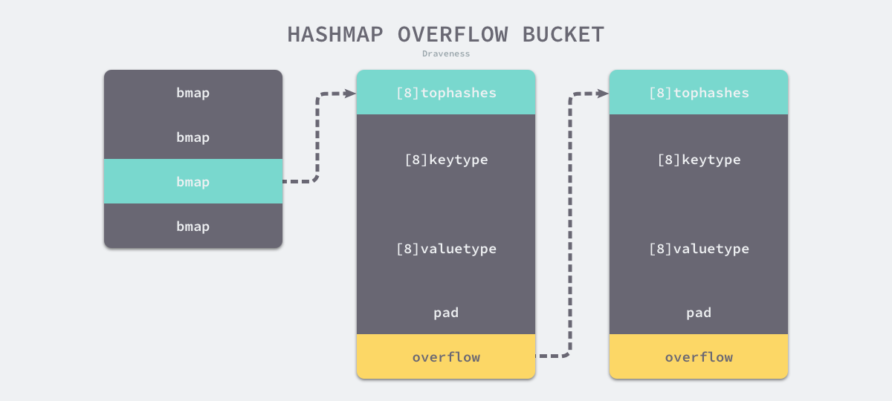
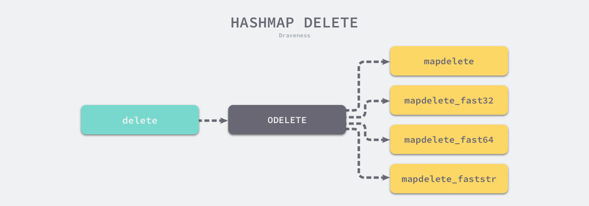

## Map（哈希表）

本节会介绍 Go 语言的哈希的实现原理，哈希是除了数组之外，最常见的数据结构。几乎所有的语言都会有数组和哈希表两种集合元素，有的语言将数组实现成列表，而有的语言将哈希称作字典或者映射。无论如何命名或者如何实现，数组和哈希是两种设计集合元素的思路，数组用于表示元素的序列，而哈希表示的是键值对之间映射关系。

[哈希表](https://en.wikipedia.org/wiki/Hash_table)[1](https://draveness.me/golang/docs/part2-foundation/ch03-datastructure/golang-hashmap/#fn:1)是一种古老的数据结构，在 1953 年就有人使用拉链法实现了哈希表，它能够通过键直接获取该键对应的值。


### 数据结构

​	

```go
type hmap struct {
	count     int
	flags     uint8
	B         uint8
	noverflow uint16
	hash0     uint32

	buckets    unsafe.Pointer
	oldbuckets unsafe.Pointer
	nevacuate  uintptr

	extra *mapextra
}

type mapextra struct {
	overflow    *[]*bmap
	oldoverflow *[]*bmap
	nextOverflow *bmap
}
```

1. `count` 表示当前哈希表中的元素数量；
2. `B` 表示当前哈希表持有的 `buckets` 数量，但是因为哈希表中桶的数量都 2 的倍数，所以该字段会存储对数，也就是 `len(buckets) == 2^B`；
3. `hash0` 是哈希的种子，它能为哈希函数的结果引入随机性，这个值在创建哈希表时确定，并在调用哈希函数时作为参数传入；
4. `oldbuckets` 是哈希在扩容时用于保存之前 `buckets` 的字段，它的大小是当前 `buckets` 的一半；


如上图所示哈希表 [`runtime.hmap`](https://draveness.me/golang/tree/runtime.hmap) 的桶是 [`runtime.bmap`](https://draveness.me/golang/tree/runtime.bmap)。每一个 [`runtime.bmap`](https://draveness.me/golang/tree/runtime.bmap) 都能存储 8 个键值对，当哈希表中存储的数据过多，单个桶已经装满时就会使用 `extra.nextOverflow` 中桶存储溢出的数据。

上述两种不同的桶在内存中是连续存储的，我们在这里将它们分别称为正常桶和溢出桶，上图中黄色的 [`runtime.bmap`](https://draveness.me/golang/tree/runtime.bmap) 就是正常桶，绿色的 [`runtime.bmap`](https://draveness.me/golang/tree/runtime.bmap) 是溢出桶，溢出桶是在 Go 语言还使用 C 语言实现时使用的设计[3](https://draveness.me/golang/docs/part2-foundation/ch03-datastructure/golang-hashmap/#fn:3)，由于它能够减少扩容的频率所以一直使用至今。

桶的结构体 [`runtime.bmap`](https://draveness.me/golang/tree/runtime.bmap) 在 Go 语言源代码中的定义只包含一个简单的 `tophash` 字段，`tophash` 存储了键的哈希的高 8 位，通过比较不同键的哈希的高 8 位可以减少访问键值对次数以提高性能：

```go
type bmap struct {
	tophash [bucketCnt]uint8
}
```

在运行期间，[`runtime.bmap`](https://draveness.me/golang/tree/runtime.bmap) 结构体其实不止包含 `tophash` 字段，因为哈希表中可能存储不同类型的键值对，而且 Go 语言也不支持泛型，所以键值对占据的内存空间大小只能在编译时进行推导。[`runtime.bmap`](https://draveness.me/golang/tree/runtime.bmap) 中的其他字段在运行时也都是通过计算内存地址的方式访问的，所以它的定义中就不包含这些字段，不过我们能根据编译期间的 [`cmd/compile/internal/gc.bmap`](https://draveness.me/golang/tree/cmd/compile/internal/gc.bmap) 函数重建它的结构：

```go
type bmap struct {
    topbits  [8]uint8
    keys     [8]keytype
    values   [8]valuetype
    pad      uintptr
    overflow uintptr
}
```

随着哈希表存储的数据逐渐增多，我们会扩容哈希表或者使用额外的桶存储溢出的数据，不会让单个桶中的数据超过 8 个，不过溢出桶只是临时的解决方案，创建过多的溢出桶最终也会导致哈希的扩容。

从 Go 语言哈希的定义中可以发现，改进元素比数组和切片复杂得多，它的结构体中不仅包含大量字段，还使用复杂的嵌套结构，后面的小节会详细介绍不同字段的作用。


### 初始化

既然已经介绍了哈希表的基本原理和实现方法，那么就可以开始分析 Go 语言中哈希表的实现了，首先要分析的是 Go 语言初始化哈希的两种方法 — 通过字面量和运行时。

目前的现代编程语言基本都支持使用字面量的方式初始化哈希，一般都会使用 `key: value` 的语法来表示键值对，Go 语言中也不例外：

```go
hash := map[string]int{
	"1": 2,
	"3": 4,
	"5": 6,
}
```

Go

我们需要在初始化哈希时声明键值对的类型，这种使用字面量初始化的方式最终都会通过 [`cmd/compile/internal/gc.maplit`](https://draveness.me/golang/tree/cmd/compile/internal/gc.maplit) 初始化，我们来分析一下该函数初始化哈希的过程：

```go
func maplit(n *Node, m *Node, init *Nodes) {
	a := nod(OMAKE, nil, nil)
	a.Esc = n.Esc
	a.List.Set2(typenod(n.Type), nodintconst(int64(n.List.Len())))
	litas(m, a, init)

	entries := n.List.Slice()
	if len(entries) > 25 {
		...
		return
	}

	// Build list of var[c] = expr.
	// Use temporaries so that mapassign1 can have addressable key, elem.
	...
}
```

当哈希表中的元素数量少于或者等于 25 个时，编译器会将字面量初始化的结构体转换成以下的代码，将所有的键值对一次加入到哈希表中：

```go
hash := make(map[string]int, 3)
hash["1"] = 2
hash["3"] = 4
hash["5"] = 6
```

这种初始化的方式与的[数组](https://draveness.me/golang/docs/part2-foundation/ch03-datastructure/golang-array/)和[切片](https://draveness.me/golang/docs/part2-foundation/ch03-datastructure/golang-array-and-slice/)几乎完全相同，由此看来集合类型的初始化在 Go 语言中有着相同的处理逻辑。

一旦哈希表中元素的数量超过了 25 个，编译器会创建两个数组分别存储键和值，这些键值对会通过如下所示的 `for` 循环加入哈希：

```go
hash := make(map[string]int, 26)
vstatk := []string{"1", "2", "3", ... ， "26"}
vstatv := []int{1, 2, 3, ... , 26}
for i := 0; i < len(vstak); i++ {
    hash[vstatk[i]] = vstatv[i]
}
```

这里展开的两个切片 `vstatk` 和 `vstatv` 还会被编辑器继续展开，具体的展开方式可以阅读上一节了解[切片的初始化](https://draveness.me/golang/docs/part2-foundation/ch03-datastructure/golang-array-and-slice/)，不过无论使用哪种方法，使用字面量初始化的过程都会使用 Go 语言中的关键字 `make` 来创建新的哈希并通过最原始的 `[]` 语法向哈希追加元素。


### 运行时

当创建的哈希被分配到栈上并且其容量小于 `BUCKETSIZE = 8` 时，Go 语言在编译阶段会使用如下方式快速初始化哈希，这也是编译器对小容量的哈希做的优化：

```go
var h *hmap
var hv hmap
var bv bmap
h := &hv
b := &bv
h.buckets = b
h.hash0 = fashtrand0()
```

除了上述特定的优化之外，无论 `make` 是从哪里来的，只要我们使用 `make` 创建哈希，Go 语言编译器都会在[类型检查](https://draveness.me/golang/docs/part1-prerequisite/ch02-compile/golang-typecheck/)期间将它们转换成 [`runtime.makemap`](https://draveness.me/golang/tree/runtime.makemap)，使用字面量初始化哈希也只是语言提供的辅助工具，最后调用的都是 [`runtime.makemap`](https://draveness.me/golang/tree/runtime.makemap)：

```go
func makemap(t *maptype, hint int, h *hmap) *hmap {
	mem, overflow := math.MulUintptr(uintptr(hint), t.bucket.size)
	if overflow || mem > maxAlloc {
		hint = 0
	}

	if h == nil {
		h = new(hmap)
	}
	h.hash0 = fastrand()

	B := uint8(0)
	for overLoadFactor(hint, B) {
		B++
	}
	h.B = B

	if h.B != 0 {
		var nextOverflow *bmap
		h.buckets, nextOverflow = makeBucketArray(t, h.B, nil)
		if nextOverflow != nil {
			h.extra = new(mapextra)
			h.extra.nextOverflow = nextOverflow
		}
	}
	return h
}
```

这个函数会按照下面的步骤执行：

1. 计算哈希占用的内存是否溢出或者超出能分配的最大值；
2. 调用 [`runtime.fastrand`](https://draveness.me/golang/tree/runtime.fastrand) 获取一个随机的哈希种子；
3. 根据传入的 `hint` 计算出需要的最小需要的桶的数量；
4. 使用 [`runtime.makeBucketArray`](https://draveness.me/golang/tree/runtime.makeBucketArray) 创建用于保存桶的数组；

[`runtime.makeBucketArray`](https://draveness.me/golang/tree/runtime.makeBucketArray) 会根据传入的 `B` 计算出的需要创建的桶数量并在内存中分配一片连续的空间用于存储数据：

```go
func makeBucketArray(t *maptype, b uint8, dirtyalloc unsafe.Pointer) (buckets unsafe.Pointer, nextOverflow *bmap) {
	base := bucketShift(b)
	nbuckets := base
	if b >= 4 {
		nbuckets += bucketShift(b - 4)
		sz := t.bucket.size * nbuckets
		up := roundupsize(sz)
		if up != sz {
			nbuckets = up / t.bucket.size
		}
	}

	buckets = newarray(t.bucket, int(nbuckets))
	if base != nbuckets {
		nextOverflow = (*bmap)(add(buckets, base*uintptr(t.bucketsize)))
		last := (*bmap)(add(buckets, (nbuckets-1)*uintptr(t.bucketsize)))
		last.setoverflow(t, (*bmap)(buckets))
	}
	return buckets, nextOverflow
}
```

- 当桶的数量小于 $2^4$ 时，由于数据较少、使用溢出桶的可能性较低，会省略创建的过程以减少额外开销；
- 当桶的数量多于 $2^4$ 时，会额外创建 $2^{B−4}$ 个溢出桶；

根据上述代码，我们能确定在正常情况下，正常桶和溢出桶在内存中的存储空间是连续的，只是被 [`runtime.hmap`](https://draveness.me/golang/tree/runtime.hmap) 中的不同字段引用，当溢出桶数量较多时会通过 [`runtime.newobject`](https://draveness.me/golang/tree/runtime.newobject) 创建新的溢出桶。


### 读写操作

哈希表作为一种数据结构，我们肯定要分析它的常见操作，首先就是读写操作的原理。哈希表的访问一般都是通过下标或者遍历进行的：

```go
_ = hash[key]

for k, v := range hash {
    // k, v
}
```

这两种方式虽然都能读取哈希表的数据，但是使用的函数和底层原理完全不同。前者需要知道哈希的键并且一次只能获取单个键对应的值，而后者可以遍历哈希中的全部键值对，访问数据时也不需要预先知道哈希的键。在这里我们会介绍前一种访问方式，第二种访问方式会在 `range` 一节中详细分析。

数据结构的写一般指的都是增加、删除和修改，增加和修改字段都使用索引和赋值语句，而删除字典中的数据需要使用关键字 `delete`：

```go
hash[key] = value
hash[key] = newValue
delete(hash, key)
```

除了这些操作之外，我们还会分析哈希的扩容过程，这能帮助我们深入理解哈希是如何存储数据的。


#### 访问

在编译的[类型检查](https://draveness.me/golang/docs/part1-prerequisite/ch02-compile/golang-typecheck/)期间，`hash[key]` 以及类似的操作都会被转换成哈希的 `OINDEXMAP` 操作，[中间代码生成](https://draveness.me/golang/docs/part1-prerequisite/ch02-compile/golang-ir-ssa/)阶段会在 [`cmd/compile/internal/gc.walkexpr`](https://draveness.me/golang/tree/cmd/compile/internal/gc.walkexpr) 函数中将这些 `OINDEXMAP` 操作转换成如下的代码：

```go
v     := hash[key] // => v     := *mapaccess1(maptype, hash, &key)
v, ok := hash[key] // => v, ok := mapaccess2(maptype, hash, &key)
```

赋值语句左侧接受参数的个数会决定使用的运行时方法：

- 当接受一个参数时，会使用 [`runtime.mapaccess1`](https://draveness.me/golang/tree/runtime.mapaccess1)，该函数仅会返回一个指向目标值的指针；
- 当接受两个参数时，会使用 [`runtime.mapaccess2`](https://draveness.me/golang/tree/runtime.mapaccess2)，除了返回目标值之外，它还会返回一个用于表示当前键对应的值是否存在的 `bool` 值：

[`runtime.mapaccess1`](https://draveness.me/golang/tree/runtime.mapaccess1) 会先通过哈希表设置的哈希函数、种子获取当前键对应的哈希，再通过 [`runtime.bucketMask`](https://draveness.me/golang/tree/runtime.bucketMask) 和 [`runtime.add`](https://draveness.me/golang/tree/runtime.add) 拿到该键值对所在的桶序号和哈希高位的 8 位数字。

```go
func mapaccess1(t *maptype, h *hmap, key unsafe.Pointer) unsafe.Pointer {
	alg := t.key.alg
	hash := alg.hash(key, uintptr(h.hash0))
	m := bucketMask(h.B)
	b := (*bmap)(add(h.buckets, (hash&m)*uintptr(t.bucketsize)))
	top := tophash(hash)
bucketloop:
	for ; b != nil; b = b.overflow(t) {
		for i := uintptr(0); i < bucketCnt; i++ {
			if b.tophash[i] != top {
				if b.tophash[i] == emptyRest {
					break bucketloop
				}
				continue
			}
			k := add(unsafe.Pointer(b), dataOffset+i*uintptr(t.keysize))
			if alg.equal(key, k) {
				v := add(unsafe.Pointer(b), dataOffset+bucketCnt*uintptr(t.keysize)+i*uintptr(t.valuesize))
				return v
			}
		}
	}
	return unsafe.Pointer(&zeroVal[0])
}
```

在 `bucketloop` 循环中，哈希会依次遍历正常桶和溢出桶中的数据，它会先比较哈希的高 8 位和桶中存储的 `tophash`，后比较传入的和桶中的值以加速数据的读写。用于选择桶序号的是哈希的最低几位，而用于加速访问的是哈希的高 8 位，这种设计能够减少同一个桶中有大量相等 `tophash` 的概率影响性能。


如上图所示，每一个桶都是一整片的内存空间，当发现桶中的 `tophash` 与传入键的 `tophash` 匹配之后，我们会通过指针和偏移量获取哈希中存储的键 `keys[0]` 并与 `key` 比较，如果两者相同就会获取目标值的指针 `values[0]` 并返回。

另一个同样用于访问哈希表中数据的 [`runtime.mapaccess2`](https://draveness.me/golang/tree/runtime.mapaccess2) 只是在 [`runtime.mapaccess1`](https://draveness.me/golang/tree/runtime.mapaccess1) 的基础上多返回了一个标识键值对是否存在的 `bool` 值：

```go
func mapaccess2(t *maptype, h *hmap, key unsafe.Pointer) (unsafe.Pointer, bool) {
	...
bucketloop:
	for ; b != nil; b = b.overflow(t) {
		for i := uintptr(0); i < bucketCnt; i++ {
			if b.tophash[i] != top {
				if b.tophash[i] == emptyRest {
					break bucketloop
				}
				continue
			}
			k := add(unsafe.Pointer(b), dataOffset+i*uintptr(t.keysize))
			if alg.equal(key, k) {
				v := add(unsafe.Pointer(b), dataOffset+bucketCnt*uintptr(t.keysize)+i*uintptr(t.valuesize))
				return v, true
			}
		}
	}
	return unsafe.Pointer(&zeroVal[0]), false
}
```

使用 `v, ok := hash[k]` 的形式访问哈希表中元素时，我们能够通过这个布尔值更准确地知道当 `v == nil` 时，`v` 到底是哈希中存储的元素还是表示该键对应的元素不存在，所以在访问哈希时，更推荐使用这种方式判断元素是否存在。

上面的过程是在正常情况下，访问哈希表中元素时的表现，然而与数组一样，哈希表可能会在装载因子过高或者溢出桶过多时进行扩容，哈希表扩容并不是原子过程，在扩容的过程中保证哈希的访问是比较有意思的话题，我们在这里也省略了相关的代码，后面的小节会展开介绍。


#### 写入

当形如 `hash[k]` 的表达式出现在赋值符号左侧时，该表达式也会在编译期间转换成 [`runtime.mapassign`](https://draveness.me/golang/tree/runtime.mapassign) 函数的调用，该函数与 [`runtime.mapaccess1`](https://draveness.me/golang/tree/runtime.mapaccess1) 比较相似，我们将其分成几个部分依次分析，首先是函数会根据传入的键拿到对应的哈希和桶：

```go
func mapassign(t *maptype, h *hmap, key unsafe.Pointer) unsafe.Pointer {
	alg := t.key.alg
	hash := alg.hash(key, uintptr(h.hash0))

	h.flags ^= hashWriting

again:
	bucket := hash & bucketMask(h.B)
	b := (*bmap)(unsafe.Pointer(uintptr(h.buckets) + bucket*uintptr(t.bucketsize)))
	top := tophash(hash)
```

然后通过遍历比较桶中存储的 `tophash` 和键的哈希，如果找到了相同结果就会返回目标位置的地址。其中 `inserti` 表示目标元素的在桶中的索引，`insertk` 和 `val` 分别表示键值对的地址，获得目标地址之后会通过算术计算寻址获得键值对 `k` 和 `val`：

```go
	var inserti *uint8
	var insertk unsafe.Pointer
	var val unsafe.Pointer
bucketloop:
	for {
		for i := uintptr(0); i < bucketCnt; i++ {
			if b.tophash[i] != top {
				if isEmpty(b.tophash[i]) && inserti == nil {
					inserti = &b.tophash[i]
					insertk = add(unsafe.Pointer(b), dataOffset+i*uintptr(t.keysize))
					val = add(unsafe.Pointer(b), dataOffset+bucketCnt*uintptr(t.keysize)+i*uintptr(t.valuesize))
				}
				if b.tophash[i] == emptyRest {
					break bucketloop
				}
				continue
			}
			k := add(unsafe.Pointer(b), dataOffset+i*uintptr(t.keysize))
			if !alg.equal(key, k) {
				continue
			}
			val = add(unsafe.Pointer(b), dataOffset+bucketCnt*uintptr(t.keysize)+i*uintptr(t.valuesize))
			goto done
		}
		ovf := b.overflow(t)
		if ovf == nil {
			break
		}
		b = ovf
	}
```

上述的 for 循环会依次遍历正常桶和溢出桶中存储的数据，整个过程会分别判断 `tophash` 是否相等、`key` 是否相等，遍历结束后会从循环中跳出。



如果当前桶已经满了，哈希会调用 [`runtime.hmap.newoverflow`](https://draveness.me/golang/tree/runtime.hmap.newoverflow) 创建新桶或者使用 [`runtime.hmap`](https://draveness.me/golang/tree/runtime.hmap) 预先在 `noverflow` 中创建好的桶来保存数据，新创建的桶不仅会被追加到已有桶的末尾，还会增加哈希表的 `noverflow` 计数器。

```go
	if inserti == nil {
		newb := h.newoverflow(t, b)
		inserti = &newb.tophash[0]
		insertk = add(unsafe.Pointer(newb), dataOffset)
		val = add(insertk, bucketCnt*uintptr(t.keysize))
	}

	typedmemmove(t.key, insertk, key)
	*inserti = top
	h.count++

done:
	return val
}
```

如果当前键值对在哈希中不存在，哈希会为新键值对规划存储的内存地址，通过 [`runtime.typedmemmove`](https://draveness.me/golang/tree/runtime.typedmemmove) 将键移动到对应的内存空间中并返回键对应值的地址 `val`。如果当前键值对在哈希中存在，那么就会直接返回目标区域的内存地址，哈希并不会在 [`runtime.mapassign`](https://draveness.me/golang/tree/runtime.mapassign) 这个运行时函数中将值拷贝到桶中，该函数只会返回内存地址，真正的赋值操作是在编译期间插入的：

```go
00018 (+5) CALL runtime.mapassign_fast64(SB)
00020 (5) MOVQ 24(SP), DI               ;; DI = &value
00026 (5) LEAQ go.string."88"(SB), AX   ;; AX = &"88"
00027 (5) MOVQ AX, (DI)                 ;; *DI = AX
```

[`runtime.mapassign_fast64`](https://draveness.me/golang/tree/runtime.mapassign_fast64) 与 [`runtime.mapassign`](https://draveness.me/golang/tree/runtime.mapassign) 函数的逻辑差不多，我们需要关注的是后面的三行代码，其中 `24(SP)` 是该函数返回的值地址，我们通过 `LEAQ` 指令将字符串的地址存储到寄存器 `AX` 中，`MOVQ` 指令将字符串 `"88"` 存储到了目标地址上完成了这次哈希的写入。


#### 扩容

前面在介绍哈希的写入过程时其实省略了扩容操作，随着哈希表中元素的逐渐增加，哈希的性能会逐渐恶化，所以我们需要更多的桶和更大的内存保证哈希的读写性能：

```go
func mapassign(t *maptype, h *hmap, key unsafe.Pointer) unsafe.Pointer {
	...
	if !h.growing() && (overLoadFactor(h.count+1, h.B) || tooManyOverflowBuckets(h.noverflow, h.B)) {
		hashGrow(t, h)
		goto again
	}
	...
}
```

[`runtime.mapassign`](https://draveness.me/golang/tree/runtime.mapassign) 函数会在以下两种情况发生时触发哈希的扩容：

1. 装载因子已经超过 6.5；
2. 哈希使用了太多溢出桶；

不过因为 Go 语言哈希的扩容不是一个原子的过程，所以 [`runtime.mapassign`](https://draveness.me/golang/tree/runtime.mapassign) 还需要判断当前哈希是否已经处于扩容状态，避免二次扩容造成混乱。

根据触发的条件不同扩容的方式分成两种，如果这次扩容是溢出的桶太多导致的，那么这次扩容就是等量扩容 `sameSizeGrow`，`sameSizeGrow` 是一种特殊情况下发生的扩容，当我们持续向哈希中插入数据并将它们全部删除时，如果哈希表中的数据量没有超过阈值，就会不断积累溢出桶造成缓慢的内存泄漏[4](https://draveness.me/golang/docs/part2-foundation/ch03-datastructure/golang-hashmap/#fn:4)。[runtime: limit the number of map overflow buckets](https://github.com/golang/go/commit/9980b70cb460f27907a003674ab1b9bea24a847c) 引入了 `sameSizeGrow` 通过复用已有的哈希扩容机制解决该问题，一旦哈希中出现了过多的溢出桶，它会创建新桶保存数据，垃圾回收会清理老的溢出桶并释放内存[5](https://draveness.me/golang/docs/part2-foundation/ch03-datastructure/golang-hashmap/#fn:5)。

扩容的入口是 [`runtime.hashGrow`](https://draveness.me/golang/tree/runtime.hashGrow)：

```go
func hashGrow(t *maptype, h *hmap) {
	bigger := uint8(1)
	if !overLoadFactor(h.count+1, h.B) {
		bigger = 0
		h.flags |= sameSizeGrow
	}
	oldbuckets := h.buckets
	newbuckets, nextOverflow := makeBucketArray(t, h.B+bigger, nil)

	h.B += bigger
	h.flags = flags
	h.oldbuckets = oldbuckets
	h.buckets = newbuckets
	h.nevacuate = 0
	h.noverflow = 0

	h.extra.oldoverflow = h.extra.overflow
	h.extra.overflow = nil
	h.extra.nextOverflow = nextOverflow
}
```

哈希在扩容的过程中会通过 [`runtime.makeBucketArray`](https://draveness.me/golang/tree/runtime.makeBucketArray) 创建一组新桶和预创建的溢出桶，随后将原有的桶数组设置到 `oldbuckets` 上并将新的空桶设置到 `buckets` 上，溢出桶也使用了相同的逻辑更新，下图展示了触发扩容后的哈希：


我们在 [`runtime.hashGrow`](https://draveness.me/golang/tree/runtime.hashGrow) 中还看不出来等量扩容和翻倍扩容的太多区别，等量扩容创建的新桶数量只是和旧桶一样，该函数中只是创建了新的桶，并没有对数据进行拷贝和转移。哈希表的数据迁移的过程在是 [`runtime.evacuate`](https://draveness.me/golang/tree/runtime.evacuate) 中完成的，它会对传入桶中的元素进行再分配。

```go
func evacuate(t *maptype, h *hmap, oldbucket uintptr) {
	b := (*bmap)(add(h.oldbuckets, oldbucket*uintptr(t.bucketsize)))
	newbit := h.noldbuckets()
	if !evacuated(b) {
		var xy [2]evacDst
		x := &xy[0]
		x.b = (*bmap)(add(h.buckets, oldbucket*uintptr(t.bucketsize)))
		x.k = add(unsafe.Pointer(x.b), dataOffset)
		x.v = add(x.k, bucketCnt*uintptr(t.keysize))

		y := &xy[1]
		y.b = (*bmap)(add(h.buckets, (oldbucket+newbit)*uintptr(t.bucketsize)))
		y.k = add(unsafe.Pointer(y.b), dataOffset)
		y.v = add(y.k, bucketCnt*uintptr(t.keysize))
```

[`runtime.evacuate`](https://draveness.me/golang/tree/runtime.evacuate) 会将一个旧桶中的数据分流到两个新桶，所以它会创建两个用于保存分配上下文的 [`runtime.evacDst`](https://draveness.me/golang/tree/runtime.evacDst) 结构体，这两个结构体分别指向了一个新桶：


如果这是等量扩容，那么旧桶与新桶之间是一对一的关系，所以两个 [`runtime.evacDst`](https://draveness.me/golang/tree/runtime.evacDst) 只会初始化一个。而当哈希表的容量翻倍时，每个旧桶的元素会都分流到新创建的两个桶中，这里仔细分析一下分流元素的逻辑：

```go
		for ; b != nil; b = b.overflow(t) {
			k := add(unsafe.Pointer(b), dataOffset)
			v := add(k, bucketCnt*uintptr(t.keysize))
			for i := 0; i < bucketCnt; i, k, v = i+1, add(k, uintptr(t.keysize)), add(v, uintptr(t.valuesize)) {
				top := b.tophash[i]
				k2 := k
				var useY uint8
				hash := t.key.alg.hash(k2, uintptr(h.hash0))
				if hash&newbit != 0 {
					useY = 1
				}
				b.tophash[i] = evacuatedX + useY
				dst := &xy[useY]

				if dst.i == bucketCnt {
					dst.b = h.newoverflow(t, dst.b)
					dst.i = 0
					dst.k = add(unsafe.Pointer(dst.b), dataOffset)
					dst.v = add(dst.k, bucketCnt*uintptr(t.keysize))
				}
				dst.b.tophash[dst.i&(bucketCnt-1)] = top
				typedmemmove(t.key, dst.k, k)
				typedmemmove(t.elem, dst.v, v)
				dst.i++
				dst.k = add(dst.k, uintptr(t.keysize))
				dst.v = add(dst.v, uintptr(t.valuesize))
			}
		}
		...
}
```

只使用哈希函数是不能定位到具体某一个桶的，哈希函数只会返回很长的哈希，例如：`b72bfae3f3285244c4732ce457cca823bc189e0b`，我们还需一些方法将哈希映射到具体的桶上。我们一般都会使用取模或者位操作来获取桶的编号，假如当前哈希中包含 4 个桶，那么它的桶掩码就是 0b11(3)，使用位操作就会得到 3， 我们就会在 3 号桶中存储该数据：

```ruby
0xb72bfae3f3285244c4732ce457cca823bc189e0b & 0b11 #=> 0
```

如果新的哈希表有 8 个桶，在大多数情况下，原来经过桶掩码 `0b11` 结果为 3 的数据会因为桶掩码增加了一位变成 `0b111` 而分流到新的 3 号和 7 号桶，所有数据也都会被 [`runtime.typedmemmove`](https://draveness.me/golang/tree/runtime.typedmemmove) 拷贝到目标桶中：


[`runtime.evacuate`](https://draveness.me/golang/tree/runtime.evacuate) 最后会调用 [`runtime.advanceEvacuationMark`](https://draveness.me/golang/tree/runtime.advanceEvacuationMark) 增加哈希的 `nevacuate` 计数器并在所有的旧桶都被分流后清空哈希的 `oldbuckets` 和 `oldoverflow`：

```go
func advanceEvacuationMark(h *hmap, t *maptype, newbit uintptr) {
	h.nevacuate++
	stop := h.nevacuate + 1024
	if stop > newbit {
		stop = newbit
	}
	for h.nevacuate != stop && bucketEvacuated(t, h, h.nevacuate) {
		h.nevacuate++
	}
	if h.nevacuate == newbit { // newbit == # of oldbuckets
		h.oldbuckets = nil
		if h.extra != nil {
			h.extra.oldoverflow = nil
		}
		h.flags &^= sameSizeGrow
	}
}
```

之前在分析哈希表访问函数 [`runtime.mapaccess1`](https://draveness.me/golang/tree/runtime.mapaccess1) 时其实省略了扩容期间获取键值对的逻辑，当哈希表的 `oldbuckets` 存在时，会先定位到旧桶并在该桶没有被分流时从中获取键值对。

```go
func mapaccess1(t *maptype, h *hmap, key unsafe.Pointer) unsafe.Pointer {
	...
	alg := t.key.alg
	hash := alg.hash(key, uintptr(h.hash0))
	m := bucketMask(h.B)
	b := (*bmap)(add(h.buckets, (hash&m)*uintptr(t.bucketsize)))
	if c := h.oldbuckets; c != nil {
		if !h.sameSizeGrow() {
			m >>= 1
		}
		oldb := (*bmap)(add(c, (hash&m)*uintptr(t.bucketsize)))
		if !evacuated(oldb) {
			b = oldb
		}
	}
bucketloop:
	...
}
```

因为旧桶中的元素还没有被 [`runtime.evacuate`](https://draveness.me/golang/tree/runtime.evacuate) 函数分流，其中还保存着我们需要使用的数据，所以旧桶会替代新创建的空桶提供数据。

我们在 [`runtime.mapassign`](https://draveness.me/golang/tree/runtime.mapassign) 函数中也省略了一段逻辑，当哈希表正在处于扩容状态时，每次向哈希表写入值时都会触发 [`runtime.growWork`](https://draveness.me/golang/tree/runtime.growWork) 增量拷贝哈希表中的内容：

```go
func mapassign(t *maptype, h *hmap, key unsafe.Pointer) unsafe.Pointer {
	...
again:
	bucket := hash & bucketMask(h.B)
	if h.growing() {
		growWork(t, h, bucket)
	}
	...
}
```

当然除了写入操作之外，删除操作也会在哈希表扩容期间触发 [`runtime.growWork`](https://draveness.me/golang/tree/runtime.growWork)，触发的方式和代码与这里的逻辑几乎完全相同，都是计算当前值所在的桶，然后拷贝桶中的元素。

我们简单总结一下哈希表扩容的设计和原理，哈希在存储元素过多时会触发扩容操作，每次都会将桶的数量翻倍，扩容过程不是原子的，而是通过 [`runtime.growWork`](https://draveness.me/golang/tree/runtime.growWork) 增量触发的，在扩容期间访问哈希表时会使用旧桶，向哈希表写入数据时会触发旧桶元素的分流。除了这种正常的扩容之外，为了解决大量写入、删除造成的内存泄漏问题，哈希引入了 `sameSizeGrow` 这一机制，在出现较多溢出桶时会整理哈希的内存减少空间的占用。


#### 删除

如果想要删除哈希中的元素，就需要使用 Go 语言中的 `delete` 关键字，这个关键字的唯一作用就是将某一个键对应的元素从哈希表中删除，无论是该键对应的值是否存在，这个内建的函数都不会返回任何的结果。



在编译期间，`delete` 关键字会被转换成操作为 `ODELETE` 的节点，而 [`cmd/compile/internal/gc.walkexpr`](https://draveness.me/golang/tree/cmd/compile/internal/gc.walkexpr) 会将 `ODELETE` 节点转换成 [`runtime.mapdelete`](https://draveness.me/golang/tree/runtime.mapdelete) 函数簇中的一个，包括 [`runtime.mapdelete`](https://draveness.me/golang/tree/runtime.mapdelete)、`mapdelete_faststr`、`mapdelete_fast32` 和 `mapdelete_fast64`：

```go
func walkexpr(n *Node, init *Nodes) *Node {
	switch n.Op {
	case ODELETE:
		init.AppendNodes(&n.Ninit)
		map_ := n.List.First()
		key := n.List.Second()
		map_ = walkexpr(map_, init)
		key = walkexpr(key, init)

		t := map_.Type
		fast := mapfast(t)
		if fast == mapslow {
			key = nod(OADDR, key, nil)
		}
		n = mkcall1(mapfndel(mapdelete[fast], t), nil, init, typename(t), map_, key)
	}
}
```

这些函数的实现其实差不多，我们挑选其中的 [`runtime.mapdelete`](https://draveness.me/golang/tree/runtime.mapdelete) 分析一下。哈希表的删除逻辑与写入逻辑很相似，只是触发哈希的删除需要使用关键字，如果在删除期间遇到了哈希表的扩容，就会分流桶中的元素，分流结束之后会找到桶中的目标元素完成键值对的删除工作。

```go
func mapdelete(t *maptype, h *hmap, key unsafe.Pointer) {
	...
	if h.growing() {
		growWork(t, h, bucket)
	}
	...
search:
	for ; b != nil; b = b.overflow(t) {
		for i := uintptr(0); i < bucketCnt; i++ {
			if b.tophash[i] != top {
				if b.tophash[i] == emptyRest {
					break search
				}
				continue
			}
			k := add(unsafe.Pointer(b), dataOffset+i*uintptr(t.keysize))
			k2 := k
			if !alg.equal(key, k2) {
				continue
			}
			*(*unsafe.Pointer)(k) = nil
			v := add(unsafe.Pointer(b), dataOffset+bucketCnt*uintptr(t.keysize)+i*uintptr(t.valuesize))
			*(*unsafe.Pointer)(v) = nil
			b.tophash[i] = emptyOne
			...
		}
	}
}
```

我们其实只需要知道 `delete` 关键字在编译期间经过[类型检查](https://draveness.me/golang/docs/part1-prerequisite/ch02-compile/golang-typecheck/)和[中间代码生成](https://draveness.me/golang/docs/part1-prerequisite/ch02-compile/golang-ir-ssa/)阶段被转换成 [`runtime.mapdelete`](https://draveness.me/golang/tree/runtime.mapdelete) 函数簇中的一员，用于处理删除逻辑的函数与哈希表的 [`runtime.mapassign`](https://draveness.me/golang/tree/runtime.mapassign) 几乎完全相同，不太需要刻意关注。


### 小结

Go 语言使用拉链法来解决哈希碰撞的问题实现了哈希表，它的访问、写入和删除等操作都在编译期间转换成了运行时的函数或者方法。哈希在每一个桶中存储键对应哈希的前 8 位，当对哈希进行操作时，这些 `tophash` 就成为可以帮助哈希快速遍历桶中元素的缓存。

哈希表的每个桶都只能存储 8 个键值对，一旦当前哈希的某个桶超出 8 个，新的键值对就会存储到哈希的溢出桶中。随着键值对数量的增加，溢出桶的数量和哈希的装载因子也会逐渐升高，超过一定范围就会触发扩容，扩容会将桶的数量翻倍，元素再分配的过程也是在调用写操作时增量进行的，不会造成性能的瞬时巨大抖动。


### 延伸阅读

- [Separate Chaining: Concept, Advantages & Disadvantages](https://study.com/academy/lesson/separate-chaining-concept-advantages-disadvantages.html)
- Hash table https://en.wikipedia.org/wiki/Hash_table
- Open addressing 开放寻址法 https://en.wikipedia.org/wiki/Open_addressing
- runtime: convert map implementation to Go. https://github.com/golang/go/commit/0c6b55e76ba6d59f57c81ca1160d833c79270753
- runtime: map memory usage grows as it changes even though number of entries does not grow https://github.com/golang/go/issues/16070 https://github.com/golang/go/issues/16070
- runtime: limit the number of map overflow buckets https://github.com/golang/go/commit/9980b70cb460f27907a003674ab1b9bea24a847c