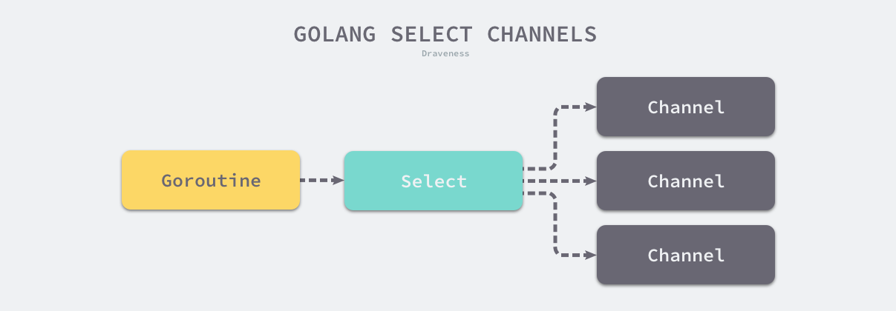

## select 关键字和底层原理

- https://draveness.me/golang/docs/part2-foundation/ch05-keyword/golang-select/


`select` 是操作系统中的系统调用，我们经常会使用 `select`、`poll` 和 `epoll` 等函数构建 I/O 多路复用模型提升程序的性能。Go 语言的 `select` 与操作系统中的 `select` 比较相似，本节会介绍 Go 语言 `select` 关键字常见的现象、数据结构以及实现原理。

C 语言的 `select` 系统调用可以同时监听多个文件描述符的可读或者可写的状态，Go 语言中的 `select` 也能够让 Goroutine 同时等待多个 Channel 可读或者可写，在多个文件或者 Channel状态改变之前，`select` 会一直阻塞当前线程或者 Goroutine。



`select` 是与 `switch` 相似的控制结构，与 `switch` 不同的是，`select` 中虽然也有多个 `case`，但是这些 `case` 中的表达式必须都是 Channel 的收发操作。下面的代码就展示了一个包含 Channel 收发操作的 `select` 结构：

```go
func fibonacci(c, quit chan int) {
	x, y := 0, 1
	for {
		select {
		case c <- x:
			x, y = y, x+y
		case <-quit:
			fmt.Println("quit")
			return
		}
	}
}
```

上述控制结构会等待 `c <- x` 或者 `<-quit` 两个表达式中任意一个返回。无论哪一个表达式返回都会立刻执行 `case` 中的代码，当 `select` 中的两个 `case` 同时被触发时，会随机执行其中的一个。


### 现象

当我们在 Go 语言中使用 `select` 控制结构时，会遇到两个有趣的现象：

1. `select` 能在 Channel 上进行非阻塞的收发操作；
2. `select` 在遇到多个 Channel 同时响应时，会随机执行一种情况；

这两个现象是学习 `select` 时经常会遇到的，我们来深入了解具体场景并分析这两个现象背后的设计原理。

##### 非阻塞的收发

在通常情况下，`select` 语句会阻塞当前 Goroutine 并等待多个 Channel 中的一个达到可以收发的状态。但是如果 `select` 控制结构中包含 `default` 语句，那么这个 `select` 语句在执行时会遇到以下两种情况：

1. 当存在可以收发的 Channel 时，直接处理该 Channel 对应的 `case`；
2. 当不存在可以收发的 Channel 时，执行 `default` 中的语句；

当我们运行下面的代码时就不会阻塞当前的 Goroutine，它会直接执行 `default` 中的代码。

```go
func main() {
	ch := make(chan int)
	select {
	case i := <-ch:
		println(i)

	default:
		println("default")
	}
}
```

```bash
$ go run main.go
default
```

只要我们稍微想一下，就会发现 Go 语言设计的这个现象很合理。`select` 的作用是同时监听多个 `case` 是否可以执行，如果多个 Channel 都不能执行，那么运行 `default` 也是理所当然的。

非阻塞的 Channel 发送和接收操作还是很有必要的，在很多场景下我们不希望 Channel 操作阻塞当前 Goroutine，只是想看看 Channel 的可读或者可写状态，如下所示：

```go
errCh := make(chan error, len(tasks))
wg := sync.WaitGroup{}
wg.Add(len(tasks))
for i := range tasks {
    go func() {
        defer wg.Done()
        if err := tasks[i].Run(); err != nil {
            errCh <- err
        }
    }()
}
wg.Wait()

select {
case err := <-errCh:
    return err
default:
    return nil
}
```

在上面这段代码中，我们不关心到底多少个任务执行失败了，只关心是否存在返回错误的任务，最后的 `select` 语句能很好地完成这个任务。然而使用 `select` 实现非阻塞收发不是最初的设计，Go 语言在最初版本使用 `x, ok := <-c` 实现非阻塞的收发，以下是与非阻塞收发相关的提交：

1. [select default](https://github.com/golang/go/commit/79fbbe37a76502e6f5f9647d2d82bab953ab1546) 提交支持了 `select` 语句中的 `default`[1](https://draveness.me/golang/docs/part2-foundation/ch05-keyword/golang-select/#fn:1)；
2. [gc: special case code for single-op blocking and non-blocking selects](https://github.com/golang/go/commit/5038792837355abde32f2e9549ef132fc5ffbd16) 提交引入了基于 `select` 的非阻塞收发[2](https://draveness.me/golang/docs/part2-foundation/ch05-keyword/golang-select/#fn:2)。
3. [gc: remove non-blocking send, receive syntax](https://github.com/golang/go/commit/cb584707af2d8803adba88fd9692e665ecd2f059) 提交将 `x, ok := <-c` 语法删除[3](https://draveness.me/golang/docs/part2-foundation/ch05-keyword/golang-select/#fn:3)；
4. [gc, runtime: replace closed(c) with x, ok := <-c](https://github.com/golang/go/commit/8bf34e335686816f7fe7e28614b2c7a3e04e9e7c) 提交使用 `x, ok := <-c` 语法替代 `closed(c)` 语法判断 Channel 的关闭状态[4](https://draveness.me/golang/docs/part2-foundation/ch05-keyword/golang-select/#fn:4)；

我们可以从上面的几个提交中看到非阻塞收发从最初版本到现在的演变。

##### 随机执行

另一个使用 `select` 遇到的情况是同时有多个 `case` 就绪时，`select` 会选择哪个 `case` 执行的问题，我们通过下面的代码可以简单了解一下：

```go
func main() {
	ch := make(chan int)
	go func() {
		for range time.Tick(1 * time.Second) {
			ch <- 0
		}
	}()

	for {
		select {
		case <-ch:
			println("case1")
		case <-ch:
			println("case2")
		}
	}
}

$ go run main.go
case1
case2
case1
...
```

Go

从上述代码输出的结果中我们可以看到，`select` 在遇到多个 `<-ch` 同时满足可读或者可写条件时会随机选择一个 `case` 执行其中的代码。

这个设计是在十多年前被 [select](https://github.com/golang/go/commit/cb9b1038db77198c2b0961634cf161258af2374d) 提交[5](https://draveness.me/golang/docs/part2-foundation/ch05-keyword/golang-select/#fn:5)引入并一直保留到现在的，虽然中间经历过一些修改[6](https://draveness.me/golang/docs/part2-foundation/ch05-keyword/golang-select/#fn:6)，但是语义一直都没有改变。在上面的代码中，两个 `case` 都是同时满足执行条件的，如果我们按照顺序依次判断，那么后面的条件永远都会得不到执行，而随机的引入就是为了避免饥饿问题的发生。


### 数据结构

`select` 在 Go 语言的源代码中不存在对应的结构体，但是我们使用 [`runtime.scase`](https://draveness.me/golang/tree/runtime.scase) 结构体表示 `select` 控制结构中的 `case`：

```go
type scase struct {
	c    *hchan         // chan
	elem unsafe.Pointer // data element
}
```

因为非默认的 `case` 中都与 Channel 的发送和接收有关，所以 [`runtime.scase`](https://draveness.me/golang/tree/runtime.scase) 结构体中也包含一个 [`runtime.hchan`](https://draveness.me/golang/tree/runtime.hchan) 类型的字段存储 `case` 中使用的 Channel。


### 实现原理

`select` 语句在编译期间会被转换成 `OSELECT` 节点。每个 `OSELECT` 节点都会持有一组 `OCASE` 节点，如果 `OCASE` 的执行条件是空，那就意味着这是一个 `default` 节点。


上图展示的就是 `select` 语句在编译期间的结构，每一个 `OCASE` 既包含执行条件也包含满足条件后执行的代码。

编译器在中间代码生成期间会根据 `select` 中 `case` 的不同对控制语句进行优化，这一过程都发生在 [`cmd/compile/internal/gc.walkselectcases`](https://draveness.me/golang/tree/cmd/compile/internal/gc.walkselectcases) 函数中，我们在这里会分四种情况介绍处理的过程和结果：

1. `select` 不存在任何的 `case`；
2. `select` 只存在一个 `case`；
3. `select` 存在两个 `case`，其中一个 `case` 是 `default`；
4. `select` 存在多个 `case`；

上述四种情况不仅会涉及编译器的重写和优化，还会涉及 Go 语言的运行时机制，我们会从编译期间和运行时两个角度分析上述情况。


#### 直接阻塞

首先介绍的是最简单的情况，也就是当 `select` 结构中不包含任何 `case`。我们截取 [`cmd/compile/internal/gc.walkselectcases`](https://draveness.me/golang/tree/cmd/compile/internal/gc.walkselectcases) 函数的前几行代码：

```go
func walkselectcases(cases *Nodes) []*Node {
	n := cases.Len()

	if n == 0 {
		return []*Node{mkcall("block", nil, nil)}
	}
	...
}
```

这段代码很简单并且容易理解，它直接将类似 `select {}` 的语句转换成调用 [`runtime.block`](https://draveness.me/golang/tree/runtime.block) 函数：

```go
func block() {
	gopark(nil, nil, waitReasonSelectNoCases, traceEvGoStop, 1)
}
```

[`runtime.block`](https://draveness.me/golang/tree/runtime.block) 的实现非常简单，它会调用 [`runtime.gopark`](https://draveness.me/golang/tree/runtime.gopark) 让出当前 Goroutine 对处理器的使用权并传入等待原因 `waitReasonSelectNoCases`。

简单总结一下，空的 `select` 语句会直接阻塞当前 Goroutine，导致 Goroutine 进入无法被唤醒的永久休眠状态。


#### 单一管道

如果当前的 `select` 条件只包含一个 `case`，那么编译器会将 `select` 改写成 `if` 条件语句。下面对比了改写前后的代码：

```go
// 改写前
select {
case v, ok <-ch: // case ch <- v
    ...    
}

// 改写后
if ch == nil {
    block()
}
v, ok := <-ch // case ch <- v
...
```

[`cmd/compile/internal/gc.walkselectcases`](https://draveness.me/golang/tree/cmd/compile/internal/gc.walkselectcases) 在处理单操作 `select` 语句时，会根据 Channel 的收发情况生成不同的语句。当 `case` 中的 Channel 是空指针时，会直接挂起当前 Goroutine 并陷入永久休眠。


#### 非阻塞操作

当 `select` 中仅包含两个 `case`，并且其中一个是 `default` 时，Go 语言的编译器就会认为这是一次非阻塞的收发操作。[`cmd/compile/internal/gc.walkselectcases`](https://draveness.me/golang/tree/cmd/compile/internal/gc.walkselectcases) 会对这种情况单独处理。不过在正式优化之前，该函数会将 `case` 中的所有 Channel 都转换成指向 Channel 的地址，我们会分别介绍非阻塞发送和非阻塞接收时，编译器进行的不同优化。

##### 发送

首先是 Channel 的发送过程，当 `case` 中表达式的类型是 `OSEND` 时，编译器会使用条件语句和 [`runtime.selectnbsend`](https://draveness.me/golang/tree/runtime.selectnbsend) 函数改写代码：

```go
select {
case ch <- i:
    ...
default:
    ...
}

if selectnbsend(ch, i) {
    ...
} else {
    ...
}
```

这段代码中最重要的就是 [`runtime.selectnbsend`](https://draveness.me/golang/tree/runtime.selectnbsend)，它为我们提供了向 Channel 非阻塞地发送数据的能力。我们在 Channel 一节介绍了向 Channel 发送数据的 [`runtime.chansend`](https://draveness.me/golang/tree/runtime.chansend) 函数包含一个 `block` 参数，该参数会决定这一次的发送是不是阻塞的：

```go
func selectnbsend(c *hchan, elem unsafe.Pointer) (selected bool) {
	return chansend(c, elem, false, getcallerpc())
}
```

由于我们向 [`runtime.chansend`](https://draveness.me/golang/tree/runtime.chansend) 函数传入了非阻塞，所以在不存在接收方或者缓冲区空间不足时，当前 Goroutine 都不会阻塞而是会直接返回。

##### 接收

由于从 Channel 中接收数据可能会返回一个或者两个值，所以接收数据的情况会比发送稍显复杂，不过改写的套路是差不多的：

```go
// 改写前
select {
case v <- ch: // case v, ok <- ch:
    ......
default:
    ......
}

// 改写后
if selectnbrecv(&v, ch) { // if selectnbrecv2(&v, &ok, ch) {
    ...
} else {
    ...
}
```

返回值数量不同会导致使用函数的不同，两个用于非阻塞接收消息的函数 [`runtime.selectnbrecv`](https://draveness.me/golang/tree/runtime.selectnbrecv) 和 [`runtime.selectnbrecv2`](https://draveness.me/golang/tree/runtime.selectnbrecv2) 只是对 [`runtime.chanrecv`](https://draveness.me/golang/tree/runtime.chanrecv) 返回值的处理稍有不同：

```go
func selectnbrecv(elem unsafe.Pointer, c *hchan) (selected bool) {
	selected, _ = chanrecv(c, elem, false)
	return
}

func selectnbrecv2(elem unsafe.Pointer, received *bool, c *hchan) (selected bool) {
	selected, *received = chanrecv(c, elem, false)
	return
}
```

因为接收方不需要，所以 [`runtime.selectnbrecv`](https://draveness.me/golang/tree/runtime.selectnbrecv) 会直接忽略返回的布尔值，而 [`runtime.selectnbrecv2`](https://draveness.me/golang/tree/runtime.selectnbrecv2) 会将布尔值回传给调用方。与 [`runtime.chansend`](https://draveness.me/golang/tree/runtime.chansend) 一样，[`runtime.chanrecv`](https://draveness.me/golang/tree/runtime.chanrecv) 也提供了一个 `block` 参数用于控制这次接收是否阻塞。


#### 常见流程

在默认的情况下，编译器会使用如下的流程处理 `select` 语句：

1. 将所有的 `case` 转换成包含 Channel 以及类型等信息的 [`runtime.scase`](https://draveness.me/golang/tree/runtime.scase) 结构体；
2. 调用运行时函数 [`runtime.selectgo`](https://draveness.me/golang/tree/runtime.selectgo) 从多个准备就绪的 Channel 中选择一个可执行的 [`runtime.scase`](https://draveness.me/golang/tree/runtime.scase) 结构体；
3. 通过 `for` 循环生成一组 `if` 语句，在语句中判断自己是不是被选中的 `case`；

一个包含三个 `case` 的正常 `select` 语句其实会被展开成如下所示的逻辑，我们可以看到其中处理的三个部分：

```go
selv := [3]scase{}
order := [6]uint16
for i, cas := range cases {
    c := scase{}
    c.kind = ...
    c.elem = ...
    c.c = ...
}
chosen, revcOK := selectgo(selv, order, 3)
if chosen == 0 {
    ...
    break
}
if chosen == 1 {
    ...
    break
}
if chosen == 2 {
    ...
    break
}
```

展开后的代码片段中最重要的就是用于选择待执行 `case` 的运行时函数 [`runtime.selectgo`](https://draveness.me/golang/tree/runtime.selectgo)，这也是我们要关注的重点。因为这个函数的实现比较复杂， 所以这里分两部分分析它的执行过程：

1. 执行一些必要的初始化操作并确定 `case` 的处理顺序；
2. 在循环中根据 `case` 的类型做出不同的处理；

##### 初始化

[`runtime.selectgo`](https://draveness.me/golang/tree/runtime.selectgo) 函数首先会进行执行必要的初始化操作并决定处理 `case` 的两个顺序 — 轮询顺序 `pollOrder` 和加锁顺序 `lockOrder`：

```go
func selectgo(cas0 *scase, order0 *uint16, ncases int) (int, bool) {
	cas1 := (*[1 << 16]scase)(unsafe.Pointer(cas0))
	order1 := (*[1 << 17]uint16)(unsafe.Pointer(order0))
	
	ncases := nsends + nrecvs
	scases := cas1[:ncases:ncases]
	pollorder := order1[:ncases:ncases]
	lockorder := order1[ncases:][:ncases:ncases]

	norder := 0
	for i := range scases {
		cas := &scases[i]
	}

	for i := 1; i < ncases; i++ {
		j := fastrandn(uint32(i + 1))
		pollorder[norder] = pollorder[j]
		pollorder[j] = uint16(i)
		norder++
	}
	pollorder = pollorder[:norder]
	lockorder = lockorder[:norder]

	// 根据 Channel 的地址排序确定加锁顺序
	...
	sellock(scases, lockorder)
	...
}
```

轮询顺序 `pollOrder` 和加锁顺序 `lockOrder` 分别是通过以下的方式确认的：

- 轮询顺序：通过 [`runtime.fastrandn`](https://draveness.me/golang/tree/runtime.fastrandn) 函数引入随机性；
- 加锁顺序：按照 Channel 的地址排序后确定加锁顺序；

随机的轮询顺序可以避免 Channel 的饥饿问题，保证公平性；而根据 Channel 的地址顺序确定加锁顺序能够避免死锁的发生。这段代码最后调用的 [`runtime.sellock`](https://draveness.me/golang/tree/runtime.sellock) 会按照之前生成的加锁顺序锁定 `select` 语句中包含所有的 Channel。

##### 循环

当我们为 `select` 语句锁定了所有 Channel 之后就会进入 [`runtime.selectgo`](https://draveness.me/golang/tree/runtime.selectgo) 函数的主循环，它会分三个阶段查找或者等待某个 Channel 准备就绪：

1. 查找是否已经存在准备就绪的 Channel，即可以执行收发操作；
2. 将当前 Goroutine 加入 Channel 对应的收发队列上并等待其他 Goroutine 的唤醒；
3. 当前 Goroutine 被唤醒之后找到满足条件的 Channel 并进行处理；

[`runtime.selectgo`](https://draveness.me/golang/tree/runtime.selectgo) 函数会根据不同情况通过 `goto` 语句跳转到函数内部的不同标签执行相应的逻辑，其中包括：

- `bufrecv`：可以从缓冲区读取数据；
- `bufsend`：可以向缓冲区写入数据；
- `recv`：可以从休眠的发送方获取数据；
- `send`：可以向休眠的接收方发送数据；
- `rclose`：可以从关闭的 Channel 读取 EOF；
- `sclose`：向关闭的 Channel 发送数据；
- `retc`：结束调用并返回；

我们先来分析循环执行的第一个阶段，查找已经准备就绪的 Channel。循环会遍历所有的 `case` 并找到需要被唤起的 [`runtime.sudog`](https://draveness.me/golang/tree/runtime.sudog) 结构，在这个阶段，我们会根据 `case` 的四种类型分别处理：

1. 当 `case` 不包含 Channel 时；
   - 这种 `case` 会被跳过；
2. 当 `case` 会从 Channel 中接收数据时；
   - 如果当前 Channel 的 `sendq` 上有等待的 Goroutine，就会跳到 `recv` 标签并从缓冲区读取数据后将等待 Goroutine 中的数据放入到缓冲区中相同的位置；
   - 如果当前 Channel 的缓冲区不为空，就会跳到 `bufrecv` 标签处从缓冲区获取数据；
   - 如果当前 Channel 已经被关闭，就会跳到 `rclose` 做一些清除的收尾工作；
3. 当 `case` 会向 Channel 发送数据时；
   - 如果当前 Channel 已经被关，闭就会直接跳到 `sclose` 标签，触发 `panic` 尝试中止程序；
   - 如果当前 Channel 的 `recvq` 上有等待的 Goroutine，就会跳到 `send` 标签向 Channel 发送数据；
   - 如果当前 Channel 的缓冲区存在空闲位置，就会将待发送的数据存入缓冲区；
4. 当 `select` 语句中包含 `default`  时；
   - 表示前面的所有 `case` 都没有被执行，这里会解锁所有 Channel 并返回，意味着当前 `select` 结构中的收发都是非阻塞的；


第一阶段的主要职责是查找所有 `case` 中是否有可以立刻被处理的 Channel。无论是在等待的 Goroutine 上还是缓冲区中，只要存在数据满足条件就会立刻处理，如果不能立刻找到活跃的 Channel 就会进入循环的下一阶段，按照需要将当前 Goroutine 加入到 Channel 的 `sendq` 或者 `recvq` 队列中：

```go
func selectgo(cas0 *scase, order0 *uint16, ncases int) (int, bool) {
	...
	gp = getg()
	nextp = &gp.waiting
	for _, casei := range lockorder {
		casi = int(casei)
		cas = &scases[casi]
		c = cas.c
		sg := acquireSudog()
		sg.g = gp
		sg.c = c

		if casi < nsends {
			c.sendq.enqueue(sg)
		} else {
			c.recvq.enqueue(sg)
		}
	}

	gopark(selparkcommit, nil, waitReasonSelect, traceEvGoBlockSelect, 1)
	...
}
```

除了将当前 Goroutine 对应的 [`runtime.sudog`](https://draveness.me/golang/tree/runtime.sudog) 结构体加入队列之外，这些结构体都会被串成链表附着在 Goroutine 上。在入队之后会调用 [`runtime.gopark`](https://draveness.me/golang/tree/runtime.gopark) 挂起当前 Goroutine 等待调度器的唤醒。


等到 `select` 中的一些 Channel 准备就绪之后，当前 Goroutine 就会被调度器唤醒。这时会继续执行 [`runtime.selectgo`](https://draveness.me/golang/tree/runtime.selectgo) 函数的第三部分，从 [`runtime.sudog`](https://draveness.me/golang/tree/runtime.sudog) 中读取数据：

```go
func selectgo(cas0 *scase, order0 *uint16, ncases int) (int, bool) {
	...
	sg = (*sudog)(gp.param)
	gp.param = nil

	casi = -1
	cas = nil
	sglist = gp.waiting
	for _, casei := range lockorder {
		k = &scases[casei]
		if sg == sglist {
			casi = int(casei)
			cas = k
		} else {
			c = k.c
			if int(casei) < nsends {
				c.sendq.dequeueSudoG(sglist)
			} else {
				c.recvq.dequeueSudoG(sglist)
			}
		}
		sgnext = sglist.waitlink
		sglist.waitlink = nil
		releaseSudog(sglist)
		sglist = sgnext
	}

	c = cas.c
	goto retc
	...
}
```

第三次遍历全部 `case` 时，我们会先获取当前 Goroutine 接收到的参数 `sudog` 结构，我们会依次对比所有 `case` 对应的 `sudog` 结构找到被唤醒的 `case`，获取该 `case` 对应的索引并返回。

由于当前的 `select` 结构找到了一个 `case` 执行，那么剩下 `case` 中没有被用到的 `sudog` 就会被忽略并且释放掉。为了不影响 Channel 的正常使用，我们还是需要将这些废弃的 `sudog` 从 Channel 中出队。

当我们在循环中发现缓冲区中有元素或者缓冲区未满时就会通过 `goto` 关键字跳转到 `bufrecv` 和 `bufsend` 两个代码段，这两段代码的执行过程都很简单，它们只是向 Channel 中发送数据或者从缓冲区中获取新数据：

```go
bufrecv:
	recvOK = true
	qp = chanbuf(c, c.recvx)
	if cas.elem != nil {
		typedmemmove(c.elemtype, cas.elem, qp)
	}
	typedmemclr(c.elemtype, qp)
	c.recvx++
	if c.recvx == c.dataqsiz {
		c.recvx = 0
	}
	c.qcount--
	selunlock(scases, lockorder)
	goto retc

bufsend:
	typedmemmove(c.elemtype, chanbuf(c, c.sendx), cas.elem)
	c.sendx++
	if c.sendx == c.dataqsiz {
		c.sendx = 0
	}
	c.qcount++
	selunlock(scases, lockorder)
	goto retc
```

这里在缓冲区进行的操作和直接调用 [`runtime.chansend`](https://draveness.me/golang/tree/runtime.chansend) 和 [`runtime.chanrecv`](https://draveness.me/golang/tree/runtime.chanrecv) 差不多，上述两个过程在执行结束之后都会直接跳到 `retc` 字段。

两个直接收发 Channel 的情况会调用运行时函数 [`runtime.send`](https://draveness.me/golang/tree/runtime.send) 和 [`runtime.recv`](https://draveness.me/golang/tree/runtime.recv)，这两个函数会与处于休眠状态的 Goroutine 打交道：

```go
recv:
	recv(c, sg, cas.elem, func() { selunlock(scases, lockorder) }, 2)
	recvOK = true
	goto retc

send:
	send(c, sg, cas.elem, func() { selunlock(scases, lockorder) }, 2)
	goto retc
```

不过如果向关闭的 Channel 发送数据或者从关闭的 Channel 中接收数据，情况就稍微有一点复杂了：

- 从一个关闭 Channel 中接收数据会直接清除 Channel 中的相关内容；
- 向一个关闭的 Channel 发送数据就会直接 `panic` 造成程序崩溃：

```go
rclose:
	selunlock(scases, lockorder)
	recvOK = false
	if cas.elem != nil {
		typedmemclr(c.elemtype, cas.elem)
	}
	goto retc

sclose:
	selunlock(scases, lockorder)
	panic(plainError("send on closed channel"))
```

总体来看，`select` 语句中的 Channel 收发操作和直接操作 Channel 没有太多出入，只是由于 `select` 多出了 `default` 关键字所以会支持非阻塞的收发。


### 小结

我们简单总结一下 `select` 结构的执行过程与实现原理，首先在编译期间，Go 语言会对 `select` 语句进行优化，它会根据 `select` 中 `case` 的不同选择不同的优化路径：

1. 空的 `select` 语句会被转换成调用 [`runtime.block`](https://draveness.me/golang/tree/runtime.block) 直接挂起当前 Goroutine；
2. 如果 `select` 语句中只包含一个 `case` ，编译器会将其转换成 `if ch == nil { block }; n;` 表达式；
   - 首先判断操作的 Channel 是不是空的；
   - 然后执行 `case` 结构中的内容；
3. 如果 `select` 语句中只包含两个 `case` 并且其中一个是 `default`，那么会使用 [`runtime.selectnbrecv`](https://draveness.me/golang/tree/runtime.selectnbrecv) 和 [`runtime.selectnbsend`](https://draveness.me/golang/tree/runtime.selectnbsend) 非阻塞地执行收发操作；
4. 在默认情况下会通过 [`runtime.selectgo`](https://draveness.me/golang/tree/runtime.selectgo) 获取执行 `case` 的索引，并通过多个 `if` 语句执行对应 `case` 中的代码；

在编译器已经对 `select` 语句进行优化之后，Go 语言会在运行时执行编译期间展开的 [`runtime.selectgo`](https://draveness.me/golang/tree/runtime.selectgo) 函数，该函数会按照以下的流程执行：

1. 随机生成一个遍历的轮询顺序 `pollOrder` 并根据 Channel 地址生成锁定顺序 `lockOrder`；
2. 根据 `pollOrder`遍历所有的 `case` 查看是否有可以立刻处理的 Channel；
   1. 如果存在，直接获取 `case` 对应的索引并返回；
   2. 如果不存在，创建 [`runtime.sudog`](https://draveness.me/golang/tree/runtime.sudog) 结构体，将当前 Goroutine 加入到所有相关 Channel 的收发队列，并调用 [`runtime.gopark`](https://draveness.me/golang/tree/runtime.gopark) 挂起当前 Goroutine 等待调度器的唤醒；
3. 当调度器唤醒当前 Goroutine 时，会再次按照 `lockOrder` 遍历所有的 `case`，从中查找需要被处理的 [`runtime.sudog`](https://draveness.me/golang/tree/runtime.sudog) 对应的索引；

`select` 关键字是 Go 语言特有的控制结构，它的实现原理比较复杂，需要编译器和运行时函数的通力合作。