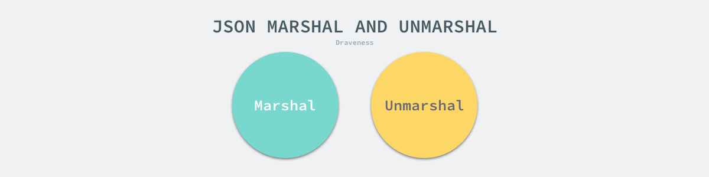
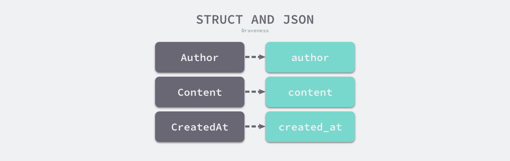
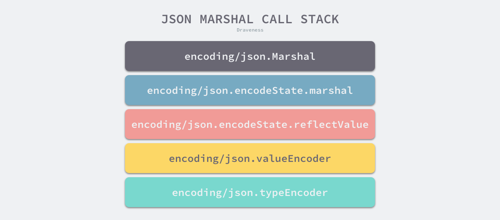
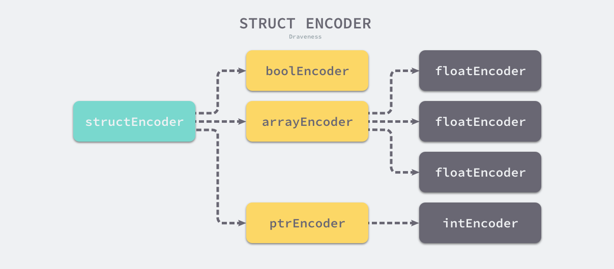

## std（标准库）JSON

**JSON**（**JavaScript** 对象表示，**JavaScript Object Notation**）作为一种轻量级的数据交换格式[1](https://draveness.me/golang/docs/part4-advanced/ch09-stdlib/golang-json/#fn:1)，在今天几乎占据了绝大多数的市场份额。虽然与更紧凑的数据交换格式相比，它的序列化和反序列化性能不足，但是 **JSON** 提供了良好的可读性与易用性，在不追求极致机制性能的情况下，使用 **JSON** 作为序列化格式是一种非常好的选择。


### 设计原理

几乎所有的现代编程语言都会将处理 **JSON** 的函数直接纳入标准库，Go 语言也不例外，它通过 [encoding/json](https://golang.org/pkg/encoding/json/) 对外提供标准的 **JSON** **序列化**和反序列化方法，即 [encoding/json.Marshal](https://draveness.me/golang/tree/encoding/json.Marshal) 和 [encoding/json.Unmarshal](https://draveness.me/golang/tree/encoding/json.Unmarshal)，它们也是包中最常用的两个方法。



序列化和反序列化的开销完全不同，**JSON 反序列化的开销是序列化开销的好几倍**，相信这背后的原因也非常好理解。Go 语言中的 JSON 序列化过程不需要被序列化的对象预先实现任何接口，它会通过反射获取结构体或者数组中的值并以树形的结构递归地进行编码，标准库也会根据 [encoding/json.Unmarshal](https://draveness.me/golang/tree/encoding/json.Unmarshal) 中传入的值对 JSON 进行解码。

Go 语言 JSON 标准库编码和解码的过程大量地运用了**反射**（**reflect**）这一特性，你会在本节的后半部分看到大量的反射代码，这一小节就不过多介绍了。我们在这里会简单介绍 JSON 标准库中的接口和标签，这是它为开发者提供的为数不多的影响编解码过程的接口。


#### 接口

在 JSON 序列化和反序列化的过程中，它会使用反射判断结构体类型是否实现了上述接口，如果实现了上述接口就会优先使用对应的方法进行编码和解码操作，除了这两个方法之外，Go 语言其实还提供了另外两个用于控制编解码结果的方法，即 [encoding.TextMarshaler](https://draveness.me/golang/tree/encoding.TextMarshaler) 和 [encoding.TextUnmarshaler](https://draveness.me/golang/tree/encoding.TextUnmarshaler)：

```go
type TextMarshaler interface {
	MarshalText() (text []byte, err error)
}

type TextUnmarshaler interface {
	UnmarshalText(text []byte) error
}
```

一旦发现 JSON 相关的序列化方法没有被实现，上述两个方法会作为候选方法被 JSON 标准库调用并参与编解码的过程。总的来说，我们可以在任意类型上实现上述这四个方法自定义最终的结果，后面的两个方法的适用范围更广，但是不会被 JSON 标准库优先调用。


#### 标签

Go 语言的结构体标签也是一个比较有趣的功能，在默认情况下，当我们在序列化和反序列化结构体时，标准库都会认为字段名和 JSON 中的键具有一一对应的关系，然而 Go 语言的字段一般都是驼峰命名法，JSON 中下划线的命名方式相对比较常见，所以使用标签这一特性直接建立键与字段之间的映射关系是一个非常方便的设计。



JSON 中的标签由两部分组成，如下所示的 `name` 和 `age` 都是标签名，后面的所有的字符串是标签选项，即 [encoding/json.tagOptions](https://draveness.me/golang/tree/encoding/json.tagOptions)，标签名和字段名会建立一一对应的关系，后面的标签选项也会影响编解码的过程：

```go
type Author struct {
    Name string `json:"name,omitempty"`
    Age  int32  `json:"age,string,omitempty"`
}
```

常见的两个标签是 `string` 和 `omitempty`，前者表示当前的整数或者浮点数是由 JSON 中的字符串表示的，而另一个字段 `omitempty` 会在字段为零值时，直接在生成的 JSON 中忽略对应的键值对，例如：`"age": 0`、`"author": ""` 等。标准库会使用如下所示的 [encoding/json.parseTag](https://draveness.me/golang/tree/encoding/json.parseTag) 来解析标签：

```go
/* belongs to encoding/json/tags.go */

// parseTag splits a struct field's json tag into its name and
// comma-separated options.
func parseTag(tag string) (string, tagOptions) {
	tag, opt, _ := strings.Cut(tag, ",")
	return tag, tagOptions(opt)
}
```

从该方法的实现中，我们能分析出 JSON 标准库中的合法标签是什么形式的：标签名和标签选项都以 `,` 连接，最前面的字符串为标签名，后面的都是标签选项。


### 序列化

[encoding/json.Marshal](https://draveness.me/golang/tree/encoding/json.Marshal) 是 JSON 标准库中提供的最简单的序列化函数，它会接收一个 `interface{}` 类型的值作为参数，这也意味着几乎全部的 Go 语言变量都可以被 JSON 标准库序列化，为了提供如此复杂和通用的功能，在静态语言中使用反射是常见的选项，下面我们来深入了解一下它的实现：

```go
// JSON cannot represent cyclic data structures and Marshal does not
// handle them. Passing cyclic structures to Marshal will result in
// an error.
//
func Marshal(v any) ([]byte, error) {
	e := newEncodeState()

	err := e.marshal(v, encOpts{escapeHTML: true})
	if err != nil {
		return nil, err
	}
	buf := append([]byte(nil), e.Bytes()...)

	encodeStatePool.Put(e)

	return buf, nil
}
```

上述方法会调用 [encoding/json.newEncodeState](https://draveness.me/golang/tree/encoding/json.newEncodeState) 从全局的编码状态池中获取 [encoding/json.encodeState](https://draveness.me/golang/tree/encoding/json.encodeState)，随后的序列化过程都会使用这个编码状态，该结构体也会在编码结束后被重新放回池中以便重复利用。



按照如上所示的复杂调用栈，一系列的序列化方法在最后获取了对象的反射类型并调用了 [encoding/json.newTypeEncoder](https://draveness.me/golang/tree/encoding/json.newTypeEncoder) 这个核心的编码方法，该方法会递归地为所有的类型找到对应的编码方法，不过它的执行过程可以分成以下两个步骤：

1. 获取用户自定义的 [encoding/json.Marshaler](https://draveness.me/golang/tree/encoding/json.Marshaler) 或者 [encoding.TextMarshaler](https://draveness.me/golang/tree/encoding.TextMarshaler) 编码器；
2. 获取标准库中为基本类型内置的 JSON 编码器；

在该方法的第一部分，我们会检查当前值的类型是否可以使用用户自定义的编码器，这里有两种不同的判断方法：

```go
// newTypeEncoder constructs an encoderFunc for a type.
// The returned encoder only checks CanAddr when allowAddr is true.
func newTypeEncoder(t reflect.Type, allowAddr bool) encoderFunc {
	// If we have a non-pointer value whose type implements
	// Marshaler with a value receiver, then we're better off taking
	// the address of the value - otherwise we end up with an
	// allocation as we cast the value to an interface.
	if t.Kind() != reflect.Pointer && allowAddr && reflect.PointerTo(t).Implements(marshalerType) {
		return newCondAddrEncoder(addrMarshalerEncoder, newTypeEncoder(t, false))
	}
	if t.Implements(marshalerType) {
		return marshalerEncoder
	}
	if t.Kind() != reflect.Pointer && allowAddr && reflect.PointerTo(t).Implements(textMarshalerType) {
		return newCondAddrEncoder(addrTextMarshalerEncoder, newTypeEncoder(t, false))
	}
	if t.Implements(textMarshalerType) {
		return textMarshalerEncoder
	}

	switch t.Kind() {
	case reflect.Bool:
		return boolEncoder
	case reflect.Int, reflect.Int8, reflect.Int16, reflect.Int32, reflect.Int64:
		return intEncoder
	case reflect.Uint, reflect.Uint8, reflect.Uint16, reflect.Uint32, reflect.Uint64, reflect.Uintptr:
		return uintEncoder
	case reflect.Float32:
		return float32Encoder
	case reflect.Float64:
		return float64Encoder
	case reflect.String:
		return stringEncoder
	case reflect.Interface:
		return interfaceEncoder
	case reflect.Struct:
		return newStructEncoder(t)
	case reflect.Map:
		return newMapEncoder(t)
	case reflect.Slice:
		return newSliceEncoder(t)
	case reflect.Array:
		return newArrayEncoder(t)
	case reflect.Pointer:
		return newPtrEncoder(t)
	default:
		return unsupportedTypeEncoder
	}
}
```

1. 如果当前值是值类型、可以取地址并且值类型对应的指针类型实现了 [encoding/json.Marshaler](https://draveness.me/golang/tree/encoding/json.Marshaler) 接口，调用 [encoding/json.newCondAddrEncoder](https://draveness.me/golang/tree/encoding/json.newCondAddrEncoder) 获取一个条件编码器，条件编码器会在 [encoding/json.addrMarshalerEncoder](https://draveness.me/golang/tree/encoding/json.addrMarshalerEncoder) 失败时重新选择新的编码器；
2. 如果当前类型实现了 [encoding/json.Marshaler](https://draveness.me/golang/tree/encoding/json.Marshaler) 接口，可以直接使用 [encoding/json.marshalerEncoder](https://draveness.me/golang/tree/encoding/json.marshalerEncoder) 序列化；

在这段代码中，标准库对 [encoding.TextMarshaler](https://draveness.me/golang/tree/encoding.TextMarshaler) 的处理也几乎完全相同，只是它会先判断 [encoding/json.Marshaler](https://draveness.me/golang/tree/encoding/json.Marshaler) 接口，这也印证了我们在设计原理一节中的推测。

[encoding/json.newTypeEncoder](https://draveness.me/golang/tree/encoding/json.newTypeEncoder) 会根据传入值的反射类型获取对应的编码器，其中包括 `bool`、`int`、`float` 等基本类型编码器等和数组、结构体、切片等复杂类型的编码器。

我们在这里就不一一介绍全部的内置类型编码器了，只挑选其中几个帮助各位读者了解整体的设计。首先我们来看布尔值的 JSON 编码器，它的实现很简单，甚至没有太多值得介绍的地方：

```go
func boolEncoder(e *encodeState, v reflect.Value, opts encOpts) {
	if opts.quoted {
		e.WriteByte('"')
	}
	if v.Bool() {
		e.WriteString("true")
	} else {
		e.WriteString("false")
	}
	if opts.quoted {
		e.WriteByte('"')
	}
}
```

它会根据当前值向编码状态中写入不同的字符串，也就是 `true` 或者 `false`，除此之外还会根据编码配置决定是否要在布尔值周围写入双引号 `"`，而其他的基本类型编码器也都大同小异。

复杂类型的编码器有着相对复杂的控制结构，我们在这里以结构体的编码器 [encoding/json.structEncoder](https://draveness.me/golang/tree/encoding/json.structEncoder) 为例介绍它们的原理，[encoding/json.newStructEncoder](https://draveness.me/golang/tree/encoding/json.newStructEncoder) 会为当前结构体的所有字段调用 [encoding/json.typeEncoder](https://draveness.me/golang/tree/encoding/json.typeEncoder) 获取类型编码器并返回 [encoding/json.structEncoder.encode](https://draveness.me/golang/tree/encoding/json.structEncoder.encode)：

```go
func newStructEncoder(t reflect.Type) encoderFunc {
	se := structEncoder{fields: cachedTypeFields(t)}
	return se.encode
}
```

从 [encoding/json.structEncoder.encode](https://draveness.me/golang/tree/encoding/json.structEncoder.encode) 的实现我们能看出结构体序列化的结果，该方法会遍历结构体中的全部字段，在写入了字段名后，它会调用字段对应类型的编码方法将该字段对应的 JSON 写入缓冲区：

```go
func (se structEncoder) encode(e *encodeState, v reflect.Value, opts encOpts) {
	next := byte('{')
FieldLoop:
	for i := range se.fields.list {
		f := &se.fields.list[i]

		// Find the nested struct field by following f.index.
		fv := v
		for _, i := range f.index {
			if fv.Kind() == reflect.Pointer {
				if fv.IsNil() {
					continue FieldLoop
				}
				fv = fv.Elem()
			}
			fv = fv.Field(i)
		}

		if f.omitEmpty && isEmptyValue(fv) {
			continue
		}
		e.WriteByte(next)
		next = ','
		if opts.escapeHTML {
			e.WriteString(f.nameEscHTML)
		} else {
			e.WriteString(f.nameNonEsc)
		}
		opts.quoted = f.quoted
		f.encoder(e, fv, opts)
	}
	if next == '{' {
		e.WriteString("{}")
	} else {
		e.WriteByte('}')
	}
}
```

数组以及指针等编码器的实现原理与该方法也没有太多的区别，它们都会使用类似的策略递归地调用持有字段的编码方法，这也就能形成一个如下图所示的树形结构：



树形结构的所有叶节点都是基础类型编码器或者开发者自定义的编码器，得到了整棵树的编码器之后会调用 [encoding/json.encodeState.reflectValue](https://draveness.me/golang/tree/encoding/json.encodeState.reflectValue) 从根节点依次调用整棵树的序列化函数，整个 JSON 序列化的过程查找类型和子类型的编码方法并调用的过程，它利用了大量反射的特性做到了足够的通用。


### 反序列化

标准库会使用 [encoding/json.Unmarshal](https://draveness.me/golang/tree/encoding/json.Unmarshal) 处理 JSON 的反序列化，与执行过程确定的序列化相比，反序列化的过程是逐渐探索的过程，所以会复杂很多，开销也会高出几倍。因为 Go 语言的表达能力比较有限，反序列化的使用相对比较繁琐，所以需要传入一个变量帮助标准库进行反序列化：

```go
func Unmarshal(data []byte, v interface{}) error {
	var d decodeState
	err := checkValid(data, &d.scan)
	if err != nil {
		return err
	}

	d.init(data)
	return d.unmarshal(v)
}
```

在真正执行反序列化之前，我们会先调用 [encoding/json.checkValid](https://draveness.me/golang/tree/encoding/json.checkValid) 验证传入 JSON 的合法性保证在反序列化的过程中不会遇到语法错误的问题，在通过合法性的验证之后，标准库会初始化数据并调用 [encoding/json.decodeState.unmarshal](https://draveness.me/golang/tree/encoding/json.decodeState.unmarshal) 开始反序列化：

```go
func (d *decodeState) unmarshal(v any) error {
	rv := reflect.ValueOf(v)
	if rv.Kind() != reflect.Pointer || rv.IsNil() {
		return &InvalidUnmarshalError{reflect.TypeOf(v)}
	}

	d.scan.reset()
	d.scanWhile(scanSkipSpace)
	// We decode rv not rv.Elem because the Unmarshaler interface
	// test must be applied at the top level of the value.
	err := d.value(rv)
	if err != nil {
		return d.addErrorContext(err)
	}
	return d.savedError
}
```

如果传入的值不是指针或者是空指针，当前方法会返回我们经常会见到的错误 [encoding/json.InvalidUnmarshalError](https://draveness.me/golang/tree/encoding/json.InvalidUnmarshalError)，使用格式化输出可以将该错误转换成 **"json: Unmarshal(non-pointer xxx)"**。该方法调用的 [encoding/json.decodeState.value](https://draveness.me/golang/tree/encoding/json.decodeState.value) 是所有反序列化过程的执行入口：

```go
// value consumes a JSON value from d.data[d.off-1:], decoding into v, and
// reads the following byte ahead. If v is invalid, the value is discarded.
// The first byte of the value has been read already.
func (d *decodeState) value(v reflect.Value) error {
	switch d.opcode {
	default:
		panic(phasePanicMsg)

	case scanBeginArray:
		if v.IsValid() {
			if err := d.array(v); err != nil {
				return err
			}
		} else {
			d.skip()
		}
		d.scanNext()

	case scanBeginObject:
		if v.IsValid() {
			if err := d.object(v); err != nil {
				return err
			}
		} else {
			d.skip()
		}
		d.scanNext()

	case scanBeginLiteral:
		// All bytes inside literal return scanContinue op code.
		start := d.readIndex()
		d.rescanLiteral()

		if v.IsValid() {
			if err := d.literalStore(d.data[start:d.readIndex()], v, false); err != nil {
				return err
			}
		}
	}
	return nil
}
```

该方法作为最顶层的反序列化方法可以接收三种不同类型的值，也就是数组、字面量和对象，这三种类型都可以作为 JSON 的顶层对象，我们首先来了解一下标准库是如何解析 JSON 中对象的，该过程会使用 [encoding/json.decodeState.object](https://draveness.me/golang/tree/encoding/json.decodeState.object) 进行反序列化，它会先调用 [encoding/json.indirect](https://draveness.me/golang/tree/encoding/json.indirect) 查找当前类型对应的非指针类型：

```go
func (d *decodeState) object(v reflect.Value) error {
	u, ut, pv := indirect(v, false)
	if u != nil {
		start := d.readIndex()
		d.skip()
		return u.UnmarshalJSON(d.data[start:d.off])
	}
	...
}
```

在调用 [encoding/json.indirect](https://draveness.me/golang/tree/encoding/json.indirect) 的过程中，如果当前值的类型是 `**Type`，那么它会依次检查形如 `**Type`、`*Type` 和 `Type` 类型是否实现了 [encoding/json.Unmarshal](https://draveness.me/golang/tree/encoding/json.Unmarshal) 或者 [encoding.TextUnmarshaler](https://draveness.me/golang/tree/encoding.TextUnmarshaler) 接口；如果实现了该接口，标准库会直接调用 `UnmarshalJSON` 使用开发者自定义的方法完成反序列化。

在其他情况下，我们仍然会回到默认的逻辑中处理对象中的键值对，如下所示的代码会调用 [encoding/json.decodeState.rescanLiteral](https://draveness.me/golang/tree/encoding/json.decodeState.rescanLiteral) 扫描 JSON 中的键并在结构体中找到对应字段的反射值，接下来继续扫描符号 `:` 并调用 [encoding/json.decodeState.value](https://draveness.me/golang/tree/encoding/json.decodeState.value) 解析对应的值：

```go
func (d *decodeState) object(v reflect.Value) error {
	...
	v = pv
	t := v.Type()
	fields = cachedTypeFields(t)
	for {
		start := d.readIndex()
		d.rescanLiteral()
		item := d.data[start:d.readIndex()]
		key, _ := d.unquoteBytes(item)
		var subv reflect.Value
		var f *field
		if i, ok := fields.nameIndex[string(key)]; ok {
			f = &fields.list[i]
		}
		if f != nil {
			subv = v
			for _, i := range f.index {
				subv = subv.Field(i)
			}
		}

		if d.opcode != scanObjectKey {
			panic(phasePanicMsg)
		}
		d.scanWhile(scanSkipSpace)

		if err := d.value(subv); err != nil {
			return err
		}
		if d.opcode == scanEndObject {
			break
		}
	}
	return nil
}
```

Go

当上述方法调用 [encoding/json.decodeState.value](https://draveness.me/golang/tree/encoding/json.decodeState.value) 时，该方法会重新判断键对应的值是否是对象、数组或者字面量，因为数组和对象都是集合类型，所以该方法会递归地进行扫描，在这里就不再继续介绍这些集合类型的解析过程了，我们来简单分析一下字面量是如何被处理的：

```go
func (d *decodeState) value(v reflect.Value) error {
	switch d.opcode {
	default:
		panic(phasePanicMsg)

	case scanBeginArray:
		...
	case scanBeginObject:
		...
	case scanBeginLiteral:
		start := d.readIndex()
		d.rescanLiteral()
		if v.IsValid() {
			if err := d.literalStore(d.data[start:d.readIndex()], v, false); err != nil {
				return err
			}
		}
	}
	return nil
}
```

字面量的扫描会通过 [encoding/json.decodeState.rescanLiteral](https://draveness.me/golang/tree/encoding/json.decodeState.rescanLiteral)，该方法会依次扫描缓冲区中的字符并根据字符的不同对字符串进行切片，整个过程有点像编译器的词法分析：

```go
func (d *decodeState) rescanLiteral() {
	data, i := d.data, d.off
Switch:
	switch data[i-1] {
	case '"': // string
		...
	case '0', '1', '2', '3', '4', '5', '6', '7', '8', '9', '-': // number
		...
	case 't': // true
		i += len("rue")
	case 'f': // false
		i += len("alse")
	case 'n': // null
		i += len("ull")
	}
	if i < len(data) {
		d.opcode = stateEndValue(&d.scan, data[i])
	} else {
		d.opcode = scanEnd
	}
	d.off = i + 1
}
```

因为 JSON 中的字面量其实也只包含字符串、数字、布尔值和空值几种，所以该方法的实现也不会特别复杂，当该方法扫描了对应的字面量之后，会调用 [encoding/json.decodeState.literalStore](https://draveness.me/golang/tree/encoding/json.decodeState.literalStore) 字面量存储到反射类型变量所在的地址中，在这个过程中会调用反射的 [reflect.Value.SetInt](https://draveness.me/golang/tree/reflect.Value.SetInt)、[reflect.Value.SetFloat](https://draveness.me/golang/tree/reflect.Value.SetFloat) 和 [reflect.Value.SetBool](https://draveness.me/golang/tree/reflect.Value.SetBool) 等方法。