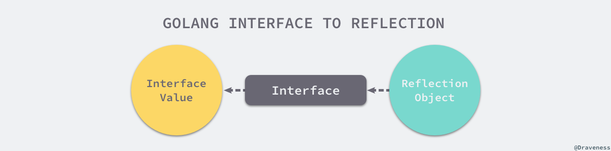
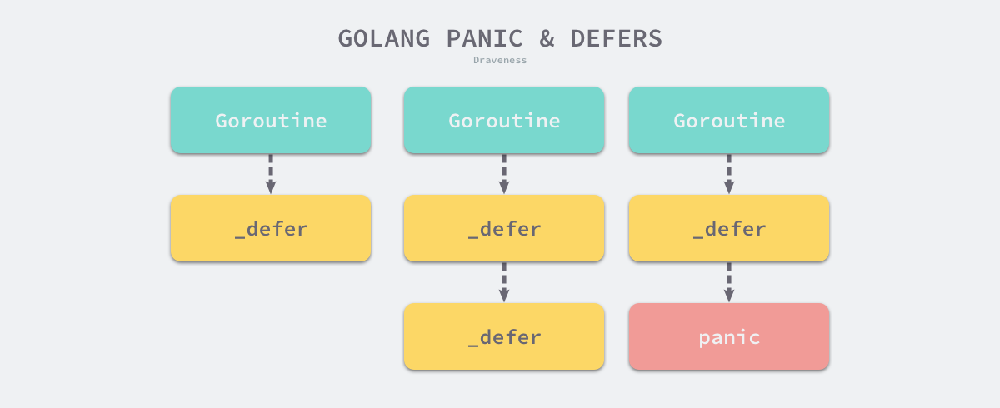
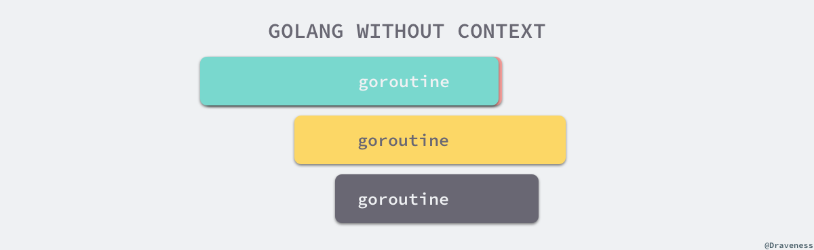
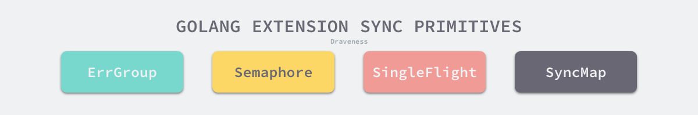

# Go-learning

- Golang~~复习~~（学习）笔记，只有部分内容~

### todo

- [ ] rate limiting
- [ ] staterful goroutines
- [ ] text/template

## 目录

1. [切片](#切片（slices）)
2. [范围遍历](#范围遍历（range）)
3. [字符串（string），字节数组（bytes），符文（runes）和字符（characters）](#字符串（string），字节数组（bytes），符文（runes）和字符（characters）)
4. [可变参数函数](#可变参数函数)
5. [函数闭包](#函数闭包)
6. [结构体封装（继承）](#结构体封装（继承）)
7. [Go泛型](#Go泛型)
8. [带`error`处理的`errgroup`](#带`error`处理的`errgroup`)
9. [`recover`现场恢复](#`recover`现场恢复)
10. [标准化格式JSON和XML](#标准化格式JSON和XML)
11. [URL的自动解析](#URL的自动解析)
12. [`reflect`反射机制](#`reflect`反射机制)
13. [for-range的特殊现象](#for-range的特殊现象)
14. [defer](#defer)
15. [panic和recover](#panic和recover)
16. [`make`和`new`](#`make`和`new`)
17. [`context.Context`](#`context.Context`)
18. [同步原语与锁](#同步原语与锁)


## 章节

### 切片（slices）

- Golang的切片类型类似于数组类型，但是相较于数组类型，更加灵活，golang的切片类型加入了类似于列表（list）的功能，使切片类型更加灵活可用；

- 切片类型是在golang数组类型之上构建的抽象类型；


#### 参考

- https://tip.golang.org/ref/spec
- https://go.dev/blog/slices-intro
- https://go.dev/doc/effective_go#slices


#### 数组（arrays）

- 数组类型需要指定数据类型和数据长度，因此`[4]int`和`[5]int`是完全不同的两个类型，之间无法闲事比较；

- 数组从下标0开始索引，就像其他语言的一样；

- 数组不需要显式地初始化，当指明类型时，会生成元素全为0的数组（自动初始化）；

  ```go
  var a [4]int
  // a == [0,0,0,0]
  ```

  

- 数组在作为参数传递时，不是将数组变量看作为一个指向数组的指针，这是C语言中的做法，而是看作一个整体，这就意味着当传递参数时，会引起复制机制。如果需要规避这种复制，通用的做法是传递指向数组的指针；

  ```go
  var a [4]int
  for i := 0; i < len(a); i++ {
  a[i] = i
  }
  // [0,1,2,3]
  reverse(&a)
  // [3,2,1,0]
  ```

- 数组拥有不同的初始化方法

  ```go
  a := [4]int{1, 2, 3, 4}
  a := [...]int{1, 2, 3, 4}
  ```


#### 切片（slices）

- 在golang中最常见的“数组”数据结构，切片的格式为`[]T`，其中`T`是切片元素的类型，同样，切片不指定长度；

  ```go
  nums := []int{1, 2, 3, 4}
  ```

- 切片可以用内置函数`make`来初始化，有以下几个参数，[]`T`代表了切片数据类型，`len`代表了初始化长度，`cap`是数组初始化容量，返回的是分配了一个数组的切片；

  ```go
  func make([]T, len, cap) []T
  ```

- 当然，`cap`可以通过`len`推测出，所以可以省略；

- 切片支持”切片“类型的访问，采用左闭右开区间的方法，这和python中数组的处理方式类似；

  ```go
  b := []byte{'a','b','c','d','e','f'}
  // b[1:4] == []byte{'b','c','d'}
  ```


#### 类型转换

- **数组转切片**

  ``` go
  a := [3]int{1, 2, 3}
  s := a[:] // slice
  ```

- **切片转数组**（v1.71+）

  ```go
  s := make([]byte, 2, 4)
  s0 := (*[0]byte)(s)      // s0 != nil
  s1 := (*[1]byte)(s[1:])  // &s1[0] == &s[1]
  s2 := (*[2]byte)(s)      // &s2[0] == &s[0]
  s4 := (*[4]byte)(s)      // panics: len([4]byte) > len(s)
  ```


#### 切片的内部构造

- 切片是数组段的描述符。它由指向数组的指针、段的长度和它的容量（段的最大长度）组成：

  

- 假设变量`s`，使用`make([]byte, 5)`初始化，那么切片就是这样的：

  

- `len`是切片所引用的元素的数量，`cap`是底层数组中的元素数量（从切片指针引用的元素开始）：

  ```go
  s = s[2:4]
  ```

  

- 切片并不复制切片的数据，它创建一个指向原始数组的新片值，这使得切片操作与操作数组索引一样有效。因此，修改重切片的元素（而不是切片本身）会修改原始切片的元素：

  ```go
  a := []int{1, 2, 3, 4}
  b := a[2:] // b == []int{3, 4}
  b[1] := 1  // b == []int{1, 4}
  // a == []int{1, 2, 1, 4}
  ```

- 之前我们切片了`s` 的一部分，但是完全没有到达它底层的最大长度，这就意味着，切片能恢复到它以前的结尾，即长度增长：

  ```go
  s := s[:cap(s)]
  ```

  

- 切片不能超出其容量，因为尝试超过容量的切片行为将导致运行时产生`panic`，就像在数组越界一样。类似的，切片不能在0以下重新切片，以访问数组中更早的元素。


#### 安全的切片扩容（`copy` & `append`）

- 为了增加切片的容量，必须创建一个更大的新切片，并将原始切片的内容复制到其中，这项技术在大多数语言中由动态数组在幕后实现：

  ```go
  t := make([]byte, len(s), (cap(s)+1)*2)
  copy(t, s)
  s = t
  ```

- 当不需要关注性能时，可以使用内置的函数`append`进行扩容：

  ```go
  func append(s []T, x ...T) []T
  ```

  ```go
  a := make([]int, 1)
  // a == []int{0}
  a = append(a, 1, 2, 3)
  // a == []int{0, 1, 2, 3}
  b := []int{4, 5, 6}
  a = append(a, b...)
  // a == []int{0, 1, 2, 3, 4, 5, 6}
  ```

  

#### 要点

- 如前所述，重新切片一个切片并不会复制底层数组，整个数组将保存在内存中，直到不再被引用。有时候，这可能会导致程序在只需要一小部分数据时将所有数据保存在内存中：

  ```go
  var digitRegexp = regexp.MustCompile("[0-9]+")
  
  func FindDigits(filename string) []byte {
      b, _ := ioutil.ReadFile(filename)
      return digitRegexp.Find(b)
  }
  ```

  这段代码的返回的`[]byte`指向包含整个文件的数组。由于切片引用的是原始数组，所以只要切片被没有超出适用范围，哪怕是只需要使用几个字节，垃圾收集器就不能释放数组。为了解决这个问题，我们需要将一部分数据复制到其他的切片中，而不是对其进行引用：

  ```go
  func CopyDigits(filename string) []byte {
      b, _ := ioutil.ReadFile(filename)
      b = digitRegexp.Find(b)
      c := make([]byte, len(b))
      copy(c, b)
      return c
  }
  ```

---


### 范围遍历（range）

- `for-range`是golang里常见的范围便利方法，可以遍历`array`，`slice`，`map`，`string`；

  ```go
  nums := []int{2, 3, 4}
  // idx & num
  for idx, num := range nums {
  	...
  }
  // num
  for _, num := range nums {
  	...
  }
  ```

  ```go
  kvs := map[int]int{1: 2, 2: 3, 3: 4}
  // key-value
  for k, v := range kvs {
  	...
  }
  // key
  for k := range kvs {
  	...
  }
  ```

  ```go
  for i, c := range "go" {
  	...
  }
  ```

---


### 字符串（string），字节数组（bytes），符文（runes）和字符（characters）

- 以下是不同的”字符“表达，各有不同：
  - byte, character, rune
  - Unicode, UTF-8
  - string, string literal


#### 参考

- https://go.dev/blog/strings


#### 字符串（string）

- 字符串是一个只读的字节切片，只不过该字节切片并不关心其存储的内容是什么，只要是一些字节即可，也可以看作是一些`uint8`，即`0x00~0xFF`：

  ```go
  const s = "\xbd\xb2\x3d\xbc\x20\xe2\x8c\x98"
  // print s -> "��=� ⌘"
  ```

  如果需要逐字节读取：

  ```go
  for i := 0; i < len(s); i++ {
  	fmt.Printf("%x ", s[i])
  }
  // print s -> "bd b2 3d bc 20 e2 8c 98"
  
  fmt.Printf("%x\n", sample) // 同样是十六进制
  // print s -> "bdb23dbc20e28c98"
  
  fmt.Printf("% x\n", sample) // 多加了个空格，不错的格式化方法
  // print s -> "bd b2 3d bc 20 e2 8c 98"
  
  fmt.Printf("%q\n", sample) // 只显示有效字符，其余用十六进制表示
  // print s -> "\xbd\xb2=\xbc ⌘"
  
  fmt.Printf("%+q\n", sample) // 可以看到上一种显示中的一些端倪
  // print s -> "\xbd\xb2=\xbc \u2318"
  ```


#### UTF-8和string literals（字符串字面值）

- golang的源代码是以UTF-8来编码的，那么UTF-8的字符串是如何转换为字节字符串呢，看一个例子，在之前的内容里出现了一个特殊字符`⌘`，这代表了一种名胜古迹，这种特殊字符并没有出现在ASCII码中：

  ```go
  const placeOfInterest = `⌘`
  fmt.Printf("plain string: %s\n", placeOfInterest)
  fmt.Printf("quoted string: %+q\n", placeOfInterest)
  fmt.Printf("hex bytes: % x\n", placeOfInterest)
  
  // print placeOfInterest -> 
  plain string: 	⌘
  quoted string: 	"\u2318"
  hex bytes: 		e2 8c 98  
  ```

  所以，golang将特殊字符UTF-8转换成通用的字节字符串存储，但是golang不仅仅只有一种编码方式，只不过显示的时候都是使用UTF-8而已，所以这种显示就被称之为字符串字面值（string literals）。


#### 符文（rune）

- 码点（code point）在Unicode中的含义与符文（rune）在golang中是一致的，它代表了一个复杂的字符（chararcter），这里的字符不再是简单的英文字符，也有可能是中文等，一个符文在golang里处理成一个`int32`类型：

  ```go
  const s = `安倍晋三挂了` // 6个rune，长度为18而非6
  
  for index, runeValue := range s {
  	fmt.Printf("%#U starts at byte position %d\n", runeValue, index)
  }
  
  for i, w := 0, 0; i < len(s); i += w {
      runeValue, width := utf8.DecodeRuneInString(s[i:])
      fmt.Printf("%#U starts at byte position %d\n", runeValue, i)
      w = width
  }
  
  // same print ->
  U+5B89 '安' starts at byte position 0
  U+500D '倍' starts at byte position 3 
  U+664B '晋' starts at byte position 6 
  U+4E09 '三' starts at byte position 9 
  U+6302 '挂' starts at byte position 12
  U+4E86 '了' starts at byte position 15
  ```


---


### 可变参数函数

- 参数个数可变化，从无参数到数个参数

```go
func sum(args ...int) {
	ans := 0
	for _, arg := range args {
		ans += arg
	}
	fmt.Println(args, ans)
}

sum()
// [] 0
sum(1, 2, 3)
// [1 2 3] 6
sum([]int{1, 2, 3, 4}...)
// [1 2 3 4] 10
```

---


### 函数闭包

- 匿名函数，每个函数闭包参数之间相互独立，但是一个函数闭包之间共享参数

```go
func initFunc() func() int {
	i := 0
	return func() int {
		i++
		return i
	}
}

f1 := initFunc()	// init
fmt.Println(f1())	// 1
fmt.Println(f1())	// 2
fmt.Println(f1())	// 3
f2 := initFunc()	// init
fmt.Println(f2())	// 1
```

---


### 结构体封装（继承）

- 在go中没有显式的继承这一说法，但是有个东西可以看作是继承，而且还是多继承，同时也可以重写函数方法

```go
type Animal interface {
	Speak() string
}

type Dog struct {
	Age int
}

func (d *Dog) Speak() string {
	return "汪"
}

func (d *Dog) Jump() string {
	return "0"
}

type Husky struct {
	Dog
	Name string
    Age	 int
}

func (h *Husky) Speak() string {
	return "嗷呜"
}

func (h *Husky) Jump() string {
	return "2"
}
```

- `Husky`这个数据结构继承了`Dog`，同时也实现了`Animal`这个接口，还实现了`Animal`的`Speak`方法，重写了`Dog`的`Jump`方法，跑一下：

```go
james := &Husky{Dog{Age: 3}, "james", 2}
println(james.Speak(), james.Dog.Speak())	// 嗷呜 汪
println(james.Age, james.Dog.Age)			// 2 3
println(james.Jump(), james.Dog.Jump())		// 2 0
```

- 显然都得到了重写，但是还能调用基类的属性和方法
- 如果我修改了基类的属性字段，变成了事实上的私有属性`age`，那么，在包外是无法访问的，无论是

```go
type Dog struct {
	age int
}

println(james.Age, james.Dog.age)
```

---


### Go泛型

- 类似于C++和Java的泛型，Go在1.18以后也支持起了泛型，泛型是很优雅的编程方式，虽然会带来一定的额外开销
- 两个关键词`comparable`和`any`

```go
func MapKeys[K comparable, T any](m map[K]T) []K {
	r := make([]K, 0, len(m))
	for k := range m {
		r = append(r, k)
	}
	return r
}

type List[T any] struct {
	head, tail *element[T]
}

type element[T any] struct {
	prev, next *element[T]
	val        T
}

func (l *List[T]) Push(v T) {
	if l.tail == nil {
		l.head = &element[T]{val: v}
		l.tail = l.head
	} else {
		l.tail.next = &element[T]{val: v, prev: l.tail}
		l.tail = l.tail.next
	}
}

func (l *List[T]) GetAll(reverse bool) []T {
	var elems []T
	if reverse {
		for e := l.tail; e != nil; e = e.prev {
			elems = append(elems, e.val)
		}
	} else {
		for e := l.head; e != nil; e = e.next {
			elems = append(elems, e.val)
		}
	}
	return elems
}
```

---


### 带`error`处理的`errgroup`

- 文档路径：https://pkg.go.dev/golang.org/x/sync/errgroup

- `errgroup`为处理公共任务的子任务的`goroutine`组提供了同步、错误传播和上下文取消

---


### `recover`现场恢复

- `recover()`函数用于在`panic()`之后的`defer`申明中

```go
package main

import "fmt"

func mayPanic() {
    panic("a problem")
}

func main() {

    defer func() {
        if r := recover(); r != nil {

            fmt.Println("Recovered. Error:\n", r)
        }
    }()

    mayPanic()

    fmt.Println("After mayPanic()")
}
```

---


### 标准化格式JSON和XML

- `json`: https://go.dev/blog/json
- `XML`: https://gobyexample.com/xml

```go
package main

import (
    "encoding/xml"
    "fmt"
)

type Plant struct {
    XMLName xml.Name `xml:"plant"`
    Id      int      `xml:"id,attr"`
    Name    string   `xml:"name"`
    Origin  []string `xml:"origin"`
}

func (p Plant) String() string {
    return fmt.Sprintf("Plant id=%v, name=%v, origin=%v",
        p.Id, p.Name, p.Origin)
}

func main() {
    coffee := &Plant{Id: 27, Name: "Coffee"}
    coffee.Origin = []string{"Ethiopia", "Brazil"}

    out, _ := xml.MarshalIndent(coffee, " ", "  ")
    fmt.Println(string(out))

    fmt.Println(xml.Header + string(out))

    var p Plant
    if err := xml.Unmarshal(out, &p); err != nil {
        panic(err)
    }
    fmt.Println(p)

    tomato := &Plant{Id: 81, Name: "Tomato"}
    tomato.Origin = []string{"Mexico", "California"}

    type Nesting struct {
        XMLName xml.Name `xml:"nesting"`
        Plants  []*Plant `xml:"parent>child>plant"`
    }

    nesting := &Nesting{}
    nesting.Plants = []*Plant{coffee, tomato}

    out, _ = xml.MarshalIndent(nesting, " ", "  ")
    fmt.Println(string(out))
}
```

---


### URL的自动解析

- https://adam.herokuapp.com/past/2010/3/30/urls_are_the_uniform_way_to_locate_resources/
- https://gobyexample.com/url-parsing

---


### `reflect`反射机制

- https://draveness.me/golang/docs/part2-foundation/ch04-basic/golang-reflect/

##### 	接口到反射对象


```go
package main

import (
	"fmt"
	"reflect"
)

func main() {
	author := "draven"
	fmt.Println("TypeOf author:", reflect.TypeOf(author))
	fmt.Println("ValueOf author:", reflect.ValueOf(author))
}

// TypeOf author:  string
// ValueOf author: draven
```

- [`reflect.TypeOf`](https://draveness.me/golang/tree/reflect.TypeOf) 获取了变量 `author` 的类型，[`reflect.ValueOf`](https://draveness.me/golang/tree/reflect.ValueOf) 获取了变量的值 `draven`

##### 反射对象到接口



不过调用 [`reflect.Value.Interface`](https://draveness.me/golang/tree/reflect.Value.Interface) 方法只能获得 `interface{}` 类型的变量，如果想要将其还原成最原始的状态还需要经过如下所示的显式类型转换：

```go
v := reflect.ValueOf(1)
v.Interface().(int)
```

- 从反射对象到接口值的过程是从接口值到反射对象的镜面过程，两个过程都需要经历两次转换：
  - 从接口值到反射对象：
    - 从基本类型到接口类型的类型转换；
    - 从接口类型到反射对象的转换；
  - 从反射对象到接口值：
    - 反射对象转换成接口类型；
    - 通过显式类型转换变成原始类型；


##### 反射值更新

- 特殊情况下需要从反射中获取值，并更新他，前提是并不知道数据类型，即只知道是`reflect.Value`

```go
func main() {
	i := 1
	v := reflect.ValueOf(i)
	v.SetInt(10)
	fmt.Println(i)
}

// panic: reflect: reflect.Value.SetInt using unaddressable value                               
// goroutine 1 [running]:                                        
// reflect.flag.mustBeAssignableSlow(0x0?)                       
//         D:/Program Files/Go/src/reflect/value.go:262 +0x85    
// reflect.flag.mustBeAssignable(...)                            
//         D:/Program Files/Go/src/reflect/value.go:249          
// reflect.Value.SetInt({0x363420?, 0x3fe928?, 0x2d52f9?}, 0xa)  
//         D:/Program Files/Go/src/reflect/value.go:2161 +0x48   
// main.main()                                                   
//         F:/My Github Repositories/GoExample/main.go:11 +0xb1  

```

- 直接方法是无法设置的，但是可以通过获取指针来设置，这种方法是显然的：
  1. 调用 [`reflect.ValueOf`](https://draveness.me/golang/tree/reflect.ValueOf) 获取变量指针
  2. 调用 [`reflect.Value.Elem`](https://draveness.me/golang/tree/reflect.Value.Elem) 获取指针指向的变量
  3. 调用 [`reflect.Value.SetInt`](https://draveness.me/golang/tree/reflect.Value.SetInt) 更新变量的值

```go
func main() {
	i := 1
	v := reflect.ValueOf(&i)
	v.Elem().SetInt(10)
	fmt.Println(i)
}

// 10
```

##### 利用反射调用函数

1. 通过 [`reflect.ValueOf`](https://draveness.me/golang/tree/reflect.ValueOf) 获取函数 `Add` 对应的反射对象；
2. 调用 [`reflect.rtype.NumIn`](https://draveness.me/golang/tree/reflect.rtype.NumIn) 获取函数的入参个数；
3. 多次调用 [`reflect.ValueOf`](https://draveness.me/golang/tree/reflect.ValueOf) 函数逐一设置 `argv` 数组中的各个参数；
4. 调用反射对象 `Add` 的 [`reflect.Value.Call`](https://draveness.me/golang/tree/reflect.Value.Call) 方法并传入参数列表；
5. 获取返回值数组、验证数组的长度以及类型并打印其中的数据；

```go
func Add(a, b int) int { return a + b }

func main() {
	v := reflect.ValueOf(Add)
	if v.Kind() != reflect.Func {
		return
	}
	t := v.Type()
	argv := make([]reflect.Value, t.NumIn())
	for i := range argv {
		if t.In(i).Kind() != reflect.Int {
			return
		}
		argv[i] = reflect.ValueOf(i)
	}
	result := v.Call(argv)
	if len(result) != 1 || result[0].Kind() != reflect.Int {
		return
	}
	fmt.Println(result[0].Int()) // #=> 1
}

// 1
```

---


### for-range的特殊现象

##### 有限迭代

```go
func main() {
	arr := []int{1, 2, 3}
	for _, v := range arr {
		arr = append(arr, v)
	}
	fmt.Println(arr)
}

// 1 2 3 1 2 3
```

- 只有原数组会被遍历，而不会出现死循环的情况；

##### 数组的指针和指针数组

```go
func main() {
	arr := []int{1, 2, 3}
	var newArr []*int
	for _, v := range arr {
		newArr = append(newArr, &v)
	}
	for _, v := range newArr {
		fmt.Println(*v)
	}
}

// 3 3 3
```

- 👆是不正常的，👇是正常的

```go
func main() {
	arr := []int{1, 2, 3}
	var newArr []*int
	for i, _ := range arr {
		newArr = append(newArr, &arr[i])
	}
	for _, v := range newArr {
		fmt.Println(*v)
	}
}

// 1 2 3
```

##### 哈希表的随机遍历

- 哈希表的遍历是随机的，`key`的顺序是不确定的

```go
func main() {
	hash := map[string]int{
		"1": 1,
		"2": 2,
		"3": 3,
	}
	for k, v := range hash {
		println(k, v)
	}
}
```

#### 原理

##### `for range a{}` 

```go
ha := a
hv1 := 0
hn := len(ha)
v1 := hv1
for ; hv1 < hn; hv1++ {
    ...
}
```

##### `for idx := range a{}`

```go
ha := a
hv1 := 0
hn := len(ha)
v1 := hv1
for ; hv1 < hn; hv1++ {
    v1 = hv1
    ...
}
```

##### `for idx, value := range a{}`

```go
ha := a
hv1 := 0
hn := len(ha)
v1 := hv1
v2 := nil
for ; hv1 < hn; hv1++ {
    tmp := ha[hv1]
    v1, v2 = hv1, tmp
    ...
}
```

- 这就解释了为什么在[数组的指针和指针数组](#数组的指针和指针数组)里，需要构建指针数组时，`&v`指向的是同一个地址，只有值发生了改变，因此在跳出后的遍历中，都是访问同一个地址，此地址的值更新为数组的最后一个数值。

---


### `defer`

1. `defer` 关键字的调用时机以及多次调用 `defer` 时执行顺序是如何确定的；
   - 运行上述代码会倒序执行传入 `defer` 关键字的所有表达式，因为最后一次调用 `defer` 时传入了 `fmt.Println(4)`，所以这段代码会优先打印 4。

```go
func main() {
	for i := 0; i < 5; i++ {
		defer fmt.Println(i)
	}
}

// 4 3 2 1 0
```

2. `defer` 关键字使用传值的方式传递参数时会进行预计算，导致不符合预期的结果；
   - 调用 `defer` 关键字会立刻拷贝函数中引用的外部参数，所以 `time.Since(startedAt)` 的结果不是在 `main` 函数退出之前计算的，而是在 `defer` 关键字调用时计算的，最终导致上述代码输出 0s。

```go
func main() {
	startedAt := time.Now()
	defer fmt.Println(time.Since(startedAt))
	
	time.Sleep(time.Second)
}

// 0s
```

3. 为了解决这个问题，可以在`defer`里使用匿名函数：
   - 虽然调用 `defer` 关键字时也使用值传递，但是因为拷贝的是函数指针，所以 `time.Since(startedAt)` 会在 `main` 函数返回前调用并打印出符合预期的结果。

```go
func main() {
	startedAt := time.Now()
	defer func() { fmt.Println(time.Since(startedAt)) }()
	
	time.Sleep(time.Second)
}

// 1s
```

- `defer`构造了一个延迟调用的列表，采用头插的方式，因此遍历时是`FILO`模式。


---


### `panic`和`recover`

- `panic` 能够改变程序的控制流，调用 `panic` 后会立刻停止执行当前函数的剩余代码，并在当前 Goroutine 中递归执行调用方的 `defer`；
- `recover` 可以中止 `panic` 造成的程序崩溃。它是一个只能在 `defer` 中发挥作用的函数，在其他作用域中调用不会发挥作用；
  - `panic` 只会触发当前 Goroutine 的 `defer`；
  - `recover` 只有在 `defer` 中调用才会生效；
  - `panic` 允许在 `defer` 中嵌套多次调用；

```go
func main() {
	defer println("in main")
	go func() {
		defer println("in goroutine")
		panic("")
	}()

	time.Sleep(1 * time.Second)
}
```



- 如果添加了子进程的`recover()`，那么子进程并不会`panic`掉主进程，相反，主进程得以继续执行，这与上面的代码不同。

```go
func main() {
	defer println("in main")

	go func() {
		defer println("in goroutine")
		defer func() {
			if err := recover(); err != nil {
				fmt.Println(err)
			} else {
				fmt.Println("recover")
			}
		}()
		panic("")
	}()

	time.Sleep(1 * time.Second)
}
```

---


### `make`和`new`

- `new`接受数据类型作为参数然后返回一个指向该类型的指针，等价于

```go
var v int
i := &v
```

- `make` 的作用是初始化内置的数据结构，也就是我们在前面提到的切片、哈希表和 `channel`；
- `new` 的作用是根据传入的类型分配一片内存空间并返回指向这片内存空间的指针；

```go
slice := make([]int, 0, 100)
hash := make(map[int]bool, 10)
ch := make(chan int, 5)
```


---


### `context.Context`

- `context.Context`是一个上下文通讯的接口，包含了四个不同的方法
  1. `Deadline` — 返回[`context.Context`被取消的时间，也就是完成工作的截止日期；
  2. `Done` — 返回一个 Channel，这个 Channel 会在当前工作完成或者上下文被取消后关闭，多次调用 `Done` 方法会返回同一个 Channel；
  3. `Err` — 返回`context.Context`结束的原因，它只会在`Done`方法对应的 Channel 关闭时返回非空的值；
     - 如果 `context.Context`被取消，会返回 `Canceled` 错误；
     - 如果 `context.Context`超时，会返回 `DeadlineExceeded` 错误；
  4. `Value` — 从`context.Context`中获取键对应的值，对于同一个上下文来说，多次调用 `Value` 并传入相同的 `Key` 会返回相同的结果，该方法可以用来传递请求特定的数据；

```go
type Context interface {
	Deadline() (deadline time.Time, ok bool)
	Done() <-chan struct{}
	Err() error
	Value(key interface{}) interface{}
}
```

- 在一段代码中，我们会创建多个`goroutine`来处理一次请求（例如在HTTP/RPC），而 `context.Context`的作用是在不同 `goroutine`之间同步请求特定数据、取消信号以及处理请求的截止日期。





- 从源代码来看，`context.Background`和 context.TODO`也只是互为别名，没有太大的差别，只是在使用和语义上稍有不同：

  - `context.Background`是上下文的默认值，所有其他的上下文都应该从它衍生出来；
  - `context.TODO`应该仅在不确定应该使用哪种上下文时使用；

  在多数情况下，如果当前函数没有上下文作为入参，我们都会使用 `context.Background`作为起始的上下文向下传递。

  

- 其他创建`goroutine`的方法，各有不同的功能

  1. `WithValue`能够在上下文中传递一定的消息

     ```go
     func WithValue(parent Context, key, val any) Context {
     	if parent == nil {
     		panic("cannot create context from nil parent")
     	}
     	if key == nil {
     		panic("nil key")
     	}
     	if !reflectlite.TypeOf(key).Comparable() {
     		panic("key is not comparable")
     	}
     	return &valueCtx{parent, key, val}
     }
     ```

  2. `WithCancel`创建一个带有取消函数的上下文通信，可以用`cancelFunc`取消该上下文

     ```go
     func WithCancel(parent Context) (ctx Context, cancel CancelFunc) {
     	if parent == nil {
     		panic("cannot create context from nil parent")
     	}
     	c := newCancelCtx(parent)
     	propagateCancel(parent, &c)
     	return &c, func() { c.cancel(true, Canceled) }
     }
     ```

  3. `WithDeadline`创建“闹钟”一样的上下文，到时后关闭上下文，引发超时`Err`

     ```go
     func WithDeadline(parent Context, d time.Time) (Context, CancelFunc) {
     	if parent == nil {
     		panic("cannot create context from nil parent")
     	}
     	if cur, ok := parent.Deadline(); ok && cur.Before(d) {
     		// The current deadline is already sooner than the new one.
     		return WithCancel(parent)
     	}
     	c := &timerCtx{
     		cancelCtx: newCancelCtx(parent),
     		deadline:  d,
     	}
     	propagateCancel(parent, c)
     	dur := time.Until(d)
     	if dur <= 0 {
     		c.cancel(true, DeadlineExceeded) // deadline has already passed
     		return c, func() { c.cancel(false, Canceled) }
     	}
     	c.mu.Lock()
     	defer c.mu.Unlock()
     	if c.err == nil {
     		c.timer = time.AfterFunc(dur, func() {
     			c.cancel(true, DeadlineExceeded)
     		})
     	}
     	return c, func() { c.cancel(true, Canceled) }
     }
     ```

  4. `WithTimeout`创建倒计时超时，和`WithDeadline`类似，底层源码也是调用`WithDeadline`的接口

     ```go
     func WithTimeout(parent Context, timeout time.Duration) (Context, CancelFunc) {
     	return WithDeadline(parent, time.Now().Add(timeout))
     }
     ```

---


### 同步原语与锁

#### 标准原语

- 在`sync`包里提供了基本原语


##### `sync.Mutex`

- `sync.mutex`由两个字段`state`和`sema`组成

  ```go
  type Mutex struct {
  	state int32
  	sema  uint32
  }
  ```

  - `state`表示互斥锁的状态，由以下四个部分组成

    

    - `waitersCount`

    - `mutexStarving`

      

      区分正常模式和饥饿模式，新唤醒的`goroutine`容易进入饥饿的状态，所以只要`goroutine`等待超过1ms，**饥饿模式将被唤醒**，此时，新进来的`goroutine`将不会获得锁；当等待队列末尾的`goroutine`获得了资源，或者等待时间小于1ms，则**切换为正常模式**。

    - `mutexWoken`

    - `mutexLocked`

- `Lock()`过程比较复杂，它涉及自旋、信号量以及调度等概念：
  - 如果互斥锁处于初始化状态，会通过置位 `mutexLocked` 加锁；
  - 如果互斥锁处于 `mutexLocked` 状态并且在普通模式下工作，会进入自旋，执行 30 次 `PAUSE` 指令消耗 CPU 时间等待锁的释放；
  - 如果当前`goroutine`等待锁的时间超过了 1ms，互斥锁就会切换到饥饿模式；
  - 互斥锁在正常情况下会通过`runtime.sync_runtime_SemacquireMutex` 将尝试获取锁的`goroutine`切换至休眠状态，等待锁的持有者唤醒；
  - 如果当前`goroutine`是互斥锁上的最后一个等待的协程或者等待的时间小于 1ms，那么它会将互斥锁切换回正常模式；
- `Unlock()`过程与之相比就比较简单，其代码行数不多、逻辑清晰，也比较容易理解：
  - 当互斥锁已经被解锁时，调用`sync.Mutex.Unlock`会直接抛出异常；
  - 当互斥锁处于饥饿模式时，将锁的所有权交给队列中的下一个等待者，等待者会负责设置 `mutexLocked` 标志位；
  - 当互斥锁处于普通模式时，如果没有`goroutine`等待锁的释放或者已经有被唤醒的`goroutine`获得了锁，会直接返回；在其他情况下会通过`sync.runtime_Semrelease`唤醒对应的`goroutine`；

##### `sync.RWMutex`

- 经典读写锁，读读不阻塞，写操作会阻塞其他操作，其结构体内部是经典的读计数器和写控制，复用了互斥锁用来锁住资源（写操作时）
  - `writerSem` 和 `readerSem` — 分别用于写等待读和读等待写：
  - `readerCount` 存储了当前正在执行的读操作数量；
  - `readerWait` 表示当写操作被阻塞时等待的读操作个数；

```go
type RWMutex struct {
	w           Mutex
	writerSem   uint32
	readerSem   uint32
	readerCount int32
	readerWait  int32
}
```

- `RWMutex.Lock`写锁，获取互斥锁，因此后续到达的请求会被阻塞；而之前获得的读锁，则会让写操作进行休眠，读操作执行完后释放`writerSem`将写操作唤醒；
- `RWMutex.Unlock`首先将`readerCount`变成正数释放读锁并循环唤起等待中的`goroutine`，最后调用`Mutex.Unlock`释放写锁；
- `RWMutex.RLock`读锁只会把`readerCount`加一，当相加后的值仍为负数，那么意味着有写锁，则进入休眠等待，否则立即返回，即可访问资源；
- `RWMutex.RUnlock`对`readerCount`进行减一的操作，当返回值为非负整数时，直接解锁；当返回值为负数时，表示此时资源被写锁持有，此时会去减少读等待数`readerWait`，如果时最后一个，则同时触发`writerSem`去唤醒等待读队列的写锁；

##### `WaitGroup`

- 比较适合在并发处理的场景中完成同步操作

```go
wg := &sync.WaitGroup{}
wg.Add(len(requests))

for _, request := range requests {
	go func(r *Request) {
		defer wg.Done()
	}(request)
}
wg.wait()
```


```go
type WaitGroup struct {
	noCopy noCopy
	state1 [3]uint32
}
```

- `noCopy` — 保证`sync.WaitGroup`不会被开发者通过再赋值的方式拷贝；

  - `sync.noCopy`是一个特殊的私有结构体，`tools/go/analysis/passes/copylock`包中的分析器会在编译期间检查被拷贝的变量中是否包含`sync.noCopy`或者实现了 `Lock` 和 `Unlock` 方法，如果包含该结构体或者实现了对应的方法就会报出错误；

- `state1` — 存储着状态和信号量；

  

- `wg.Add`更新`state1`里的`counter`字段，计数器应该是非负的，因此只要计数器为负数则引发`panic`；
- `wg.Done`等于`wg.Add(-1)`；
- `wg.Wait`在上述计数器归零时返回，而计数器大于0且不存在等待的`goroutine`的时候进行休眠；

##### `sync.Once`

```go
type Once struct {
	done uint32
	m    Mutex
}
```

- `sync.Once.Do`是`sync.Once`结构体对外唯一暴露的方法，该方法会接收一个入参为空的函数；
  - 如果传入的函数已经执行过，会直接返回；
  - 如果传入的函数没有执行过，会调用`sync.Once.doSlow`执行传入的函数；

##### `sync.Cond`

- 可以让一组`goroutine`在特定的条件下被唤醒，使用`sync.NewCond`传入一个互斥锁来初始化

  - `noCopy` — 用于保证结构体不会在编译期间拷贝；

  - `copyChecker` — 用于禁止运行期间发生的拷贝；

  - `L` — 用于保护内部的 `notify` 字段，`Locker` 接口类型的变量；

  - `notify` — 一个 Goroutine 的链表，它是实现同步机制的核心结构；

    - 在`sync.notifyList`结构体中，`head` 和 `tail` 分别指向的链表的头和尾，`wait` 和 `notify` 分别表示当前正在等待的和已经通知到的 Goroutine 的索引。

      

```go
type Cond struct {
	noCopy  noCopy
	L       Locker
	notify  notifyList
	checker copyChecker
}
```

- `Cond.Signal`方法唤醒队列最前端的`goroutine`，即等待时间最长的；
- `Cond.Broadcast`方法唤醒等待队列里所有的`goroutine`

#### 扩展原语



##### `errgroup.Group`

- `errgroup.Group`提供了上下文取消，同步和错误传播的功能

```go
type Group struct {
	cancel func()

	wg sync.WaitGroup

	errOnce sync.Once
	err     error
}
```

```go
var g errgroup.Group
var urls = []string{
    "http://www.golang.org/",
    "http://www.google.com/",
}
for i := range urls {
    url := urls[i]
    g.Go(func() error {
        resp, err := http.Get(url)
        if err == nil {
            resp.Body.Close()
        }
        return err
    })
}
if err := g.Wait(); err == nil {
    fmt.Println("Successfully fetched all URLs.")
}
```

- `Group.WithContext`初始化`errgroup`

  ```go
  func WithContext(ctx context.Context) (*Group, context.Context) {
  	ctx, cancel := context.WithCancel(ctx)
  	return &Group{cancel: cancel}, ctx
  }
  ```

- `Group.Go`创建一个`gorountine`并执行其中的函数

  ```go
  func (g *Group) Go(f func() error) {
  	g.wg.Add(1)
  
  	go func() {
  		defer g.wg.Done()
  
  		if err := f(); err != nil {
  			g.errOnce.Do(func() {
  				g.err = err
  				if g.cancel != nil {
  					g.cancel()
  				}
  			})
  		}
  	}()
  }
  ```

- `Group.Wait`等待所有的`gorountine`执行完成并返回`error`

  ```go
  func (g *Group) Wait() error {
  	g.wg.Wait()
  	if g.cancel != nil {
  		g.cancel()
  	}
  	return g.err
  }
  ```

  - `nil`所有的都执行成功
  - `err`至少有一个`goroutine`返回了错误，只有第一个出现的错误才会被返回，剩余的错误会被直接丢弃；

##### `semaphore.Weighted`

- 信号量机制，每次获取资源时都会将信号量中的计数器减去对应的数值，在释放时重新加回来；当遇到计数器大于信号量大小时，会进入休眠等待其他线程释放信号；

```go
type Weighted struct {
	size    int64
	cur     int64
	mu      sync.Mutex
	waiters list.List
}
```


- `semaphore.NewWeighted`初始化信号量

  ```go
  func NewWeighted(n int64) *Weighted {
  	w := &Weighted{size: n}
  	return w
  }
  ```

- `Weighted.Acquire`阻塞地获得信号量

  ```go
  func (s *Weighted) Acquire(ctx context.Context, n int64) error {
  	if s.size-s.cur >= n && s.waiters.Len() == 0 {
  		s.cur += n
  		return nil
  	}
  
  	...
  	ready := make(chan struct{})
  	w := waiter{n: n, ready: ready}
  	elem := s.waiters.PushBack(w)
  	select {
  	case <-ctx.Done():
  		err := ctx.Err()
  		select {
  		case <-ready:
  			err = nil
  		default:
  			s.waiters.Remove(elem)
  		}
  		return err
  	case <-ready:
  		return nil
  	}
  }
  ```

- `Weighted.TryAcquire`非阻塞地获得信号量

  ```go
  func (s *Weighted) TryAcquire(n int64) bool {
  	s.mu.Lock()
  	success := s.size-s.cur >= n && s.waiters.Len() == 0
  	if success {
  		s.cur += n
  	}
  	s.mu.Unlock()
  	return success
  }
  ```

- `Weighted.Release`释放信号量

  ```go
  func (s *Weighted) Release(n int64) {
  	s.mu.Lock()
  	s.cur -= n
  	for {
  		next := s.waiters.Front()
  		if next == nil {
  			break
  		}
  		w := next.Value.(waiter)
  		if s.size-s.cur < w.n {
  			break
  		}
  		s.cur += w.n
  		s.waiters.Remove(next)
  		close(w.ready)
  	}
  	s.mu.Unlock()
  }
  ```

##### `singleflight.Group`

- `Do(key string, fn func() (interface{}, error))`该方法的`Do`的方法需要`key`，内部会维护一个`map`来过滤“重复”的请求；

```go
type Group struct {
	mu sync.Mutex
	m  map[string]*call
}

type call struct {
	wg sync.WaitGroup

	val interface{}
	err error

	dups  int
	chans []chan<- Result
}
```

- `singleflight.call`结构体中的 `val` 和 `err` 字段都只会在执行传入的函数时赋值一次并在`sync.WaitGroup.Wait`返回时被读取；`dups` 和 `chans` 两个字段分别存储了抑制的请求数量以及用于同步结果的 `channel`。
- `Group.Do`同步的方法获取结果，每次调用的时候u都会获取互斥锁，然后判断是否过滤；
- `Group.DoChan`异步获取结果，可以通过这个实现读取的超时控制；

```go
ch := g.DoChan(key, func() (interface{}, error) {
    ret, err := find(context.Background(), key)
    return ret, err
})
// Create our timeout
timeout := time.After(500 * time.Millisecond)

var ret singleflight.Result
select {
case <-timeout: // Timeout elapsed
        fmt.Println("Timeout")
    return
case ret = <-ch: // Received result from channel
    fmt.Printf("index: %d, val: %v, shared: %v\n", j, ret.Val, ret.Shared)
}
```

---

# Go-tricks

- 一些有用的Golang的小技巧，灵感来源于：https://github.com/rachitiitr/modern-cpp-tricks


### 带空格的数组输出

```go
func formatWithSpace(strs any) string {
	return strings.Trim(fmt.Sprint(strs), "[]")
}
// print 
1 2 3 4
```


### Padding

- 常规的

```go
func paddingRight(strs []string) {
	for _, str := range strs {
		fmt.Printf("| %10v |\n", str)
	}
}
// print
|       test |
|          a |
|       what |
```

```go
func PaddingLeft(strs []string) {
	for _, str := range strs {
		fmt.Printf("| %-10v |\n", str)
	}
}
// print
| test       |
| a          |
| what       |
```

- 浮动格式化输出

```go
func VariablePadding(tableLikeStrings [][]string) {
	// get number of columns from the first table row
	columnLengths := make([]int, len(tableLikeStrings[0]))
	for _, line := range tableLikeStrings {
		for i, val := range line {
			if len(val) > columnLengths[i] {
				columnLengths[i] = len(val)
			}
		}
	}

	var lineLength int
	for _, c := range columnLengths {
		lineLength += c + 3 // +3 for 3 additional characters before and after each field: "| %s "
	}
	lineLength += 1 // +1 for the last "|" in the line

	for i, line := range tableLikeStrings {
		if i == 0 { // table header
			fmt.Printf("+%s+\n", strings.Repeat("-", lineLength-2)) // lineLength-2 because of "+" as first and last character
		}
		for j, val := range line {
			fmt.Printf("| %-*s ", columnLengths[j], val)
			if j == len(line)-1 {
				fmt.Printf("|\n")
			}
		}
		if i == 0 || i == len(tableLikeStrings)-1 { // table header or last line
			fmt.Printf("+%s+\n", strings.Repeat("-", lineLength-2)) // lineLength-2 because of "+" as first and last character
		}
	}
}
```

- 总结

| format         | description                                                  |
| -------------- | ------------------------------------------------------------ |
| `"%s"`         | 标准格式输出                                                 |
| `"%*s"`        | 左对齐，浮动字符串长度，需要字符串长度和字符串两个参数（字符串长度在前） |
| `"%-*s"`       | 右对齐，浮动字符串长度，需要字符串长度和字符串两个参数（字符串长度在前） |
| `"%-[2]*[1]s"` | 右对齐，浮动字符串长度，需要字符串长度和字符串两个参数（字符串长度在后） |

- 使用标准库完成上述操作

```go
// NewWriter allocates and initializes a new tabwriter.Writer.
// The parameters are the same as for the Init function.
//
func NewWriter(output io.Writer, minwidth, tabwidth, padding int, padchar byte, flags uint) *Writer {
	return new(Writer).Init(output, minwidth, tabwidth, padding, padchar, flags)
}

// flags
const (
	// Ignore html tags and treat entities (starting with '&'
	// and ending in ';') as single characters (width = 1).
	FilterHTML uint = 1 << iota

	// Strip Escape characters bracketing escaped text segments
	// instead of passing them through unchanged with the text.
	StripEscape

	// Force right-alignment of cell content.
	// Default is left-alignment.
	AlignRight

	// Handle empty columns as if they were not present in
	// the input in the first place.
	DiscardEmptyColumns

	// Always use tabs for indentation columns (i.e., padding of
	// leading empty cells on the left) independent of padchar.
	TabIndent

	// Print a vertical bar ('|') between columns (after formatting).
	// Discarded columns appear as zero-width columns ("||").
	Debug
)

func VariablePaddingStandard(tableLikeStrings [][]string) {
	w := tabwriter.NewWriter(os.Stdout, 0, 4, 0, '\t', tabwriter.TabIndent)
	for _, line := range tableLikeStrings {
		fmt.Fprintln(w, strings.Join(line, "\t")+"\t")
	}
	w.Flush()
}
```

