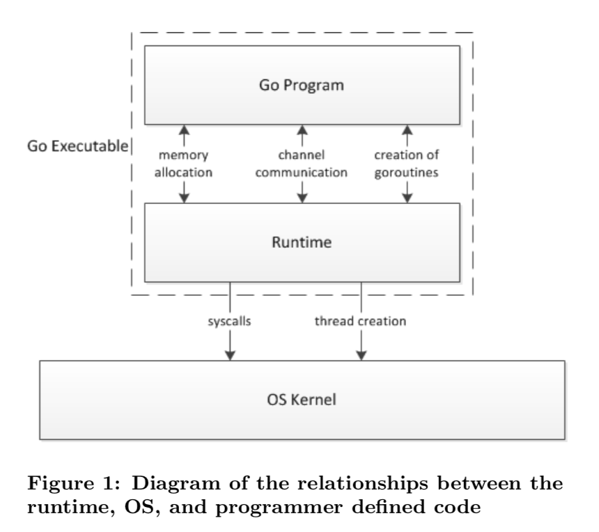
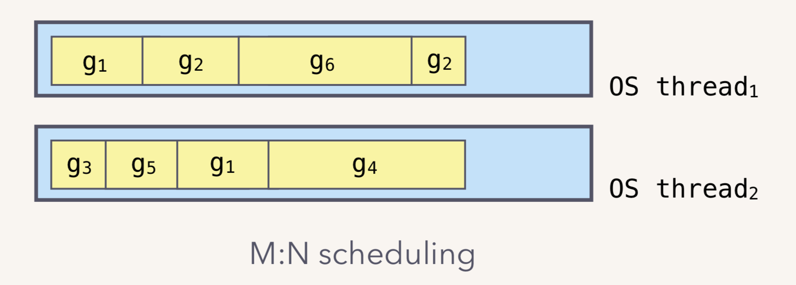
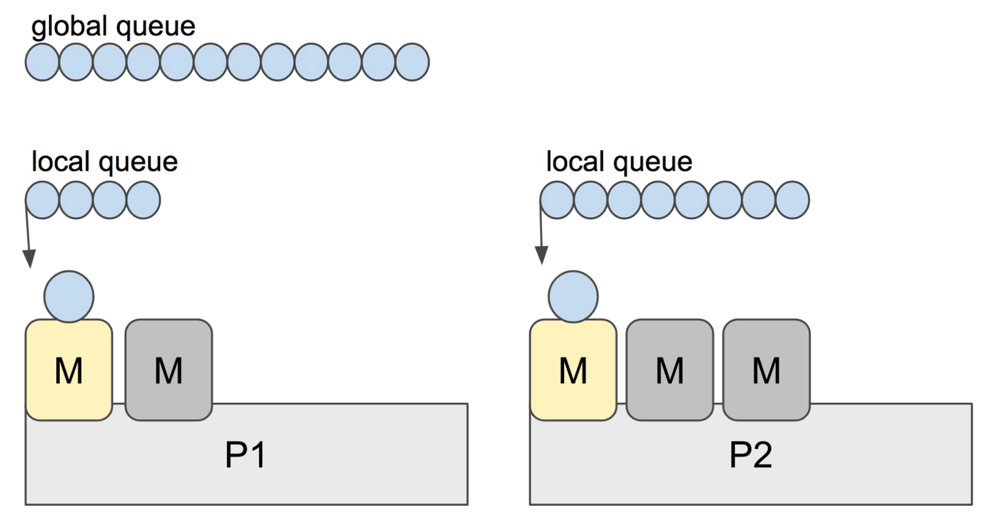

## Questions and Answers


#### 1. `new` 和 `make` 的区别？

- https://go.dev/doc/effective_go#allocation_new
- https://go.dev/doc/effective_go#allocation_make

Go有两个分配原语，内置函数 `new` 和 `make` 。它们做不同的事情，适用于不同的类型，这可能会令人困惑，但规则很简单。

**`new`**

- 它是一个分配内存的内置函数，但与其他一些语言中的同名函数不同，**它不初始化内存**，**只将其归零**。也就是说，`new(T)` 为类型为 `T` 的新项分配零存储，并返回其地址，即类型为 `*T` 的值。在Go术语中，它**返回一个指针**，指向新分配的类型为 `T` 的零值。

- 由于 `new` 返回的内存是归零的，因此在设计数据结构时，最好安排每个类型的零值，使得 `new` 初始化的变量可以在不进行进一步初始化的情况下使用。这意味着数据结构的用户可以使用 `new` 创建一个数据结构并开始工作。例如，在 `bytes.Buffer` 的文档中提到：

  > `Buffer` 的零值是一个可以使用的空缓冲区。

  同样，`sync.Mutex`没有显式的构造函数或 `Init` 方法。相反，`sync.Mutex` 的零值被定义为未锁定的互斥锁。

- 零值是可以传递的，也就是说结构体所有属性含有零值初始化，那么该结构体也是可以被 `new` 初始化为立即可用的零值，而不需要额外生成。考虑以下例子：

  ```go
  type SyncedBuffer struct {
      lock    sync.Mutex
      buffer  bytes.Buffer
  }
  ```

  `SyncedBuffer` 类型的值也可以在分配或声明时立即使用。在下一个代码片段中，`p` 和 `v` 都将正确工作，无需进一步安排。

  ```go
  p := new(SyncedBuffer)  // type *SyncedBuffer
  var v SyncedBuffer      // type  SyncedBuffer
  ```

- 简单概括就是如下：（不完全正确但是很贴切）

  ```go
  func newInt() *int {
    var i int
    return &i
  }
  someVar := newInt()
  ```

  

**`make`**

- 内置函数 `make(T, args...)` 的用途与 `new(T)` 不同。它只创建切片（`slice`）、映射（`map`）和通道（`channel`），并返回一个初始化的（未归零的）`T` 类型值（而不是`*T`）。

  区别的原因是，**这三种类型表示在使用前必须初始化的数据结构的引用**。例如，`slice` 是一个包含三项的描述符，其中包含指向数据（在数组中）的指针、长度和容量，在这些项初始化之前，`slice` 为 `nil`。对于切片、映射和通道，`make` 初始化内部数据结构并准备值以供使用。例如：

  ```go
  make([]int, 10, 100)
  ```

  分配一个包含100个 `int` 的数组，然后创建一个长度为10、容量为100的切片结构，指向数组的前10个元素。相反，`new([]int)` 返回一个指向新分配的零切片结构的指针，也就是说，一个指向 `nil` 切片值的指针。


1. `new` 和 `make` 的区别？用一个 `[]int` 就能很好地展现：

   ```go
   new([]int)		// &[]int(nil)
   make([]int)		// []int{}
   // fmt.Printf("%#+v", ...)
   ```

   ```go
   var p *[]int = new([]int)       // allocates slice structure; *p == nil; rarely useful
   var v  []int = make([]int, 100) // the slice v now refers to a new array of 100 ints
   
   // Unnecessarily complex:
   var p *[]int = new([]int)
   *p = make([]int, 100, 100)
   
   // Idiomatic:
   v := make([]int, 100)
   ```

2. 记住 `make` 只应用于映射、切片和通道，不返回指针。若要获得显式指针，可使用 `new` 进行分配或显式获取变量的地址。


#### 2. `array` 和 `slice` 的区别？

- https://go.dev/doc/effective_go#arrays
- https://go.dev/doc/effective_go#slices

`array` 在规划内存的详细布局时非常有用，有时可以帮助避免分配，但它们主要是 `slice` 的底层实现。Go 的数组有一些不同于经典 C 语言中的特性：

- `array` 是个值，而非 C 中的数组的概念，所以 `array` 的赋值是一种拷贝操作。
- 特别是，如果将 `array` 传递给函数，函数将接收 `array` 的拷贝，而不是指向该 `array` 的指针。
- `array` 的大小是其类型的一部分。类型 `[10]int` 和 `[20]int` 是不同的。

> 值属性可能是**昂贵的操作**，同时可以使用类似于 C 的方式高效访问 `array` ：
>
> ```go
> func Sum(a *[3]float64) (sum float64) {
>     for _, v := range *a {
>         sum += v
>     }
>     return
> }
> 
> array := [...]float64{7.0, 8.5, 9.1}
> x := Sum(&array)  // Note the explicit address-of operator
> ```

`slice` 包装数组，为数据序列提供更通用、更强大、更方便的接口。除了具有显式维数的项（如转换矩阵），Go 中的大多数**数组编程**都是用 `slice` 而不是简单的 `array` 完成的。

`slice` 包含对底层 `array` 的引用，如果将一个 `slice` 分配给另一个 `slice` ，两个 `slice` 都会引用同一个 `array`。如果一个函数接受一个 `slice` 参数，它对 `slice` 元素所做的更改将对调用者可见，类似于传递一个指向底层 `array` 的指针。因此，`Read` 函数可以接受 `slice` 参数，而不是指针和计数； `slice` 中的长度设置读取数据量的上限。下面是 `os` 包中 `File` 类型的 `Read` 方法的签名：

```go
func (f *File) Read(buf []byte) (n int, err error)
```

该方法返回读取的字节数和错误值。要读取较大缓冲区 `buf` 的前32个字节，请对缓冲区进行切片：

```go
n, err := f.Read(buf[0:32])
```

这样的切片是常见和有效的。事实上，暂且不考虑效率，下面的代码段还将读取缓冲区的前32个字节：

```go
var n int
var err error
for i := 0; i < 32; i++ {
    nbytes, e := f.Read(buf[i:i+1])  // Read one byte.
    n += nbytes
    if nbytes == 0 || e != nil {
        err = e
        break
    }
}
```

`slice` 的长度可以改变，只要它仍然符合底层数组的限制；只需要给它自己分配一个切片。一个片的容量，由内置函数 `cap` 访问，报告了片可以假定的最大长度。下面是一个将数据追加到 `slice` 的函数。如果数据超过容量，则重新分配该片。返回结果片。该函数使用 `len` 和 `cap` 在应用于 `nil` 片时也是合法的，并返回0。

```go
func Append(slice, data []byte) []byte {
    l := len(slice)
    if l + len(data) > cap(slice) {  // reallocate
        // Allocate double what's needed, for future growth.
        newSlice := make([]byte, (l+len(data))*2)
        // The copy function is predeclared and works for any slice type.
        copy(newSlice, slice)
        slice = newSlice
    }
    slice = slice[0:l+len(data)]
    copy(slice[l:], data)
    return slice
}
```

之后必须返回片，因为尽管 `append` 可以修改 `slice` 的元素，但 `slice` 本身（包含指针、长度和容量的运行时数据结构）是通过值传递的。

追加到 `slice` 的想法非常有用，它被 `append` 内置函数捕获。不过，为了理解这个函数的设计，我们需要更多的信息，所以我们将在后面讨论它。


#### 3. `slice` 扩容策略

`slice` 的主要实现是扩容。对于 `append` 向 `slice` 添加元素时：

1. 假如 `slice` 容量够用，则追加新元素进去，`slice.len++` ，返回原来的 `slice` 。当
2. 原容量不够，则 `slice` 先扩容，扩容之后 `slice` 得到新的 `slice`，将元素追加进新的 `slice`，`slice.len++`，返回新的 `slice`。对于切片的扩容规则：
   1. 当切片比较小时（容量小于 1024），则采用较大的扩容倍速进行扩容（新的扩容会是原来的 2 倍），避免频繁扩容，从而减少**内存分配**的次数和**数据拷贝**的代价。
   2. 当切片较大的时（原来的 `slice` 的容量大于或者等于 1024），采用较小的扩容倍速（新的扩容将扩大大于或者等于原来 1.25 倍），主要避免空间浪费，网上其实很多总结的是 1.25 倍，那是在不考虑内存对齐的情况下，实际上还要考虑**内存对齐**，扩容是大于或者等于 1.25 倍。


#### 4. `defer` 的作用和用法？

- https://go.dev/doc/effective_go#defer

Go 的 `defer` 语句在函数结束之前安排了立即运行一个函数调用（被延迟的函数）。这是一种不常见但有效的方法，用于处理一些情况，比如不管函数采用哪条路径返回，都必须释放资源。典型的例子是解锁互斥锁或关闭文件。因此，他的执行顺序被设计为：（`defer`在加载`return`值到真正返回上一个函数中间执行）

1. `return`（最先）
2. `return val`
3. `defer`（最后）

```go
func a() int {
	var i int
    defer func() { i *= 2 }()
	defer fmt.Println("1. i = ", i)
	defer func() { fmt.Println("2. i = ", i) }()
	defer func(i int) { fmt.Println("3. i = ", i) }(i)
	i = 7
	return i
}

func main() {
	println(a())
}
// output:
// 3. i =  0
// 2. i =  7
// 1. i =  0
// 7  
```

在这个代码块中，存在以下几个 `defer` 的用法：

1. **函数方法**：直接请求参数并直接带入，故输出是0；
2. **无参闭包**：会使用函数中的变量，由于是执行时请求，此时 `i` 已经改变；
3. **有参闭包**：直接请求参数并直接带入，故输出是0；
4. **值方式修改返回值**：第一个 `defer` 试图修改返回值，但是返回值已被赋值，故无法修改；但是返回值是指针时，地址不变，是可以修改对应值的，比如：

```go
func a() *int {
	var i int
	p := &i
	defer func() { *p *= 2 }()
	i = 7
	return &i
}

func main() {
	println(*a())
}
// output 
// 14
```

更常见的用法：

```go
// Contents returns the file's contents as a string.
func Contents(filename string) (string, error) {
    f, err := os.Open(filename)
    if err != nil {
        return "", err
    }
    defer f.Close()  // f.Close will run when we're finished.

    var result []byte
    buf := make([]byte, 100)
    for {
        n, err := f.Read(buf[0:])
        result = append(result, buf[0:n]...) // append is discussed later.
        if err != nil {
            if err == io.EOF {
                break
            }
            return "", err  // f will be closed if we return here.
        }
    }
    return string(result), nil // f will be closed if we return here.
}
```

`defer` 关键字调用**闭包**等函数的调用有两个优点：

1. 它保证您永远不会忘记关闭文件，如果稍后编辑该函数以添加新的返回路径，则很容易犯这个错误。
2. 它意味着闭值位于开值附近，这比将它放在函数的末尾要清楚得多。

延迟函数的参数（如果函数是方法，则包括接收器）在延迟执行时计算，而不是在调用执行时计算。除了避免变量在函数执行时改变值的问题外，这意味着单个延迟调用站点可以延迟多个函数的执行。这里有一个愚蠢的例子：

```go
for i := 0; i < 5; i++ {
    defer fmt.Printf("%d ", i)
}
```

延迟函数是按**后进先出**（**LIFO**）顺序执行的，所以这段代码将导致函数返回时打印`4 3 2 1 0`。一个更合理的例子是通过程序跟踪函数执行的简单方法，我们可以写几个简单的跟踪例程，像这样：

```go
func trace(s string)   { fmt.Println("entering:", s) }
func untrace(s string) { fmt.Println("leaving:", s) }

// Use them like this:
func a() {
    trace("a")
    defer untrace("a")
    // do something....
}
```

每个 `defer` 语句都对应一个 `defer` 实例，多个实例使用指针连接起来形成一个单链表，保存在 `gotoutine` 数据结构中，每次插入 `defer` 实例，均插入到链表的头部，函数结束再一次从头部取出，从而形成**后进先出**的效果。

**规则**：

1. 延迟函数的参数是 `defer` 语句出现的时候就已经确定了的。
2. 延迟函数执行按照后进先出的顺序执行，即先出现的 `defer` 最后执行。
3. 延迟函数可能操作主函数的返回值。
4. 申请资源后立即使用 `defer` 关闭资源是个好习惯。


#### 5. `for-range` 的时候，内部发生了什么变化？

```go
for a,b ：= range sillyList {
	...
}
```

`a` 和 `b` 在内存中只会定义和分配一次内存，随后的循环都是对 `a` 和 `b` 进行值覆盖，而其指向的地址始终不变。由于这个特性， `for` 循环中的 `goroutine` 不能直接将 `a` 或 `b` 的地址直接传给协程，而是通过值拷贝生成一个临时变量。


#### 6. 介绍一下 `rune`

```go
type rune = int32
```

是 Go 特殊字符集的处理方案（Unicode，UTF-8），`rune` 等同于 `int32` ，常用来处理**Unicode** 或 **UTF-8** 字符。


#### 7. 结构体 `struct` 的值方法和指针方法的区别？

```go
type test struct {
	a, b int
	c    *int
}
```

**值方法（`value`）**

```go
func (t test) Update(a, b, c int) {
	t.a = a
	t.b = b
	*(t.c) = c
}
```

**值方法**将对结构体的一个副本进行操作，他不会改变原有的结构体（除非结构体中有引用变量，这样可以通过修改指向内存的元素来修改内容）。

```go
c := 3
t1 := test{ a: 1, b: 2, c: &c }
t1.Update(2, 3, 4)
```

看似修改了 `t1` ，但是我们输出时发现，结果为：`{ a: 1, b: 2, c: 4 }`。

为了修改该结构体（内存的复用，不必要的复制），我们有**指针方法**：

**指针方法（`pointer`）**

```go
func (t *test) Update(a, b, c int) {
	t.a = a
	t.b = b
	*(t.c) = c
}
```

```go
c := 3
t1 := test{ a: 1, b: 2, c: &c }
t1.Update(2, 3, 4)
```

结果为：`{ a: 2, b: 3, c: 4 }`。


#### 8. 单引号、双引号、反引号的区别？

**单引号**，表示 `byte` 类型或 `rune` 类型，对应 `uint8` 和 `int32` 类型，默认是 `rune` 类型。 `byte` 用来强调数据是**raw data**，而不是数字；而 `rune` 用来表示 **Unicode** 的code point。

```go
a := 'a'
// var a int32 = 'a'
```

**双引号**，才是字符串，实际上是字符数组。可以用索引号访问某字节，也可以用 `len()` 函数来获取字符串所占的字节长度。

```go
b := "我"
// var b string = "我"
```

**反引号**，表示字符串字面量，但**不支持任何转义序列**。字面量 raw literal string 的意思是，你定义时写的啥样，它就啥样，你有换行，它就换行。你写转义字符，它也就展示转义字符。

```go
c := `我 wywnb \n`
// var c string = `我 wywnb \n`
// var c string = "我 wywnb \\n"
```


#### 9. Golang中解析 tag 是怎样实现的？

Go 中解析的 tag 是通过反射实现的，反射是指计算机程序在运行时（Runtime）可以访问、检测和修改它本身状态或行为的一种能力或动态知道给定数据对象的类型和结构，并有机会修改它。反射将接口变量转换成反射对象 `Type` 和 `Value`；反射可以通过反射对象 `Value` 还原成原先的接口变量；反射可以用来修改一个变量的值，前提是这个值可以被修改；tag是啥：结构体支持标记，name string `json:name-field` 就是 `json:name-field` 这部分。


#### 10. 讲讲 Go 的 select 底层数据结构和一些特性？

`select` 是操作系统中的系统调用，我们经常会使用 `select`、`poll` 和 `epoll` 等函数构建 I/O 多路复用模型提升程序的性能。Go 语言的 `select` 与操作系统中的 `select` 比较相似，也能够让 Goroutine 同时等待多个 Channel 可读或者可写，在多个文件或者 Channel状态改变之前，`select` 会一直阻塞当前线程或者 Goroutine。（当然，注意`default`的例外作用）

`case`包含了`channel`的收发操作，随机执行一种情况。

- https://draveness.me/golang/docs/part2-foundation/ch05-keyword/golang-select/#52-select


#### 11. 简述Context

- https://www.cnblogs.com/juanmaofeifei/p/14439957.html

答：Go 的 `Context` 的数据结构包含 `Deadline`，`Done`，`Err`，`Value`，`Deadline` 方法返回一个 `time.Time`，表示当前 `Context` 应该结束的时间，ok 则表示有结束时间，`Done` 方法当 `Context` 被取消或者超时时候返回的一个 close 的 `channel`，告诉给 `context` 相关的函数要停止当前工作然后返回了，`Err` 表示 `context` 被取消的原因，`Value` 方法表示 `context` 实现共享数据存储的地方，是协程安全的。`context` 在业务中是经常被使用：

1. 上下文控制；
2. 多个 goroutine 之间的数据交互等；
3. 超时控制：到某个时间点超时，过多久超时；


#### 12. channel是否线程安全？锁用在什么地方？

线程安全，`channel` 设计目标就是保证不同协程之间的安全通信，为了保证数据一致性，实现了线程安全。在 `channel` 的底层实现中， `hchan` 结构体采用了 `Mutex` 锁来保证数据读写安全，在对循环数组 `buf` 的数据进行入队和出队过程中，必须获取对应的互斥锁，才能进行相关操作。


#### 13. go channel 的底层实现原理 （数据结构）

**不带缓冲区**：


**带缓冲区**：


[`runtime.hchan`](https://draveness.me/golang/tree/runtime.hchan) 结构体中的五个字段 `qcount`、`dataqsiz`、`buf`、`sendx`、`recv` 构建底层的循环队列：

- `qcount` — Channel 中的元素个数；
- `dataqsiz` — Channel 中的循环队列的长度；
- `buf` — Channel 的缓冲区数据指针；
- `sendx` — Channel 的发送操作处理到的位置；
- `recvx` — Channel 的接收操作处理到的位置；

除此之外，`elemsize` 和 `elemtype` 分别表示当前 Channel 能够收发的元素类型和大小；`sendq` 和 `recvq` 存储了当前 Channel 由于缓冲区空间不足而阻塞的 Goroutine 列表，这些等待队列使用双向链表 [`runtime.waitq`](https://draveness.me/golang/tree/runtime.waitq) 表示，链表中所有的元素都是 [`runtime.sudog`](https://draveness.me/golang/tree/runtime.sudog) 结构：

```go
type waitq struct {
	first *sudog
	last  *sudog
}
```

[`runtime.sudog`](https://draveness.me/golang/tree/runtime.sudog) 表示一个在等待列表中的 Goroutine，该结构中存储了两个分别指向前后 [`runtime.sudog`](https://draveness.me/golang/tree/runtime.sudog) 的指针以构成链表。


#### 14. 操作 nil channel，close channel等的详细情况

| 操作     | nil channel | closed channel     | not nil, not closed channel                                  |
| -------- | ----------- | ------------------ | ------------------------------------------------------------ |
| close    | `panic`     | `panic`            | 正常关闭                                                     |
| 读 <- ch | 阻塞        | 读到对应类型的零值 | 阻塞或正常读取数据。缓冲型 channel 为空或非缓冲型 channel 没有等待发送者时会阻塞 |
| 写 ch <- | 阻塞        | `panic`            | 阻塞或正常写入数据。非缓冲型 channel 没有等待接收者或缓冲型 channel buf 满时会被阻塞 |

总结一下，发生 `panic` 的情况有三种：向一个关闭的 `channel` 进行写操作；关闭一个 `nil` 的 `channel`；重复关闭一个 `channel`。读、写一个 `nil` `channel` 都会被阻塞。


#### 15. 向 channel 发送的流程

```go
func chansend(c *hchan, ep unsafe.Pointer, block bool, callerpc uintptr) bool
```

**阻塞式**：调用 `chansend` 函数，并且 `block==true`

```go
ch <- 10
```

**非阻塞式**：调用 `chansend` 函数，并且 `block==false`

```go
select {
	case ch <- 10:
	...
	default:
	...
}
```

向 `channel` 中发送数据时大概分为两大块：检查和数据发送，数据发送流程如下：

- 如果 `channel` 的读等待队列存在接收者 `sudog`，则直接发送给第一个 `goroutine` ，并唤醒该协程，节省一次内存复制；
- 如果 `channel` 的读等待队列不存在接收者，则判断循环数组 `buf` 是否装满。**若没装满**，则把数据发送到循环数组 `buf` 的队尾；如果已经装满了，则走阻塞发送的流程，将当前 `goroutine` 加入写等待队列，并挂起等待唤醒；


#### 16. 从 channel 接收的流程

```go
func chanrecv(c *hchan, ep unsafe.Pointer, block bool) (selected, received bool)
```

```go
select {
    case <- ch:
    ...
    default:
    ...
}
```

从 `channel` 接收数据时大概分为两大块，检查和数据发送，而数据接收流程如下：

- 如果 `channel` 的写等待队列存在发送者 goroutine，且是非缓冲的 `channel`，则直接把写等待区内协程的数据拷贝过来；
- 如果循环数组 `buf` 非空，将循环数组队首的元素拷贝给当前接收变量，此时如果是有缓冲的 `channel` 且写等待区内有挂起的协程，则唤醒第一个并写入；
- 如果循环数组 `buf` 为空，此时走阻塞接收的流程，将当前 goroutine 加入读等待队列，并挂起等待唤醒；


#### 17. goroutine和线程区别

- **内存占用**

  创建一个 goroutine 的栈内存消耗为 2 KB，实际运行过程中，如果栈空间不够用，会自动进行扩容。创建一个 thread 则需要消耗 1 MB 栈内存，而且还需要一个被称为 “a guard page” 的区域用于和其他 thread 的栈空间进行隔离。

  对于一个用 Go 构建的 HTTP Server 而言，对到来的每个请求，创建一个 goroutine 用来处理是非常轻松的一件事。而如果用一个使用线程作为并发原语的语言构建的服务，例如 Java 来说，每个请求对应一个线程则太浪费资源了，很快就会出 OOM 错误（OutOfMemoryError）。

- **创建和销毀**

  Thread 创建和销毀都会有巨大的消耗，因为要和操作系统打交道，是内核级的，通常解决的办法就是线程池。而 goroutine 因为是由 Go runtime 负责管理的，创建和销毁的消耗非常小，是用户级。

- **切换**

  当 threads 切换时，需要保存各种寄存器，以便将来恢复：*16 general purpose registers, PC (Program Counter), SP (Stack Pointer), segment registers, 16 XMM registers, FP coprocessor state, 16 AVX registers, all MSRs etc*.而 goroutines 切换只需保存三个寄存器：*Program Counter, Stack Pointer and BP*。

  一般而言，线程切换会消耗 1000-1500 纳秒，一个纳秒平均可以执行 12-18 条指令。所以由于线程切换，执行指令的条数会减少 12000-18000。Goroutine 的切换约为 200 ns，相当于 2400-3600 条指令。因此，goroutines 切换成本比 threads 要小得多。


#### 18. 什么是Go Scheduler

Go 程序的执行由两层组成：Go Program，Runtime，即用户程序和运行时。它们之间通过函数调用来实现内存管理、channel 通信、goroutines 创建等功能。用户程序进行的系统调用都会被 Runtime 拦截，以此来帮助它进行调度以及垃圾回收相关的工作。

Go scheduler 可以说是 Go 运行时的一个最重要的部分了。Runtime 维护所有的 goroutines，并通过 scheduler 来进行调度。Goroutines 和 threads 是独立的，但是 goroutines 要依赖 threads 才能执行。Go 程序执行的高效和 scheduler 的调度是分不开的。



实际上在操作系统看来，所有的程序都是在执行多线程。将 goroutines 调度到线程上执行，仅仅是 runtime 层面的一个概念，在操作系统之上的层面。

有三个基础的结构体来实现 goroutines 的调度。g，m，p。

- `g` 代表一个 goroutine，它包含：表示 goroutine 栈的一些字段，指示当前 goroutine 的状态，指示当前运行到的指令地址，也就是 PC 值。

- `m` 表示内核线程，包含正在运行的 goroutine 等字段。

- `p` 代表一个虚拟的 Processor，它维护一个处于 Runnable 状态的 g 队列，`m` 需要获得 `p` 才能运行 `g`。

当然还有一个核心的结构体：`sched`，它总览全局。

Runtime 起始时会启动一些 G：垃圾回收的 G，执行调度的 G，运行用户代码的 G；并且会创建一个 M 用来开始 G 的运行。随着时间的推移，更多的 G 会被创建出来，更多的 M 也会被创建出来。

> 当然，在 Go 的早期版本，并没有 p 这个结构体，`m` 必须从一个全局的队列里获取要运行的 `g`，因此需要获取一个全局的锁，当并发量大的时候，锁就成了瓶颈。后来在大神 Dmitry Vyokov 的实现里，加上了 `p` 结构体。每个 `p` 自己维护一个处于 Runnable 状态的 `g` 的队列，解决了原来的全局锁问题。

Go scheduler 的核心思想是：

1. reuse threads；
2. 限制同时运行（不包含阻塞）的线程数为 N，N 等于 CPU 的核心数目；
3. 线程私有的 runqueues，并且可以从其他线程 stealing goroutine 来运行，线程阻塞后，可以将 runqueues 传递给其他线程。

为什么需要 P 这个组件，直接把 runqueues 放到 M 不行吗？当一个线程阻塞的时候，将和它绑定的 P 上的 goroutines 转移到其他线程。Go scheduler 会启动一个后台线程 sysmon，用来检测长时间（超过 10 ms）运行的 goroutine，将其调度到 global runqueues。这是一个全局的 runqueue，优先级比较低，以示惩罚。

全局可运行队列（GRQ）和本地可运行队列（LRQ）。 LRQ 存储本地（也就是具体的 P）的可运行 goroutine，GRQ 存储全局的可运行 goroutine，这些 goroutine 还没有分配到具体的 P。


Go scheduler 是 Go runtime 的一部分，它内嵌在 Go 程序里，和 Go 程序一起运行。因此它运行在用户空间，在 kernel 的上一层。和 Os scheduler 抢占式调度（preemptive）不一样，Go scheduler 采用协作式调度（cooperating）。协作式调度一般会由用户设置调度点，例如 python 中的 yield 会告诉 Os scheduler 可以将我调度出去了。但是由于在 Go 语言里，goroutine 调度的事情是由 Go runtime 来做，并非由用户控制，所以我们依然可以将 Go scheduler 看成是抢占式调度，因为用户无法预测调度器下一步的动作是什么。

和线程类似，goroutine 的状态也是三种（简化版的）：

| 状态      | 解释                                                         |
| --------- | ------------------------------------------------------------ |
| Waiting   | 等待状态，goroutine 在等待某件事的发生。例如等待网络数据、硬盘；调用操作系统 API；等待内存同步访问条件 ready，如 atomic, mutexes |
| Runnable  | 就绪状态，只要给 M 我就可以运行                              |
| Executing | 运行状态。goroutine 在 M 上执行指令，这是我们想要的          |


#### 19. goroutine 调度时机有哪些

在四种情形下，goroutine 可能会发生调度，但也并不一定会发生，只是说 Go scheduler 有机会进行调度。

| 情形            | 说明                                                         |
| --------------- | ------------------------------------------------------------ |
| 使用关键字 `go` | go 创建一个新的 goroutine，Go scheduler 会考虑调度           |
| GC              | 由于进行 GC 的 goroutine 也需要在 M 上运行，因此肯定会发生调度。当然，Go scheduler 还会做很多其他的调度，例如调度不涉及堆访问的 goroutine 来运行。GC 不管栈上的内存，只会回收堆上的内存 |
| 系统调用        | 当 goroutine 进行系统调用时，会阻塞 M，所以它会被调度走，同时一个新的 goroutine 会被调度上来 |
| 内存同步访问    | `atomic`，`mutex`，`channel` 操作等会使 goroutine 阻塞，因此会被调度走。等条件满足后（例如其他 goroutine 解锁了）还会被调度上来继续运行 |


#### 20. 什么是 M:N 模型

我们都知道，Go runtime 会负责 goroutine 的生老病死，从创建到销毁，都一手包办。Runtime 会在程序启动的时候，创建 M 个线程（CPU 执行调度的单位），之后创建的 N 个 goroutine 都会依附在这 M 个线程上执行。这就是 M:N 模型：



在同一时刻，一个线程上只能跑一个 goroutine。当 goroutine 发生阻塞（例如上篇文章提到的向一个 channel 发送数据，被阻塞）时，runtime 会把当前 goroutine 调度走，让其他 goroutine 来执行。目的就是不让一个线程闲着，榨干 CPU 的每一滴油水。


#### 21. 什么是工作窃取

Go scheduler 的职责就是将所有处于 runnable 的 goroutines 均匀分布到在 P 上运行的 M。

当一个 P 发现自己的 LRQ 已经没有 G 时，会从其他 P “偷” 一些 G 来运行。看看这是什么精神！自己的工作做完了，为了全局的利益，主动为别人分担。这被称为 `Work-stealing`，Go 从 1.1 开始实现。

Go scheduler 使用 M:N 模型，在任一时刻，M 个 goroutines（G） 要分配到 N 个内核线程（M），这些 M 跑在个数最多为 GOMAXPROCS 的逻辑处理器（P）上。每个 M 必须依附于一个 P，每个 P 在同一时刻只能运行一个 M。如果 P 上的 M 阻塞了，那它就需要其他的 M 来运行 P 的 LRQ 里的 goroutines。



实际上，Go scheduler 每一轮调度要做的工作就是找到处于 runnable 的 goroutines，并执行它。找的顺序如下：

```go
runtime.schedule() {
    // only 1/61 of the time, check the global runnable queue for a G.
    // if not found, check the local queue.
    // if not found,
    //     try to steal from other Ps.
    //     if not, check the global runnable queue.
    //     if not found, poll network.
}
```

当 P2 上的一个 G 执行结束，它就会去 LRQ 获取下一个 G 来执行。如果 LRQ 已经空了，就是说本地可运行队列已经没有 G 需要执行，并且这时 GRQ 也没有 G 了。这时，P2 会随机选择一个 P（称为 P1），P2 会从 P1 的 LRQ “偷”过来一半的 G。这样做的好处是，有更多的 P 可以一起工作，加速执行完所有的 G。


#### 22. scheduler 的初始化过程

Go scheduler 在源码中的结构体为 `schedt`，保存调度器的状态信息、全局的可运行 G 队列等。主要保存了以下信息：

- 空闲的工作线程
- 空闲（被回收）的协程
- 空闲的 `P`

在程序运行过程中，`schedt` 对象只有一份实体，它维护了调度器的所有信息。不仅是 Go 程序，系统加载可执行文件大概都会经过这几个阶段：

1. 从磁盘上读取可执行文件，加载到内存
2. 创建进程和主线程
3. 为主线程分配栈空间
4. 把由用户在命令行输入的参数拷贝到主线程的栈
5. 把主线程放入操作系统的运行队列等待被调度


#### 23. 简述 Go 语言GC的工作原理

垃圾回收机制是Go一大特色。Go1.3采用**标记清除法**， Go1.5采用**三色标记法**，Go1.8采用**三色标记法+混合写屏障**。

- **标记清除法**：分为两个阶段：标记和清除，缺点是需要暂停程序STW。

  - **标记阶段**：从根对象出发寻找并标记所有存活的对象。
  - **清除阶段**：遍历堆中的对象，回收未标记的对象，并加入空闲链表。

- **三色标记法**：将对象标记为白色，灰色或黑色。

  - **白色**：不确定对象（默认色）；
  - **黑色**：存活对象；
  - **灰色**：存活对象，子对象待处理；

  标记开始时，先将所有对象加入白色集合（需要STW）。首先将根对象标记为灰色，然后将一个对象从灰色集合取出，遍历其子对象，放入灰色集合。同时将取出的对象放入黑色集合，直到灰色集合为空。最后的白色集合对象就是需要清理的对象。

- 这种方法有一个缺陷，如果对象的引用被用户修改了，那么之前的标记就无效了。因此Go采用了**写屏障技术**，当对象新增或者更新会将其着色为灰色。一次完整的GC分为四个阶段：

  1. 准备标记（需要STW），开启写屏障。
  2. 开始标记
  3. 标记结束（STW），关闭写屏障
  4. 清理（并发）

- 基于插入写屏障和删除写屏障在结束时需要STW来重新扫描栈，带来性能瓶颈。**混合写屏障**分为以下四步：

  1. GC开始时，将栈上的全部对象标记为黑色（不需要二次扫描，无需STW）；
  2. GC期间，任何栈上创建的新对象均为黑色
  3. 被删除引用的对象标记为灰色
  4. 被添加引用的对象标记为灰色

  总而言之就是确保黑色对象不能引用白色对象，这个改进直接使得GC时间从 2s降低到2us。


#### 24. 为什么有协程泄露（Goroutine Leak）？

协程泄漏是指协程创建之后没有得到释放。主要原因有：

1. 缺少接收器，导致发送阻塞；
2. 缺少发送器，导致接收阻塞；
3. 死锁。多个协程由于竞争资源导致死锁；
4. 创建协程的没有回收；


#### 25. Go 可以限制运行时操作系统线程的数量吗？ 常见的goroutine操作函数有哪些？

可以，使用 `runtime.GOMAXPROCS(num int)` 可以设置线程数目。该值默认为CPU逻辑核数，如果设的太大，会引起频繁的线程切换，降低性能。

- `runtime.Gosched()` ，用于让出CPU时间片，让出当前 goroutine 的执行权限，调度器安排其它等待的任务运行，并在下次某个时候从该位置恢复执行。
- `runtime.Goexit()` ，调用此函数会立即使当前的 goroutine 的运行终止（终止协程），而其它的 goroutine 并不会受此影响。`runtime.Goexit` 在终止当前 goroutine 前会先执行此 goroutine 的还未执行的 `defer` 语句。请注意千万别在主函数调用 `runtime.Goexit` ，因为会引发 `panic` 。


#### 26. 如何控制协程数目

从官方文档的解释可以看到，`GOMAXPROCS` 限制的是同时执行用户态 Go 代码的操作系统线程的数量，但是对于被系统调用阻塞的线程数量是没有限制的。`GOMAXPROCS` 的默认值等于 CPU 的逻辑核数，同一时间，一个核只能绑定一个线程，然后运行被调度的协程。因此对于 CPU 密集型的任务，若该值过大，例如设置为 CPU 逻辑核数的 2 倍，会增加线程切换的开销，降低性能。对于 I/O 密集型应用，适当地调大该值，可以提高 I/O 吞吐率。

另外对于协程，可以用带缓冲区的channel来控制，下面的例子是协程数为1024的例子：

```go
var wg sync.WaitGroup
ch := make(chan struct{}, 1024)
for i:=0; i<20000; i++{
	wg.Add(1)
	ch<-struct{}{}
	go func(){
		defer wg.Done()
		<-ch
	}
}
wg.Wait()
```

此外还可以用**协程池**：其原理无外乎是将上述代码中通道和协程函数解耦，并封装成单独的结构体。常见第三方协程池库，比如[tunny](https://link.zhihu.com/?target=http%3A//github.com/Jeffail/tunny)等。


#### 27. Go面向对象

Go实现面向对象的两个关键是 `struct` 和 `interface` 。

- **封装**：对于同一个包，对象对包内的文件可见；对不同的包，需要将对象以大写开头才是可见的。

- **继承**：继承是编译时特征，在struct内加入所需要继承的类即可：

  ```go
  type A struct{}
  type B struct{
  	A
  }
  ```

- **多态**：多态是运行时特征，Go多态通过 `interface` 来实现。类型和接口是松耦合的，某个类型的实例可以赋给它所实现的任意接口类型的变量。

Go支持多重继承，就是在类型中嵌入所有必要的父类型。


#### 28. golang的内存管理的原理清楚吗？简述go内存管理机制。

golang内存管理基本是参考tcmalloc来进行的。go内存管理本质上是一个内存池，只不过内部做了很多优化：自动伸缩内存池大小，合理的切割内存块。

> 一些基本概念：
>
> - 页Page：一块8K大小的内存空间。Go向操作系统申请和释放内存都是以页为单位的。
> - span : 内存块，一个或多个连续的 page 组成一个 span 。如果把 page 比喻成工人， span 可看成是小队，工人被分成若干个队伍，不同的队伍干不同的活。
> - sizeclass : 空间规格，每个 span 都带有一个 sizeclass ，标记着该 span 中的 page 应该如何使用。使用上面的比喻，就是 sizeclass 标志着 span 是一个什么样的队伍。
> - object : 对象，用来存储一个变量数据内存空间，一个 span 在初始化时，会被切割成一堆等大的 object 。假设 object 的大小是 16B ， span 大小是 8K ，那么就会把 span 中的 page 就会被初始化 8K / 16B = 512 个 object 。所谓内存分配，就是分配一个 object 出去。
>
> - 

1. **mheap**

   一开始go从操作系统索取一大块内存作为内存池，并放在一个叫mheap的内存池进行管理，mheap将一整块内存切割为不同的区域，并将一部分内存切割为合适的大小。

   

   - **mheap.spans**：用来存储 page 和 span 信息，比如一个 span 的起始地址是多少，有几个 page，已使用了多大等等。
   - **mheap.bitmap**： 存储着各个 span 中对象的标记信息，比如对象是否可回收等等。
   - **mheap.arena_start**：将要分配给应用程序使用的空间。

2. **mcentral**

   用途相同的span会以链表的形式组织在一起存放在mcentral中。这里用途用**sizeclass**来表示，就是该span存储哪种大小的对象。找到合适的 span 后，会从中取一个 object 返回给上层使用。

3. **mcache**

   为了提高内存并发申请效率，加入缓存层mcache。每一个mcache和处理器P对应。Go申请内存首先从P的mcache中分配，如果没有可用的span再从mcentral中获取。

> 参考资料：[Go 语言内存管理（二）：Go 内存管理](https://link.zhihu.com/?target=https%3A//cloud.tencent.com/developer/article/1422392)


#### 29. mutex 有几种模式？

1. **normal**（正常模式）：所有goroutine按照FIFO的顺序进行锁获取，被唤醒的goroutine和新请求锁的goroutine同时进行锁获取，通常**新请求锁的goroutine更容易获取锁**（持续占有cpu），被唤醒的goroutine则不容易获取到锁。公平性：否。
2. **starvation**（饥饿模式）：所有尝试获取锁的goroutine进行等待排队，**新请求锁的goroutine不会进行锁获取**（禁用自旋），而是加入队列尾部等待获取锁。公平性：是。


#### 30. Go中GMP有哪些状态？


G的状态：

- **_Gidle**：刚刚被分配并且还没有被初始化，值为0，为创建goroutine后的默认值

- **_Grunnable**： 没有执行代码，没有栈的所有权，存储在运行队列中，可能在某个P的本地队列或全局队列中(如上图)。

- **_Grunning**： 正在执行代码的goroutine，拥有栈的所有权(如上图)。

- **_Gsyscall**：正在执行系统调用，拥有栈的所有权，与P脱离，但是与某个M绑定，会在调用结束后被分配到运行队列（如上图）。

- **_Gwaiting**：被阻塞的goroutine，阻塞在某个channel的发送或者接收队列(如上图)。

- **_Gdead**： 当前goroutine未被使用，没有执行代码，可能有分配的栈，分布在空闲列表gFree，可能是一个刚刚初始化的goroutine，也可能是执行了goexit退出的goroutine(如上图)。

- **_Gcopystac**：栈正在被拷贝，没有执行代码，不在运行队列上，执行权在

- **_Gscan** ： GC 正在扫描栈空间，没有执行代码，可以与其他状态同时存在。

P的状态：

- **_Pidle** ：处理器没有运行用户代码或者调度器，被空闲队列或者改变其状态的结构持有，运行队列为空
- **_Prunning** ：被线程 M 持有，并且正在执行用户代码或者调度器(如上图)
- **_Psyscall**：没有执行用户代码，当前线程陷入系统调用(如上图)
- **_Pgcstop** ：被线程 M 持有，当前处理器由于垃圾回收被停止
- **_Pdead** ：当前处理器已经不被使用

M的状态：

- **自旋线程**：处于运行状态但是没有可执行goroutine的线程，数量最多为GOMAXPROC，若是数量大于GOMAXPROC就会进入休眠。
- **非自旋线程**：处于运行状态有可执行goroutine的线程。


#### 31. goroutine什么情况会发生内存泄漏？如何避免。

在Go中内存泄露分为暂时性内存泄露和永久性内存泄露。

- **暂时性内存泄露**

  1. 获取长字符串中的一段导致长字符串未释放
  2. 获取长slice中的一段导致长slice未释放
  3. 在长slice新建slice导致泄漏

  `string` 相比切片少了一个容量的cap字段，可以把string当成一个只读的切片类型。获取长string或者切片中的一段内容，由于新生成的对象和老的 `string` 或者切片共用一个内存空间，会导致老的 `string` 和切片资源暂时得不到释放，造成短暂的内存泄漏。

- **永久性内存泄露**

  1. goroutine 永久阻塞而导致泄漏；
  2. `time.Ticker` 未关闭导致泄漏；
  3. 不正确使用 `runtime.SetFinalizer`（Go版本的析构函数）导致泄漏；


#### 32. go竞态条件了解吗？

所谓竞态竞争，就是当**两个或以上的goroutine访问相同资源时候，对资源进行读/写。**比如`var a int = 0`，有两个协程分别对`a+=1`，我们发现最后a不一定为2，这就是竞态竞争。通常我们可以用`go run -race xx.go`来进行检测。

解决方法是，对临界区资源上锁，或者使用原子操作（atomics），原子操作的开销小于上锁。

原子操作实现的功能我们使用互斥锁也能实现，但是原子操作是更加轻量级的。

原子操作会直接通过CPU指令保证当前Goroutine在执行操作时不会被其它线程所抢占。而互斥锁实现的操作，当前执行Goroutine是会被其它Goroutine抢占的，但是其它的Goroutine在未获取锁的情况并不能顺利执行，从而保证了并发的安全性。

所以，原子操作相对于互斥锁，大大的减少了同步Goroutine对程序性能的损耗。

原子操作能够使用的场景很少，是有很大局限性的。但是在能够使用原子操作的情况下，用它来代替互斥锁，对程序性能的提升是非常大的。


#### 33. 如果若干个goroutine，有一个panic会怎么做？

有一个`panic`，那么剩余goroutine也会退出，程序退出。如果不想程序退出，那么必须通过调用 `recover()` 方法来捕获 `panic` 并恢复将要崩掉的程序。

> 参考理解：[goroutine配上panic会怎样](https://link.zhihu.com/?target=https%3A//blog.csdn.net/huorongbj/article/details/123013273)。


#### 34. defer可以捕获goroutine的子goroutine吗？

不可以。它们处于不同的调度器P中。对于子goroutine，必须通过 **`recover()` 机制来进行恢复**，然后结合日志进行打印（或者通过`channel`传递`error`），下面是一个例子：

```go
// 心跳函数
func Ping(ctx context.Context) error {
    ... code ...
 
	go func() {
		defer func() {
			if r := recover(); r != nil {
				log.Errorc(ctx, "ping panic: %v, stack: %v", r, string(debug.Stack()))
			}
		}()
 
        ... code ...
	}()
 
    ... code ...
 
	return nil
}
```


#### 35. gRPC是什么？

基于go的**远程过程调用**。RPC 框架的目标就是让远程服务调用更加简单、透明，RPC 框架负责屏蔽底层的传输方式（TCP 或者 UDP）、序列化方式（XML/Json/ 二进制）和通信细节。服务调用者可以像调用本地接口一样调用远程的服务提供者，而不需要关心底层通信细节和调用过程。


#### 36. 微服务是什么？

微服务是一种开发软件的架构和组织方法，其中软件由通过明确定义的 API 进行通信的小型独立服务组成。微服务架构使应用程序更易于扩展和更快地开发，从而加速创新并缩短新功能的上市时间。微服务有着自主，专用，灵活性等优点。


#### 37. 服务发现是怎么做的？

主要有两种服务发现机制：**客户端发现**和**服务端发现**。

- **客户端发现模式**：当我们使用客户端发现的时候，客户端负责决定可用服务实例的网络地址并且在集群中对请求负载均衡, 客户端访问**服务登记表**，也就是一个可用服务的数据库，然后客户端使用一种**负载均衡算法**选择一个可用的服务实例然后发起请求。该模式如下图所示：


- **服务端发现模式**：客户端通过**负载均衡器**向某个服务提出请求，负载均衡器查询服务注册表，并将请求转发到可用的服务实例。如同客户端发现，服务实例在服务注册表中注册或注销。


#### 38. ETCD用过吗？

**etcd**是一个**高度一致**的**分布式键值存储**，它提供了一种可靠的方式来存储需要由分布式系统或机器集群访问的数据。它可以优雅地处理网络分区期间的领导者**选举**，即使在领导者节点中也可以容忍机器故障。

etcd 是用**Go语言**编写的，它具有出色的跨平台支持，小的二进制文件和强大的社区。etcd机器之间的通信通过**Raft共识算法**处理。关于文档可以参考：[v3.5 docs](https://link.zhihu.com/?target=https%3A//etcd.io/docs/v3.5/)


#### 39. GIN怎么做参数校验？

go采用`validator`作参数校验。

它具有以下独特功能：

- 使用验证tag或自定义`validator`进行跨字段`Field`和跨结构体验证。
- 允许切片、数组和哈希表，多维字段的任何或所有级别进行校验。
- 能够对哈希表`key`和`value`进行验证
- 通过在验证之前确定它的基础类型来处理类型接口。
- 别名验证标签，允许将多个验证映射到单个标签，以便更轻松地定义结构体上的验证
- gin web 框架的默认验证器；

参考资料：[validator package - pkg.go.dev](https://link.zhihu.com/?target=https%3A//pkg.go.dev/github.com/go-playground/validator%23section-readme)


#### 40. 中间件用过吗？

Middleware是Web的重要组成部分，中间件（通常）是一小段代码，它们接受一个请求，对其进行处理，每个中间件只处理一件事情，完成后将其传递给另一个中间件或最终处理程序，这样就做到了程序的解耦。


#### 41. Go解析Tag是怎么实现的？

Go解析`tag`采用的是**反射**。具体来说使用 `reflect.ValueOf` 方法获取其反射值，然后获取其Type属性，之后再通过 `Field(i)` 获取第i+1个`field`，再`.Tag`获得`Tag`。反射实现的原理在：`src/reflect/type.go`中


#### 42. 你项目有优雅的启停吗？

所谓「优雅」启停就是在启动退出服务时要满足以下几个条件：

- **不可以关闭现有连接**（进程）
- 新的进程启动并「**接管**」旧进程
- 连接要**随时响应用户请求**，不可以出现拒绝请求的情况
- 停止的时候，必须**处理完既有连接**，并且**停止接收新的连接**。

为此我们必须引用**信号**来完成这些目的：

启动：

- 监听SIGHUP（在用户终端连接(正常或非正常)结束时发出）；
- 收到信号后将服务监听的文件描述符传递给新的子进程，此时新老进程同时接收请求；

退出：

- 监听SIGINT和SIGSTP和SIGQUIT等。
- 父进程停止接收新请求，等待旧请求完成（或超时）；
- 父进程退出。

实现：go1.8采用Http.Server内置的Shutdown方法支持优雅关机。 然后[fvbock/endless](https://link.zhihu.com/?target=http%3A//github.com/fvbock/endless)可以实现优雅重启。

> 参考资料：[gin框架实践连载八 | 如何优雅重启和停止 - 掘金](https://link.zhihu.com/?target=https%3A//juejin.cn/post/6867074626427502600%23heading-3)，[优雅地关闭或重启 go web 项目](https://link.zhihu.com/?target=http%3A//www.phpxs.com/post/7186/)


#### 43. 持久化怎么做的？

所谓持久化就是将要保存的字符串写到硬盘等设备。

- 最简单的方式就是采用 `ioutil` 的 `WriteFile()` 方法将字符串写到磁盘上，这种方法面临**格式化**方面的问题。
- 更好的做法是将数据按照**固定协议**进行组织再进行读写，比如JSON，XML，Gob，csv等。
- 如果要考虑**高并发**和**高可用**，必须把数据放入到数据库中，比如MySQL，PostgreDB，MongoDB等。

参考链接：[Golang 持久化](https://link.zhihu.com/?target=https%3A//www.jianshu.com/p/015aca3e11ae)


#### 44. channel 阻塞的场景

1. 当一个 `channel` 中没有数据，而直接读取时，会发生阻塞：

   ```go
   q := make(chan int,2)
   <-q
   ```

   解决方案是采用`select`语句，再`default`放默认处理方式：

   ```go
   q := make(chan int,2)
   select{
      case val:=<-q:
      default:
            ...
   
   }
   ```

2. 当`channel`数据满了，再尝试写数据会造成阻塞：

   ```go
   q := make(chan int,2)
   q<-1
   q<-2
   q<-3
   ```

   解决方法，采用select

   ```go
   func main() {
   	q := make(chan int, 2)
   	q <- 1
   	q <- 2
   	select {
   	case q <- 3:
   		fmt.Println("ok")
   	default:
   		fmt.Println("wrong")
   	}
   
   }
   ```

> 参考资料：[Golang关于channel死锁情况的汇总以及解决方案](https://link.zhihu.com/?target=https%3A//blog.csdn.net/qq_35976351/article/details/81984117)


#### 45. 说说 atomic底层怎么实现的

`atomic`源码位于`sync\atomic`。通过阅读源码可知，atomic采用**CAS**（CompareAndSwap）的方式实现的。所谓CAS就是使用了CPU中的原子性操作。在操作共享变量的时候，CAS不需要对其进行加锁，而是通过类似于乐观锁的方式进行检测，总是假设被操作的值未曾改变（即与旧值相等），并一旦确认这个假设的真实性就立即进行值替换。本质上是**不断占用CPU资源来避免加锁的开销**。

> 参考资料：[Go语言的原子操作atomic - 编程猎人](https://link.zhihu.com/?target=https%3A//www.programminghunter.com/article/37392193442/)


#### 46. select的实现原理？

`select` 源码位于`src\runtime\select.go`，最重要的`scase` 数据结构为：

```go
type scase struct {
	c    *hchan         // chan
	elem unsafe.Pointer // data element
}
```

`scase.c` 为当前`case`语句所操作的`channel`指针，这也说明了一个`case`语句只能操作一个`channel`。

`scase.elem`表示缓冲区地址：

- **caseRecv** ： `scase.elem`表示读出`channel`的数据存放地址；
- **caseSend** ： `scase.elem`表示将要写入`channel`的数据存放地址；

`select`的主要实现位于：`select.go`函数：其主要功能如下：

1. 锁定scase语句中所有的channel

2. 按照随机顺序检测scase中的channel是否ready
   1. 如果case可读，则读取channel中数据，解锁所有的channel，然后返回(case index, true)
   2. 如果case可写，则将数据写入channel，解锁所有的channel，然后返回(case index, false)
   3. 所有case都未ready，则解锁所有的channel，然后返回（default index, false）

3. 所有case都未ready，且没有default语句
   1. 将当前协程加入到所有channel的等待队列
   2. 当将协程转入阻塞，等待被唤醒

4. 唤醒后返回channel对应的case index
   1. 如果是读操作，解锁所有的channel，然后返回(case index, true)
   2. 如果是写操作，解锁所有的channel，然后返回(case index, false)


#### 47. go的interface怎么实现的？

go interface源码在`runtime\iface.go`中。

go的接口由两种类型实现`iface`和`eface`。iface是包含方法的接口，而eface不包含方法。

- `iface`

对应的数据结构是（位于`src\runtime\runtime2.go`）：

```go
type iface struct {
	tab  *itab
	data unsafe.Pointer
}
```

可以简单理解为，tab表示接口的具体结构类型，而data是接口的值。

- `itab`：

```go
type itab struct {
	inter *interfacetype //此属性用于定位到具体interface
	_type *_type //此属性用于定位到具体interface
	hash  uint32 // copy of _type.hash. Used for type switches.
	_     [4]byte
	fun   [1]uintptr // variable sized. fun[0]==0 means _type does not implement inter.
}
```

属性`interfacetype`类似于`_type`，其作用就是interface的公共描述，类似的还有`maptype`、`arraytype`、`chantype`…其都是各个结构的公共描述，可以理解为一种外在的表现信息。interfaetype和type唯一确定了接口类型，而hash用于查询和类型判断。fun表示方法集。

- `eface`

与iface基本一致，但是用`_type`直接表示类型，这样的话就无法使用方法。

```go
type eface struct {
	_type *_type
	data  unsafe.Pointer
}
```


#### 48. go的reflect 底层实现

go reflect源码位于`src\reflect\`下面，作为一个库独立存在。反射是基于**接口**实现的。

Go反射有三大法则：

- 反射从**接口**映射到**反射对象**：

  

- 反射从**反射对象**映射到**接口值**：

  

- 只有**值可以修改**(settable)，才可以**修改**反射对象

`type`用于获取当前值的类型。`value`用于获取当前的值。


#### 49. go的调试/分析工具用过哪些。

go的自带工具链相当丰富：

- go cover：测试代码覆盖率；
- godoc：用于生成go文档；
- pprof：用于性能调优，针对cpu，内存和并发；
- race：用于竞争检测；


#### 50. 进程被kill，如何保证所有goroutine顺利退出

goroutine监听SIGKILL信号，一旦接收到SIGKILL，则立刻退出。可采用select方法。

```go
var wg = &sync.WaitGroup{}

func main() {
	wg.Add(1)

	go func() {
		c1 := make(chan os.Signal, 1)
		signal.Notify(c1, syscall.SIGINT, syscall.SIGTERM, syscall.SIGQUIT)
		fmt.Printf("goroutine 1 receive a signal : %v\n\n", <-c1)
		wg.Done()
	}()

	wg.Wait()
	fmt.Printf("all groutine done!\n")
}
```


#### 51. gRPC为啥好，基本原理是什么，和HTTP对比

官方介绍：gRPC 是一个现代开源的**高性能远程过程调用** (RPC) 框架，可以在**任何环境**中运行。它可以通过对负载平衡、跟踪、健康检查和身份验证的可插拔支持有效地连接数据中心内和跨数据中心的服务。它也适用于分布式计算的最后一英里，将设备、移动应用程序和浏览器连接到后端服务。

- 区别：
  - rpc是远程过程调用，就是本地去调用一个远程的函数，而http是通过 url和符合restful风格的数据包去发送和获取数据；
  - rpc的一般使用的编解码协议更加高效，比如grpc使用protobuf编解码。而http的一般使用json进行编解码，数据相比rpc更加直观，但是数据包也更大，效率低下；
  - rpc一般用在服务内部的相互调用，而http则用于和用户交互；
- 相似点：
  - 都有类似的机制，例如grpc的metadata机制和http的头机制作用相似，而且web框架，和rpc框架中都有拦截器的概念。grpc使用的是http2.0协议。


#### 52. 实现使用字符串函数名，调用函数

思路：采用反射的Call方法实现。

```go
package main
import (
	"fmt"
    "reflect"
)

type Animal struct{
    
}

func (a *Animal) Eat(){
    fmt.Println("Eat")
}

func main(){
    a := Animal{}
    reflect.ValueOf(&a).MethodByName("Eat").Call([]reflect.Value{})
    
}
```


#### 53. （Goroutine）有三个函数，分别打印"cat", "fish","dog"要求每一个函数都用一个goroutine，按照顺序打印100次。

此题目考察channel，用三个无缓冲channel，如果一个channel收到信号则通知下一个。

```go
package main

import (
	"fmt"
	"time"
)

var dog = make(chan struct{})
var cat = make(chan struct{})
var fish = make(chan struct{})

func Dog() {
	<-fish
	fmt.Println("dog")
	dog <- struct{}{}
}

func Cat() {
	<-dog
	fmt.Println("cat")
	cat <- struct{}{}
}

func Fish() {
	<-cat
	fmt.Println("fish")
	fish <- struct{}{}
}

func main() {
	for i := 0; i < 100; i++ {
		go Dog()
		go Cat()
		go Fish()
	}
	fish <- struct{}{}

	time.Sleep(10 * time.Second)
}
```


#### 54. 两个协程交替打印10个字母和数字

思路：采用channel来协调goroutine之间顺序。

主线程一般要waitGroup等待协程退出，这里简化了一下直接sleep。

```go
package main

import (
	"fmt"
	"time"
)

var word = make(chan struct{}, 1)
var num = make(chan struct{}, 1)

func printNums() {
	for i := 0; i < 10; i++ {
		<-word
		fmt.Println(1)
		num <- struct{}{}
	}
}
func printWords() {
	for i := 0; i < 10; i++ {
		<-num
		fmt.Println("a")
		word <- struct{}{}
	}
}

func main() {
	num <- struct{}{}
	go printNums()
	go printWords()
	time.Sleep(time.Second * 1)
}
```


#### 55. 启动 2个groutine 2秒后取消， 第一个协程1秒执行完，第二个协程3秒执行完。

思路：采用`ctx, _ := context.WithTimeout(context.Background(), time.Second*2)`实现2s取消。协程执行完后通过channel通知，是否超时。

```go
package main

import (
	"context"
	"fmt"
	"time"
)

func f1(in chan struct{}) {

	time.Sleep(1 * time.Second)
	in <- struct{}{}

}

func f2(in chan struct{}) {
	time.Sleep(3 * time.Second)
	in <- struct{}{}
}

func main() {
	ch1 := make(chan struct{})
	ch2 := make(chan struct{})
	ctx, _ := context.WithTimeout(context.Background(), 2*time.Second)

	go func() {
		go f1(ch1)
		select {
		case <-ctx.Done():
			fmt.Println("f1 timeout")
			break
		case <-ch1:
			fmt.Println("f1 done")
		}
	}()

	go func() {
		go f2(ch2)
		select {
		case <-ctx.Done():
			fmt.Println("f2 timeout")
			break
		case <-ch2:
			fmt.Println("f2 done")
		}
	}()
	time.Sleep(time.Second * 5)
}
```


#### 56. 当select监控多个chan同时到达就绪态时，如何先执行某个任务？

```go
func priority_select(ch1, ch2 <-chan string) {
	for {
		select {
		case val := <-ch1:
			fmt.Println(val)
		case val2 := <-ch2:
		priority:
			for {
				select {
				case val1 := <-ch1:
					fmt.Println(val1)

				default:
					break priority
				}
			}
			fmt.Println(val2)
		}
	}

}
```


#### 57. Go多返回值怎么实现的

Go 传参和返回值是通过 FP + offset 实现，并且存储在调用函数的栈帧中。

```go
package main

func myFunction(a, b int) (int, int) {
	return a + b, a - b
}

func main() {
	myFunction(66, 77)
}
```

通过汇编生成调用栈：（预先分配返回值的空间 `SUBQ $40,SP`）

| 空间          | 大小    | 作用                           |
| ------------- | ------- | ------------------------------ |
| SP+32 ~ BP    | 8 字节  | `main` 函数的栈基址指针        |
| SP+16 ~ SP+32 | 16 字节 | 函数 `myFunction` 的两个返回值 |
| SP ~ SP+16    | 16 字节 | 函数 `myFunction` 的两个参数   |


经过计算后：


#### 58. Go中 uintptr 和 unsafe.Pointer 的区别？

`unsafe.Pointer` 是通用指针类型，它不能参与计算，任何类型的指针和 `unsafe.Pointer`，可以互相转化。`uintptr` 和 `unsafe.Pointer` 可以互相转化，`uintptr` 用于指针计算。

```go
type ArbitraryType int
type Pointer *ArbitraryType

// uintptr 是一个整数类型，它足够大，可以存储
type uintptr uintptr
```

还有一点要注意的是，`uintptr` 并没有指针的语义，意思就是 `uintptr` 所指向的对象会被 gc 无情地回收。而 `unsafe.Pointer` 有指针语义，可以保护它所指向的对象在“有用”的时候不会被垃圾回收。


#### 59. 可以直接对map取地址吗？

首先`map`内部值得存储是存值而不是存引用，哪怕你是存数据类型得指针，对`map`取地址取到的是指针的指针。接着我们说一下为什么不能对`map`取指针：

1. `map`内部会有扩容（分等容量的“扩容”和两倍容量的扩容），将会发生老`buckets`里的内容会被迁移到新的`buckets`里面，这次移动是值拷贝，其底层地址发生了迁移，那么旧的地址不会再用了，会发生野指针问题，同时GC也不会释放。


#### 60. go中哪些变量是不能比较的

在分析上面两个问题前，先跟大家梳理一下golang中，哪些数据类型是可比较的，哪些是不可比较的：

- 可比较：*Integer*，*Floating-point*，*String*，*Boolean*，*Complex(复数型)*，*Pointer*，*Channel*，*Interface*，*Array*
- 不可比较：*Slice*，*Map*，*Function*

`struct`中包含不可比较类型时不能比较，特殊情况是与`nil`进行比较，可以。当然，`map`的`key`是必须要是可比较的。

如何判断两个值的深度可比较？`reflect.DeepEqual`来判断两个值是否深度一致：

- 不同类型的值永远不会深度相等
- 当两个数组的元素对应深度相等时，两个数组深度相等
- 当两个相同结构体的所有字段对应深度相等的时候，两个结构体深度相等
- 当两个函数都为`nil`时，两个函数深度相等，其他情况不相等（相同函数也不相等）
- 当两个`interface`的真实值深度相等时，两个`interface`深度相等
- `map`的比较需要同时满足以下几个
  - 两个`map`都为`nil`或者都不为`nil`，并且长度要相等
  - 相同的`map`对象或者所有`key`要对应相同
  - `map`对应的`value`也要深度相等
- 指针，满足以下其一即是深度相等
  - 两个指针满足go的`==`操作符
  - 两个指针指向的值是深度相等的
- 切片，需要同时满足以下几点才是深度相等
  - 两个切片都为nil或者都不为`nil`，并且长度要相等
  - 两个切片底层数据指向的第一个位置要相同或者底层的元素要深度相等
  - 注意：空的切片跟`nil`切片是不深度相等的
- 其他类型的值（numbers, bools, strings, channels）如果满足go的`==`操作符，则是深度相等的。要注意不是所有的值都深度相等于自己，例如函数，以及嵌套包含这些值的结构体，数组等


---

## todo

#### etcd怎么搭建的，具体怎么用的

#### 熔断怎么做的

#### 服务降级怎么搞

#### 1亿条数据动态增长，取top10，怎么实现

#### 进程挂了怎么办

#### nginx配置过吗，有哪些注意的点

#### 设计一个阻塞队列

#### mq消费阻塞怎么办

#### 性能没达到预期，有什么解决方案


