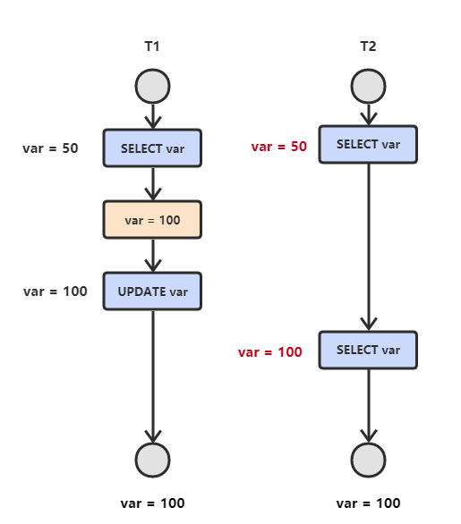

## 数据库

#### 1. 简述数据库三大范式

- **第一范式**：如果数据库表中的所有字段值都是不可分解的原子值，就说明该数据库表满足了第一范式。
- **第二范式**：关系模式必须满足第一范式，并且所有非主属性都完全依赖于主码。注意，符合第二范式的关系模型可能还存在数据冗余、更新异常等问题。例如，关系模型（学号，姓名，专业编号，专业名称）中的 **学号→姓名**；而 **专业编号→专业名称**，不满足数据库第二范式。
- **第三范式**：关系模型满足第二范式，所有非主属性对任何候选关键字都不存在传递依赖。即每个属性都跟主键有直接关系而不是间接关系。接着以学生表举例，对于关系模型（学号，姓名，年龄，性别，所在院校，院校地址，院校电话）院校地址，院校电话和学号不存在直接关系，因此不满足第三范式。

#### 2. 简述事务

事务内的语句要么全部执行成功，要么全部执行失败。事务满足如下几个特性：

- **原子性（Atomicity）**：一个事务中的所有操作要么全部完成，要么全部不完成。
- **一致性（Consistency）**：事务执行前后数据库的状态保存一致。
- **隔离性（Isolation）**：多个并发事务对数据库进行操作，事务间互不干扰。
- **持久性（Durability）**：事务执行完毕，对数据的修改是永久的，即使系统故障也不会丢失。

#### 3. 并发一致性问题

- **修改丢失**：T1 和 T2 两个事务都对一个数据进行修改，T1 先修改，T2 随后修改，T2 的修改覆盖了 T1 的修改。

  

- **读脏数据（脏读）**：T1 修改一个数据，T2 随后读取这个数据。如果 T1 撤销了这次修改，那么 T2 读取的数据是脏数据。

  

- **不可重复读**：T2 读取一个数据，T1 对该数据做了修改。如果 T2 再次读取这个数据，此时读取的结果和第一次读取的结果不同。

  

- **幻读**：T1 读取某个范围的数据，T2 在这个范围内插入新的数据，T1 再次读取这个范围的数据，此时读取的结果和和第一次读取的结果不同。

  

产生并发不一致性问题主要原因是破坏了事务的隔离性，解决方法是通过并发控制来保证隔离性。并发控制可以通过封锁来实现，但是封锁操作需要用户自己控制，相当复杂。数据库管理系统提供了事务的隔离级别，让用户以一种更轻松的方式处理并发一致性问题。

#### 4. 数据库隔离级别

- **未提交读（Read Uncommitted）**：事务中的修改，即使没有提交，对其它事务也是可见的。
- **提交读（Read Committed）**：一个事务只能读取已经提交的事务所做的修改。换句话说，一个事务所做的修改在提交之前对其它事务是不可见的。
- **可重复读（Repeatable Read）**：保证在同一个事务中多次读取同样数据的结果是一样的。
- **串行化（Serializable）**：强制事务串行执行。

| 隔离级别 | 脏读 | 不可重复读 | 幻读 |
| -------- | ---- | ---------- | ---- |
| 未提交读 | √    | √          | √    |
| 提交读   | ×    | √          | √    |
| 可重复读 | ×    | ×          | √    |
| 可串行化 | ×    | ×          | ×    |

#### 5. 大数据小内存排序问题

##### 数据库排序（本质上还是分治）

- 索引排序，分块输出

##### 分治法

- 用堆维护文件连接，排序依据是文件第一个元素（索引，sorting key）的大小，合并为一个文件则落盘。