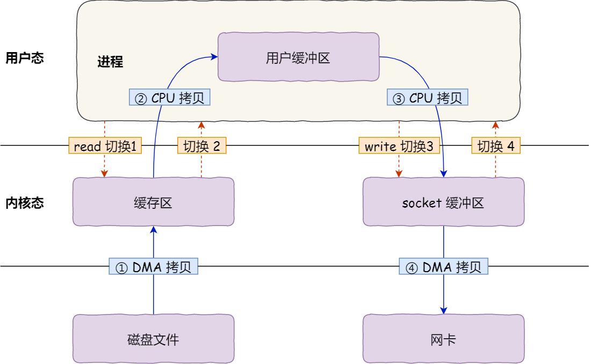
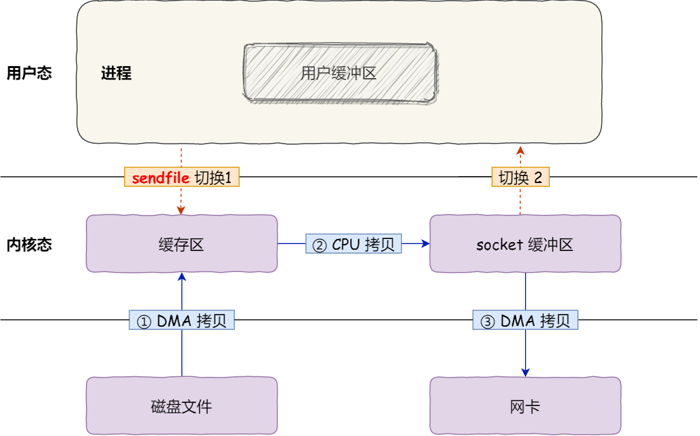
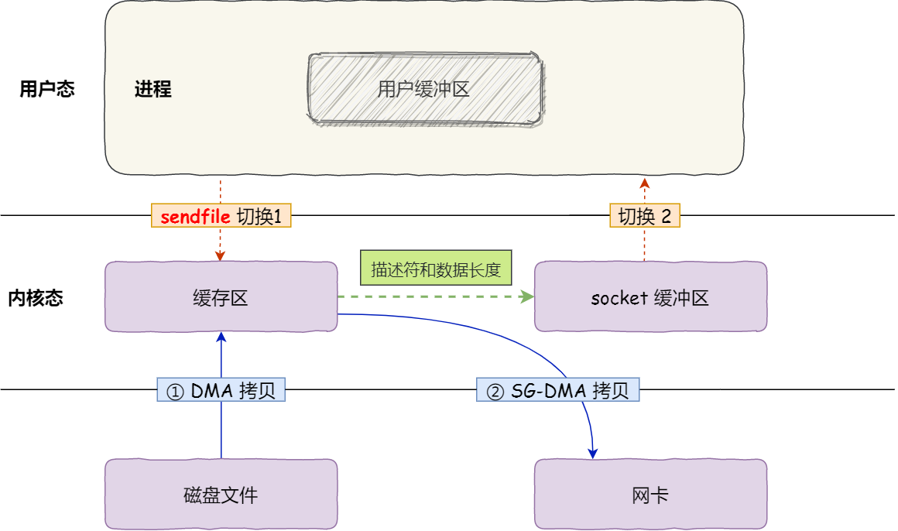

## 蚂蚁一面电话面

> **硬核的数据库大剖析**


上来还是自我介绍，我介绍了两款数据库的使用，一个是时序数据库VictoriaMetrics，一个是ClickHouse。


### ClickHouse

1. **为什么选择ClickHouse？**

   1. 宽表，列式存储；
   2. 查询分析场景，一次写入多次查询；
   3. 磁盘占用小（列式存储，压缩效率高）；
   4. 开源，高效的数据结构（类似于LSM-Tree，稀疏索引）；

2. **ClickHouse的列式存储有什么优势？行式存储有什么优势？**

   - **列式**：
     1. 查询不必读入其他数据列；
     2. 可以利用上下文压缩，压缩效率高；
     3. 可以用作宽表；
     4. TODO
   - **行式**：（当时没怎么答上来）
     1. 多用于关系型数据库，支持事务；
     2. 更改定长数据较为高效；
     3. 删除数据较为高效；
     4. TODO

3. **你有没有做过原有数据库到ClickHouse的热切换（逐渐过渡）？**

   **没有**，TODO


### VictoriaMetrics

1. **如何保证数据完整？**

   落盘

2. **有没有备份机制？**

   切片集群，更多关注分片，没有写前日志，是性能高效的原因之一。

3. **你要实现写前日志怎么实现？**

   在写入前开一个协程往磁盘文件里写数据。

4. **数据格式怎么设计？**

   1. 一种方案是直接写原始数据，开销较大，磁盘占用较大。
   2. 一种是找到哈希索引后写哈希而不是metrics，写开销小。

5. **如何加速写入过程？特别是I/O？**

   现场：开协程负责与I/O的通信，**追问：还是没有改善I/O速度，只是不阻塞**，用缓存（缓冲）

   - 写请求合并，追加写而不是随机写，适当压缩。

6. **一个HTTP请求从响应到内存读取发生了什么？（内核态、用户态交互）**

   不太了解。

   - 具体过程：

     - 用户进程调用 read 方法，向操作系统发出 I/O 请求，请求读取数据到自己的内存缓冲区中，进程进入阻塞状态；
     - 操作系统收到请求后，进一步将 I/O 请求发送 DMA，然后让 CPU 执行其他任务；
     - DMA 进一步将 I/O 请求发送给磁盘；
     - 磁盘收到 DMA 的 I/O 请求，把数据从磁盘读取到磁盘控制器的缓冲区中，当磁盘控制器的缓冲区被读满后，向 DMA 发起中断信号，告知自己缓冲区已满；
     - **DMA 收到磁盘的信号，将磁盘控制器缓冲区中的数据拷贝到内核缓冲区中，此时不占用 CPU，CPU 可以执行其他任务**；
     - 当 DMA 读取了足够多的数据，就会发送中断信号给 CPU；
     - CPU 收到 DMA 的信号，知道数据已经准备好，于是将数据从内核拷贝到用户空间，系统调用返回；

     可以看到， **CPU 不再参与「将数据从磁盘控制器缓冲区搬运到内核空间」的工作，这部分工作全程由 DMA 完成**。但是 CPU 在这个过程中也是必不可少的，因为传输什么数据，从哪里传输到哪里，都需要 CPU 来告诉 DMA 控制器。

   - 传统方式：

     

   - 零拷贝：

   - 

     


### 算法题目

- [26. Remove Duplicates from Sorted Array](https://leetcode.cn/problems/remove-duplicates-from-sorted-array/)

虽然是到简单题，但是加上限制条件必须满足$O(1)$的空间复杂度，稍稍提升了一下含金量。思路是**双指针**，但是现场我用了三个指针，看起来不太优雅，不过也是另一种优雅。

只需要定位到上一个数据，下标为`last`，和当前需要被比对的数据，下标为`cur`，如果`nums[last]==nums[cur]`，则`cur`累加；否则，`nums[++last]==nums[cur]`。

代码（三指针版，把`last`拆成了`last`光比对，和`fixIn`光负责写入）：

```go
func f(nums []int) ([]int, int) {
	n := len(nums)
	last, fixIn, cur := 0, -1, 1
	for ; cur < n; cur++ {
		if nums[cur] == nums[last] {
			if fixIn == -1 {
				fixIn = cur
			}
		} else {
			if fixIn != -1 {
				nums[fixIn] = nums[cur]
				last = fixIn
				fixIn++
			} else {
				last = cur
			}
		}
	}
	if fixIn != -1 {
		nums = nums[:fixIn]
	}
	return nums, len(nums)
}
```

