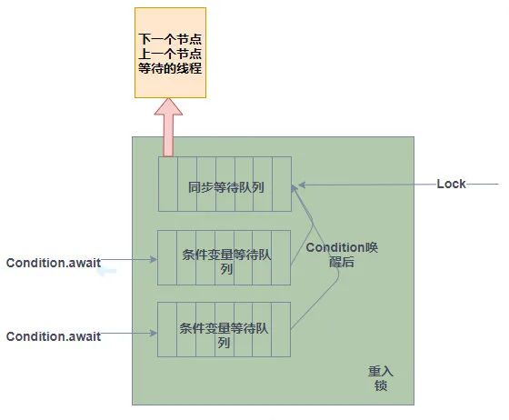

## AQS


AQS 的全称为 `AbstractQueuedSynchronizer` ，翻译过来的意思就是抽象队列同步器。这个类在 `java.util.concurrent.locks` 包下面。

AQS 就是一个抽象类，主要用来构建锁和同步器。

```java
public abstract class AbstractQueuedSynchronizer extends AbstractOwnableSynchronizer implements java.io.Serializable {}
```

AQS 为构建锁和同步器提供了一些通用功能的是实现，因此，使用 AQS 能简单且高效地构造出应用广泛的大量的同步器，比如我们提到的 `ReentrantLock`，`Semaphore`，其他的诸如 `ReentrantReadWriteLock`，`SynchronousQueue`等等皆是基于 AQS 的。


### 原理

AQS 核心思想是，如果被请求的共享资源空闲，则将当前请求资源的线程设置为有效的工作线程，并且将共享资源设置为锁定状态。如果被请求的共享资源被占用，那么就需要一套线程阻塞等待以及被唤醒时锁分配的机制，这个机制 AQS 是基于 **CLH 锁** （Craig, Landin, and Hagersten locks） 实现的。

CLH 锁是对自旋锁的一种改进，是一个虚拟的双向队列（虚拟的双向队列即不存在队列实例，仅存在结点之间的关联关系），暂时获取不到锁的线程将被加入到该队列中。AQS 将每条请求共享资源的线程封装成一个 CLH 队列锁的一个结点（Node）来实现锁的分配。在 CLH 队列锁中，一个节点表示一个线程，它保存着线程的引用（thread）、 当前节点在队列中的状态（waitStatus）、前驱节点（prev）、后继节点（next）。

CLH 队列锁结构如下图所示：


#### 自旋锁

自旋锁是互斥锁的一种实现，Java 实现如下方所示。

```java
public class SpinLock {
    private AtomicReference<Thread> owner = new AtomicReference<Thread>();

    public void lock() {
        Thread currentThread = Thread.currentThread();
        // 如果锁未被占用，则设置当前线程为锁的拥有者
        while (!owner.compareAndSet(null, currentThread)) {
        }
    }

    public void unlock() {
        Thread currentThread = Thread.currentThread();
        // 只有锁的拥有者才能释放锁
        owner.compareAndSet(currentThread, null);
    }
}
```

如代码所示，获取锁时，线程会对一个原子变量循环执行 `compareAndSet` 方法，直到该方法返回成功时即为成功获取锁。compareAndSet 方法底层是通用 compare-and-swap （下称 CAS）实现的。该操作通过将内存中的值与指定数据进行比较，当数值一样时将内存中的数据替换为新的值。该操作是原子操作。原子性保证了根据最新信息计算出新值，如果与此同时值已由另一个线程更新，则写入将失败。因此，这段代码可以实现互斥锁的功能。


##### 缺点

自旋锁实现简单，同时避免了操作系统进程调度和线程上下文切换的开销，但他有两个缺点：

- 第一个是锁饥饿问题。在锁竞争激烈的情况下，可能存在一个线程一直被其他线程”插队“而一直获取不到锁的情况。
- 第二是性能问题。在实际的多处理上运行的自旋锁在锁竞争激烈时性能较差。

下图是引用自《多处理器编程的艺术》的 n 个线程固定地执行一段临界区所需的时间。

TASLock 和 TTASLock 与上文代码类似，都是针对一个原子状态变量轮询的自旋锁实现，最下面的曲线表示线程在没有干扰的情况下所需的时间。


显然，自旋锁的性能和理想情况相距甚远。这是因为自旋锁锁状态中心化，在竞争激烈的情况下，锁状态变更会导致多个 CPU 的高速缓存的频繁同步，从而拖慢 CPU 效率（这里涉及到 CPU 底层的一些知识，这里不再展开）。


#### CLH锁

- https://mp.weixin.qq.com/s/jEx-4XhNGOFdCo4Nou5tqg

CLH 锁是对自旋锁的一种改进，有效的解决了以上的两个缺点。首先它将线程组织成一个队列，保证先请求的线程先获得锁，避免了饥饿问题。其次锁状态去中心化，让每个线程在不同的状态变量中自旋，这样当一个线程释放它的锁时，只能使其后续线程的高速缓存失效，缩小了影响范围，从而减少了 CPU 的开销。

CLH 锁数据结构很简单，类似一个链表队列，所有请求获取锁的线程会排列在链表队列中，自旋访问队列中前一个节点的状态。当一个节点释放锁时，只有它的后一个节点才可以得到锁。CLH 锁本身有一个队尾指针 `Tail`，它是一个原子变量，指向队列最末端的 CLH 节点。每一个 CLH 节点有两个属性：所代表的线程和标识是否持有锁的状态变量。当一个线程要获取锁时，它会对 `Tail` 进行一个 `getAndSet` 的原子操作。该操作会返回 `Tail` 当前指向的节点，也就是当前队尾节点，然后使 `Tail` 指向这个线程对应的 CLH 节点，成为新的队尾节点。入队成功后，该线程会轮询上一个队尾节点的状态变量，当上一个节点释放锁后，它将得到这个锁。

下面用图来展示 CLH 锁从获取到释放锁的全过程。


1. CLH 锁初始化时会 `Tail` 会指向一个状态为 false 的空节点，如图1所示。
2. 当 Thread 1（下称 T1）请求获取锁时，`Tail` 节点指向 T1 对应的节点，同时返回空节点。T1 检查到上一个节点状态为 false，就成功获取到锁，可以执行相应的逻辑了，如图2所示。
3. 当 Thread 2（下称 T2）请求获取锁时，`Tail` 节点指向 T2 对应的节点，同时返回 T1 对应的节点。T2检查到上一个节点状态为 True，无法获取到锁，于是开始轮询上一个节点的状态，如图3所示。
4. 当 T1 释放锁时，会将状态变量置为 False，如图4所示。
5. T2 轮询到检查到上一个节点状态变为 False，则获取锁成功，如图5所示。


##### CLH锁的Java实现


**1、节点中的状态变量为什么用 `volatile` 修饰？可以不用 `volatile` 吗？**

使用 `volatile` 修饰状态变量不是为了利用 `volatile` 的内存可见性，因为这个状态变量只会被持有该状态变量的线程写入，只会被队列中该线程的后驱节点对应的线程读，而且后者会轮询读取。因此，可见性问题不会影响锁的正确性。以上面的例子为例，T2 会不断轮询T1的状态变量，T1 将它的状态变更为 False 时 T2 没有立即感知也没有关系。该状态变量最终会写回内存并被 T2 终感知到变更后的值。

但要实现一个可以在多线程程序中正确执行的锁，还需要解决重排序问题。在《Java 并发编程实战》一书对于重排序问题是这么描述的：在没有同步的情况下，编译器、处理器以及运行时等都可能对操作的执行顺序进行一些意想不到的调整。在缺乏足够同步的多线程程序中，要想对内存操作的执行顺序进行判断，几乎无法得到正确的结论。对于 Java `synchronized` 关键字提供的内置锁(又叫监视器)，Java Memory Model（下称 JMM）规范中有一条 Happens-Before（先行发生）规则：“一个监视器锁上的解锁发生在该监视器锁的后续锁定之前”，因此 JVM 会保证这条规则成立。

而自定义互斥锁就需要自己保证这一规则的成立，因此上述代码通过 `volatile` 的 Happens-Before（先行发生）规则来解决重排序问题。JMM 的 Happens-Before（先行发生）规则有一条针对 `volatile` 关键字的规则：“`volatile` 变量的写操作发生在该变量的后续读之前”。

**2、CLH 锁是一个链表队列，为什么 Node 节点没有指向前驱或后继指针呢？**

CLH 锁是一种隐式的链表队列，没有显式的维护前驱或后继指针。因为每个等待获取锁的线程只需要轮询前一个节点的状态就够了，而不需要遍历整个队列。在这种情况下，只需要使用一个局部变量保存前驱节点，而不需要显式的维护前驱或后继指针。

**3、`this.node.set(new Node())` 这行代码有何意义？**

如果没有这行代码，Node 可能被复用，导致死锁，如下图所示：


1.一开始，T1 持有锁，T2 自旋等待，如图1开始。

2.当 T1 释放锁（设置为 false），但此时 T2 尚未抢占到锁，如图2所示。

3.此时如果 T1 再次调用 `lock()`请求获取锁，会将状态设为 True，同时自旋等待 T2 释放锁。而T2也自旋等待前驱节点状态变为 False，这样就造成了死锁，如图3所示。

因此需要这行代码生成新的 Node 节点，避免 Node 节点复用带来的死锁。


##### 优缺点

**CLH 锁作为自旋锁的改进，有以下几个优点：**

1. 性能优异，获取和释放锁开销小。CLH 的锁状态不再是单一的原子变量，而是分散在每个节点的状态中，降低了自旋锁在竞争激烈时频繁同步的开销。在释放锁的开销也因为不需要使用 CAS 指令而降低了。
2. 公平锁。先入队的线程会先得到锁。
3. 实现简单，易于理解。
4. 扩展性强。下面会提到 AQS 如何扩展 CLH 锁实现了 j.u.c 包下各类丰富的同步器。

**当然，它也有两个缺点：**

1. 因为有自旋操作，当锁持有时间长时会带来较大的 CPU 开销。
2. 基本的 CLH 锁功能单一，不改造不能支持复杂的功能。


##### AQS中的CLH

针对 CLH 的缺点，AQS 对 CLH 队列锁进行了一定的改造。针对第一个缺点，AQS 将自旋操作改为阻塞线程操作。针对第二个缺点，AQS 对 CLH 锁进行改造和扩展，原作者 Doug Lea 称之为“CLH 锁的变体”。下面将详细讲 AQS 底层细节以及对 CLH 锁的改进。AQS 中的对 CLH 锁数据结构的改进主要包括三方面：扩展每个节点的状态、显式的维护前驱节点和后继节点以及诸如出队节点显式设为 `null` 等辅助 GC 的优化。正是这些改进使 AQS 可以支撑 j.u.c 丰富多彩的同步器实现。

###### 扩展节点的状态

AQS 每个节点的状态如下所示，在源码中如下所示：

```java
volatile int waitStatus;
```

AQS 同样提供了该状态变量的原子读写操作，但和同步器状态不同的是，节点状态在 AQS 中被清晰的定义，如下表所示：

| 状态名    | 描述                                     |
| --------- | ---------------------------------------- |
| SIGNAL    | 表示该节点正常等待                       |
| PROPAGATE | 应将 releaseShared 传播到其他节点        |
| CONDITION | 该节点位于条件队列，不能用于同步队列节点 |
| CANCELLED | 由于超时、中断或其他原因，该节点被取消   |

###### **显式的维护前驱节点和后继节点**

上文我们提到在原始版本的 CLH 锁中，节点间甚至都没有互相链接。但是，通过在节点中显式地维护前驱节点，CLH 锁就可以处理“超时”和各种形式的“取消”：如果一个节点的前驱节点取消了，这个节点就可以滑动去使用前面一个节点的状态字段。对于通过自旋获取锁的 CLH 锁来说，只需要显式的维护前驱节点就可以实现取消功能，如下图所示：


但是在 AQS 的实现稍有不同。因为 AQS 用阻塞等待替换了自旋操作，线程会阻塞等待锁的释放，不能主动感知到前驱节点状态变化的信息。AQS 中显式的维护前驱节点和后继节点，需要释放锁的节点会显式通知下一个节点解除阻塞，如下图所示，T1 释放锁后主动唤醒 T2，使 T2 检测到锁已释放，获取锁成功。


其中需要关注的一个细节是：由于没有针对双向链表节点的类似 `compareAndSet` 的原子性无锁插入指令，因此后驱节点的设置并非作为原子性插入操作的一部分，而仅是在节点被插入后简单地赋值。在释放锁时，如果当前节点的后驱节点不可用时，将从利用队尾指针 `Tail` 从尾部遍历到直到找到当前节点正确的后驱节点。

###### GC

JVM 的垃圾回收机制使开发者无需手动释放对象。但在 AQS 中需要在释放锁时显式的设置为 `null`，避免引用的残留，辅助垃圾回收。


#### LockSupport

`LockSupport`可以理解为一个工具类。它的作用很简单，就是挂起和继续执行线程。它的常用的API如下：

- `public static void park()` : 如果没有可用许可，则挂起当前线程
- `public static void unpark(Thread thread)`：给thread一个可用的许可，让它得以继续执行

因为单词park的意思就是停车，因此这里`park()`函数就表示让线程暂停。反之，`unpark()`则表示让线程继续执行。

需要注意的是，`LockSupport`本身也是基于许可的实现，如何理解这句话呢，请看下面的代码：

```java
LockSupport.unpark(Thread.currentThread());
LockSupport.park();
```

大家可以猜一下，`park()`之后，当前线程是停止，还是 可以继续执行呢？

答案是：可以继续执行。那是因为在`park()`之前，先执行了`unpark()`，进而释放了一个许可，也就是说当前线程有一个可用的许可。而park()在有可用许可的情况下，是不会阻塞线程的。

综上所述，`park()`和`unpark()`的执行效果和它调用的先后顺序没有关系。这一点相当重要，因为在一个多线程的环境中，我们往往很难保证函数调用的先后顺序（都在不同的线程中并发执行），因此，这种基于许可的做法能够最大限度保证程序不出错。

与`park()`和`unpark()`相比， 一个典型的反面教材就是`Thread.resume()`和`Thread.suspend()`。

看下面的代码：

```java
Thread.currentThread().resume();
Thread.currentThread().suspend();
```

首先让线程继续执行，接着在挂起线程。这个写法和上面的park()的示例非常接近，但是运行结果却是截然不同的。在这里，当前线程就是卡死。

因此，使用`park()`和`unpark()`才是我们的首选。而在`AbstractQueuedSynchronizer`中，也正是使用了`LockSupport`的`park()`和`unpark()`操作来控制线程的运行状态的。


### AQS 框架

- https://www.cnblogs.com/waterystone/p/4920797.html
- https://mp.weixin.qq.com/s/hB5ncpe7_tVovQj1sNlDRA


它维护了一个`volatile int state`（代表共享资源）和一个FIFO线程等待队列（多线程争用资源被阻塞时会进入此队列）。这里`volatile`是核心关键词，具体`volatile`的语义，在此不述。`state`的访问方式有三种：

- `getState()`
- `setState()`
- `compareAndSetState()`

AQS定义两种资源共享方式：Exclusive（独占，只有一个线程能执行，如`ReentrantLock`）和Share（共享，多个线程可同时执行，如`Semaphore`/`CountDownLatch`）。

不同的自定义同步器争用共享资源的方式也不同。**自定义同步器在实现时只需要实现共享资源state的获取与释放方式即可**，至于具体线程等待队列的维护（如获取资源失败入队/唤醒出队等），AQS已经在顶层实现好了。自定义同步器实现时主要实现以下几种方法：

- `isHeldExclusively()`：该线程是否正在独占资源。只有用到condition才需要去实现它。
- `tryAcquire(int)`：独占方式。尝试获取资源，成功则返回true，失败则返回false。
- `tryRelease(int)`：独占方式。尝试释放资源，成功则返回true，失败则返回false。
- `tryAcquireShared(int)`：共享方式。尝试获取资源。负数表示失败；0表示成功，但没有剩余可用资源；正数表示成功，且有剩余资源。
- `tryReleaseShared(int)`：共享方式。尝试释放资源，如果释放后允许唤醒后续等待结点返回true，否则返回false。

以`ReentrantLock`为例，`state`初始化为0，表示未锁定状态。A线程`lock()`时，会调用`tryAcquire()`独占该锁并将`state+1`。此后，其他线程再`tryAcquire()`时就会失败，直到A线程`unlock()`到`state=0`（即释放锁）为止，其它线程才有机会获取该锁。当然，释放锁之前，A线程自己是可以重复获取此锁的（`state`会累加），这就是可重入的概念。但要注意，获取多少次就要释放多么次，这样才能保证`state`是能回到零态的。

再以`CountDownLatch`以例，任务分为N个子线程去执行，`state`也初始化为N（注意N要与线程个数一致）。这N个子线程是并行执行的，每个子线程执行完后`countDown()`一次，`state`会CAS减1。等到所有子线程都执行完后(即`state=0`)，会`unpark()`主调用线程，然后主调用线程就会从`await()`函数返回，继续后余动作。

　　一般来说，自定义同步器要么是独占方法，要么是共享方式，他们也只需实现tryAcquire-tryRelease、tryAcquireShared-tryReleaseShared中的一种即可。但AQS也支持自定义同步器同时实现独占和共享两种方式，如`ReentrantReadWriteLock`。


### AQS 源码


- https://mp.weixin.qq.com/s/trsjgUFRrz40Simq2VKxTA
- https://mp.weixin.qq.com/s/iNz6sTen2CSOdLE0j7qu9A


#### 数据结构

在`AbstractQueuedSynchronizer`内部，有一个队列，我们把它叫做**同步等待队列**。它的作用是保存等待在这个锁上的线程（由于`lock()`操作引起的等待）。此外，为了维护等待在条件变量上的等待线程，`AbstractQueuedSynchronizer`又需要再维护一个**条件变量等待队列**，也就是那些由`Condition.await()`引起阻塞的线程。

由于一个重入锁可以生成多个条件变量对象，因此，一个重入锁就可能有多个条件变量等待队列。实际上，每个条件变量对象内部都维护了一个等待列表。其逻辑结构如下所示：



下面的类图展示了代码层面的具体实现：


可以看到，无论是同步等待队列，还是条件变量等待队列，都使用同一个`Node`类作为链表的节点。对于同步等待队列，`Node`中包括链表的上一个元素`prev`，下一个元素next和线程对象thread。对于条件变量等待队列，还使用`nextWaiter`表示下一个等待在条件变量队列中的节点。

Node节点另外一个重要的成员是`waitStatus`，它表示节点等待在队列中的状态：

- `CANCELLED`：表示线程取消了等待。如果取得锁的过程中发生了一些异常，则可能出现取消的情况，比如等待过程中出现了中断异常或者出现了`timeout`。
- `SIGNAL`：表示后续节点需要被唤醒。
- `CONDITION`：线程等待在条件变量队列中。
- `PROPAGATE`：在共享模式下，无条件传播releaseShared状态。早期的JDK并没有这个状态，咋看之下，这个状态是多余的。引入这个状态是为了解决共享锁并发释放引起线程挂起的bug 6801020。（随着JDK的不断完善，它的代码也越来越难懂了 :(，就和我们自己的工程代码一样，bug修多了，细节就显得越来越晦涩）
- 0：初始状态

其中`CANCELLED=1`，SIGNAL=-1，`CONDITION=-2`，`PROPAGATE=-3` 。在具体的实现中，就可以简单的通过waitStatus释放小于等于0，来判断是否是CANCELLED状态。


#### 排它锁


##### 请求

下面是排他锁获得请求许可的代码：

```java
public final void acquire(int arg) {
    //尝试获得许可， arg为许可的个数。对于重入锁来说，每次请求1个。
    if (!tryAcquire(arg) &&
    // 如果tryAcquire 失败，则先使用addWaiter()将当前线程加入同步等待队列
    // 然后继续尝试获得锁
    acquireQueued(addWaiter(Node.EXCLUSIVE), arg))
    selfInterrupt();
}
```

进入一步看一下`tryAcquire()`函数。该函数的作用是尝试获得一个许可。对于`AbstractQueuedSynchronizer`来说，这是一个未实现的抽象函数。

具体实现在子类中。在重入锁，读写锁，信号量等实现中， 都有各自的实现。

如果`tryAcquire()`成功，则`acquire()`直接返回成功。如果失败，就用`acquire(Node node, int arg, boolean shared, boolean interruptible, boolean timed, long time)`将当前线程加入同步等待队列。（全新版的解决方案）

```java
final int acquire(Node node, int arg, boolean shared,
                      boolean interruptible, boolean timed, long time) {
    Thread current = Thread.currentThread();
    byte spins = 0, postSpins = 0;   // retries upon unpark of first thread
    boolean interrupted = false, first = false;
    Node pred = null;                // predecessor of node when enqueued

    /*
         * Repeatedly:
         *  Check if node now first
         *    if so, ensure head stable, else ensure valid predecessor
         *  if node is first or not yet enqueued, try acquiring
         *  else if node not yet created, create it
         *  else if not yet enqueued, try once to enqueue
         *  else if woken from park, retry (up to postSpins times)
         *  else if WAITING status not set, set and retry
         *  else park and clear WAITING status, and check cancellation
         */

    for (;;) {
        if (!first && (pred = (node == null) ? null : node.prev) != null &&
            !(first = (head == pred))) {
            if (pred.status < 0) {
                cleanQueue();           // predecessor cancelled
                continue;
            } else if (pred.prev == null) {
                Thread.onSpinWait();    // ensure serialization
                continue;
            }
        }
        if (first || pred == null) {
            boolean acquired;
            try {
                if (shared)
                    acquired = (tryAcquireShared(arg) >= 0);
                else
                    acquired = tryAcquire(arg);
            } catch (Throwable ex) {
                cancelAcquire(node, interrupted, false);
                throw ex;
            }
            if (acquired) {
                if (first) {
                    node.prev = null;
                    head = node;
                    pred.next = null;
                    node.waiter = null;
                    if (shared)
                        signalNextIfShared(node);
                    if (interrupted)
                        current.interrupt();
                }
                return 1;
            }
        }
        if (node == null) {                 // allocate; retry before enqueue
            if (shared)
                node = new SharedNode();
            else
                node = new ExclusiveNode();
        } else if (pred == null) {          // try to enqueue
            node.waiter = current;
            Node t = tail;
            node.setPrevRelaxed(t);         // avoid unnecessary fence
            if (t == null)
                tryInitializeHead();
            else if (!casTail(t, node))
                node.setPrevRelaxed(null);  // back out
            else
                t.next = node;
        } else if (first && spins != 0) {
            --spins;                        // reduce unfairness on rewaits
            Thread.onSpinWait();
        } else if (node.status == 0) {
            node.status = WAITING;          // enable signal and recheck
        } else {
            long nanos;
            spins = postSpins = (byte)((postSpins << 1) | 1);
            if (!timed)
                LockSupport.park(this);
            else if ((nanos = time - System.nanoTime()) > 0L)
                LockSupport.parkNanos(this, nanos);
            else
                break;
            node.clearStatus();
            if ((interrupted |= Thread.interrupted()) && interruptible)
                break;
        }
    }
    return cancelAcquire(node, interrupted, interruptible);
}
```


##### signal() 通知

```java
/**
* Wakes up the successor of given node, if one exists, and unsets its
* WAITING status to avoid park race. This may fail to wake up an
* eligible thread when one or more have been cancelled, but
* cancelAcquire ensures liveness.
*/
private static void signalNext(Node h) {
    Node s;
    if (h != null && (s = h.next) != null && s.status != 0) {
        s.getAndUnsetStatus(WAITING);
        LockSupport.unpark(s.waiter);
    }
}
```


##### release() 释放锁

```java
public final boolean release(int arg) {
    if (tryRelease(arg)) {
        signalNext(head);
        return true;
    }
    return false;
}

/**
* Wakes up the successor of given node, if one exists, and unsets its
* WAITING status to avoid park race. This may fail to wake up an
* eligible thread when one or more have been cancelled, but
* cancelAcquire ensures liveness.
*/
private static void signalNext(Node h) {
    Node s;
    if (h != null && (s = h.next) != null && s.status != 0) {
        s.getAndUnsetStatus(WAITING);
        LockSupport.unpark(s.waiter);
    }
}
```


#### 共享锁

与排他锁相比，共享锁的实现略微复杂一点。这也很好理解。因为排他锁的场景很简单，单进单出，而共享锁就不一样了。可能是N进M出，处理起来要麻烦一些。但是，他们的核心思想还是一致的。共享锁的几个典型应用有：**信号量**，**读写锁中的写锁**。

为了实现共享锁，在`AbstractQueuedSynchronizer`中，专门有一套针对共享锁的方法。


获得共享锁使用`acquireShared()`方法：

```java
/**
     * Acquires in shared mode, ignoring interrupts.  Implemented by
     * first invoking at least once {@link #tryAcquireShared},
     * returning on success.  Otherwise the thread is queued, possibly
     * repeatedly blocking and unblocking, invoking {@link
     * #tryAcquireShared} until success.
     *
     * @param arg the acquire argument.  This value is conveyed to
     *        {@link #tryAcquireShared} but is otherwise uninterpreted
     *        and can represent anything you like.
*/
public final void acquireShared(int arg) {
    if (tryAcquireShared(arg) < 0)
        acquire(null, arg, true, false, false, 0L);
}
```


释放共享锁：

```java
/**
     * Releases in shared mode.  Implemented by unblocking one or more
     * threads if {@link #tryReleaseShared} returns true.
     *
     * @param arg the release argument.  This value is conveyed to
     *        {@link #tryReleaseShared} but is otherwise uninterpreted
     *        and can represent anything you like.
     * @return the value returned from {@link #tryReleaseShared}
*/
public final boolean releaseShared(int arg) {
    if (tryReleaseShared(arg)) {
        signalNext(head);
        return true;
    }
    return false;
}
```


## `CountDownLatch` & `CyclicBarrier` & `Semaphore`

- https://mp.weixin.qq.com/s/TDw7GnzDw5FK3RWwkIzzZA