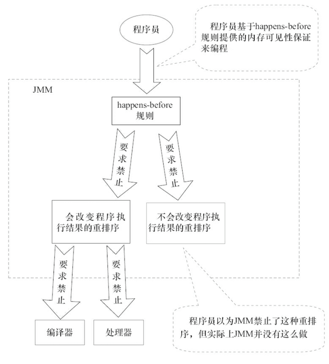
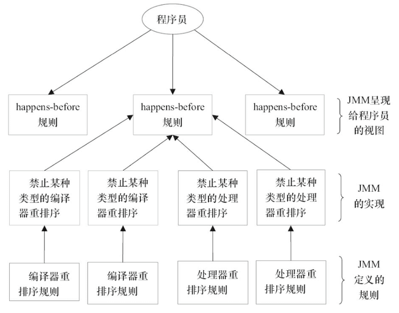

## JMM (Java Memory Model)


- https://javaguide.cn/java/concurrent/jmm.html


JMM（Java内存模型）主要定义了对于一个共享变量，当另一个线程对这个共享变量执行写操作后，这个线程对这个共享变量的可见性。


### CPU缓存模型


- https://zhuanlan.zhihu.com/p/351550104


#### **缓存与主存**

解读缓存一致性（Cache Coherency），先看一下CPU的架构


图示一个4核CPU，有三个级别的缓存，分为是L1 Cache（一级缓存）、L2 Cache（二级缓存）、L3 Cache（三级缓存）

其中一级缓存有两部分组成：L1I Cache（一级指令缓存）和L1D Cache（一级数据缓存）。

越靠近CPU的缓存速度越快，单价也更昂贵。其中一级和二级如今都属于片内缓存（在CPU核内，早期L2缓存是片外的）独立归属给各个CPU，而三级缓存是CPU间共享的。

查询缓存的时候也是由近及远，优先从一级缓存去查找，找到就结束查找，找不到则再去二级缓存查找。二级缓存找不到去三级缓存查找。三级缓存还找不到就去主存（Main Memory）查找。这里说的主存，就是我们平常说的内存。

内存是DRAM（Dynamic RAM），缓存是SRAM（Static RAM）。


#### **缓存行**

CPU操作缓存的单位是”缓存行“（cacheline），也就是说如果CPU要读一个变量x，那么其实是读变量x所在的整个缓存行。


#### **缓存行大小**

好了，既然我们知道了CPU读写缓存的单位是缓存行，那么缓存行的大小是多少呢？

查看机器缓存行大小的方法有很多，在Linux上你可以查看如下文件确认缓存行大小：

```shell
# L1D Cache
cat /sys/devices/system/cpu/cpu0/cache/index0/coherency_line_size

# L1I Cache
cat /sys/devices/system/cpu/cpu0/cache/index1/coherency_line_size

# L2 Cache
cat /sys/devices/system/cpu/cpu0/cache/index2/coherency_line_size

# L3 Cache
cat /sys/devices/system/cpu/cpu0/cache/index3/coherency_line_size
```

或者用getconf命令：

```shell
# L1D Cache
getconf LEVEL1_DCACHE_LINESIZE

# L1I Cache
getconf LEVEL1_ICACHE_LINESIZE

# L2 Cache
getconf LEVEL2_CACHE_LINESIZE

# L3 Cache
getconf LEVEL3_CACHE_LINESIZE
```

一般会看到：64。表示的是64字节。


#### MESI协议

并发场景下（比如多线程）如果操作相同变量，如何保证每个核中缓存的变量是正确的值，这涉及到一些”缓存一致性“的协议。其中应用最广的就是MESI协议（当然这并不是唯一的缓存一致性协议）。

**MESI协议**是一个基于失效的[缓存一致性](https://zh.wikipedia.org/wiki/缓存一致性)协议，是支持写回（write-back）缓存的最常用协议。

- 与写直达（write through）缓存相比，回写缓冲能节约大量带宽。总是有“脏”（dirty）状态表示缓存中的数据与主存中不同。
- MESI协议要求在缓存不命中（miss）且数据块在另一个缓存时，允许缓存到缓存的数据复制。
- 与[MSI协议](https://zh.wikipedia.org/wiki/MSI协议)相比，MESI协议减少了主存的事务数量。这极大改善了性能。


##### 状态

在缓存行的元信息中有一个Flag字段，它会表示4种状态，分为对应如下所说的M、E、S、I状态。

| 状态           | 描述                                                         |
  | -------------- | ------------------------------------------------------------ |
  | M（Modified）  | 代表该缓存行中的内容被修改了，并且该缓存行只被缓存在该CPU中。这个状态的缓存行中的数据和内存中的不一样，在未来的某个时刻它会被写入到内存中（当其他CPU要读取该缓存行的内容时。或者其他CPU要修改该缓存对应的内存中的内容时 |
  | E（Exclusive） | 代表该缓存行对应内存中的内容只被该CPU缓存，其他CPU没有缓存该缓存对应内存行中的内容。这个状态的缓存行中的内容和内存中的内容一致。该缓存可以在任何其他CPU读取该缓存对应内存中的内容时变成S状态。或者本地处理器写该缓存就会变成M状态 |
  | S（Shared）    | 该状态意味着数据不止存在本地CPU缓存中，还存在别的CPU的缓存中。这个状态的数据和内存中的数据是一致的。当其他CPU修改该缓存行对应的内存的内容时会使该缓存行变成 I 状态 |
  | I（Invalid）   | 代表该缓存行中的内容是无效的                                 |

任意一对缓存，对应缓存行的相容关系:

|      |  M   |  E   |  S   |  I   |
| :--: | :--: | :--: | :--: | :--: |
|  M   |  ❌   |  ❌   |  ❌   |  ✔   |
|  E   |  ❌   |  ❌   |  ❌   |  ✔   |
|  S   |  ❌   |  ❌   |  ✔   |  ✔   |
|  I   |  ✔   |  ✔   |  ✔   |  ✔   |


##### 总线嗅探

CPU和内存通过总线（BUS）互通消息。

CPU感知其他CPU的行为（比如读、写某个缓存行）就是是通过嗅探（Snoop）线性中其他CPU发出的请求消息完成的，有时CPU也需要针对总线中的某些请求消息进行响应。这被称为“总线嗅探机制”。

这些消息类型分为请求消息和响应消息两大类，细分为6小类。

| 消息类型               | 请求/响应 | 描述                                                         |
| ---------------------- | --------- | ------------------------------------------------------------ |
| Read                   | 请求      | 通知其他处理器和内存，当前处理器准备读取某个数据。该消息内包含待读取数据的内存地址 |
| Read Response          | 响应      | 该消息内包含了被请求读取的数据。该消息可能是主内存返回的，也可能是其他高速缓存嗅探到Read 消息返回的 |
| Invalidate             | 请求      | 通知其他处理器删除指定内存地址的数据副本（缓存行中的数据）。所谓“删除”，其实就是更新下缓存行对应的FLAG（MESI那个） |
| Invalidate Acknowledge | 响应      | 接收到Invalidate消息的处理器必须回复此消息，表示已经删除了其高速缓存内对应的数据副本 |
| Read Invalidate        | 请求      | 此消息为Read 和 Invalidate消息组成的复合消息，主要是用于通知其他处理器当前处理器准备更新一个数据了，并请求其他处理器删除其高速缓存内对应的数据副本。接收到该消息的处理器必须回复Read Response 和 Invalidate Acknowledge消息 |
| Writeback              | 响应      | 消息包含了需要写入内存的数据和其对应的内存地址               |


##### 状态流转


图1.1是MESI协议四种状态的转换图。


- 红色：总线初始化事务
- 蓝色：处理器初始化事务

Anyway，我们的程序运行在操作系统之上，操作系统屏蔽了底层硬件的操作细节，将各种硬件资源虚拟化。于是，操作系统也就同样需要解决内存缓存不一致性问题。

操作系统通过 **内存模型（Memory Model）** 定义一系列规范来解决这个问题。无论是 Windows 系统，还是 Linux 系统，它们都有特定的内存模型。


### 指令重排序

说完了 CPU 缓存模型，我们再来看看另外一个比较重要的概念 **指令重排序** 。

为了提升执行速度/性能，计算机在执行程序代码的时候，会对指令进行重排序。

**什么是指令重排序？** 简单来说就是系统在执行代码的时候并不一定是按照你写的代码的顺序依次执行。

常见的指令重排序有下面 2 种情况：

- **编译器优化重排** ：编译器（包括 JVM、JIT 编译器等）在不改变单线程程序语义的前提下，重新安排语句的执行顺序。
- **指令并行重排** ：现代处理器采用了指令级并行技术(Instruction-Level Parallelism，ILP)来将多条指令重叠执行。如果不存在数据依赖性，处理器可以改变语句对应机器指令的执行顺序。

另外，内存系统也会有“重排序”，但又不是真正意义上的重排序。在 JMM 里表现为主存和本地内存的内容可能不一致，进而导致程序在多线程下执行可能出现问题。

Java 源代码会经历 **编译器优化重排 —> 指令并行重排 —> 内存系统重排** 的过程，最终才变成操作系统可执行的指令序列。

**指令重排序可以保证串行语义一致，但是没有义务保证多线程间的语义也一致** ，所以在多线程下，指令重排序可能会导致一些问题。

编译器和处理器的指令重排序的处理方式不一样。对于编译器，通过禁止特定类型的编译器重排序的方式来禁止重排序。对于处理器，通过插入内存屏障（Memory Barrier，或有时叫做内存栅栏，Memory Fence）的方式来禁止特定类型的处理器重排序。指令并行重排和内存系统重排都属于是处理器级别的指令重排序。

> 内存屏障（Memory Barrier，或有时叫做内存栅栏，Memory Fence）是一种 CPU 指令，用来禁止处理器指令发生重排序（像屏障一样），从而保障指令执行的有序性。另外，为了达到屏障的效果，它也会使处理器写入、读取值之前，将主内存的值写入高速缓存，清空无效队列，从而保障变量的可见性。


### 什么是JMM？

Java 是最早尝试提供内存模型的编程语言。由于早期内存模型存在一些缺陷（比如非常容易削弱编译器的优化能力），从 Java5 开始，Java 开始使用新的内存模型 [《JSR-133：Java Memory Model and Thread Specification》](http://www.cs.umd.edu/~pugh/java/memoryModel/CommunityReview.pdf) 。

一般来说，编程语言也可以直接复用操作系统层面的内存模型。不过，不同的操作系统内存模型不同。如果直接复用操作系统层面的内存模型，就可能会导致同样一套代码换了一个操作系统就无法执行了。Java 语言是跨平台的，它需要自己提供一套内存模型以屏蔽系统差异。

这只是 JMM 存在的其中一个原因。实际上，对于 Java 来说，你可以把 JMM 看作是 Java 定义的并发编程相关的一组规范，除了抽象了线程和主内存之间的关系之外，其还规定了从 Java 源代码到 CPU 可执行指令的这个转化过程要遵守哪些和并发相关的原则和规范，其主要目的是为了简化多线程编程，增强程序可移植性的。

**为什么要遵守这些并发相关的原则和规范呢？** 这是因为并发编程下，像 CPU 多级缓存和指令重排这类设计可能会导致程序运行出现一些问题。就比如说我们上面提到的指令重排序就可能会让多线程程序的执行出现问题，为此，JMM 抽象了 happens-before 原则（后文会详细介绍到）来解决这个指令重排序问题。

JMM 说白了就是定义了一些规范来解决这些问题，开发者可以利用这些规范更方便地开发多线程程序。对于 Java 开发者说，你不需要了解底层原理，直接使用并发相关的一些关键字和类（比如 `volatile`、`synchronized`、各种 `Lock`）即可开发出并发安全的程序。


### JMM 是如何抽象线程和主内存之间的关系？

**Java 内存模型（JMM）** 抽象了线程和主内存之间的关系，就比如说线程之间的共享变量必须存储在主内存中。

在 JDK1.2 之前，Java 的内存模型实现总是从 **主存** （即共享内存）读取变量，是不需要进行特别的注意的。而在当前的 Java 内存模型下，线程可以把变量保存 **本地内存** （比如机器的寄存器）中，而不是直接在主存中进行读写。这就可能造成一个线程在主存中修改了一个变量的值，而另外一个线程还继续使用它在寄存器中的变量值的拷贝，造成数据的不一致。

这和我们上面讲到的 CPU 缓存模型非常相似。

**什么是主内存？什么是本地内存？**

- **主内存** ：所有线程创建的实例对象都存放在主内存中，不管该实例对象是成员变量还是方法中的本地变量(也称局部变量)
- **本地内存** ：每个线程都有一个私有的本地内存来存储共享变量的副本，并且，每个线程只能访问自己的本地内存，无法访问其他线程的本地内存。本地内存是 JMM 抽象出来的一个概念，存储了主内存中的共享变量副本。

Java 内存模型的抽象示意图如下：


从上图来看，线程 1 与线程 2 之间如果要进行通信的话，必须要经历下面 2 个步骤：

1. 线程 1 把本地内存中修改过的共享变量副本的值同步到主内存中去。
2. 线程 2 到主存中读取对应的共享变量的值。

也就是说，JMM 为共享变量提供了可见性的保障。

不过，多线程下，对主内存中的一个共享变量进行操作有可能诱发线程安全问题。举个例子：

1. 线程 1 和线程 2 分别对同一个共享变量进行操作，一个执行修改，一个执行读取。
2. 线程 2 读取到的是线程 1 修改之前的值还是修改后的值并不确定，都有可能，因为线程 1 和线程 2 都是先将共享变量从主内存拷贝到对应线程的工作内存中。

关于主内存与工作内存直接的具体交互协议，即一个变量如何从主内存拷贝到工作内存，如何从工作内存同步到主内存之间的实现细节，Java 内存模型定义来以下八种同步操作（了解即可，无需死记硬背）：

- **锁定（lock）**: 作用于主内存中的变量，将他标记为一个线程独享变量。
- **解锁（unlock）**: 作用于主内存中的变量，解除变量的锁定状态，被解除锁定状态的变量才能被其他线程锁定。
- **read（读取）**：作用于主内存的变量，它把一个变量的值从主内存传输到线程的工作内存中，以便随后的 load 动作使用。
- **load(载入)**：把 read 操作从主内存中得到的变量值放入工作内存的变量的副本中。
- **use(使用)**：把工作内存中的一个变量的值传给执行引擎，每当虚拟机遇到一个使用到变量的指令时都会使用该指令。
- **assign（赋值）**：作用于工作内存的变量，它把一个从执行引擎接收到的值赋给工作内存的变量，每当虚拟机遇到一个给变量赋值的字节码指令时执行这个操作。
- **store（存储）**：作用于工作内存的变量，它把工作内存中一个变量的值传送到主内存中，以便随后的 write 操作使用。
- **write（写入）**：作用于主内存的变量，它把 store 操作从工作内存中得到的变量的值放入主内存的变量中。

除了这 8 种同步操作之外，还规定了下面这些同步规则来保证这些同步操作的正确执行（了解即可，无需死记硬背）：

- 不允许一个线程无原因地（没有发生过任何 assign 操作）把数据从线程的工作内存同步回主内存中。
- 一个新的变量只能在主内存中 “诞生”，不允许在工作内存中直接使用一个未被初始化（load 或 assign）的变量，换句话说就是对一个变量实施 use 和 store 操作之前，必须先执行过了 assign 和 load 操作。
- 一个变量在同一个时刻只允许一条线程对其进行 lock 操作，但 lock 操作可以被同一条线程重复执行多次，多次执行 lock 后，只有执行相同次数的 unlock 操作，变量才会被解锁。
- 如果对一个变量执行 lock 操作，将会清空工作内存中此变量的值，在执行引擎使用这个变量前，需要重新执行 load 或 assign 操作初始化变量的值。
- 如果一个变量事先没有被 lock 操作锁定，则不允许对它执行 unlock 操作，也不允许去 unlock 一个被其他线程锁定住的变量。


### Java 内存区域和 JMM 有何区别？

这是一个比较常见的问题，很多初学者非常容易搞混。 **Java 内存区域和内存模型是完全不一样的两个东西** ：

- JVM 内存结构和 Java 虚拟机的运行时区域相关，定义了 JVM 在运行时如何分区存储程序数据，就比如说堆主要用于存放对象实例。
- Java 内存模型和 Java 的并发编程相关，抽象了线程和主内存之间的关系就比如说线程之间的共享变量必须存储在主内存中，规定了从 Java 源代码到 CPU 可执行指令的这个转化过程要遵守哪些和并发相关的原则和规范，其主要目的是为了简化多线程编程，增强程序可移植性的。

### happens-before 原则是什么？

happens-before 这个概念最早诞生于 Leslie Lamport 于 1978 年发表的论文[《Time，Clocks and the Ordering of Events in a Distributed System》](https://lamport.azurewebsites.net/pubs/time-clocks.pdf)。在这篇论文中，Leslie Lamport 提出了[逻辑时钟](https://writings.sh/post/logical-clocks)的概念，这也成了第一个逻辑时钟算法 。在分布式环境中，通过一系列规则来定义逻辑时钟的变化，从而能通过逻辑时钟来对分布式系统中的事件的先后顺序进行判断。**逻辑时钟并不度量时间本身，仅区分事件发生的前后顺序，其本质就是定义了一种 happens-before 关系。**

上面提到的 happens-before 这个概念诞生的背景并不是重点，简单了解即可。

JSR 133 引入了 happens-before 这个概念来描述两个操作之间的内存可见性。

**为什么需要 happens-before 原则？** happens-before 原则的诞生是为了程序员和编译器、处理器之间的平衡。程序员追求的是易于理解和编程的强内存模型，遵守既定规则编码即可。编译器和处理器追求的是较少约束的弱内存模型，让它们尽己所能地去优化性能，让性能最大化。happens-before 原则的设计思想其实非常简单：

- 为了对编译器和处理器的约束尽可能少，只要不改变程序的执行结果（单线程程序和正确执行的多线程程序），编译器和处理器怎么进行重排序优化都行。
- 对于会改变程序执行结果的重排序，JMM 要求编译器和处理器必须禁止这种重排序。

下面这张是 《Java 并发编程的艺术》这本书中的一张 JMM 设计思想的示意图，非常清晰。



了解了 happens-before 原则的设计思想，我们再来看看 JSR-133 对 happens-before 原则的定义：

- 如果一个操作 happens-before 另一个操作，那么第一个操作的执行结果将对第二个操作可见，并且第一个操作的执行顺序排在第二个操作之前。
- 两个操作之间存在 happens-before 关系，并不意味着 Java 平台的具体实现必须要按照 happens-before 关系指定的顺序来执行。如果重排序之后的执行结果，与按 happens-before 关系来执行的结果一致，那么 JMM 也允许这样的重排序，例如：

```java
int userNum = getUserNum(); 	// 1
int teacherNum = getTeacherNum();	 // 2
int totalNum = userNum + teacherNum;	// 3
```

虽然 1 happens-before 2，但对 1 和 2 进行重排序不会影响代码的执行结果，所以 JMM 是允许编译器和处理器执行这种重排序的。但 1 和 2 必须是在 3 执行之前，也就是说 1,2 happens-before 3 。


### happens-before 常见规则有哪些？谈谈你的理解？

happens-before 的规则就 8 条，说多不多，重点了解下面列举的 5 条即可。全记是不可能的，很快就忘记了，意义不大，随时查阅即可。

1. **程序顺序规则** ：一个线程内，按照代码顺序，书写在前面的操作 happens-before 于书写在后面的操作；
2. **解锁规则** ：解锁 happens-before 于加锁；
3. **`volatile` 变量规则** ：对一个 `volatile` 变量的写操作 happens-before 于后面对这个 `volatile` 变量的读操作。说白了就是对 volatile 变量的写操作的结果对于发生于其后的任何操作都是可见的。
4. **传递规则** ：如果 A happens-before B，且 B happens-before C，那么 A happens-before C；
5. **线程启动规则** ：Thread 对象的 `start()`方法 happens-before 于此线程的每一个动作。

如果两个操作不满足上述任意一个 happens-before 规则，那么这两个操作就没有顺序的保障，JVM 可以对这两个操作进行重排序。


### happens-before 和 JMM 什么关系？

happens-before 与 JMM 的关系用《Java 并发编程的艺术》这本书中的一张图就可以非常好的解释清楚。

