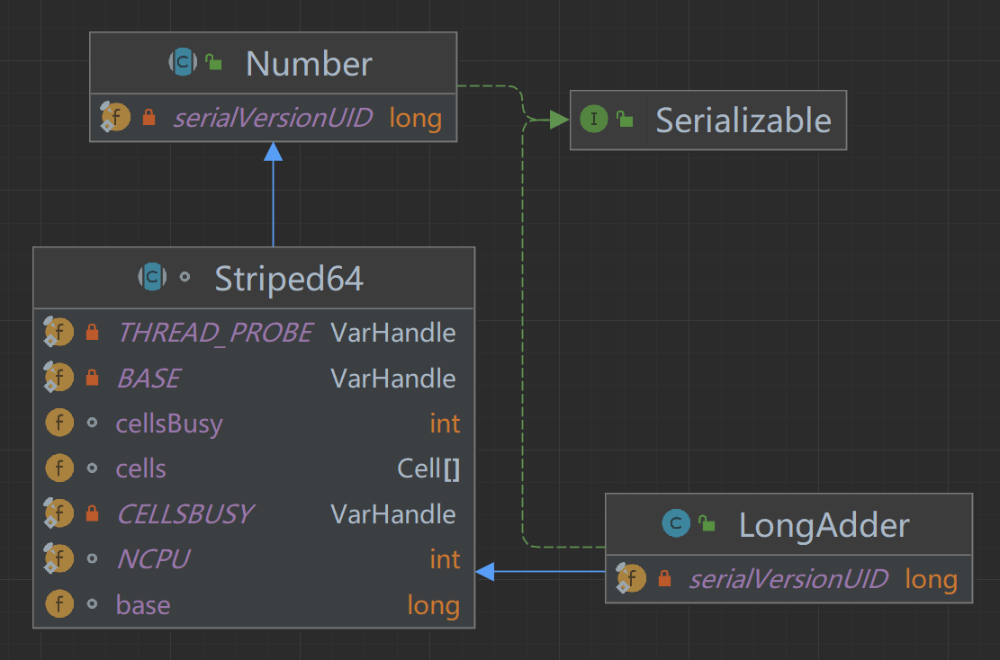

## LongAdder


- https://blog.csdn.net/weixin_43767015/article/details/124380750


来自于JDK 1.8的`LongAdder`，作为一个`long`类型数值的累加器，被用来克服在高并发下使用`AtomicLong` 可能由于线程频繁自旋而浪费CPU的缺点。

`LongAdder`的解决方式是采用了“热点数据分离”的基本思想：传统的原子类的内部通常维护了一个对应类型的`value`属性值，多个线程之间的CAS竞争实际上就是在争夺对这个`value`属性的更新权，但是CAS操作只会保证同时只有一个线程能够更新成功，因此`AtomicLong`（包括其他传统原子类）的性能瓶颈就是由于过多线程同时去竞争一个变量的更新而产生的，那么如果把一个变量分解为多个变量，让同样多的线程去竞争多个资源，最终的结果就是统计被分解出来的多个变量的总和，这样就能大大缓解多线程竞争导致的性能问题，这就是“热点数据分离”的基本思想。这种思想在高并发环境下非常有用，类似的还有“减小锁的粒度”的思想，除了新的原子类之外，在JDK1.8的`ConcurrentHashMap`中对于结点数量的统计并没有采用单个变量计数，也是采用的类似于`LongAdder`的“热点数据分离”的基本思想。




### 属性

```java
//Striped64中的属性

/**
 * 用来实现CAS锁的资源，值为0时表示没有锁，值为1时表示已上锁，扩容Cell 数组或者初始化Cell 数组时会使用到该值
 * 使用CAS的同时唯一成功性来保证同一时刻只有一条线程可以进入扩容Cell 数组或者初始化Cell 数组的代码
 */
transient volatile int cellsBusy;

/**
 * volatile long 类型的基本属性，在没有CAS竞争时用来统计计数
 */
transient volatile long base;

/**
 * volatile Cell类型的数组，要么为null，当发生CAS更新base出现竞争的时候初始化
 * 此后就一直使用该数组来统计计数，初始容量为2，数组可扩容，大小为2的幂次方
 */
transient volatile Striped64.Cell[] cells;

/**
 1. ccells数组的元素类型，由于是数组，导致内存连续，因此可以使用缓存填充(注解方式)来避免伪共享。
 */
@sun.misc.Contended
static final class Cell {
    /**
     * 内部就是一个volatile long类型的基本属性，线程对数组某个索引位置的更新实际上就是更新该值
     */
    volatile long value;

    Cell(long x) {
        value = x;
    }

    /**
     * 更新value指的CAS方法
     *
     * @param cmp 预期值
     * @param val 新值
     * @return true 成功  false 失败
     */
    final boolean cas(long cmp, long val) {
        return UNSAFE.compareAndSwapLong(this, valueOffset, cmp, val);
    }

    //对于数值的更新都是CAS的操作

    private static final sun.misc.Unsafe UNSAFE;
    private static final long valueOffset;

    static {
        try {
            UNSAFE = sun.misc.Unsafe.getUnsafe();
            Class<?> ak = Striped64.Cell.class;
            valueOffset = UNSAFE.objectFieldOffset
                    (ak.getDeclaredField("value"));
        } catch (Exception e) {
            throw new Error(e);
        }
    }
}
```

`LongAdder`类继承自`Striped64`类，`Striped64`被设计用来减少高并发环境的线程冲突，`Striped64`类是对外不可见的，也是这四个累加器类的公共抽象父类，它们很多的操作也是直接调用`Striped64`的方法，在`Striped64` 内部维护着三个主要的变量：

- `cellsBusy` ：用来实现简单的CAS锁，状态值只有0和1，当创建`Cell` 元素，扩容`Cell` 数组或者初始化`Cell` 数组时，使用CAS 操作该变量来保证同时只有一个线程可以进行其中之一的操作。

- `base`：`volatile int`类型的一个基本属性，热点分离的实现之一，在没有存在并发CAS操作的时候记录被用于记录累加值，也用来记录初始值。

- `cells`：`volatile Cell[]` 类型的一个对象数组，热点分离的实现之二，当使用CAS更新`base`基值失败（出现CAS竞争）的时候，就会初始化该数组，然后尝试通过更新该数组中的某个位置的值来记录累加值。

由此我们可以明确的知道，`LongAdder`的热点分离思想的具体实现是将`value`分散为一个`base`变量 + 一个`cells`数组。

这里采用数组的用途很明显，那就是对于并发下的线程随机分配到数组不同索引位置，并对该位置的值进行更新，因此理论上采用一个数组就行了，那么为什么不采用单独一个数组还要加一个变量呢？在没有竞争的情况下，如果还是初始化一个数组然后更新数组某个索引的值就有些得不偿失了，因为数组明显比单个变量占用更多的空间，其更新效率也没有单独更新一个变量那么块。

因此，综合考虑下`LongAdder`采用一个变量`base`和一个数组`cells`一起来计数，它们的使用流程如下：在更新计数的时候如果没有CAS竞争，即并发度较低时就一直使用`base`变量来统计计数，此时`cells`数组是`null`，即没有初始化或者锁延迟初始化，就和`AtomicLong`一样。一旦出现对`base`变量的CAS竞争，即高并发环境下某些线程CAS更新`base`失败，那么就初始化`cells`数组，并且此后都使用`cells`数组来进行统计计数，如果数组某一个索引位置的`Cell`更新时仍然出现了竞争，那么`cells`数组可能会扩容或者寻找新的`Cell`。在统计总和时对`base`和`cells`数组中的值进行求和即可，这种方法在热点分离的基础上还优化了内存的开销。

初始化`cells`数组中的容量为2，扩容时必须保证容量为2的幂次方，数组里面的数据是`Cell` 类型，`Cell`类中仅仅只有一个`value`属性，实际上就是对`value`值的封装，封装成为类的原因主要是方便调用方法对某个位置的`value`值进行CAS的更新，以及作缓存填充操作。

因为数组的内存空间必须是连续的，而一个`cell`内部只有一个`int value`属性，非常有可能多个`cell`对象存在同一个缓存行中，当CAS的更新某一个Cell的值时会将该`Cell`所属的缓存行失效，因此会同时造成其他位于同一个缓存行的相邻`Cell`缓存也同时失效，这样后续线程必须重主存获取相邻的`Cell`，这就造成了“伪共享”的问题，两个`Cell`的访问应该是互不影响的，但是由于在同一个缓存行，造成了和“共享”的现象，因此称为“伪共享”。这里的`Cell` 类使用了 `@sun.misc.Contended`注解修饰，这是JDK1.8缓存填充的新方式，这样一个`Cell`对象就占据一个缓存行的大小，解决了伪共享的问题，进一步提升了性能。

```java
/**
 * 增加给定值
 *
 * @param x 给定值
 */
public void add(long x) {
    //初始化一些变量
    Striped64.Cell[] as;
    long b, v;
    int m;
    Striped64.Cell a;
    /*
     * as保存此时的cells数组：
     * 如果不为null，那么直接进入if代码块
     * 如果为null，说明合格数组还没有初始化，执行后面的casBase操作，b保存base的值
     * 随后尝试CAS的将base值从b更新为b + x，即使用base记录增加值，如果CAS成功那么不进入if代码块，add方法就结束了
     * CAS失败同样进入if代码块，表示CAS更新bae的值出现了并发竞争
     *
     * 即，当cells数组为null并且CAS更新base的值成功之后，add方法就结束了，这就是采用base更新的逻辑
     * 如果cells不为null，或者CAS更新base失败之后，都会进入if代码块，下面就是采用数组更新的逻辑
     */
    if ((as = cells) != null || !casBase(b = base, b + x)) {
        //uncontended用于表示是否没有进行CAS操作，初始化true，当CAS失败的时候会变成false
        boolean uncontended = true;
        /*
         * as == null
         *      如果as为null，说明cells数组没有初始化。如果条件满足，继续那么进入if代码块，如果该条件不满足，继续向后判断
         * (m = as.length - 1) < 0
         *      m等于cells数组长度减一，如果m小于0，说明数组没初始化完毕。如果条件满足，继续那么进入if代码块，如果该条件不满足，继续向后判断
         * (a = as[getProbe() & m]) == null
         *      getProbe()用于获取当前线程的threadLocalRandomProbe值，是一个随机生成的探测哈希值，不同的线程不一样，初始值为0
         *      通过getProbe() & m 计算当前线程应该访问数组的某个索引元素并赋值给a。另外，threadLocalRandomProbe也被用在ThreadLocalRandom中
         *      如果a为null，说明该索引位置还没有初始化元素对象。如果条件满足，继续那么进入if代码块，如果该条件不满足，继续向后判断
         * !(uncontended = a.cas(v = a.value, v + x))
         *      最后调用a.cas方法尝试CAS的将base值从v = a.value更新为v+x，即使用该位置记录增加值，CAS的结果赋值给uncontended，如果还是CAS更新失败，即说明这个位置还是有冲突。
         *      如果条件满足，继续那么进入if代码块，如果该条件不满足，表示CAS成功，使用数组该位置的CAS记录更新成功，那么add方法结束
         *
         * 即如果上面的四个表达式有一个返回true，那么就是进入if代码块，表示cells需要/正在初始化、或者某个位置的Cell需要初始化，或者cells的竞争激烈需要扩容
         */
        if (as == null || (m = as.length - 1) < 0 ||
                (a = as[getProbe() & m]) == null ||
                !(uncontended = a.cas(v = a.value, v + x)))
            //调用longAccumulate方法进一步处理，该方法是Striped64的方法，传递x、null、uncontended
            longAccumulate(x, null, );
    }
}

/**
 * 尝试CAS的将base值从cmp更新为val
 *
 * @param cmp 预期base值
 * @param val 新base值
 * @return 成功返回true;失败返回false
 */
final boolean casBase(long cmp, long val) {
    return UNSAFE.compareAndSwapLong(this, BASE, cmp, val);
}

/**
 1. 获取当前线程的探测哈希值，不同的线程不一样，初始值为0
 */
static final int getProbe() {
    return UNSAFE.getInt(Thread.currentThread(), PROBE);
}
```

