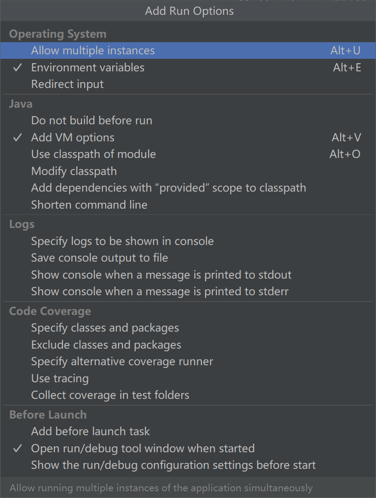

## 代理模式


### 参考

- https://javaguide.cn/java/basis/proxy.html


### 静态代理

当我创建一个类`AA`实现一个接口`A`时，我并不直接使用这个实现，而是再实现一个类`AB`，这个类样实现了接口`A`，同时，`AB`持有`AA`，也就是将`AA`的实例作为其属性之一，这样就完成了简单的静态代理。在调用`A`接口的方法时，提供了充足的空间，可以做预处理和后续处理。


#### 代码

```java
public interface SmsService {
    String send(String message);
}
```

```java
public class SmsServiceImpl implements SmsService {
    public String send(String message) {
        System.out.println("send message:" + message);
        return message;
    }
}
```

```java
public class SmsProxy implements SmsService {

    private final SmsService smsService;

    public SmsProxy(SmsService smsService) {
        this.smsService = smsService;
    }

    @Override
    public String send(String message) {
        //调用方法之前，我们可以添加自己的操作
        System.out.println("before method send()");
        smsService.send(message);
        //调用方法之后，我们同样可以添加自己的操作
        System.out.println("after method send()");
        return null;
    }
}
```

```java
public class Main {
    public static void main(String[] args) {
        SmsService smsService = new SmsServiceImpl();
        SmsProxy smsProxy = new SmsProxy(smsService);
        smsProxy.send("java");
    }
}
```

运行后输出：

```shell
before method send()
send message:java
after method send()
```


但是，这种方法有个不足之处，当我想要修改接口`A`时，我需要递归地去修改`AB`和`AA`，这会让开发陷入灾难。


### 动态代理

相比于静态代理来说，动态代理更加灵活。我们不需要针对每个目标类都单独创建一个代理类，并且也不需要我们必须实现接口，我们可以直接**代理实现类**（*CGLIB 动态代理机制*）。

- **从 JVM 角度来说，动态代理是在运行时动态生成类字节码，并加载到 JVM 中的。**
- 就 Java 来说，动态代理的实现方式有很多种，比如：
  1.  **JDK 动态代理**
  2. **CGLIB 动态代理**
  3. ...


#### JDK动态代理机制

在 Java 动态代理机制中 `InvocationHandler` 接口和 `Proxy` 类是核心。

使用`Proxy`和`InvocationHandler.newProxyInstance`生成代理对象：

```java
public static Object newProxyInstance(ClassLoader loader, Class<?>[] interfaces, InvocationHandler h) {
    Objects.requireNonNull(h);
    final Class<?> caller = System.getSecurityManager() == null
        ? null
        : Reflection.getCallerClass();
    // Look up or generate the designated proxy class and its constructor.
    Constructor<?> cons = getProxyConstructor(caller, loader, interfaces);
    return newProxyInstance(caller, cons, h);
}
```

这个方法一共有 3 个参数：

1. **loader** ：类加载器，用于加载代理对象。
2. **interfaces** ：被代理类实现的一些接口；
3. **h** ：实现了 `InvocationHandler` 接口的对象；

要实现动态代理的话，还必须需要实现`InvocationHandler` 来自定义处理逻辑。 当我们的动态代理对象调用一个方法时，这个方法的调用就会被转发到实现`InvocationHandler` 接口类的 `invoke` 方法来调用。

```java
public interface InvocationHandler {
	public Object invoke(Object proxy, Method method, Object[] args) throws Throwable;
 	public static Object invokeDefault(Object proxy, Method method, Object... args) throws Throwable {
        ...
    }
}
```

`invoke()` 方法有下面三个参数：

1. **proxy** ：动态生成的代理类
2. **method** ：与代理类对象调用的方法相对应
3. **args** ：当前 method 方法的参数

也就是说：**你通过`Proxy` 类的 `newProxyInstance()` 创建的代理对象在调用方法的时候，实际会调用到实现`InvocationHandler` 接口的类的 `invoke()`方法。** 你可以在 `invoke()` 方法中自定义处理逻辑，比如在方法执行前后做什么事情。


##### 使用

定义一个接口及其实现类；

自定义 `InvocationHandler` 并重写`invoke`方法，在 `invoke` 方法中我们会调用原生方法（被代理类的方法）并自定义一些处理逻辑；

通过 `Proxy.newProxyInstance(ClassLoader loader,Class<?>[] interfaces,InvocationHandler h)` 方法创建代理对象；


##### 代码

`SmsService`接口和`SmsServiceImpl`实现仍采用静态代理内的代码。我们只关注`Proxy`这一部分。

首先定义一个JDK动态代理类：

```java
import java.lang.reflect.InvocationHandler;
import java.lang.reflect.InvocationTargetException;
import java.lang.reflect.Method;

public class DebugInvocationHandler implements InvocationHandler {
    /**
     * 代理类中的真实对象
     */
    private final Object target;

    public DebugInvocationHandler(Object target) {
        this.target = target;
    }

    public Object invoke(Object proxy, Method method, Object[] args) throws InvocationTargetException, IllegalAccessException {
        //调用方法之前，我们可以添加自己的操作
        System.out.println("before method " + method.getName());
        Object result = method.invoke(target, args);
        //调用方法之后，我们同样可以添加自己的操作
        System.out.println("after method " + method.getName());
        return result;
    }
}
```

`invoke()` 方法: 当我们的动态代理对象调用原生方法的时候，最终实际上调用到的是 `invoke()` 方法，然后 `invoke()` 方法代替我们去调用了被代理对象的原生方法。

然后去获取代理对象的工厂类：

```java
public class JdkProxyFactory {
    public static Object getProxy(Object target) {
        return Proxy.newProxyInstance(
                target.getClass().getClassLoader(), // 目标类的类加载
                target.getClass().getInterfaces(),  // 代理需要实现的接口，可指定多个
                new DebugInvocationHandler(target)   // 代理对象对应的自定义 InvocationHandler
        );
    }
}
```

实际使用：

```java
SmsService smsService = (SmsService) JdkProxyFactory.getProxy(new SmsServiceImpl());
smsService.send("java");
```

运行上述代码之后，控制台打印出：

```shell
before method send
send message:java
after method send
```


#### CGLIB动态代理机制

[CGLIB](https://github.com/cglib/cglib)（Code Generation Library）是一个基于[ASM](http://www.baeldung.com/java-asm)的字节码生成库，它允许我们在运行时对字节码进行修改和动态生成。CGLIB 通过继承方式实现代理。很多知名的开源框架都使用到了[CGLIB](https://github.com/cglib/cglib)， 例如 Spring 中的 AOP 模块中：如果目标对象实现了接口，则默认采用 JDK 动态代理，否则采用 CGLIB 动态代理。

**在 CGLIB 动态代理机制中 `MethodInterceptor` 接口和 `Enhancer` 类是核心。**

不同于 JDK 动态代理不需要额外的依赖。[CGLIB](https://github.com/cglib/cglib)（Code Generation Library） 实际是属于一个开源项目，如果你要使用它的话，需要手动添加相关依赖。

```xml
<dependency>
  <groupId>cglib</groupId>
  <artifactId>cglib</artifactId>
  <version>3.3.0</version>
</dependency>
```

你需要自定义 `MethodInterceptor` 并重写 `intercept` 方法，`intercept` 用于拦截增强被代理类的方法。

```java
public interface MethodInterceptor extends Callback{
    // 拦截被代理类中的方法
    public Object intercept(Object obj, java.lang.reflect.Method method, Object[] args,MethodProxy proxy) throws Throwable;
}
```

1. **obj** : 被代理的对象（需要增强的对象）
2. **method** : 被拦截的方法（需要增强的方法）
3. **args** : 方法入参
4. **proxy** : 用于调用原始方法

你可以通过 `Enhancer`类来动态获取被代理类，当代理类调用方法的时候，实际调用的是 `MethodInterceptor` 中的 `intercept` 方法。


##### 使用

定义一个类；

自定义 `MethodInterceptor` 并重写 `intercept` 方法，`intercept` 用于拦截增强被代理类的方法，和 JDK 动态代理中的 `invoke` 方法类似；

通过 `Enhancer` 类的 `create()`创建代理类；


##### 代码

实现一个需要被代理的类：

```java
package github.javaguide.dynamicProxy.cglibDynamicProxy;

public class AliSmsService {
    public String send(String message) {
        System.out.println("send message:" + message);
        return message;
    }
}
```

自定义`MethodInterceptor`的方法拦截器：

```java
import net.sf.cglib.proxy.MethodInterceptor;
import net.sf.cglib.proxy.MethodProxy;

import java.lang.reflect.Method;

/**
 * 自定义MethodInterceptor
 */
public class DebugMethodInterceptor implements MethodInterceptor {
    /**
     * @param o           被代理的对象（需要增强的对象）
     * @param method      被拦截的方法（需要增强的方法）
     * @param args        方法入参
     * @param methodProxy 用于调用原始方法
     */
    @Override
    public Object intercept(Object o, Method method, Object[] args, MethodProxy methodProxy) throws Throwable {
        //调用方法之前，我们可以添加自己的操作
        System.out.println("before method " + method.getName());
        Object object = methodProxy.invokeSuper(o, args);
        //调用方法之后，我们同样可以添加自己的操作
        System.out.println("after method " + method.getName());
        return object;
    }
}
```

获取代理类：

```java
import net.sf.cglib.proxy.Enhancer;

public class CglibProxyFactory {

    public static Object getProxy(Class<?> clazz) {
        // 创建动态代理增强类
        Enhancer enhancer = new Enhancer();
        // 设置类加载器
        enhancer.setClassLoader(clazz.getClassLoader());
        // 设置被代理类
        enhancer.setSuperclass(clazz);
        // 设置方法拦截器
        enhancer.setCallback(new DebugMethodInterceptor());
        // 创建代理类
        return enhancer.create();
    }
}
```

实际使用：

```java
AliSmsService aliSmsService = (AliSmsService) CglibProxyFactory.getProxy(AliSmsService.class);
aliSmsService.send("java");
```

运行：

```shell
before method send
send message:java
after method send
```


##### 坑

当你采用JDK 9或者以上版本时，会发现有Java安全的报错，由于提升了安全性，我们并不能如此直接利用反射拦截并代理了，那如何保证运行？

我们需要使用如下命令来绕过：

```shell
java --add-opens java.base/java.lang=ALL-UNNAMED
```

在IDE IDEA中，我们需要找到`Run/Debug Configurations`：


在`Modifiy options`中选择`Add VM options`，然后填入`--add-opens java.base/java.lang=ALL-UNNAMED`即可。




#### JDK和CGLIB对比

**JDK 动态代理只能代理实现了接口的类或者直接代理接口，而 CGLIB 可以代理未实现任何接口的类。** 另外， CGLIB 动态代理是通过生成一个被代理类的子类来拦截被代理类的方法调用，因此不能代理声明为 final 类型的类和方法。

就二者的效率来说，大部分情况都是 JDK 动态代理更优秀，随着 JDK 版本的升级，这个优势更加明显。


### 静态代理和动态代理对比

**灵活性** ：动态代理更加灵活，不需要必须实现接口，可以直接代理实现类，并且可以不需要针对每个目标类都创建一个代理类。另外，静态代理中，接口一旦新增加方法，目标对象和代理对象都要进行修改，这是非常麻烦的！

**JVM 层面** ：静态代理在编译时就将接口、实现类、代理类这些都变成了一个个实际的 class 文件。而动态代理是在运行时动态生成类字节码，并加载到 JVM 中的。