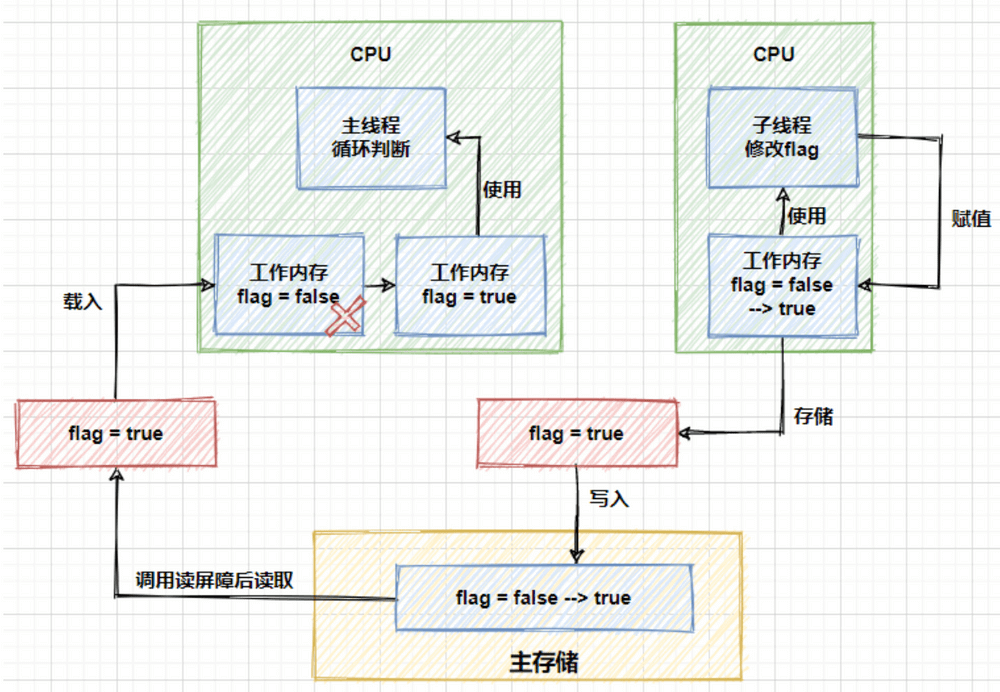

## Unsafe


### 简介

- `Unsafe` 是位于 `sun.misc` 包下的一个类，主要提供一些**用于执行低级别、不安全操作的方法**，如直接访问系统内存资源、自主管理内存资源等，这些方法在提升 Java 运行效率、增强 Java 语言底层资源操作能力方面起到了很大的作用。
- 由于 `Unsafe` 类使 Java 语言拥有了类似 C 语言指针一样操作内存空间的能力，这无疑也增加了程序发生相关指针问题的风险。
- `Unsafe` 提供的这些功能的实现需要依赖本地方法（Native Method）。你可以将本地方法看作是 Java 中使用其他编程语言编写的方法。本地方法使用 **`native`** 关键字修饰，Java 代码中只是声明方法头，具体的实现则交给 **本地代码**。


### 创建

`sun.misc.Unsafe` 部分源码如下：

```java
public final class Unsafe {
    // 单例对象
    private static final Unsafe theUnsafe;
    ......
        private Unsafe() {
    }
    @CallerSensitive
    public static Unsafe getUnsafe() {
        Class var0 = Reflection.getCallerClass();
        // 仅在引导类加载器`BootstrapClassLoader`加载时才合法
        if(!VM.isSystemDomainLoader(var0.getClassLoader())) {
            throw new SecurityException("Unsafe");
        } else {
            return theUnsafe;
        }
    }
}
```

`Unsafe` 类为一单例实现，提供静态方法 `getUnsafe` 获取 `Unsafe`实例。这个看上去貌似可以用来获取 `Unsafe` 实例。但是，当我们直接调用这个静态方法的时候，会抛出 `SecurityException` 异常：

```shell
Exception in thread "main" java.lang.SecurityException: Unsafe
	at sun.misc.Unsafe.getUnsafe(Unsafe.java:90)
	at com.cn.test.GetUnsafeTest.main(GetUnsafeTest.java:12)
```

- `public static`方法无法被直接调用：
  - 这是因为在`getUnsafe`方法中，会对调用者的`classLoader`进行检查，判断当前类是否由`Bootstrap classLoader`加载，如果不是的话那么就会抛出一个`SecurityException`异常。也就是说，只有启动类加载器加载的类才能够调用 Unsafe 类中的方法，来防止这些方法在不可信的代码中被调用。
  - `Unsafe` 提供的功能过于底层（如直接访问系统内存资源、自主管理内存资源等），安全隐患也比较大，使用不当的话，很容易出现很严重的问题。
  
- 间接调用`Unsafe`的单例对象`theUnsafe`：

  ```java
  private static Unsafe reflectGetUnsafe() {
      try {
        Field field = Unsafe.class.getDeclaredField("theUnsafe");
        field.setAccessible(true);
        return (Unsafe) field.get(null);
      } catch (Exception e) {
        log.error(e.getMessage(), e);
        return null;
      }
  }
  ```

- 或者从命令行参数入手：从`getUnsafe`方法的使用限制条件出发，通过 Java 命令行命令`-Xbootclasspath/a`把调用 Unsafe 相关方法的类 A 所在 jar 包路径追加到默认的 bootstrap 路径中，使得 A 被引导类加载器加载，从而通过`Unsafe.getUnsafe`方法安全的获取 Unsafe 实例。

  ```shell
  java -Xbootclasspath/a: ${path}   // 其中path为调用Unsafe相关方法的类所在jar包路径
  ```

  

### 功能

概括的来说，`Unsafe` 类实现功能可以被分为下面 8 类：

1. 内存操作
2. 内存屏障
3. 对象操作
4. 数据操作
5. CAS 操作
6. 线程调度
7. Class 操作
8. 系统信息


#### 内存操作

`Unsafe`提供了以下接口操作内存：

```java
@ForceInline
public long allocateMemory(long bytes) {
    return theInternalUnsafe.allocateMemory(bytes);
}

@ForceInline
public long reallocateMemory(long address, long bytes) {
    return theInternalUnsafe.reallocateMemory(address, bytes);
}

@ForceInline
public void setMemory(Object o, long offset, long bytes, byte value) {
    theInternalUnsafe.setMemory(o, offset, bytes, value);
}

@ForceInline
public void setMemory(long address, long bytes, byte value) {
    theInternalUnsafe.setMemory(address, bytes, value);
}

@ForceInline
public void copyMemory(Object srcBase, long srcOffset,
                       Object destBase, long destOffset,
                       long bytes) {
    theInternalUnsafe.copyMemory(srcBase, srcOffset, destBase, destOffset, bytes);
}

@ForceInline
public void copyMemory(long srcAddress, long destAddress, long bytes) {
    theInternalUnsafe.copyMemory(srcAddress, destAddress, bytes);
}
@ForceInline
public void freeMemory(long address) {
    theInternalUnsafe.freeMemory(address);
}
```

虽然和教程里的有些许出入，但是底层都是调用的`native`声明的代码：

```java
private native long allocateMemory0(long bytes);
private native long reallocateMemory0(long address, long bytes);
private native void freeMemory0(long address);
private native void setMemory0(Object o, long offset, long bytes, byte value);
@IntrinsicCandidate
private native void copyMemory0(Object srcBase, long srcOffset, Object destBase, long destOffset, long bytes);
private native void copySwapMemory0(Object srcBase, long srcOffset, Object destBase, long destOffset, long bytes, long elemSize);
```

需要注意，通过这种方式分配的内存属于 堆外内存 ，是无法进行垃圾回收的，需要我们把这些内存当做一种资源去手动调用`freeMemory`方法进行释放，否则会产生内存泄漏。通用的操作内存方式是在`try`中执行对内存的操作，最终在`finally`块中进行内存的释放。


##### 为什么要用堆外内存？

1. 对垃圾回收停顿的改善。由于堆外内存是直接受操作系统管理而不是 JVM，所以当我们使用堆外内存时，即可保持较小的堆内内存规模。从而在 GC 时减少回收停顿对于应用的影响。
2. 提升程序 I/O 操作的性能。通常在 I/O 通信过程中，会存在堆内内存到堆外内存的数据拷贝操作，对于需要频繁进行内存间数据拷贝且生命周期较短的暂存数据，都建议存储到堆外内存。

###### 典型应用

`DirectByteBuffer` 是 Java 用于实现堆外内存的一个重要类，通常用在通信过程中做缓冲池，如在 Netty、MINA 等 NIO 框架中应用广泛。`DirectByteBuffer` 对于堆外内存的创建、使用、销毁等逻辑均由 Unsafe 提供的堆外内存 API 来实现。

下图为 `DirectByteBuffer` 构造函数，创建 `DirectByteBuffer` 的时候，通过 `Unsafe.allocateMemory` 分配内存、`Unsafe.setMemory` 进行内存初始化，而后构建 `Cleaner` 对象用于跟踪 `DirectByteBuffer` 对象的垃圾回收，以实现当 `DirectByteBuffer` 被垃圾回收时，分配的堆外内存一起被释放。


#### 内存屏障

在介绍内存屏障前，需要知道编译器和 CPU 会在保证程序输出结果一致的情况下，会对代码进行重排序，从指令优化角度提升性能。而指令重排序可能会带来一个不好的结果，导致 CPU 的高速缓存和内存中数据的不一致，而内存屏障（`Memory Barrier`）就是通过阻止屏障两边的指令重排序从而避免编译器和硬件的不正确优化情况。

在硬件层面上，内存屏障是 CPU 为了防止代码进行重排序而提供的指令，不同的硬件平台上实现内存屏障的方法可能并不相同。在 Java8 中，引入了 3 个内存屏障的函数，它屏蔽了操作系统底层的差异，允许在代码中定义、并统一由 JVM 来生成内存屏障指令，来实现内存屏障的功能。

```java
//内存屏障，禁止load操作重排序。屏障前的load操作不能被重排序到屏障后，屏障后的load操作不能被重排序到屏障前
public native void loadFence();
//内存屏障，禁止store操作重排序。屏障前的store操作不能被重排序到屏障后，屏障后的store操作不能被重排序到屏障前
public native void storeFence();
//内存屏障，禁止load、store操作重排序
public native void fullFence();
```

内存屏障可以看做对内存随机访问的操作中的一个同步点，使得此点之前的所有读写操作都执行后才可以开始执行此点之后的操作。以`loadFence`方法为例，它会禁止读操作重排序，保证在这个屏障之前的所有读操作都已经完成，并且将缓存数据设为无效，重新从主存中进行加载。

看到这估计很多小伙伴们会想到`volatile`关键字了，如果在字段上添加了`volatile`关键字，就能够实现字段在多线程下的可见性。基于读内存屏障，我们也能实现相同的功能。



了解 Java 内存模型（`JMM`）的小伙伴们应该清楚，运行中的线程不是直接读取主内存中的变量的，只能操作自己工作内存中的变量，然后同步到主内存中，并且线程的工作内存是不能共享的。上面的图中的流程就是子线程借助于主内存，将修改后的结果同步给了主线程，进而修改主线程中的工作空间，跳出循环。


##### 典型应用

在 Java 8 中引入了一种锁的新机制——`StampedLock`，它可以看成是读写锁的一个改进版本。`StampedLock` 提供了一种乐观读锁的实现，这种乐观读锁类似于无锁的操作，完全不会阻塞写线程获取写锁，从而缓解读多写少时写线程“饥饿”现象。由于 `StampedLock` 提供的乐观读锁不阻塞写线程获取读锁，当线程共享变量从主内存 load 到线程工作内存时，会存在数据不一致问题。

为了解决这个问题，`StampedLock` 的 `validate` 方法会通过 `Unsafe` 的 `loadFence` 方法加入一个 `load` 内存屏障。

```java
public boolean validate(long stamp) {
   U.loadFence();
   return (stamp & SBITS) == (state & SBITS);
}
```


#### 对象操作

对象成员属性的内存偏移量获取，以及字段属性值的修改，在上面的例子中我们已经测试过了。除了前面的`putInt`、`getInt`方法外，Unsafe 提供了全部 8 种基础数据类型以及`Object`的`put`和`get`方法，并且所有的`put`方法都可以越过访问权限，直接修改内存中的数据。阅读 openJDK 源码中的注释发现，基础数据类型和`Object`的读写稍有不同，基础数据类型是直接操作的属性值（`value`），而`Object`的操作则是基于引用值（`reference value`）。下面是`Object`的读写方法：

```java
//在对象的指定偏移地址获取一个对象引用
public native Object getObject(Object o, long offset);
//在对象指定偏移地址写入一个对象引用
public native void putObject(Object o, long offset, Object x);
```

除了对象属性的普通读写外，`Unsafe` 还提供了 **volatile 读写**和**有序写入**方法。`volatile`读写方法的覆盖范围与普通读写相同，包含了全部基础数据类型和`Object`类型，以`int`类型为例：

```java
//在对象的指定偏移地址处读取一个int值，支持volatile load语义
public native int getIntVolatile(Object o, long offset);
//在对象指定偏移地址处写入一个int，支持volatile store语义
public native void putIntVolatile(Object o, long offset, int x);
```

相对于普通读写来说，`volatile`读写具有更高的成本，因为它需要保证可见性和有序性。在执行`get`操作时，会强制从主存中获取属性值，在使用`put`方法设置属性值时，会强制将值更新到主存中，从而保证这些变更对其他线程是可见的。

有序写入的方法有以下三个：

```java
public native void putOrderedObject(Object o, long offset, Object x);
public native void putOrderedInt(Object o, long offset, int x);
public native void putOrderedLong(Object o, long offset, long x);
```

有序写入的成本相对`volatile`较低，因为它只保证写入时的有序性，而不保证可见性，也就是一个线程写入的值不能保证其他线程立即可见。为了解决这里的差异性，需要对内存屏障的知识点再进一步进行补充，首先需要了解两个指令的概念：

- `Load`：将主内存中的数据拷贝到处理器的缓存中
- `Store`：将处理器缓存的数据刷新到主内存中

顺序写入与`volatile`写入的差别在于，在顺序写时加入的内存屏障类型为`StoreStore`类型，而在`volatile`写入时加入的内存屏障是`StoreLoad`类型，如下图所示：


在有序写入方法中，使用的是`StoreStore`屏障，该屏障确保`Store1`立刻刷新数据到内存，这一操作先于`Store2`以及后续的存储指令操作。而在`volatile`写入中，使用的是`StoreLoad`屏障，该屏障确保`Store1`立刻刷新数据到内存，这一操作先于`Load2`及后续的装载指令，并且，`StoreLoad`屏障会使该屏障之前的所有内存访问指令，包括存储指令和访问指令全部完成之后，才执行该屏障之后的内存访问指令。

综上所述，在上面的三类写入方法中，在写入效率方面，按照`put`、`putOrder`、`putVolatile`的顺序效率逐渐降低。


##### 对象实例化

1. **常规对象实例化方式**：我们通常所用到的创建对象的方式，从本质上来讲，都是通过 new 机制来实现对象的创建。但是，new 机制有个特点就是当类只提供有参的构造函数且无显示声明无参构造函数时，则必须使用有参构造函数进行对象构造，而使用有参构造函数时，必须传递相应个数的参数才能完成对象实例化。
2. **非常规的实例化方式**：而 Unsafe 中提供 allocateInstance 方法，仅通过 Class 对象就可以创建此类的实例对象，而且不需要调用其构造函数、初始化代码、JVM 安全检查等。它抑制修饰符检测，也就是即使构造器是 private 修饰的也能通过此方法实例化，只需提类对象即可创建相应的对象。由于这种特性，allocateInstance 在 java.lang.invoke、Objenesis（提供绕过类构造器的对象生成方式）、Gson（反序列化时用到）中都有相应的应用。


#### 数组操作

```java
//返回数组中第一个元素的偏移地址
public native int arrayBaseOffset(Class<?> arrayClass);
//返回数组中一个元素占用的大小
public native int arrayIndexScale(Class<?> arrayClass);
```


##### 典型应用

这两个与数据操作相关的方法，在 `java.util.concurrent.atomic` 包下的 `AtomicIntegerArray`（可以实现对 `Integer` 数组中每个元素的原子性操作）中有典型的应用，如下图 `AtomicIntegerArray` 源码所示，通过 `Unsafe` 的 `arrayBaseOffset` 、`arrayIndexScale` 分别获取数组首元素的偏移地址 `base` 及单个元素大小因子 `scale` 。后续相关原子性操作，均依赖于这两个值进行数组中元素的定位，如下图二所示的 `getAndAdd` 方法即通过 `checkedByteOffset` 方法获取某数组元素的偏移地址，而后通过 CAS 实现原子性操作。


#### CAS操作

```java
/**
	*  CAS
  * @param o         包含要修改field的对象
  * @param offset    对象中某field的偏移量
  * @param expected  期望值
  * @param update    更新值
  * @return          true | false
  */
public final native boolean compareAndSwapObject(Object o, long offset,  Object expected, Object update);

public final native boolean compareAndSwapInt(Object o, long offset, int expected,int update);

public final native boolean compareAndSwapLong(Object o, long offset, long expected, long update);
```

**什么是 CAS?** CAS 即比较并替换（Compare And Swap)，是实现并发算法时常用到的一种技术。CAS 操作包含三个操作数——内存位置、预期原值及新值。执行 CAS 操作的时候，将内存位置的值与预期原值比较，如果相匹配，那么处理器会自动将该位置值更新为新值，否则，处理器不做任何操作。我们都知道，CAS 是一条 CPU 的原子指令（cmpxchg 指令），不会造成所谓的数据不一致问题，`Unsafe` 提供的 CAS 方法（如 `compareAndSwapXXX`）底层实现即为 CPU 指令 `cmpxchg` 。


###### 典型应用

在 JUC 包的并发工具类中大量地使用了 CAS 操作，像在前面介绍`synchronized`和`AQS`的文章中也多次提到了 CAS，其作为乐观锁在并发工具类中广泛发挥了作用。在 `Unsafe` 类中，提供了`compareAndSwapObject`、`compareAndSwapInt`、`compareAndSwapLong`方法来实现的对`Object`、`int`、`long`类型的 CAS 操作。以`compareAndSwapInt`方法为例：

```java
public final native boolean compareAndSwapInt(Object o, long offset,int expected,int x);
```


#### 线程调度

`Unsafe` 类中提供了`park`、`unpark`、`monitorEnter`、`monitorExit`、`tryMonitorEnter`方法进行线程调度。

```java
//取消阻塞线程
public native void unpark(Object thread);
//阻塞线程
public native void park(boolean isAbsolute, long time);
//获得对象锁（可重入锁）
@Deprecated
public native void monitorEnter(Object o);
//释放对象锁
@Deprecated
public native void monitorExit(Object o);
//尝试获取对象锁
@Deprecated
public native boolean tryMonitorEnter(Object o);
```

方法 `park`、`unpark` 即可实现线程的挂起与恢复，将一个线程进行挂起是通过 `park` 方法实现的，调用 `park` 方法后，线程将一直阻塞直到超时或者中断等条件出现；`unpark` 可以终止一个挂起的线程，使其恢复正常。

此外，`Unsafe` 源码中`monitor`相关的三个方法已经被标记为`deprecated`，不建议被使用：

```java
//获得对象锁
@Deprecated
public native void monitorEnter(Object var1);
//释放对象锁
@Deprecated
public native void monitorExit(Object var1);
//尝试获得对象锁
@Deprecated
public native boolean tryMonitorEnter(Object var1);
```

`monitorEnter`方法用于获得对象锁，`monitorExit`用于释放对象锁，如果对一个没有被`monitorEnter`加锁的对象执行此方法，会抛出`IllegalMonitorStateException`异常。`tryMonitorEnter`方法尝试获取对象锁，如果成功则返回`true`，反之返回`false`。


#### Class操作

`Unsafe` 对`Class`的相关操作主要包括类加载和静态变量的操作方法。

```java
//获取静态属性的偏移量
public native long staticFieldOffset(Field f);
//获取静态属性的对象指针
public native Object staticFieldBase(Field f);
//判断类是否需要实例化（用于获取类的静态属性前进行检测）
public native boolean shouldBeInitialized(Class<?> c);
```


#### 系统信息
