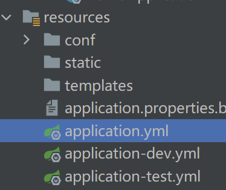

## SpringBoot 基础


### 简介

Spring Boot 是目前流行的微服务框架，倡导**约定优先于配置**。其目的是用来简化新Spring 应用的初始化搭建以及开发过程。 Spring Boot提供了很多核心的功 能，比如自动化配置 `starter`（启动器）简化Maven配置、内嵌 Servlet 容器、应用监控等功能， 让我们可以快速构建企业级应用程序。


### 特性

1. 创建独立的 Spring 应用程序。
2. 嵌入式 Tomcat、 Jetty、 Undertow 容器（jar）
3. 提供的 starters 简化构建配置（简化依赖管理和版本控制）
4. 尽可能自动配置 spring 应用和第三方库
5. 提供生产指标,例如指标、健壮检查和外部化配置
6. 没有代码生成，无需 XML 配置

SpringBoot 同时提供 “**开箱即用**”，“**约定优于配置**”的特性。

- **开箱即用**：Spring Boot 应用无需从 0 开始，使用脚手架创建项目。基础配置已经完成。集成大部分第三方库对象，无需配置就能使用。例如在 Spring Boot 项目中使用 MyBatis。可以直接使用 `XXXMapper` 对象，调用方法执行 sql 语句。
- **约定优于配置**：Spring Boot 定义了常用类，包的位置和结构，默认的设置。代码不需要做调整，项目能够按照预期运行。比如启动类在根包的路径下，使用了`@SpringBooApplication` 注解。创建了默认的测试类。`controller`，`service`，`dao` 应该放在根包的子包中。`application` 为默认的配置文件。 脚手架（spring 提供的一个 web 应用，帮助开发人员，创建 springboot 项目）。


### Spring Boot 3.0 特性

SpringBoot3 中的重大变化：

1. JDK 最小 Java 17,能够支持 17-20
2. Spring Boot 3.0 已将所有底层依赖项从 Java EE 迁移到了 Jakarta EE API。原来 `javax` 开头的包名，修改为 `jakarta` 。 例如 `jakarta.servlet.http.HttpServlet` 原来 `javax.servlet.http.HttpServlet`。
3. 支持 GraalVM 原生镜像。将 Java 应用编译为本机代码，提供显著的内存和启动性能改进。
4. 对第三方库，更新了版本支持。
5. 自动配置文件的修改。
6. 提供新的声明式 Http 服务，在接口方法上声明 `@HttpExchange` 获取 http 远程访问的能力。代替 `OpenFeign`
7. Spring HTTP 客户端提供基于 `Micrometer` 的可观察性，跟踪服务，记录服务运行状态等
8. AOT（预先编译） 支持 Ahead Of Time，指运行前编译
9. Servlet6.0 规范
10. 支持 Jackson 2.14
11. Spring MVC：默认情况下使用的 `PathPatternParser`。删除过时的文件和 `FreeMarker` 、`JSP` 支持。


### Spring Boot 脚手架

脚手架辅助创建程序的工具，`Spring Initializr` 是创建 Spring Boot 项目的脚手架。快速建立Spring Boot 项目的最好方式。他是一个 web 应用，能够在浏览器中使用。IDEA 中继承了此工具，用来快速创建Spring Boot 项目以及 Spring Cloud 项目。

-  `Spring Initializr` 脚手架的 web 地址： https://start.spring.io/
- 阿里云脚手架：https://start.aliyun.com/


### 整体结构

#### 单一模块

- `XXXApplication` 启动类
- `controller` 控制器包
  - `XXXController`
- `service` 业务层包
  - `inter` 业务层接口包
  - `impl` 接口实现包
- `repository` 持久层包
- `model` 模型包
  - `entity` 实体类包
  - `dto` 数据传输包
  - `vo` 视图数据包

#### 多模块

- `module1`
  - （单模块中有的）
- `module2`
  - ...


### pom.xml 中的配置与描述


#### spring-boot-starter-parent

`pom.xml` 中的指定 `spring-boot-starter-parent` 作为坐标，表示继承 Spring Boot 提供的父项目。从 `spring-boot-starter-parent` 继承以获得合理的默认值和完整的依赖树，以便快速建立一个Spring Boot 项目。父项目提供以下功能： 

1. JDK 的基准版本，比如17
2. 源码使用 UTF-8 格式编码
3. 公共依赖的版本
4. 自动化的资源过滤：默认把 `src/main/resources` 目录下的文件进行资源打包
5. maven 的占位符为`@`
6. 对多个 Maven 插件做了默认配置，如 `maven-compile-plugin`，`maven-jar-plugin`

```xml
<properties>
    <java.version>17</java.version>
    <resource.delimiter>@</resource.delimiter>
    <maven.compiler.source>${java.version}</maven.compiler.source>
    <maven.compiler.target>${java.version}</maven.compiler.target>
    <project.build.sourceEncoding>UTF-8</project.build.sourceEncoding>
    <project.reporting.outputEncoding>UTF-8</project.reporting.outputEncoding>
</properties>
```


#### starter

```xml
<!-- 
	带有 starter 单词的叫做启动器（启动依赖）
	spring-boot-starter-xxx : spring官方启动器
 	xxx-starter				: 非spring推出的第三方提供
-->
<dependencies>
    <dependency>
        <groupId>org.springframework.boot</groupId>
        <artifactId>spring-boot-starter-web</artifactId>
    </dependency>

    <dependency>
        <groupId>org.projectlombok</groupId>
        <artifactId>lombok</artifactId>
        <optional>true</optional>
    </dependency>
    <dependency>
        <groupId>org.springframework.boot</groupId>
        <artifactId>spring-boot-starter-test</artifactId>
        <scope>test</scope>
    </dependency>
</dependencies>
```

`starter` 是一组依赖描述，应用中包含 `starter`，可以获取 spring 相关技术的一站式的依赖和版本。不必复制、粘粘代码。通过 `starter` 能够快速启动并运行项目。`starter` 包含：

- 依赖坐标、版本
- 传递依赖的坐标、版本
- 配置类，配置项

例如加入 `spring-web` 依赖：

```xml
<dependency>
    <groupId>org.springframework.boot</groupId>
    <artifactId>spring-boot-starter-web</artifactId>
</dependency>
```


在`Maven: org.springframework.boot:spring-boot-autoconfigure:3.0.6`下有个`org.springframework.boot.autoconfigure`包，中间有个`web`包下有**配置类**（`WebProperties`）：

```java
@ConfigurationProperties("spring.web")
public class WebProperties {
    private Locale locale;
    private LocaleResolver localeResolver;
    private final Resources resources;
    ...
}
```


#### 自定义父项目

`pom.xml` 不继承，单独加入 `spring-boot-dependencies` 依赖。好处就是**自定义父项目**，可以自定义其他内容（当然，不如默认）。

```xml
<dependencyManagement>
    <dependencies>
        <dependency>
            <groupId>org.springframework.boot</groupId>
            <artifactId>spring-boot-dependencies</artifactId>
            <version>3.0.1</version>
            <type>pom</type>
            <scope>import</scope>
        </dependency>
	</dependencies>
</dependencyManagement>
```


### 自动装配


#### @SpringBootApplication

```java
@SpringBootApplication
public class DemoApplication {

    public static void main(String[] args) {
        SpringApplication.run(DemoApplication.class, args);
    }
}
```

`@SpringBootApplication`是一系列的注释的嵌套，主要包含以下三个主要功能注释：

```java
@SpringBootConfiguration
@EnableAutoConfiguration
@ComponentScan(
    excludeFilters = {@Filter(
    type = FilterType.CUSTOM,
    classes = {TypeExcludeFilter.class}
), @Filter(
    type = FilterType.CUSTOM,
    classes = {AutoConfigurationExcludeFilter.class}
)}
)
```


#### @SpringBootConfiguration

```java
@Target({ElementType.TYPE})
@Retention(RetentionPolicy.RUNTIME)
@Documented
@Configuration
@Indexed
public @interface SpringBootConfiguration {
    @AliasFor(
        annotation = Configuration.class
    )
    boolean proxyBeanMethods() default true;
}
```

- `@SpringBootConfiguration`包含了`@Configuration`注解的功能，有其标注的类是**配置类**：
  - `@Configuration`：`JavaConfig`的功能，配置类，结合`@Bean`能将对象注入到spring的IoC容器中；

```java
public static void main(String[] args) {
    SpringApplication.run(DemoApplication.class, args);
}
```

`run`方法需要指定启动的**源**——**配置类**。


#### @EnableAutoConfiguration

```java
@Target({ElementType.TYPE})
@Retention(RetentionPolicy.RUNTIME)
@Documented
@Inherited
@AutoConfigurationPackage
@Import({AutoConfigurationImportSelector.class})
public @interface EnableAutoConfiguration {
    String ENABLED_OVERRIDE_PROPERTY = "spring.boot.enableautoconfiguration";

    Class<?>[] exclude() default {};

    String[] excludeName() default {};
}
```

- `@EnableAutoConfiguration`开启自动配置，将spring和其第三方库中的对象创建好，注入到spring容器中，避免写过多的xml配置，去掉样例代码，需要使用对象由框架提供。


#### @ComponentScan

```java
@ComponentScan(
    excludeFilters = {@Filter(
    type = FilterType.CUSTOM,
    classes = {TypeExcludeFilter.class}
), @Filter(
    type = FilterType.CUSTOM,
    classes = {AutoConfigurationExcludeFilter.class}
)}
)
```

- `@ComponentScan`是组件扫描器，替代`<context:component-scan base-package="xxx">`来扫描`@Controller`，`@Service`，`@Repository`和`@Component`注解，创建对象并注入到容器中。

  SpringBoot约定：启动类最为扫描包的起点（根包），使用`@ComponentScan`扫描。

```java
public ConfigurableApplicationContext run(String... args) {
    long startTime = System.nanoTime();
    DefaultBootstrapContext bootstrapContext = this.createBootstrapContext();
    ConfigurableApplicationContext context = null;
    this.configureHeadlessProperty();
    SpringApplicationRunListeners listeners = this.getRunListeners(args);
    listeners.starting(bootstrapContext, this.mainApplicationClass);

    try {
        ApplicationArguments applicationArguments = new DefaultApplicationArguments(args);
        ConfigurableEnvironment environment = this.prepareEnvironment(listeners, bootstrapContext, applicationArguments);
        Banner printedBanner = this.printBanner(environment);
        context = this.createApplicationContext();
        context.setApplicationStartup(this.applicationStartup);
        this.prepareContext(bootstrapContext, context, environment, listeners, applicationArguments, printedBanner);
        this.refreshContext(context);
        this.afterRefresh(context, applicationArguments);
        Duration timeTakenToStartup = Duration.ofNanos(System.nanoTime() - startTime);
        if (this.logStartupInfo) {
            (new StartupInfoLogger(this.mainApplicationClass)).logStarted(this.getApplicationLog(), timeTakenToStartup);
        }

        listeners.started(context, timeTakenToStartup);
        this.callRunners(context, applicationArguments);
    } catch (Throwable var12) {
        if (var12 instanceof AbandonedRunException) {
            throw var12;
        }

        this.handleRunFailure(context, var12, listeners);
        throw new IllegalStateException(var12);
    }

    try {
        if (context.isRunning()) {
            Duration timeTakenToReady = Duration.ofNanos(System.nanoTime() - startTime);
            listeners.ready(context, timeTakenToReady);
        }

        return context;
    } catch (Throwable var11) {
        if (var11 instanceof AbandonedRunException) {
            throw var11;
        } else {
            this.handleRunFailure(context, var11, (SpringApplicationRunListeners)null);
            throw new IllegalStateException(var11);
        }
    }
}
```

所以，我们可是使用spring里提到方法获取IoC容器里的`Bean`：

```java
@SpringBootApplication
public class DemoApplication {
    
    @Bean
    public Date myDate() {
        return new Date();
    }

    public static void main(String[] args) {
        // run方法第一参数是配置类（源），从这里加载bean，找到bean注入到容器中
        // run返回值是容器对象
        ApplicationContext ctx = SpringApplication.run(DemoApplication.class, args);
        // 从容器内获取对象
        Date d = ctx.getBean(Date.class);
    }
}
```


### 运行Spring Boot项目的方式

1. 开发工具中执行 `main` 方法；

2. Maven 插件；

   ```shell
   mvn spring-boot:run
   ```

3. 使用spring boot jar包启动：

   ```shell
   java -jar jar <文件路径>
   ```

   打包jar：

   ```xml
   <build>
       <!-- -->
       <finalName>demo</finalName>
   </build>
   ```

   运行`Maven clean`和`Maven package`：

   

   ```shell
   java -jar ./demo.jar
   ```

   运行成功。


#### jar文件之间的区别

| 项目               | spring boot jar                                              | normal jar                                           |
| ------------------ | ------------------------------------------------------------ | ---------------------------------------------------- |
| 目录               | `BOOT-INF`：应用的 class和依赖 jar <br />`META-INF`：清单 <br />`org.springframework.boot.loader`：`spring-boot-loader` 模块类 | `META-INF`：清单<br />class 的文件夹：jar 中的所有类 |
| BOOT-INF           | class：应用的类<br />lib：应用的依赖                         | 没有 BOOT-INF                                        |
| spring-boot-loader | 执行 jar 的 spring boot 类                                   | 没有此部分                                           |
| 可执行             | 能                                                           | 否（普通jar包也能执行）                              |


### 外部化配置

应用程序的三种配置方式（防止硬编码带来的灵活性降低）：

1. `properties`
2. `yaml`
3. 命令行参数


#### application 文件

Spring Boot 同时支持 `properties` 和 `yml` 格式的配置文件。 配置文件名称默认是`application`。我们可以使用`application.properties`，`application.yml`。

- `properties` 是 Java 中的常用的一种配置文件格式：

  ```properties
  key=value
  ```

  `key` 是唯一的，文件扩展名为 `.properties`

-  `yaml`（YAML Ain't Markup Language）也看做是 `yml`，是一种做配置文件的数据格式，基本的语法：

  ```yaml
  key: value
  ```

  `yml` 文件文件扩展名是 `yaml` 或 `yml`（常用）

spring boot 可以使用`application.properties`，`application.yml`。 读取配置文件的 `key` 值，注入到 `Bean` 的属性可用`@Value`，`@Value` 一次注入一个 `key` 的值。将多个 `key` 值绑定到 `Bean` 的多个属性要用到 `@ConfigurationProperties` 注解。


##### application.properties

`application.properties`：

```properties
app.name=GiannisChen
app.owner=GiannisChenNUAA
app.port=8080
```

`service`层：

```java
public interface TestService {
    void printConfigValue();
}
```

```java
@Service
public class TestServiceImpl implements TestService {

    @Value("${app.name}")
    private String name;

    @Value("${app.owner}")
    private String owner;

    // 带默认值的@Value
    @Value("${app.port:8008}")
    private Integer port;

    @Override
    public void printConfigValue() {
        System.out.printf("name: %s; owner: %s; port: %d\n", name, owner, port);
    }
}
```

`test`：

```java
@SpringBootTest
class DemoApplicationTests {

    @Autowired
    private TestService testService;

    @Test
    public void testPrint() {
        testService.printConfigValue();
    }
}
```

测试成功。


##### application.yml

扁平化处理：

```yaml
app:
  name: GiannisChen
  owner: nuaa
  port: 8080
```

依然按照上面的方法测试。


#### Environment

在代码中访问属性除了注解，Spring 提供了外部化配置的抽象对象 `Environment`。`Environment` 包含了几乎所有外部配置文件，环境变量，命令行参数等的所有`key`和 `value`。需要使用 `Environment` 的注入此对象，调用它的 `getProperty(String key)` 方法即可。

扩展`service`层：

```java
public interface TestService {
    void printConfigValue();

    void printConfigValueWithEnvironment();
}
```

```java
@Service
public class TestServiceImpl implements TestService {
    @Autowired
    private Environment environment;
    
    @Override
    public void printConfigValueWithEnvironment() {
        String name = environment.getProperty("app.name", "default");
        // key exists
        if (environment.containsProperty("app.owner")) {
            System.out.println("owner exists, owner: " +
                    environment.getProperty("app.owner"));
        }
        Integer port = environment.getProperty("app.port", Integer.class, 8008);
        System.out.printf("name: %s, port: %d\n", name, port);
    }
}
```

测试结果：

```shell
owner exists, owner: nuaa
name: GiannisChen, port: 8080
```


#### 多配置文件

大型集成的第三方框架，中间件比较多。每个框架的配置细节相对复杂。如果都将配置集中到一个`application`文件，导致文件内容多，不易于阅读。我们将每个框架独立一个配置文件，最后将多个文件集中到`application`。我们使用导入文件的功能。

例如：项目集成 `redis`和`mysql`，并独立拥有配置文件：

```yml
spring:
  datasource:
    url: jdbc:mysql://192.168.1.21/db?serverTime=Asia/Shanghai
    username: operation
    password: 114514
```

```yml
spring:
  data:
    redis:
      host: 114.5.1.4
      port: 1919
      password: 810
```


#### 多环境配置

`Spring Profiles` 表示环境，`Profiles` 有助于隔离应用程序配置，并使它们仅在某些环境中可用。常说**开发环境**，**测试环境**，**生产环境**等等。一个环境就是一组相关的配置数据， 支撑我们的应用在这些配置下运行。应用启动时指定适合的环境。

Spring Boot 规定环境文件的名称 `application-{profile}.properties(yml)`。其中 `profile` 为自定义的环境名称，推荐使用 `dev` 表示开发 ，`test` 表示测试。`prod` 表示生产，`feature` 表示特性。总是 `profile` 名称是自定义的。SpringBoot 会加载 `application` 以及 `application-{profile}` 两类文件，不是只单独加载 `application-{profile}`。



激活环境：

```yml
spring:
    config:
        #导入多个配置文件，“，”作为分隔符
        import: conf/db.yml,conf/redis.yml
    #激活环境，与 on-profile 名称保持一致
    profiles:
    	active: dev
```


### 绑定 Bean

`@Value` 绑定单个属性，当属性较多时不方便，Spring Boot 提供了另一种属性的方法。将多个配置项绑定到 `Bean` 的属性，提供强类型的 `Bean`，`Bean` 能够访问到配置数据。 基本原则：

- 标准的 Java `Bean` 有无参数构造方法，包含属性的访问器。
- 配合 `@ConfigurationProperties` 注解一起使用。
- `Bean` 的 `static` 属性不支持。

Spring Boot 自动配置中大量使用了绑定 `Bean` 与 `@ConfigurationProperties`，提供对框架的定制参数。项目中要使用的数据如果是可变的，推荐在 `yml` 或 `properties` 中提供，项目代码具有较大的灵活性。

`@ConfigurationProperties` 能够配置多个简单类型属性，同时支持 `Map`，`List`，数组类型，对属性还能验证基本格式。


#### 简单的属性绑定

```java
/*
* @ConfigrationProperties 表示使用Bean对象读取配置项
* prefix 表示公共的前缀
*/
@Data
@Configuration(proxyBeanMethods = false)
@ConfigurationProperties(prefix = "app")
public class AppConfig {

    private String name;
    private String owner;
    private Integer port;
}
```

- `@Configuration(proxyBeanMethods = false)`其中的`proxyBeanMethods`声明该类是否是代理类。考虑到此处并不需要代理类，所以直接设置为**否**。

  ```shell
  # after
  class edu.giannischen.demo.config.AppConfig
  
  # before SpringCGLIB proxy
  class edu.giannischen.demo.config.AppConfig$$SpringCGLIB$$0
  ```


#### 嵌套 Bean

```yaml
app:
  name: GiannisChen
  owner: nuaa
  port: 8080
  security:
    username: root
    password: 114514
```

类定义：

```java
@Data
@Configuration(proxyBeanMethods = false)
@ConfigurationProperties(prefix = "app")
public class AppConfig {

    private String name;
    private String owner;
    private Integer port;
    private SecurityConfig security;
}
```

```java
@Data
public class SecurityConfig {
    private String username;
    private String password;
}
```

> **坑**：
>
> - Spring Boot 严格按照属性名称进行递归配置读取，不然就给你返回`null`了，笑死根本没法手动指定，不过想想也对，都是反射来的。


#### 扫描注解

```java
@Data
//@Configuration(proxyBeanMethods = false)
@ConfigurationProperties(prefix = "app")
public class AppConfig {

    private String name;
    private String owner;
    private Integer port;
    private SecurityConfig security;
}
```

当我只配置了`@ConfigurationProperties`时，我可以通过另一个方法实现全局的配置类扫描，即：

- `@EnableConfigurationProperties`

  ```java
  @EnableConfigurationProperties({edu.giannischen.demo.config.AppConfig.class})
  @SpringBootApplication
  public class DemoApplication {
  
      public static void main(String[] args) {
          SpringApplication.run(DemoApplication.class, args);
      }
  }
  ```

  ```java
  public @interface EnableConfigurationProperties {
      String VALIDATOR_BEAN_NAME = "configurationPropertiesValidator";
  
      Class<?>[] value() default {};
  }
  ```

- `@ConfigurationPropertiesScan`

  ```java
  @ConfigurationPropertiesScan({"edu.giannischen.demo.config"})
  @SpringBootApplication
  public class DemoApplication {
  
      public static void main(String[] args) {
          SpringApplication.run(DemoApplication.class, args);
      }
  }
  ```

  ```java
  public @interface ConfigurationPropertiesScan {
      @AliasFor("basePackages")
      String[] value() default {};
  
      @AliasFor("value")
      String[] basePackages() default {};
  
      Class<?>[] basePackageClasses() default {};
  }
  ```


#### 处理第三方库对象

当我们没有`SecurityConfig`类的源码，同时又要处理配置的 Bean 并且赋值，我们可以使用`@ConfigurationProperties`来注解方法完成以上操作：（此时 `@ConfigurationProperties` 结合 `@Bean` 一起在方法上面使用）

```java
@Configuration
public class MyAppConfig {
    @ConfigurationProperties(prefix = "security")
    @Bean
    public SecurityConfig getSecurity() {
        return new SecurityConfig();
    }
}
```

```java
@Autowired
private SecurityConfig security;

@Test
public void testThird() {
    System.out.println(security);
}
```


#### 处理集合对象

`Map`，`List` 以及 `Array` 都能提供配置数据， 下面通过一个示例配置集合属性：

```java
@Data
@ConfigurationProperties("collection")
public class CollectionConfig {
    private List<MyServer> servers;
    private Map<String, User> users;
    private String[] names;
}
```

```java
@Data
public class MyServer {
    private String name;
    private String ip;
}
```

```java
@Data
public class User {
    private String name;
    private String sex;
    private Integer age;
}
```

配置文件：

```yaml
#集合以及数组
#List<String> names
names:
	- lisi

#List<MyServer> servers
servers:
    - 	title: 华北服务器
    	ip: 202.12.39.1
    - 	title: 西南服务器
    	ip: 106.90.23.229
    - 	title: 南方服务器
		ip: 100.21.56.23
#Map<String,User> users
users:
    user1:
	    name: 张三
    	sex: 男
    	age: 22
    user2:
        name: 李四
        sex: 男
        age: 26
```


#### 指定数据源文件

用`@PropertySource`指定加载的`properties`文件：

```java
@Configuration
@Data
@ConfigurationProperties(prefix = "group")
@PropertySource(value = "classpath:/group-info.properties")
public class Group {
    private String name;
    private String leader;
    private Integer members;
}
```


### 创建对象的三种方式

将对象注入到 Spring 容器，可以通过如下方式：

1. 传统的 XML 配置文件
2. Java Config 技术， `@Configuration` 与 `@Bean`
3. 创建对象的注解，`@Controller` ，`@Service` ， `@Repository` ，`@Component`

> Spring Boot 不建议使用 xml 文件的方式， 自动配置已经解决了大部分 xml 中的工作了。如果需要xml 提供bean的声明，`@ImportResource` 加载 xml 注册 Bean。