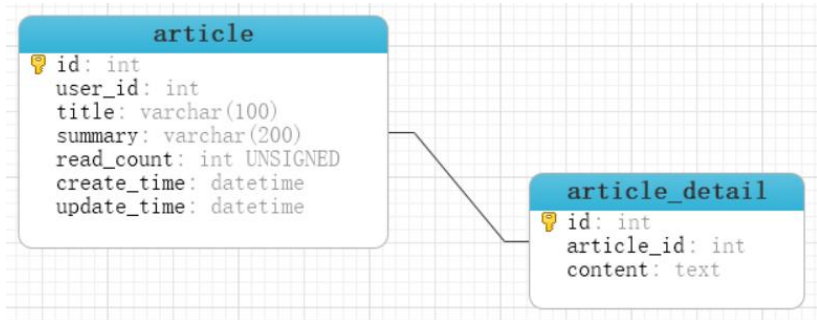

## SpringBoot 与数据库

Spring Boot 框架为 SQL 数据库提供了广泛的支持，既有用 `JdbcTemplate` 直接访问JDBC，同时支持 **object relational mapping**（ORM） 技术（如 `Hibernate`，`MyBatis`）。Spring Data 独立的项目提供对多种关系型和非关系型数据库的访问支持。比如 MySQL，Oracle，MongoDB，Redis，R2DBC，Apache Solr，Elasticsearch...


### DataSource

通常项目中使用 MySQL,Oracle,PostgreSQL 等大型关系数据库。Java 中的 jdbc 技术支持了多种关系型数据库的访问。

在代码中访问数据库，我们需要知道数据库程序所在的 ip，端口，访问数据库的用户名和密码以及数据库的类型信息。以上信息用来初始化数据源，数据源也就是 `DataSource`。数据源表示数据的来源，从某个ip上的数据库能够获取数据。`javax.sql.DataSource` 接口表示数据源，提供了标准的方法获取与数据库绑定的连接对象（`Connection`）。


```java
@AutoConfiguration(
    before = {SqlInitializationAutoConfiguration.class}
)
@ConditionalOnClass({DataSource.class, EmbeddedDatabaseType.class})
@ConditionalOnMissingBean(
    type = {"io.r2dbc.spi.ConnectionFactory"}
)
@EnableConfigurationProperties({DataSourceProperties.class})
@Import({DataSourcePoolMetadataProvidersConfiguration.class})
public class DataSourceAutoConfiguration {
	
}
```

```java
@ConfigurationProperties(prefix = "spring.datasource")
public class DataSourceProperties implements BeanClassLoaderAware, InitializingBean {
    private ClassLoader classLoader;
    private boolean generateUniqueName = true;
    private String name;
    private Class<? extends DataSource> type;
    private String driverClassName;
    private String url;
    private String username;
    private String password;
    private String jndiName;
    private EmbeddedDatabaseConnection embeddedDatabaseConnection;
    private Xa xa = new Xa();
    private String uniqueName;
}
```

Spring Boot 支持多种数据库连接池，优先使用 `HikariCP`，其次是 `Tomcat pooling`，再次是`Commons DBCP2`，如果以上都没有，最后会使用 `Oracle UCP` 连接池。当项目中 starter 依赖了 `spring-boot-starter-jdbc` 或者 `spring-boot-starter-data-jpa` 默认添加 `HikariCP` 连接池依赖，也就是默认使用 `HikariCP` 连接池。


### 轻量级：JdbcTemplate

```java
@AutoConfiguration(
    after = {DataSourceAutoConfiguration.class}
)
@ConditionalOnClass({DataSource.class, JdbcTemplate.class})
@ConditionalOnSingleCandidate(DataSource.class)
@EnableConfigurationProperties({JdbcProperties.class})
@Import({DatabaseInitializationDependencyConfigurer.class, JdbcTemplateConfiguration.class, NamedParameterJdbcTemplateConfiguration.class})
public class JdbcTemplateAutoConfiguration {
    public JdbcTemplateAutoConfiguration() {
    }
}
```


#### 准备环境

SpringBoot支持自动执行DDL，DML脚本，两个脚本的默认为`schema.sql`和`data.sql`。自动执行脚本还涉及到 `spring.sql.init.mode` 配置项：

- `always`：总是执行数据库初始化脚本。
- `never`：禁用数据库初始化。

`pom.xml`配置：

```xml
<dependency>
    <groupId>org.springframework.boot</groupId>
    <artifactId>spring-boot-starter-jdbc</artifactId>
</dependency>

<dependency>
    <groupId>com.mysql</groupId>
    <artifactId>mysql-connector-j</artifactId>
    <scope>runtime</scope>
</dependency>
```

`schema.sql`：

```sql
CREATE
    DATABASE IF NOT EXISTS `springboot`;

USE `springboot`;

CREATE TABLE IF NOT EXISTS `article`
(
    `id`          int(11)                   NOT NULL AUTO_INCREMENT COMMENT '主键',
    `user_id`     int(11)                   NOT NULL COMMENT '作者 ID',
    `title`       varchar(100)              NOT NULL COMMENT '文章标题',
    `summary`     varchar(200) DEFAULT NULL COMMENT '文章概要',
    `read_count`  int(11) unsigned zerofill NOT NULL COMMENT '阅读读数',
    `create_time` datetime                  NOT NULL COMMENT '创建时间',
    `update_time` datetime                  NOT NULL COMMENT '最后修改时间',
    PRIMARY KEY (`id`)
) ENGINE = InnoDB
  AUTO_INCREMENT = 1
  DEFAULT CHARSET = utf8mb4;
```

`data.sql`：

```sql
INSERT INTO `article`
VALUES ('1', '2101', 'SpringBoot 核心注解',
        '核心注解的主要作用', '00000008976', '2023-01-16 12:11:12', '2023-01-16 12:11:19');
INSERT INTO `article`
VALUES ('2', '356752', 'JVM 调优',
        'HotSpot 虚拟机详解', '00000000026', '2023-01-16 12:15:27', '2023-01-16 12:15:30');
```

`application.properties`：

```properties
spring.datasource.driver-class-name=com.mysql.cj.jdbc.Driver
spring.datasource.url=jdbc:mysql://localhost:3306?serverTimezone=Asia/Shanghai&useUnicode=true&characterEncoding=utf8&autoReconnect=true&useSSL=false
spring.datasource.username=root
spring.datasource.password=123456
#总是执行数据库脚本，以后设置为 never
spring.sql.init.mode=always
```


#### 访问 MySQL

`JdbcTemplate` 提供了丰富、实用的方法，归纳起来主要有以下几种类型的方法：

1. `execute` 方法：可以用于执行任何 SQL 语句，常用来执行 DDL 语句。
2. `update`、`batchUpdate` 方法：用于执行新增、修改与删除等语句。
3. `query` 和 `queryForXXX` 方法：用于执行查询相关的语句。 
4. `call` 方法：用于执行数据库存储过程和函数相关的语句。

固定`RowMapper`：

```java
@Test
void testBeanPropertyRowMapper() {
    List<ArticlePO> integers = jdbcTemplate.query("SELECT * FROM article",
                                                  new BeanPropertyRowMapper<>(ArticlePO.class));
    System.out.println(integers);
}
```

自定义RowMapper：（lambda）

```java
@Test
void testRowMapper() {
    List<ArticlePO> article = jdbcTemplate.query("SELECT * FROM article", (rs, rownum) -> {
        var id = rs.getInt("id");
        var userId = rs.getInt("user_id");
        var title = rs.getString("title");
        var summary = rs.getString("summary");
        var readCount = rs.getInt("read_count");
        var createTime = new Timestamp(rs.getTimestamp("create_time").getTime()).toLocalDateTime();
        var updateTime = new Timestamp(rs.getTimestamp("update_time").getTime()).toLocalDateTime();
        ArticlePO articlePO = new ArticlePO(id, userId, title, summary, readCount,
                                            createTime, updateTime);
        System.out.println("查询的文章 = " + articlePO);
        return articlePO;
    });
}
```


#### NamedParameterJdbcTemplate

`NamedParameterJdbcTemplate` 能够接受命名的参数，通过具名的参数提供代码的可读性，`JdbcTemplate`使用的是参数索引的方式。

 在使用模板的位置注入 `NamedParameterJdbcTemplate` 对象，编写 SQL 语句，在SQL 中`WHERE`部分`:命名参数`。调用 `NamedParameterJdbcTemplate` 的诸如 `query`，`queryForObject`，`execute`，`update` 等时，将参数封装到 `Map` 中。

```java
@Test
void testNameQuery() {
    // :参数名
    String sql="select count(*) as ct from article where user_id=:uidandread_count > :num";
    //key 是命名参数
    Map<String,Object> param = new HashMap<>();
    param.put("uid", 2101);
    param.put("num", 0);
    Long count = nameJdbcTemplate.queryForObject(sql, param, Long.class);System.out.println("用户被阅读的文章数量 = " + count);
}
```


### MyBatis

以 MyBatis 来自介绍 SpringBoot 集成 ORM 框架。

沿用上面的`ArticlePO`，增加`Mapper`层：

```java
public interface ArticleMapper {

    @Select(" SELECT * FROM `article` WHERE id = #{articleId} ")
    ArticlePO selectById(@Param("articleId") Integer id);
}
```

测试：

```java
@MapperScan(basePackages = "com.example.demo.model.mapper")
@SpringBootApplication
public class Demo1Application {

    public static void main(String[] args) {
		SpringApplication.run(Demo1Application.class, args);
    }
}
```

```java
@SpringBootTest
public class MyBatisTest {
    @Autowired
    private ArticleMapper articleMapper;

    @Test
    public void test1() {
        System.out.println(articleMapper.selectById(1));
    }
}
```

但是呢，查看结果：

```shell
ArticlePO(id=1, userId=null, title=SpringBoot 核心注解, summary=核心注解的主要作用, readCount=null, createTime=null, updateTime=null)
```

解决方案一（配置）：

```properties
# 配置MyBatis支持驼峰命名<-下划线
mybatis.configuration.map-underscore-to-camel-case=true
```

```shell
ArticlePO(id=1, userId=2101, title=SpringBoot 核心注解, summary=核心注解的主要作用, readCount=8976, createTime=2023-01-16T12:11:12, updateTime=2023-01-16T12:11:19)
```

解决方案二（`@Results`+`@ResultMap`）：

```java
public interface ArticleMapper {

    @Select(" SELECT * FROM `article` WHERE id = #{articleId} ")
    @Results({
            @Result(id = true, column = "id", property = "id"),
            @Result(column = "user_id", property = "userId"),
            @Result(column = "read_count", property = "readCount"),
            @Result(column = "create_time", property = "createTime"),
            @Result(column = "update_time", property = "updateTime"),
    })
    ArticlePO selectById(@Param("articleId") Integer id);
    
    // 复用@Results
    List<ArticlePO> selectList(Integer userId);
}
```

解决方案三（`xml`）：

```xml
<?xml version="1.0" encoding="UTF-8" ?>
    <!DOCTYPE mapper
    PUBLIC "-//mybatis.org//DTD Mapper 3.0//EN"
    "https://mybatis.org/dtd/mybatis-3-mapper.dtd">
    <mapper namespace="com.bjpowernode.orm.repository.ArticleDao">
    <resultMap id="ArticleMapper" type="com.bjpowernode.orm.po.ArticlePO"><id column="id" property="id"/>
    <result column="user_id" property="userId" />
    <result column="read_count" property="readCount" />
    <result column="create_time" property="createTime" />
    <result column="update_time" property="updateTime" />
    </resultMap>
</mapper>
```


#### SQL 提供者

MyBatis 提供了 **SQL 提供者**的功能。将 SQL 以方法的形式定义在单独的类中。 `Mapper` 接口通过引用**SQL提供者**中的方法名称，表示要执行的 SQL。

SQL 提供者有四类`@SelectProvider`，`@InsertProvider`，`@UpdateProvider`，`@DeleteProvider`。

```java
public class SqlProvider {
    public static String selectArticle() {
        return "select * from article where id = #{id}";
    }

    public static String updateTime() {
        return "update article set update_time=#{newTime} where id=#{id}";
    }
}
```

使用`XXXProvider`提供SQL：

```java
public interface ArticleMapper {

    ...

    @UpdateProvider(type = SqlProvider.class, method = "updateTime")
    int updateTime(Integer id, LocalDateTime newTime);
}
```


#### @One 一对一查询

MyBatis 支持一对一，一对多，多对多查询。XML 文件和注解都能实现关系的操作。我们使用注解表示 `article` 和 `article_detail` 的一对一关系。 MyBatis 维护这个关系， 开发人员自己也可以维护这种关系。



```java
@Data
@NoArgsConstructor
@AllArgsConstructor
public class Article {
    private Integer id;
    private Integer userId;
    private String title;
    private String summary;
    private Integer readCount;
    private LocalDateTime createTime;
    private LocalDateTime updateTime;
    private ArticleDetail articleDetail;
}
```

```java
@Data
@NoArgsConstructor
@AllArgsConstructor
public class ArticleDetail {
    private Integer id;
    private Integer articleId;
    private String content;
}
```

```SQL
CREATE TABLE IF NOT EXISTS `article_detail`
(
    `id`         int(11) NOT NULL AUTO_INCREMENT COMMENT '注解',
    `article_id` int(11) NOT NULL COMMENT '文章 ID',
    `content`    text    NOT NULL COMMENT '文章内容',
    PRIMARY KEY (`id`)
)
    ENGINE = InnoDB
    AUTO_INCREMENT = 1
    DEFAULT CHARSET = utf8mb4;
```

测试：

```java
@Autowired
private ArticleOneToOneMapper articleOneToOneMapper;
@Test
public void test5() {
    System.out.println(articleOneToOneMapper.queryAllArticle(1));
}
```


#### @Many 一对多查询

一对多查询使用 `@Many` 注解，步骤与一对一基本相同。

```java
@Data
@AllArgsConstructor
@NoArgsConstructor
public class Comment {
    private Integer id;
    private Integer articleId;
    private String comment;
}
```

```SQL
CREATE TABLE IF NOT EXISTS `article_comment`
(
    `id`         int(11) NOT NULL AUTO_INCREMENT COMMENT '注解',
    `article_id` int(11) NOT NULL COMMENT '文章 ID',
    `comment`    text    NOT NULL COMMENT '评论内容',
    PRIMARY KEY (`id`)
)
    ENGINE = InnoDB
    AUTO_INCREMENT = 1
    DEFAULT CHARSET = utf8mb4;
```

```java
public interface ArticleOneToManyMapper {
    @Select("""
            select id,article_id,content from article_detail
            where article_id = #{articleId}
            """)
    @Results({
            @Result(id = true, column = "id", property = "id"),
            @Result(column = "article_id", property = "articleId"),
            @Result(column = "content", property = "content")
    })
    ArticleDetail queryContent(Integer articleId);

    @Select("""
            select  
                id, 
                article_id, 
                comment 
            from article_comment where article_id = #{articleId}
            """)
    @Results({
            @Result(id = true, column = "id", property = "id"),
            @Result(column = "article_id", property = "articleId"),
            @Result(column = "comment", property = "comment")
    })
    List<Comment> queryCommentsById(Integer articleId);

    @Select("""
            select id,
            user_id,
            title,
            summary,
            read_count,
            create_time,
            update_time
            from article
            where id = #{id}
            """)
    @Results({
            @Result(id = true, column = "id", property = "id"),
            @Result(column = "user_id", property = "userId"),
            @Result(column = "read_count", property = "readCount"),
            @Result(column = "create_time", property = "createTime"),
            @Result(column = "update_time", property = "updateTime"),
            @Result(column = "id", property = "articleDetail",
                    one = @One(select =
                            "com.example.demo.model.mapper.ArticleOneToManyMapper.queryContent", fetchType = FetchType.LAZY)),
            @Result(column = "id", property = "comments", many = @Many(
                    select = "com.example.demo.model.mapper.ArticleOneToManyMapper.queryCommentsById", fetchType = FetchType.LAZY))
    })
    Article queryAllArticle(Integer id);
}
```

测试：

```java
@Autowired
private ArticleOneToManyMapper articleOneToManyMapper;

@Test
public void test6() {
    System.out.println(articleOneToManyMapper.queryAllArticle(1));
}
```


#### 自动配置类

```java
@ConditionalOnClass({SqlSessionFactory.class, SqlSessionFactoryBean.class})
@ConditionalOnSingleCandidate(DataSource.class)
@EnableConfigurationProperties({MybatisProperties.class})
@AutoConfigureAfter({DataSourceAutoConfiguration.class, MybatisLanguageDriverAutoConfiguration.class})
public class MybatisAutoConfiguration implements InitializingBean {
    private static final Logger logger = LoggerFactory.getLogger(MybatisAutoConfiguration.class);
    private final MybatisProperties properties;
    private final Interceptor[] interceptors;
    private final TypeHandler[] typeHandlers;
    private final LanguageDriver[] languageDrivers;
    private final ResourceLoader resourceLoader;
    private final DatabaseIdProvider databaseIdProvider;
    private final List<ConfigurationCustomizer> configurationCustomizers;
    private final List<SqlSessionFactoryBeanCustomizer> sqlSessionFactoryBeanCustomizers;
}
```

```java
@Bean
@ConditionalOnMissingBean
public SqlSessionFactory sqlSessionFactory(DataSource dataSource) throwsException{
	SqlSessionFactoryBean factory = new SqlSessionFactoryBean();
	factory.setDataSource(dataSource);
	....
}
@Bean
@ConditionalOnMissingBean
public SqlSessionTemplate sqlSessionTemplate(SqlSessionFactory sqlSessionFactory){
    ExecutorType executorType = this.properties.getExecutorType();
	return executorType != null ? new 		SqlSessionTemplate(sqlSessionFactory,executorType) : new 	SqlSessionTemplate(sqlSessionFactory);
}
```

`SqlSessionTemplate` 是线程安全的，MyBatis 为了与 Spring 继承。 提供的由 Spring 管理的Bean。这个`SqlSesionTemplate` 实现了 `SqlSession` 接口， 能够由 Spring 事务管理器使用。提供Spring 的事务处理。同时管理 `SqlSession` 的创建，销毁。


#### 常见配置

- 全部配置：https://mybatis.org/mybatis-3/zh/configuration.html#settings

```properties
#驼峰命名
mybatis.configuration.map-underscore-to-camel-case=true
#mapper xml 文件位置
mybatis.mapper-locations=classpath:/mappers/**/*.xml
#启用缓存
mybatis.configuration.cache-enabled=true
#延迟加载
mybatis.configuration.lazy-loading-enabled=true
#mybatis 主配置文件，按需使用
mybatis.config-location=classpath:/sql-config.xml
```

上述设置内容比较多时，可以将设置放到 MyBatis 主配置文件，`mybatis.config-location` 加载主配置文件：

```xml
<?xml version="1.0" encoding="UTF-8" ?>
<!DOCTYPE configuration
PUBLIC "-//mybatis.org//DTD Config 3.0//EN"
"https://mybatis.org/dtd/mybatis-3-config.dtd">
<configuration>
    <settings>
        <setting name="cacheEnabled" value="true"/>
        <setting name="lazyLoadingEnabled" value="true"/>
        <setting name="mapUnderscoreToCamelCase" value="true"/>
    </settings>
    
    <typeAliases>
    	<package name="com.bjpowernode.po"/>
    </typeAliases>
</configuration>
```


#### 连接池

- HikariCP 连接池 https://github.com/brettwooldridge/HikariCP/wiki 

- 连接池配置： https://github.com/brettwooldridge/HikariCP/wiki/About-Pool-Sizing 

- MySQL 连接池配置建议 https://github.com/brettwooldridge/HikariCP/wiki/MySQL-Configuration

部分配置：

- `prepStmtCacheSize`：这将设置 MySQL 驱动程序将缓存每个连接的预准备语句数。默认值为保守的 25。我们建议将其设置为250-500 之间。
- `prepStmtCacheSqlLimit`：这是驱动程序将缓存的准备好的 SQL 语句的最大长度。MySQL 默认值为 256。根据我们的经验，特别是对于像Hibernate这样的 ORM 框架，这个默认值远低于生成的语句长度的阈值。我们推荐的设置为 2048。 
- `cachePrepStmts`：如果缓存实际上被禁用，则上述参数都没有任何影响，因为默认情况下是禁用的。必须将此参数设置为 `true` 。
- `useServerPrepStmts`：较新版本的 MySQL 支持服务器端准备语句，这可以提供实质性的性能提升。将此属性设置为 `true` 。

`application.yml`：

```yaml
spring:
	datasource:
        type: com.zaxxer.hikari.HikariDataSource
        driver-class-name: com.mysql.cj.jdbc.Driver
        url: jdbc:mysql://localhost:3306/blog?serverTimezone=Asia/Shanghai
        username: root
        password: 123456
    hikari:
        auto-commit: true
        # # connections = ((cpu 核心数 * 2) + 磁盘数量) 近似值。默认10
        maximum-pool-size: 10
        #最小连接数，默认 10，不建议设置。默认与 maximum-pool-size 一样大小。推荐使用固定大小的连接池
        minimum-idle: 10
        #获取连接时，检测语句
        connection-test-query: select 1
        ###
        # 连接超时，默认 30 秒。
        # 控制客户端在获取池中 Connection 的等待时间，
        # 如果没有连接可用的情况下超过该时间，则抛出 SQLException 异常，###
        connection-timeout: 20000
        #其他属性
        data-source-properties:
            cachePrepStmts: true
            dataSource.cachePrepStmtst: true
            dataSource.prepStmtCacheSize: 250
            dataSource.prepStmtCacheSqlLimit: 2048
            dataSource.useServerPrepStmts: true
```


### 事务（Transaction）

事务分为**全局事务**与**本地事务**。**本地事务**是特定于资源的，例如与 JDBC 连接关联的事务。本地事务可能更容易使用，但有一个显著的缺点：它们不能跨多个事务资源工作。比如在方法中处理连接多个数据库的事务，本地事务是无效的。 

Spring 解决了全局和本地事务的缺点。**它允许应用程序开发人员在任何环境中使用一致的编程模型**。只需编写一次代码，就可以从不同环境中的不同事务管理策略中获益。Spring 框架同时提供**声明式**和**编程式**事务管理（推荐声明式事务管理`@Transactional`）。

 Spring 事务抽象的关键是事务策略的概念，`org.springframework.transaction.PlatformTransactionManager` 接口定义了事务的策略，是通过 Spring 面向切面编程（**AOP**）实现的。事务方面的代码以样板的方式使用，事务使用AOP的**环绕通知**（`TransactionInterceptor`）。

**声明式事务的方式**：

1. XML 配置文件：全局配置
2. `@Transactional` 注解驱动 ：和代码一起提供，比较直观，和代码的耦合比较高。

> Spring 团队建议您只使用 `@Transactional` 注释具体类（以及具体类的方法），而不是注释接口。
>
> 当然，可以将 `@Transactional` 注解放在接口（或接口方法）上，但这**只有在使用基于接口的代理**时才能正常工作。

**方法的可见性**： 

- 公共（public）方法应用 `@Transactional` 注解。

- 如果使用 `@Transactional` 注释了受保护的、私有的或包可见的方法，则不会引发错误，**但注释的方法不会显示配置的事务设置，事务不生效**。
- 如果需要受保护的、私有的方法具有事务考虑使用 `AspectJ`。而不是基于代理的机制。


#### @Transactional

假设方法`postNewArticle()`包含了两个子SQL分别对文章类`Article`和文章内容类`ArticleContent`进行修改，但是我们需要对两个SQL进行事务管理（原子性）：

```java
@Transactional
@Override
public boolean postNewArticle(ArticlePO article, String content) {
    //新增文章
    articleMapper.insertArticle(article);
    if( article.getReadCount() < 1) {
    	throw new RuntimeException("已读数量不能 < 1 ");
    }
    //新增文章内容
    ArticleDetailPO detail = new ArticleDetailPO();
    detail.setArticleId(article.getId());
    detail.setContent(content);
    articleMapper.insertArticleContent(detail);
    return true;
}
```

`@Transactional` 可在**类**上，**接口**，**方法**上声明，表示方法需要事务管理， Spring 对 `public` 方法添加事务处理。

```java
@EnableTransactionManagement
@MapperScan(basePackages = "com.bjpowernode.trans.repository")
@SpringBootApplication
public class Lession11TransApplication {
public static void main(String[] args) {
	SpringApplication.run(Lession11TransApplication.class, args);
}
```

测试：

```java
@Test
void testAddArticle() {
    ArticlePO article = new ArticlePO();
    article.setTitle("Spring 事务管理 111");
    article.setSummary("Spring 事务属性，事务实现 111");
    article.setUserId(2202);
    article.setReadCount(0);
    article.setCreateTime(LocalDateTime.now());
    article.setUpdateTime(LocalDateTime.now());
    boolean add = articleService.postNewArticle(article, "Spring 统一事务管理。事务管理器管理本地事务 111");
    System.out.println("add = " + add);
}
```

添加数据失败， 在事务中抛出运行时异常， Spring 默认回滚事务。
