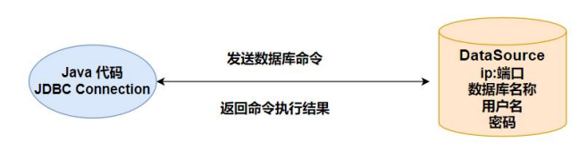

## SpringBoot 与数据库

Spring Boot 框架为 SQL 数据库提供了广泛的支持，既有用 `JdbcTemplate` 直接访问JDBC，同时支持 **object relational mapping**（ORM） 技术（如 `Hibernate`，`MyBatis`）。Spring Data 独立的项目提供对多种关系型和非关系型数据库的访问支持。比如 MySQL，Oracle，MongoDB，Redis，R2DBC，Apache Solr，Elasticsearch...


### DataSource

通常项目中使用 MySQL,Oracle,PostgreSQL 等大型关系数据库。Java 中的 jdbc 技术支持了多种关系型数据库的访问。

在代码中访问数据库，我们需要知道数据库程序所在的 ip，端口，访问数据库的用户名和密码以及数据库的类型信息。以上信息用来初始化数据源，数据源也就是 `DataSource`。数据源表示数据的来源，从某个ip上的数据库能够获取数据。`javax.sql.DataSource` 接口表示数据源，提供了标准的方法获取与数据库绑定的连接对象（`Connection`）。



```java
@AutoConfiguration(
    before = {SqlInitializationAutoConfiguration.class}
)
@ConditionalOnClass({DataSource.class, EmbeddedDatabaseType.class})
@ConditionalOnMissingBean(
    type = {"io.r2dbc.spi.ConnectionFactory"}
)
@EnableConfigurationProperties({DataSourceProperties.class})
@Import({DataSourcePoolMetadataProvidersConfiguration.class})
public class DataSourceAutoConfiguration {
	
}
```

```java
@ConfigurationProperties(prefix = "spring.datasource")
public class DataSourceProperties implements BeanClassLoaderAware, InitializingBean {
    private ClassLoader classLoader;
    private boolean generateUniqueName = true;
    private String name;
    private Class<? extends DataSource> type;
    private String driverClassName;
    private String url;
    private String username;
    private String password;
    private String jndiName;
    private EmbeddedDatabaseConnection embeddedDatabaseConnection;
    private Xa xa = new Xa();
    private String uniqueName;
}
```

Spring Boot 支持多种数据库连接池，优先使用 `HikariCP`，其次是 `Tomcat pooling`，再次是`Commons DBCP2`，如果以上都没有，最后会使用 `Oracle UCP` 连接池。当项目中 starter 依赖了 `spring-boot-starter-jdbc` 或者 `spring-boot-starter-data-jpa` 默认添加 `HikariCP` 连接池依赖，也就是默认使用 `HikariCP` 连接池。


### 轻量级：JdbcTemplate

```java
@AutoConfiguration(
    after = {DataSourceAutoConfiguration.class}
)
@ConditionalOnClass({DataSource.class, JdbcTemplate.class})
@ConditionalOnSingleCandidate(DataSource.class)
@EnableConfigurationProperties({JdbcProperties.class})
@Import({DatabaseInitializationDependencyConfigurer.class, JdbcTemplateConfiguration.class, NamedParameterJdbcTemplateConfiguration.class})
public class JdbcTemplateAutoConfiguration {
    public JdbcTemplateAutoConfiguration() {
    }
}
```


#### 准备环境

SpringBoot支持自动执行DDL，DML脚本，两个脚本的默认为`schema.sql`和`data.sql`。自动执行脚本还涉及到 `spring.sql.init.mode` 配置项：

- `always`：总是执行数据库初始化脚本。
- `never`：禁用数据库初始化。

`pom.xml`配置：

```xml
<dependency>
    <groupId>org.springframework.boot</groupId>
    <artifactId>spring-boot-starter-jdbc</artifactId>
</dependency>

<dependency>
    <groupId>com.mysql</groupId>
    <artifactId>mysql-connector-j</artifactId>
    <scope>runtime</scope>
</dependency>
```

`schema.sql`：

```sql
CREATE
    DATABASE IF NOT EXISTS `springboot`;

USE `springboot`;

CREATE TABLE IF NOT EXISTS `article`
(
    `id`          int(11)                   NOT NULL AUTO_INCREMENT COMMENT '主键',
    `user_id`     int(11)                   NOT NULL COMMENT '作者 ID',
    `title`       varchar(100)              NOT NULL COMMENT '文章标题',
    `summary`     varchar(200) DEFAULT NULL COMMENT '文章概要',
    `read_count`  int(11) unsigned zerofill NOT NULL COMMENT '阅读读数',
    `create_time` datetime                  NOT NULL COMMENT '创建时间',
    `update_time` datetime                  NOT NULL COMMENT '最后修改时间',
    PRIMARY KEY (`id`)
) ENGINE = InnoDB
  AUTO_INCREMENT = 1
  DEFAULT CHARSET = utf8mb4;
```

`data.sql`：

```sql
INSERT INTO `article`
VALUES ('1', '2101', 'SpringBoot 核心注解',
        '核心注解的主要作用', '00000008976', '2023-01-16 12:11:12', '2023-01-16 12:11:19');
INSERT INTO `article`
VALUES ('2', '356752', 'JVM 调优',
        'HotSpot 虚拟机详解', '00000000026', '2023-01-16 12:15:27', '2023-01-16 12:15:30');
```

`application.properties`：

```properties
spring.datasource.driver-class-name=com.mysql.cj.jdbc.Driver
spring.datasource.url=jdbc:mysql://localhost:3306?serverTimezone=Asia/Shanghai&useUnicode=true&characterEncoding=utf8&autoReconnect=true&useSSL=false
spring.datasource.username=root
spring.datasource.password=123456
#总是执行数据库脚本，以后设置为 never
spring.sql.init.mode=always
```


#### 访问 MySQL

`JdbcTemplate` 提供了丰富、实用的方法，归纳起来主要有以下几种类型的方法：

1. `execute` 方法：可以用于执行任何 SQL 语句，常用来执行 DDL 语句。
2. `update`、`batchUpdate` 方法：用于执行新增、修改与删除等语句。
3. `query` 和 `queryForXXX` 方法：用于执行查询相关的语句。 
4. `call` 方法：用于执行数据库存储过程和函数相关的语句。

固定`RowMapper`：

```java
@Test
void testBeanPropertyRowMapper() {
    List<ArticlePO> integers = jdbcTemplate.query("SELECT * FROM article",
                                                  new BeanPropertyRowMapper<>(ArticlePO.class));
    System.out.println(integers);
}
```

自定义RowMapper：（lambda）

```java
@Test
void testRowMapper() {
    List<ArticlePO> article = jdbcTemplate.query("SELECT * FROM article", (rs, rownum) -> {
        var id = rs.getInt("id");
        var userId = rs.getInt("user_id");
        var title = rs.getString("title");
        var summary = rs.getString("summary");
        var readCount = rs.getInt("read_count");
        var createTime = new Timestamp(rs.getTimestamp("create_time").getTime()).toLocalDateTime();
        var updateTime = new Timestamp(rs.getTimestamp("update_time").getTime()).toLocalDateTime();
        ArticlePO articlePO = new ArticlePO(id, userId, title, summary, readCount,
                                            createTime, updateTime);
        System.out.println("查询的文章 = " + articlePO);
        return articlePO;
    });
}
```


#### NamedParameterJdbcTemplate

`NamedParameterJdbcTemplate` 能够接受命名的参数，通过具名的参数提供代码的可读性，`JdbcTemplate`使用的是参数索引的方式。

 在使用模板的位置注入 `NamedParameterJdbcTemplate` 对象，编写 SQL 语句，在SQL 中`WHERE`部分`:命名参数`。调用 `NamedParameterJdbcTemplate` 的诸如 `query`，`queryForObject`，`execute`，`update` 等时，将参数封装到 `Map` 中。

```java
@Test
void testNameQuery() {
    // :参数名
    String sql="select count(*) as ct from article where user_id=:uidandread_count > :num";
    //key 是命名参数
    Map<String,Object> param = new HashMap<>();
    param.put("uid", 2101);
    param.put("num", 0);
    Long count = nameJdbcTemplate.queryForObject(sql, param, Long.class);System.out.println("用户被阅读的文章数量 = " + count);
}
```


### MyBatis

以 MyBatis 来自介绍 SpringBoot 集成 ORM 框架。

沿用上面的`ArticlePO`，增加`Mapper`层：

```java
public interface ArticleMapper {

    @Select(" SELECT * FROM `article` WHERE id = #{articleId} ")
    ArticlePO selectById(@Param("articleId") Integer id);
}
```

测试：

```java
@MapperScan(basePackages = "com.example.demo.model.mapper")
@SpringBootApplication
public class Demo1Application {

    public static void main(String[] args) {
		SpringApplication.run(Demo1Application.class, args);
    }
}
```

```java
@SpringBootTest
public class MyBatisTest {
    @Autowired
    private ArticleMapper articleMapper;

    @Test
    public void test1() {
        System.out.println(articleMapper.selectById(1));
    }
}
```

但是呢，查看结果：

```shell
ArticlePO(id=1, userId=null, title=SpringBoot 核心注解, summary=核心注解的主要作用, readCount=null, createTime=null, updateTime=null)
```

解决方案一（配置）：

```properties
# 配置MyBatis支持驼峰命名<-下划线
mybatis.configuration.map-underscore-to-camel-case=true
```

```shell
ArticlePO(id=1, userId=2101, title=SpringBoot 核心注解, summary=核心注解的主要作用, readCount=8976, createTime=2023-01-16T12:11:12, updateTime=2023-01-16T12:11:19)
```

解决方案二（`@Results`+`@ResultMap`）：

```java
public interface ArticleMapper {

    @Select(" SELECT * FROM `article` WHERE id = #{articleId} ")
    @Results({
            @Result(id = true, column = "id", property = "id"),
            @Result(column = "user_id", property = "userId"),
            @Result(column = "read_count", property = "readCount"),
            @Result(column = "create_time", property = "createTime"),
            @Result(column = "update_time", property = "updateTime"),
    })
    ArticlePO selectById(@Param("articleId") Integer id);
    
    // 复用@Results
    List<ArticlePO> selectList(Integer userId);
}
```

解决方案三（`xml`）：

```xml
<?xml version="1.0" encoding="UTF-8" ?>
    <!DOCTYPE mapper
    PUBLIC "-//mybatis.org//DTD Mapper 3.0//EN"
    "https://mybatis.org/dtd/mybatis-3-mapper.dtd">
    <mapper namespace="com.bjpowernode.orm.repository.ArticleDao">
    <resultMap id="ArticleMapper" type="com.bjpowernode.orm.po.ArticlePO"><id column="id" property="id"/>
    <result column="user_id" property="userId" />
    <result column="read_count" property="readCount" />
    <result column="create_time" property="createTime" />
    <result column="update_time" property="updateTime" />
    </resultMap>
</mapper>
```


#### SQL 提供者

MyBatis 提供了 **SQL 提供者**的功能。将 SQL 以方法的形式定义在单独的类中。 `Mapper` 接口通过引用**SQL提供者**中的方法名称，表示要执行的 SQL。

SQL 提供者有四类`@SelectProvider`，`@InsertProvider`，`@UpdateProvider`，`@DeleteProvider`。

```java

```

