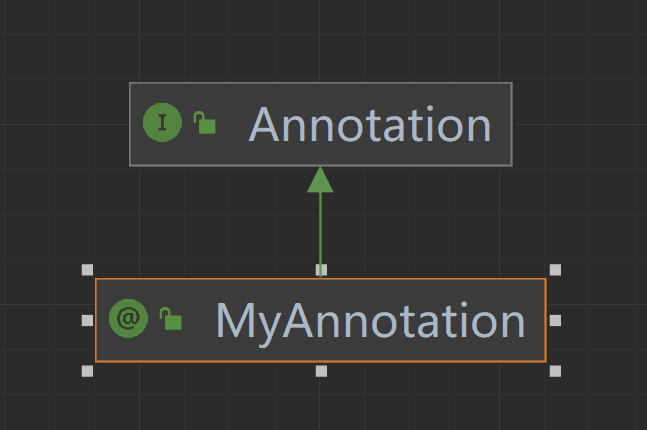
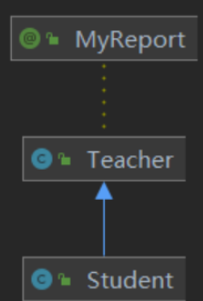
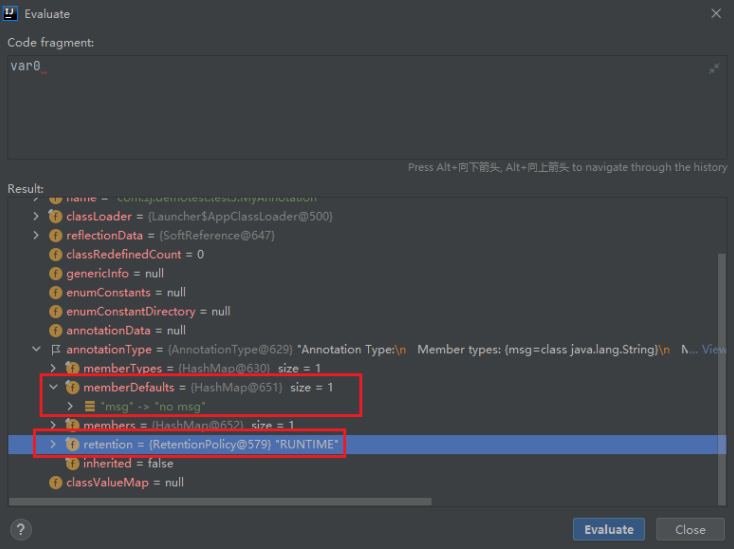

## Java 注解（Annotation）


### 参考

- https://www.cnblogs.com/xiaoniuhululu/p/16578683.html


### 初见

当我们开发SpringBoot项目，我们只需对启动类加上`@SpringBootApplication`，就能自动装配，不需要编写冗余的xml配置。当我们为项目添加lombok依赖，使用`@Data`来修饰实体类，我们就不需要编写**getter和setter方法，构造函数**等等。`@SpringBootApplication，@Data`等像这种以`@`开头的代码 就是**注解，**只需简简单单几个注解，就能帮助我们省略大量冗余的代码，这是一个非常不可思议的事情。
但我们往往知道在哪些地方加上合适的注解，不然IDE会报错，却不知道其中的原理，那究竟什么是注解呢？

**注解（Annotation）, 是 Java5 开始引入的新特性，是放在Java源码的类、方法、字段、参数前的一种特殊“注释”，是一种标记、标签。**

> 注释往往会被编译器直接忽略，能够被编译器打包进入class文件，并执行相应的处理。

先新建一个注解文件：`MyAnnotation.java`

```java
public @interface MyAnnotation {
}
```

发现MyAnnotation 是被`@interface`修饰的，感觉和`interface`很像。
我们再通过idea来看下其的类继承：



`MyAnnotation` 是继承`Annotation`接口的。我们再反编译一下：

```java
$ javac MyAnnotation.java
$ javap -c MyAnnotation

Compiled from "MyAnnotation.java"
public interface com.zj.ideaprojects.test3.MyAnnotation extends java.lang.annotation.Annotation {
}
```

发现生成的字节码中` @interface`变成了`interface`，``MyAnnotation`而且自动继承了`Annotation`。**我们由此可以明白：注解本质是一个继承了Annotation 的特殊接口，**所以注解也叫**声明式接口**。


### 注解的分类

三大类：Java自带的**标准注解**，**元注解**和**自定义注解**。


#### Java自带的标准注解

例如：

- `@Override`：让编译器检查该方法是否正确地实现了覆写；
- `@SuppressWarnings`：告诉编译器忽略此处代码产生的警告。
- `@Deprecated`：标记过时的元素，这个我们经常在日常开发中经常碰到。
- `@FunctionalInterface`：表明函数式接口注解


#### 元注解

**元注解是能够用于定义注解的注解，**或者说元注解是一种基本注解，包括`@Retention`、`@Target`、`@Inherited`、`@Documented`、`@Repeatable` 等。元注解也是Java自带的标准注解，只不过用于**修饰注解**，比较特殊。


##### @Retention

注解的保留策略， `@Retention` **定义了Annotation的生命周期**。当 `@Retention` 应用到一个注解上的时候，它解释说明了这个注解的的存活时间。它的参数：

| RetentionPolicy.SOURCE  | 注解**只在源码阶段**保留，在编译器进行编译时它将被丢掉       |
| ----------------------- | ------------------------------------------------------------ |
| RetentionPolicy.CLASS   | 注解只被**保留到编译进行**的时候，它并不会被加载到 JVM 中    |
| RetentionPolicy.RUNTIME | 注解可以**保留到程序运行中**的时候，它会被**加载进 JVM** 中，在程序运行中也可以获取到它们 |

> 如果`@Retention`不存在，则该`Annotation`默认为`RetentionPolicy.CLASS`

示例：

```java
@Retention(RetentionPolicy.RUNTIME)
public @interface TestAnnotation { 
} 
```

我们自定义的 `TestAnnotation` 可以在程序运行中被获取到。


##### @Documented

它的作用是 用于**制作文档**，将注解中的元素包含到 doc 中，一般不怎么用到，了解即可。


##### @Target

`@Target` **指定了注解可以修饰哪些地方**, 比如方法、成员变量、还是包等等。当一个注解被 `@Target` 注解时，这个注解就被限定了运用的场景。
常用的参数如下：

| ElementType.ANNOTATION_TYPE | 给一个注解进行注解                     |
| --------------------------- | -------------------------------------- |
| ElementType.CONSTRUCTOR     | 给构造方法进行注解                     |
| ElementType.FIELD           | 给属性进行注解                         |
| ElementType.LOCAL_VARIABLE  | 给局部变量进行注解                     |
| ElementType.METHOD          | 给方法进行注解                         |
| ElementType.PACKAGE         | 给包进行注解                           |
| ElementType.PARAMETER       | 给一个方法内的参数进行注解             |
| ElementType.TYPE            | 给一个类型进行注解，比如类、接口、枚举 |


##### @Inherited

`@Inherited` 修饰一个类时，表明它的注解可以被其子类**继承**，缺省情况默认是不继承的。
换句话说：**如果一个子类想获取到父类上的注解信息，那么必须在父类上使用的注解上面 加上`@Inherit`关键字**。
注意：

- **`@Inherited`仅针对`@Target(ElementType.TYPE)`类型的annotation有效**。
- **`@Inherited` 不是表明 注解可以继承，而是子类可以继承父类的注解**。

我们来看一个示例，定义一个注解：

```java
@Inherited
@Target(ElementType.TYPE)
public @interface MyReport {
    String name() default "";
    int value() default 0;
}
```

使用这个注解：

```java
@MyReport(value=1)
public class Teacher {
}
```

则它的子类默认继承了该注解：

```java
public class Student extends Teacher{  
}
```

idea 查看类的继承关系：




##### @Repeatable

使用`@Repeatable`这个元注解来申明注解，表示这个声明的注解是**可重复的**。`@Repeatable` 是 Java 1.8 才加进来的，所以算是一个新的特性。

比如：一个人他既会下棋又会做饭，他还会唱歌。

```java
@Repeatable(MyReport.class)
@Target(ElementType.TYPE)
public @interface MyReport {
    String name() default "";
    int value() default 0;
}

@MyReport(value=0)
@MyReport(value=1)
@MyReport(value=2)
public class Man{
}
```


#### 自定义注解

我们可以根据自己的需求定义注解，一般分为以下几步：

1. 新建注解文件， `@interface`定义注解：

   ```java
   public @interface MyReport { } 
   ```

2. 添加参数、默认值：

    ```java
    public @interface MyReport {
        String name() default "";
        int value() default 0;
    }
	```

3. 用元注解配置注解

    ```java
    @Retention(RetentionPolicy.RUNTIME)
    @Target(ElementType.TYPE)
    public @interface MyReport {
        String name() default "";
        int value() default 0;
    }
    ```

我们一般设置 `@Target`和`@Retention`就够了，其中`@Retention`一般设置为`RUNTIME`，因为我们自定义的注解通常需要在程序运行中读取。


#### 自定义注解的读取

我们先来写一个简单的示例--**反射获取注解**：

通过前文的了解，先来改造一下`MyAnnotation.java`：

```java
@Retention(RetentionPolicy.RUNTIME)//确保程序运行中，能够读取到该注解！！！
public @interface MyAnnotation {
    String msg() default "no msg";
}
```

我们再用`@MyAnnotation`来修饰`Person`类的类名、属性、和方法：

```java
@MyAnnotation(msg = "this person class")//注解 修饰类
public class Person {

    private String name;//姓名
    private String sex;//性别

    @MyAnnotation(msg = "this person field public")//注解 修饰 public属性
    public int height;//身高

    @MyAnnotation(msg = "this person field private")//注解 修饰 private属性
    private int weight;//体重


    public void sleep(){
        System.out.println(this.name+"--"+ "睡觉");
    }
    public void eat(){
        System.out.println("吃饭");
    }

    @MyAnnotation(msg = "this person method")//注解 修饰方法
    public void dance(){
        System.out.println("跳舞");
    }
}
```

最后我们写一个测试类：

```java
public class TestAn {
    public static void main(String[] args) throws NoSuchFieldException, NoSuchMethodException {

        //获取Person class 实例
        Class<Person> c1 = Person.class;

        //反射获取 类上的注解
        MyAnnotation classAnnotation = c1.getAnnotation(MyAnnotation.class);
        System.out.println(classAnnotation.msg());

        //反射获取 private属性上的注解
        Field we = c1.getDeclaredField("weight");
        MyAnnotation fieldAnnotation = we.getAnnotation(MyAnnotation.class);
        System.out.println(fieldAnnotation.msg());

        //反射获取 public属性上的注解
        Field he = c1.getDeclaredField("height");
        MyAnnotation field2Annotation = he.getAnnotation(MyAnnotation.class);
        System.out.println(field2Annotation.msg());

        //反射获取 方法上的注解
        Method me = c1.getMethod("dance",null);
        MyAnnotation methodAnnotation = me.getAnnotation(MyAnnotation.class);
        System.out.println(methodAnnotation.msg());
        

    }
}
```

结果：

```shell
this person class
this person field private
this person field public
this person method
```

我们通过反射读取api时，一般会先去校验这个注解存不存在：

```java
if(c1.isAnnotationPresent(MyAnnotation.class)) {
    //存在 MyAnnotation 注解
}else {
    //不存在 MyAnnotation 注解
}
```

**我们发现反射真的很强大，不仅可以读取类的属性、方法、构造器等信息，还可以读取类的注解相关信息**。那反射是如何实现工作的？我们来看下源码：
从 `c1.getAnnotation(MyAnnotation.class);`通过idea点进去查看源码，把重点的给贴出来，其他的就省略了：

```java
Map<Class<? extends Annotation>, Annotation> declaredAnnotations =
            AnnotationParser.parseAnnotations(getRawAnnotations(), getConstantPool(), this);
```

parseAnnotations()去**分析注解**，其第一个参数是 获取原始注解，第二个参数是获取常量池内容

```java
public static Annotation annotationForMap(final Class<? extends Annotation> var0, final Map<String, Object> var1) {
        return (Annotation)AccessController.doPrivileged(new PrivilegedAction<Annotation>() {
            public Annotation run() {
                return (Annotation)Proxy.newProxyInstance(var0.getClassLoader(), new Class[]{var0}, new AnnotationInvocationHandler(var0, var1));
            }
        });
    }
```

`Proxy._newProxyInstance_(var0.getClassLoader(), new Class[]{var0}, new AnnotationInvocationHandler(var0, var1)`创建动态代理，此处var0参数是由常量池获取的数据转换而来。我们监听此处的var0：


可以推断出**注解相关的信息 是存放在常量池中的**。

我们来总结一下，反射调用`getAnnotations(MyAnnotation.class)`方法的背后主要操作：
解析注解`parseAnnotations()`的时候 从该注解类的常量池中取出注解相关的信息，将其转换格式后，通过`newProxyInstance(注解的类加载器, 注解的class实例, AnotationInvocationHandler实例)`来创建代理对象，作为参数传进去，最后返回一个代理实例。

其中`AnotationInvocationHandler`类是一个典型的**动态代理类**：

```typescript
class AnnotationInvocationHandler implements InvocationHandler, Serializable {
    ...
    private final Map<String, Object> memberValues;//存放该注解所有属性的值
    private transient volatile Method[] memberMethods = null;

    AnnotationInvocationHandler(Class<? extends Annotation> var1, Map<String, Object> var2) {
    ...
    }

    public Object invoke(Object var1, Method var2, Object[] var3) {
    ...
     //调用委托类对象的方法，具体等等一些操作
    }
    ...
}
```

反射调用`getAnnotations(MyAnnotation.class)`，返回一个代理实例，我们可以通过这个实例来操作该注解。


### 例子

当我们引入 Spring Security 来做安全框架，然后只需添加`@PreAuthorize("hasRole('Admin')")`注解，就能实现权限的控制，简简单单地一行代码，就优雅地实现了权限控制，觉不觉得很神奇？让我们一起模拟一个出来吧：

```java
@Retention(RetentionPolicy.RUNTIME)
public @interface MyPreVer {
    String value() default "no role";
}
```

```java
public class ResourceLogin {
    private String name;

    @MyPreVer(value = "User")
    private void rsA() {
        System.out.println("资源A");
    }
    @MyPreVer(value = "Admin")
    private void rsB() {
        System.out.println("资源B");
    }
}
```

```java
public class TestLogin {
    public static void main(String[] args) throws NoSuchMethodException, InvocationTargetException, IllegalAccessException, InstantiationException {
        //模拟 用户的权限
        String role = "User";
        //模拟 需要的权限
        final String RoleNeeded = "Admin";

        //获取Class实例
        Class<ResourceLogin> c1 = ResourceLogin.class;

        //访问资源A
        Method meA = c1.getDeclaredMethod("rsA",null);
        MyPreVer meAPre = meA.getDeclaredAnnotation(MyPreVer.class);
        if(meAPre.value().equals(RoleNeeded)) {//模拟拦截器
            meA.setAccessible(true);
            meA.invoke(c1.newInstance(),null);//模拟访问资源
        }else {
            System.out.println("骚瑞，你无权访问该资源");
        }

        //访问资源B
        Method meB = c1.getDeclaredMethod("rsB",null);
        MyPreVer meBPre = meB.getDeclaredAnnotation(MyPreVer.class);
        if(meBPre.value().equals(RoleNeeded)) {//模拟拦截器
            meB.setAccessible(true);
            meB.invoke(c1.newInstance());//模拟访问资源

        }else {
            System.out.println("骚瑞，你无权访问该资源");
        }
    }
}
```

结果：

```shell
骚瑞，你无权访问该资源
资源B
```

