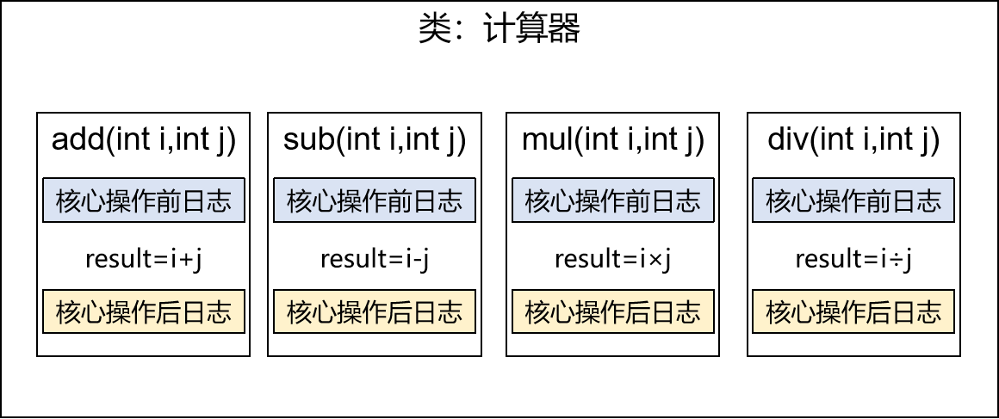
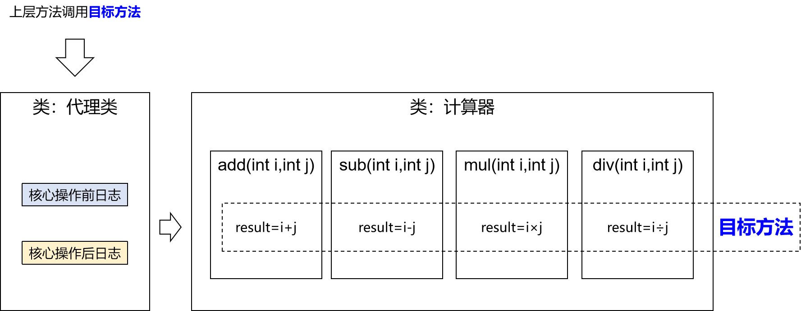
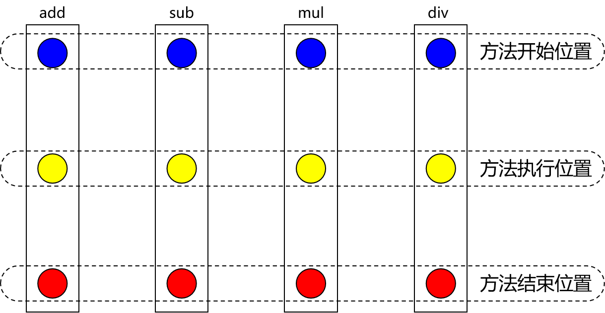
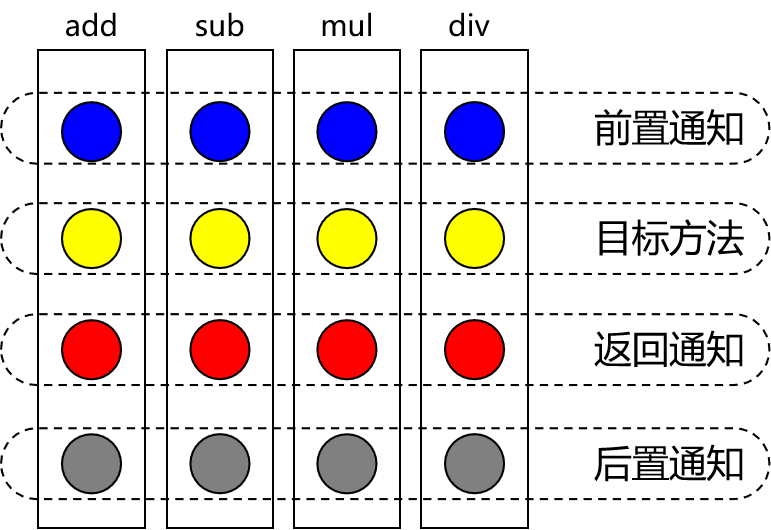
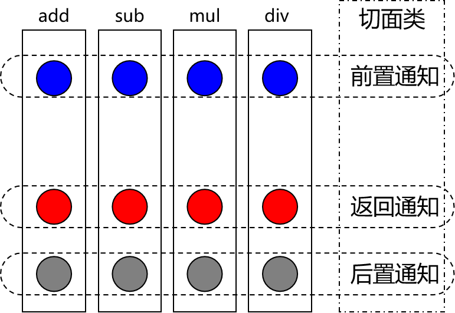
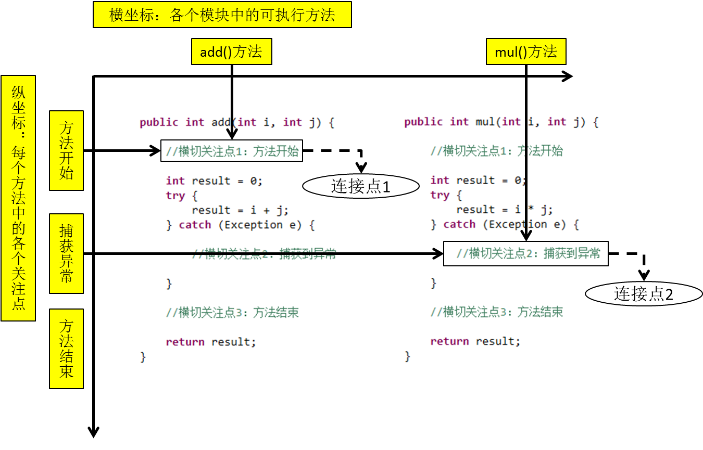
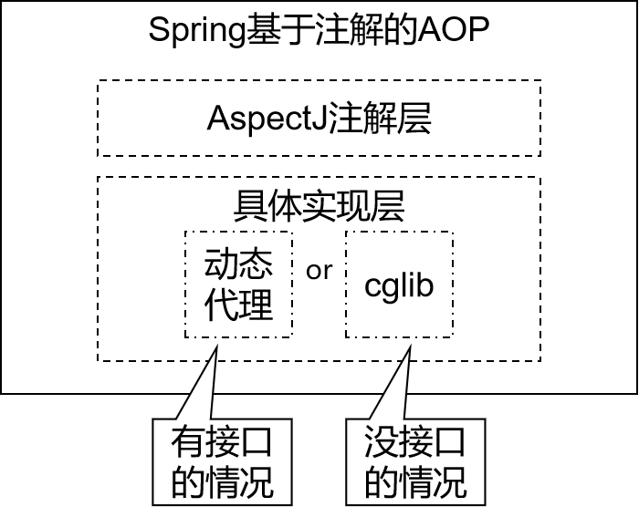

## 面向切片：AOP


### 场景模拟

创建新的子模块`spring6-aop`，并声明一个接口用以使用（计算器接口`Calculator`）：

```java
public interface Calculator {
    int add(int i, int j);
    int sub(int i, int j);
    int mul(int i, int j);
    int div(int i, int j);
}
```


实现：

```java
public class CalculatorImpl implements Calculator {
    
    @Override
    public int add(int i, int j) {
        int result = i + j;
        System.out.println("方法内部 result = " + result);
        return result;
    }
    
    @Override
    public int sub(int i, int j) {
        int result = i - j;
        System.out.println("方法内部 result = " + result);
        return result;
    }
    
    @Override
    public int mul(int i, int j) {
        int result = i * j;
        System.out.println("方法内部 result = " + result);
        return result;
    }
    
    @Override
    public int div(int i, int j) {
        int result = i / j;
        System.out.println("方法内部 result = " + result);
        return result;
    }
}
```

如果现在有需求要加上一个日志显示👇：



```java
public class CalculatorLogImpl implements Calculator {
    
    @Override
    public int add(int i, int j) {
        System.out.println("[日志] add 方法开始了，参数是：" + i + "," + j);
        int result = i + j;
        System.out.println("方法内部 result = " + result);
        System.out.println("[日志] add 方法结束了，结果是：" + result);
        return result;
    }
    
    @Override
    public int sub(int i, int j) {
        System.out.println("[日志] sub 方法开始了，参数是：" + i + "," + j);
        int result = i - j;
        System.out.println("方法内部 result = " + result);
        System.out.println("[日志] sub 方法结束了，结果是：" + result);
        return result;
    }
    
    @Override
    public int mul(int i, int j) {
        System.out.println("[日志] mul 方法开始了，参数是：" + i + "," + j);
        int result = i * j;
        System.out.println("方法内部 result = " + result);
        System.out.println("[日志] mul 方法结束了，结果是：" + result);
        return result;
    }
    
    @Override
    public int div(int i, int j) {
        System.out.println("[日志] div 方法开始了，参数是：" + i + "," + j);
        int result = i / j;
        System.out.println("方法内部 result = " + result);
        System.out.println("[日志] div 方法结束了，结果是：" + result);
        return result;
    }
}
```

那么这些代码就有如下问题了：

1. 对核心业务功能有干扰，导致程序员在开发核心业务功能时分散了精力；
2. 附加功能分散在各个业务功能方法中，不利于统一维护；

所以，解决这两个问题，核心就是：**解耦**。我们需要把附加功能从业务功能代码中抽取出来。

但是，也存在解决问题的困难：

- 要抽取的代码在方法内部，靠以前把子类中的重复代码抽取到父类的方式没法解决。所以需要引入新的技术。


### 代理模式

- **代理**：将非核心逻辑剥离出来以后，封装这些非核心逻辑的类、对象、方法。
- **目标**：被代理“套用”了非核心逻辑代码的类、对象、方法。

二十三种设计模式中的一种，属于结构型模式。它的作用就是通过提供一个代理类，让我们在调用目标方法的时候，不再是直接对目标方法进行调用，而是通过代理类**间接**调用。让不属于目标方法核心逻辑的代码从目标方法中剥离出来——**解耦**。

调用目标方法时先调用代理对象的方法，减少对目标方法的调用和打扰，同时让附加功能能够集中在一起也有利于统一维护。**使用代理前**：


**使用代理后**：


#### 静态代理

```java
package calculator;

public class CalculatorStaticProxy implements Calculator {

    // 将被代理的目标对象声明为成员变量
    private Calculator target;

    public CalculatorStaticProxy(Calculator target) {
        this.target = target;
    }

    @Override
    public int add(int i, int j) {

        // 附加功能由代理类中的代理方法来实现
        System.out.println("[日志] add 方法开始了，参数是：" + i + "," + j);

        // 通过目标对象来实现核心业务逻辑
        int addResult = target.add(i, j);

        System.out.println("[日志] add 方法结束了，结果是：" + addResult);

        return addResult;
    }

    @Override
    public int sub(int i, int j) {

        // 附加功能由代理类中的代理方法来实现
        System.out.println("[日志] sub 方法开始了，参数是：" + i + "," + j);

        // 通过目标对象来实现核心业务逻辑
        int subResult = target.sub(i, j);

        System.out.println("[日志] sub 方法结束了，结果是：" + subResult);

        return subResult;
    }

    @Override
    public int mul(int i, int j) {

        // 附加功能由代理类中的代理方法来实现
        System.out.println("[日志] mul 方法开始了，参数是：" + i + "," + j);

        // 通过目标对象来实现核心业务逻辑
        int mulResult = target.mul(i, j);

        System.out.println("[日志] mul 方法结束了，结果是：" + mulResult);

        return mulResult;
    }

    @Override
    public int div(int i, int j) {

        // 附加功能由代理类中的代理方法来实现
        System.out.println("[日志] div 方法开始了，参数是：" + i + "," + j);

        // 通过目标对象来实现核心业务逻辑
        int divResult = target.div(i, j);

        System.out.println("[日志] div 方法结束了，结果是：" + divResult);

        return divResult;
    }
}
```

##### 缺陷

- 静态代理确实实现了解耦，但是由于代码都写死了，完全不具备任何的灵活性。就拿日志功能来说，将来其他地方也需要附加日志，那还得再声明更多个静态代理类，那就产生了大量重复的代码，日志功能还是分散的，没有统一管理。


- 提出进一步的需求：**将日志功能集中到一个代理类中**，将来有任何日志需求，都通过这一个代理类来实现。这就需要使用**动态代理**技术了。


#### 动态代理



生产代理对象的工厂类：

```java
public class ProxyFactory {

    private Object target;

    public ProxyFactory(Object target) {
        this.target = target;
    }

    public Object getProxy(){

        /**
         * newProxyInstance()：创建一个代理实例
         * 其中有三个参数：
         * 1、classLoader：加载动态生成的代理类的类加载器
         * 2、interfaces：目标对象实现的所有接口的class对象所组成的数组
         * 3、invocationHandler：设置代理对象实现目标对象方法的过程，即代理类中如何重写接口中的抽象方法
         */
        ClassLoader classLoader = target.getClass().getClassLoader();
        Class<?>[] interfaces = target.getClass().getInterfaces();
        InvocationHandler invocationHandler = new InvocationHandler() {
            @Override
            public Object invoke(Object proxy, Method method, Object[] args) throws Throwable {
                /**
                 * proxy：代理对象
                 * method：代理对象需要实现的方法，即其中需要重写的方法
                 * args：method所对应方法的参数
                 */
                Object result = null;
                try {
                    System.out.println("[动态代理][日志] "+method.getName()+"，参数："+ Arrays.toString(args));
                    result = method.invoke(target, args);
                    System.out.println("[动态代理][日志] "+method.getName()+"，结果："+ result);
                } catch (Exception e) {
                    e.printStackTrace();
                    System.out.println("[动态代理][日志] "+method.getName()+"，异常："+e.getMessage());
                } finally {
                    System.out.println("[动态代理][日志] "+method.getName()+"，方法执行完毕");
                }
                return result;
            }
        };

        return Proxy.newProxyInstance(classLoader, interfaces, invocationHandler);
    }
}
```

测试：

```java
@Test
    public void testDynamicProxy() {
        ProxyFactory factory = new ProxyFactory(new SimpleCalculator());
        Calculator proxy = (Calculator) factory.getProxy();
        proxy.div(1, 1);
		// should exception
        proxy.div(1, 0);
    }
```


### AOP 概念

AOP（Aspect Oriented Programming）是一种设计思想，是软件设计领域中的面向切面编程，它是面向对象编程的一种补充和完善，它以通过**预编译方式**和**运行期动态代理方式**实现，**在不修改源代码的情况下，给程序动态统一添加额外功能的一种技术**。利用AOP可以对业务逻辑的各个部分进行隔离，从而使得业务逻辑各部分之间的耦合度降低，提高程序的可重用性，同时提高了开发的效率。


#### 相关术语


##### 横切关注点

分散在每个各个模块中解决同一样的问题，如用户验证、日志管理、事务处理、数据缓存都属于**横切关注点**。

从每个方法中抽取出来的同一类非核心业务。在同一个项目中，我们可以使用多个横切关注点对相关方法进行多个不同方面的增强。这个概念不是语法层面的，而是根据附加功能的逻辑上的需要：有十个附加功能，就有十个横切关注点。




##### 通知（增强）

**增强**，就是你想要增强的功能，比如 安全，事务，日志等。

每一个横切关注点上要做的事情都需要写一个方法来实现，这样的方法就叫通知方法：

- 前置通知：在被代理的目标方法**前**执行
- 返回通知：在被代理的目标方法**成功结束**后执行（**寿终正寝**）
- 异常通知：在被代理的目标方法**异常结束**后执行（**死于非命**）
- 后置通知：在被代理的目标方法**最终结束**后执行（**盖棺定论**）
- 环绕通知：使用`try...catch...finally`结构围绕**整个**被代理的目标方法，包括上面四种通知对应的所有位置




##### 切面

封装通知方法的类：




##### 目标

被代理的**目标对象**。


##### 代理

向目标对象应用通知之后创建的**代理对象**。


##### 连接点

这也是一个纯逻辑概念，不是语法定义的。

把方法排成一排，每一个横切位置看成x轴方向，把方法从上到下执行的顺序看成y轴，x轴和y轴的交叉点就是连接点。**通俗说，就是spring允许你使用通知的地方**：




##### 切入点

**定位连接点的方式**。每个类的方法中都包含多个连接点，所以连接点是类中客观存在的事物（从逻辑上来说）。

>  如果把连接点看作数据库中的记录，那么切入点就是查询记录的 SQL 语句。

**Spring 的 AOP 技术可以通过切入点定位到特定的连接点。通俗说，要实际去增强的方法**。切点通过 `org.springframework.aop.Pointcut` 接口进行描述，它使用类和方法作为连接点的查询条件。


#### 作用

- 简化代码：把方法中固定位置的重复的代码**抽取**出来，让被抽取的方法更专注于自己的核心功能，提高内聚性。
- 代码增强：把特定的功能封装到切面类中，看哪里有需要，就往上套，被**套用**了切面逻辑的方法就被切面给增强了。


### 基于注解的AOP




- 动态代理分为**JDK动态代理**和**cglib动态代理**，当**目标类有接口**的情况使用JDK动态代理和cglib动态代理，**没有接口时只能使用cglib动态代理**。
- **JDK动态代理**
  - JDK动态代理动态生成的代理类会在`com.sun.proxy`包下，类名为`$proxy1`，**和目标类实现相同的接口**。
  - **动态代理**（`InvocationHandler`）：JDK原生的实现方式，需要被代理的目标类必须实现接口。因为这个技术要求**代理对象和目标对象实现同样的接口**（兄弟两个拜把子模式）。
- **CGLIB动态代理**
  - cglib动态代理动态生成的代理类会和目标在在相同的包下，**会继承目标类**。
  - 通过**继承被代理的目标类**（认干爹模式）实现代理，所以不需要目标类实现接口。

- **AspectJ**：是AOP思想的一种实现。本质上是**静态代理**，**将代理逻辑“织入”被代理的目标类编译得到的字节码文件**，所以**最终效果是动态的**。`weaver`就是织入器。Spring只是借用了`AspectJ`中的注解。


#### 准备工作

在IOC所需依赖基础上再加入下面依赖：

```xml
<!--spring aop依赖-->
<dependency>
    <groupId>org.springframework</groupId>
    <artifactId>spring-aop</artifactId>
    <version>6.0.6</version>
</dependency>
<!--spring aspects依赖-->
<dependency>
    <groupId>org.springframework</groupId>
    <artifactId>spring-aspects</artifactId>
    <version>6.0.6</version>
</dependency>
```

准备对应的**接口**和**实现类**：

```java
public interface Calculator {
    
    int add(int i, int j);
    
    int sub(int i, int j);
    
    int mul(int i, int j);
    
    int div(int i, int j);
    
}
```

```java
@Component
public class CalculatorImpl implements Calculator {
    
    @Override
    public int add(int i, int j) {
    
        int result = i + j;
    
        System.out.println("方法内部 result = " + result);
    
        return result;
    }
    
    @Override
    public int sub(int i, int j) {
    
        int result = i - j;
    
        System.out.println("方法内部 result = " + result);
    
        return result;
    }
    
    @Override
    public int mul(int i, int j) {
    
        int result = i * j;
    
        System.out.println("方法内部 result = " + result);
    
        return result;
    }
    
    @Override
    public int div(int i, int j) {
    
        int result = i / j;
    
        System.out.println("方法内部 result = " + result);
    
        return result;
    }
}
```


#### 创建切面类并配置

1. `@Aspect`表示前面类；
2. 设置切入点和通知类型（**前置**、**返回**、**异常**、**后置**、**环绕**）
   - **前置通知**：使用`@Before`注解标识，在被代理的目标方法**前**执行；
   - **返回通知**：使用`@AfterReturning`注解标识，在被代理的目标方法**成功结束**后执行（**寿终正寝**）；
   - **异常通知**：使用`@AfterThrowing`注解标识，在被代理的目标方法**异常结束**后执行（**死于非命**）；
   - **后置通知**：使用`@After`注解标识，在被代理的目标方法**最终结束**后执行（**盖棺定论**）；
   - **环绕通知**：使用`@Around`注解标识，使用`try...catch...finally`结构围绕**整个**被代理的目标方法，包括上面四种通知对应的所有位置；

> **各种通知的执行顺序**
>
> - **Spring版本5.3.x以前**：
>   - 前置通知
>   - 目标操作
>   - 后置通知
>   - 返回通知或异常通知
> - **Spring版本5.3.x以后**：
>   - 前置通知
>   - 目标操作
>   - 返回通知或异常通知
>   - 后置通知

##### 切入点表达式语法


```java
"execution(<修饰符 | 通配符*> <方法全名——包名.类名.方法名 | 通配符*替换其中部分或者全部（类似于正则+模糊查询）> (<参数类型[,参数类型] | ..表示匹配所有参数>))"
```


##### 获取通知的相关信息

###### 获取连接点信息

获取连接点信息可以在通知方法的参数位置设置 `JoinPoint` 类型的形参。

```java
@Before("execution(public int com.atguigu.aop.annotation.CalculatorImpl.*(..))")
public void beforeMethod(JoinPoint joinPoint){
    //获取连接点的签名信息
    String methodName = joinPoint.getSignature().getName();
    //获取目标方法到的实参信息
    String args = Arrays.toString(joinPoint.getArgs());
    System.out.println("Logger-->前置通知，方法名："+methodName+"，参数："+args);
}
```

###### 获取目标方法的返回值

`@AfterReturning`中的属性`returning`，用来将通知方法的某个形参，接收目标方法的返回值。

```java
@AfterReturning(value = "execution(* com.atguigu.aop.annotation.CalculatorImpl.*(..))", returning = "result")
public void afterReturningMethod(JoinPoint joinPoint, Object result){
    String methodName = joinPoint.getSignature().getName();
    System.out.println("Logger-->返回通知，方法名："+methodName+"，结果："+result);
}
```

###### 获取目标方法的异常

`@AfterThrowing`中的属性`throwing`，用来将通知方法的某个形参，接收目标方法的异常。

```java
@AfterThrowing(value = "execution(* com.atguigu.aop.annotation.CalculatorImpl.*(..))", throwing = "ex")
public void afterThrowingMethod(JoinPoint joinPoint, Throwable ex){
    String methodName = joinPoint.getSignature().getName();
    System.out.println("Logger-->异常通知，方法名："+methodName+"，异常："+ex);
}
```


切面类：

```java
// @Aspect表示这个类是一个切面类
@Aspect
// @Component注解保证这个切面类能够放入IOC容器
@Component
public class LogAspect {

    // 前置通知
    // value: 切入点表达式配置切入点
    @Before(value = "execution(public int annotation.CalculatorImpl.*(int,int))")
    public void beforeMethod(JoinPoint joinPoint) {
        String methodName = joinPoint.getSignature().getName();
        String args = Arrays.toString(joinPoint.getArgs());
        System.out.println("Logger-->前置通知，方法名：" + methodName + "，参数：" + args);
    }

    @After(value = "execution(public int annotation.CalculatorImpl.*(int,int))")
    public void afterMethod(JoinPoint joinPoint) {
        String methodName = joinPoint.getSignature().getName();
        System.out.println("Logger-->后置通知，方法名：" + methodName);
    }

    @AfterReturning(value = "execution(public int annotation.CalculatorImpl.*(int,int))", returning = "result")
    public void afterReturningMethod(JoinPoint joinPoint, Object result) {
        String methodName = joinPoint.getSignature().getName();
        System.out.println("Logger-->返回通知，方法名：" + methodName + "，结果：" + result);
    }

    @AfterThrowing(value = "execution(public int annotation.CalculatorImpl.*(int,int))", throwing = "ex")
    public void afterThrowingMethod(JoinPoint joinPoint, Throwable ex){
        String methodName = joinPoint.getSignature().getName();
        System.out.println("Logger-->异常通知，方法名："+methodName+"，异常："+ex);
    }

    @Around("execution(public int annotation.CalculatorImpl.*(int,int))")
    public Object aroundMethod(ProceedingJoinPoint joinPoint){
        String methodName = joinPoint.getSignature().getName();
        String args = Arrays.toString(joinPoint.getArgs());
        Object result = null;
        try {
            System.out.println("环绕通知-->目标对象方法执行之前");
            //目标对象（连接点）方法的执行
            result = joinPoint.proceed();
            System.out.println("环绕通知-->目标对象方法返回值之后");
        } catch (Throwable throwable) {
            throwable.printStackTrace();
            System.out.println("环绕通知-->目标对象方法出现异常时");
        } finally {
            System.out.println("环绕通知-->目标对象方法执行完毕");
        }
        return result;
    }
}
```

最后在Spring的配置文件中配置：

```xml
<?xml version="1.0" encoding="UTF-8"?>
<beans xmlns="http://www.springframework.org/schema/beans"
       xmlns:xsi="http://www.w3.org/2001/XMLSchema-instance"
       xmlns:context="http://www.springframework.org/schema/context"
       xmlns:aop="http://www.springframework.org/schema/aop"
       xsi:schemaLocation="http://www.springframework.org/schema/beans
       http://www.springframework.org/schema/beans/spring-beans.xsd
       http://www.springframework.org/schema/context
       http://www.springframework.org/schema/context/spring-context.xsd
       http://www.springframework.org/schema/aop
       http://www.springframework.org/schema/aop/spring-aop.xsd">
    <!--
        基于注解的AOP的实现：
        1、将目标对象和切面交给IOC容器管理（注解+扫描）
        2、开启AspectJ的自动代理，为目标对象自动生成代理
        3、将切面类通过注解@Aspect标识
    -->
    <context:component-scan base-package="com.atguigu.aop.annotation"></context:component-scan>

    <aop:aspectj-autoproxy />
</beans>
```


#### 测试

```java
@Test
public void test() {
    ClassPathXmlApplicationContext ac = new ClassPathXmlApplicationContext("beans.xml");
    Calculator c = ac.getBean(Calculator.class);
    c.add(1, 1);
    c.sub(1, 1);
    c.div(1, 1);
    c.mul(1, 1);
}
```

结果：

```shell
环绕通知-->目标对象方法执行之前
Logger-->前置通知，方法名：add，参数：[1, 1]
方法内部 result = 2
Logger-->返回通知，方法名：add，结果：2
Logger-->后置通知，方法名：add
环绕通知-->目标对象方法返回值之后
环绕通知-->目标对象方法执行完毕
```


#### 重用切入点表达式

旨在替代繁琐的切入点表达式，使用函数替代：

```java
@Pointcut("execution(public int annotation.CalculatorImpl.*(int,int))",)
public void pointcut() {
}
```

然后，替换原有函数中的 `value` 属性：

```java
@Before(value = "pointcut()")
public void beforeMethod(JoinPoint joinPoint) {
    String methodName = joinPoint.getSignature().getName();
    String args = Arrays.toString(joinPoint.getArgs());
    System.out.println("Logger-->前置通知，方法名：" + methodName + "，参数：" + args);
}
```

当不是同一个切面：（包的全路径+切入点函数）

```java
@Before(value = "annotation.LogAspect.pointcut()")
public void beforeMethod(JoinPoint joinPoint) {
    String methodName = joinPoint.getSignature().getName();
    String args = Arrays.toString(joinPoint.getArgs());
    System.out.println("Logger-->前置通知，方法名：" + methodName + "，参数：" + args);
}
```


#### 切面的优先级

相同目标方法上同时存在多个切面时，切面的优先级控制切面的**内外嵌套**顺序。

- **优先级高的切面**：外面
- **优先级低的切面**：里面

使用`@Order`注解可以控制切面的优先级：

- `@Order`（**较小的数**）：优先级高
- `@Order`（**较大的数**）：优先级低


### 基于xml的AOP

基于`.xml`配置文件的AOP实现：（不再通过`@Before`这类的注解进行，而是使用配置文件）

```xml
<?xml version="1.0" encoding="UTF-8"?>
<beans xmlns="http://www.springframework.org/schema/beans"
       xmlns:xsi="http://www.w3.org/2001/XMLSchema-instance"
       xmlns:context="http://www.springframework.org/schema/context"
       xmlns:aop="http://www.springframework.org/schema/aop"
       xsi:schemaLocation="http://www.springframework.org/schema/beans
       http://www.springframework.org/schema/beans/spring-beans.xsd
       http://www.springframework.org/schema/context
       http://www.springframework.org/schema/context/spring-context.xsd
       http://www.springframework.org/schema/aop
       http://www.springframework.org/schema/aop/spring-aop.xsd">

    <!--开启组件的扫描-->
    <context:component-scan base-package="xmlaop"/>
    <!--配置5种通知类型-->
    <aop:config>
        <aop:aspect ref="logAspect">
            <!--配置切入点-->
            <aop:pointcut id="pointcut1"
                          expression="execution(public int xmlaop.CalculatorImpl.*(int,int))"/>
            <aop:before method="beforeMethod" pointcut-ref="pointcut1"/>
            <aop:after method="afterMethod" pointcut-ref="pointcut1"/>
            <aop:after-returning method="afterReturningMethod"
                                 returning="result" pointcut-ref="pointcut1"/>
            <aop:after-throwing method="afterThrowingMethod"
                                throwing="ex" pointcut-ref="pointcut1"/>
            <aop:around method="aroundMethod" pointcut-ref="pointcut1"/>
            <aop:around method="aroundMethod2" pointcut-ref="pointcut1"/>
        </aop:aspect>
    </aop:config>
</beans>
```

测试可得与**基于注解**一样的结果。