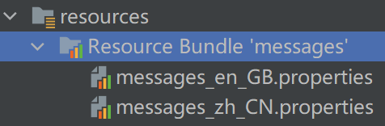
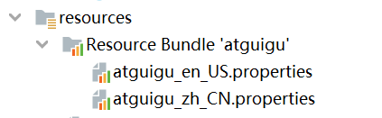

## 国际化（i8n）

国际化也称作**i18n**，其来源是英文单词 **internationalization** 的首末字符i和n，18为中间的字符数。由于软件发行可能面向多个国家，对于不同国家的用户，软件显示不同语言的过程就是国际化。通常来讲，软件中的国际化是通过配置文件来实现的，假设要支撑两种语言，那么就需要两个版本的配置文件。


### Java国际化

Java自身是支持国际化的，`java.util.Locale`用于指定当前用户所属的语言环境等信息，`java.util.ResourceBundle`用于查找绑定对应的资源文件。`Locale`包含了`language`信息和`country`信息，`Locale`创建默认`locale`对象时使用的静态方法：

```java
/**
* This method must be called only for creating the Locale.*
* constants due to making shortcuts.
*/
private static Locale createConstant(String lang, String country) {
    BaseLocale base = BaseLocale.createInstance(lang, country);
    return getInstance(base, null);
}
```

配置文件命名规则：

-  **basename_language_country.properties**

必须遵循以上的命名规则，java才会识别。其中，`basename`是必须的，语言和国家是可选的。这里存在一个优先级概念，如果同时提供了`messages.properties` 和 `messages_zh_CN.propertes` 两个配置文件，如果提供的`locale`符合`en_CN`，那么优先查找 `messages_en_CN.propertes` 配置文件，如果没查找到，再查找 `messages.properties` 配置文件。最后，提示下，所有的配置文件必须放在`classpath`中，一般放在`resources`目录下。



```java
package com.atguigu.spring6.javai18n;

import java.nio.charset.StandardCharsets;
import java.util.Locale;
import java.util.ResourceBundle;

public class Demo1 {

    public static void main(String[] args) {
        System.out.println(ResourceBundle.getBundle("messages",
                new Locale("en","GB")).getString("test"));

        System.out.println(ResourceBundle.getBundle("messages",
                new Locale("zh","CN")).getString("test"));
    }
}
```


### Spring6国际化

spring中国际化是通过`MessageSource`这个接口来支持的。


#### MessageSource接口

1. `ResourceBundleMessageSource`

   这个是基于Java的`ResourceBundle`基础类实现，允许仅通过资源名加载国际化资源。

2. `ReloadableResourceBundleMessageSource`

   这个功能和第一个类的功能类似，多了定时刷新功能，**允许在不重启系统的情况下，更新资源的信息**。

3. `StaticMessageSource`

   它允许通过编程的方式提供国际化信息，一会我们可以通过这个来实现db中存储国际化信息的功能。


### 使用Spring6国际化


##### 创建资源文件

- 国际化文件命名格式：**基本名称 _ 语言 _ 国家.properties**



创建`atguigu_en_US.properties`和`atguigu_zh_CN.properties`：

```properties
www.atguigu.com=welcome {0},time:{1}
```

```properties
www.atguigu.com=欢迎 {0},时间:{1}
```


##### 配置Spring配置文件，配置MessageSource

```xml
<?xml version="1.0" encoding="UTF-8"?>
<beans xmlns="http://www.springframework.org/schema/beans"
       xmlns:xsi="http://www.w3.org/2001/XMLSchema-instance"
       xsi:schemaLocation="http://www.springframework.org/schema/beans http://www.springframework.org/schema/beans/spring-beans.xsd">

    <bean id="messageSource"
          class="org.springframework.context.support.ResourceBundleMessageSource">
        <property name="basenames">
            <list>
                <value>atguigu</value>
            </list>
        </property>
        <property name="defaultEncoding">
            <value>utf-8</value>
        </property>
    </bean>
</beans>
```


##### 测试类

```java
package com.atguigu.spring6.javai18n;

import org.springframework.context.ApplicationContext;
import org.springframework.context.annotation.AnnotationConfigApplicationContext;
import org.springframework.context.support.ClassPathXmlApplicationContext;
import java.util.Date;
import java.util.Locale;

public class Demo2 {

    public static void main(String[] args) {
        
        ApplicationContext context = new ClassPathXmlApplicationContext("beans.xml");
        
        //传递动态参数，使用数组形式对应{0} {1}顺序
        Object[] objs = new Object[]{"atguigu",new Date().toString()};

        //www.atguigu.com为资源文件的key值,
        //objs为资源文件value值所需要的参数,Local.CHINA为国际化为语言
        String str=context.getMessage("www.atguigu.com", objs, Locale.CHINA);
        System.out.println(str);
    }
}
```

> IDEA: settings -> File Encoding -> 改成UTF-8