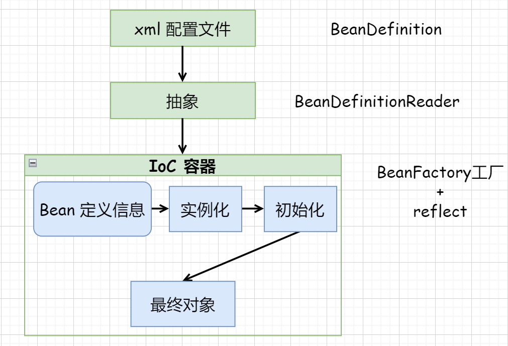
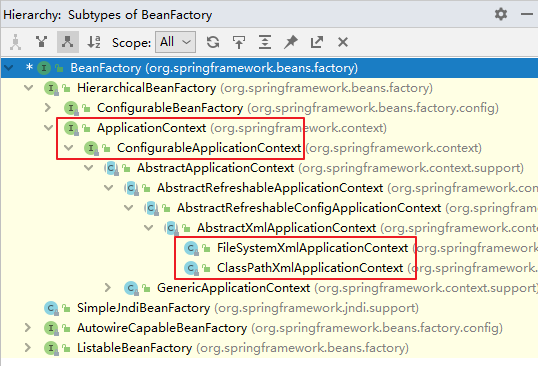
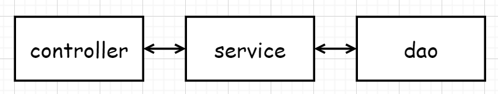

## IoC 容器


### 概述

**IoC**（**Inversion of Control**） ，“**控制反转**”，它不是一门技术，而是一种设计思想，是一个重要的面向对象编程法则，能够指导我们如何设计出松耦合、更优良的程序。

Spring 通过 IoC 容器来**管理所有 Java 对象的实例化和初始化**，**控制对象与对象之间的依赖关系**。我们将由 IoC 容器管理的 Java 对象称为 **Spring Bean**，它与使用关键字 new 创建的 Java 对象没有任何区别。（容器放`Bean`对象，使用`Map`存映射关系）

IoC 容器是 Spring 框架中最重要的核心组件之一，它贯穿了 Spring 从诞生到成长的整个过程。


#### IoC 容器流程概述



1. **xml 配置文件** 👉 `Bean`定义信息 `BeanDefinition`
2. 配置信息读取到 **IoC**（抽象，接口） 👉 `BeanDefinitionReader`

```java
public interface BeanDefinitionReader {
    BeanDefinitionRegistry getRegistry();

    @Nullable
    ResourceLoader getResourceLoader();

    @Nullable
    ClassLoader getBeanClassLoader();

    BeanNameGenerator getBeanNameGenerator();

    int loadBeanDefinitions(Resource resource) throws BeanDefinitionStoreException;

    int loadBeanDefinitions(Resource... resources) throws BeanDefinitionStoreException;

    int loadBeanDefinitions(String location) throws BeanDefinitionStoreException;

    int loadBeanDefinitions(String... locations) throws BeanDefinitionStoreException;
}
```

3. **Bean** 定义信息放入 **IoC** 容器 👉 实例化（`BeanFacoty` 工厂 + 反射）
4. 实例化 👉 初始化 👉 最终对象
5. `context.getBean("xxx")` 获取


#### 控制反转（IoC）

- 控制反转是一种思想，是为了**降低程序耦合度**，**提高程序扩展力**。
- 控制反转，反转的是什么：
  - 将对象的创建权利交出去，交给第三方容器负责。
  - 将对象和对象之间关系的维护权交出去，交给第三方容器负责。

> **Bean管理说的是：Bean对象的创建，以及Bean对象中属性的赋值（或者叫做Bean对象之间关系的维护）。**

- 控制反转这种思想如何实现呢？
  - **DI**（**Dependency Injection**）依赖注入


#### 依赖注入（DI）

依赖注入实现了控制反转的思想：

- Spring创建对象的过程中，**将对象依赖属性通过配置进行注入**，依赖注入常见的实现方式包括两种：
  - `set` 注入
  - 构造注入

> IoC 就是一种控制反转的思想， 而 DI 是对 IoC 的一种具体实现。


### IoC 容器在Spring中的实现

IoC 容器中管理的组件也叫做 `bean`。在创建 `bean` 之前，首先需要创建 IoC 容器。Spring 提供了 IoC 容器的两种实现方式：

1. **BeanFactory**

   这是 IoC 容器的基本实现，是 Spring 内部使用的接口。面向 Spring 本身，不提供给开发人员使用。

2. **ApplicationContext**

   `BeanFactory` 的子接口，提供了更多高级特性。面向 Spring 的使用者，几乎所有场合都使用 `ApplicationContext` 而不是底层的 `BeanFactory`。


#### ApplicationContext 的主要实现类



| 类型名                            | 简介                                                         |
| --------------------------------- | ------------------------------------------------------------ |
| `ClassPathXmlApplicationContext`  | 通过读取类路径下的 XML 格式的配置文件创建 IOC 容器对象       |
| `FileSystemXmlApplicationContext` | 通过文件系统路径读取 XML 格式的配置文件创建 IOC 容器对象     |
| `ConfigurableApplicationContext`  | `ApplicationContext` 的子接口，包含一些扩展方法 `refresh()` 和 `close()` ，让 `ApplicationContext` 具有启动、关闭和刷新上下文的能力。 |
| `WebApplicationContext`           | 专门为 Web 应用准备，基于 Web 环境创建 IOC 容器对象，并将对象引入存入 `ServletContext` 域中。 |


### 基于 xml 管理 Bean

（仍复用`spring-first`的架构，我选择了直接复用，也可以镜像一个）


#### 获取 Bean 的方式


##### 方式一：根据id获取

由于 `id` 属性指定了 bean 的唯一标识，所以根据 bean 标签的 `id` 属性可以精确获取到一个组件对象。

```java
ApplicationContext ac = new ClassPathXmlApplicationContext("xxx.xml");
User user1 = (User) ac.getBean("user");
user1.run();
```

##### 方式二：根据类型获取

```java
ApplicationContext ac = new ClassPathXmlApplicationContext("xxx.xml");
User user2 = ac.getBean(User.class);
user2.run();
```

##### 方式三：根据id和类型获取

```java
ApplicationContext ac = new ClassPathXmlApplicationContext("xxx.xml");
User user3 = ac.getBean("user", User.class);
user3.run();
```

##### 注意事项

当根据类型获取 `Bean` 时，要求 IoC 容器中指定类型的 `Bean` 有且只能有一个，若 IoC 容器中一共配置了两个：

```xml
<bean id="helloworldOne" class="com.atguigu.spring6.bean.HelloWorld"></bean>
<bean id="helloworldTwo" class="com.atguigu.spring6.bean.HelloWorld"></bean>
```

根据类型获取时会抛出异常：

```shell
org.springframework.beans.factory.NoUniqueBeanDefinitionException: No qualifying bean of type 'spring6.User' available: expected single matching bean but found 2: user,use2r
```


##### 扩展知识

###### 如果组件类实现了接口，根据接口类型可以获取 bean 吗？

```xml
<bean id="person" class="spring6.Person" abstract="true"/>
```

```java
public interface Person {
    public void run();
}

public class User implements Person {
    private String name;
    private Integer age;

    public void run() {
        System.out.println("Run...");
    }
}
```

```java
ApplicationContext ac = new ClassPathXmlApplicationContext("helloworld.xml");
// 自然可以
User user1 = (User) ac.getBean("user");
user1.run();
// 也可以
Person person1 = ac.getBean(Person.class);
person1.run();
```

> 可以，bean 唯一


###### 如果一个接口有多个实现类，这些实现类都配置了 bean，根据接口类型可以获取 bean 吗？

此时多加一个：

```xml
<bean id="baby" class="spring6.Baby"/>
```

```java
public class Baby implements Person {
    @Override
    public void run() {
        System.out.println("Sleep...");
    }
}
```

然后再运行：

```java
ApplicationContext ac = new ClassPathXmlApplicationContext("helloworld.xml");
Person person1 = ac.getBean(Person.class);
person1.run();
```

报错：

```shell
org.springframework.beans.factory.NoUniqueBeanDefinitionException: No qualifying bean of type 'spring6.Person' available: expected single matching bean but found 2: user,baby
```

> 不可以，bean 不唯一

根据类型来获取bean时，在满足bean唯一性的前提下，其实只是看：『对象 `instanceof` 指定的类型』的返回结果，只要返回的是`true`就可以认定为和类型匹配，能够获取到。

java中，`instanceof` 运算符用于判断前面的对象是否是后面的类，或其子类、实现类的实例。如果是返回`true`，否则返回`false`。也就是说：用`instanceof`关键字做判断时， `instanceof` 操作符的左右操作必须有继承或实现关系。


#### 依赖注入——setter 注入

配置 bean 时为属性赋值：

```xml
<bean id="user" class="spring6.User">
    <property name="name" value="Jay Doll"/>
    <property name="age" value="25"/>
</bean>
```

更新 `User` 类，使之有 `setter` 方法：（我偷懒直接上`lombok`了）

```xml
<dependency>
    <groupId>org.projectlombok</groupId>
    <artifactId>lombok</artifactId>
    <version>1.18.26</version>
</dependency>
```

```java
@Data
public class User implements Person {
    private String name;
    private Integer age;

    public void run() {
        System.out.println("Run...");
    }
    
    @Override
    public String toString() {
        return "User{ name=" + this.name + ", age=" + this.age + "}";
    }
}
```

执行：

```java
ApplicationContext ac = new ClassPathXmlApplicationContext("helloworld.xml");
User user = (User) ac.getBean("user");
System.out.println(user);
```

​	结果：

```shell
User{ name=Jay Doll, age=25}
```


#### 依赖注入——构造器注入

配置 bean ：

```xml
<bean id="user" class="spring6.User">
    <constructor-arg name="name" value="Giannis"/>
    <constructor-arg name="age" value="24"/>
</bean>
```

添加有参构造函数：

```java
@Data
public class User implements Person {
    private String name;
    private Integer age;

    public User() {}

    public User(String name, Integer age) {
        this.name = name;
        this.age = age;
    }

    public void run() {
        System.out.println("Run...");
    }

    @Override
    public String toString() {
        return "User{ name=" + this.name + ", age=" + this.age + "}";
    }
}
```

> `constructor-arg`标签还有两个属性可以进一步描述构造器参数：
>
> - `index`属性 —— 指定参数所在位置的索引（从0开始）
> - `name`属性 —— 指定参数名

结果：

```shell
User{ name=Giannis, age=24}
```


#### 特殊值处理

1. **`null`值处理**：

   ```xml
   <property name="name">
       <null />
   </property>
   ```

   如果用如下方式呢？

   ```xml
   <property name="name" value="null"/>
   ```

   那么`name`属性将会是`"null"`这个字符串。

2. **特殊字符**（保留符号等）：

   ```xml
   <property name="expression" value="a < b"/>
   ```

   上面的配置会报错，因为`<>`符号是`xml`格式的保留符号，因此我们要转义：

   ```xml
   <property name="expression" value="a &lt; b"/>
   ```

   如果我偏要写`<>`呢？👇

3. **CDATA 节点**：

   ```xml
   <property name="expression">
       <!-- 解决方案二：使用CDATA节 -->
       <!-- CDATA中的C代表Character，是文本、字符的含义，CDATA就表示纯文本数据 -->
       <!-- XML解析器看到CDATA节就知道这里是纯文本，就不会当作XML标签或属性来解析 -->
       <!-- 所以CDATA节中写什么符号都随意 -->
       <value><![CDATA[a < b]]></value>
   </property>
   ```


#### 对象类型属性注入

添加新的类`Web`：

```java
@Data
public class Web {
    private String name;
}
```

修改`User`：

```java
@Data
public class User implements Person {
    private String name;
    private Integer age;

    private Web web;

    public User() {
    }

    public void run() {
        System.out.println("Run...");
    }

    @Override
    public String toString() {
        return "User{name=" + this.name +
                ", age=" + this.age +
                ", web=" + this.web +
                "}";
    }
}
```

**对象属性注入**的**三种方式**：


##### 方式一：引用外部 bean

`Web`：

```xml
<bean id="web" class="spring6.Web">
    <property name="name" value="ants"/>
</bean>
```

`User`：

```xml
<bean id="user" class="spring6.User">
    <property name="name" value="Jay Doll"/>
    <property name="age" value="25"/>
    <!-- ref属性：引用IOC容器中某个bean的id，将所对应的bean为属性赋值 -->
    <property name="web" ref="web"/>
</bean>
```

结果：

```shell
User{name=Jay Doll, age=25, web=Web(name=ants)}
```

> **错误示范**：
>
> ```xml
> <bean id="user" class="spring6.User">
>     <property name="name" value="Jay Doll"/>
>     <property name="age" value="25"/>
>     <property name="web" value="web"/>
> </bean>
> ```
>
> 抛出异常：
>
> ```shell
> Caused by: java.lang.IllegalStateException: Cannot convert value of type 'java.lang.String' to required type 'spring6.Web' for property 'web': no matching editors or conversion strategy found 
> ```
>
> 意思是不能把`String`类型转换成我们要的`Web`类型，说明我们使用`value`属性时，Spring只把这个属性看做一个普通的字符串，不会认为这是一个`bean`的`id`，更不会根据它去找到`bean`来赋值。


##### 方式二：内部 bean

```xml
<bean id="user" class="spring6.User">
    <property name="name" value="Jay Doll"/>
    <property name="age" value="25"/>
    <!-- ref属性：引用IOC容器中某个bean的id，将所对应的bean为属性赋值 -->
    <property name="web">
        <bean id="web" class="spring6.Web">
            <property name="name" value="ants"/>
        </bean>
    </property>
</bean>
```


##### 方式三：级联属性赋值

```xml
<bean id="user" class="spring6.User">
    <property name="name" value="Jay Doll"/>
    <property name="age" value="25"/>
    <!-- ref属性：引用IOC容器中某个bean的id，将所对应的bean为属性赋值 -->
    <property name="web" ref="web"/>
    <property name="web.name" value="test"/>
</bean>

<bean id="web" class="spring6.Web">
    <property name="name" value="ants"/>
</bean>
```


#### 数组类型属性注入

修改`User`类：

```java
@Data
public class User implements Person {
    private String name;
    private Integer age;

    private Web web;

    private String[] hobbies;

    public User() {
    }

    public void run() {
        System.out.println("Run...");
    }

    @Override
    public String toString() {
        return "User{name=" + this.name +
                ", age=" + this.age +
                ", web=" + this.web +
                "}";
    }
}
```

输出：

```shell
User(name=Jay Doll, age=25, web=Web(name=test), hobbies=[111, 222, 333])
```


#### 集合类型属性注入


##### List类型属性

```java
@Data
public class Student {
    private String name;
    private String id;
}

@Data
public class Clazz {
    private String name;
    private List<Student> students;
}
```

```xml
<bean id="student" class="spring6.Student">
    <property name="name" value="Empty"/>
    <property name="id" value="SZ2116000"/>
</bean>

<bean id="clazz" class="spring6.Clazz">
    <property name="name" value="01"/>
    <property name="students">
        <list>
            <ref bean="student"/>
            <ref bean="student"/>
            <ref bean="student"/>
        </list>
    </property>
</bean>
```

结果：

```shell
Clazz(name=01, students=[Student(name=Empty, id=SZ2116000), Student(name=Empty, id=SZ2116000), Student(name=Empty, id=SZ2116000)])
```

> 若为 `Set` 集合类型属性赋值，只需要将其中的 `list` 标签改为 `set` 标签即可。


##### Map类型属性

创建`Teacher`类：

```java
@Data
public class Teacher {
    private String name;
}
```

`xml` 配置：

```xml
<bean id="teacher1" class="spring6.Teacher">
    <property name="name" value="T1"/>
</bean>
<bean id="teacher2" class="spring6.Teacher">
    <property name="name" value="T2"/>
</bean>

<bean id="clazz" class="spring6.Clazz">
    <property name="name" value="01"/>
    <property name="students">
        <list>
            <ref bean="student"/>
            <ref bean="student"/>
            <ref bean="student"/>
        </list>
    </property>
    <property name="teachers">
        <map>
            <entry key="math" value-ref="teacher1"/>
            <entry key="english" value-ref="teacher2"/>
        </map>
    </property>
</bean>
```

结果：

```shell
Clazz(name=01, students=[Student(name=Empty, id=SZ2116000), Student(name=Empty, id=SZ2116000), Student(name=Empty, id=SZ2116000)], teachers={math=Teacher(name=T1), english=Teacher(name=T2)})
```


##### 引用集合类型的bean

`xml`，比较特殊的：

```xml
<!--list集合类型的bean-->
<util:list id="students">
    <ref bean="studentOne"></ref>
    <ref bean="studentTwo"></ref>
    <ref bean="studentThree"></ref>
</util:list>
<!--map集合类型的bean-->
<util:map id="teacherMap">
    <entry>
        <key>
            <value>10010</value>
        </key>
        <ref bean="teacherOne"></ref>
    </entry>
    <entry>
        <key>
            <value>10086</value>
        </key>
        <ref bean="teacherTwo"></ref>
    </entry>
</util:map>
```

> ```xml
> <?xml version="1.0" encoding="UTF-8"?>
> <beans xmlns="http://www.springframework.org/schema/beans"
>        xmlns:xsi="http://www.w3.org/2001/XMLSchema-instance" xmlns:util="http://www.springframework.org/schema/util"
>        xsi:schemaLocation="http://www.springframework.org/schema/beans http://www.springframework.org/schema/beans/spring-beans.xsd http://www.springframework.org/schema/util https://www.springframework.org/schema/util/spring-util.xsd">
> ...
> </beans>
> ```
>
> 使用`util:list`、`util:map`标签必须引入相应的`namespace`

```xml
<bean id="clazzTwo" class="com.atguigu.spring6.bean.Clazz">
    <property name="clazzId" value="4444"></property>
    <property name="clazzName" value="Javaee0222"></property>
    <property name="students" ref="students"></property>
</bean>
<bean id="studentFour" class="com.atguigu.spring6.bean.Student">
    <property name="id" value="1004"></property>
    <property name="name" value="赵六"></property>
    <property name="age" value="26"></property>
    <property name="sex" value="女"></property>
    <!-- ref属性：引用IOC容器中某个bean的id，将所对应的bean为属性赋值 -->
    <property name="clazz" ref="clazzOne"></property>
    <property name="hobbies">
        <array>
            <value>抽烟</value>
            <value>喝酒</value>
            <value>烫头</value>
        </array>
    </property>
    <property name="teacherMap" ref="teacherMap"></property>
</bean>
```


#### P namespace

```xml
<?xml version="1.0" encoding="UTF-8"?>
<beans xmlns="http://www.springframework.org/schema/beans"
       xmlns:xsi="http://www.w3.org/2001/XMLSchema-instance"
       xmlns:util="http://www.springframework.org/schema/util"
       xmlns:p="http://www.springframework.org/schema/p"
       xsi:schemaLocation="http://www.springframework.org/schema/util
       http://www.springframework.org/schema/util/spring-util.xsd
       http://www.springframework.org/schema/beans
       http://www.springframework.org/schema/beans/spring-beans.xsd">
```

引入`p`命名空间后，可以通过以下方式为`bean`的各个属性赋值：

```xml
<bean id="studentSix" class="com.atguigu.spring6.bean.Student"
    p:id="1006" p:name="小明" p:clazz-ref="clazzOne" p:teacherMap-ref="teacherMap"></bean>
```


#### 引入外部属性文件

Maven依赖，引入数据库依赖：

```xml
<!-- MySQL驱动 -->
<dependency>
    <groupId>mysql</groupId>
    <artifactId>mysql-connector-java</artifactId>
    <version>8.0.30</version>
</dependency>

<!-- 数据源 -->
<dependency>
    <groupId>com.alibaba</groupId>
    <artifactId>druid</artifactId>
    <version>1.2.15</version>
</dependency>
```

创建外部属性文件（一般是properties格式），定义数据信息：

```properties
jdbc.user=root
jdbc.password=atguigu
jdbc.url=jdbc:mysql://localhost:3306/ssm?serverTimezone=UTC
jdbc.driver=com.mysql.cj.jdbc.Driver
```

引入属性文件：（引入 `context` 名称空间）

```xml
<?xml version="1.0" encoding="UTF-8"?>
<beans xmlns="http://www.springframework.org/schema/beans"
       xmlns:xsi="http://www.w3.org/2001/XMLSchema-instance"
       xmlns:context="http://www.springframework.org/schema/context"
       xsi:schemaLocation="http://www.springframework.org/schema/beans
       http://www.springframework.org/schema/beans/spring-beans.xsd
       http://www.springframework.org/schema/context
       http://www.springframework.org/schema/context/spring-context.xsd">
</beans>
```

```xml
<!-- 引入外部属性文件 -->
<context:property-placeholder location="classpath:jdbc.properties"/>
```

> 注意：在使用 <context:property-placeholder> 元素加载外包配置文件功能前，首先需要在 XML 配置的一级标签 `<beans>` 中添加 `context` 相关的约束。

配置 bean：

```xml
<bean id="druidDataSource" class="com.alibaba.druid.pool.DruidDataSource">
    <property name="url" value="${jdbc.url}"/>
    <property name="driverClassName" value="${jdbc.driver}"/>
    <property name="username" value="${jdbc.user}"/>
    <property name="password" value="${jdbc.password}"/>
</bean>
```

测试：

```java
@Test
public void testDataSource() throws SQLException {
    ApplicationContext ac = new ClassPathXmlApplicationContext("spring-datasource.xml");
    DataSource dataSource = ac.getBean(DataSource.class);
    Connection connection = dataSource.getConnection();
    System.out.println(connection);
}
```


#### bean 的作用域


##### 概念

在Spring中可以通过配置`bean`标签的`scope`属性来指定`bean`的作用域范围，各取值含义参加下表：

| 取值              | 含义                                      | 创建对象的时机  |
| ----------------- | ----------------------------------------- | --------------- |
| singleton（默认） | 在IOC容器中，这个`bean`的对象始终为单实例 | IOC容器初始化时 |
| prototype         | 这个`bean`在IOC容器中有多个实例           | 获取`bean`时    |

如果是在`WebApplicationContext`环境下还会有另外几个作用域（但不常用）：

| 取值    | 含义                 |
| ------- | -------------------- |
| request | 在一个请求范围内有效 |
| session | 在一个会话范围内有效 |

`Order`类：

```java
@Data
public class Order {}
```

配置 `bean` ：

```xml
<!-- scope属性：取值singleton（默认值），bean在IOC容器中只有一个实例，IOC容器初始化时创建对象 -->
<!-- scope属性：取值prototype，bean在IOC容器中可以有多个实例，getBean()时创建对象 -->
<bean id="order" class="spring6.scope.Order" scope="singleton"/>
```

测试：

```java
@Test
public void testSingleton() {
    ClassPathXmlApplicationContext ac =
        new ClassPathXmlApplicationContext("scope.xml");
    Order o1 = ac.getBean(Order.class);
    Order o2 = ac.getBean(Order.class);
    System.out.println(o1 == o2);	// TRUE
}
```


#### bean 的生命周期


##### 具体生命周期过程

1. bean对象创建（调用无参构造器）
2. 给bean对象设置属性

3. bean的后置处理器（初始化之前）

4. bean对象初始化（需在配置bean时指定初始化方法）

5. bean的后置处理器（初始化之后）

6. bean对象就绪可以使用

7. bean对象销毁（需在配置bean时指定销毁方法）

8. IOC容器关闭

`User`类：

```java
@Data
public class User {

    private String name;

    public User() {
        System.out.println("1. 调用无参数构造");
    }

    public void initMethod() {
        System.out.println("3. bean对象初始化，调用指定的初始化函数");
    }

    public void destroyMethod() {
        System.out.println("4. bean对象销毁，调用指定的销毁函数");
    }

    public void setName(String name) {
        System.out.println("2. 设置属性值");
        this.name = name;
    }
}
```

配置：

```xml
<bean id="user" class="spring6.life.User" scope="singleton"
      init-method="initMethod" destroy-method="destroyMethod">
    <property name="name" value="test"/>
</bean>
```

测试：

```java
ClassPathXmlApplicationContext ac = new ClassPathXmlApplicationContext("life.xml");
User user = (User) ac.getBean("user");
System.out.println(user);
ac.close();
```

结果：

```shell
1. 调用无参数构造
2. 设置属性值
3. bean对象初始化，调用指定的初始化函数
User(name=test)
4. bean对象销毁，调用指定的销毁函数
```


##### bean 的后置处理器

`bean`的后置处理器会在生命周期的初始化前后添加额外的操作，需要实现`BeanPostProcessor`接口，且配置到 IoC 容器中，需要注意的是，`bean`后置处理器不是单独针对某一个`bean`生效，而是针对 IoC 容器中所有 `bean` 都会执行。

创建 `bean` 的后置处理器：

```java
public class MyBeanPost implements BeanPostProcessor {
    @Override
    public Object postProcessBeforeInitialization(Object bean, String beanName) throws BeansException {
        System.out.println("3. bean后置处理器，初始化之前输出，"+beanName+": "+bean);
        return BeanPostProcessor.super.postProcessBeforeInitialization(bean, beanName);
    }

    @Override
    public Object postProcessAfterInitialization(Object bean, String beanName) throws BeansException {
        System.out.println("5. bean后置处理器，初始化之后输出，"+beanName+": "+bean);
        return BeanPostProcessor.super.postProcessAfterInitialization(bean, beanName);
    }
}
```

添加配置：

```xml
<!-- bean的后置处理器要放入IOC容器才能生效 -->
<bean id="myBeanProcessor" class="spring6.life.MyBeanPost"/>
```

结果：

```java
1. 调用无参数构造
2. 设置属性值
3. bean后置处理器，初始化之前输出，user: User(name=test)
4. bean对象初始化，调用指定的初始化函数
5. bean后置处理器，初始化之后输出，user: User(name=test)
User(name=test)
6. bean对象销毁，调用指定的销毁函数
```


#### FactoryBean

`FactoryBean`是 Spring 提供的一种整合第三方框架的常用机制。和普通的`bean`不同，配置一个 `FactoryBean` 类型的`bean`，在获取`bean`的时候得到的并不是`class`属性中配置的这个类的对象，而是`getObject()`方法的返回值。通过这种机制，Spring可以帮我们把复杂组件创建的详细过程和繁琐细节都屏蔽起来，只把最简洁的使用界面展示给我们。

将来我们整合 Mybatis 时，Spring就是通过`FactoryBean`机制来帮我们创建`SqlSessionFactory`对象的。

```java
/*
 * Copyright 2002-2020 the original author or authors.
 *
 * Licensed under the Apache License, Version 2.0 (the "License");
 * you may not use this file except in compliance with the License.
 * You may obtain a copy of the License at
 *
 *      https://www.apache.org/licenses/LICENSE-2.0
 *
 * Unless required by applicable law or agreed to in writing, software
 * distributed under the License is distributed on an "AS IS" BASIS,
 * WITHOUT WARRANTIES OR CONDITIONS OF ANY KIND, either express or implied.
 * See the License for the specific language governing permissions and
 * limitations under the License.
 */
package org.springframework.beans.factory;

import org.springframework.lang.Nullable;

/**
 * Interface to be implemented by objects used within a {@link BeanFactory} which
 * are themselves factories for individual objects. If a bean implements this
 * interface, it is used as a factory for an object to expose, not directly as a
 * bean instance that will be exposed itself.
 *
 * <p><b>NB: A bean that implements this interface cannot be used as a normal bean.</b>
 * A FactoryBean is defined in a bean style, but the object exposed for bean
 * references ({@link #getObject()}) is always the object that it creates.
 *
 * <p>FactoryBeans can support singletons and prototypes, and can either create
 * objects lazily on demand or eagerly on startup. The {@link SmartFactoryBean}
 * interface allows for exposing more fine-grained behavioral metadata.
 *
 * <p>This interface is heavily used within the framework itself, for example for
 * the AOP {@link org.springframework.aop.framework.ProxyFactoryBean} or the
 * {@link org.springframework.jndi.JndiObjectFactoryBean}. It can be used for
 * custom components as well; however, this is only common for infrastructure code.
 *
 * <p><b>{@code FactoryBean} is a programmatic contract. Implementations are not
 * supposed to rely on annotation-driven injection or other reflective facilities.</b>
 * {@link #getObjectType()} {@link #getObject()} invocations may arrive early in the
 * bootstrap process, even ahead of any post-processor setup. If you need access to
 * other beans, implement {@link BeanFactoryAware} and obtain them programmatically.
 *
 * <p><b>The container is only responsible for managing the lifecycle of the FactoryBean
 * instance, not the lifecycle of the objects created by the FactoryBean.</b> Therefore,
 * a destroy method on an exposed bean object (such as {@link java.io.Closeable#close()}
 * will <i>not</i> be called automatically. Instead, a FactoryBean should implement
 * {@link DisposableBean} and delegate any such close call to the underlying object.
 *
 * <p>Finally, FactoryBean objects participate in the containing BeanFactory's
 * synchronization of bean creation. There is usually no need for internal
 * synchronization other than for purposes of lazy initialization within the
 * FactoryBean itself (or the like).
 *
 * @author Rod Johnson
 * @author Juergen Hoeller
 * @since 08.03.2003
 * @param <T> the bean type
 * @see org.springframework.beans.factory.BeanFactory
 * @see org.springframework.aop.framework.ProxyFactoryBean
 * @see org.springframework.jndi.JndiObjectFactoryBean
 */
public interface FactoryBean<T> {

    /**
     * The name of an attribute that can be
     * {@link org.springframework.core.AttributeAccessor#setAttribute set} on a
     * {@link org.springframework.beans.factory.config.BeanDefinition} so that
     * factory beans can signal their object type when it can't be deduced from
     * the factory bean class.
     * @since 5.2
     */
    String OBJECT_TYPE_ATTRIBUTE = "factoryBeanObjectType";

    /**
     * Return an instance (possibly shared or independent) of the object
     * managed by this factory.
     * <p>As with a {@link BeanFactory}, this allows support for both the
     * Singleton and Prototype design pattern.
     * <p>If this FactoryBean is not fully initialized yet at the time of
     * the call (for example because it is involved in a circular reference),
     * throw a corresponding {@link FactoryBeanNotInitializedException}.
     * <p>As of Spring 2.0, FactoryBeans are allowed to return {@code null}
     * objects. The factory will consider this as normal value to be used; it
     * will not throw a FactoryBeanNotInitializedException in this case anymore.
     * FactoryBean implementations are encouraged to throw
     * FactoryBeanNotInitializedException themselves now, as appropriate.
     * @return an instance of the bean (can be {@code null})
     * @throws Exception in case of creation errors
     * @see FactoryBeanNotInitializedException
     */
    @Nullable
    T getObject() throws Exception;

    /**
     * Return the type of object that this FactoryBean creates,
     * or {@code null} if not known in advance.
     * <p>This allows one to check for specific types of beans without
     * instantiating objects, for example on autowiring.
     * <p>In the case of implementations that are creating a singleton object,
     * this method should try to avoid singleton creation as far as possible;
     * it should rather estimate the type in advance.
     * For prototypes, returning a meaningful type here is advisable too.
     * <p>This method can be called <i>before</i> this FactoryBean has
     * been fully initialized. It must not rely on state created during
     * initialization; of course, it can still use such state if available.
     * <p><b>NOTE:</b> Autowiring will simply ignore FactoryBeans that return
     * {@code null} here. Therefore it is highly recommended to implement
     * this method properly, using the current state of the FactoryBean.
     * @return the type of object that this FactoryBean creates,
     * or {@code null} if not known at the time of the call
     * @see ListableBeanFactory#getBeansOfType
     */
    @Nullable
    Class<?> getObjectType();

    /**
     * Is the object managed by this factory a singleton? That is,
     * will {@link #getObject()} always return the same object
     * (a reference that can be cached)?
     * <p><b>NOTE:</b> If a FactoryBean indicates to hold a singleton object,
     * the object returned from {@code getObject()} might get cached
     * by the owning BeanFactory. Hence, do not return {@code true}
     * unless the FactoryBean always exposes the same reference.
     * <p>The singleton status of the FactoryBean itself will generally
     * be provided by the owning BeanFactory; usually, it has to be
     * defined as singleton there.
     * <p><b>NOTE:</b> This method returning {@code false} does not
     * necessarily indicate that returned objects are independent instances.
     * An implementation of the extended {@link SmartFactoryBean} interface
     * may explicitly indicate independent instances through its
     * {@link SmartFactoryBean#isPrototype()} method. Plain {@link FactoryBean}
     * implementations which do not implement this extended interface are
     * simply assumed to always return independent instances if the
     * {@code isSingleton()} implementation returns {@code false}.
     * <p>The default implementation returns {@code true}, since a
     * {@code FactoryBean} typically manages a singleton instance.
     * @return whether the exposed object is a singleton
     * @see #getObject()
     * @see SmartFactoryBean#isPrototype()
     */
    default boolean isSingleton() {
        return true;
    }
}
```

创建`FactoryBean`类：

```java
public class MyFactoryBean implements FactoryBean<User> {
    @Override
    public User getObject() throws Exception {
        System.out.println("Factory Bean");
        return new User();
    }

    @Override
    public Class<?> getObjectType() {
        return User.class;
    }
}
```

配置：

```xml
<bean id="user" class="spring6.factoryBean.MyFactoryBean"/>
```

测试：

```java
ClassPathXmlApplicationContext ac = new ClassPathXmlApplicationContext("factoryBean.xml");
User user = (User) ac.getBean("user");
System.out.println(user);
```

结果：

```shell
Factory Bean
User(name=null)
```


#### 基于 xml 的自动装配

**自动装配**：根据指定的策略，在 IoC 容器中匹配某一个 bean ，自动为指定的 bean 中所依赖的类类型或接口类型属性赋值。

场景：



##### controller

```java
public class UserController {
    private final UserService us = new UserServiceImpl();

    public void getUser() {
        System.out.println("get UserService...");
        us.getUserDao();
    }
}
```

##### service

```java
public interface UserService {
    public void getUserDao();
}

public class UserServiceImpl implements UserService {

    private UserDao ud = new UserDaoImpl();

    @Override
    public void getUserDao() {
        System.out.println("get UserDao...");
        ud.getUser();
    }
}
```

##### Dao

```java
public interface UserDao {
    public void getUser();
}

public class UserDaoImpl implements UserDao {

    @Override
    public void getUser() {
        System.out.println("get User...");
    }
}
```

测试：

```java
UserController controller = new UserController();
controller.getUser();
```

结果：

```shell
get UserService...
get UserDao...
get User...
```

这是正常的调用链，那可不可以直接自动装配呢？


##### 配置 bean

`controller` & `service` 改写：

```java
@Data
public class UserController {
    private UserService us;

    public void getUser() {
        System.out.println("get UserService...");
        us.getUserDao();
    }
}
```

```java
@Data
public class UserServiceImpl implements UserService {

    private UserDao ud;

    @Override
    public void getUserDao() {
        System.out.println("get UserDao...");
        ud.getUser();
    }
}
```

改写测试：

```java
// UserController controller = new UserController();
ClassPathXmlApplicationContext ac = new ClassPathXmlApplicationContext("auto.xml");
UserController controller = (UserController) ac.getBean("userController");
controller.getUser();
```


使用`bean`标签的`autowire`属性设置自动装配效果：

###### 自动装配方式：`byType`

- `byType`：根据类型匹配 IoC 容器中的某个兼容类型的`bean`，为属性自动赋值：

  - 若在 IoC 中，没有任何一个兼容类型的`bean`能够为属性赋值，则该属性不装配，即值为默认值`null`；

  - 若在 IoC 中，有多个兼容类型的`bean`能够为属性赋值，则抛出异常`NoUniqueBeanDefinitionException`；

```xml
<bean id="userController" class="com.atguigu.spring6.autowire.controller.UserController" autowire="byType"></bean>

<bean id="userService" class="com.atguigu.spring6.autowire.service.impl.UserServiceImpl" autowire="byType"></bean>

<bean id="userDao" class="com.atguigu.spring6.autowire.dao.impl.UserDaoImpl"></bean>
```

测试结果：

```shell
get UserService...
get UserDao...
get User...
```


###### 自动装配方式：`byName`

- `byName`：将**自动装配的属性的属性名**，作为`bean`的`id`在IoC容器中匹配相对应的`bean`进行赋值：

修改配置：

```xml
<bean id="userController"
      class="spring6.auto.controller.UserController" autowire="byName"/>
<bean id="userService"
      class="spring6.auto.service.UserServiceImpl" autowire="byName"/>
<bean id="userDao"
      class="spring6.auto.dao.UserDaoImpl" autowire="byName"/>
```

但是测试会出错，因为名称不匹配：

```shell
java.lang.NullPointerException: Cannot invoke "spring6.auto.service.UserService.getUserDao()" because "this.us" is null
```

正确的修改：

```xml
<bean id="userController"
      class="spring6.auto.controller.UserController" autowire="byName"/>
<bean id="us"
      class="spring6.auto.service.UserServiceImpl" autowire="byName"/>
<bean id="ud"
      class="spring6.auto.dao.UserDaoImpl" autowire="byName"/>
```

成功：

```shell
get UserService...
get UserDao...
get User...
```

