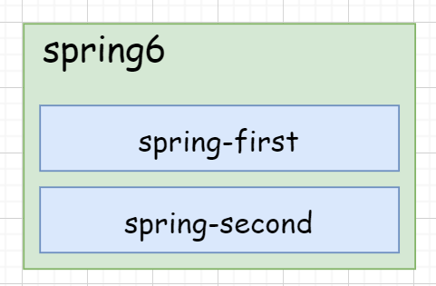
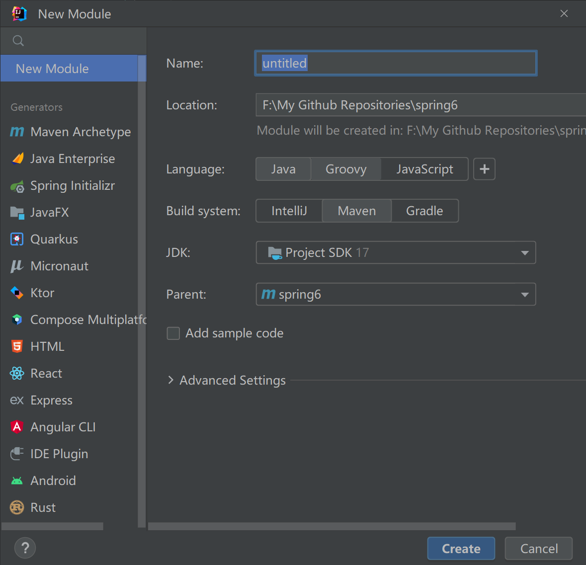
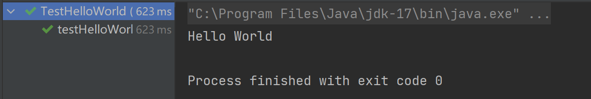
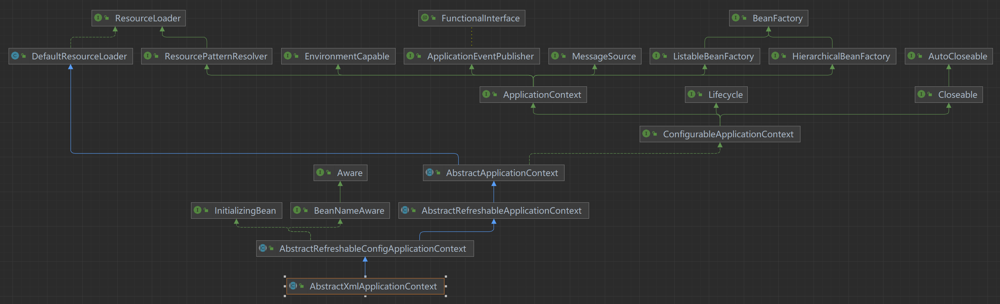

## 快速开始


### 环境配置

1. JDK 17.0.6（Spring 6.0+ 最低配置JDK 17）
2. Maven 3.8.4
3. Spring 6.0.8


### 构建模块

`Project` 为父模块，子模块单独列出。




##### 构建父模块

在idea中，依次单击 `File -> New -> Project -> New Project`


（删除`src`）目录

##### 构建子模块




### 开发

在`spring-first/src`目录下进行开发，相关步骤如下：

1. 引入 spring 相关依赖；
2. 创建类，定义属性和方法；
3. 按照 spring 要求创建配置文件（xml）；
4. 在 spring 配置文件中配置相关信息；
5. 测试


##### 子模块中引入 spring 依赖

`spring-first/src/pom.xml`

```xml
<dependencies>
    <!--spring context依赖-->
    <!--当你引入Spring Context依赖之后，表示将Spring的基础依赖引入了-->
    <dependency>
        <groupId>org.springframework</groupId>
        <artifactId>spring-context</artifactId>
        <version>6.0.8</version>
    </dependency>

    <!--junit5测试-->
    <dependency>
        <groupId>org.junit.jupiter</groupId>
        <artifactId>junit-jupiter-api</artifactId>
        <version>5.9.2</version>
    </dependency>
</dependencies>
```

##### 创建新的Java类

`main/java/spring6/HelloWorld.java`

```java
package spring6;

public class HelloWorld {
    public void sayHello() {
        System.out.println("Hello World");
    }
}
```

##### 创建配置文件

`main/resources/helloworld.xml`

```xml
<?xml version="1.0" encoding="UTF-8"?>
<beans xmlns="http://www.springframework.org/schema/beans"
       xmlns:xsi="http://www.w3.org/2001/XMLSchema-instance"
       xsi:schemaLocation="http://www.springframework.org/schema/beans http://www.springframework.org/schema/beans/spring-beans.xsd">
    <!--
    配置HelloWorld所对应的bean，即将HelloWorld的对象交给Spring的IOC容器管理
    通过bean标签配置IOC容器所管理的bean
    属性：
        id：设置bean的唯一标识
        class：设置bean所对应类型的全类名
	-->
    <bean id="helloWorld" class="spring6.HelloWorld"/>
</beans>
```

##### 创建测试类测试

```java
package spring6;

import org.junit.jupiter.api.Test;
import org.springframework.context.ApplicationContext;
import org.springframework.context.support.ClassPathXmlApplicationContext;

public class TestHelloWorld {

    @Test
    public void testHelloWorldObj() {
        // 加载spring配置文件, 对象创建
        ApplicationContext ac = new ClassPathXmlApplicationContext("helloworld.xml");
        // 获取创建的对象
        HelloWorld hw = (HelloWorld) ac.getBean("helloWorld");
        // 调用方法
        hw.sayHello();
    }
}
```

##### 运行测试程序




### 分析

1. 底层是怎么创建对象的，是通过反射机制调用无参数构造方法吗？
2. 把创建好的对象存储到一个什么样的数据结构当中了呢？


#### 底层是怎么创建对象的，是通过反射机制调用无参数构造方法吗？

修改 `HelloWorld` 类：

```java
package spring6;

public class HelloWorld {

    private String msg;

    public HelloWorld() {
        System.out.println("Constructor build");
    }

    public void sayHello() {
        System.out.println("Hello World");
    }
}
```

执行结果：

```shell
Constructor build
Hello World
```

显然是调用了`HelloWorld`类的无参构造函数。


##### ClassPathXmlApplicationContext 流程

```java
public class ClassPathXmlApplicationContext extends AbstractXmlApplicationContext {
    @Nullable
    private Resource[] configResources;
    
    ...
    
    public ClassPathXmlApplicationContext(String configLocation) throws BeansException {
        this(new String[]{configLocation}, true, (ApplicationContext)null);
    }

    public ClassPathXmlApplicationContext(String[] configLocations, boolean refresh, @Nullable ApplicationContext parent) throws BeansException {
        super(parent);
        this.setConfigLocations(configLocations);
        if (refresh) {
            this.refresh();
        }
    }
    
    ...
}
```



1. 加载 `.xml` 配置文件；
2. 对 `.xml` 文件进行解析操作；
3. 获取 `.xml` 文件 `bean` 标签属性值 `id`和 `class`；
4. 使用反射根据类全路径创建对象；


#### 把创建好的对象存储到一个什么样的数据结构当中了呢？

`Bean`对象最终存储在spring容器中，在spring源码底层就是一个`map`集合，存储`Bean`的`map`在`DefaultListableBeanFactory`类中：

```java
public class DefaultListableBeanFactory extends AbstractAutowireCapableBeanFactory implements ConfigurableListableBeanFactory, BeanDefinitionRegistry, Serializable {
    
    private final Map<String, BeanDefinition> beanDefinitionMap;
}

public DefaultListableBeanFactory() {
    ...
    this.mergedBeanDefinitionHolders = new ConcurrentHashMap(256);
    ...
}
```

Spring容器加载到`Bean`类时，会把这个类的描述信息，以包名加类名的方式存到`beanDefinitionMap` 中（`Map<String, BeanDefinition>`）

-  `String`是Key，默认是类名首字母小写；
- `BeanDefinition`存的是类的定义（描述信息），我们通常叫`BeanDefinition`接口为`Bean`的定义对象。


### 启用 Log4j2 日志框架

```xml
<dependency>
    <groupId>org.apache.logging.log4j</groupId>
    <artifactId>log4j-slf4j2-impl</artifactId>
    <version>2.20.0</version>
</dependency>
```

添加配置文件（`spring-first/log4j2.xml`）：

```xml
<?xml version="1.0" encoding="UTF-8"?>
<configuration>
    <loggers>
        <!--
            level指定日志级别，从低到高的优先级：
                TRACE < DEBUG < INFO < WARN < ERROR < FATAL
                trace：追踪，是最低的日志级别，相当于追踪程序的执行
                debug：调试，一般在开发中，都将其设置为最低的日志级别
                info：信息，输出重要的信息，使用较多
                warn：警告，输出警告的信息
                error：错误，输出错误信息
                fatal：严重错误
        -->
        <root level="DEBUG">
            <appender-ref ref="spring6log"/>
            <appender-ref ref="RollingFile"/>
            <appender-ref ref="log"/>
        </root>
    </loggers>

    <appenders>
        <!--输出日志信息到控制台-->
        <console name="spring6log" target="SYSTEM_OUT">
            <!--控制日志输出的格式-->
            <PatternLayout pattern="%d{yyyy-MM-dd HH:mm:ss SSS} [%t] %-3level %logger{1024} - %msg%n"/>
        </console>

        <!--文件会打印出所有信息，这个log每次运行程序会自动清空，由append属性决定，适合临时测试用-->
        <File name="log" fileName="./test.log" append="false">
            <PatternLayout pattern="%d{HH:mm:ss.SSS} %-5level %class{36} %L %M - %msg%xEx%n"/>
        </File>

        <!-- 这个会打印出所有的信息，
            每次大小超过size，
            则这size大小的日志会自动存入按年份-月份建立的文件夹下面并进行压缩，
            作为存档-->
        <RollingFile name="RollingFile" fileName="./app.log"
                     filePattern="log/$${date:yyyy-MM}/app-%d{MM-dd-yyyy}-%i.log.gz">
            <PatternLayout pattern="%d{yyyy-MM-dd 'at' HH:mm:ss z} %-5level %class{36} %L %M - %msg%xEx%n"/>
            <SizeBasedTriggeringPolicy size="50MB"/>
            <!-- DefaultRolloverStrategy属性如不设置，
            则默认为最多同一文件夹下7个文件，这里设置了20 -->
            <DefaultRolloverStrategy max="20"/>
        </RollingFile>
    </appenders>
</configuration>
```

重新运行，已经有日志出现了：

```shell
17:40:07.131 DEBUG org.springframework.context.support.AbstractApplicationContext 630 prepareRefresh - Refreshing org.springframework.context.support.ClassPathXmlApplicationContext@4b3a45f1
17:40:07.390 DEBUG org.springframework.beans.factory.xml.XmlBeanDefinitionReader 393 doLoadBeanDefinitions - Loaded 1 bean definitions from class path resource [helloworld.xml]
17:40:07.438 DEBUG org.springframework.beans.factory.support.DefaultSingletonBeanRegistry 225 getSingleton - Creating shared instance of singleton bean 'helloWorld'
```


#### 使用日志

```java
import org.slf4j.Logger;
import org.slf4j.LoggerFactory;

private Logger logger = LoggerFactory.getLogger(TestHelloWorld.class);
logger.info("test test");
```

