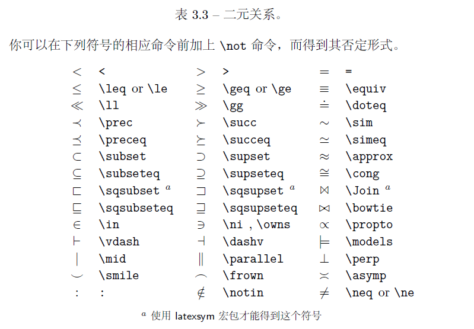
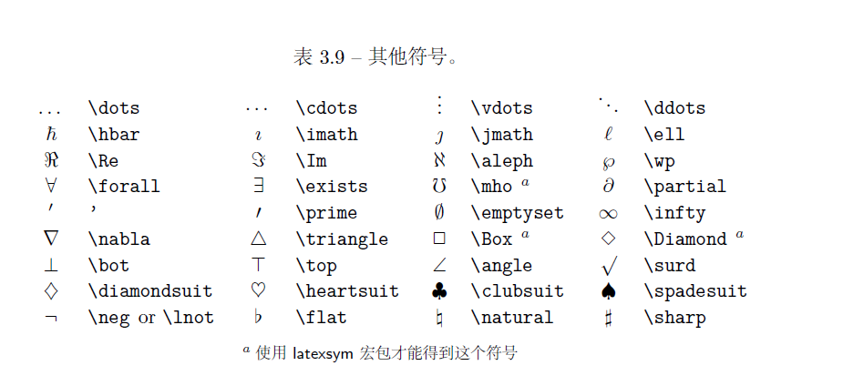
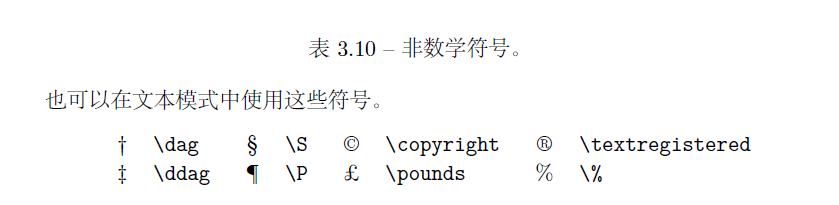

# LaTeX笔记


## 公式


#### 对齐方式

##### 单行对齐（对md没啥用）

|  效果  |       代码       |
| :----: | :--------------: |
| 左对齐 |  \leftline{...}  |
|  居中  | \centerline{...} |
| 右对齐 | \rightline{...}  |

##### 多行以及段落对齐(对md没啥用)

|  效果  |                 代码                  |
| :----: | :-----------------------------------: |
| 左对齐 |  \begin{flushleft}...\end{flushleft}  |
|  居中  |     \begin{center}...\end{center}     |
| 右对齐 | \begin{flushright}...\end{flushright} |

##### 简单方式

```latex
\begin{aligned}
	...
\end{aligned}
```


#### 数学格式

##### 行内公式

```text
$ f(x) = a + b $
```

$ f(x)=a+b $


##### 行间公式

```
$$ f(X) = a + b $$
```

$$
f(x)=a+b
$$


##### 手动编号

```text
$$ f(x) = a - b \tag{1.1} $$
```

$$
f(x)=a-b \tag{1.1}
$$


#### 其他格式

##### 空格

|  公式  |         效果 |
| :----: | -----------: |
| \qquad | $a \qquad b$ |
| \quad  |  $a \quad b$ |
|   \    |     $a \  b$ |
|   \,   |     $a \, b$ |
|   \;   |     $a \; b$ |
|  none  |        $a b$ |
|  \\!   |     $a \! b$ |


#### 简单运算

##### 基本运算

| 运算符 |  公式  |      效果       |
| :----: | :----: | :-------------: |
| +-*/=  | +-*/=  |    $ +-*/ $     |
|  点乘  | \cdot  |     $\cdot$     |
|  不等  |  \neq  |     $\neq$      |
|   除   |  \div  |    $ \div $     |
|  mod   | \bmod  |     $\bmod$     |
|  恒等  | \equiv |    $\equiv$     |
|  求导  |   ''   |    $x' y''$     |
|  范数  | \Vert  | $\Vert x\Vert$  |
| 绝对值 | \vert  | $\vert x \vert$ |
|  叉乘  | \times |    $\times$     |
|  异或  | \oplus |    $\oplus$     |
|   非   |  \neg  |     $\neg$      |


##### 根号、分式

| 运算符  |      公式       |
| :-----: | :-------------: |
| 平方根  |   \sqrt{...}    |
| n次方根 |  \sqrt[n]{...}  |
|  分式   | \frac{...}{...} |

$$
\sqrt{x^3}=\sqrt[4]{x^4+\frac{ac}{b^2}}
$$


##### 上下标记（共轭，无穷小数）

| 运算符 |            公式            |
| :----: | :------------------------: |
| 水平线 | \overline{}  \underline{}  |
| 大括号 | \overbrace{} \underbrace{} |
|   帽   |            \hat            |
|   拔   |            \bar            |
| 波浪号 |           \tilde           |

$$
\overline{x+y} \qquad \underline{x+y} \qquad \overbrace{1+2+..+n}^{n} \qquad \underbrace{1+2+...+n}_{n}
$$

$$
\hat{x} \qquad \bar{x} \qquad \tilde{x}
$$


##### 向量

| 运算符 |                公式                |
| :----: | :--------------------------------: |
|  基础  |               \vec{}               |
| 有方向 | \overrightarrow{} \overleftarrow{} |

$$
\vec{x} \qquad \overrightarrow{xy} \qquad \overleftarrow{xy} 
$$


##### 积分、极限、求和、求积

| 运算符 |            公式            |
| :----: | :------------------------: |
|  积分  | \int_{}^{} ... \mathrm{d}x |
|  极限  |   \lim{x \to \infty} ...   |
|  求和  |       \sum_{}^{} ...       |
|  求积  |      \prod_{}^{} ...       |
|  偏导  |          \partial          |

$$
\lim_{x \to \infty} \frac{1}{x} \qquad \int_{-\infty}^{+\infty}x\mathrm{d}x
$$

$$
\sum_{i=1}^{n} i^{2} \qquad \prod_{i=1}^{n} i^2 \qquad \frac{\partial{y}}{\partial{x}}
$$


##### 三圆点

|  运算符  |  公式  |
| :------: | :----: |
| 水平基线 | \ldots |
| 水平居中 | \cdots |
|   垂直   | \vdots |
|  对角线  | \ddots |

$$
\ldots \qquad \cdots \qquad \vdots \qquad \ddots
$$


##### 矩阵

| 运算符  |                     公式                      |
| :-----: | :-------------------------------------------: |
| matrix  |  $\begin{matrix} a & b \\ c& d \end{matrix}$  |
| bmatrix | $\begin{bmatrix} a & b \\ c& d \end{bmatrix}$ |
| vmatrix | $\begin{vmatrix} a & b \\ c& d \end{vmatrix}$ |
| pmatrix | $\begin{pmatrix} a & b \\ c& d \end{pmatrix}$ |
| 行分割  |                       &                       |
| 列分割  |                      \\                       |


##### 箭头


#### 关系运算




#### 二元运算


#### 多行公式

##### 公式组合

```text
D(x) = \begin{cases}
\lim\limits_{x \to 0} \frac{a^x}{b+c}, & x<3 \\
\pi, & x=3 \\
\int_a^{3b}x_{ij}+e^2 \mathrm{d}x,& x>3 \\
\end{cases}
```

$$
D(x) = \begin{cases}
\alpha, & x<1 \\
\beta, & 1\leq x \leq 2 \\
\gamma, & x>2
\end{cases}
$$


##### 公式拆分

```text
\begin{split}
\cos 2x &= \cos^2x - \sin^2x \\
&=2\cos^2x-1
\end{aplit}
```

$$
\begin{split}
\cos 2x &= \cos^2x - \sin^2x \\
&=2\cos^2x-1
\end{split}
$$


#### 外观格式

##### 加粗

```text
\boldsymbol{}
```

$$
\boldsymbol{test} \qquad test
$$


#### 字符


##### 希腊字母


##### 花体字母

| 效果          | 公式       |
| ------------- | ---------- |
| $\mathbb{L}$  | \mathbb{}  |
| $\mathcal{L}$ | \mathcal{} |
| $\mathscr{L}$ | \mathscr{} |


##### 注音字母


##### 定界符


##### 其他特殊字符





​	

## 标号

#### 无序列表

```latex
\begin{itemize}
    \item one
    \item two
    \item ...
\end{itemize}
```


```latex
\begin{itemize}
    \item[*] one
    \item[*] two
    \item[*] ...
\end{itemize}
```


#### 有序列表

```latex
\begin{enumerate}
    \item one
    \item two
    \item ...
\end{enumerate}
```


```latex
\begin{enumerate}[i)]
    \item one
    \item two
    \item ...
\end{enumerate}

\begin{enumerate}[1)]
    \item one
    \item two
    \item ...
\end{enumerate}
```


```latex
\begin{description}
    \item[Step1] one
    \item[Step2] two
    \item[Step3] ...
\end{description}
```


#### 子标题

```latex
\sebsection{}
```


## 表格

```latex
\usepackage{booktabs} % for three-line table
\begin{table}[htbp]
    \begin{tabular}{c|c}
        \toprule
	        value1 & value2 \\
        \midrule
    	    172.12 & 00 \\
        	173.01 & 00 \\
        \midrule
        	172.12 & 00 \\
        	188.12 & 00 \\
        \bottomrule           
    \end{tabular}
\end{table}
```

##### 表格过大

```latex
\usepackage{booktabs} % for three-line table
\begin{table}[htbp]
	\resizebox{\columnwidth}{!}{
		\begin{tabular}{c|c}
            \toprule
            	value1 & value2 \\
            \midrule
	            172.12 & 00 \\
    	        173.01 & 00 \\
            \midrule
        	    172.12 & 00 \\
            	188.12 & 00 \\
            \bottomrule           
		\end{tabular}
    }
\end{table}
```

## 图片

```latex
\begin{figure}[h]
	\includegraphics{IEEE-754.pdf}
\end{figure}
```

##### 图片过大

```latex
\usepackage[export]{adjustbox}
\begin{figure}[h]
    \includegraphics[max width=\linewidth]{IEEE-754.pdf}
    \caption{IEEE-754 standard for double precision.}
    \label{IEEE754Standard}
\end{figure}
```

##### 引用

```
\usepackage{cleveref}
```


## 伪代码

```latex
\usepackage[linesnumbered,ruled,vlined]{algorithm2e}
\IncMargin{1em}
\begin{algorithm} \SetKwData{Left}{left}\SetKwData{This}{this}\SetKwData{Up}{up} \SetKwFunction{Union}{Union}\SetKwFunction{FindCompress}{FindCompress} \SetKwInOut{Input}{input}\SetKwInOut{Output}{output}
	
	\Input{A bitmap $Im$ of size $w\times l$} 
	\Output{A partition of the bitmap}
	 \BlankLine 
	 
	 \emph{special treatment of the first line}\; 
	 \For{$i\leftarrow 2$ \KwTo $l$}{ 
	 	\emph{special treatment of the first element of line $i$}\; 
	 	\For{$j\leftarrow 2$ \KwTo $w$}{\label{forins} \Left$\leftarrow$\FindCompress{$Im[i,j-1]$}\; 
	 	\Up$\leftarrow$ \FindCompress{$Im[i-1,]$}\; 
	 	\This$\leftarrow$ \FindCompress{$Im[i,j]$}\; 
	 	\If(\tcp*[h]{O(\Left,\This)==1})
	 		{\Left compatible with \This}{\label{lt} 
	 			\lIf{\Left $<$ \This}{\Union{\Left,\This}}
	 			 \lElse{\Union{\This,\Left}} } 
 	    \If(\tcp*[f]{O(\Up,\This)==1}){\Up compatible with
 			 	 \This}{\label{ut} 
 			 	 \lIf{\Up $<$ \This}{\Union{\Up,\This}} 
 			 	 \tcp{\This is put under \Up to keep tree as flat as possible}\label{cmt} \lElse{\Union{\This,\Up}}\tcp*[h]{\This linked to \Up}\label{lelse}
 		 	  }
 	 	   }
 		 \lForEach{element $e$ of the line $i$}{\FindCompress{p}} 
 	 } 
 	 	  \caption{disjoint decomposition}
 	 	  \label{algo_disjdecomp} 
 	 \end{algorithm}
 \DecMargin{1em} 
```


**官方文档**：https://link.zhihu.com/?target=https%3A//mirrors.cqu.edu.cn/CTAN/macros/latex/contrib/algorithm2e/doc/algorithm2e.pdf
