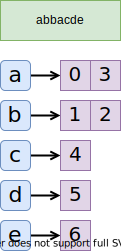

## 数组和字符串操作（Array and String）

#### **括号题**

- 括号题本质上是**栈（Stack）**的衍生，现在我们并不一定需要用**实体的栈**来模拟整个过程，仅用 $O(1)$ 的空间消耗，以**栈的理念**来实现，比如 [921. Minimum Add to Make Parentheses Valid](https://leetcode.cn/problems/minimum-add-to-make-parentheses-valid/) 这道题，通过两个变量计数（分别代表**非法左括号**和**非法右括号**的数目），来实现：

  ```
  func minAddToMakeValid(s string) int {
  	ans := 0
  	stack := 0
  	for i := 0; i < len(s); i++ {
  		if s[i] == '(' {
  			stack++
  		} else {
  			if stack > 0 {
  				stack--
  			} else {
  				ans++
  			}
  		}
  	}
  	ans += stack
  	return ans
  }
  ```

  

#### 区间操作

- 简单区间操作有重叠区间的合并（[56. Merge Intervals](https://leetcode.cn/problems/merge-intervals/)），插入（[57. Insert Interval](https://leetcode.cn/problems/insert-interval/)），删除等，一般通过排序方式很容易解决；
- 之前也碰到过其他区间操作，像判断是否重叠并插入系列问题（[729. My Calendar I](https://leetcode.cn/problems/my-calendar-i/) ，[731. My Calendar II](https://leetcode.cn/problems/my-calendar-ii/)，[732. My Calendar III](https://leetcode.cn/problems/my-calendar-iii/)），简单的可以用上述排序和遍历完成，复杂的通过**线段树**完成。


#### 差分数组

- **差分数组**的元素都是一种差值：

  

- **规则**：
  $$
  DA[i] = \begin{cases}
  	arr[i] 				& i=0 		\\
  	arr[i]-arr[i-1] 	& i \neq 0	\\
  \end{cases}
  $$

- **例题**：（[1094. Car Pooling](https://leetcode.cn/problems/car-pooling/)）

  - 车有有限的座位，每次运载都有起始地点和终点，是否能满足所有人的需要呢？我们想像一个时间轴，上面记录了每个时刻车上有多少人，就像 `arr` 中的一样，但是这样的更新是 $O(n)$ 复杂度的，当使用**差分数组** `DA` 时，我只需要在 $DA[start]$ 上加上乘客数量， 在 $DA[end]$ 上减去来维持后序差分数组的正确性就行了。
  - 当然，最后别忘了一次遍历来进行统计。最后时间复杂度为 $O(n)$ ，空间复杂度为 $O(n)$ 。（当然题目中空间复杂度没那么高）


#### 二维差分

一维差分的扩展加上**容斥原理**：（现在我希望在区间**左上到右下**：$(x_1,y_1) \to (x_2,y_2)$上更新`+1`）

1. 更新：$diff[x_1][y_1]=diff[x_1][y_1]+1$；
2. 发现多加了，删掉：
   - $diff[x_2+1][y_1]=diff[x_2+1][y_1]-1$
   - $diff[x_1][y_2+1]=diff[x_1][y_2+1]-1$
3. 删多了，再补回来（容斥原理）：$diff[x_2+1][y_2+1]=diff[x_2+1][y_2+1]+1$


#### 前缀和

前缀和可以简单理解为「数列的前 $n$ 项的和」，是一种重要的预处理方式，能大大降低查询的时间复杂度。写一个递推公式就很直白了：
$$
sum_i = sum_{i-1}+a_i
$$
如果我需要求某一个连续区间内的元素和，只要这么做：
$$
sum_{i,j}=sum_j-sum_{i-1}
$$
处理一下边界，前缀和数组一般比原数组长一个元素的位置，这个位置设置在开头，存放前缀和的零元，便于计算。


#### 二维前缀和

二位前缀和适合图上或者矩阵中的计算，其原理是**前缀和**和**容斥原理**，例如有一个这样的矩阵$A$，可视为二维数组：

```shell
1 2 4 3
5 1 2 4
6 3 5 9
```

那么，他的二维前缀和数组的递推公式就是：
$$
sum_{i,j}=sum_{i-1,j}+sum_{i,j-1}-sum_{i-1,j-1}+a_{i,j}
$$
最后这个矩阵长这样：

```shell
0  0  0  0  0
0  1  3  7 10
0  6  9 15 22
0 12 18 29 45
```

同样，如何求子矩阵的和？还是容斥原理：（左上坐标$(x_1,y_1)$，右下坐标$(x_2,y_2)$）
$$
sum = sum_{x_2,y_2}+sum_{x_1-1,y_1-1}-sum_{x_2,y_1-1}-sum_{x_1-1,y_2}
$$


#### 双指针

- **以** [15. 3Sum](https://leetcode.cn/problems/3sum/) **为例**，在数组中寻找三个元素（下标不同），让他们的**和**为零。**暴力解法**很显然需要 $O(n^3)$ 的时间复杂度，那么能不能优化成 $O(n^2)$ 呢？答案是可以的，需要用到的策略就是**双指针**。

  考虑以下的**有序数组**（无序先排一下序）：

  

  当我们确定了 `first` 指向的数字时，我们就能确定剩下的两个数字之和希望 `target` 是多少，图中即 $nums[second]+nums[third] = 1$ ，按照之前的分析，**暴力**需要 $O(n^2)$ 的复杂度，但是面对有序数组，我们可以简化，不妨设 $nums[second]+nums[third]$ 为变量 `tmp`：

  1. 当前 `tmp` 等于 `target` ，是其中一个答案；
  2. 当前 `tmp` 小于 `target` ，左指针 `second` 向右移动，`tmp` 将变大；
  3. 当前 `tmp` 大于 `target` ，右指针 `third` 向左移动，`tmp` 将变小；

  由于数组有序，我们不需要回看**已经遍历过**的部分了，amazing！

- **代码**：

  ```go
  func threeSum(nums []int) [][]int {
  	n := len(nums)
  	ans := make([][]int, 0)
  	sort.Ints(nums)
  	for first := 0; first < n-2; first++ {
  		if first > 0 && nums[first] == nums[first-1] {
  			continue
  		}
  		target := -nums[first]
  		for second, third := first+1, n-1; second < third; {
  			if tmp := nums[second] + nums[third]; tmp == target {
  				ans = append(ans, []int{nums[first], nums[second], nums[third]})
  				second++
  				for second < n && nums[second] == nums[second-1] {
  					second++
  				}
  			} else if tmp < target {
  				second++
  			} else {
  				third--
  			}
  		}
  	}
  	return ans
  }
  ```

- 其他**经典问题**：[75. Sort Colors](https://leetcode.cn/problems/sort-colors/)（`Dutch national flag problem`，**荷兰国旗问题**）


#### 滑动窗口（sliding Windows）

- 一个**滑动窗口**一般使用**双指针**来表示数组的开始和结束，分为两个步骤：
  1. **增长**：当按题意寻找时，数组右指针会增长；
  2. **缩进**：当右端按规则停住时，左侧按照某种规则判断是否能够缩进，如果能，数组左指针增长；
- **例题** [680. Valid Palindrome II](https://leetcode.cn/problems/valid-palindrome-ii/) ；


#### 分治

- 类似于**归并排序**的做法：

  

- **例题** [190. Reverse Bits](https://leetcode.cn/problems/reverse-bits/)

  ```go
  const (
      m1 = 0x55555555 // 01010101010101010101010101010101
      m2 = 0x33333333 // 00110011001100110011001100110011
      m4 = 0x0f0f0f0f // 00001111000011110000111100001111
      m8 = 0x00ff00ff // 00000000111111110000000011111111
  )
  
  func reverseBits(n uint32) uint32 {
      n = n>>1&m1 | n&m1<<1
      n = n>>2&m2 | n&m2<<2
      n = n>>4&m4 | n&m4<<4
      n = n>>8&m8 | n&m8<<8
      return n>>16 | n<<16
  }
  ```


#### 回文字符串

形如 `abcddcba` 以及 `abcdedcba` 的字符串，即字符出现**轴对称**的情况，称为**回文字符串**。

如果要判断一个字符串是不是**回文字符串**，朴素的思想是：

```go
for i := 0; i < len(s); i++ {
    if s[i] != s[len(s)-i-1] {
        return false
    }
    return true
}
```

但是扩展到要找所有的**回文子串**呢，如果还是朴素的方法，其复杂度过高了，时间复杂度为 $O(n^3)$ 。那么，我们引入一个新的方法，即**中心扩展法**：（例题：[647. Palindromic Substrings](https://leetcode.cn/problems/palindromic-substrings/)，[6236. Maximum Number of Non-overlapping Palindrome Substrings](https://leetcode.cn/problems/maximum-number-of-non-overlapping-palindrome-substrings/)）


```go
func countSubstrings(s string) int {
    n := len(s)
    ans := 0
    for i := 0; i < 2 * n - 1; i++ {
        l, r := i / 2, i / 2 + i % 2
        for l >= 0 && r < n && s[l] == s[r] {
            l--
            r++
            ans++
        }
    }
    return ans
}
```


#### 字符串的子序列

判断一个字符串 `word` 是否是另一个字符串 `s` 的子序列，是比较简单的，最粗暴的是使用双指针遍历即可，其**时间复杂度**为 $O(n+m)$ 。但是，要是判断一组的字符串 `words` 呢，需要**优化**：

##### 方法一：二分查找

1. 对 `s` 做预处理，创建一个二维数组（哈希表），存放对应字母出现的位置下标 `idx` ：

   

2. 每次匹配时，动用二分查找，找到恰好比 `word` 中上一个字母 `idx` 大的，如果没有，那么跳出。

##### 方法二：分桶

（**LeetCode** 题解中较为巧妙的做法）

1. 预处理阶段，`words` 中的各个 `word` 根据首字母分桶，每当遍历到 `s` 中的字母时，将对应的桶内字母去掉首字母重新进桶。
2. 直到所有桶内都空了或者 `s` 遍历完了。


#### 数组和字符串的例题

| ID   | LeetCode 题号                                                | 描述                                     | 思路                       |
| ---- | ------------------------------------------------------------ | ---------------------------------------- | -------------------------- |
| 1    | [921. Minimum Add to Make Parentheses Valid](https://leetcode.cn/problems/minimum-add-to-make-parentheses-valid/) | 统计将括号序列合法化最小括号添加的个数   | 利用单个变量计数模拟栈操作 |
| 2    | [1249. Minimum Remove to Make Valid Parentheses](https://leetcode.cn/problems/minimum-remove-to-make-valid-parentheses/) | 删除最少的非法括号                       | 向前遍历 + 向后遍历        |
| 3    | [56. Merge Intervals](https://leetcode.cn/problems/merge-intervals/) | 区间合并                                 | 排序 + 遍历                |
| 4    | [57. Insert Interval](https://leetcode.cn/problems/insert-interval/) | 区间添加                                 | 遍历 + 判断                |
| 5    | [1094. Car Pooling](https://leetcode.cn/problems/car-pooling/) | 有限座位的车是否能运等车人               | 差分数组                   |
| 6    | [15. 3Sum](https://leetcode.cn/problems/3sum/)               | 三数之和为零                             | 双指针优化                 |
| 7    | [75. Sort Colors](https://leetcode.cn/problems/sort-colors/) | 三元素原地排序                           | 双指针                     |
| 8    | [680. Valid Palindrome II](https://leetcode.cn/problems/valid-palindrome-ii/) | 删除至多一个字符是否成回文串             | 双指针                     |
| 9    | [76. Minimum Window Substring](https://leetcode.cn/problems/minimum-window-substring/) | 满足要求的最小子串                       | 双指针滑动窗口             |
| 10   | [190. Reverse Bits](https://leetcode.cn/problems/reverse-bits/) | 二进制倒置                               | 分治 或 遍历               |
| 11   | [647. Palindromic Substrings](https://leetcode.cn/problems/palindromic-substrings/) | 回文子串的个数                           | 中心扩展法                 |
| 12   | [6236. Maximum Number of Non-overlapping Palindrome Substrings](https://leetcode.cn/problems/maximum-number-of-non-overlapping-palindrome-substrings/) | 不重叠回文字符串的最大数目               | 中心扩展法 + DP            |
| 13   | [792. Number of Matching Subsequences](https://leetcode.cn/problems/number-of-matching-subsequences/) | 判断一系列字符串是否是某一字符串的子序列 | 预处理 + 二分查找          |

| 题                                                           | 题                                  | 题                              | 题                             |
| ------------------------------------------------------------ | ----------------------------------- | ------------------------------- | ------------------------------ |
| 252. Meeting Rooms                                           | 1272. Remove Interval               | 435. Non-overlapping Intervals  | 253. Meeting Rooms II          |
| 1229 Meeting Scheduler                                       | 408 Valid Word Abbreviation         | 1004 Max Consecutive Ones III   | 209  Minimum Size Subarray Sum |
| 1438 Longest Continuous Subarray With Absolute Diff Less Than or Equal to Limit Subsequence. | 792 Number of Matching Subsequences | 727. Minimum Window Subsequence | 940 Distinct Subsequences II   |

**Subarray、substring （连续的**）. From 1point 3acres bbs
Rolling hash （Rabin-Karp） 1062. Longest Repeating Substring， 1044. Longest Duplicate Substring
