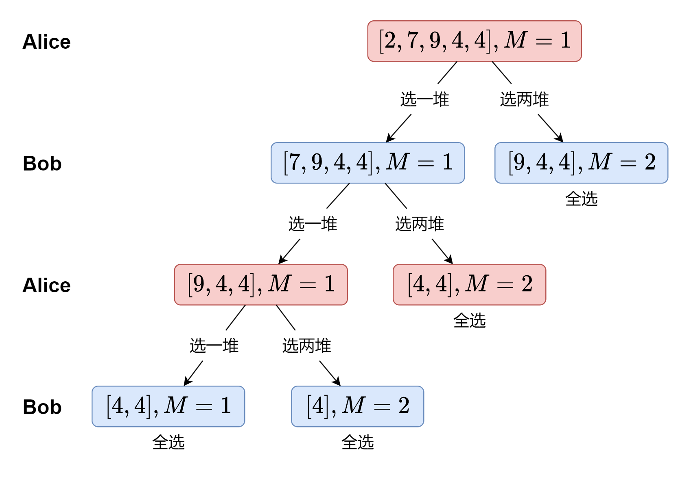

## 1140. Stone Game II

- [1140. Stone Game II](https://leetcode.cn/problems/stone-game-ii/)

- [Weekly Contest 147 - Q4 Rating 2034](https://leetcode.com/contest/weekly-contest-147) 


#### 分析



如果简单思考（如上图），这将是一个简单的**DFS**问题，但是呢，题目要求不简单，我们的对手不是白痴，他也开挂，能从结论推导当前要选多少。这反倒简化了题目，所谓最多能拿多少个，其实就一种情况。

那么问题来了，如何去做**DFS**呢，朴素的情况是模拟两个人一人拿一堆，每次拿完以后都需要**DFS**决定下一次拿多少个，绝对会超时。那么如何简化，我们知道，`dfs(i, j)`和`dfs(i, j)`的结果是稳定的，无论是谁调用，那么就可以用**状态压缩DFS**来解决这个问题了。

问题来了，状态压缩的**cache**，该开多大呢，一维是确定的$n$，另一维看似确定是$M$，但是我们不知道这一维的最大值是多少，我们假设每一位玩家都取最多，那么最后有：
$$
\begin{aligned}
(2+4+8+ \cdots +M)+2M &< n \\
&\Updownarrow \\
4M &\leq n+1
\end{aligned}
$$
搞定！


**时间复杂度**：$O(n^3)$

**空间复杂度：**$O(n^2)$


#### 代码

```go
func stoneGameII(piles []int) int {
	n := len(piles)
	s := make([]int, n+1)
	for i := n - 1; i >= 0; i-- {
		s[i] = s[i+1] + piles[i]
	}

	cache := make([][]int, n)
	for i := range cache {
		cache[i] = make([]int, (n+1)/4+1)
		for j := range cache[i] {
			cache[i][j] = -1
		}
	}

	var dfs func(i, m int) int
	dfs = func(i, m int) int {
		if i+2*m >= n {
			return s[i]
		}
		if cache[i][m] > -1 {
			return cache[i][m]
		}
		res := 0

		mn := s[i]
		for x := 1; x <= 2*m; x++ {
			mn = min(mn, dfs(i+x, max(x, m)))
		}
		res = s[i] - mn

		cache[i][m] = res
		return res
	}

	return dfs(0, 1)
}

func min(a, b int) int {
	if b < a {
		return b
	}
	return a
}
func max(a, b int) int {
	if b > a {
		return b
	}
	return a
}
```

