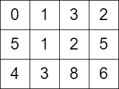

## 00. Template

- [2577. Minimum Time to Visit a Cell In a Grid](https://leetcode.cn/problems/minimum-time-to-visit-a-cell-in-a-grid/)

- [Weekly Contest 334 - Q4 Rating 0000](https://leetcode.com/contest/weekly-contest-334) 


#### 分析



如果没有限制，在图上找到最短路（当然是带例如围墙格子的版本），我们只需要**BFS**一下就行，由于不带走回头路，因为肯定不是最优，所以可控在$O(nm)$。

但是现在有个限制，格子上带限制了，你只能在晚于这个时刻后进入，你可以在格子上左右横跳，以等待时间。那么，格子就可以重复访问，如果仍采用之前的简单**BFS**，那么会爆内存，显然不合适。

我们换种方式思考一下，无论你反复横跳多少次，你最终会在格子所示的时间点进入那个格子，或者在横跳中恰好比那个格子限定时间多1，这很直白。这样就能保证我们不会重新将走过的格子加入**BFS**队列。但是这样还有一个问题，如何保证每次都是最小的呢。我的解决方案是**BFS**队列升级成优先队列，每次出来的都是时间戳最小的，这么做能保证再次进入队列的格子时间戳一定比队首大。传统**BFS**入队时做跳出检查，而我们需要在出队时做检查，这和之前提到的特性呼应。

边界条件其实并不复杂，起点由于未必有可通行的格子（比如一圈都大于等于2），才会返回-1；因此边界条件可以通过这个判断。竞赛当时我直接判断了四个方向是否可达，然后再执行上述逻辑，现在回想一下有些多余，当前格子已经到达，说明其可达性，自不必多此一举。

不多说，上代码：

```go
type node struct {
	i, j int
	t    int
}

type Heap []node

func (h Heap) Len() int {
	return len(h)
}

func (h Heap) Less(i, j int) bool {
	return h[i].t < h[j].t
}

func (h Heap) Swap(i, j int) {
	h[i], h[j] = h[j], h[i]
}

func (h *Heap) Push(x interface{}) {
	*h = append(*h, x.(node))
}

func (h *Heap) Pop() interface{} {
	old := *h
	l := len(old) - 1
	r := old[l]
	*h = old[:l]
	return r
}

func minimumTime(grid [][]int) int {
	if grid[0][1] >= 2 && grid[1][0] >= 2 {
		return -1
	}

	pq := &Heap{}
	heap.Init(pq)
	heap.Push(pq, node{0, 0, 0})
	grid[0][0] = -1
	n, m := len(grid), len(grid[0])

	ds := [][]int{{0, 1}, {0, -1}, {1, 0}, {-1, 0}}

	// -1 means have visited?
	for pq.Len() > 0 {
		tmpn := heap.Pop(pq).(node)
		if tmpn.i == n-1 && tmpn.j == m-1 {
			return tmpn.t
		}

		for _, d := range ds {
			if i, j := tmpn.i+d[0], tmpn.j+d[1]; i >= 0 && i < n && j >= 0 && j < m && grid[i][j] >= 0 {
				if grid[i][j] <= tmpn.t+1 {
					heap.Push(pq, node{i, j, tmpn.t + 1})
					grid[i][j] = -1
				} else {
					if tt := grid[i][j] - tmpn.t; tt%2 == 0 {
						grid[i][j]++
					}
					heap.Push(pq, node{i, j, grid[i][j]})
					grid[i][j] = -1

				}
			}
		}
	}

	return -1
}
```


**时间复杂度**：$O(nm \cdot log\,(nm)) \qquad grid:n \times m$

**空间复杂度：**$O(nm)$

