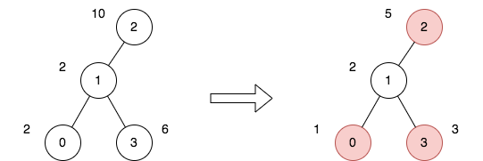

## 第341场周赛

> 本场只有Q4有点意思，仅以此篇纪念我的LeetCode周赛AK。


### Q4 最小化旅行的价格总和

- [2646. Minimize the Total Price of the Trips](https://leetcode.cn/problems/minimize-the-total-price-of-the-trips/)


现有一棵无向、无根的树，树中有 $n$ 个节点，按从 $0$ 到 $n - 1$ 编号。给你一个整数 $n$ 和一个长度为 $n - 1$ 的二维整数数组 $edges$ ，其中 $edges[i] = [a_i, b_i]$ 表示树中节点 $a_i$ 和 $b_i$ 之间存在一条边。

每个节点都关联一个价格。给你一个整数数组 $price$ ，其中 $price[i]$ 是第 $i$ 个节点的价格。

给定路径的 **价格总和** 是该路径上所有节点的价格之和。

另给你一个二维整数数组 $trips$ ，其中 $trips[i] = [start_i, end_i]$ 表示您从节点 $start_i$ 开始第 $i$ 次旅行，并通过任何你喜欢的路径前往节点 $end_i$ 。

在执行第一次旅行之前，你可以选择一些 **非相邻节点** 并将价格减半。

返回执行所有旅行的最小价格总和。

**示例 1**：




```
输入：n = 4, edges = [[0,1],[1,2],[1,3]], price = [2,2,10,6], trips = [[0,3],[2,1],[2,3]]
输出：23
解释：
上图表示将节点 2 视为根之后的树结构。第一个图表示初始树，第二个图表示选择节点 0 、2 和 3 并使其价格减半后的树。
第 1 次旅行，选择路径 [0,1,3] 。路径的价格总和为 1 + 2 + 3 = 6 。
第 2 次旅行，选择路径 [2,1] 。路径的价格总和为 2 + 5 = 7 。
第 3 次旅行，选择路径 [2,1,3] 。路径的价格总和为 5 + 2 + 3 = 10 。
所有旅行的价格总和为 6 + 7 + 10 = 23 。可以证明，23 是可以实现的最小答案。
```

**示例 2**：

```
输入：n = 2, edges = [[0,1]], price = [2,2], trips = [[0,0]]
输出：1
解释：
上图表示将节点 0 视为根之后的树结构。第一个图表示初始树，第二个图表示选择节点 0 并使其价格减半后的树。 
第 1 次旅行，选择路径 [0] 。路径的价格总和为 1 。 
所有旅行的价格总和为 1 。可以证明，1 是可以实现的最小答案。
```

**提示**：

- $1 \le n \le 50$
- `edges.length == n - 1`
- $0 \le a_i,\, b_i \le n - 1$
- `edges` 表示一棵有效的树
- `price.length == n`
- `price[i]` 是一个偶数
- $1 \le price[i] \le 1000$
- $1 \le trips.length \le 100$
- $0 \le start_i,\, end_i \le n - 1$


#### 思路

看到**非相邻节点**的价格减半，自然而然想到了**打家劫舍系列**的[337. 打家劫舍 III](https://leetcode.cn/problems/house-robber-iii/)。只要通过一次`DFS`+`树状DP`判断即可，**树状DP**如何考虑呢？我们把他展平，对于每个节点，有两种情况，**选**或者**不选**。如果当前节点可以价格减半，那么其**相邻节点都不能选**；若不是，当前节点的**相邻节点可选可不选**，那我们有如下递推方程：（`0`表示**不选当前节点**`current`；`1`表示**选择当前节点**`current`作为**价格减半**）
$$
\begin{aligned}
dp[current][1] &= \cdots + \sum_{son \neq father}{dp[son][0]} \\
dp[current][0] &= \cdots + \sum_{som \neq father}{\min(dp[son][0],dp[son][1])}
\end{aligned}
$$
那么$\cdots$这个部分应该填入点什么呢？我们发现，我们需要的是当前节点的访问数，为什么呢，访问过当前节点就会给总费用增加$price_i$或者$\frac{price_i}{2}$。所以，我们修改一下递推方程：
$$
\begin{aligned}
dp[cur][1] &= price_{cur} \times visits_{cur} + \sum_{son \neq father}{dp[son][0]} \\
dp[cur][0] &= \frac{price_{cur}}{2} \times visits_{cur} + \sum_{som \neq father}{\min(dp[son][0],dp[son][1])}
\end{aligned}
$$
现在剩下唯一一个问题，如何统计当前节点访问过多少次呢？我们看一下题目，明显是要求A点到B点的最短路。如果我们在图中，第一反应是**Floyd算法**，复杂度是$O(n^3)$。但是我们在树里是可以简化的，怎么简化呢？最常见的是`BFS`，但是`BFS`不利于统计经过的节点，**我们找到了终点B点，就要反向传播回起点A点**。这句话正好对应了**回溯+传递**，那显然就是`DFS`了，我们只要判断是否搜到了终点，然后返回是终点，那么父节点自然也是树上的“关键路径”，因此`visits`也要累加，最终效果看看代码吧。


#### 代码

```go
func minimumTotalPrice(n int, edges [][]int, price []int, trips [][]int) int {
	list := make([][]int, n)
	for _, edge := range edges {
		list[edge[0]] = append(list[edge[0]], edge[1])
		list[edge[1]] = append(list[edge[1]], edge[0])
	}

	// count traverse nodes
	vis := make([]int, n)
	var dfs func(fa int, cur int, end int) bool
	dfs = func(fa int, cur int, end int) (res bool) {
		for _, next := range list[cur] {
			if next == end {
				vis[next]++
				res = true
			} else if next != fa {
				res = dfs(cur, next, end)
			}
			if res {
				vis[cur]++
				break
			}
		}
		return res
	}

	for _, trip := range trips {
		start, end := trip[0], trip[1]
		if start == end {
			vis[start]++
		} else {
			dfs(-1, start, end)
		}
	}

	// tree DP to find the node cut
	var dfs2 func(fa int, cur int) (int, int)
	dfs2 = func(fa int, cur int) (curNoCut int, curCut int) {
		for _, next := range list[cur] {
			if next != fa {
				c1, c2 := dfs2(cur, next)
				curNoCut += min(c1, c2)
				curCut += c1
			}
		}
		curCut += vis[cur] * (price[cur] / 2)
		curNoCut += vis[cur] * price[cur]
		return
	}

	c1, c2 := dfs2(-1, 0)
	return min(c1, c2)
}

func min(a, b int) int {
	if a < b {
		return a
	}
	return b
}
```


#### 复杂度

- **时间复杂度**：$O(n^2)$
- **空间复杂度**：$O(n)$