## 堆（Heap）

- 一般也就用到**大顶堆**和**小顶堆**，顶堆的定义是递归进行的，其父节点的权值**不小于**/**不大于**其子节点，下面将以**大顶堆**为例来介绍顶堆的基本操作。

#### 大顶堆

- **底层实现**：数组（切片！但是我就是乐意叫他数组！）

- **哨兵**：

  - 设定数组下标为 `0` 的元素为场景中最大元；

  - 由于使用数组，最好是节点下标从 `1` 开始，而非 `0` ，这对于二叉树的向下扩展很有利，因为对于任意节点 `i` ，其父节点为 `i/2` ，其左右孩子，如果存在，分别为 `i*2` 和 `i*2+1`。

    ```go
    heap := []int{math.MaxInt}
    size := 0
    ```

- **插入**：

  1. 将新的元素加入数组尾部，然后**向上调整**：若当前节点权值大于父节点，则交换，否则结束；

     

     ```go
     func insert(val int) {
         heap = append(heap, val)
         size++
         for i := size; heap[i/2] < heap[i]; i /= 2 {
             heap[i/2], heap[i] = heap[i], heap[i/2]
         }
     }
     ```

- **删除**：

  1. 返回堆顶元素，即下标为 `1` 的元素，然后把数组尾的元素与其交换，然后**向下调整**；

  2. **向下调整**：在该结点的儿子中，找一个最大的，与该结点交换，重复此过程直到底层。

     ```go
     func delete() (res int) {
         res = heap[1]
         heap[1] = heap[size]
         size--
         for i := 1; (i*2 <= size && heap[i] < heap[i*2]) || (i*2+1 <= size && heap[i] < heap[i*2+1]); {
             if i*2+1 > size || heap[i*2] > heap[i*2+1] {
                 heap[i], heap[i*2] = heap[i*2], heap[i]
                 i = i * 2
             } else {
                 heap[i], heap[i*2+1] = heap[i*2+1], heap[i]
                 i = i*2 + 1
             }
         }
         return
     }
     ```

- **更新**：

  1. 类似于**插入**和**删除**操作，按规则**向上/向下调整**。

#### Golang Heap

- 本质上是要实现 `heap.Interface{}` 这个接口，这个接口又要实现 `sort.Interface{}` 接口...😅

```go
type Heap []int

func (h Heap) Len() int { return len(h) }

func (h Heap) Less(i, j int) bool { return h[i] < h[j] }

func (h Heap) Swap(i, j int) { h[i], h[j] = h[j], h[i] }

func (h *Heap) Pop() interface{} {
	old := *h
	n := len(old)
	x := old[n-1]
	*h = old[0 : n-1]
	return x
}

func (h *Heap) Push(val interface{}) {
	*h = append(*h, val.(int))
}
```

```go
h := &Heap{}
heap.Init(h)
for _, num := range nums {
    heap.Push(h, num)
    if h.Len() > k {
        heap.Pop(h)
    }
}
return heap.Pop(h).(int)
```


#### 经典堆问题

- **TopK问题**：求第 `K` 小值维护最大大小为 `K` 的大顶堆，比堆顶元素大忽略，否则弹出堆顶然后插入该元素，直到结束；（`ID-1` `ID-2`）

- **中位数问题**：求中位数（[295. Find Median from Data Stream](https://leetcode.cn/problems/find-median-from-data-stream/) `ID-3`），维护一个大顶堆和一个小顶堆，大顶堆里存小值而小顶堆存大值，维护两个堆使得大顶堆内的数据等于小顶堆或者正好等于小顶堆内数据加一。

  > [4. Median of Two Sorted Arrays](https://leetcode.cn/problems/median-of-two-sorted-arrays/) 也可以用中位数问题的思想过，虽然正确的题解不是那样的...🤔

- **CPU问题**：维护一个空资源堆，维护一个运行堆，运行堆为到期时间的小顶堆。（[1834. Single-Threaded CPU](https://leetcode.cn/problems/single-threaded-cpu/)，虽然这题 [1882. Process Tasks Using Servers](https://leetcode.cn/problems/process-tasks-using-servers/) 没调出来，实在想不到哪里有错了...😭）

#### 堆的例题

| ID   | LeetCode 题号                                                | 描述            | 思路            |
| ---- | ------------------------------------------------------------ | --------------- | --------------- |
| 1    | [215. Kth Largest Element in an Array](https://leetcode.cn/problems/kth-largest-element-in-an-array/) | 第K大值         | 大小为K的小顶堆 |
| 2    | [347. Top K Frequent Elements](https://leetcode.cn/problems/top-k-frequent-elements/) | 第K常见的值     | 大小为K的小顶堆 |
| 3    | [295. Find Median from Data Stream](https://leetcode.cn/problems/find-median-from-data-stream/) | 中位数          | 双堆维护        |
| 4    | [4. Median of Two Sorted Arrays](https://leetcode.cn/problems/median-of-two-sorted-arrays/) | 中位数          | 双堆维护        |
| 5    | [1882. Process Tasks Using Servers](https://leetcode.cn/problems/process-tasks-using-servers/) | Server-Task调度 | 双堆            |
| 6    | [1834. Single-Threaded CPU](https://leetcode.cn/problems/single-threaded-cpu/) | CPU调度         | 堆              |

| 题                    | 题   | 题   | 题   |
| --------------------- | ---- | ---- | ---- |
| 253. Meeting Rooms II |      |      |      |

