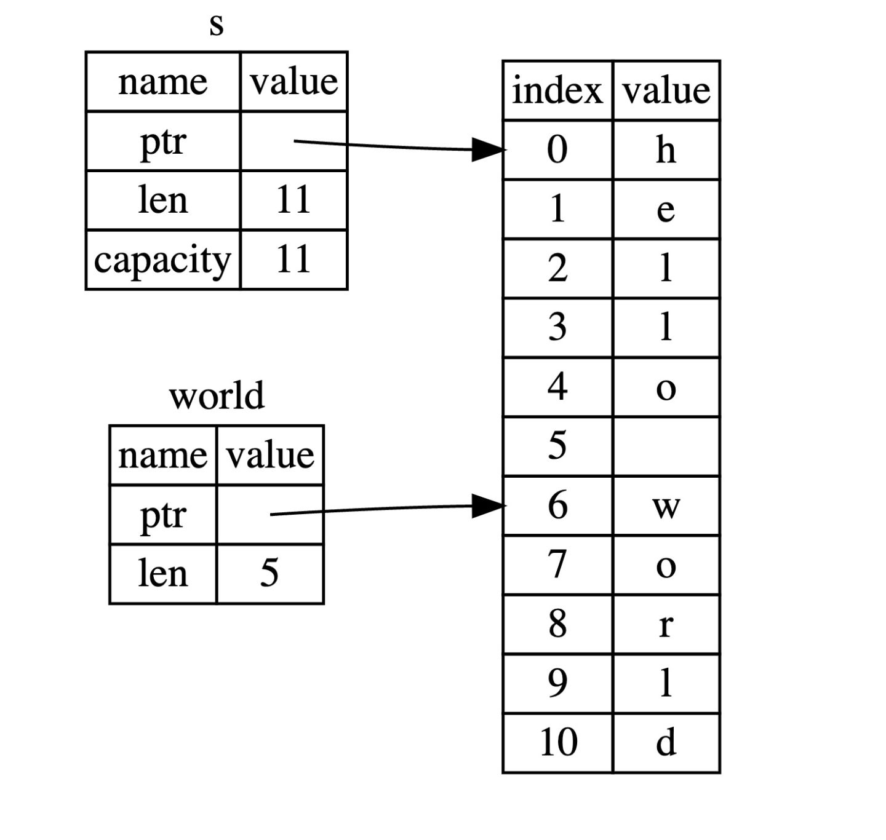
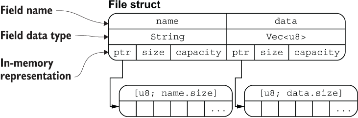

## 自定义类型

- 为了能够更加高效地描述变量，我们往往会使用源于基础类型但是高于基础类型的自定义类型，当然一部分自定义类型会被收录进 `std` 库中，成为约定俗成的一部分。

  自定义类型最典型的就是像 C/Go 语言中的**结构体** `struct` 或者 Java 中的 `Object` 。当然， **Rust** 没有 `Object` ，但是，自定义类型会多出一个 `enum` ，这里的**枚举类型**不仅能够像 C语言中的枚举类型一样使用，也有其他妙用。 Python 或者 Java 中也常出现另外一种基础类型的组合，即**元组** `(a ,b, ...)` ，**Rust** 也支持这种自定义类型。

  例如平面上的一个点 `point(x, y)`，它由两个数值类型的值 `x` 和 `y` 组合而来。我们无法单独去维护这两个数值，因为单独一个 `x` 或者 `y` 是含义不完整的，无法标识平面上的一个点，应该把它们看作一个整体去理解和处理。

  来看一段代码，它使用我们之前学过的内容来构建文件操作：

  ```rust
  #![allow(unused_variables)]
  type File = String;
  
  fn open(f: &mut File) -> bool {
      true
  }
  fn close(f: &mut File) -> bool {
      true
  }
  
  #[allow(dead_code)]
  fn read(f: &mut File, save_to: &mut Vec<u8>) -> ! {
      unimplemented!()
  }
  
  fn main() {
      let mut f1 = File::from("f1.txt");
      open(&mut f1);
      //read(&mut f1, &mut vec![]);
      close(&mut f1);
  }
  ```

- 接下来我们的学习非常类似原型设计：有的方法只提供 API 接口，但是不提供具体实现。此外，有的变量在声明之后并未使用，因此在这个阶段我们需要排除一些编译器噪音（Rust 在编译的时候会扫描代码，变量声明后未使用会以 `warning` 警告的形式进行提示），引入 `#![allow(unused_variables)]` 属性标记，该标记会告诉编译器忽略未使用的变量，不要抛出 `warning` 警告,具体的常见编译器属性你可以在这里查阅：[编译器属性标记](https://course.rs/profiling/compiler/attributes.html)。

- `read` 函数也非常有趣，它返回一个 `!` 类型，这个表明该函数是一个发散函数，不会返回任何值，包括 `()`。`unimplemented!()` 告诉编译器该函数尚未实现，`unimplemented!()` 标记通常意味着我们期望快速完成主要代码，回头再通过搜索这些标记来完成次要代码，类似的标记还有 `todo!()`，当代码执行到这种未实现的地方时，程序会直接报错。你可以反注释 `read(&mut f1, &mut vec![]);` 这行，然后再观察下结果。

- 同时，从代码设计角度来看，关于文件操作的类型和函数应该组织在一起，散落得到处都是，是难以管理和使用的。而且通过 `open(&mut f1)` 进行调用，也远没有使用 `f1.open()` 来调用好，这就体现出了只使用基本类型的局限性：**无法从更高的抽象层次去简化代码**。

  接下来，我们将引入一个高级数据结构 —— 结构体 `struct`，来看看复合类型是怎样更好的解决这类问题。 开始之前，先来看看 **Rust** 的重点也是难点：字符串 `String` 和 `&str`。


### 切片（Slice）

- 在介绍 **Rust** 字符串之前先看一下 **Rust** 里**切片**类型的处理方式。切片并不是 **Rust** 独有的概念，在 Go 语言中就非常流行，它允许你引用集合中部分连续的元素序列，而不是引用整个集合。

##### 字符串切片

- 对于字符串而言，切片就是对 `String` 类型中某一部分的引用，它看起来像这样：

  ```rust
  let s: String = String::from("hello world!");
  let hello = &s[0..5];		// 等效于 let hello = &s[..5];
  let world = &s[6..=10];		// 等效于 let world = &s[6..11];
  							// 等效于 let world = &s[6..s.len()];
  							// 等效于 let world = &s[6..];
  println!("{} {}", hello, world);
  ```

  `hello` 没有引用整个 `String s`，而是引用了 `s` 的一部分内容，通过 `[0..5]` 的方式来指定。

- 切片通过 `[a..b]` 或者 `[a..=b]` 来创建，前者表示 $[a,b)$ 的区间而后者表示 $[a,b]$ 的区间。在切片数据结构内部会保存**开始的位置**和**切片的长度**，其中长度是通过计算得来的。

  

> 在对字符串使用切片语法时需要格外小心，切片的索引必须落在字符之间的边界位置，也就是 UTF-8 字符的边界，例如中文在 UTF-8 中占用三个字节，下面的代码就会崩溃：
>
> ```rust
>  let s = "中国人";
>  let a = &s[0..2];
>  println!("{}",a);
> ```
>
> 因为我们只取 `s` 字符串的前两个字节，但是本例中每个汉字占用三个字节，因此没有落在边界处，也就是连 `中` 字都取不完整，此时程序会直接崩溃退出，如果改成 `&s[0..3]`，则可以正常通过编译。 因此，当你需要对字符串做切片索引操作时，需要格外小心这一点, 关于该如何操作 UTF-8 字符串，会在[字符串（String and str）](#字符串（String and str）) 中讲到。

- 字符串切片的类型标识是 `&str`，因此我们可以这样声明一个函数，输入 `String` 类型，返回它的切片： `fn first_word(s: &String) -> &str `。

- 有了切片就可以写出这样的代码：

  ```rust
  fn main() {
      let mut s = String::from("hello world");
      let word = first_word(&s);
      s.clear(); // error!
      println!("the first word is: {}", word);
  }
  
  fn first_word(s: &String) -> &str {
  	return &s[..1];
  }
  ```

  编译器报错如下：

  ```shell
  error[E0502]: cannot borrow `s` as mutable because it is also borrowed as immutable
    --> src/main.rs:18:5
     |
  16 |     let word = first_word(&s);
     |                           -- immutable borrow occurs here
  17 |
  18 |     s.clear(); // error!
     |     ^^^^^^^^^ mutable borrow occurs here
  19 |
  20 |     println!("the first word is: {}", word);
     |                                       ---- immutable borrow later used here
  ```

  回忆一下借用的规则：当我们已经有了可变借用时，就无法再拥有不可变的借用。因为 `clear` 需要清空改变 `String`，因此它需要一个可变借用（利用 VSCode 可以看到该方法的声明是 `pub fn clear(&mut self)` ，参数是对自身的可变借用 ）；而之后的 `println!` 又使用了不可变借用，也就是在 `s.clear()` 处可变借用与不可变借用试图同时生效，因此编译无法通过。这么写则能过：

  ```rust
  fn main() {
      let mut s = String::from("hello world");
  
      let word = first_word(&s);
      println!("the first word is: {}", word);
  
      s.clear();
  
  }
  fn first_word(s: &String) -> &str {
      &s[..1]
  }
  ```

##### 其他切片

- 因为切片是对集合的部分引用，因此不仅仅字符串有切片，其它集合类型也有，例如数组：

  ```rust
  let a = [1, 2, 3, 4, 5];
  let slice = &a[1..3];
  assert_eq!(slice, &[2, 3]);
  ```

  该数组切片的类型是 `&[i32]`，数组切片和字符串切片的工作方式是一样的，例如持有一个引用指向原始数组的某个元素和长度。


### 字符串（String and str）

- 首先来看段很简单的代码：

  ```rust
  fn main() {
    let my_name = "Pascal";
    greet(my_name);
  }
  
  fn greet(name: String) {
    println!("Hello, {}!", name);
  }
  ```

  `greet` 函数接受一个字符串类型的 `name` 参数，然后打印到终端控制台中，但是编译器并不会让你过：

  ```shell
  error[E0308]: mismatched types
   --> src/main.rs:3:11
    |
  3 |     greet(my_name);
    |           ^^^^^^^
    |           |
    |           expected struct `std::string::String`, found `&str`
    |           help: try using a conversion method: `my_name.to_string()`
  
  error: aborting due to previous error
  ```

  编译器提示 `greet` 函数需要一个 `String` 类型的字符串，却传入了一个 `&str` 类型的字符串，那么两者区别在哪呢？接下来的各个章节会细细切成臊子。👇


#### 字符串字面量是切片

- 字符串字面量的类型是 `&str` ，其本质是个切片，该切片指向了程序可执行文件中的某个点，这也是为什么字符串字面量是不可变的，因为 `&str` 是一个不可变引用：

  ```rust
  let s = "Hello, world!";
  // 等价于 let s: &str = "Hello, world!";
  ```

> 但是 `s` 可以是**可变变量**，根据之前提及的所有权理论，这里显然触发了某种 `Copy` ：
>
> ```rust
> fn main() {
>     let mut s = "11223";
>     let t=s;
>     s = &s[1..];
>     println!("{} -> {}",t, s);
> }
> // output
> // 11223 -> 1223
> ```


#### 字符串

- 顾名思义，字符串是由字符组成的连续集合，但是在上一节中我们提到过，**Rust 中的字符是 Unicode 类型，因此每个字符占据 4 个字节内存空间，但是在字符串中不一样，字符串是 UTF-8 编码，也就是字符串中的字符所占的字节数是变化的（1 - 4）**，这样有助于大幅降低字符串所占用的内存空间。

- **Rust** 在语言级别，只有一种字符串类型： `str`，它通常是以引用类型出现 `&str`，也就是上文提到的字符串切片。虽然语言级别只有上述的 `str` 类型，但是在标准库里，还有多种不同用途的字符串类型，其中使用最广的即是 `String` 类型。

  除了 `String` 类型的字符串，Rust 的标准库还提供了其他类型的字符串，例如 `OsString`， `OsStr`， `CsString` 和` CsStr` 等，注意到这些名字都以 `String` 或者 `Str` 结尾了吗？它们分别对应的是**具有所有权**和**被借用的变量**。


#### String 与 &str 的转换

- 在之前的代码中，已经见到好几种从 `&str` 类型生成 `String` 类型的操作：

  - `String::from("hello,world")`
  - `"hello,world".to_string()`

  那么如何将 `String` 类型转为 `&str` 类型呢？答案很简单，取引用即可：

  ```rust
  fn main() {
      let s = String::from("hello,world!");
      say_hello(&s);
      say_hello(&s[..]);
      say_hello(s.as_str());
  }
  
  fn say_hello(s: &str) {
      println!("{}",s);
  }
  ```

- 实际上这种灵活用法是因为 `deref` 隐式强制转换，具体我们会在 [`Deref` 特征](https://course.rs/advance/smart-pointer/deref.html)进行详细讲解。


#### 字符串索引

- 在其它语言中，使用索引的方式访问字符串的某个字符或者子串是很正常的行为，但是在 Rust 中就会报错：

  ```rust
  let s1 = String::from("hello");
  let h = s1[0];
  ```

  该代码会产生如下错误：

  ```shell
  3 |     let h = s1[0];
    |             ^^^^^ `String` cannot be indexed by `{integer}`
    |
    = help: the trait `Index<{integer}>` is not implemented for `String`
  ```

##### 深入字符串内部

- 字符串的底层的数据存储格式实际上是 `[u8]` ，一个字节数组。对于 `let hello = String::from("Hola");` 这行代码来说，`Hola` 的长度是 `4` 个字节，因为 `"Hola"` 中的每个字母在 UTF-8 编码中仅占用 1 个字节。

  但是对于 `let hello = String::from("中国人");` ，其实际长度是 `9` 个字节的长度，因为大部分常用汉字在 UTF-8 中的长度是 `3` 个字节，因此这种情况下对 `hello` 进行索引，访问 `&hello[0]` 没有任何意义，因为你取不到 `中` 这个字符，而是取到了这个字符三个字节中的第一个字节，这是一个非常奇怪而且难以理解的返回值。

##### 字符串的不同表现形式

- 现在看一下用梵文写的字符串 `“नमस्ते”`, 它底层的字节数组如下形式：

  ```rust
  [224, 164, 168, 224, 164, 174, 224, 164, 184, 224, 165, 141, 224, 164, 164, 224, 165, 135]
  ```

  长度是 18 个字节，这也是计算机最终存储该字符串的形式。如果从字符的形式去看，则是：

  ```rust
  ['न', 'म', 'स', '्', 'त', 'े']
  ```

  但是这种形式下，第四和六两个字母根本就不存在，没有任何意义，接着再从字母串的形式去看：

  ```rust
  ["न", "म", "स्", "ते"]
  ```

  所以，可以看出来 Rust 提供了不同的字符串展现方式，这样程序可以挑选自己想要的方式去使用，而无需去管字符串从人类语言角度看长什么样。

- 还有一个原因导致了 **Rust** 不允许去索引字符串：因为索引操作，我们总是期望它的性能表现是 $O(1)$，然而对于 `String` 类型来说，无法保证这一点，因为 **Rust** 可能需要从 0 开始去遍历字符串来定位合法的字符。


#### 操作字符串

- 由于 `String` 是可变字符串，下面介绍 **Rust** 字符串的**修改**，**添加**，**删除**等常用方法：

##### Push

- 在字符串尾部可以使用 `push()` 方法追加字符 `char`，也可以使用 `push_str()` 方法追加字符串字面量。这两个方法都是**在原有的字符串上追加，并不会返回新的字符串**。由于字符串追加操作要修改原来的字符串，则该字符串必须是可变的，即**字符串变量必须由 `mut` 关键字修饰**：

  ```rust
  fn main() {
      let mut s = String::from("Hello");
      s.push(' ');
      s.push_str("World!");
      println!("{}", s);
  }
  // Hello World
  ```

##### Insert

- 可以使用 `insert()` 方法插入单个字符 `char`，也可以使用 `insert_str()` 方法插入字符串字面量，与 `push()` 方法不同，这俩方法需要传入两个参数，第一个参数是字符（串）插入位置的索引，第二个参数是要插入的字符（串），索引从 0 开始计数，如果越界则会发生错误。由于字符串插入操作要**修改原来的字符串**，则该字符串必须是可变的，即**字符串变量必须由 `mut` 关键字修饰**：

  ```rust
  fn main() {
      let mut s = String::from("Hello");
      s.insert_str(s.len(), "World");
      s.insert(5, ' ');
      println!("{}", s);
  }
  // Hello World
  ```

##### Replace

- 如果想要把字符串中的某个字符串替换成其它的字符串，那可以使用 `replace()` 方法。与替换有关的方法有三个。

  1. `replace()` —— 该方法可适用于 `String` 和 `&str` 类型。`replace()` 方法接收两个参数，第一个参数是要被替换的字符串，第二个参数是新的字符串。该方法会替换所有匹配到的字符串。**该方法是返回一个新的字符串，而不是操作原来的字符串**：

     ```rust
     fn main() {
         let string_replace = String::from("I like rust. Learning rust is my favorite!");
         let new_string_replace = string_replace.replace("rust", "RUST");
         dbg!(new_string_replace);
     }
     ```

  2. `replacen()` —— 该方法可适用于 `String` 和 `&str` 类型。`replacen()` 方法接收三个参数，前两个参数与 `replace()` 方法一样，第三个参数则表示替换的个数。**该方法是返回一个新的字符串，而不是操作原来的字符串**：

     ```rust
     fn main() {
         let string_replace = "I like rust. Learning rust is my favorite!";
         let new_string_replacen = string_replace.replacen("rust", "RUST", 1);
         dbg!(new_string_replacen);
     }
     ```

  3. `replace_range()` —— 该方法仅适用于 `String` 类型。`replace_range` 接收两个参数，第一个参数是要替换字符串的范围（Range），第二个参数是新的字符串。**该方法是直接操作原来的字符串，不会返回新的字符串。该方法需要使用 `mut` 关键字修饰**：

     ```rust
     fn main() {
         let mut string_replace_range = String::from("I like rust!");
         string_replace_range.replace_range(7..8, "R");
         dbg!(string_replace_range);
     }
     ```

##### Delete

- 与字符串删除相关的方法有 4 个，他们分别是 `pop()`，`remove()`，`truncate()`，`clear()`。这四个方法仅适用于 `String` 类型。

  1. `pop()` —— 删除并返回字符串的最后一个字符，**该方法是直接操作原来的字符串**。但是存在返回值，其返回值是一个 `Option` 类型，如果字符串为空，则返回 `None`。 示例代码如下：

     ```rust
     fn main() {
         let mut string_pop = String::from("rust pop 中文!");
         let p1 = string_pop.pop();
         let p2 = string_pop.pop();
         dbg!(p1);
         dbg!(p2);
         dbg!(string_pop);
     }
     ```

  2. `remove()` —— 删除并返回字符串中指定位置的字符，**该方法是直接操作原来的字符串**。但是存在返回值，其返回值是删除位置的字符串，只接收一个参数，表示该字符起始索引位置。`remove()` 方法是按照字节来处理字符串的，如果参数所给的位置不是合法的字符边界，则会发生错误：

     ```rust
     fn main() {
         let mut string_remove = String::from("测试remove方法");
         println!(
             "string_remove 占 {} 个字节",
             std::mem::size_of_val(string_remove.as_str())
         );
         // 删除第一个汉字
         string_remove.remove(0);
         // 下面代码会发生错误
         // string_remove.remove(1);
         // 直接删除第二个汉字
         // string_remove.remove(3);
         dbg!(string_remove);
     }
     ```

  3. `truncate()` —— 删除字符串中从指定位置开始到结尾的全部字符，**该方法是直接操作原来的字符串**。无返回值。该方法 `truncate()` 方法是按照字节来处理字符串的，如果参数所给的位置不是合法的字符边界，则会发生错误：

     ```rust
     fn main() {
         let mut string_truncate = String::from("测试truncate");
         string_truncate.truncate(3);
         dbg!(string_truncate);
     }
     ```

  4. `clear()` —— 清空字符串，**该方法是直接操作原来的字符串**。调用后，删除字符串中的所有字符，相当于 `truncate()` 方法参数为 0 的时候：

     ```rust
     fn main() {
         let mut string_clear = String::from("string clear");
         string_clear.clear();
         dbg!(string_clear);
     }
     ```

##### Concatenate（+ / +=）

1. 使用 `+` 或者 `+=` 连接字符串

   使用 `+` 或者 `+=` 连接字符串，要求右边的参数必须为字符串的切片引用（Slice）类型。其实当调用 `+` 的操作符时，相当于调用了 `std::string` 标准库中的 `add()`方法，这里 `add()` 方法的第二个参数是一个引用的类型。因此我们在使用 `+`， 必须传递切片引用类型。不能直接传递 `String` 类型。**`+` 和 `+=` 都是返回一个新的字符串。所以变量声明可以不需要 `mut` 关键字修饰**。

   ```rust
   fn main() {
       let string_append = String::from("hello ");
       let string_rust = String::from("rust");
       // &string_rust会自动解引用为&str
       let result = string_append + &string_rust;
       let mut result = result + "!";
       result += "!!!";
   
       println!("连接字符串 + -> {}", result);
   }
   ```

   由于调用了 `add()` ，而 `add()` 长这样：

   ```rust
   fn add(self, s: &str) -> String
   ```

   所以 `+=` 右值或者 `+` 的右元必须为 `&str` 类型，这就让如下代码稍显奇怪了：

   ```rust
   fn main() {
       let s1 = String::from("hello,");
       let s2 = String::from("world!");
       // 在下句中，s1的所有权被转移走了，因此后面不能再使用s1
       let s3 = s1 + &s2;
       assert_eq!(s3,"hello,world!");
       // 下面的语句如果去掉注释，就会报错
       // println!("{}",s1);
   }
   // String = String + &str + &str + &str + &str
   // let s = s1 + "-" + &s2 + "-" + &s3;			// legal!!!
   ```

   `self` 是 `String` 类型的字符串 `s1`，该函数说明，只能将 `&str` 类型的字符串切片添加到 `String` 类型的 `s1` 上，然后返回一个新的 `String` 类型，所以 `let s3 = s1 + &s2;` 就很好解释了，将 `String` 类型的 `s1` 与 `&str` 类型的 `s2` 进行相加，最终得到 `String` 类型的 `s3`。

   `s1` 这个变量通过调用 `add()` 方法后，所有权被转移到 `add()` 方法里面， `add()` 方法调用后就被释放了，同时 `s1` 也被释放了。再使用 `s1` 就会发生错误。这里涉及到[所有权转移（Move）](https://course.rs/basic/ownership/ownership.html#转移所有权)的相关知识。

2. 使用 `format!` 连接字符串

   `format!` 这种方式适用于 `String` 和 `&str` 。`format!` 的用法与 `print!` 的用法类似，详见[格式化输出](https://course.rs/basic/formatted-output.html#printprintlnformat)：

   ```rust
   fn main() {
       let s1 = "hello";
       let s2 = String::from("rust");
       let s = format!("{} {}!", s1, s2);
       println!("{}", s);
   }
   // hello rust!
   ```


#### 字符串转义

我们可以通过转义的方式 `\` 输出 ASCII 和 Unicode 字符。

```rust
fn main() {
    // 通过 \ + 字符的十六进制表示，转义输出一个字符
    let byte_escape = "I'm writing \x52\x75\x73\x74!";
    println!("What are you doing\x3F (\\x3F means ?) {}", byte_escape);

    // \u 可以输出一个 unicode 字符
    let unicode_codepoint = "\u{211D}";
    let character_name = "\"DOUBLE-STRUCK CAPITAL R\"";

    println!(
        "Unicode character {} (U+211D) is called {}",
        unicode_codepoint, character_name
    );

    // 换行了也会保持之前的字符串格式
    let long_string = "String literals
                        can span multiple lines.
                        The linebreak and indentation here ->\
                        <- can be escaped too!";
    println!("{}", long_string);
}
```

当然，在某些情况下，可能你会希望保持字符串的原样，**不要转义**：

```rust
fn main() {
    println!("{}", "hello \\x52\\x75\\x73\\x74");
    let raw_str = r"Escapes don't work here: \x3F \u{211D}";
    println!("{}", raw_str);

    // 如果字符串包含双引号，可以在开头和结尾加 #
    let quotes = r#"And then I said: "There is no escape!""#;
    println!("{}", quotes);

    // 如果还是有歧义，可以继续增加，没有限制
    let longer_delimiter = r###"A string with "# in it. And even "##!"###;
    println!("{}", longer_delimiter);
}
```


#### 操作 UTF-8 字符串

1. **Rust** 字符 —— 如果你想要以 Unicode 字符的方式遍历字符串，最好的办法是使用 `chars` 方法，例如：

   ```rust
   for c in "中国人".chars() {
       println!("{}", c);
   }
   ```

2. 字节 —— 这种方式是返回字符串的底层字节数组表现形式：

   ```rust
   for b in "中国人".bytes() {
       println!("{}", b);
   }
   ```

3. 获取子串 —— 想要准确的从 UTF-8 字符串中获取子串是较为复杂的事情，例如想要从 `holla中国人नमस्ते` 这种变长的字符串中取出某一个子串，使用标准库你是做不到的。 你需要在 `crates.io` 上搜索 `utf8` 来寻找想要的功能。可以考虑尝试下这个库：[utf8_slice](https://crates.io/crates/utf8_slice)。


#### 字符串剖析

- 那么问题来了，为啥 `String` 可变，而字符串字面值 `str` 却不可以？

  就字符串字面值来说，我们在编译时就知道其内容，最终字面值文本**被直接硬编码进可执行文件中**，这使得字符串字面值快速且高效，这主要得益于字符串字面值的不可变性。不幸的是，我们不能为了获得这种性能，而把每一个在编译时大小未知的文本都放进内存中（你也做不到！），因为有的字符串是在程序运行得过程中动态生成的。

- 对于 `String` 类型，为了支持一个可变、可增长的文本片段，需要在堆上分配一块在编译时未知大小的内存来存放内容，这些都是在程序运行时完成的：

  - 首先向操作系统请求内存来存放 `String` 对象
  - 在使用完成后，将内存释放，归还给操作系统

  其中第一部分由 `String::from` 完成，它创建了一个全新的 `String`。

  重点来了，到了第二部分，就是百家齐放的环节，在有**垃圾回收 GC** 的语言中，GC 来负责标记并清除这些不再使用的内存对象，这个过程都是自动完成，无需开发者关心，非常简单好用；但是在无 GC 的语言中，需要开发者手动去释放这些内存对象，就像创建对象需要通过编写代码来完成一样，未能正确释放对象造成的后果简直不可估量。

- 对于 **Rust** 而言，安全和性能是写到骨子里的核心特性，如果使用 GC，那么会牺牲性能；如果使用手动管理内存，那么会牺牲安全，这该怎么办？为此，**Rust** 的开发者想出了一个无比惊艳的办法：变量在离开作用域后，就自动释放其占用的内存：

  ```rust
  {
      let s = String::from("hello"); // 从此处起，s 是有效的
  
      // 使用 s
  }                                  // 此作用域已结束，
                                     // s 不再有效，内存被释放
  ```

  与其它系统编程语言的 `free` 函数相同，**Rust** 也提供了一个释放内存的函数： `drop`，但是不同的是，其它语言要手动调用 `free` 来释放每一个变量占用的内存，而 **Rust** 则在变量离开作用域时，自动调用 `drop` 函数: 上面代码中，Rust 在结尾的 `}` 处自动调用 `drop`。

> 其实，在 C++ 中，也有这种概念: ***Resource Acquisition Is Initialization (RAII)***。如果你使用过 RAII 模式的话应该对 Rust 的 `drop` 函数并不陌生。


### 元组（Tuple）

- 元组是由多种类型组合到一起形成的，因此它是复合类型，元组的长度是固定的，元组中元素的顺序也是固定的：

  ```rust
  let tup: (i32, f32, char) = (500, 0.23, '我');
  ```

1. **解构元组** —— 之前在解构中提及的匹配方法：

   ```rust
   let tup = (500, 6.4, 1);
   let (x, y, z) = tup;
   ```

2. **访问元组元素** —— Rust 提供了 `.` 的访问方式，和其它语言的数组、字符串一样，元组的索引从 0 开始：

   ```rust
   let x: (i32, f64, u8) = (500, 6.4, 1);
   let five_hundred = x.0;
   let six_point_four = x.1;
   let one = x.2;
   ```

3. **使用用例** —— 多返回值场景，元组在函数返回值场景很常用，例如下面的代码，可以使用元组返回多个值：

   ```rust
   fn calculate_length(s: String) -> (String, usize) {
       let length = s.len(); // len() 返回字符串的长度
       (s, length)
   }
   
   fn main() {
       let s1 = String::from("hello");
       let (s2, len) = calculate_length(s1);
       println!("The length of '{}' is {}.", s2, len);
   }
   ```

> 在其他语言中，可以用结构体来声明一个三维空间中的点，例如 `Point(10, 20, 30)`，虽然使用 Rust 元组也可以做到：`(10, 20, 30)`，但是这样写有个非常重大的缺陷 —— **不具备任何清晰的含义**，在下一章节中，会提到一种与元组类似的结构体，**元组结构体**，可以解决这个问题。


### 结构体（Struct）

##### 结构体语法

1. **定义结构体**

   ```rust
   struct User {
       active: bool,
       username: String,
       email: String,
       sign_in_count: u64,
   }
   ```

   - 通过关键字 `struct` 定义；
   - 一个清晰明确的结构体 **name** ；
   - 几个有名字的结构体 **field** ；

2. **创建结构体实例**

   ```rust
   let user1 = User {
       email: String::from("someone@example.com"),
       username: String::from("someusername123"),
       active: true,
       sign_in_count: 1,
   };
   ```

   - 初始化实例时，**每个字段**都需要进行初始化；
   - 初始化时的字段顺序**不需要**和结构体定义时的顺序一致；

3. **访问结构体字段**

   通过 `.` 操作符即可访问结构体实例内部的字段值，也可以修改它们：

   ```rust
   let mut user1 = User {
       email: String::from("someone@example.com"),
       username: String::from("someusername123"),
       active: true,
       sign_in_count: 1,
   };
   
   user1.email = String::from("anotheremail@example.com");
   ```

   > 需要注意的是，必须要将结构体实例声明为可变的，才能修改其中的字段，**Rust** **不支持**将某个结构体某个字段**单独**标记为可变。

4. **简化结构体创建**

   ```rust
   fn build_user(email: String, username: String) -> User {
       User {
           email: email,
           username: username,
           active: true,
           sign_in_count: 1,
       }
   }
   ```

   当函数参数和结构体字段同名时，可以直接使用缩略的方式进行初始化：

   ```rust
   fn build_user(email: String, username: String) -> User {
       User {
           email,
           username,
           active: true,
           sign_in_count: 1,
       }
   }
   ```

5. **结构体更新**

   在实际场景中，有一种情况很常见 —— 根据已有的结构体实例，创建新的结构体实例，例如根据已有的 `user1` 实例来构建 `user2`：

   ```rust
   let user2 = User {
       active: user1.active,
       username: user1.username,
       email: String::from("another@example.com"),
       sign_in_count: user1.sign_in_count,
   };
   ```

   看起来很蛋疼，还好 **Rust** 没有那么简陋：

   ```rust
   let user2 = User {
       email: String::from("another@example.com"),
       ..user1
   };
   ```

   因为 `user2` 仅仅在 `email` 上与 `user1` 不同，因此我们只需要对 `email` 进行赋值，剩下的通过结构体更新语法 `..user1` 即可完成。`..` 语法表明凡是我们没有显式声明的字段，全部从 `user1` 中自动获取，**需要注意的是** `..user1` 必须在结构体的尾部使用。

   > 结构体更新语法跟赋值语句 `=` 非常相像，因此在上面代码中，`user1` 的部分字段所有权被转移到 `user2` 中：`username` 字段发生了所有权转移，作为结果，`user1` 无法再被使用。
   >
   > 聪明的读者肯定要发问了：明明有三个字段进行了自动赋值，为何只有 `username` 发生了所有权转移？
   >
   > 仔细回想一下[所有权](https://course.rs/basic/ownership/ownership.html#拷贝浅拷贝)那一节的内容，我们提到了 `Copy` 特征：实现了 `Copy` 特征的类型无需所有权转移，可以直接在赋值时进行 数据拷贝，其中 `bool` 和 `u64` 类型就实现了 `Copy` 特征，因此 `active` 和 `sign_in_count` 字段在赋值给 `user2` 时，仅仅发生了拷贝，而不是所有权转移。
   >
   > 值得注意的是：`username` 所有权被转移给了 `user2`，导致了 `user1` 无法再被使用，但是并不代表 `user1` 内部的其它字段不能被继续使用，例如：
   >
   > ```rust
   > let user1 = User {
   >     email: String::from("someone@example.com"),
   >     username: String::from("someusername123"),
   >     active: true,
   >     sign_in_count: 1,
   > };
   > let user2 = User {
   >     active: user1.active,
   >     username: user1.username,
   >     email: String::from("another@example.com"),
   >     sign_in_count: user1.sign_in_count,
   > };
   > // 👇 ok!
   > println!("{}", user1.active);
   > // 👇 这行会报错：error[E0382]: borrow of partially moved value: `user1`
   > println!("{:?}", user1);
   > ```


##### 结构体的内存排列

- 针对以下代码：

  ```rust
  #[derive(Debug)]
   struct File {
     name: String,
     data: Vec<u8>,
   }
  
   fn main() {
     let f1 = File {
       name: String::from("f1.txt"),
       data: Vec::new(),
     };
  
     let f1_name = &f1.name;
     let f1_length = &f1.data.len();
  
     println!("{:?}", f1);
     println!("{} is {} bytes long", f1_name, f1_length);
   }
  ```

  上面定义的 `File` 结构体在内存中的排列如下图所示： 

  

- 从图中可以清晰的看出 `File` 结构体两个字段 `name` 和 `data` 分别拥有底层两个 `[u8]` 数组的所有权（`String` 类型的底层也是 `[u8]` 数组），通过 `ptr` 指针指向底层数组的内存地址，这里你可以把 `ptr` 指针理解为 **Rust** 中的引用类型。该图片也侧面印证了：**把结构体中具有所有权的字段转移出去后，将无法再访问该字段，但是可以正常访问其它的字段**。


#### 元组结构体（Tuple Struct）

- 结构体必须要有名称，但是结构体的字段**可以没有名称**，这种结构体长得很像元组，因此被称为**元组结构体**，例如：

  ```rust
  struct Color(i32, i32, i32);
  struct Point(i32, i32, i32);
  let black = Color(0, 0, 0);
  let origin = Point(0, 0, 0);
  ```

  **元组结构体**在你希望有一个整体名称，但是又不关心里面字段的名称时将非常有用。例如上面的 `Point` 元组结构体，众所周知 3D 点是 `(x, y, z)` 形式的坐标点，因此我们无需再为内部的字段逐一命名为：`x`, `y`, `z`。


#### 单元结构体（Unit-like Struct）

- 还记得之前讲过的基本没啥用的[单元类型](https://course.rs/basic/base-type/char-bool.html#单元类型)吧？单元结构体就跟它很像，没有任何字段和属性，但是好在，它还挺有用。如果你定义一个类型，但是不关心该类型的内容, 只关心它的行为时，就可以使用 **单元结构体**：

  ```rust
  struct AlwaysEqual;
  let subject = AlwaysEqual;
  // 我们不关心 AlwaysEqual 的字段数据，只关心它的行为，因此将它声明为单元结构体，然后再为它实现某个特征
  impl SomeTrait for AlwaysEqual {}
  ```


#### 结构体数据的所有权

- 在之前的 `User` 结构体的定义中，有一处细节：我们使用了自身拥有所有权的 `String` 类型而不是基于引用的 `&str` 字符串切片类型。这是一个有意而为之的选择 —— **因为我们想要这个结构体拥有它所有的数据，而不是从其它地方借用数据**。

  你也可以让 `User` 结构体从其它对象借用数据，不过这么做，就需要引入[生命周期（lifetimes）](https://course.rs/advance/lifetime/basic.html)这个新概念（也是一个复杂的概念），简而言之，生命周期能确保结构体的作用范围要比它所借用的数据的作用范围要小。总之，如果你想在结构体中使用一个引用，就必须加上生命周期，否则就会报错：

  ```rust
  struct User {
      username: &str,
      email: &str,
      sign_in_count: u64,
      active: bool,
  }
  
  fn main() {
      let user1 = User {
          email: "someone@example.com",
          username: "someusername123",
          active: true,
          sign_in_count: 1,
      };
  }
  ```

  编译器会抱怨它需要生命周期标识符：

  ```shell
  error[E0106]: missing lifetime specifier
   --> src/main.rs:2:15
    |
  2 |     username: &str,
    |               ^ expected named lifetime parameter // 需要一个生命周期
    |
  help: consider introducing a named lifetime parameter // 考虑像下面的代码这样引入一个生命周期
    |
  1 ~ struct User<'a> {
  2 ~     username: &'a str,
    |
  
  error[E0106]: missing lifetime specifier
   --> src/main.rs:3:12
    |
  3 |     email: &str,
    |            ^ expected named lifetime parameter
    |
  help: consider introducing a named lifetime parameter
    |
  1 ~ struct User<'a> {
  2 |     username: &str,
  3 ~     email: &'a str,
    |
  ```

- 未来在[生命周期](https://course.rs/advance/lifetime/basic.html)中会讲到如何修复这个问题以便在结构体中存储引用，不过在那之前，我们会避免在结构体中使用引用类型。


#### Debug 打印结构体信息

- 在前面的代码中我们使用 `#[derive(Debug)]` 对结构体进行了标记，这样才能使用 `println!("{:?}", s);` 的方式对其进行打印输出，不然，等着看报错吧：

  ```shell
  error[E0277]: `Rectangle` doesn't implement `std::fmt::Display`
  ```

  提示我们结构体 `Rectangle` 没有实现 `Display` 特征，这是因为如果我们使用 `{}` 来格式化输出，那对应的类型就必须实现 `Display` 特征，以前学习的基本类型，都默认实现了该特征:

  ```rust
  fn main() {
      let v = 1;
      let b = true;
      println!("{}, {}", v, b);
  }
  ```

  上面代码不会报错，那么结构体为什么不默认实现 `Display` 特征呢？原因在于结构体较为复杂，例如考虑以下问题：你想要逗号对字段进行分割吗？需要括号吗？加在什么地方？所有的字段都应该显示？类似的还有很多，由于这种复杂性，Rust 不希望猜测我们想要的是什么，而是把选择权交给我们自己来实现：如果要用 `{}` 的方式打印结构体，那就自己实现 `Display` 特征。

- 如果你暂时不想实现 `Display` 特征呢，那就试着用 `{:?}` 吧，别忘了在**结构体定义**之前声明 `#[derive(Debug)]` ：

  ```rust
  #[derive(Debug)]
  struct Rectangle {
      width: u32,
      height: u32,
  }
  
  fn main() {
      let rect1 = Rectangle {
          width: 30,
          height: 50,
      };
  
      println!("rect1 is {:?}", rect1);
  }
  ```

  > 当然，首先，**Rust** 有两种实现 `Debug` 的方法可以选择：
  >
  > 1. 手动实现；
  > 2. 使用 `derive` 派生实现；
  >
  > 后者简单的多，但是也有限制，具体见[附录 D](https://course.rs/appendix/derive.html)，这里我们就不再深入讲解。

  > 还有一个简单的输出 debug 信息的方法，那就是使用 [`dbg!` 宏](https://doc.rust-lang.org/std/macro.dbg.html)，它会拿走表达式的所有权，然后打印出相应的文件名、行号等 debug 信息，当然还有我们需要的表达式的求值结果。**除此之外，它最终还会把表达式值的所有权返回！**
  >
  > `dbg!` 输出到标准错误输出 `stderr`，而 `println!` 输出到标准输出 `stdout` 。


