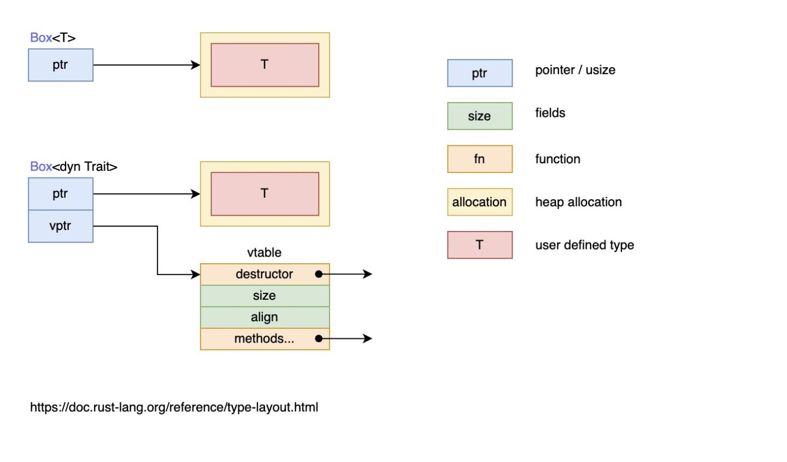

## 特征（Traits）

- 有时候程序员需要根据要进行多种底层实现，但是至于要一个上层抽象接口，就跟 Java 中的接口类型一样或者类似，需要把这些行为抽象出来， **Rust** 中的特征 `trait` 概念就是应对这种需求的。

  在之前的代码中，我们也多次见过特征的使用，例如 `#[derive(Debug)]`，它在我们定义的类型（`struct`）上自动派生 `Debug` 特征，接着可以使用 `println!("{:?}", x)` 打印这个类型；再例如：

  ```rust
  fn add<T: std::ops::Add<Output = T>>(a:T, b:T) -> T { a + b }
  ```

  通过 `std::ops::Add` 特征来限制 `T`，只有 `T` 实现了 `std::ops::Add` 才能进行合法的加法操作，毕竟不是所有的类型都能进行相加。

> 这些都说明一个道理，特征定义了**一个可以被共享的行为，只要实现了特征，你就能使用该行为**。


### 定义特征

- 如果不同的类型具有相同的行为，那么我们就可以定义一个特征，然后为这些类型实现该特征。**定义特征**是把一些方法组合在一起，目的是定义一个实现某些目标所必需的行为的集合。

  例如，例如，我们现在有文章 `Post` 和微博 `Weibo` 两种对平台用户进行摘要推送，也就是无论是文章内容，还是微博内容，都只需要作者等少量信息生成推送信息，那么总结推送信息这个行为就是共享的，因此可以用特征来定义：

  ```rust
  pub trait Summary {
      fn summarize(&self) -> String;
  }
  ```

  - 这里使用 `trait` 关键字来声明一个特征，`Summary` 是特征名。在大括号中定义了该特征的所有方法，在这个例子中是： `fn summarize(&self) -> String` 。
  - 特征只定义行为看起来是什么样的，而不定义行为具体是怎么样的。因此，我们只定义特征方法的签名，而不进行实现，此时方法签名结尾是 `;`，而不是一个 `{}`。

- 接下来，每一个实现这个特征的类型都需要具体实现该特征的相应方法，编译器也会确保任何实现 `Summary` 特征的类型都拥有与这个签名的定义完全一致的 `summarize` 方法。


### 为类型实现特征

- 因为特征只定义行为看起来是什么样的，因此我们需要为类型实现具体的特征，定义行为具体是怎么样的。

- 首先来为 `Post` 和 `Weibo` 实现 `Summary` 特征：

  ```rust
  pub trait Summary {
      fn summarize(&self) -> String;
  }
  pub struct Post {
      pub title: String, // 标题
      pub author: String, // 作者
      pub content: String, // 内容
  }
  
  impl Summary for Post {
      fn summarize(&self) -> String {
          format!("文章{}, 作者是{}", self.title, self.author)
      }
  }
  
  pub struct Weibo {
      pub username: String,
      pub content: String
  }
  
  impl Summary for Weibo {
      fn summarize(&self) -> String {
          format!("{}发表了微博{}", self.username, self.content)
      }
  }
  ```

  ```rust
  fn main() {
      let post = Post{title: "Rust语言简介".to_string(),author: "Sunface".to_string(), content: "Rust棒极了!".to_string()};
      let weibo = Weibo{username: "sunface".to_string(),content: "好像微博没Tweet好用".to_string()};
  
      println!("{}",post.summarize());
      println!("{}",weibo.summarize());
  }
  ```


##### 特征定义与实现位置（孤儿规则）

- 上面我们将 `Summary` 定义成了 `pub` 公开的。这样，如果他人想要使用我们的 `Summary` 特征，则可以引入到他们的包中，然后再进行实现。

- 关于特征实现与定义的位置，有一条非常重要的原则：**如果你想要为类型 `A` 实现特征 `T`，那么 `A` 或者 `T` 至少有一个是在当前作用域中定义的！**例如我们可以为上面的 `Post` 类型实现标准库中的 `Display` 特征，这是因为 `Post` 类型定义在当前的作用域中。同时，我们也可以在当前包中为 `String` 类型实现 `Summary` 特征，因为 `Summary` 定义在当前作用域中。

  但是你无法在当前作用域中，为 `String` 类型实现 `Display` 特征，因为它们俩都定义在标准库中，其定义所在的位置都不在当前作用域，跟你半毛钱关系都没有，看看就行了。

  该规则被称为**孤儿规则**，可以确保其它人编写的代码不会破坏你的代码，也确保了你不会莫名其妙就破坏了风马牛不相及的代码。

##### 默认实现

- 你可以在特征中定义具有**默认实现**的方法，这样其它类型无需再实现该方法，或者也可以选择重载该方法：

  ```rust
  pub trait Summary {
      fn summarize(&self) -> String {
          String::from("(Read more...)")
      }
  }
  ```

  上面为 `Summary` 定义了一个默认实现，下面我们编写段代码来测试下：

  ```rust
  impl Summary for Post {}
  
  impl Summary for Weibo {
      fn summarize(&self) -> String {
          format!("{}发表了微博{}", self.username, self.content)
      }
  }
  // (Read more...)
  // sunface发表了微博好像微博没Tweet好用
  ```

- 默认实现允许调用相同特征中的其他方法，哪怕这些方法没有默认实现。如此，特征可以提供很多有用的功能而只需要实现指定的一小部分内容。例如，我们可以定义 `Summary` 特征，使其具有一个需要实现的 `summarize_author` 方法，然后定义一个 `summarize` 方法，此方法的默认实现调用 `summarize_author` 方法：

  ```rust
  pub trait Summary {
      fn summarize_author(&self) -> String;
  
      fn summarize(&self) -> String {
          format!("(Read more from {}...)", self.summarize_author())
      }
  }
  ```

  为了使用 `Summary`，只需要实现 `summarize_author` 方法即可：

  ```rust
  impl Summary for Weibo {
      fn summarize_author(&self) -> String {
          format!("@{}", self.username)
      }
  }
  println!("1 new weibo: {}", weibo.summarize());
  ```

  `weibo.summarize()` 会先调用 `Summary` 特征默认实现的 `summarize` 方法，通过该方法进而调用 `Weibo` 为 `Summary` 实现的 `summarize_author` 方法，最终输出：`1 new weibo: (Read more from @horse_ebooks...)`。


### 使用特征作为函数参数

- 现在，先定义一个函数，使用特征作为函数参数：

  ```rust
  pub fn notify(item: &impl Summary) {
      println!("Breaking news! {}", item.summarize());
  }
  ```

  `impl Summary`，只能说想出这个类型的人真的是起名鬼才，简直太贴切了，故名思义，它的意思是 **实现了`Summary`特征** 的 `item` 参数。

  你可以使用任何实现了 `Summary` 特征的类型作为该函数的参数，同时在函数体内，还可以调用该特征的方法，例如 `summarize` 方法。具体的说，可以传递 `Post` 或 `Weibo` 的实例来作为参数，而其它类如 `String` 或者 `i32` 的类型则不能用做该函数的参数，因为它们没有实现 `Summary` 特征。

  但是呢，这只是一个**语法糖**，其实就是一种**受约束的泛型**：

  ```rust
  pub fn notify<T: Summary>(item: &T) {
      println!("Breaking news! {}", item.summarize());
  }
  ```


### 特征约束（Trait Bound）

- 正如上节所说，虽然 `impl Trait` 这种语法非常好理解，但是实际上它只是一个语法糖。

  在简单的场景下 `impl Trait` 这种语法糖就足够使用，但是对于复杂的场景，特征约束可以让我们拥有更大的灵活性和语法表现能力，例如一个函数接受两个 `impl Summary` 的参数：

  ```rust
  pub fn notify(item1: &impl Summary, item2: &impl Summary) {}
  ```

  如果函数两个参数是不同的类型，那么上面的方法很好，只要这两个类型都实现了 `Summary` 特征即可。但是如果我们想要强制函数的两个参数是同一类型呢？上面的语法就无法做到这种限制，此时我们只能使**特征约束**来实现：

  ```rust
  pub fn notify<T: Summary>(item1: &T, item2: &T) {}
  ```

  泛型类型 `T` 说明了 `item1` 和 `item2` 必须拥有同样的类型，同时 `T: Summary` 说明了 `T` 必须实现 `Summary` 特征。

##### 多重约束

- 除了单个约束条件，我们还可以指定多个约束条件，例如除了让参数实现 `Summary` 特征外，还可以让参数实现 `Display` 特征以控制它的格式化输出：

  ```rust
  pub fn notify(item: &(impl Summary + Display)) {}
  ```

  除了上述的语法糖形式，还能使用**特征约束**的形式：

  ```rust
  pub fn notify<T: Summary + Display>(item: &T) {}
  ```

  通过这两个特征，就可以使用 `item.summarize` 方法，以及通过 `println!("{}", item)` 来格式化输出 `item`。

##### where 约束

- 当特征约束变得很多时，函数的签名将变得很复杂：

  ```rust
  fn some_function<T: Display + Clone, U: Clone + Debug>(t: &T, u: &U) -> i32 {}
  ```

  严格来说，上面的例子还是不够复杂，但是我们还是能对其做一些形式上的改进，通过 `where`：

  ```rust
  fn some_function<T, U>(t: &T, u: &U) -> i32
      where T: Display + Clone,
            U: Clone + Debug
  {}
  ```

##### 使用特征约束有条件地实现方法或特征

- 特征约束，可以让我们在指定类型 + 指定特征的条件下去实现方法，例如：

  ```rust
  use std::fmt::Display;
  
  struct Pair<T> { x: T, y: T, }
  
  impl<T> Pair<T> {
      fn new(x: T, y: T) -> Self {
          Self { x, y, }
      }
  }
  
  impl<T: Display + PartialOrd> Pair<T> {
      fn cmp_display(&self) {
          if self.x >= self.y {
              println!("The largest member is x = {}", self.x);
          } else {
              println!("The largest member is y = {}", self.y);
          }
      }
  }
  ```

  `cmp_display` 方法，并不是所有的 `Pair<T>` 结构体对象都可以拥有，只有 `T` 同时实现了 `Display + PartialOrd` 的 `Pair<T>` 才可以拥有此方法。 该函数可读性会更好，因为泛型参数、参数、返回值都在一起，可以快速的阅读，同时每个泛型参数的特征也在新的代码行中通过**特征约束**进行了约束。

- **也可以有条件地实现特征**, 例如，标准库为任何实现了 `Display` 特征的类型实现了 `ToString` 特征：

  ```rust
  /// A trait for converting a value to a `String`.
  ///
  /// This trait is automatically implemented for any type which implements the
  /// [`Display`] trait. As such, `ToString` shouldn't be implemented directly:
  /// [`Display`] should be implemented instead, and you get the `ToString`
  /// implementation for free.
  ///
  /// [`Display`]: fmt::Display
  #[cfg_attr(not(test), rustc_diagnostic_item = "ToString")]
  #[stable(feature = "rust1", since = "1.0.0")]
  pub trait ToString {
      /// Converts the given value to a `String`.
      ///
      /// # Examples
      ///
      /// Basic usage:
      ///
      /// ```
      /// let i = 5;
      /// let five = String::from("5");
      ///
      /// assert_eq!(five, i.to_string());
      /// ```
      #[rustc_conversion_suggestion]
      #[stable(feature = "rust1", since = "1.0.0")]
      fn to_string(&self) -> String;
  }
  ```

  ```rust
  /// # Panics
  ///
  /// In this implementation, the `to_string` method panics
  /// if the `Display` implementation returns an error.
  /// This indicates an incorrect `Display` implementation
  /// since `fmt::Write for String` never returns an error itself.
  #[cfg(not(no_global_oom_handling))]
  #[stable(feature = "rust1", since = "1.0.0")]
  impl<T: fmt::Display + ?Sized> ToString for T {
      // A common guideline is to not inline generic functions. However,
      // removing `#[inline]` from this method causes non-negligible regressions.
      // See <https://github.com/rust-lang/rust/pull/74852>, the last attempt
      // to try to remove it.
      #[inline]
      default fn to_string(&self) -> String {
          let mut buf = String::new();
          let mut formatter = core::fmt::Formatter::new(&mut buf);
          // Bypass format_args!() to avoid write_str with zero-length strs
          fmt::Display::fmt(self, &mut formatter)
              .expect("a Display implementation returned an error unexpectedly");
          buf
      }
  }
  ```

  我们可以对任何实现了 `Display` 特征的类型调用由 `ToString` 定义的 `to_string` 方法。例如，可以将整型转换为对应的 `String` 值，因为整型实现了 `Display`：

  ```rust
  let s = 3.to_string();
  ```


### 函数返回中地 impl Trait

- 可以通过 `impl Trait` 来说明一个函数返回了一个**实现了某个特征的类型**：

  ```rust
  fn returns_summarizable() -> impl Summary {
      Weibo {
          username: String::from("sunface"),
          content: String::from(
              "m1 max太厉害了，电脑再也不会卡",
          )
      }
  }
  ```

  因为 `Weibo` 实现了 `Summary`，因此这里可以用它来作为返回值。要注意的是，虽然我们知道这里是一个 `Weibo` 类型，但是对于 `returns_summarizable` 的调用者而言，他只知道返回了一个实现了 `Summary` 特征的对象，但是并不知道返回了一个 `Weibo` 类型。

  这种 `impl Trait` 形式的返回值，在一种场景下非常非常有用，那就是返回的真实类型非常复杂，你不知道该怎么声明时（毕竟 **Rust** 要求你必须标出所有的类型），此时就可以用 `impl Trait` 的方式简单返回。例如，闭包和迭代器就是很复杂，只有编译器才知道那玩意的真实类型，如果让你写出来它们的具体类型，估计内心有一万只草泥马奔腾，好在你可以用 `impl Iterator` 来告诉调用者，返回了一个迭代器，因为所有迭代器都会实现 `Iterator` 特征。

  但是这种返回值方式有一个很大的限制 —— 只能有一个具体的类型，例如：

  ```rust
  fn returns_summarizable(switch: bool) -> impl Summary {
      if switch {
          Post {
              title: String::from(
                  "Penguins win the Stanley Cup Championship!",
              ),
              author: String::from("Iceburgh"),
              content: String::from(
                  "The Pittsburgh Penguins once again are the best \
                   hockey team in the NHL.",
              ),
          }
      } else {
          Weibo {
              username: String::from("horse_ebooks"),
              content: String::from(
                  "of course, as you probably already know, people",
              ),
          }
      }
  }
  ```

  以上的代码就无法通过编译，因为它返回了两个不同的类型 `Post` 和 `Weibo`。

  ```shell
  `if` and `else` have incompatible types
  expected struct `Post`, found struct `Weibo`
  ```


### 修复上一节中的 `largest` 函数

- **泛型**（**Generics**）一章中留有一个未解决的 `largest` 函数问题：

  ```rust
  fn largest<T>(list: &[T]) -> T {
      let mut largest = list[0];
  
      for &item in list.iter() {
          if item > largest {
              largest = item;
          }
      }
  
      largest
  }
  
  fn main() {
      let number_list = vec![34, 50, 25, 100, 65];
  
      let result = largest(&number_list);
      println!("The largest number is {}", result);
  
      let char_list = vec!['y', 'm', 'a', 'q'];
  
      let result = largest(&char_list);
      println!("The largest char is {}", result);
  }
  ```

  但是这会报错：

  ```shell
  error[E0369]: binary operation `>` cannot be applied to type `T` // `>`操作符不能用于类型`T`
   --> src/main.rs:5:17
    |
  5 |         if item > largest {
    |            ---- ^ ------- T
    |            |
    |            T
    |
  help: consider restricting type parameter `T` // 考虑对T进行类型上的限制 :
    |
  1 | fn largest<T: std::cmp::PartialOrd>(list: &[T]) -> T {
    |             ++++++++++++++++++++++
  ```

  因为 `T` 可以是任何类型，但不是所有的类型都能进行比较，因此上面的错误中，编译器建议我们给 `T` 添加一个类型限制：使用 `std::cmp::PartialOrd` 特征（Trait）对 `T` 进行限制。

  在 `largest` 函数体中我们想要使用大于运算符（`>`）比较两个 `T` 类型的值。这个运算符是标准库中特征 `std::cmp::PartialOrd` 的一个默认方法。所以需要在 `T` 的特征约束中指定 `PartialOrd`，这样 `largest` 函数可以用于内部元素类型可比较大小的数组切片。

  由于 `PartialOrd` 位于 `prelude` 中所以并不需要通过 `std::cmp` 手动将其引入作用域。所以可以将 `largest` 的签名修改为如下：

  ```rust
  fn largest<T: PartialOrd>(list: &[T]) -> T {}
  ```

  ```rust
  fn largest<T>(list: &[T]) -> T
  where
      T: PartialOrd + Copy,
  {
      let mut largest_one = list[0];
      for &one in list.iter() {
          if one > largest_one {
              largest_one = one;
          }
      }
      return largest_one;
  }
  
  fn main() {
      let number_list = vec![34, 50, 25, 100, 65];
  
      let result = largest(&number_list);
      println!("The largest number is {}", result);
  
      let char_list = vec!['y', 'm', 'a', 'q'];
  
      let result = largest(&char_list);
      println!("The largest char is {}", result);
  }
  
  ```

  要注意同时需要实现 `Copy` 特性，因此我们只能把所有权进行转移，毕竟只有 `i32` 等基础类型才实现了 `Copy` 特性，可以存储在栈上，而 `T` 可以指代任何类型（严格来说是实现了 `PartialOrd` 特征的所有类型）。

  如果并不希望限制 `largest` 函数只能用于实现了 `Copy` 特征的类型，我们可以在 `T` 的特征约束中指定 [`Clone` 特征](https://course.rs/basic/ownership/ownership.html#克隆深拷贝) 而不是 `Copy` 特征。并克隆 `list` 中的每一个值使得 `largest` 函数拥有其所有权。使用 `clone` 函数意味着对于类似 `String` 这样拥有堆上数据的类型，会潜在地分配更多堆上空间，而堆分配在涉及大量数据时可能会相当缓慢。

- 另一种 `largest` 的实现方式是返回在 `list` 中 `T` 值的引用。如果我们将函数返回值从 `T` 改为 `&T` 并改变函数体使其能够返回一个引用，我们将不需要任何 `Clone` 或 `Copy` 的特征约束而且也不会有任何的堆分配：

  ```rust
  fn largest<T>(list: &[T]) -> &T
  where
      T: PartialOrd,
  {
      let mut largest_one = &list[0];
      for one in list.iter() {
          if *one > *largest_one {
              largest_one = one;
          }
      }
      return largest_one;
  }
  ```


### 通过 derive 派生特征

- 形如 `#[derive(Debug)]` 的代码已经出现了很多次，这种是一种特征派生语法，被 `derive` 标记的对象会自动实现对应的默认特征代码，继承相应的功能。
  1. `Debug` 特征 —— 它有一套自动实现的默认代码，当你给一个结构体标记后，就可以使用 `println!("{:?}", s)` 的形式打印该结构体的对象。
  2. `Copy` 特征 —— 它也有一套自动实现的默认代码，当标记到一个类型上时，可以让这个类型自动实现 `Copy` 特征，进而可以调用 `copy` 方法，进行自我复制。
- 总之，`derive` 派生出来的是 **Rust** 默认给我们提供的特征，在开发过程中极大的简化了自己手动实现相应特征的需求，当然，如果你有特殊的需求，还可以自己手动重载该实现。
- 详细的 `derive` 列表参见[附录-派生特征](https://course.rs/appendix/derive.html)。


### 几个综合例子

##### 自定义类型 + 操作

- 在 Rust 中除了数值类型的加法，`String` 也可以做[加法](https://course.rs/basic/compound-type/string-slice.html#操作字符串)，因为 Rust 为该类型实现了 `std::ops::Add` 特征，同理，如果我们为自定义类型实现了该特征，那就可以自己实现 `Point1 + Point2` 的操作：

  ```rust
  use std::ops::Add;
  
  // 为Point结构体派生Debug特征，用于格式化输出
  #[derive(Debug)]
  struct Point<T: Add<T, Output = T>> {
      //限制类型T必须实现了Add特征，否则无法进行+操作。
      x: T,
      y: T,
  }
  
  impl<T: Add<T, Output = T>> Add for Point<T> {
      type Output = Point<T>;
  
      fn add(self, p: Point<T>) -> Point<T> {
          Point {
              x: self.x + p.x,
              y: self.y + p.y,
          }
      }
  }
  
  fn main() {
      let p1 = Point {
          x: 1.1f32,
          y: 1.1f32,
      };
      let p2 = Point {
          x: 2.1f32,
          y: 2.1f32,
      };
      println!("{:?}", p1 + p2);
  
      let p3 = Point { x: 1i32, y: 1i32 };
      let p4 = Point { x: 2i32, y: 2i32 };
      println!("{:?}", p3 + p4);
  }
  ```


##### 自定义类型的打印输出

- 在开发过程中，往往只要使用 `#[derive(Debug)]` 对我们的自定义类型进行标注，即可实现打印输出的功能👆。但是在实际项目中，往往需要对我们的自定义类型进行自定义的格式化输出，以让用户更好的阅读理解我们的类型，此时就要为自定义类型实现 `std::fmt::Display` 特征👇：

  ```rust
  use std::fmt::Display;
  use std::ops::Add;
  
  // 为Point结构体派生Debug特征，用于格式化输出
  #[derive(Debug)]
  struct Point<T>
  where
      T: Add<T, Output = T> + Display,
  {
      //限制类型T必须实现了Add特征，否则无法进行+操作。
      x: T,
      y: T,
  }
  
  impl<T> Add for Point<T>
  where
      T: Add<T, Output = T> + Display,
  {
      type Output = Point<T>;
      fn add(self, p: Point<T>) -> Point<T> {
          Point {
              x: self.x + p.x,
              y: self.y + p.y,
          }
      }
  }
  
  impl<T> Display for Point<T>
  where
      T: Add<T, Output = T> + Display,
  {
      fn fmt(&self, f: &mut std::fmt::Formatter) -> std::fmt::Result {
          write!(f, "({},{})", self.x, self.y)
      }
  }
  
  fn main() {
      let p1 = Point {
          x: 1.1f32,
          y: 1.1f32,
      };
      let p2 = Point {
          x: 2.1f32,
          y: 2.1f32,
      };
      println!("{}", p1 + p2);
  
      let p3 = Point { x: 1i32, y: 1i32 };
      let p4 = Point { x: 2i32, y: 2i32 };
      println!("{}", p3 + p4);
  }
  ```


### 特征对象

- 在上一节中我们希望返回的类型是实现某种特征的，但是这一段代码无法通过编译：

  ```rust
  fn returns_summarizable(switch: bool) -> impl Summary {
      if switch {
          Post { /* ... */ }
      } else {
          Weibo { /* ... */ }
      }
  }
  ```

  我朴素的想法是，套个枚举：

  ```rust
  #[derive(Debug)]
  enum Enum {
      Post,
      Weibo,
  }
  ```

  但是显然还是不够灵活，需要返回的结构体类型可能未知，我只需要他有一个我需要的方法即可。但是 Rust 没有 Go 的 `interface` 也没有其他语言的父类基类，所以， **Rust** 引入了特征对象的概念来达到上面这几种实现方式相同的效果。

##### 特征对象定义

- 为了解决上面的所有问题，Rust 引入了一个概念 —— **特征对象**。

  在介绍特征对象之前，先来为之前的 `Weibo` 和 `Post` 定义一个特征，并实现这个特性（略）：

  ```rust
  pub trait Summary {
      fn summarize(&self) -> String;
  }
  ```

  现在就要考虑怎么返回一个通用的类型，同时他能调用我的 `summarize()` 函数。**Rust** 提供了实现特征的对象作为类型，即**特征对象** —— 可以通过 `&` 引用或者 `Box<T>` 智能指针的方式来创建特征对象，该 **特征对象** 本质上是一种映射关系，指向了实现某种特征的类型的实例，这种映射关系是存储在一张表中，可以在运行时**通过特征对象找到具体调用的类型方法**：

  ```rust
  pub trait Summary {
      fn summarize(&self) -> String;
  }
  pub struct Post {
      pub title: String,   // 标题
      pub author: String,  // 作者
      pub content: String, // 内容
  }
  
  impl Summary for Post {
      fn summarize(&self) -> String {
          format!("文章{}, 作者是{}", self.title, self.author)
      }
  }
  
  pub struct Weibo {
      pub username: String,
      pub content: String,
  }
  
  impl Summary for Weibo {
      fn summarize(&self) -> String {
          format!("{}发表了微博{}", self.username, self.content)
      }
  }
  
  fn returns_summarizable(switch: bool) -> Box<dyn Summary> {
      if switch {
          return Box::new(Post {
              title: "Rust语言简介".to_string(),
              author: "Sunface".to_string(),
              content: "Rust棒极了!".to_string(),
          });
      } else {
          return Box::new(Weibo {
              username: "sunface".to_string(),
              content: "好像微博没Tweet好用".to_string(),
          });
      }
  }
  
  fn main() {
      let vec = vec![returns_summarizable(true), returns_summarizable(false)];
  
      for i in vec.iter() {
          println!("{}", i.summarize());
      }
  }
  ```

  > `Box<T>` 在后面章节会[详细讲解](https://course.rs/advance/smart-pointer/box.html)，大家现在把它当成一个引用即可，只不过它包裹的值会被强制分配在堆上。

  > 在动态类型语言中，有一个很重要的概念：**鸭子类型**（**duck typing**），简单来说，就是只关心值长啥样，而不关心它实际是什么。当一个东西走起来像鸭子，叫起来像鸭子，那么它就是一只鸭子，就算它实际上是一个奥特曼，也不重要，我们就当它是鸭子。
  >
  > 使用特征对象和 **Rust** 类型系统来进行类似鸭子类型操作的优势是，无需在运行时检查一个值是否实现了特定方法或者担心在调用时因为值没有实现方法而产生错误。**如果值没有实现特征对象所需的特征， 那么 Rust 根本就不会编译这些代码**。

- 注意 `dyn` 不能单独作为特征对象的定义，例如下面的代码编译器会报错，原因是特征对象可以是任意实现了某个特征的类型，编译器在编译期不知道该类型的大小，不同的类型大小是不同的：

  ```rust
  fn draw2(x: dyn Draw) {
      x.draw();
  }
  ```

  ```shell
  10 | fn draw2(x: dyn Draw) {
     |          ^ doesn't have a size known at compile-time
     |
     = help: the trait `Sized` is not implemented for `(dyn Draw + 'static)`
  help: function arguments must have a statically known size, borrowed types always have a known size
  ```

  而 `&dyn` 和 `Box<dyn>` 在编译期都是已知大小，所以可以用作特征对象的定义。


##### 特征对象的动态分发

- **Rust** 存在两种不同的分发模式：

  1. 回忆一下泛型章节我们提到过的，泛型是在编译期完成处理的：编译器会为每一个泛型参数对应的具体类型生成一份代码，这种方式是**静态分发**（**static dispatch**），因为是在编译期完成的，对于运行期性能完全没有任何影响。
  2. 与静态分发相对应的是**动态分发**（**dynamic dispatch**），在这种情况下，直到运行时，才能确定需要调用什么方法。之前代码中的关键字 `dyn` 正是在强调这一“动态”的特点。

- 当使用特征对象时，**Rust** 必须使用动态分发。编译器无法知晓所有可能用于特征对象代码的类型，所以它也不知道应该调用哪个类型的哪个方法实现。为此，**Rust** 在运行时使用特征对象中的指针来知晓需要调用哪个方法。动态分发也阻止编译器有选择的内联方法代码，这会相应的禁用一些优化。

  下面这张图很好的解释了静态分发 `Box<T>` 和动态分发 `Box<dyn Trait>` 的区别：

  

- 结合上文的内容和这张图可以了解：

  - **特征对象大小不固定**：这是因为，对于特征 `Summary`，类型 `Post` 可以实现特征 `Summary`，类型 `Weibo` 也可以实现特征 `Summary`，因此**特征没有固定大小**；
  - **几乎总是使用特征对象的引用方式**，如 `&dyn Summary` 、 `Box<dyn Summary>` ：
    1. 虽然特征对象没有固定大小，但它的引用类型的大小是固定的，它由两个指针组成（`ptr` 和 `vptr`），因此占用两个指针大小；
    2. 一个指针 `ptr` 指向实现了特征 `Summary` 的具体类型的实例，也就是当作特征 `Summary` 来用的类型的实例，比如类型 `Post` 的实例、类型 `Weibo` 的实例
    3. 另一个指针 `vptr` 指向一个**虚表** `vtable`，`vtable` 中保存了类型 `Post` 或类型 `Weibo` 的实例对于可以调用的实现于特征 `Summary` 的方法。当调用方法时，直接从 `vtable` 中找到方法并调用。之所以要使用一个 `vtable` 来保存各实例的方法，是因为实现了特征 `Summary` 的类型有多种，这些类型拥有的方法各不相同，当将这些类型的实例都当作特征 `Summary` 来使用时（此时，它们全都看作是特 `Summary` 类型的实例），有必要区分这些实例各自有哪些方法可调用。

- 简而言之，当类型 `Post` 实现了特征 `Summary` 时，类型 `Post` 的实例对象 `post` 可以当作特征 `Summary` 的特征对象类型来使用，`post` 中保存了作为特征对象的数据指针（指向类型 `Post` 的实例数据）和行为指针（指向 `vtable`）。

  一定要注意，此时的 `post` 是 `Post` 的特征对象的实例，而不再是具体类型 `Button` 的实例，而且 `post` 的 `vtable` 只包含了实现自特征 `Summary` 的那些方法（比如 `summarize`），因此 `post` 只能调用实现于特征 `Summary` 的 `summarize` 方法，而不能调用类型 `Post` 本身实现的方法和类型 `Post` 实现于其他特征的方法。**也就是说，`post` 是哪个特征对象的实例，它的 `vtable` 中就包含了该特征的方法。**


### Self 与 self

- 在 Rust 中，有两个`self`，一个指代当前的实例对象，一个指代特征或者方法类型的别名：

  ```rust
  trait Draw {
      fn draw(&self) -> Self;
  }
  
  #[derive(Clone)]
  struct Button;
  impl Draw for Button {
      fn draw(&self) -> Self {
          return self.clone()
      }
  }
  
  fn main() {
      let button = Button;
      let newb = button.draw();
  }
  ```

  上述代码中，`self`指代的就是当前的实例对象，也就是 `button.draw()` 中的 `button` 实例，`Self` 则指代的是 `Button` 类型。

- 当理解了 `self` 与 `Self` 的区别后，我们再来看看何为对象安全。


### 特征对象的限制

- 不是所有特征都能拥有特征对象，**只有对象安全的特征才行**。当一个特征的**所有方法**都有如下属性时，它的对象才是安全的：

  - 方法的返回类型不能是 `Self`；
  - 方法没有任何泛型参数；

  对象安全对于特征对象是必须的，因为一旦有了特征对象，就不再需要知道实现该特征的具体类型是什么了。如果特征方法返回了具体的 `Self` 类型，但是特征对象忘记了其真正的类型，那这个 `Self` 就非常尴尬，因为没人知道它是谁了。但是对于泛型类型参数来说，当使用特征时其会放入具体的类型参数：此具体类型变成了实现该特征的类型的一部分。而当使用特征对象时其具体类型被抹去了，故而无从得知放入泛型参数类型到底是什么。

  标准库中的 `Clone` 特征就不符合对象安全的要求：

  ```rust
  pub trait Clone {
      fn clone(&self) -> Self;
  }
  ```

  因为它的其中一个方法，返回了 `Self` 类型，因此它是对象不安全的。

- `String` 类型实现了 `Clone` 特征， `String` 实例上调用 `clone` 方法时会得到一个 `String` 实例。类似的，当调用 `Vec<T>` 实例的 `clone` 方法会得到一个 `Vec<T>` 实例。`clone` 的签名需要知道什么类型会代替 `Self`，因为这是它的返回值。

  如果违反了对象安全的规则，编译器会提示你。

  ```shell
  error[E0038]: the trait `std::clone::Clone` cannot be made into an object
  ```

  这意味着不能以这种方式使用此特征作为特征对象。


```sql
SELECT mem_usage FROM mydb 
WHERE local=wuhan AND id=1 AND time>='2020-02-01' 
GROUP BY time(5 min)
```

