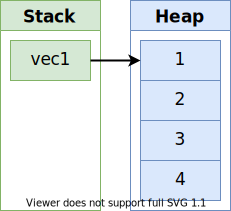
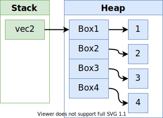

## 智能指针

在各个编程语言中，指针的概念几乎都是相同的：**指针是一个包含了内存地址的变量，该内存地址引用或者指向了另外的数据**。

在 **Rust** 中，最常见的指针类型是引用，引用通过 `&` 符号表示。不同于其它语言，引用在 **Rust** 中被赋予了更深层次的含义，那就是：借用其它变量的值。引用本身很简单，除了指向某个值外并没有其它的功能，也不会造成性能上的额外损耗，因此是 Rust 中使用最多的指针类型。

而智能指针则不然，它虽然也号称指针，但是它是一个复杂的家伙：通过比引用更复杂的数据结构，包含比引用更多的信息，例如元数据，当前长度，最大可用长度等。总之，**Rust** 的智能指针并不是独创，在 C++ 或者其他语言中也存在相似的概念。

**Rust** 标准库中定义的那些智能指针，虽重但强，可以提供比引用更多的功能特性，例如本章将讨论的引用计数智能指针。该智能指针允许你同时拥有同一个数据的多个所有权，它会跟踪每一个所有者并进行计数，当所有的所有者都归还后，该智能指针及指向的数据将自动被清理释放。

引用和智能指针的另一个不同在于前者仅仅是借用了数据，而后者往往可以拥有它们指向的数据，然后再为其它人提供服务。

在之前的章节中，实际上我们已经见识过多种智能指针，例如动态字符串 `String` 和动态数组 `Vec`，它们的数据结构中不仅仅包含了指向底层数据的指针，还包含了当前长度、最大长度等信息，其中 `String` 智能指针还提供了一种担保信息：所有的数据都是合法的 `UTF-8` 格式。

智能指针往往是基于结构体实现，它与我们自定义的结构体最大的区别在于它实现了 `Deref` 和 `Drop` 特征：

- `Deref` 可以让智能指针像引用那样工作，这样你就可以写出同时支持智能指针和引用的代码，例如 `*T` ；
- `Drop` 允许你指定智能指针超出作用域后自动执行的代码，例如做一些数据清除等收尾工作；

智能指针在 **Rust** 中很常见，我们在本章不会全部讲解，而是挑选几个最常用、最有代表性的进行讲解：

- `Box<T>`，可以将值分配到堆上；
- `Rc<T>`，引用计数类型，允许多所有权存在；
- `Ref<T>` 和 `RefMut<T>`，允许将借用规则检查从编译期移动到运行期进行；


### Box 堆对象分配


#### Rust 中的堆栈

高级语言 Python/Java 等往往会弱化堆栈的概念，但是要用好 C/C++/Rust，就必须对堆栈有深入的了解，原因是两者的内存管理方式不同：前者有 GC 垃圾回收机制，因此无需你去关心内存的细节。

栈内存从高位地址向下增长，且栈内存是连续分配的，一般来说**操作系统对栈内存的大小都有限制**，因此 C 语言中无法创建任意长度的数组。在 Rust 中，`main` 线程的[栈大小是 `8MB`](https://course.rs/compiler/pitfalls/stack-overflow.html)，普通线程是 `2MB`，在函数调用时会在其中创建一个临时栈空间，调用结束后 Rust 会让这个栈空间里的对象自动进入 `Drop` 流程，最后栈顶指针自动移动到上一个调用栈顶，无需程序员手动干预，因而栈内存申请和释放是非常高效的。

与栈相反，堆上内存则是从低位地址向上增长，**堆内存通常只受物理内存限制**，而且通常是不连续的，因此从性能的角度看，栈往往比堆更高。

相比其它语言，Rust 堆上对象还有一个特殊之处，它们都拥有一个所有者，因此受所有权规则的限制：当赋值时，发生的是所有权的转移（只需浅拷贝栈上的引用或智能指针即可），例如以下代码：

```rust
fn main() {
    let b = foo("world");
    println!("{}", b);
}

fn foo(x: &str) -> String {
    let a = "Hello, ".to_string() + x;
    a
}
```

在 `foo` 函数中，`a` 是 `String` 类型，它其实是一个智能指针结构体，该智能指针存储在函数栈中，指向堆上的字符串数据。当被从 `foo` 函数转移给 `main` 中的 `b` 变量时，栈上的智能指针被复制一份赋予给 `b`，而底层数据无需发生改变，这样就完成了所有权从 `foo` 函数内部到 `b` 的转移。

##### 堆栈的性能

很多人可能会觉得栈的性能肯定比堆高，其实未必。 由于我们在后面的性能专题会专门讲解堆栈的性能问题，因此这里就大概给出结论：

- **小型数据**，在栈上的分配性能和读取性能都要比堆上高；
- **中型数据**，栈上分配性能高，但是读取性能和堆上并无区别，因为无法利用寄存器或 CPU 高速缓存，最终还是要经过一次内存寻址；
- **大型数据**，只建议在堆上分配和使用；

总之，栈的分配速度肯定比堆上快，但是读取速度往往取决于你的数据能不能放入寄存器或 CPU 高速缓存。 因此不要仅仅因为堆上性能不如栈这个印象，就总是优先选择栈，导致代码更复杂的实现。


#### Box 的使用场景

由于 `Box` 是简单的封装，除了将值存储在堆上外，并没有其它性能上的损耗。而性能和功能往往是鱼和熊掌，因此 `Box` 相比其它智能指针，功能较为单一，可以在以下场景中使用它：

- 特意的将数据分配在堆上
- 数据较大时，又不想在转移所有权时进行数据拷贝
- 类型的大小在编译期无法确定，但是我们又需要固定大小的类型时
- 特征对象，用于说明对象实现了一个特征，而不是某个特定的类型

以上场景，我们在本章将一一讲解，后面车速较快，请系好安全带。

##### 使用 Box\<T\> 将数据存储在堆上

如果一个变量拥有一个数值 `let a = 3`，那变量 `a` 必然是存储在栈上的，那如果我们想要 `a` 的值存储在堆上就需要使用 `Box<T>`：

```rust
fn main() {
    let a = Box::new(3);
    println!("a = {}", a); // a = 3

    // 下面一行代码将报错
    // let b = a + 1; // cannot add `{integer}` to `Box<{integer}>`
    let b = *a + 1
}
```

这样就可以创建一个智能指针指向了存储在堆上的 `3`，并且 `a` 持有了该指针。在本章的引言中，我们提到了智能指针往往都实现了 `Deref` 和 `Drop` 特征，因此：

- `println!` 可以正常打印出 `a` 的值，是因为它隐式地调用了 `Deref` 对智能指针 `a` 进行了解引用
- 最后一行代码 `let b = a + 1` 报错，是因为在表达式中，我们无法自动隐式地执行 `Deref` 解引用操作，你需要使用 `*` 操作符 `let b = *a + 1`，来显式的进行解引用
- `a` 持有的智能指针将在作用域结束（`main` 函数结束）时，被释放掉，这是因为 `Box<T>` 实现了 `Drop` 特征

以上的例子在实际代码中其实很少会存在，因为将一个简单的值分配到堆上并没有太大的意义。将其分配在栈上，由于寄存器、CPU 缓存的原因，它的性能将更好，而且代码可读性也更好。

##### 避免栈上数据的拷贝

当栈上数据转移所有权时，实际上是把数据拷贝了一份，最终新旧变量各自拥有不同的数据，因此所有权并未转移。

而堆上则不然，底层数据并不会被拷贝，转移所有权仅仅是复制一份栈中的指针，再将新的指针赋予新的变量，然后让拥有旧指针的变量失效，最终完成了所有权的转移：

```rust
fn main() {
    // 在栈上创建一个长度为1000的数组
    let arr = [0;1000];
    // 将arr所有权转移arr1，由于 `arr` 分配在栈上，因此这里实际上是直接重新深拷贝了一份数据
    let arr1 = arr;

    // arr 和 arr1 都拥有各自的栈上数组，因此不会报错
    println!("{:?}", arr.len());
    println!("{:?}", arr1.len());

    // 在堆上创建一个长度为1000的数组，然后使用一个智能指针指向它
    let arr = Box::new([0;1000]);
    // 将堆上数组的所有权转移给 arr1，由于数据在堆上，因此仅仅拷贝了智能指针的结构体，底层数据并没有被拷贝
    // 所有权顺利转移给 arr1，arr 不再拥有所有权
    let arr1 = arr;
    println!("{:?}", arr1.len());
    // 由于 arr 不再拥有底层数组的所有权，因此下面代码将报错
    // println!("{:?}", arr.len());
}
```

从以上代码，可以清晰看出大块的数据为何应该放入堆中，此时 `Box` 就成为了我们最好的帮手。

##### 将动态大小类型变为 Sized 固定大小类型

Rust 需要在编译时知道类型占用多少空间，如果一种类型在编译时无法知道具体的大小，那么被称为动态大小类型 DST。

其中一种无法在编译时知道大小的类型是**递归类型**：在类型定义中又使用到了自身，或者说该类型的值的一部分可以是相同类型的其它值，这种值的嵌套理论上可以无限进行下去，所以 Rust 不知道递归类型需要多少空间：

```rust
enum List {
    Cons(i32, List),
    Nil,
}
```

以上就是函数式语言中常见的 `Cons List`，它的每个节点包含一个 `i32` 值，还包含了一个新的 `List`，因此这种嵌套可以无限进行下去，Rust 认为该类型是一个 DST 类型，并给予报错：

```shell
error[E0072]: recursive type `List` has infinite size //递归类型 `List` 拥有无限长的大小
 --> src/main.rs:3:1
  |
3 | enum List {
  | ^^^^^^^^^ recursive type has infinite size
4 |     Cons(i32, List),
  |               ---- recursive without indirection
```

此时若想解决这个问题，就可以使用我们的 `Box<T>`：

```rust
enum List {
    Cons(i32, Box<List>),
    Nil,
}
```

只需要将 `List` 存储到堆上，然后使用一个智能指针指向它，即可完成从 DST 到 Sized 类型（固定大小类型）的华丽转变。

##### 特征对象

在 Rust 中，想实现不同类型组成的数组只有两个办法：枚举和特征对象，前者限制较多，因此后者往往是最常用的解决办法。

```rust
trait Draw {
    fn draw(&self);
}

struct Button {
    id: u32,
}
impl Draw for Button {
    fn draw(&self) {
        println!("这是屏幕上第{}号按钮", self.id)
    }
}

struct Select {
    id: u32,
}

impl Draw for Select {
    fn draw(&self) {
        println!("这个选择框贼难用{}", self.id)
    }
}

fn main() {
    let elems: Vec<Box<dyn Draw>> = vec![Box::new(Button { id: 1 }), Box::new(Select { id: 2 })];

    for e in elems {
        e.draw()
    }
}
```

以上代码将不同类型的 `Button` 和 `Select` 包装成 `Draw` 特征的特征对象，放入一个数组中，`Box<dyn Draw>` 就是特征对象。

其实，特征也是 DST 类型，而特征对象在做的就是将 DST 类型转换为固定大小类型。


#### Box 内存布局

先来看看 `Vec<i32>` 的内存布局：



之前提到过 `Vec` 和 `String` 都是智能指针，从上图可以看出，该智能指针存储在栈中，然后指向堆上的数组数据。

那如果数组中每个元素都是一个 `Box` 对象呢？来看看 `Vec<Box<i32>>` 的内存布局：



上面的 `Box1` 代表被 `Box` 分配到堆上的值 `1`。

可以看出智能指针 `vec2` 依然是存储在栈上，然后指针指向一个堆上的数组，该数组中每个元素都是一个 `Box` 智能指针，最终 `Box` 智能指针又指向了存储在堆上的实际值。

因此当我们从数组中取出某个元素时，取到的是对应的智能指针 `Box`，需要对该智能指针进行解引用，才能取出最终的值：

```rust
fn main() {
    let arr = vec![Box::new(1), Box::new(2)];
    let (first, second) = (&arr[0], &arr[1]);
    let sum = **first + **second;
}
```

以上代码有几个值得注意的点：

1. 使用 `&` 借用数组中的元素，否则会报所有权错误；
2. 表达式不能隐式的解引用，因此必须使用 `**` 做两次解引用，第一次将 `&Box<i32>` 类型转成 `Box<i32>`，第二次将 `Box<i32>` 转成 `i32` ；


#### Box::leak

`Box` 中还提供了一个非常有用的关联函数：`Box::leak`，它可以消费掉 `Box` 并且强制目标值从内存中泄漏，读者可能会觉得，这有啥用啊？

其实还真有点用，例如，你可以把一个 `String` 类型，变成一个 `'static` 生命周期的 `&str` 类型：

```rust
fn main() {
   let s = gen_static_str();
   println!("{}", s);
}

fn gen_static_str() -> &'static str{
    let mut s = String::new();
    s.push_str("hello, world");

    Box::leak(s.into_boxed_str())
}
```

在之前的代码中，如果 `String` 创建于函数中，那么返回它的唯一方法就是转移所有权给调用者 `fn move_str() -> String`，而通过 `Box::leak` 我们不仅返回了一个 `&str` 字符串切片，它还是 `'static` 生命周期的！

要知道真正具有 `'static` 生命周期的往往都是编译期就创建的值，例如 `let v = "hello, world"`，这里 `v` 是直接打包到二进制可执行文件中的，因此该字符串具有 `'static` 生命周期，再比如 `const` 常量。

又有读者要问了，我还可以手动为变量标注 `'static` 啊。其实你标注的 `'static` 只是用来忽悠编译器的，但是超出作用域，一样被释放回收。而使用 `Box::leak` 就可以将一个运行期的值转为 `'static`。

##### 使用场景

光看上面的描述，大家可能还是云里雾里、一头雾水。

那么我说一个简单的场景，**你需要一个在运行期初始化的值，但是可以全局有效，也就是和整个程序活得一样久**，那么就可以使用 `Box::leak`，例如有一个存储配置的结构体实例，它是在运行期动态插入内容，那么就可以将其转为全局有效，虽然 `Rc/Arc` 也可以实现此功能，但是 `Box::leak` 是性能最高的。


#### Box 总结

`Box` 背后是调用 `jemalloc` 来做内存管理，所以堆上的空间无需我们的手动管理。与此类似，带 GC 的语言中的对象也是借助于 `Box` 概念来实现的，**一切皆对象 = 一切皆 Box**， 只不过我们无需自己去 `Box` 罢了。

其实很多时候，编译器的鞭笞可以助我们更快的成长，例如所有权规则里的借用、move、生命周期就是编译器在教我们做人，哦不是，是教我们深刻理解堆栈、内存布局、作用域等等你在其它 GC 语言无需去关注的东西。刚开始是很痛苦，但是一旦熟悉了这套规则，写代码的效率和代码本身的质量将飞速上升，直到你可以用 Java 开发的效率写出 Java 代码不可企及的性能和安全性，最终 Rust 语言所谓的开发效率低、心智负担高，对你来说终究不是个事。

因此，不要怪 Rust，**它只是在帮我们成为那个更好的程序员，而这些苦难终究成为我们走向优秀的垫脚石**。


### Deref 解引用

在开始之前，我们先来看一段代码：

```rust
#[derive(Debug)]
struct Person {
    name: String,
    age: u8
}

impl Person {
    fn new(name: String, age: u8) -> Self {
        Person { name, age}
    }

    fn display(self: &mut Person, age: u8) {
        let Person{name, age} = &self;
    }
}
```

以上代码有一个很奇怪的地方：在 `display` 方法中，`self` 是 `&mut Person` 的类型，接着我们对其取了一次引用 `&self`，此时 `&self` 的类型是 `&&mut Person`，然后我们又将其和 `Person` 类型进行匹配，取出其中的值。

那么问题来了，Rust 不是号称安全的语言吗？为何允许将 `&&mut Person` 跟 `Person` 进行匹配呢？答案就在本章节中，等大家学完后，再回头自己来解决这个问题 :) 下面正式开始咱们的新章节学习。

何为智能指针？能不让你写出 `****s` 形式的解引用，我认为就是智能: )，智能指针的名称来源，主要就在于它实现了 `Deref` 和 `Drop` 特征，这两个特征可以智能地帮助我们节省使用上的负担：

- `Deref` 可以让智能指针像引用那样工作，这样你就可以写出同时支持智能指针和引用的代码，例如 `*T`
- `Drop` 允许你指定智能指针超出作用域后自动执行的代码，例如做一些数据清除等收尾工作

先来看看 `Deref` 特征是如何工作的。


#### 通过 * 获取引用背后的值

在正式讲解 `Deref` 之前，我们先来看下常规引用的解引用。

常规引用是一个指针类型，包含了目标数据存储的内存地址。对常规引用使用 `*` 操作符，就可以通过解引用的方式获取到内存地址对应的数据值：

```rust
fn main() {
    let x = 5;
    let y = &x;

    assert_eq!(5, x);
    assert_eq!(5, *y);
}
```

这里 `y` 就是一个常规引用，包含了值 `5` 所在的内存地址，然后通过解引用 `*y`，我们获取到了值 `5`。如果你试图执行 `assert_eq!(5, y);`，代码就会无情报错，因为你无法将一个引用与一个数值做比较：

```shell
error[E0277]: can't compare `{integer}` with `&{integer}` //无法将{integer} 与&{integer}进行比较
 --> src/main.rs:6:5
  |
6 |     assert_eq!(5, y);
  |     ^^^^^^^^^^^^^^^^^ no implementation for `{integer} == &{integer}`
  |
  = help: the trait `PartialEq<&{integer}>` is not implemented for `{integer}`
                    // 你需要为{integer}实现用于比较的特征PartialEq<&{integer}>
```


#### 智能指针解引用

上面所说的解引用方式和其它大多数语言并无区别，但是 Rust 中将解引用提升到了一个新高度。考虑一下智能指针，它是一个结构体类型，如果你直接对它进行 `*myStruct`，显然编译器不知道该如何办，因此我们可以为智能指针结构体实现 `Deref` 特征。

实现 `Deref` 后的智能指针结构体，就可以像普通引用一样，通过 `*` 进行解引用，例如 `Box<T>` 智能指针：

```rust
fn main() {
    let x = Box::new(1);
    let sum = *x + 1;
}
```

智能指针 `x` 被 `*` 解引用为 `i32` 类型的值 `1`，然后再进行求和。

##### 定义自己的智能指针

现在，让我们一起来实现一个智能指针，功能上类似 `Box<T>`。由于 `Box<T>` 本身很简单，并没有包含类如长度、最大长度等信息，因此用一个元组结构体即可。

```rust
struct MyBox<T>(T);

impl<T> MyBox<T> {
    fn new(x: T) -> MyBox<T> {
        MyBox(x)
    }
}
```

跟 `Box<T>` 一样，我们的智能指针也持有一个 `T` 类型的值，然后使用关联函数 `MyBox::new` 来创建智能指针。由于还未实现 `Deref` 特征，此时使用 `*` 肯定会报错：

```rust
fn main() {
    let y = MyBox::new(5);

    assert_eq!(5, *y);
}
```

运行后，报错如下：（显然不能 **dereference**）

```shell
error[E0614]: type `MyBox<{integer}>` cannot be dereferenced
  --> src/main.rs:12:19
   |
12 |     assert_eq!(5, *y);
   |                   ^^
```

##### 为智能指针实现 Deref 特征

现在来为 `MyBox` 实现 `Deref` 特征，以支持 `*` 解引用操作符：

```rust
use std::ops::Deref;

impl<T> Deref for MyBox<T> {
    type Target = T;

    fn deref(&self) -> &Self::Target {
        &self.0
    }
}
```

很简单，当解引用 `MyBox` 智能指针时，返回元组结构体中的元素 `&self.0`，有几点要注意的：

- 在 `Deref` 特征中声明了关联类型 `Target`，在之前章节中介绍过，关联类型主要是为了提升代码可读性
- `deref` 返回的是一个常规引用，可以被 `*` 进行解引用

之前报错的代码此时已能顺利编译通过。当然，标准库实现的智能指针要考虑很多边边角角情况，肯定比我们的实现要复杂。


#### * 背后的原理

当我们对智能指针 `Box` 进行解引用时，实际上 Rust 为我们调用了以下方法：

```rust
*(y.deref())
```

首先调用 `deref` 方法返回值的常规引用，然后通过 `*` 对常规引用进行解引用，最终获取到目标值。

至于 Rust 为何要使用这个有点啰嗦的方式实现，原因在于所有权系统的存在。如果 `deref` 方法直接返回一个值，而不是引用，那么该值的所有权将被转移给调用者，而我们不希望调用者仅仅只是 `*T` 一下，就拿走了智能指针中包含的值。

需要注意的是，`*` 不会无限递归替换，从 `*y` 到 `*(y.deref())` 只会发生一次，而不会继续进行替换然后产生形如 `*((y.deref()).deref())` 的怪物。


#### 函数和方法中的隐式 Deref 转换

对于函数和方法的传参，Rust 提供了一个极其有用的**隐式转换**：`Deref `转换。若一个类型实现了 `Deref` 特征，那它的引用在传给函数或方法时，会根据参数签名来决定是否进行隐式的 `Deref` 转换，例如：

```rust
fn main() {
    let s = String::from("hello world");
    display(&s)
}

fn display(s: &str) {
    println!("{}",s);
}
```

以上代码有几点值得注意：

- `String` 实现了 `Deref` 特征，可以在需要时自动被转换为 `&str` 类型；
- `&s` 是一个 `&String` 类型，当它被传给 `display` 函数时，自动通过 `Deref` 转换成了 `&str` ；
- 必须使用 `&s` 的方式来触发 `Deref` （**仅引用类型的实参才会触发自动解引用**）；

##### 连续的隐式 Deref 转换

如果你以为 `Deref` 仅仅这点作用，那就大错特错了。`Deref` 可以支持连续的隐式转换，直到找到适合的形式为止：

```rust
fn main() {
    let s = MyBox::new(String::from("hello world"));
    display(&s)
}

fn display(s: &str) {
    println!("{}",s);
}
```

这里我们使用了之前自定义的智能指针 `MyBox`，并将其通过连续的隐式转换变成 `&str` 类型：首先 `MyBox` 被 `Deref` 成 `String` 类型，结果并不能满足 `display` 函数参数的要求，编译器发现 `String` 还可以继续 `Deref` 成 `&str`，最终成功的匹配了函数参数。

想象一下，假如 `Rust` 没有提供这种隐式转换，我们该如何调用 `display` 函数？

```rust
fn main() {
    let m = MyBox::new(String::from("Rust"));
    display(&(*m)[..]);
}
```

结果不言而喻，肯定是 `&s` 的方式优秀得多。总之，当参与其中的类型定义了 `Deref` 特征时，Rust 会分析该类型并且连续使用 `Deref` 直到最终获得一个引用来匹配函数或者方法的参数类型，这种行为完全不会造成任何的性能损耗，因为完全是在编译期完成。

但是 `Deref` 并不是没有缺点，缺点就是：如果你不知道某个类型是否实现了 `Deref` 特征，那么在看到某段代码时，并不能在第一时间反应过来该代码发生了隐式的 `Deref` 转换。事实上，不仅仅是 `Deref`，在 Rust 中还有各种 `From/Into` 等等会给阅读代码带来一定负担的特征。还是那句话，一切选择都是权衡，有得必有失，得了代码的简洁性，往往就失去了可读性，Go 语言就是一个刚好相反的例子。

再来看一下在方法、赋值中自动应用 `Deref` 的例子：

```rust
fn main() {
    let s = MyBox::new(String::from("hello, world"));
    let s1: &str = &s;
    let s2: String = s.to_string();
}
```

对于 `s1`，我们通过两次 `Deref` 将 `&str` 类型的值赋给了它（**赋值操作需要手动解引用**）；而对于 `s2`，我们在其上直接调用方法 `to_string`，实际上 `MyBox` 根本没有没有实现该方法，能调用 `to_string`，完全是因为编译器对 `MyBox` 应用了 `Deref` 的结果（**方法调用会自动解引用**）。


#### Deref 规则总结

在上面，我们零碎的介绍了不少关于 `Deref` 特征的知识，下面来通过较为正式的方式来对其规则进行下总结。

一个类型为 `T` 的对象 `foo`，如果 `T: Deref<Target=U>`，那么，相关 `foo` 的引用 `&foo` 在应用的时候会自动转换为 `&U`。

粗看这条规则，貌似有点类似于 `AsRef`，而跟 **解引用** 似乎风马牛不相及，实际里面有些玄妙之处。

##### 引用归一化

Rust 编译器实际上只能对 `&v` 形式的引用进行解引用操作，那么问题来了，如果是一个智能指针或者 `&&&&v` 类型的呢？ 该如何对这两个进行解引用？

答案是：Rust 会在解引用时自动把智能指针和 `&&&&v` 做引用归一化操作，转换成 `&v` 形式，最终再对 `&v` 进行解引用：

- 把智能指针（比如在库中定义的，Box、Rc、Arc、Cow 等）从结构体脱壳为内部的引用类型，也就是转成结构体内部的 `&v`
- 把多重`&`，例如 `&&&&&&&v`，归一成 `&v`

关于第二种情况，这么干巴巴的说，也许大家会迷迷糊糊的，我们来看一段标准库源码：

```rust
impl<T: ?Sized> Deref for &T {
    type Target = T;

    fn deref(&self) -> &T {
        *self
    }
}
```

在这段源码中，`&T` 被自动解引用为 `T`，也就是 `&T: Deref<Target=T>` 。 按照这个代码，`&&&&T` 会被自动解引用为 `&&&T`，然后再自动解引用为 `&&T`，以此类推， 直到最终变成 `&T`。

PS：以下是 `LLVM` 编译后的部分中间层代码：

```rust
// Rust 代码
let mut _2: &i32;
let _3: &&&&i32;

bb0: {
    _2 = (*(*(*_3)))
}
```

##### 几个例子

```rust
    fn foo(s: &str) {}

    // 由于 String 实现了 Deref<Target=str>
    let owned = "Hello".to_string();

    // 因此下面的函数可以正常运行：
    foo(&owned);
    use std::rc::Rc;

    fn foo(s: &str) {}

    // String 实现了 Deref<Target=str>
    let owned = "Hello".to_string();
    // 且 Rc 智能指针可以被自动脱壳为内部的 `owned` 引用： &String ，然后 &String 再自动解引用为 &str
    let counted = Rc::new(owned);

    // 因此下面的函数可以正常运行:
    foo(&counted);
    struct Foo;

    impl Foo {
        fn foo(&self) { println!("Foo"); }
    }

    let f = &&Foo;

    f.foo();
    (&f).foo();
    (&&f).foo();
    (&&&&&&&&f).foo();
```


#### 三种 Deref 转换

在之前，我们讲的都是不可变的 `Deref` 转换，实际上 Rust 还支持将一个可变的引用转换成另一个可变的引用以及将一个可变引用转换成不可变的引用，规则如下：

- 当 `T: Deref<Target=U>`，可以将 `&T` 转换成 `&U`，也就是我们之前看到的例子；
- 当 `T: DerefMut<Target=U>`，可以将 `&mut T` 转换成 `&mut U` ；
- 当 `T: Deref<Target=U>`，可以将 `&mut T` 转换成 `&U` ；

来看一个关于 `DerefMut` 的例子：

```rust
struct MyBox<T> {
    v: T,
}

impl<T> MyBox<T> {
    fn new(x: T) -> MyBox<T> {
        MyBox { v: x }
    }
}

use std::ops::Deref;

impl<T> Deref for MyBox<T> {
    type Target = T;

    fn deref(&self) -> &Self::Target {
        &self.v
    }
}

use std::ops::DerefMut;

impl<T> DerefMut for MyBox<T> {
    fn deref_mut(&mut self) -> &mut Self::Target {
        &mut self.v
    }
}

fn main() {
    let mut s = MyBox::new(String::from("hello, "));
    display(&mut s)
}

fn display(s: &mut String) {
    s.push_str("world");
    println!("{}", s);
}
```

以上代码有几点值得注意:

- 要实现 `DerefMut` 必须要先实现 `Deref` 特征：`pub trait DerefMut: Deref`
- `T: DerefMut<Target=U>` 解读：将 `&mut T` 类型通过 `DerefMut` 特征的方法转换为 `&mut U` 类型，对应上例中，就是将 `&mut MyBox<String>` 转换为 `&mut String`

对于上述三条规则中的第三条，它比另外两条稍微复杂了点：

> Rust 可以把可变引用隐式的转换成不可变引用，但反之则不行。

如果从 Rust 的所有权和借用规则的角度考虑，当你拥有一个可变的引用，那该引用肯定是对应数据的唯一借用，那么此时将可变引用变成不可变引用并不会破坏借用规则；但是如果你拥有一个不可变引用，那同时可能还存在其它几个不可变的引用，如果此时将其中一个不可变引用转换成可变引用，就变成了可变引用与不可变引用的共存，最终破坏了借用规则。


#### Deref 总结

`Deref` 可以说是 Rust 中最常见的隐式类型转换，而且它可以连续的实现如 `Box<String> -> String -> &str` 的隐式转换，只要链条上的类型实现了 `Deref` 特征。

我们也可以为自己的类型实现 `Deref` 特征，但是原则上来说，只应该为自定义的智能指针实现 `Deref`。例如，虽然你可以为自己的自定义数组类型实现 `Deref` 以避免 `myArr.0[0]` 的使用形式，但是 Rust 官方并不推荐这么做，特别是在你开发三方库时。


### Drop 释放资源

在 Rust 中，我们之所以可以一拳打跑 GC 的同时一脚踢翻手动资源回收，主要就归功于 `Drop` 特征，同时它也是智能指针的必备特征之一。


#### Rust 中的资源回收

在一些无 GC 语言中，程序员在一个变量无需再被使用时，需要手动释放它占用的内存资源，如果忘记了，那么就会发生内存泄漏，最终臭名昭著的 `OOM` 问题可能就会发生。

而在 Rust 中，你可以指定在一个变量超出作用域时，执行一段特定的代码，最终编译器将帮你自动插入这段收尾代码。这样，就无需在每一个使用该变量的地方，都写一段代码来进行收尾工作和资源释放。不禁让人感叹，Rust 的大腿真粗，香！

没错，指定这样一段收尾工作靠的就是咱这章的主角 —— `Drop` 特征。


#### 一个不那么简单的 Drop 栗子

```rust
struct HasDrop1;
struct HasDrop2;

impl Drop for HasDrop1 {
    fn drop(&mut self) {
        println!("Dropping HasDrop1!")
    }
}

impl Drop for HasDrop2 {
    fn drop(&mut self) {
        println!("Dropping HasDrop2!")
    }
}

#[allow(dead_code)]
struct HasTwoDrops {
    one: HasDrop1,
    two: HasDrop2,
}
impl Drop for HasTwoDrops {
    fn drop(&mut self) {
        println!("Dropping HasTwoDrops!");
    }
}

struct Foo;

impl Drop for Foo {
    fn drop(&mut self) {
        println!("Dropping Foo!")
    }
}

fn main() {
    let _x = HasTwoDrops {
        two: HasDrop2,
        one: HasDrop1,
    };
    let _foo = Foo;
    println!("Running!");
}
```

上面代码虽然长，但是目的其实很单纯，就是为了观察不同情况下变量级别的、结构体内部字段的 `Drop`，有几点值得注意：

- `Drop` 特征中的 `drop` 方法借用了目标的可变引用，而不是拿走了所有权，这里先设置一个悬念，后边会讲；
- 结构体中每个字段都有自己的 `Drop` ；

来看看输出：

```shell
Running!
Dropping Foo!
Dropping HasTwoDrops!
Dropping HasDrop1!
Dropping HasDrop2!
```

嗯，结果符合预期，每个资源都成功的执行了收尾工作，虽然 `println!` 这种收尾工作毫无意义。

##### Drop 的顺序

观察以上输出，我们可以得出以下关于 `Drop` 顺序的结论：

- **变量级别，按照逆序的方式**，`_x` 在 `_foo` 之前创建，因此 `_x` 在 `_foo` 之后被 `drop` ；
- **结构体内部，按照顺序的方式**，结构体 `_x` 中的字段按照定义中的顺序依次 `drop` ；

##### 没有实现 Drop 的结构体

实际上，就算你不为 `_x` 结构体实现 `Drop` 特征，它内部的两个字段依然会调用 `drop`，移除以下代码，并观察输出：

```rust
impl Drop for HasTwoDrops {
    fn drop(&mut self) {
        println!("Dropping HasTwoDrops!");
    }
}
```

原因在于，Rust 自动为几乎所有类型都实现了 `Drop` 特征，因此就算你不手动为结构体实现 `Drop`，它依然会调用默认实现的 `drop` 函数，同时再调用每个字段的 `drop` 方法，最终打印出：

```cnosole
Dropping HasDrop1!
Dropping HasDrop2!
```


#### 手动回收

当使用智能指针来管理锁的时候，你可能希望提前释放这个锁，然后让其它代码能及时获得锁，此时就需要提前去手动 `drop`。 但是在之前我们提到一个悬念，`Drop::drop` 只是借用了目标值的可变引用，所以，就算你提前调用了 `drop`，后面的代码依然可以使用目标值，但是这就会访问一个并不存在的值，非常不安全，好在 Rust 会阻止你：

```rust
#[derive(Debug)]
struct Foo;

impl Drop for Foo {
    fn drop(&mut self) {
        println!("Dropping Foo!")
    }
}

fn main() {
    let foo = Foo;
    foo.drop();
    println!("Running!:{:?}", foo);
}
```

报错如下：

```shell
error[E0040]: explicit use of destructor method
  --> src/main.rs:37:9
   |
37 |     foo.drop();
   |     ----^^^^--
   |     |   |
   |     |   explicit destructor calls not allowed
   |     help: consider using `drop` function: `drop(foo)`
```

如上所示，编译器直接阻止了我们调用 `Drop` 特征的 `drop` 方法，原因是对于 Rust 而言，不允许显式地调用析构函数（这是一个用来清理实例的通用编程概念）。好在在报错的同时，编译器还给出了一个提示：使用 `drop` 函数。

针对编译器提示的 `drop` 函数，我们可以大胆推测下：它能够拿走目标值的所有权。现在来看看这个猜测正确与否，以下是 `std::mem::drop` 函数的签名：

```rust
pub fn drop<T>(_x: T)
```

如上所示，`drop` 函数确实拿走了目标值的所有权，来验证下：

```rust
fn main() {
    let foo = Foo;
    drop(foo);
    // 以下代码会报错：借用了所有权被转移的值
    // println!("Running!:{:?}", foo);
}
```

Bingo，完美拿走了所有权，而且这种实现保证了后续的使用必定会导致编译错误，因此非常安全！

细心的同学可能已经注意到，这里直接调用了 `drop` 函数，并没有引入任何模块信息，原因是该函数在[std::prelude](https://course.rs/appendix/prelude.html)里。


#### Drop 使用场景

对于 Drop 而言，主要有两个功能：

- 回收内存资源；
- 执行一些收尾工作；

对于第二点，在之前我们已经详细介绍过，因此这里主要对第一点进行下简单说明。

在绝大多数情况下，我们都无需手动去 `drop` 以回收内存资源，因为 Rust 会自动帮我们完成这些工作，它甚至会对复杂类型的每个字段都单独的调用 `drop` 进行回收！但是确实有极少数情况，需要你自己来回收资源的，例如**文件描述符**、**网络 socket** 等，当这些值超出作用域不再使用时，就需要进行关闭以释放相关的资源，在这些情况下，就需要使用者自己来解决 `Drop` 的问题。


#### 互斥的 Copy 和 Drop

我们无法为一个类型同时实现 `Copy` 和 `Drop` 特征。因为实现了 `Copy` 的特征会被编译器隐式的复制，因此非常难以预测析构函数执行的时间和频率。因此这些实现了 `Copy` 的类型无法拥有析构函数。

```rust
#[derive(Copy)]
struct Foo;

impl Drop for Foo {
    fn drop(&mut self) {
        println!("Dropping Foo!")
    }
}
```

以上代码报错如下：

```shell
error[E0184]: the trait `Copy` may not be implemented for this type; the type has a destructor
  --> src/main.rs:24:10
   |
24 | #[derive(Copy)]
   |          ^^^^ Copy not allowed on types with destructors
```


#### Drop 总结

`Drop` 可以用于许多方面，来使得资源清理及收尾工作变得方便和安全，甚至可以用其创建我们自己的内存分配器！通过 `Drop` 特征和 Rust 所有权系统，你无需担心之后的代码清理，Rust 会自动考虑这些问题。

我们也无需担心意外的清理掉仍在使用的值，这会造成编译器错误：所有权系统确保引用总是有效的，也会确保 `drop` 只会在值不再被使用时被调用一次。


### Rc 与 Arc

Rust 所有权机制要求一个值只能有一个所有者，在大多数情况下，都没有问题，但是考虑以下情况：

- 在图数据结构中，多个边可能会拥有同一个节点，该节点直到没有边指向它时，才应该被释放清理；
- 在多线程中，多个线程可能会持有同一个数据，但是你受限于 Rust 的安全机制，无法同时获取该数据的可变引用；

以上场景不是很常见，但是一旦遇到，就非常棘手，为了解决此类问题，Rust 在所有权机制之外又引入了额外的措施来简化相应的实现：通过引用计数的方式，允许一个数据资源在同一时刻拥有多个所有者。

这种实现机制就是 `Rc` 和 `Arc`，前者适用于**单线程**，后者适用于**多线程**。由于二者大部分情况下都相同，因此本章将以 `Rc` 作为讲解主体，对于 `Arc` 的不同之处，另外进行单独讲解。


#### Rc\<T\>

引用计数（**Reference Counting**），顾名思义，通过记录一个数据被引用的次数来确定该数据是否正在被使用。当引用次数归零时，就代表该数据不再被使用，因此可以被清理释放。

而 `Rc` 正是引用计数的英文缩写。当我们**希望在堆上分配一个对象供程序的多个部分使用且无法确定哪个部分最后一个结束时，就可以使用 `Rc` 成为数据值的所有者**，例如之前提到的多线程场景就非常适合。

下面是经典的所有权被转移导致报错的例子：

```rust
fn main() {
    let s = String::from("hello, world");
    // s在这里被转移给a
    let a = Box::new(s);
    // 报错！此处继续尝试将 s 转移给 b
    let b = Box::new(s);
}
```

使用 `Rc` 就可以轻易解决：

```rust
use std::rc::Rc;
fn main() {
    let a = Rc::new(String::from("hello, world"));
    let b = Rc::clone(&a);

    assert_eq!(2, Rc::strong_count(&a));
    assert_eq!(Rc::strong_count(&a), Rc::strong_count(&b))
}
```

以上代码我们使用 `Rc::new` 创建了一个新的 `Rc<String>` 智能指针并赋给变量 `a`，该指针指向底层的字符串数据。

智能指针 `Rc<T>` 在创建时，还会将引用计数加 1，此时获取引用计数的关联函数 `Rc::strong_count` 返回的值将是 `1`。

##### Rc::clone

接着，我们又使用 `Rc::clone` 克隆了一份智能指针 `Rc<String>`，并将该智能指针的引用计数增加到 `2`。

由于 `a` 和 `b` 是同一个智能指针的两个副本，因此通过它们两个获取引用计数的结果都是 `2`。

不要被 `clone` 字样所迷惑，以为所有的 `clone` 都是深拷贝。这里的 `clone` **仅仅复制了智能指针并增加了引用计数，并没有克隆底层数据**，因此 `a` 和 `b` 是共享了底层的字符串 `s`，这种**复制效率是非常高**的。当然你也可以使用 `a.clone()` 的方式来克隆，但是从可读性角度，我们更加推荐 `Rc::clone` 的方式。

实际上在 Rust 中，还有不少 `clone` 都是浅拷贝，例如[迭代器的克隆](https://course.rs/compiler/pitfalls/iterator-everywhere.html)。

##### 观察引用计数的变化

使用关联函数 `Rc::strong_count` 可以获取当前引用计数的值，我们来观察下引用计数如何随着变量声明、释放而变化：

```rust
use std::rc::Rc;
fn main() {
        let a = Rc::new(String::from("test ref counting"));
        println!("count after creating a = {}", Rc::strong_count(&a));
        let b =  Rc::clone(&a);
        println!("count after creating b = {}", Rc::strong_count(&a));
        {
            let c =  Rc::clone(&a);
            println!("count after creating c = {}", Rc::strong_count(&c));
        }
        println!("count after c goes out of scope = {}", Rc::strong_count(&a));
}
```

有几点值得注意：

- 由于变量 `c` 在语句块内部声明，当离开语句块时它会因为超出作用域而被释放，所以引用计数会减少 1，事实上这个得益于 `Rc<T>` 实现了 `Drop` 特征；
- `a`、`b`、`c` 三个智能指针引用计数都是同样的，并且共享底层的数据，因此打印计数时用哪个都行；
- 无法看到的是：当 `a`、`b` 超出作用域后，引用计数会变成 0，最终智能指针和它指向的底层字符串都会被清理释放；

##### 不可变引用

事实上，`Rc<T>` 是指向底层数据的不可变的引用，因此你无法通过它来修改数据，这也符合 Rust 的借用规则：**要么存在多个不可变借用，要么只能存在一个可变借用**。

但是实际开发中我们往往需要对数据进行修改，这时单独使用 `Rc<T>` 无法满足我们的需求，需要配合其它数据类型来一起使用，例如内部可变性的 `RefCell<T>` 类型以及互斥锁 `Mutex<T>`。事实上，在多线程编程中，`Arc` 跟 `Mutex` 锁的组合使用非常常见，它们既可以让我们在不同的线程中共享数据，又允许在各个线程中对其进行修改。

##### 一个综合例子

考虑一个场景，有很多小工具，每个工具都有自己的主人，但是存在多个工具属于同一个主人的情况，此时使用 `Rc<T>` 就非常适合：

```rust
use std::rc::Rc;

struct Owner {
    name: String,
    // ...其它字段
}

struct Gadget {
    id: i32,
    owner: Rc<Owner>,
    // ...其它字段
}

fn main() {
    // 创建一个基于引用计数的 `Owner`.
    let gadget_owner: Rc<Owner> = Rc::new(Owner {
        name: "Gadget Man".to_string(),
    });

    // 创建两个不同的工具，它们属于同一个主人
    let gadget1 = Gadget {
        id: 1,
        owner: Rc::clone(&gadget_owner),
    };
    let gadget2 = Gadget {
        id: 2,
        owner: Rc::clone(&gadget_owner),
    };

    // 释放掉第一个 `Rc<Owner>`
    drop(gadget_owner);

    // 尽管在上面我们释放了 gadget_owner，但是依然可以在这里使用 owner 的信息
    // 原因是在 drop 之前，存在三个指向 Gadget Man 的智能指针引用，上面仅仅
    // drop 掉其中一个智能指针引用，而不是 drop 掉 owner 数据，外面还有两个
    // 引用指向底层的 owner 数据，引用计数尚未清零
    // 因此 owner 数据依然可以被使用
    println!("Gadget {} owned by {}", gadget1.id, gadget1.owner.name);
    println!("Gadget {} owned by {}", gadget2.id, gadget2.owner.name);

    // 在函数最后，`gadget1` 和 `gadget2` 也被释放，最终引用计数归零，随后底层
    // 数据也被清理释放
}
```

以上代码很好的展示了 `Rc<T>` 的用途，当然你也可以用借用的方式，但是实现起来就会复杂得多，而且随着 `Gadget` 在代码的各个地方使用，引用生命周期也将变得更加复杂，毕竟结构体中的引用类型，总是令人不那么愉快，对不？

##### Rc 简单总结

- `Rc/Arc` 是不可变引用，你无法修改它指向的值，只能进行读取，如果要修改，需要配合后面章节的内部可变性 `RefCell` 或互斥锁 `Mutex` ；
- 一旦最后一个拥有者消失，则资源会自动被回收，这个生命周期是在编译期就确定下来的；
- `Rc` 只能用于同一线程内部，想要用于线程之间的对象共享，你需要使用 `Arc` ；
- `Rc<T>` 是一个智能指针，实现了 `Deref` 特征，因此你无需先解开 `Rc` 指针，再使用里面的 `T`，而是可以直接使用 `T`，例如上例中的 `gadget1.owner.name` ；


#### 多线程物理的 Rc\<T\>

来看看在多线程场景使用 `Rc<T>` 会如何：

```rust
use std::rc::Rc;
use std::thread;

fn main() {
    let s = Rc::new(String::from("多线程漫游者"));
    for _ in 0..10 {
        let s = Rc::clone(&s);
        let handle = thread::spawn(move || {
           println!("{}", s)
        });
    }
}
```

由于我们还没有学习多线程的章节，上面的例子就特地简化了相关的实现。首先通过 `thread::spawn` 创建一个线程，然后使用 `move` 关键字把克隆出的 `s` 的所有权转移到线程中。

能够实现这一点，完全得益于 `Rc` 带来的多所有权机制，但是以上代码会报错：

```shell
error[E0277]: `Rc<String>` cannot be sent between threads safely
```

表面原因是 `Rc<T>` 不能在线程间安全的传递，实际上是因为它没有实现 `Send` 特征，而该特征是恰恰是多线程间传递数据的关键，我们会在多线程章节中进行讲解。

当然，还有更深层的原因：由于 `Rc<T>` 需要管理引用计数，但是**该计数器并没有使用任何并发原语**，因此无法实现原子化的计数操作，最终会导致计数错误。

好在天无绝人之路，一起来看看 Rust 为我们提供的功能类似但是多线程安全的 `Arc`。


#### Arc\<T\>

`Arc` 是 `Atomic Rc` 的缩写，顾名思义：原子化的 `Rc<T>` 智能指针。原子化是一种并发原语，我们在后续章节会进行深入讲解，这里你只要知道它能保证我们的数据能够安全的在线程间共享即可。

##### Arc 的性能损耗

你可能好奇，为何不直接使用 `Arc`，还要画蛇添足弄一个 `Rc`，还有 Rust 的基本数据类型、标准库数据类型为什么不自动实现原子化操作？这样就不存在线程不安全的问题了。

原因在于原子化或者其它锁虽然可以带来的线程安全，但是都会**伴随着性能损耗**，而且这种性能损耗还不小。因此 Rust 把这种选择权交给你，毕竟需要线程安全的代码其实占比并不高，大部分时候我们开发的程序都在一个线程内。

`Arc` 和 `Rc` 拥有**完全一样的 API**，修改起来很简单：

```rust
use std::sync::Arc;
use std::thread;

fn main() {
    let s = Arc::new(String::from("多线程漫游者"));
    for _ in 0..10 {
        let s = Arc::clone(&s);
        let handle = thread::spawn(move || {
           println!("{}", s)
        });
    }
}
```

对了，两者还有一点区别：`Arc` 和 `Rc` 并没有定义在同一个模块，前者通过 `use std::sync::Arc` 来引入，后者通过 `use std::rc::Rc`。


#### Rc 与 Arc 总结

在 Rust 中，所有权机制保证了一个数据只会有一个所有者，但如果你想要在图数据结构、多线程等场景中共享数据，这种机制会成为极大的阻碍。好在 Rust 为我们提供了智能指针 `Rc` 和 `Arc`，使用它们就能实现多个所有者共享一个数据的功能。

`Rc` 和 `Arc` 的区别在于，后者是原子化实现的引用计数，因此是线程安全的，可以用于多线程中共享数据。

这两者都是只读的，如果想要实现内部数据可修改，必须配合内部可变性 `RefCell` 或者互斥锁 `Mutex` 来一起使用。


### Cell 和 RefCell

Rust 的编译器之严格，可以说是举世无双。特别是在所有权方面，Rust 通过严格的规则来保证所有权和借用的正确性，最终为程序的安全保驾护航。

但是严格是一把双刃剑，带来安全提升的同时，损失了灵活性，有时甚至会让用户痛苦不堪、怨声载道。因此 Rust 提供了 `Cell` 和 `RefCell` 用于内部可变性，简而言之，可以在拥有不可变引用的同时修改目标数据，对于正常的代码实现来说，这个是不可能做到的（要么一个可变借用，要么多个不可变借用）。

> 内部可变性的实现是因为 Rust 使用了 `unsafe` 来做到这一点，但是对于使用者来说，这些都是透明的，因为这些不安全代码都被封装到了安全的 API 中


#### Cell

`Cell` 和 `RefCell` 在功能上没有区别，区别在于 `Cell<T>` 适用于 `T` 实现 `Copy` 的情况：

```rust
use std::cell::Cell;
fn main() {
  let c = Cell::new("asdf");
  let one = c.get();
  c.set("qwer");
  let two = c.get();
  println!("{},{}", one, two);
}
```

以上代码展示了 `Cell` 的基本用法，有几点值得注意：

- "asdf" 是 `&str` 类型，它实现了 `Copy` 特征
- `c.get` 用来取值，`c.set` 用来设置新值

取到值保存在 `one` 变量后，还能同时进行修改，这个违背了 Rust 的借用规则，但是由于 `Cell` 的存在，我们很优雅地做到了这一点，但是如果你尝试在 `Cell` 中存放`String`：

```rust
 let c = Cell::new(String::from("asdf"));
```

编译器会立刻报错，因为 `String` 没有实现 `Copy` 特征：

```shell
| pub struct String {
| ----------------- doesn't satisfy `String: Copy`
|
= note: the following trait bounds were not satisfied:
        `String: Copy`
```


#### RefCell

由于 `Cell` 类型针对的是实现了 `Copy` 特征的值类型，因此在实际开发中，`Cell` 使用的并不多，因为我们要解决的往往是可变、不可变引用共存导致的问题，此时就需要借助于 `RefCell` 来达成目的。

我们可以将所有权、借用规则与这些智能指针做一个对比：

| Rust 规则                            | 智能指针带来的额外规则                  |
| ------------------------------------ | --------------------------------------- |
| 一个数据只有一个所有者               | `Rc/Arc`让一个数据可以拥有多个所有者    |
| 要么多个不可变借用，要么一个可变借用 | `RefCell`实现编译期可变、不可变引用共存 |
| 违背规则导致**编译错误**             | 违背规则导致**运行时**`panic`           |

可以看出，`Rc/Arc` 和 `RefCell` 合在一起，解决了 Rust 中严苛的所有权和借用规则带来的某些场景下难使用的问题。但是它们并不是银弹，例如 `RefCell` 实际上并没有解决可变引用和引用可以共存的问题，只是将报错从编译期推迟到运行时，从编译器错误变成了 `panic` 异常：

```rust
use std::cell::RefCell;

fn main() {
    let s = RefCell::new(String::from("hello, world"));
    let s1 = s.borrow();
    let s2 = s.borrow_mut();

    println!("{},{}", s1, s2);
}
```

上面代码在编译期不会报任何错误，你可以顺利运行程序：

```shell
thread 'main' panicked at 'already borrowed: BorrowMutError', src/main.rs:6:16
note: run with `RUST_BACKTRACE=1` environment variable to display a backtrace
```

但是依然会因为违背了借用规则导致了运行期 `panic`，这非常像中国的天网，它也许会被罪犯蒙蔽一时，但是并不会被蒙蔽一世，任何导致安全风险的存在都将不能被容忍，法网恢恢，疏而不漏。

##### RefCell 为何存在

相信肯定有读者有疑问了，这么做有任何意义吗？还不如在编译期报错，至少能提前发现问题，而且性能还更好。

存在即合理，究其根因，在于 Rust 编译期的**宁可错杀，绝不放过**的原则，当编译器不能确定你的代码是否正确时，就统统会判定为错误，因此难免会导致一些误报。

而 `RefCell` 正是**用于你确信代码是正确的，而编译器却发生了误判时**。

对于大型的复杂程序，也可以选择使用 `RefCell` 来让事情简化。例如在 Rust 编译器的[ctxt结构体](https://github.com/rust-lang/rust/blob/620d1ee5346bee10ba7ce129b2e20d6e59f0377d/src/librustc/middle/ty.rs#L803-L987)中有大量的 `RefCell` 类型的 `map` 字段，主要的原因是：这些 `map` 会被分散在各个地方的代码片段所广泛使用或修改。由于这种分散在各处的使用方式，导致了管理可变和不可变成为一件非常复杂的任务（甚至不可能），你很容易就碰到编译器抛出来的各种错误。而且 `RefCell` 的运行时错误在这种情况下也变得非常可爱：一旦有人做了不正确的使用，代码会 `panic`，然后告诉我们哪些借用冲突了。

总之，当你确信编译器误报但不知道该如何解决时，或者你有一个引用类型，需要被四处使用和修改然后导致借用关系难以管理时，都可以优先考虑使用 `RefCell`。

##### RefCell 简单总结

- 与 `Cell` 用于可 `Copy` 的值不同，`RefCell` 用于引用；
- `RefCell` 只是将借用规则从编译期推迟到程序运行期，并不能帮你绕过这个规则；
- `RefCell` 适用于编译期误报或者一个引用被在多处代码使用、修改以至于难于管理借用关系时；
- 使用 `RefCell` 时，违背借用规则会导致运行期的 `panic` ；


#### 选择 Cell 还是 RefCell

根据本文的内容，我们可以大概总结下两者的区别：

- `Cell` 只适用于 `Copy` 类型，用于提供值，而 `RefCell` 用于提供引用；
- `Cell` 不会 `panic`，而 `RefCell` 会；

##### 性能比较

`Cell` 没有额外的性能损耗，例如以下两段代码的性能其实是一致的：

```rust
// code snipet 1
let x = Cell::new(1);
let y = &x;
let z = &x;
x.set(2);
y.set(3);
z.set(4);
println!("{}", x.get());

// code snipet 2
let mut x = 1;
let y = &mut x;
let z = &mut x;
x = 2;
*y = 3;
*z = 4;
println!("{}", x);
```

虽然性能一致，但代码 `1` 拥有代码 `2` 不具有的优势：它能编译成功😀

与 `Cell` 的 `zero cost` 不同，`RefCell` 其实是有一点运行期开销的，原因是它包含了一个字大小的“借用状态”指示器，**该指示器在每次运行时借用时都会被修改，进而产生一点开销**。

总之，当非要使用内部可变性时，首选 `Cell`，只有你的类型没有实现 `Copy` 时，才去选择 `RefCell`。


#### 内部可变性

之前我们提到 `RefCell` 具有内部可变性，何为内部可变性？简单来说，对一个不可变的值进行可变借用，但这个并不符合 Rust 的基本借用规则：

```rust
fn main() {
    let x = 5;
    let y = &mut x;
}
```

上面的代码会报错，因为我们不能对一个不可变的值进行可变借用，这会破坏 Rust 的安全性保证，相反，你可以对一个可变值进行不可变借用。原因是：当值不可变时，可能会有多个不可变的引用指向它，此时若将修改其中一个为可变的，会造成可变引用与不可变引用共存的情况；而当值可变时，最多只会有一个可变引用指向它，将其修改为不可变，那么最终依然是只有一个不可变的引用指向它。

虽然基本借用规则是 Rust 的基石，然而在某些场景中，一个值可以在其方法内部被修改，同时对于其它代码不可变，是很有用的：

```rust
// 定义在外部库中的特征
pub trait Messenger {
    fn send(&self, msg: String);
}

// --------------------------
// 我们的代码中的数据结构和实现
struct MsgQueue {
    msg_cache: Vec<String>,
}

impl Messenger for MsgQueue {
    fn send(&self, msg: String) {
        self.msg_cache.push(msg)
    }
}
```

如上所示，外部库中定义了一个消息发送器特征 `Messenger`，它只有一个发送消息的功能：`fn send(&self, msg: String)`，因为发送消息不需要修改自身，因此原作者在定义时，使用了 `&self` 的不可变借用，这个无可厚非。

我们要在自己的代码中使用该特征实现一个异步消息队列，出于性能的考虑，消息先写到本地缓存（内存）中，然后批量发送出去，因此在 `send` 方法中，需要将消息先行插入到本地缓存 `msg_cache` 中。但是问题来了，该 `send` 方法的签名是 `&self`，因此上述代码会报错：

```shell
error[E0596]: cannot borrow `self.msg_cache` as mutable, as it is behind a `&` reference
  --> src/main.rs:11:9
   |
2  |     fn send(&self, msg: String);
   |             ----- help: consider changing that to be a mutable reference: `&mut self`
...
11 |         self.msg_cache.push(msg)
   |         ^^^^^^^^^^^^^^^^^^ `self` is a `&` reference, so the data it refers to cannot be borrowed as mutable
```

在报错的同时，编译器大聪明还善意地给出了提示：将 `&self` 修改为 `&mut self`，但是。。。我们实现的特征是定义在外部库中，因此该签名根本不能修改。值此危急关头， `RefCell` 闪亮登场：

```rust
use std::cell::RefCell;
pub trait Messenger {
    fn send(&self, msg: String);
}

pub struct MsgQueue {
    msg_cache: RefCell<Vec<String>>,
}

impl Messenger for MsgQueue {
    fn send(&self, msg: String) {
        self.msg_cache.borrow_mut().push(msg)
    }
}

fn main() {
    let mq = MsgQueue {
        msg_cache: RefCell::new(Vec::new()),
    };
    mq.send("hello, world".to_string());
}
```

这个 MQ 功能很弱，但是并不妨碍我们演示内部可变性的核心用法：通过包裹一层 `RefCell`，成功的让 `&self` 中的 `msg_cache` 成为一个可变值，然后实现对其的修改。


#### Rc + RefCell 组合使用

在 Rust 中，一个常见的组合就是 `Rc` 和 `RefCell` 在一起使用，前者可以实现一个数据拥有多个所有者，后者可以实现数据的可变性：

```rust
use std::cell::RefCell;
use std::rc::Rc;
fn main() {
    let s = Rc::new(RefCell::new("我很善变，还拥有多个主人".to_string()));

    let s1 = s.clone();
    let s2 = s.clone();
    // let mut s2 = s.borrow_mut();
    s2.borrow_mut().push_str(", on yeah!");

    println!("{:?}\n{:?}\n{:?}", s, s1, s2);
}
```

上面代码中，我们使用 `RefCell<String>` 包裹一个字符串，同时通过 `Rc` 创建了它的三个所有者：`s`、`s1`和`s2`，并且通过其中一个所有者 `s2` 对字符串内容进行了修改。

由于 `Rc` 的所有者们共享同一个底层的数据，因此当一个所有者修改了数据时，会导致全部所有者持有的数据都发生了变化。

程序的运行结果也在预料之中：

```shell
RefCell { value: "我很善变，还拥有多个主人, on yeah!" }
RefCell { value: "我很善变，还拥有多个主人, on yeah!" }
RefCell { value: "我很善变，还拥有多个主人, on yeah!" }
```

##### 性能损耗

相信这两者组合在一起使用时，很多人会好奇到底性能如何，下面我们来简单分析下。

首先给出一个大概的结论，这两者结合在一起使用的性能其实非常高，大致相当于没有线程安全版本的 C++ `std::shared_ptr` 指针，事实上，C++ 这个指针的主要开销也在于原子性这个并发原语上，毕竟线程安全在哪个语言中开销都不小。

##### 内存损耗

两者结合的数据结构与下面类似：

```rust
struct Wrapper<T> {
    // Rc
    strong_count: usize,
    weak_count: usize,

    // Refcell
    borrow_count: isize,

    // 包裹的数据
    item: T,
}
```

从上面可以看出，从对内存的影响来看，仅仅多分配了三个`usize/isize`，并没有其它额外的负担。

##### CPU 损耗

从 CPU 来看，损耗如下：

1. 对 `Rc<T>` 解引用是免费的（编译期），但是 `*` 带来的间接取值并不免费；
2. 克隆 `Rc<T>` 需要将当前的引用计数跟 `0` 和 `usize::Max` 进行一次比较，然后将计数值加 1；
3. 释放（**drop**） `Rc<T>` 需要将计数值减 1， 然后跟 `0` 进行一次比较；
4. 对 `RefCell` 进行不可变借用，需要将 `isize` 类型的借用计数加 1，然后跟 `0` 进行比较；
5. 对 `RefCell `的不可变借用进行释放，需要将 `isize` 减 1；
6. 对 `RefCell` 的可变借用大致流程跟上面差不多，但是需要先跟 `0` 比较，然后再减 1；
7. 对 `RefCell` 的可变借用进行释放，需要将 `isize` 加 1；

其实这些细节不必过于关注，只要知道 CPU 消耗也非常低，甚至编译器还会对此进行进一步优化！

##### CPU 缓存 Miss

唯一需要担心的可能就是这种组合数据结构对于 CPU 缓存是否亲和，这个我们无法证明，只能提出来存在这个可能性，最终的性能影响还需要在实际场景中进行测试。

总之，分析这两者组合的性能还挺复杂的，大概总结下：

- 从表面来看，它们带来的内存和 CPU 损耗都不大；
- 但是由于 `Rc` 额外的引入了一次间接取值（`*`），在少数场景下可能会造成性能上的显著损失；
- CPU 缓存可能也不够亲和；


#### 通过 Cell::from_mut 解决借用问题

在 Rust 1.37 版本中新增了两个非常实用的方法：

- `Cell::from_mut`，该方法将 `&mut T` 转为 `&Cell<T>`
- `Cell::as_slice_of_cells`，该方法将 `&Cell<[T]>` 转为 `&[Cell<T>]`

这里我们不做深入的介绍，但是来看看如何使用这两个方法来解决一个常见的借用冲突问题：

```rust
fn is_even(i: i32) -> bool {
    i % 2 == 0
}

fn retain_even(nums: &mut Vec<i32>) {
    let mut i = 0;
    for num in nums.iter().filter(|&num| is_even(*num)) {
        nums[i] = *num;
        i += 1;
    }
    nums.truncate(i);
}
```

以上代码会报错：

```shell
error[E0502]: cannot borrow `*nums` as mutable because it is also borrowed as immutable
 --> src/main.rs:8:9
  |
7 |     for num in nums.iter().filter(|&num| is_even(*num)) {
  |                ----------------------------------------
  |                |
  |                immutable borrow occurs here
  |                immutable borrow later used here
8 |         nums[i] = *num;
  |         ^^^^ mutable borrow occurs here
```

很明显，报错是因为同时借用了不可变与可变引用，你可以通过索引的方式来避免这个问题：

```rust
fn retain_even(nums: &mut Vec<i32>) {
    let mut i = 0;
    for j in 0..nums.len() {
        if is_even(nums[j]) {
            nums[i] = nums[j];
            i += 1;
        }
    }
    nums.truncate(i);
}
```

但是这样就违背我们的初衷了，毕竟迭代器会让代码更加简洁，那么还有其它的办法吗？

这时就可以使用 `Cell` 新增的这两个方法：

```rust
use std::cell::Cell;

fn retain_even(nums: &mut Vec<i32>) {
    let slice: &[Cell<i32>] = Cell::from_mut(&mut nums[..])
        .as_slice_of_cells();

    let mut i = 0;
    for num in slice.iter().filter(|num| is_even(num.get())) {
        slice[i].set(num.get());
        i += 1;
    }

    nums.truncate(i);
}
```

此时代码将不会报错，因为 `Cell` 上的 `set` 方法获取的是不可变引用 `pub fn set(&self, val: T)`。

当然，以上代码的本质还是对 `Cell` 的运用，只不过这两个方法可以很方便的帮我们把 `&mut [T]` 类型转换成 `&[Cell<T>]` 类型。


#### 总结

`Cell` 和 `RefCell` 都为我们带来了内部可变性这个重要特性，同时还将借用规则的检查从编译期推迟到运行期，但是这个检查并不能被绕过，该来早晚还是会来，`RefCell` 在运行期的报错会造成 `panic`。

`RefCell` 适用于编译器误报或者一个引用被在多个代码中使用、修改以至于难于管理借用关系时，还有就是需要内部可变性时。

**从性能上看**，`RefCell` 由于是非线程安全的，因此无需保证原子性，性能虽然有一点损耗，但是依然非常好，而 `Cell` 则完全不存在任何额外的性能损耗。

`Rc` 跟 `RefCell` 结合使用可以实现多个所有者共享同一份数据，非常好用，但是潜在的性能损耗也要考虑进去，建议对于热点代码使用时，做好 `benchmark`。