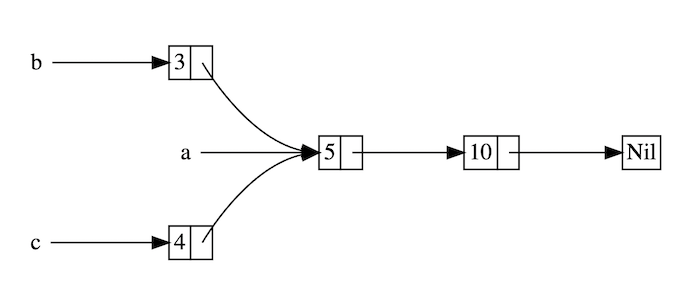
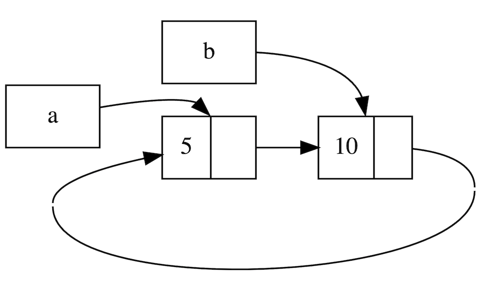

## 循环引用与自引用

实现一个链表是学习各大编程语言的常用技巧，但是在 Rust 中实现链表意味着····Hell，是的，你没看错，**Welcome to hell**。链表在 Rust 中之所以这么难，完全是因为**循环引用**和**自引用**的问题引起的，这两个问题可以说综合了 Rust 的很多难点，难出了新高度，因此本书专门开辟一章，分为上下两篇，试图彻底解决这两个老大难。

本章难度较高，但是非常值得深入阅读，它会让你对 Rust 的理解上升到一个新的境界。


### Weak与循环引用

Rust 的安全性是众所周知的，但是不代表它不会内存泄漏。一个典型的例子就是同时使用 `Rc<T>` 和 `RefCell<T>` 创建循环引用，最终这些引用的计数都无法被归零，因此 `Rc<T>` 拥有的值也不会被释放清理。


#### 循环引用

Rust 的安全性是众所周知的，但是**不代表它不会内存泄漏**。一个典型的例子就是同时使用 `Rc<T>` 和 `RefCell<T>` 创建循环引用，最终这些引用的计数都无法被归零，因此 `Rc<T>` 拥有的值也不会被释放清理。

```rust
use crate::List::{Cons, Nil};
use std::cell::RefCell;
use std::rc::Rc;

#[derive(Debug)]
enum List {
    Cons(i32, RefCell<Rc<List>>),
    Nil,
}

impl List {
    fn tail(&self) -> Option<&RefCell<Rc<List>>> {
        match self {
            Cons(_, item) => Some(item),
            Nil => None,
        }
    }
}

fn main() {}
```

这里我们创建一个有些复杂的枚举类型 `List`，这个类型很有意思，它的每个值都指向了另一个 `List`，此外，得益于 `Rc` 的使用还允许多个值指向一个 `List`：



如上图所示，每个矩形框节点都是一个 `List` 类型，它们或者是拥有值且指向另一个 `List` 的`Cons`，或者是一个没有值的终结点 `Nil`。同时，由于 `RefCell` 的使用，每个 `List` 所指向的 `List` 还能够被修改。

下面来使用一下这个复杂的 `List` 枚举：

```rust
fn main() {
    let a = Rc::new(Cons(5, RefCell::new(Rc::new(Nil))));

    println!("a的初始化rc计数 = {}", Rc::strong_count(&a));
    println!("a指向的节点 = {:?}", a.tail());

    // 创建`b`到`a`的引用
    let b = Rc::new(Cons(10, RefCell::new(Rc::clone(&a))));

    println!("在b创建后，a的rc计数 = {}", Rc::strong_count(&a));
    println!("b的初始化rc计数 = {}", Rc::strong_count(&b));
    println!("b指向的节点 = {:?}", b.tail());

    // 利用RefCell的可变性，创建了`a`到`b`的引用
    if let Some(link) = a.tail() {
        *link.borrow_mut() = Rc::clone(&b);
    }

    println!("在更改a后，b的rc计数 = {}", Rc::strong_count(&b));
    println!("在更改a后，a的rc计数 = {}", Rc::strong_count(&a));

    // 下面一行println!将导致循环引用
    // 我们可怜的8MB大小的main线程栈空间将被它冲垮，最终造成栈溢出
    // println!("a next item = {:?}", a.tail());
}
```

这个类型定义看着复杂，使用起来更复杂！不过排除这些因素，我们可以清晰看出：

1. 在创建了 `a` 后，紧接着就使用 `a` 创建了 `b`，因此 `b` 引用了 `a`
2. 然后我们又利用 `Rc` 克隆了 `b`，然后通过 `RefCell` 的可变性，让 `a` 引用了 `b`

至此我们成功创建了循环引用`a`-> `b` -> `a` -> `b` ····

先来观察下引用计数：

```console
a的初始化rc计数 = 1
a指向的节点 = Some(RefCell { value: Nil })
在b创建后，a的rc计数 = 2
b的初始化rc计数 = 1
b指向的节点 = Some(RefCell { value: Cons(5, RefCell { value: Nil }) })
在更改a后，b的rc计数 = 2
在更改a后，a的rc计数 = 2
```

在 `main` 函数结束前，`a` 和 `b` 的引用计数均是 `2`，随后 `b` 触发 `Drop`，此时引用计数会变为 `1`，并不会归 `0`，因此 `b` 所指向内存不会被释放，同理可得 `a` 指向的内存也不会被释放，最终发生了内存泄漏。

下面一张图很好的展示了这种引用循环关系： 



现在我们还需要轻轻的推一下，让塔米诺骨牌轰然倒塌。反注释最后一行代码，试着运行下：

```console
RefCell { value: Cons(5, RefCell { value: Cons(10, RefCell { value: Cons(5, RefCell { value: Cons(10, RefCell { value: Cons(5, RefCell { value: Cons(10, RefCell {
...无穷无尽
thread 'main' has overflowed its stack
fatal runtime error: stack overflow
```

通过 `a.tail` 的调用，Rust 试图打印出 `a -> b -> a ···` 的所有内容，但是在不懈的努力后，`main` 线程终于不堪重负，发生了[栈溢出](https://course.rs/pitfalls/stack-overflow.html)。

以上的代码可能并不会造成什么大的问题，但是在一个更加复杂的程序中，类似的问题可能会造成你的程序不断地分配内存、泄漏内存，最终程序会不幸**OOM**，当然这其中的 CPU 损耗也不可小觑。

总之，创建循环引用并不简单，但是也并不是完全遇不到，当你使用 `RefCell<Rc<T>>` 或者类似的类型嵌套组合（具备内部可变性和引用计数）时，就要打起万分精神，前面可能是深渊！

那么问题来了？ 如果我们确实需要实现上面的功能，该怎么办？答案是使用 `Weak`。


#### Weak

`Weak` 非常类似于 `Rc`，但是与 `Rc` 持有所有权不同，`Weak` 不持有所有权，它仅仅保存一份指向数据的弱引用：如果你想要访问数据，需要通过 `Weak` 指针的 `upgrade` 方法实现，该方法返回一个类型为 `Option<Rc<T>>` 的值。

看到这个返回，相信大家就懂了：何为弱引用？就是**不保证引用关系依然存在**，如果不存在，就返回一个 `None`！

因为 `Weak` 引用不计入所有权，因此它**无法阻止所引用的内存值被释放掉**，而且 `Weak` 本身不对值的存在性做任何担保，引用的值还存在就返回 `Some`，不存在就返回 `None`。

##### Weak 与 Rc 对比

我们来将 `Weak` 与 `Rc` 进行以下简单对比：

| `Weak`                                          | `Rc`                                      |
| ----------------------------------------------- | ----------------------------------------- |
| 不计数                                          | 引用计数                                  |
| 不拥有所有权                                    | 拥有值的所有权                            |
| 不阻止值被释放（**drop**）                      | 所有权计数归零，才能释放（**drop**）      |
| 引用的值存在返回 `Some`，不存在返回 `None`      | 引用的值必定存在                          |
| 通过 `upgrade` 取到 `Option<Rc<T>>`，然后再取值 | 通过 `Deref` 自动解引用，取值无需任何操作 |

通过这个对比，可以非常清晰的看出 `Weak` 为何这么弱，而这种弱恰恰非常适合我们实现以下的场景：

- 持有一个 `Rc` 对象的临时引用，并且不在乎引用的值是否依然存在
- 阻止 `Rc` 导致的循环引用，因为 `Rc` 的所有权机制，会导致多个 `Rc` 都无法计数归零

使用方式简单总结下：**对于父子引用关系，可以让父节点通过 `Rc` 来引用子节点，然后让子节点通过 `Weak` 来引用父节点**。

##### Weak 总结

因为 `Weak` 本身并不是很好理解，因此我们再来帮大家梳理总结下，然后再通过一个例子，来彻底掌握。

`Weak` 通过 `use std::rc::Weak` 来引入，它具有以下特点：

- 可访问，但没有所有权，不增加引用计数，因此不会影响被引用值的释放回收；
- 可由 `Rc<T>` 调用 `downgrade` 方法转换成 `Weak<T>` ；
- `Weak<T>` 可使用 `upgrade` 方法转换成 `Option<Rc<T>>`，如果资源已经被释放，则 `Option` 的值是 `None` ；
- 常用于解决循环引用的问题；

一个简单的例子：

```rust
use std::rc::Rc;
fn main() {
    // 创建Rc，持有一个值5
    let five = Rc::new(5);

    // 通过Rc，创建一个Weak指针
    let weak_five = Rc::downgrade(&five);

    // Weak引用的资源依然存在，取到值5
    let strong_five: Option<Rc<_>> = weak_five.upgrade();
    assert_eq!(*strong_five.unwrap(), 5);

    // 手动释放资源`five`
    drop(five);

    // Weak引用的资源已不存在，因此返回None
    let strong_five: Option<Rc<_>> = weak_five.upgrade();
    assert_eq!(strong_five, None);
}
```

需要承认的是，使用 `Weak` 让 Rust 本来就堪忧的代码可读性又下降了不少，但是。。。真香，因为可以解决循环引用了。


#### 使用 Weak 解决循环引用

理论知识已经足够，现在用两个例子来模拟下真实场景下可能会遇到的循环引用。

##### 例子：工具间的故事

工具间里，每个工具都有其主人，且多个工具可以拥有一个主人；同时一个主人也可以拥有多个工具，在这种场景下，就很容易形成循环引用，好在我们有 `Weak`：

```rust
use std::rc::Rc;
use std::rc::Weak;
use std::cell::RefCell;

// 主人
struct Owner {
    name: String,
    gadgets: RefCell<Vec<Weak<Gadget>>>,
}

// 工具
struct Gadget {
    id: i32,
    owner: Rc<Owner>,
}

fn main() {
    // 创建一个 Owner
    // 需要注意，该 Owner 也拥有多个 `gadgets`
    let gadget_owner : Rc<Owner> = Rc::new(
        Owner {
            name: "Gadget Man".to_string(),
            gadgets: RefCell::new(Vec::new()),
        }
    );

    // 创建工具，同时与主人进行关联：创建两个 gadget，他们分别持有 gadget_owner 的一个引用。
    let gadget1 = Rc::new(Gadget{id: 1, owner: gadget_owner.clone()});
    let gadget2 = Rc::new(Gadget{id: 2, owner: gadget_owner.clone()});

    // 为主人更新它所拥有的工具
    // 因为之前使用了 `Rc`，现在必须要使用 `Weak`，否则就会循环引用
    gadget_owner.gadgets.borrow_mut().push(Rc::downgrade(&gadget1));
    gadget_owner.gadgets.borrow_mut().push(Rc::downgrade(&gadget2));

    // 遍历 gadget_owner 的 gadgets 字段
    for gadget_opt in gadget_owner.gadgets.borrow().iter() {

        // gadget_opt 是一个 Weak<Gadget> 。 因为 weak 指针不能保证他所引用的对象
        // 仍然存在。所以我们需要显式的调用 upgrade() 来通过其返回值(Option<_>)来判
        // 断其所指向的对象是否存在。
        // 当然，Option 为 None 的时候这个引用原对象就不存在了。
        let gadget = gadget_opt.upgrade().unwrap();
        println!("Gadget {} owned by {}", gadget.id, gadget.owner.name);
    }

    // 在 main 函数的最后，gadget_owner，gadget1 和 gadget2 都被销毁。
    // 具体是，因为这几个结构体之间没有了强引用（`Rc<T>`），所以，当他们销毁的时候。
    // 首先 gadget2 和 gadget1 被销毁。
    // 然后因为 gadget_owner 的引用数量为 0，所以这个对象可以被销毁了。
    // 循环引用问题也就避免了
}
```

##### tree 数据结构

```rust
use std::cell::RefCell;
use std::rc::{Rc, Weak};

#[derive(Debug)]
struct Node {
    value: i32,
    parent: RefCell<Weak<Node>>,
    children: RefCell<Vec<Rc<Node>>>,
}

fn main() {
    let leaf = Rc::new(Node {
        value: 3,
        parent: RefCell::new(Weak::new()),
        children: RefCell::new(vec![]),
    });

    println!(
        "leaf strong = {}, weak = {}",
        Rc::strong_count(&leaf),
        Rc::weak_count(&leaf),
    );

    {
        let branch = Rc::new(Node {
            value: 5,
            parent: RefCell::new(Weak::new()),
            children: RefCell::new(vec![Rc::clone(&leaf)]),
        });

        *leaf.parent.borrow_mut() = Rc::downgrade(&branch);

        println!(
            "branch strong = {}, weak = {}",
            Rc::strong_count(&branch),
            Rc::weak_count(&branch),
        );

        println!(
            "leaf strong = {}, weak = {}",
            Rc::strong_count(&leaf),
            Rc::weak_count(&leaf),
        );
    }

    println!("leaf parent = {:?}", leaf.parent.borrow().upgrade());
    println!(
        "leaf strong = {}, weak = {}",
        Rc::strong_count(&leaf),
        Rc::weak_count(&leaf),
    );
}
```

这个例子就留给读者自己解读和分析，我们就不画蛇添足了:）


#### unsafe 解决循环引用

除了使用 Rust 标准库提供的这些类型，你还可以使用 `unsafe` 里的裸指针来解决这些棘手的问题，但是由于我们还没有讲解 `unsafe`，因此这里就不进行展开，只附上[源码链接](https://github.com/sunface/rust-algos/blob/fbcdccf3e8178a9039329562c0de0fd01a3372fb/src/unsafe/self-ref.md), 挺长的，需要耐心 o_o

虽然 `unsafe` 不安全，但是在各种库的代码中依然很常见用它来实现自引用结构，主要优点如下:

- 性能高，毕竟直接用裸指针操作；
- 代码更简单更符合直觉: 对比下 `Option<Rc<RefCell<Node>>>` ；


#### 总结

本文深入讲解了何为循环引用以及如何使用 `Weak` 来解决，同时还结合 `Rc`、`RefCell`、`Weak` 等实现了两个有实战价值的例子，让大家对智能指针的使用更加融会贯通。

至此，智能指针一章即将结束（严格来说还有一个 `Mutex` 放在多线程一章讲解），而 Rust 语言本身的学习之旅也即将结束，后面我们将深入多线程、项目工程、应用实践、性能分析等特色专题，来一睹 Rust 在这些领域的风采。


### 结构体中的自引用

结构体自引用在 Rust 中是一个众所周知的难题，而且众说纷纭，也没有一篇文章能把相关的话题讲透，那本文就王婆卖瓜，来试试看能不能讲透这一块儿内容，让读者大大们舒心。

可能也有不少人第一次听说自引用结构体，那咱们先来看看它们长啥样。

```rust
struct SelfRef<'a> {
    value: String,

    // 该引用指向上面的value
    pointer_to_value: &'a str,
}
```

以上就是一个很简单的自引用结构体，看上去好像没什么，那来试着运行下：

```rust
fn main(){
    let s = "aaa".to_string();
    let v = SelfRef {
        value: s,
        pointer_to_value: &s
    };
}
```

运行后报错：

```shell
 let v = SelfRef {
12 |         value: s,
   |                - value moved here
13 |         pointer_to_value: &s
   |                           ^^ value borrowed here after move
```

因为我们试图同时使用值和值的引用，最终所有权转移和借用一起发生了。所以，这个问题貌似并没有那么好解决，不信你可以回想下自己具有的知识，是否可以解决？


#### 使用 Option

最简单的方式就是使用 `Option` 分两步来实现：

```rust
#[derive(Debug)]
struct SelfRef<'a> {
    value: String,

    // 该引用指向上面的value
    pointer_to_value: Option<&'a str>,
}

fn main(){
    let s = "aaa".to_string();
    let mut v = SelfRef {
        value: s,
        pointer_to_value: None,
    };
    v.pointer_to_value=Some(&v.value);

    println!("{:?}",v);
}
```

在某种程度上来说，`Option` 这个方法可以工作，但是这个方法的限制较多，例如从一个函数创建并返回它是不可能的：

```rust
fn creator<'a>() -> WhatAboutThis<'a> {
    let mut tricky = WhatAboutThis {
        name: "Annabelle".to_string(),
        nickname: None,
    };
    tricky.nickname = Some(&tricky.name[..4]);

    tricky
}
```

报错如下：

```shell
error[E0515]: cannot return value referencing local data `tricky.name`
  --> src/main.rs:24:5
   |
22 |     tricky.nickname = Some(&tricky.name[..4]);
   |                             ----------- `tricky.name` is borrowed here
23 |
24 |     tricky
   |     ^^^^^^ returns a value referencing data owned by the current function
```

其实从函数签名就能看出来端倪，`'a` 生命周期是凭空产生的！

如果是通过方法使用，你需要一个无用 `&'a self` 生命周期标识，一旦有了这个标识，代码将变得更加受限，你将很容易就获得借用错误，就连 NLL 规则都没用：

```rust
#[derive(Debug)]
struct WhatAboutThis<'a> {
    name: String,
    nickname: Option<&'a str>,
}

impl<'a> WhatAboutThis<'a> {
    fn tie_the_knot(&'a mut self) {
       self.nickname = Some(&self.name[..4]);
    }
}

fn main() {
    let mut tricky = WhatAboutThis {
        name: "Annabelle".to_string(),
        nickname: None,
    };
    tricky.tie_the_knot();

    // cannot borrow `tricky` as immutable because it is also borrowed as mutable
    // println!("{:?}", tricky);
}
```


#### unsafe 实现

既然借用规则妨碍了我们，那就一脚踢开：

```rust
#[derive(Debug)]
struct SelfRef {
    value: String,
    pointer_to_value: *const String,
}

impl SelfRef {
    fn new(txt: &str) -> Self {
        SelfRef {
            value: String::from(txt),
            pointer_to_value: std::ptr::null(),
        }
    }

    fn init(&mut self) {
        let self_ref: *const String = &self.value;
        self.pointer_to_value = self_ref;
    }

    fn value(&self) -> &str {
        &self.value
    }

    fn pointer_to_value(&self) -> &String {
        assert!(!self.pointer_to_value.is_null(),
            "Test::b called without Test::init being called first");
        unsafe { &*(self.pointer_to_value) }
    }
}

fn main() {
    let mut t = SelfRef::new("hello");
    t.init();
    // 打印值和指针地址
    println!("{}, {:p}", t.value(), t.pointer_to_value());
}
```

在这里，我们在 `pointer_to_value` 中直接存储裸指针，而不是 Rust 的引用，因此不再受到 Rust 借用规则和生命周期的限制，而且实现起来非常清晰、简洁。但是缺点就是，通过指针获取值时需要使用 `unsafe` 代码。

当然，上面的代码你还能通过裸指针来修改 `String`，但是需要将 `*const` 修改为 `*mut`：

```rust
#[derive(Debug)]
struct SelfRef {
    value: String,
    pointer_to_value: *mut String,
}

impl SelfRef {
    fn new(txt: &str) -> Self {
        SelfRef {
            value: String::from(txt),
            pointer_to_value: std::ptr::null_mut(),
        }
    }

    fn init(&mut self) {
        let self_ref: *mut String = &mut self.value;
        self.pointer_to_value = self_ref;
    }

    fn value(&self) -> &str {
        &self.value
    }

    fn pointer_to_value(&self) -> &String {
        assert!(!self.pointer_to_value.is_null(), "Test::b called without Test::init being called first");
        unsafe { &*(self.pointer_to_value) }
    }
}

fn main() {
    let mut t = SelfRef::new("hello");
    t.init();
    println!("{}, {:p}", t.value(), t.pointer_to_value());

    t.value.push_str(", world");
    unsafe {
        (&mut *t.pointer_to_value).push_str("!");
    }

    println!("{}, {:p}", t.value(), t.pointer_to_value());
}
```

运行后输出：

```shell
hello, 0x16f3aec70
hello, world!, 0x16f3aec70
```

上面的 `unsafe` 虽然简单好用，但是它不太安全，是否还有其他选择？还真的有，那就是 `Pin`。


#### 无法被移动的 Pin

`Pin` 在后续章节会深入讲解，目前你只需要知道它可以固定住一个值，防止该值在内存中被移动。

通过开头我们知道，自引用最麻烦的就是创建引用的同时，值的所有权会被转移，而通过 `Pin` 就可以很好的防止这一点：

```rust
use std::marker::PhantomPinned;
use std::pin::Pin;
use std::ptr::NonNull;

// 下面是一个自引用数据结构体，因为 slice 字段是一个指针，指向了 data 字段
// 我们无法使用普通引用来实现，因为违背了 Rust 的编译规则
// 因此，这里我们使用了一个裸指针，通过 NonNull 来确保它不会为 null
struct Unmovable {
    data: String,
    slice: NonNull<String>,
    _pin: PhantomPinned,
}

impl Unmovable {
    // 为了确保函数返回时数据的所有权不会被转移，我们将它放在堆上，唯一的访问方式就是通过指针
    fn new(data: String) -> Pin<Box<Self>> {
        let res = Unmovable {
            data,
            // 只有在数据到位时，才创建指针，否则数据会在开始之前就被转移所有权
            slice: NonNull::dangling(),
            _pin: PhantomPinned,
        };
        let mut boxed = Box::pin(res);

        let slice = NonNull::from(&boxed.data);
        // 这里其实安全的，因为修改一个字段不会转移整个结构体的所有权
        unsafe {
            let mut_ref: Pin<&mut Self> = Pin::as_mut(&mut boxed);
            Pin::get_unchecked_mut(mut_ref).slice = slice;
        }
        boxed
    }
}

fn main() {
    let unmoved = Unmovable::new("hello".to_string());
    // 只要结构体没有被转移，那指针就应该指向正确的位置，而且我们可以随意移动指针
    let mut still_unmoved = unmoved;
    assert_eq!(still_unmoved.slice, NonNull::from(&still_unmoved.data));

    // 因为我们的类型没有实现 `Unpin` 特征，下面这段代码将无法编译
    // let mut new_unmoved = Unmovable::new("world".to_string());
    // std::mem::swap(&mut *still_unmoved, &mut *new_unmoved);
}
```

上面的代码也非常清晰，虽然使用了 `unsafe`，其实更多的是无奈之举，跟之前的 `unsafe` 实现完全不可同日而语。

其实 `Pin` 在这里并没有魔法，它也并不是实现自引用类型的主要原因，最关键的还是里面的裸指针的使用，而 `Pin` 起到的作用就是确保我们的值不会被移走，否则指针就会指向一个错误的地址！


#### 使用 ouroboros

对于自引用结构体，三方库也有支持的，其中一个就是 [ouroboros](https://github.com/joshua-maros/ouroboros)，当然它也有自己的限制，我们后面会提到，先来看看该如何使用：

```toml
ouroboros = "0.15.5"
```

```rust
use ouroboros::self_referencing;

#[self_referencing]
struct SelfRef {
    value: String,

    #[borrows(value)]
    pointer_to_value: &'this str,
}

fn main(){
    let v = SelfRefBuilder {
        value: "aaa".to_string(),
        pointer_to_value_builder: |value: &String| value,
    }.build();

    // 借用value值
    let s = v.borrow_value();
    // 借用指针
    let p = v.borrow_pointer_to_value();
    // value值和指针指向的值相等
    assert_eq!(s, *p);
}
```

可以看到，`ouroboros` 使用起来并不复杂，就是需要你去按照它的方式创建结构体和引用类型：`SelfRef` 变成 `SelfRefBuilder`，引用字段从 `pointer_to_value` 变成 `pointer_to_value_builder`，并且连类型都变了。

在使用时，通过 `borrow_value` 来借用 `value` 的值，通过 `borrow_pointer_to_value` 来借用 `pointer_to_value` 这个指针。

看上去很美好对吧？但是你可以尝试着去修改 `String` 字符串的值试试，`ouroboros` 限制还是较多的，但是对于基本类型依然是支持的不错，以下例子来源于官方：

```rust
use ouroboros::self_referencing;

#[self_referencing]
struct MyStruct {
    int_data: i32,
    float_data: f32,
    #[borrows(int_data)]
    int_reference: &'this i32,
    #[borrows(mut float_data)]
    float_reference: &'this mut f32,
}

fn main() {
    let mut my_value = MyStructBuilder {
        int_data: 42,
        float_data: 3.14,
        int_reference_builder: |int_data: &i32| int_data,
        float_reference_builder: |float_data: &mut f32| float_data,
    }.build();

    // Prints 42
    println!("{:?}", my_value.borrow_int_data());
    // Prints 3.14
    println!("{:?}", my_value.borrow_float_reference());
    // Sets the value of float_data to 84.0
    my_value.with_mut(|fields| {
        **fields.float_reference = (**fields.int_reference as f32) * 2.0;
    });

    // We can hold on to this reference...
    let int_ref = *my_value.borrow_int_reference();
    println!("{:?}", *int_ref);
    // As long as the struct is still alive.
    drop(my_value);
    // This will cause an error!
    // println!("{:?}", *int_ref);
}
```

总之，使用这个库前，强烈建议看一些官方的例子中支持什么样的类型和 API，如果能满足的你的需求，就果断使用它，如果不能满足，就继续往下看。

只能说，它确实帮助我们解决了问题，但是一个是破坏了原有的结构，另外就是并不是所有数据类型都支持：它需要目标值的内存地址不会改变，因此 `Vec` 动态数组就不适合，因为当内存空间不够时，Rust 会重新分配一块空间来存放该数组，这会导致内存地址的改变。

类似的库还有：

- [rental](https://github.com/jpernst/rental)， 这个库其实是最有名的，但是好像不再维护了，用倒是没问题
- [owning-ref](https://github.com/Kimundi/owning-ref-rs)，将所有者和它的引用绑定到一个封装类型

这三个库，各有各的特点，也各有各的缺陷，建议大家需要时，一定要仔细调研，并且写 demo 进行测试，不可大意。

> **rental** 虽然不怎么维护，但是可能依然是这三个里面最强大的，而且网上的用例也比较多，容易找到参考代码。


#### 其他方法（不推荐，无实现）

##### Rc + RefCell 或 Arc + Mutex

类似于循环引用的解决方式，自引用也可以用这种组合来解决，但是会导致代码的类型标识到处都是，大大的影响了可读性。

##### 终极大法

如果两个放在一起会报错，那就分开它们。对，终极大法就这么简单，当然思路上的简单不代表实现上的简单，最终结果就是导致代码复杂度的上升。

##### 学习一本书：如何实现链表

最后，推荐一本专门将如何实现链表的书（真是富有 Rust 特色，链表都能复杂到出书了 o_o），[Learn Rust by writing Entirely Too Many Linked Lists](https://rust-unofficial.github.io/too-many-lists/)


#### 总结

上面讲了这么多方法，但是我们依然无法正确的告诉你在某个场景应该使用哪个方法，这个需要你自己的判断，因为自引用实在是过于复杂。

我们能做的就是告诉你，有这些办法可以解决自引用问题，而这些办法每个都有自己适用的范围，需要你未来去深入的挖掘和发现。

偷偷说一句，就算是我，遇到自引用一样挺头疼，好在这种情况真的不常见，往往是实现特定的算法和数据结构时才需要，应用代码中几乎用不到。

