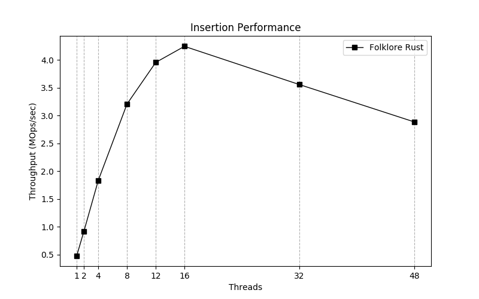

## 多线程并发编程


### 线程

放在十年前，多线程编程可能还是一个少数人才掌握的核心概念，但是在今天，随着编程语言的不断发展，多线程、多协程、Actor 等并发编程方式已经深入人心，同时多线程编程的门槛也在不断降低，本章节我们来看看在 Rust 中该如何使用多线程。


#### 多线程编程的风险

由于多线程的代码是同时运行的，因此我们无法保证线程间的执行顺序，这会导致一些问题：

- 竞态条件（**race conditions**），多个线程以非一致性的顺序同时访问数据资源；
- 死锁（**deadlocks**），两个线程都想使用某个资源，但是又都在等待对方释放资源后才能使用，结果最终都无法继续执行；
- 一些因为多线程导致的很隐晦的 BUG，难以复现和解决；

虽然 Rust 已经通过各种机制减少了上述情况的发生，但是依然无法完全避免上述情况，因此我们在编程时需要格外的小心，同时本书也会列出多线程编程时常见的陷阱，让你提前规避可能的风险。


#### 创建线程

使用 `thread::spawn` 可以创建线程：

```rust
use std::thread;
use std::time::Duration;

fn main() {
    thread::spawn(|| {
        for i in 1..10 {
            println!("hi number {} from the spawned thread!", i);
            thread::sleep(Duration::from_millis(1));
        }
    });

    for i in 1..5 {
        println!("hi number {} from the main thread!", i);
        thread::sleep(Duration::from_millis(1));
    }
}
```

有几点值得注意：

- 线程内部的代码使用闭包来执行
- `main` 线程一旦结束，程序就立刻结束，因此需要保持它的存活，直到其它子线程完成自己的任务
- `thread::sleep` 会让当前线程休眠指定的时间，随后其它线程会被调度运行，因此就算你的电脑只有一个 CPU 核心，该程序也会表现的如同多 CPU 核心一般，这就是并发！

来看看输出：

```console
hi number 1 from the main thread!
hi number 1 from the spawned thread!
hi number 2 from the main thread!
hi number 2 from the spawned thread!
hi number 3 from the main thread!
hi number 3 from the spawned thread!
hi number 4 from the spawned thread!
hi number 4 from the main thread!
hi number 5 from the spawned thread!
```

如果多运行几次，你会发现好像每次输出会不太一样，因为：虽说线程往往是轮流执行的，但是这一点无法被保证！线程调度的方式往往取决于你使用的操作系统。总之，**千万不要依赖线程的执行顺序**。


#### 等待子线程的结束

上面的代码你不但可能无法让子线程从 1 顺序打印到 10，而且可能打印的数字会变少，因为主线程会提前结束，导致子线程也随之结束，更过分的是，如果当前系统繁忙，甚至该子线程还没被创建，主线程就已经结束了！

因此我们需要一个方法，让主线程安全、可靠地等所有子线程完成任务后，再 **kill self**：

```rust
use std::thread;
use std::time::Duration;

fn main() {
    let _handle = thread::spawn(|| {
        for i in 1..5 {
            println!("hi number {} from the spawned thread!", i);
            thread::sleep(Duration::from_secs(1));
        }
    });

    for i in 1..10 {
        println!("hi number {} from the main thread!", i);
        thread::sleep(Duration::from_millis(1));
    }

    // handle.join().unwrap();

    println!("wait thread kill");
}
```

```shell
hi number 1 from the main thread!
hi number 1 from the spawned thread!
hi number 2 from the main thread!   
hi number 3 from the main thread!
hi number 4 from the main thread!
hi number 5 from the main thread!
hi number 6 from the main thread!
hi number 7 from the main thread!
hi number 8 from the main thread!
hi number 9 from the main thread!
wait thread kill
```

通过调用 `handle.join`，可以让当前线程阻塞，直到它等待的子线程的结束：

```rust
use std::thread;
use std::time::Duration;

fn main() {
    let handle = thread::spawn(|| {
        for i in 1..5 {
            println!("hi number {} from the spawned thread!", i);
            thread::sleep(Duration::from_secs(1));
        }
    });

    for i in 1..10 {
        println!("hi number {} from the main thread!", i);
        thread::sleep(Duration::from_millis(1));
    }

    handle.join().unwrap();

    println!("wait thread kill");
}
```

```shell
hi number 1 from the main thread!
hi number 1 from the spawned thread!
hi number 2 from the main thread!   
hi number 3 from the main thread!
hi number 4 from the main thread!
hi number 5 from the main thread!
hi number 6 from the main thread!
hi number 7 from the main thread!
hi number 8 from the main thread!
hi number 9 from the main thread!
hi number 2 from the spawned thread!
hi number 3 from the spawned thread!
hi number 4 from the spawned thread!
wait thread kill
```


#### 在线程闭包中使用 move

在[闭包](https://course.rs/advance/functional-programing/closure.html#move-和-fn)章节中，有讲过 `move` 关键字在闭包中的使用可以让该闭包拿走环境中某个值的所有权，同样地，你可以使用 `move` 来将所有权从一个线程转移到另外一个线程。

首先，来看看在一个线程中直接使用另一个线程中的数据会如何：

```rust
use std::thread;

fn main() {
    let v = vec![1, 2, 3];

    let handle = thread::spawn(|| {
        println!("Here's a vector: {:?}", v);
    });

    handle.join().unwrap();
}
```

以上代码在子线程的闭包中捕获了环境中的 `v` 变量，来看看结果：

```console
error[E0373]: closure may outlive the current function, but it borrows `v`, which is owned by the current function
 --> src/main.rs:6:32
  |
6 |     let handle = thread::spawn(|| {
  |                                ^^ may outlive borrowed value `v`
7 |         println!("Here's a vector: {:?}", v);
  |                                           - `v` is borrowed here
  |
note: function requires argument type to outlive `'static`
 --> src/main.rs:6:18
  |
6 |       let handle = thread::spawn(|| {
  |  __________________^
7 | |         println!("Here's a vector: {:?}", v);
8 | |     });
  | |______^
help: to force the closure to take ownership of `v` (and any other referenced variables), use the `move` keyword
  |
6 |     let handle = thread::spawn(move || {
  |                                ++++
```

其实代码本身并没有什么问题，问题在于 Rust 无法确定新的线程会活多久（多个线程的结束顺序并不是固定的），所以也无法确定新线程所引用的 `v` 是否在使用过程中一直合法：

```rust
use std::thread;

fn main() {
    let v = vec![1, 2, 3];

    let handle = thread::spawn(|| {
        println!("Here's a vector: {:?}", v);
    });

    drop(v); // oh no!

    handle.join().unwrap();
}
```

大家要记住，线程的启动时间点和结束时间点是不确定的，因此存在一种可能，当主线程执行完， `v` 被释放掉时，新的线程很可能还没有结束甚至还没有被创建成功，此时新线程对 `v` 的引用立刻就不再合法！

好在报错里进行了提示：`to force the closure to take ownership of v (and any other referenced variables), use the `move` keyword`，让我们使用 `move` 关键字拿走 `v` 的所有权即可：

```rust
use std::thread;

fn main() {
    let v = vec![1, 2, 3];

    let handle = thread::spawn(move || {
        println!("Here's a vector: {:?}", v);
    });

    handle.join().unwrap();

    // 下面代码会报错borrow of moved value: `v`
    // println!("{:?}",v);
}
```

如上所示，很简单的代码，而且 Rust 的所有权机制保证了数据使用上的安全：`v` 的所有权被转移给新的线程后，`main` 线程将无法继续使用：**最后一行代码将报错**。


#### 线程是如何结束的

之前我们提到 `main` 线程是程序的主线程，一旦结束，则程序随之结束，同时各个子线程也将被强行终止。那么有一个问题，如果父线程不是 `main` 线程，那么父线程的结束会导致什么？自生自灭还是被干掉？

在系统编程中，操作系统提供了直接杀死线程的接口，简单粗暴，但是 Rust 并没有提供这样的接口，原因在于，粗暴地终止一个线程可能会导致资源没有释放、状态混乱等不可预期的结果，一向以安全自称的 Rust，自然不会砸自己的饭碗。

那么 Rust 中线程是如何结束的呢？答案很简单：线程的代码执行完，线程就会自动结束。但是如果线程中的代码不会执行完呢？那么情况可以分为两种进行讨论：

- 线程的任务是一个循环 IO 读取，任务流程类似：IO 阻塞，等待读取新的数据 -> 读到数据，处理完成 -> 继续阻塞等待 ··· -> 收到 socket 关闭的信号 -> 结束线程，在此过程中，绝大部分时间线程都处于阻塞的状态，因此虽然看上去是循环，CPU 占用其实很小，也是网络服务中最最常见的模型
- 线程的任务是一个循环，里面没有任何阻塞，包括休眠这种操作也没有，此时 CPU 很不幸的会被跑满，而且你如果没有设置终止条件，该线程将持续跑满一个 CPU 核心，并且不会被终止，直到 `main` 线程的结束

第一情况很常见，我们来模拟看看第二种情况：

```rust
use std::thread;
use std::time::Duration;
fn main() {
    // 创建一个线程A
    let new_thread = thread::spawn(move || {
        // 再创建一个线程B
        thread::spawn(move || {
            loop {
                println!("I am a new thread.");
            }
        })
    });

    // 等待新创建的线程执行完成
    new_thread.join().unwrap();
    println!("Child thread is finish!");

    // 睡眠一段时间，看子线程创建的子线程是否还在运行
    thread::sleep(Duration::from_millis(100));
}
```

以上代码中，`main` 线程创建了一个新的线程 `A`，同时该新线程又创建了一个新的线程 `B`，可以看到 `A` 线程在创建完 `B` 线程后就立即结束了，而 `B` 线程则在不停地循环输出。

从之前的线程结束规则，我们可以猜测程序将这样执行：`A` 线程结束后，由它创建的 `B` 线程仍在疯狂输出，直到 `main` 线程在 100 毫秒后结束。如果你把该时间增加到几十秒，就可以看到你的 CPU 核心 100% 的盛况了。


#### 多线程的性能

下面我们从多个方面来看看多线程的性能大概是怎么样的。

##### 创建线程的性能

据不精确估算，创建一个线程大概需要 0.24 毫秒，随着线程的变多，这个值会变得更大，因此线程的创建耗时并不是不可忽略的，只有当真的需要处理一个值得用线程去处理的任务时，才使用线程，一些鸡毛蒜皮的任务，就无需创建线程了。

##### 创建多少线程合适

因为 CPU 的核心数限制，当任务是 CPU 密集型时，就算线程数超过了 CPU 核心数，也并不能帮你获得更好的性能，因为每个线程的任务都可以轻松让 CPU 的某个核心跑满，既然如此，让线程数等于 CPU 核心数是最好的。

但是当你的任务大部分时间都处于阻塞状态时，就可以考虑增多线程数量，这样当某个线程处于阻塞状态时，会被切走，进而运行其它的线程，典型就是网络 IO 操作，我们可以为每一个进来的用户连接创建一个线程去处理，该连接绝大部分时间都是处于 IO 读取阻塞状态，因此有限的 CPU 核心完全可以处理成百上千的用户连接线程，但是事实上，对于这种网络 IO 情况，一般都不再使用多线程的方式了，毕竟操作系统的线程数是有限的，意味着并发数也很容易达到上限，而且过多的线程也会导致线程上下文切换的代价过大，使用 `async/await` 的 `M:N` 并发模型，就没有这个烦恼。

##### 多线程的开销

下面的代码是一个无锁实现（**CAS**——**C**ompare **A**nd **S**wap）的 `Hashmap` 在多线程下的使用：

```rust
for i in 0..num_threads {
    let ht = Arc::clone(&ht);

    let handle = thread::spawn(move || {
        for j in 0..adds_per_thread {
            let key = thread_rng().gen::<u32>();
            let value = thread_rng().gen::<u32>();
            ht.set_item(key, value);
        }
    });

    handles.push(handle);
}

for handle in handles {
    handle.join().unwrap();
}
```

按理来说，既然是无锁实现了，那么锁的开销应该几乎没有，性能会随着线程数的增加接近线性增长，但是真的是这样吗？

下图是该代码在 `48` 核机器上的运行结果：



从图上可以明显的看出：吞吐并不是线性增长，尤其从 `16` 核开始，甚至开始肉眼可见的下降，这是为什么呢？

限于书本的篇幅有限，我们只能给出大概的原因：

- 虽然是无锁，但是内部是 **CAS** 实现，大量线程的同时访问，会让 **CAS** 重试次数大幅增加；
- 线程过多时，CPU 缓存的命中率会显著下降，同时多个线程竞争一个 CPU Cache-line 的情况也会经常发生；
- 大量读写可能会让内存带宽也成为瓶颈；
- 读和写不一样，**无锁数据结构的读往往可以很好地线性增长**，但是写不行，因为写竞争太大；

总之，多线程的开销往往是在锁、数据竞争、缓存失效上，这些限制了现代化软件系统随着 CPU 核心的增多性能也线性增加的野心。


#### 线程屏障（Barrier）

在 Rust 中，可以使用 `Barrier` 让多个线程都执行到某个点后，才继续一起往后执行：

```rust
use std::sync::{Arc, Barrier};
use std::thread;

fn main() {
    let mut handles = Vec::with_capacity(6);
    let barrier = Arc::new(Barrier::new(6));
    for i in 0..6 {
        let b = barrier.clone();
        handles.push(thread::spawn(move || {
            println!("before wait, thread {}", i);
            b.wait();
            println!("after wait, thread {}", i);
        }));
    }

    for handle in handles {
        handle.join().unwrap();
    }
}
```

上面代码，我们在线程打印出 `before wait` 后增加了一个屏障，目的就是等所有的线程都打印出**before wait**后，各个线程再继续执行：

```shell
before wait, thread 0
before wait, thread 1
before wait, thread 3
before wait, thread 5
before wait, thread 2
before wait, thread 4
after wait, thread 4
after wait, thread 0
after wait, thread 3
after wait, thread 2
after wait, thread 5
after wait, thread 1
```


#### 线程局部变量（Thread Local Variable）

对于多线程编程，线程局部变量在一些场景下非常有用，而 Rust 通过标准库和三方库对此进行了支持。

##### 标准库 thread_local

使用 `thread_local` 宏可以**初始化线程局部变量**，然后在线程内部使用该变量的 `with` 方法获取变量值：

```rust
#![allow(unused)]
fn main() {
    use std::cell::RefCell;
    use std::thread;

    thread_local!(static FOO: RefCell<u32> = RefCell::new(1));

    FOO.with(|f| {
        assert_eq!(*f.borrow(), 1);
        *f.borrow_mut() = 2;
    });

    // 每个线程开始时都会拿到线程局部变量的FOO的初始值
    let t = thread::spawn(move || {
        FOO.with(|f| {
            assert_eq!(*f.borrow(), 1);
            *f.borrow_mut() = 3;
        });
    });

    // 等待线程完成
    t.join().unwrap();

    // 尽管子线程中修改为了3，我们在这里依然拥有main线程中的局部值：2
    FOO.with(|f| {
        assert_eq!(*f.borrow(), 2);
    });
}
```

上面代码中，`FOO` 即是我们创建的**线程局部变量**，每个新的线程访问它时，都会使用它的初始值作为开始，各个线程中的 `FOO` 值彼此互不干扰。注意 `FOO` 使用 `static` 声明为生命周期为 `'static` 的静态变量。

可以注意到，线程中对 `FOO` 的使用是通过借用的方式，但是若我们需要每个线程独自获取它的拷贝，最后进行汇总，就有些强人所难了。

你还可以在结构体中使用线程局部变量：

```rust
use std::cell::RefCell;

struct Foo;
impl Foo {
    thread_local! {
        static FOO: RefCell<usize> = RefCell::new(0);
    }
}

fn main() {
    Foo::FOO.with(|x| println!("{:?}", x));
}
```

或者通过引用的方式使用它：

```rust
use std::cell::RefCell;
use std::thread::LocalKey;

thread_local! {
    static FOO: RefCell<usize> = RefCell::new(0);
}
struct Bar {
    foo: &'static LocalKey<RefCell<usize>>,
}
impl Bar {
    fn constructor() -> Self {
        Self {
            foo: &FOO,
        }
    }
}
```

##### 三方库 thread-local

除了标准库外，一位大神还开发了 [thread-local](https://github.com/Amanieu/thread_local-rs) 库，它允许每个线程持有值的独立拷贝：

```toml
[dependencies]
thread_local = "1.1"
```

```rust
#![allow(unused)]
fn main() {
    use std::cell::Cell;
    use std::sync::Arc;
    use std::thread;
    use thread_local::ThreadLocal;

    let tls = Arc::new(ThreadLocal::new());

    // 创建多个线程
    for _ in 0..5 {
        let tls2 = tls.clone();
        thread::spawn(move || {
            // 将计数器加1
            let cell = tls2.get_or(|| Cell::new(0));
            cell.set(cell.get() + 1);
        })
        .join()
        .unwrap();
    }

    // 一旦所有子线程结束，收集它们的线程局部变量中的计数器值，然后进行求和
    let tls = Arc::try_unwrap(tls).unwrap();
    let total = tls.into_iter().fold(0, |x, y| x + y.get());

    // 和为5
    assert_eq!(total, 5);
}
```

该库不仅仅使用了值的拷贝，而且还能自动把多个拷贝汇总到一个迭代器中，最后进行求和，非常好用。


#### 用条件控制线程的挂起和执行

**条件变量**（**Condition Variables**）经常和 `Mutex` 一起使用，可以让线程挂起，直到某个条件发生后再继续执行：

```rust
use std::thread;
use std::sync::{Arc, Mutex, Condvar};

fn main() {
    let pair = Arc::new((Mutex::new(false), Condvar::new()));
    let pair2 = pair.clone();

    thread::spawn(move|| {
        let &(ref lock, ref cvar) = &*pair2;
        let mut started = lock.lock().unwrap();
        println!("changing started");
        *started = true;
        cvar.notify_one();
    });

    let &(ref lock, ref cvar) = &*pair;
    let mut started = lock.lock().unwrap();
    while !*started {
        started = cvar.wait(started).unwrap();
    }

    println!("started changed");
}
```

上述代码流程如下：

1. `main` 线程首先进入 `while` 循环，调用 `wait` 方法挂起等待子线程的通知，并释放了锁 `started` ；
2. 子线程获取到锁，并将其修改为 `true`，然后调用条件变量的 `notify_one` 方法来通知主线程继续执行；


#### 之被调用一次的函数

有时，我们会需要某个函数在多线程环境下只被调用一次，例如初始化全局变量，无论是哪个线程先调用函数来初始化，都会保证全局变量只会被初始化一次，随后的其它线程调用就会忽略该函数：

有时，我们会需要某个函数在多线程环境下只被调用一次，例如初始化全局变量，无论是哪个线程先调用函数来初始化，都会保证全局变量只会被初始化一次，随后的其它线程调用就会忽略该函数：

```rust
use std::thread;
use std::sync::Once;

static mut VAL: usize = 0;
static INIT: Once = Once::new();

fn main() {
    let handle1 = thread::spawn(move || {
        INIT.call_once(|| {
            unsafe {
                VAL = 1;
            }
        });
    });

    let handle2 = thread::spawn(move || {
        INIT.call_once(|| {
            unsafe {
                VAL = 2;
            }
        });
    });

    handle1.join().unwrap();
    handle2.join().unwrap();

    println!("{}", unsafe { VAL });
}
```

代码运行的结果取决于哪个线程先调用 `INIT.call_once` （虽然代码具有先后顺序，但是线程的初始化顺序并无法被保证！因为线程初始化是异步的，且耗时较久），若 `handle1` 先，则输出 `1`，否则输出 `2`。

**call_once 方法**：

1. 执行初始化过程一次，并且只执行一次。
2. 如果当前有另一个初始化过程正在运行，线程将阻止该方法被调用。
3. 当这个函数返回时，保证一些初始化已经运行并完成，它还保证由执行的闭包所执行的任何内存写入都能被其他线程在这时可靠地观察到。


#### 总结

- [Rust 的线程模型](https://course.rs/advance/concurrency-with-threads/intro.html) 是 `1:1` 模型，因为 Rust 要保持尽量小的运行时。

- 我们可以使用 `thread::spawn` 来创建线程，创建出的多个线程之间并不存在执行顺序关系，因此代码逻辑千万不要依赖于线程间的执行顺序。

- `main` 线程若是结束，则所有子线程都将被终止，如果希望等待子线程结束后，再结束 `main` 线程，你需要使用创建线程时返回的句柄的 `join` 方法。

- 在线程中无法直接借用外部环境中的变量值，因为新线程的启动时间点和结束时间点是不确定的，所以 Rust 无法保证该线程中借用的变量在使用过程中依然是合法的。你可以使用 `move` 关键字将变量的所有权转移给新的线程，来解决此问题。

- 父线程结束后，子线程仍在持续运行，直到子线程的代码运行完成或者 `main` 线程的结束。

---


### 线程同步


#### 消息传递

在多线程间有多种方式可以共享、传递数据，最常用的方式就是通过消息传递或者将锁和`Arc`联合使用，而对于前者，在编程界还有一个大名鼎鼎的`Actor线程模型`为其背书，典型的有 Erlang 语言，还有 Go 语言中很经典的一句话：

> **Do not communicate by sharing memory; instead, share memory by communicating.**


##### 消息通道

与 Go 语言内置的`chan`不同，Rust 是在标准库里提供了消息通道（`channel`），你可以将其想象成一场直播，多个主播联合起来在搞一场直播，最终内容通过通道传输给屏幕前的我们，其中主播被称之为**发送者**，观众被称之为**接收者**，显而易见的是：一个通道应该支持多个发送者和接收者。

但是，在实际使用中，我们需要使用不同的库来满足诸如：**多发送者 -> 单接收者，多发送者 -> 多接收者**等场景形式，此时一个标准库显然就不够了，不过别急，让我们先从标准库讲起。


##### 多发送者单接收者

标准库提供了通道`std::sync::mpsc`，其中`mpsc`是***multiple producer, single consumer***的缩写，代表了该通道支持多个发送者，但是**只支持唯一的接收者**。 当然，支持多个发送者也意味着支持单个发送者，我们先来看看单发送者、单接收者的简单例子：

```rust
use std::sync::mpsc;
use std::thread;

fn main() {
    // 创建一个消息通道, 返回一个元组：(发送者，接收者)
    let (tx, rx) = mpsc::channel();

    // 创建线程，并发送消息
    thread::spawn(move || {
        // 发送一个数字1, send方法返回Result<T,E>，通过unwrap进行快速错误处理
        tx.send(1).unwrap();

        // 下面代码将报错，因为编译器自动推导出通道传递的值是i32类型，那么Option<i32>类型将产生不匹配错误
        // tx.send(Some(1)).unwrap()
    });

    // 在主线程中接收子线程发送的消息并输出
    println!("receive {}", rx.recv().unwrap());
}
```

以上代码并不复杂，但仍有几点需要注意：

1. `tx`,`rx`对应发送者和接收者，它们的类型由编译器自动推导: `tx.send(1)`发送了整数，因此它们分别是`mpsc::Sender<i32>`和`mpsc::Receiver<i32>`类型，需要注意，由于内部是泛型实现，一旦类型被推导确定，该通道就只能传递对应类型的值, 例如此例中非`i32`类型的值将导致编译错误；
2. 接收消息的操作`rx.recv()`会阻塞当前线程，直到读取到值，或者通道被关闭；
3. 需要使用`move`将`tx`的所有权转移到子线程的闭包中；

在注释中提到`send`方法返回一个`Result<T,E>`，说明它有可能返回一个错误，例如接收者被`drop`导致了发送的值不会被任何人接收，此时继续发送毫无意义，因此返回一个错误最为合适，在代码中我们仅仅使用`unwrap`进行了快速处理，但在实际项目中你需要对错误进行进一步的处理。

同样的，对于`recv`方法来说，当发送者关闭时，它也会接收到一个错误，用于说明不会再有任何值被发送过来。


###### 不阻塞的 try_recv 方法

除了上述`recv`方法，还可以使用`try_recv`尝试接收一次消息，该方法并**不会阻塞线程**，当通道中没有消息时，它会立刻返回一个错误：

```rust
use std::sync::mpsc;
use std::thread;

fn main() {
    let (tx, rx) = mpsc::channel();

    thread::spawn(move || {
        tx.send(1).unwrap();
    });

    println!("receive {:?}", rx.try_recv());
}
```

由于子线程的创建需要时间，因此`println!`和`try_recv`方法会先执行，而此时子线程的**消息还未被发出**。`try_recv`会尝试立即读取一次消息，因为消息没有发出，此次读取最终会报错，且主线程运行结束（可悲的是，相对于主线程中的代码，子线程的创建速度实在是过慢，直到主线程结束，都无法完成子线程的初始化。。）:

```console
receive Err(Empty)
```

如上，`try_recv`返回了一个错误，错误内容是`Empty`，代表通道并没有消息。如果你尝试把`println!`复制一些行，就会发现一个有趣的输出：

```rust
use std::sync::mpsc;
use std::thread;

fn main() {
    let (tx, rx) = mpsc::channel();

    thread::spawn(move || {
        tx.send(1).unwrap();
    });

    println!("receive {:?}", rx.try_recv());
    println!("receive {:?}", rx.try_recv());
    println!("receive {:?}", rx.try_recv());
    println!("receive {:?}", rx.try_recv());
}
```

```shell
receive Err(Empty)
receive Ok(1)
receive Err(Disconnected)
receive Err(Disconnected)
```

如上，当子线程创建成功且发送消息后，主线程会接收到`Ok(1)`的消息内容，紧接着子线程结束，发送者也随着被`drop`，此时接收者又会报错，但是这次错误原因有所不同：`Disconnected`代表发送者已经被关闭。


###### 传输具有所有权的数据

使用通道来传输数据，一样要遵循 Rust 的所有权规则：

- 若值的类型实现了`Copy`特征，则直接复制一份该值，然后传输过去，例如之前的`i32`类型；
- 若值没有实现`Copy`，则它的**所有权会被转移给接收端**，在发送端继续使用该值将报错；

一起来看看第二种情况：

```rust
use std::sync::mpsc;
use std::thread;

fn main() {
    let (tx, rx) = mpsc::channel();

    thread::spawn(move || {
        let s = String::from("我，飞走咯!");
        tx.send(s).unwrap();
        println!("val is {}", s);
    });

    let received = rx.recv().unwrap();
    println!("Got: {}", received);
}
```

以上代码中，`String`底层的字符串是存储在堆上，并没有实现`Copy`特征，当它被发送后，会将所有权从发送端的`s`转移给接收端的`received`，之后`s`将无法被使用:

```console
error[E0382]: borrow of moved value: `s`
  --> src/main.rs:10:31
   |
8  |         let s = String::from("我，飞走咯!");
   |             - move occurs because `s` has type `String`, which does not implement the `Copy` trait // 所有权被转移，由于`String`没有实现`Copy`特征
9  |         tx.send(s).unwrap();
   |                 - value moved here // 所有权被转移走
10 |         println!("val is {}", s);
   |                               ^ value borrowed here after move // 所有权被转移后，依然对s进行了借用
```

各种细节不禁令人感叹：Rust 还是安全！假如没有所有权的保护，`String`字符串将被两个线程同时持有，任何一个线程对字符串内容的修改都会导致另外一个线程持有的字符串被改变，除非你故意这么设计，否则这就是不安全的隐患。


###### 使用 for 循环接收

下面来看看如何连续接收通道中的值:

```rust
use std::sync::mpsc;
use std::thread;
use std::time::Duration;

fn main() {
    let (tx, rx) = mpsc::channel();

    thread::spawn(move || {
        let vals = vec![
            String::from("hi"),
            String::from("from"),
            String::from("the"),
            String::from("thread"),
        ];

        for val in vals {
            tx.send(val).unwrap();
            thread::sleep(Duration::from_secs(1));
        }
    });

    for received in rx {
        println!("Got: {}", received);
    }
}
```

在上面代码中，主线程和子线程是并发运行的，子线程在不停的**发送消息 -> 休眠 1 秒**，与此同时，主线程使用`for`循环**阻塞**的从`rx`**迭代器**中接收消息，当子线程运行完成时，发送者`tx`会随之被`drop`，此时`for`循环将被终止，最终`main`线程成功结束。


###### 使用多发送者

由于子线程会拿走发送者的所有权，因此我们必须对发送者进行克隆，然后让每个线程拿走它的一份拷贝:

```rust
use std::sync::mpsc;
use std::thread;

fn main() {
    let (tx, rx) = mpsc::channel();
    let tx1 = tx.clone();
    thread::spawn(move || {
        tx.send(String::from("hi from raw tx")).unwrap();
    });

    thread::spawn(move || {
        tx1.send(String::from("hi from cloned tx")).unwrap();
    });

    for received in rx {
        println!("Got: {}", received);
    }
}
```

代码并无太大区别，就多了一个对发送者的克隆`let tx1 = tx.clone();`，然后一个子线程拿走`tx`的所有权，另一个子线程拿走`tx1`的所有权，皆大欢喜。

但是有几点需要注意：

1. 需要所有的发送者都被`drop`掉后，接收者`rx`才会收到错误，进而跳出`for`循环，最终结束主线程；
2. 这里虽然用了`clone`但是并不会影响性能，因为它并不在热点代码路径中，仅仅会被执行一次；
3. 由于两个子线程谁先创建完成是未知的，因此哪条消息先发送也是未知的，最终主线程的输出顺序也不确定；

> **消息顺序**
>
> - 上述第三点的消息顺序仅仅是因为线程创建引起的，并不代表通道中的消息是无序的，对于通道而言，消息的发送顺序和接收顺序是一致的，满足`FIFO`原则（**先进先出**）。


##### 同步和异步通道

Rust 标准库的`mpsc`通道其实分为两种类型：同步和异步。

###### 异步通道

之前我们使用的都是异步通道：无论接收者是否正在接收消息，**消息发送者在发送消息时都不会阻塞**：

```rust
use std::sync::mpsc;
use std::thread;
use std::time::Duration;
fn main() {
    let (tx, rx)= mpsc::channel();

    let handle = thread::spawn(move || {
        println!("发送之前");
        tx.send(1).unwrap();
        println!("发送之后");
    });

    println!("睡眠之前");
    thread::sleep(Duration::from_secs(3));
    println!("睡眠之后");

    println!("receive {}", rx.recv().unwrap());
    handle.join().unwrap();
}
```

运行后输出如下:

```shell
睡眠之前
发送之前
发送之后
//···睡眠3秒
睡眠之后
receive 1
```

主线程因为睡眠阻塞了 3 秒，因此并没有进行消息接收，而子线程却在此期间轻松完成了消息的发送。等主线程睡眠结束后，才姗姗来迟的从通道中接收了子线程老早之前发送的消息。

从输出还可以看出，**发送之前** 和 **发送之后** 是连续输出的，没有受到接收端主线程的任何影响，因此通过`mpsc::channel`创建的通道是异步通道。

###### 同步通道

与异步通道相反，同步通道**发送消息是阻塞的，只有在消息被接收后才解除阻塞**，例如：

```rust
use std::sync::mpsc;
use std::thread;
use std::time::Duration;
fn main() {
    let (tx, rx)= mpsc::sync_channel(0);

    let handle = thread::spawn(move || {
        println!("发送之前");
        tx.send(1).unwrap();
        println!("发送之后");
    });

    println!("睡眠之前");
    thread::sleep(Duration::from_secs(3));
    println!("睡眠之后");

    println!("receive {}", rx.recv().unwrap());
    handle.join().unwrap();
}
```

运行后输出如下：

```shell
睡眠之前
发送之前
//···睡眠3秒
睡眠之后
receive 1
发送之后
```

可以看出，主线程由于睡眠被阻塞导致无法接收消息，因此子线程的发送也一直被阻塞，直到主线程结束睡眠并成功接收消息后，发送才成功：**发送之后**的输出是在**receive 1**之后，说明**只有接收消息彻底成功后，发送消息才算完成**。

###### 消息缓存

细心的读者可能已经发现在创建同步通道时，我们传递了一个参数`0`: `mpsc::sync_channel(0);`，这是什么意思呢？

答案不急给出，先将`0`改成`1`，然后再运行试试:

```console
睡眠之前
发送之前
发送之后
睡眠之后
receive 1
```

纳尼。。竟然得到了和异步通道一样的效果：根本没有等待主线程的接收开始，消息发送就立即完成了！ 难道同步通道变成了异步通道？ 别急，将子线程中的代码修改下试试：

```rust
println!("首次发送之前");
tx.send(1).unwrap();
println!("首次发送之后");
tx.send(1).unwrap();
println!("再次发送之后");
```

在子线程中，我们又多发了一条消息，此时输出如下：

```console
睡眠之前
首次发送之前
首次发送之后
//···睡眠3秒
睡眠之后
receive 1
再次发送之后
```

Bingo，更奇怪的事出现了，第一条消息瞬间发送完成，没有阻塞，而发送第二条消息时却符合同步通道的特点：阻塞了，直到主线程接收后，才发送完成。

其实，一切的关键就在于`1`上，该值可以用来指定同步通道的消息缓存条数，当你设定为`N`时，发送者就可以无阻塞的往通道中发送`N`条消息，当消息缓冲队列满了后，新的消息发送将被阻塞(如果没有接收者消费缓冲队列中的消息，那么第`N+1`条消息就将触发发送阻塞)。

问题又来了，异步通道创建时完全没有这个缓冲值参数`mpsc::channel()`，它的缓冲值怎么设置呢？ 额。。。都异步了，都可以无限发送了，都有摩托车了，还要自行车做啥子哦？事实上异步通道的缓冲上限取决于你的内存大小，不要撑爆就行。

因此，使用异步消息虽然能非常高效且不会造成发送线程的阻塞，但是存在消息未及时消费，最终内存过大的问题。在实际项目中，可以考虑使用一个带缓冲值的同步通道来避免这种风险。

###### 关闭通道

之前我们数次提到了通道关闭，并且提到了当通道关闭后，发送消息或接收消息将会报错。那么如何关闭通道呢？ 很简单：**所有发送者被`drop`或者所有接收者被`drop`后，通道会自动关闭**。

神奇的是，这件事是在编译期实现的，完全没有运行期性能损耗！只能说 Rust 的`Drop`特征 YYDS!


##### 传输多种类型的数据

之前提到过，一个消息通道只能传输一种类型的数据，如果你想要传输多种类型的数据，可以为每个类型创建一个通道，你也可以使用**枚举类型**来实现：

```rust
use std::sync::mpsc::{self, Receiver, Sender};

enum Fruit {
    Apple(u8),
    Orange(String)
}

fn main() {
    let (tx, rx): (Sender<Fruit>, Receiver<Fruit>) = mpsc::channel();

    tx.send(Fruit::Orange("sweet".to_string())).unwrap();
    tx.send(Fruit::Apple(2)).unwrap();

    for _ in 0..2 {
        match rx.recv().unwrap() {
            Fruit::Apple(count) => println!("received {} apples", count),
            Fruit::Orange(flavor) => println!("received {} oranges", flavor),
        }
    }
}
```

如上所示，枚举类型还能让我们带上想要传输的数据，但是有一点需要注意，Rust 会按照枚举中占用内存最大的那个成员进行内存对齐，这意味着就算你传输的是枚举中占用内存最小的成员，它占用的内存依然和最大的成员相同, 因此会造成内存上的浪费。


##### 新手容易遇到的坑

`mpsc`虽然相当简洁明了，但是在使用起来还是可能存在坑：

```rust
use std::sync::mpsc;
fn main() {

    use std::thread;

    let (send, recv) = mpsc::channel();
    let num_threads = 3;
    for i in 0..num_threads {
        let thread_send = send.clone();
        thread::spawn(move || {
            thread_send.send(i).unwrap();
            println!("thread {:?} finished", i);
        });
    }

    // 在这里drop send...

    for x in recv {
        println!("Got: {}", x);
    }
    println!("finished iterating");
}
```

以上代码看起来非常正常，但是运行后主线程会一直阻塞，最后一行打印输出也不会被执行，原因在于： 子线程拿走的是复制后的`send`的所有权，这些拷贝会在子线程结束后被`drop`，因此无需担心，但是`send`本身却直到`main`函数的结束才会被`drop`。

之前提到，通道关闭的两个条件：发送者全部`drop`或接收者被`drop`，要结束`for`循环显然是要求发送者全部`drop`，但是由于`send`自身没有被`drop`，会导致该循环永远无法结束，最终主线程会一直阻塞。

解决办法很简单，`drop`掉`send`即可：在代码中的注释下面添加一行`drop(send);`。


##### mpmc 更好的性能

如果你需要 mpmc（多发送者，多接收者）或者需要更高的性能，可以考虑第三方库：

1. [**crossbeam-channel**](https://github.com/crossbeam-rs/crossbeam/tree/master/crossbeam-channel), 老牌强库，功能较全，性能较强，之前是独立的库，但是后面合并到了 `crossbeam` 主仓库中；
2. [**flume**](https://github.com/zesterer/flume), 官方给出的性能数据某些场景要比 `crossbeam` 更好些；

---


#### 锁

在多线程编程中，同步性极其的重要，当你需要同时访问一个资源、控制不同线程的执行次序时，都需要使用到同步性。

在 Rust 中有多种方式可以实现同步性。在上一节中讲到的**消息传递**就是同步性的一种实现方式，例如我们可以通过消息传递来控制不同线程间的执行次序。还可以使用共享内存来实现同步性，例如通过**锁**和**原子操作**等并发原语来实现多个线程同时且安全地去访问一个资源。

**共享内存**可以说是同步的灵魂，因为**消息传递的底层实际上也是通过共享内存来实现**，两者的区别如下：

1. 共享内存相对消息传递能节省多次内存拷贝的成本；
2. 共享内存的实现简洁的多；
3. 共享内存的锁竞争更多；

- 消息传递适用的场景很多，我们下面列出了几个主要的使用场景：
  1. 需要可靠和简单的（简单不等于简洁）实现时；
  2. 需要模拟现实世界，例如用消息去通知某个目标执行相应的操作时；
  3. 需要一个任务处理流水线（**Pipeline**）时，等等；

- 而使用**共享内存**（并发原语）的场景往往就比较简单粗暴：需要简洁的实现以及更高的性能时。

总之：

- 消息传递类似一个**单所有权的系统**：一个值同时只能有一个所有者，如果另一个线程需要该值的所有权，需要将所有权通过消息传递进行转移。
- 共享内存类似于一个**多所有权的系统**：多个线程可以同时访问同一个值。


##### 互斥锁 Mutex

既然是共享内存，那并发原语自然是重中之重，先来一起看看皇冠上的明珠: 互斥锁`Mutex`（mutual exclusion 的缩写）。

`Mutex`让多个线程并发的访问同一个值变成了**排队访问**：同一时间，只允许一个线程`A`访问该值，其它线程需要等待`A`访问完成后才能继续。

###### 单线程中使用 Mutex

先来看看单线程中`Mutex`该如何使用：

```rust
use std::sync::Mutex;

fn main() {
    // 使用`Mutex`结构体的关联函数创建新的互斥锁实例
    let m = Mutex::new(5);

    {
        // 获取锁，然后deref为`m`的引用
        // lock返回的是Result
        let mut num = m.lock().unwrap();
        *num = 6;
        // 锁自动被drop
    }

    println!("m = {:?}", m);
}
```

在注释中，已经大致描述了代码的功能，不过有一点需要注意：和`Box`类似，数据被`Mutex`所拥有，要访问内部的数据，需要使用方法 `m.lock()` 向 `m` 申请一个锁，该方法会**阻塞当前线程，直到获取到锁**，因此当多个线程同时访问该数据时，只有一个线程能获取到锁，其它线程只能阻塞着等待，这样就保证了数据能被安全的修改！

**`m.lock()`方法也有可能报错**，例如当前正在持有锁的线程`panic`了。在这种情况下，其它线程不可能再获得锁，因此`lock`方法会返回一个错误。

这里你可能奇怪，`m.lock`明明返回一个锁，怎么就变成我们的`num`数值了？聪明的读者可能会想到智能指针，没错，因为`Mutex<T>`是一个**智能指针**，准确的说是`m.lock()`返回一个智能指针`MutexGuard<T>`：

- 它实现了`Deref`特征，会被自动解引用后获得一个引用类型，该引用指向`Mutex`内部的数据；
- 它还实现了`Drop`特征，在超出作用域后，自动释放锁，以便其它线程能继续获取锁；

正因为智能指针的使用，使得我们无需任何操作就能获取其中的数据。 如果释放锁，你需要做的仅仅是做好锁的作用域管理，例如上述代码的内部花括号使用，建议读者尝试下去掉内部的花括号，然后再次尝试获取第二个锁`num1`，看看会发生什么，友情提示：不会报错，但是主线程会永远阻塞，因为不幸发生了**死锁**：

```rust
use std::sync::Mutex;

fn main() {
    let m = Mutex::new(5);

    let mut num = m.lock().unwrap();
    *num = 6;
    // 锁还没有被 drop 就尝试申请下一个锁，导致主线程阻塞
    // drop(num); // 手动 drop num ，可以让 num1 申请到下个锁
    let mut num1 = m.lock().unwrap();
    *num1 = 7;
    // drop(num1); // 手动 drop num1 ，观察打印结果的不同

    println!("m = {:?}", m);
}
```

###### 多线程中使用 Mutex

单线程中使用锁，说实话纯粹是为了演示功能，毕竟多线程才是锁的舞台。 现在，我们再来看看，如何在多线程下使用`Mutex`来访问同一个资源。

- **无法运行的 Rc\<T\>**

  ```rust
  use std::rc::Rc;
  use std::sync::Mutex;
  use std::thread;
  
  fn main() {
      // 通过`Rc`实现`Mutex`的多所有权
      let counter = Rc::new(Mutex::new(0));
      let mut handles = vec![];
  
      for _ in 0..10 {
          let counter = Rc::clone(&counter);
          // 创建子线程，并将`Mutex`的所有权拷贝传入到子线程中
          let handle = thread::spawn(move || {
              let mut num = counter.lock().unwrap();
  
              *num += 1;
          });
          handles.push(handle);
      }
  
      // 等待所有子线程完成
      for handle in handles {
          handle.join().unwrap();
      }
  
      // 输出最终的计数结果
      println!("Result: {}", *counter.lock().unwrap());
  }
  ```

  由于子线程需要通过`move`拿走锁的所有权，因此我们需要使用多所有权来保证每个线程都拿到数据的独立所有权，恰好智能指针[`Rc`](https://course.rs/advance/smart-pointer/rc-arc.html)可以做到（**上面代码会报错**！具体往下看，别跳过）。

  以上代码实现了在多线程中计数的功能，由于多个线程都需要去修改该计数器，因此我们需要使用锁来保证同一时间只有一个线程可以修改计数器，否则会导致脏数据：想象一下 A 线程和 B 线程同时拿到计数器，获取了当前值`1`, 并且同时对其进行了修改，最后值变成`2`，你会不会在风中凌乱？毕竟正确的值是`3`，因为两个线程各自加 1。

  可能有人会说，有那么巧的事情吗？事实上，对于人类来说，因为干啥啥慢，并没有那么多巧合，所以人总会存在巧合心理。但是对于计算机而言，每秒可以轻松运行上亿次，在这种频次下，一切巧合几乎都将必然发生，因此千万不要有任何侥幸心理。

  > 如果事情有变坏的可能，不管这种可能性有多小，它都会发生！ - 在计算机领域歪打正着的墨菲定律

  事实上，上面的代码会报错:

  ```shell
  error[E0277]: `Rc<Mutex<i32>>` cannot be sent between threads safely
                  // `Rc`无法在线程中安全的传输
     --> src/main.rs:11:22
      |
  13  |           let handle = thread::spawn(move || {
      |  ______________________^^^^^^^^^^^^^_-
      | |                      |
      | |                      `Rc<Mutex<i32>>` cannot be sent between threads safely
  14  | |             let mut num = counter.lock().unwrap();
  15  | |
  16  | |             *num += 1;
  17  | |         });
      | |_________- within this `[closure@src/main.rs:11:36: 15:10]`
      |
      = help: within `[closure@src/main.rs:11:36: 15:10]`, the trait `Send` is not implemented for `Rc<Mutex<i32>>`
       // `Rc`没有实现`Send`特征
      = note: required because it appears within the type `[closure@src/main.rs:11:36: 15:10]`
  ```

  错误中提到了一个关键点：`Rc<T>`无法在线程中传输，因为它没有实现`Send`特征（在下一节将详细介绍），而**该特征可以确保数据在线程中安全的传输**。

- **多线程安全的 Arc\<T\>**

  好在，我们有`Arc<T>`，得益于它的[内部计数器](https://course.rs/advance/smart-pointer/rc-arc.html#多线程无力的rc)是多线程安全的，因此可以在多线程环境中使用：

  ```rust
  use std::sync::{Arc, Mutex};
  use std::thread;
  
  fn main() {
      let counter = Arc::new(Mutex::new(0));
      let mut handles = vec![];
  
      for _ in 0..10 {
          let counter = Arc::clone(&counter);
          let handle = thread::spawn(move || {
              let mut num = counter.lock().unwrap();
  
              *num += 1;
          });
          handles.push(handle);
      }
  
      for handle in handles {
          handle.join().unwrap();
      }
  
      println!("Result: {}", *counter.lock().unwrap());
  }
  ```

  以上代码可以顺利运行:

  ```shell
  Result: 10
  ```

###### 内部可变性

在之前章节，我们提到过[内部可变性](https://course.rs/advance/smart-pointer/cell-refcell.html#内部可变性)，其中`Rc<T>`和`RefCell<T>`的结合，可以实现单线程的内部可变性。

现在我们又有了新的武器，由于`Mutex<T>`可以支持修改内部数据，当结合`Arc<T>`一起使用时，可以实现多线程的内部可变性。

简单总结下：`Rc<T>/RefCell<T>`用于单线程内部可变性， `Arc<T>/Mutex<T>`用于多线程内部可变性。

> **需要小心使用的 Mutex**
>
> 如果有其它语言的编程经验，就知道互斥锁这家伙不好对付，想要正确使用，你得牢记在心：
>
> - 在使用数据前必须先获取锁
> - 在数据使用完成后，必须**及时**的释放锁，比如文章开头的例子，使用内部语句块的目的就是为了及时的释放锁
>
> 这两点看起来不起眼，但要正确的使用，其实是相当不简单的，对于其它语言，忘记释放锁是经常发生的，虽然 Rust 通过智能指针的`drop`机制帮助我们避免了这一点，但是由于不及时释放锁导致的性能问题也是常见的。
>
> 正因为这种困难性，导致很多用户都热衷于使用消息传递的方式来实现同步，例如 Go 语言直接把`channel`内置在语言特性中，甚至还有无锁的语言，例如`erlang`，完全使用`Actor`模型，依赖消息传递来完成共享和同步。幸好 Rust 的类型系统、所有权机制、智能指针等可以很好的帮助我们减轻使用锁时的负担。
>
> 另一个值的注意的是在使用`Mutex<T>`时，Rust 无法帮我们避免所有的逻辑错误，例如在之前章节，我们提到过使用`Rc<T>`可能会导致[循环引用的问题](https://course.rs/advance/circle-self-ref/circle-reference.html)。类似的，`Mutex<T>`也存在使用上的风险，例如创建死锁(deadlock)：当一个操作试图锁住两个资源，然后两个线程各自获取其中一个锁，并试图获取另一个锁时，就会造成死锁。


##### 死锁

在 Rust 中有多种方式可以创建死锁，了解这些方式有助于你提前规避可能的风险，一起来看看。

###### 单线程死锁

这种死锁比较容易规避，但是当代码复杂后还是有可能遇到：

```rust
use std::sync::Mutex;

fn main() {
    let data = Mutex::new(0);
    let d1 = data.lock();
    let d2 = data.lock();
} // d1锁在此处释放
```

非常简单，只要你在另一个锁还未被释放时去申请新的锁，就会触发，当代码复杂后，这种情况可能就没有那么显眼。

###### 多线程死锁

当我们拥有两个锁，且两个线程各自使用了其中一个锁，然后试图去访问另一个锁时，就可能发生死锁：

```rust
use std::{sync::{Mutex, MutexGuard}, thread};
use std::thread::sleep;
use std::time::Duration;

use lazy_static::lazy_static;
lazy_static! {
    static ref MUTEX1: Mutex<i64> = Mutex::new(0);
    static ref MUTEX2: Mutex<i64> = Mutex::new(0);
}

fn main() {
    // 存放子线程的句柄
    let mut children = vec![];
    for i_thread in 0..2 {
        children.push(thread::spawn(move || {
            for _ in 0..1 {
                // 线程1
                if i_thread % 2 == 0 {
                    // 锁住MUTEX1
                    let guard: MutexGuard<i64> = MUTEX1.lock().unwrap();

                    println!("线程 {} 锁住了MUTEX1，接着准备去锁MUTEX2 !", i_thread);

                    // 当前线程睡眠一小会儿，等待线程2锁住MUTEX2
                    sleep(Duration::from_millis(10));

                    // 去锁MUTEX2
                    let guard = MUTEX2.lock().unwrap();
                // 线程2
                } else {
                    // 锁住MUTEX2
                    let _guard = MUTEX2.lock().unwrap();

                    println!("线程 {} 锁住了MUTEX2, 准备去锁MUTEX1", i_thread);

                    let _guard = MUTEX1.lock().unwrap();
                }
            }
        }));
    }

    // 等子线程完成
    for child in children {
        let _ = child.join();
    }

    println!("死锁没有发生");
}
```

在上面的描述中，我们用了"可能"二字，原因在于死锁在这段代码中不是必然发生的，总有一次运行你能看到最后一行打印输出。这是由于子线程的初始化顺序和执行速度并不确定，我们无法确定哪个线程中的锁先被执行，因此也无法确定两个线程对锁的具体使用顺序。

但是，可以简单的说明下死锁发生的必然条件：线程 1 锁住了`MUTEX1`并且线程`2`锁住了`MUTEX2`，然后线程 1 试图去访问`MUTEX2`，同时线程`2`试图去访问`MUTEX1`，就会死锁。 因为线程 2 需要等待线程 1 释放`MUTEX1`后，才会释放`MUTEX2`，而与此同时，线程 1 需要等待线程 2 释放`MUTEX2`后才能释放`MUTEX1`，这种情况造成了两个线程都无法释放对方需要的锁，最终死锁。

那么为何某些时候，死锁不会发生？原因很简单，线程 2 在线程 1 锁`MUTEX1`之前，就已经全部执行完了，随之线程 2 的`MUTEX2`和`MUTEX1`被全部释放，线程 1 对锁的获取将不再有竞争者。 同理，线程 1 若全部被执行完，那线程 2 也不会被锁，因此我们在线程 1 中间加一个睡眠，增加死锁发生的概率。如果你在线程 2 中同样的位置也增加一个睡眠，那死锁将必然发生!

###### try_lock

与`lock`方法不同，`try_lock`会**尝试**去获取一次锁，如果无法获取会返回一个错误，因此**不会发生阻塞**：

```rust
use std::{sync::{Mutex, MutexGuard}, thread};
use std::thread::sleep;
use std::time::Duration;

use lazy_static::lazy_static;
lazy_static! {
    static ref MUTEX1: Mutex<i64> = Mutex::new(0);
    static ref MUTEX2: Mutex<i64> = Mutex::new(0);
}

fn main() {
    // 存放子线程的句柄
    let mut children = vec![];
    for i_thread in 0..2 {
        children.push(thread::spawn(move || {
            for _ in 0..1 {
                // 线程1
                if i_thread % 2 == 0 {
                    // 锁住MUTEX1
                    let guard: MutexGuard<i64> = MUTEX1.lock().unwrap();

                    println!("线程 {} 锁住了MUTEX1，接着准备去锁MUTEX2 !", i_thread);

                    // 当前线程睡眠一小会儿，等待线程2锁住MUTEX2
                    sleep(Duration::from_millis(10));

                    // 去锁MUTEX2
                    let guard = MUTEX2.try_lock();
                    println!("线程1获取MUTEX2锁的结果: {:?}",guard);
                // 线程2
                } else {
                    // 锁住MUTEX2
                    let _guard = MUTEX2.lock().unwrap();

                    println!("线程 {} 锁住了MUTEX2, 准备去锁MUTEX1", i_thread);
                    sleep(Duration::from_millis(10));
                    let guard = MUTEX1.try_lock();
                    println!("线程2获取MUTEX1锁的结果: {:?}",guard);
                }
            }
        }));
    }

    // 等子线程完成
    for child in children {
        let _ = child.join();
    }

    println!("死锁没有发生");
}
```

为了演示`try_lock`的作用，我们特定使用了之前必定会死锁的代码，并且将`lock`替换成`try_lock`，与之前的结果不同，这段代码将不会再有死锁发生：

```console
线程 0 锁住了MUTEX1，接着准备去锁MUTEX2 !
线程 1 锁住了MUTEX2, 准备去锁MUTEX1
线程2获取MUTEX1锁的结果: Err("WouldBlock")
线程1获取MUTEX2锁的结果: Ok(0)
死锁没有发生
```

如上所示，当`try_lock`失败时，会报出一个错误:`Err("WouldBlock")`，接着线程中的剩余代码会继续执行，不会被阻塞。

> 一个有趣的命名规则：在 Rust 标准库中，使用`try_xxx`都会尝试进行一次操作，如果无法完成，就立即返回，不会发生阻塞。例如消息传递章节中的`try_recv`以及本章节中的`try_lock`


##### 读写锁 RwLock

`Mutex`会对每次读写都进行加锁，但某些时候，我们需要大量的并发读，`Mutex`就无法满足需求了，此时就可以使用`RwLock`：

```rust
use std::sync::RwLock;

fn main() {
    let lock = RwLock::new(5);

    // 同一时间允许多个读
    {
        let r1 = lock.read().unwrap();
        let r2 = lock.read().unwrap();
        assert_eq!(*r1, 5);
        assert_eq!(*r2, 5);
    } // 读锁在此处被drop

    // 同一时间只允许一个写
    {
        let mut w = lock.write().unwrap();
        *w += 1;
        assert_eq!(*w, 6);

        // 以下代码会panic，因为读和写不允许同时存在
        // 写锁w直到该语句块结束才被释放，因此下面的读锁依然处于`w`的作用域中
        // let r1 = lock.read();
        // println!("{:?}",r1);
    }// 写锁在此处被drop
}
```

`RwLock`在使用上和`Mutex`区别不大，需要注意的是，当读写同时发生时，程序会直接`panic`(本例是单线程，实际上多个线程中也是如此)，因为会发生死锁：

```console
thread 'main' panicked at 'rwlock read lock would result in deadlock', /rustc/efec545293b9263be9edfb283a7aa66350b3acbf/library/std/src/sys/unix/rwlock.rs:49:13
note: run with `RUST_BACKTRACE=1` environment variable to display a backtrace
```

好在我们可以使用`try_write`和`try_read`来尝试进行一次写/读，若失败则返回错误:

```console
Err("WouldBlock")
```

简单总结下`RwLock`:

1. 同时**允许多个读**，但最多**只能有一个写**；
2. **读和写不能同时存在**；
3. 读可以使用`read`、`try_read`，写`write`、`try_write`, 在实际项目中，`try_xxx`会安全的多；


##### Mutex 还是 RwLock

首先简单性上`Mutex`完胜，因为使用`RwLock`你得操心几个问题：

- 读和写不能同时发生，如果使用`try_xxx`解决，就必须做大量的错误处理和失败重试机制；
- 当读多写少时，写操作可能会因为一直无法获得锁导致连续多次失败（[writer starvation](https://stackoverflow.com/questions/2190090/how-to-prevent-writer-starvation-in-a-read-write-lock-in-pthreads)）；
- `RwLock` 其实是操作系统提供的，实现原理要比`Mutex`复杂的多，因此单就锁的性能而言，比不上原生实现的`Mutex` ；

再来简单总结下两者的使用场景：

- 追求高并发读取时，使用`RwLock`，因为`Mutex`一次只允许一个线程去读取；
- 如果要保证写操作的成功性，使用`Mutex` ；
- 不知道哪个合适，统一使用`Mutex` ；

需要注意的是，`RwLock`虽然看上去貌似提供了高并发读取的能力，但这个不能说明它的性能比`Mutex`高，事实上`Mutex`性能要好不少，后者**唯一的问题也仅仅在于不能并发读取**。

一个常见的、错误的使用`RwLock`的场景就是使用`HashMap`进行简单读写，因为`HashMap`的读和写都非常快，`RwLock`的复杂实现和相对低的性能反而会导致整体性能的降低，因此一般来说更适合使用`Mutex`。

总之，如果你要使用`RwLock`要确保满足以下两个条件：**并发读，且需要对读到的资源进行"长时间"的操作**，`HashMap`也许满足了并发读的需求，但是往往并不能满足后者："长时间"的操作。

> **benchmark** 永远是你在迷茫时最好的朋友！


##### 三方库提供的锁实现

标准库在设计时总会存在取舍，因为往往性能并不是最好的，如果你追求性能，可以使用三方库提供的并发原语：

- [parking_lot](https://crates.io/crates/parking_lot)，功能更完善、稳定，社区较为活跃，⭐较多，更新较为活跃；
- [spin](https://crates.io/crates/spin)，在多数场景中性能比`parking_lot`高一点，最近没怎么更新；

如果不是追求特别极致的性能，建议选择前者。


##### 用条件变量（**Condvar**）控制线程的同步

`Mutex`用于解决资源安全访问的问题，但是我们还需要一个手段来解决资源访问顺序的问题。而 Rust 考虑到了这一点，为我们提供了条件变量（**Condition Variables**），它经常和`Mutex`一起使用，可以让线程挂起，直到某个条件发生后再继续执行，其实`Condvar`我们在之前的多线程章节就已经见到过，现在再来看一个不同的例子：

```rust
use std::sync::{Arc,Mutex,Condvar};
use std::thread::{spawn,sleep};
use std::time::Duration;

fn main() {
    let flag = Arc::new(Mutex::new(false));
    let cond = Arc::new(Condvar::new());
    let cflag = flag.clone();
    let ccond = cond.clone();

    let hdl = spawn(move || {
        let mut m = { *cflag.lock().unwrap() };
        let mut counter = 0;

        while counter < 3 {
            while !m {
                m = *ccond.wait(cflag.lock().unwrap()).unwrap();
            }

            {
                m = false;
                *cflag.lock().unwrap() = false;
            }

            counter += 1;
            println!("inner counter: {}", counter);
        }
    });

    let mut counter = 0;
    loop {
        sleep(Duration::from_millis(1000));
        *flag.lock().unwrap() = true;
        counter += 1;
        if counter > 3 {
            break;
        }
        println!("outside counter: {}", counter);
        cond.notify_one();
    }
    hdl.join().unwrap();
    println!("{:?}", flag);
}
```

例子中通过主线程来触发子线程实现交替打印输出：

```shell
outside counter: 1
inner counter: 1
outside counter: 2
inner counter: 2
outside counter: 3
inner counter: 3
Mutex { data: true, poisoned: false, .. }
```


##### 信号量 Semaphore

在多线程中，另一个重要的概念就是信号量，使用它可以让我们精准的控制当前正在运行的任务最大数量。想象一下，当一个新游戏刚开服时(有些较火的老游戏也会，比如`wow`)，往往会控制游戏内玩家的同时在线数，一旦超过某个临界值，就开始进行排队进服。而在实际使用中，也有很多时候，我们需要通过信号量来控制最大并发数，防止服务器资源被撑爆。

本来 Rust 在标准库中有提供一个[信号量实现](https://doc.rust-lang.org/1.8.0/std/sync/struct.Semaphore.html), 但是由于各种原因这个库现在已经不再推荐使用了，因此我们推荐使用`tokio`中提供的`Semaphore`实现: [tokio::sync::Semaphore](https://github.com/tokio-rs/tokio/blob/master/tokio/src/sync/semaphore.rs)。

```rust
use std::sync::Arc;
use tokio::sync::Semaphore;

#[tokio::main]
async fn main() {
    let semaphore = Arc::new(Semaphore::new(3));
    let mut join_handles = Vec::new();

    for _ in 0..5 {
        let permit = semaphore.clone().acquire_owned().await.unwrap();
        join_handles.push(tokio::spawn(async move {
            //
            // 在这里执行任务...
            //
            drop(permit);
        }));
    }

    for handle in join_handles {
        handle.await.unwrap();
    }
}
```

上面代码创建了一个容量为 `3` 的信号量，当正在执行的任务超过 `3` 时，剩下的任务需要等待正在执行任务完成并减少信号量后到 `3` 以内时，才能继续执行。

这里的关键其实说白了就在于：信号量的申请和归还，使用前需要申请信号量，如果容量满了，就需要等待；使用后需要释放信号量，以便其它等待者可以继续。

##### 总结

在很多时候，消息传递都是非常好用的手段，它可以让我们的数据在任务流水线上不断流转，实现起来非常优雅。

但是它并不能优雅的解决所有问题，因为我们面临的真实世界是非常复杂的，无法用某一种银弹统一解决。当面临消息传递不太适用的场景时，或者需要更好的性能和简洁性时，我们往往需要用锁来解决这些问题，因为锁允许多个线程同时访问同一个资源，简单粗暴。

除了锁之外，其实还有一种并发原语可以帮助我们解决并发访问数据的问题，那就是原子类型 **Atomic**，在下一章节中，我们会对其进行深入讲解。

---


#### Atomic 原子类型与内存顺序

`Mutex`用起来简单，但是无法并发读，`RwLock`可以并发读，但是使用场景较为受限且性能不够，那么有没有一种全能性选手呢？ 欢迎我们的`Atomic`闪亮登场。

从 **Rust 1.34** 版本后，就正式支持原子类型。原子指的是一系列不可被 CPU 上下文交换的机器指令，这些指令组合在一起就形成了原子操作。在多核 CPU 下，当某个 CPU 核心开始运行原子操作时，会先暂停其它 CPU 内核对内存的操作，以保证原子操作不会被其它 CPU 内核所干扰。

由于原子操作是通过指令提供的支持，因此它的性能相比锁和消息传递会好很多。相比较于锁而言，原子类型不需要开发者处理加锁和释放锁的问题，同时支持修改，读取等操作，还具备较高的并发性能，几乎所有的语言都支持原子类型。

可以看出**原子类型是无锁类型**，但是无锁不代表无需等待，因为原子类型内部使用了`CAS`循环，当大量的冲突发生时，该等待还是得[等待](https://course.rs/advance/concurrency-with-threads/thread.html#多线程的开销)！但是总归比锁要好。

> **CAS** 全称是 **Compare and swap**, 它通过一条指令读取指定的内存地址，然后判断其中的值是否等于给定的前置值，如果相等，则将其修改为新的值。


##### 使用 Atomic 作为全局变量

原子类型的一个常用场景，就是作为全局变量来使用：

```rust
use std::ops::Sub;
use std::sync::atomic::{AtomicU64, Ordering};
use std::thread::{self, JoinHandle};
use std::time::Instant;

const N_TIMES: u64 = 10000000;
const N_THREADS: usize = 10;

static R: AtomicU64 = AtomicU64::new(0);

fn add_n_times(n: u64) -> JoinHandle<()> {
    thread::spawn(move || {
        for _ in 0..n {
            R.fetch_add(1, Ordering::Relaxed);
        }
    })
}

fn main() {
    let s = Instant::now();
    let mut threads = Vec::with_capacity(N_THREADS);

    for _ in 0..N_THREADS {
        threads.push(add_n_times(N_TIMES));
    }

    for thread in threads {
        thread.join().unwrap();
    }

    assert_eq!(N_TIMES * N_THREADS as u64, R.load(Ordering::Relaxed));

    println!("{:?}",Instant::now().sub(s));
}
```

以上代码启动了数个线程，每个线程都在疯狂对全局变量进行加 1 操作, 最后将它与`线程数 * 加1次数`进行比较，如果发生了因为多个线程同时修改导致了脏数据，那么这两个必将不相等。好在，它没有让我们失望，不仅快速的完成了任务，而且保证了 100%的并发安全性。

当然以上代码的功能其实也可以通过`Mutex`来实现，但是后者的强大功能是建立在额外的性能损耗基础上的，因此性能会逊色不少：

```shell
Atomic实现：673ms
Mutex实现: 1136ms
```

可以看到`Atomic`实现会比`Mutex`快**41%**，实际上在复杂场景下还能更快（甚至达到 4 倍的性能差距）！

还有一点值得注意: **和`Mutex`一样，`Atomic`的值具有内部可变性**，你无需将其声明为`mut`：

```rust
use std::sync::Mutex;
use std::sync::atomic::{Ordering, AtomicU64};

struct Counter {
    count: u64
}

fn main() {
    let n = Mutex::new(Counter {
        count: 0
    });

    n.lock().unwrap().count += 1;

    let n = AtomicU64::new(0);

    n.fetch_add(0, Ordering::Relaxed);
}
```

这里有一个奇怪的枚举成员`Ordering::Relaxed`, 看上去很像是排序作用，但是我们并没有做排序操作啊？实际上它用于控制原子操作使用的**内存顺序**。


##### 内存顺序

内存顺序是指 CPU 在访问内存时的顺序，该顺序可能受以下因素的影响：

1. 代码中的先后顺序；
2. 编译器优化导致在编译阶段发生改变（内存重排序 reordering）；
3. 运行阶段因 CPU 的缓存机制导致顺序被打乱；

###### 编译器优化导致内存顺序的改变

对于第二点，我们举个例子：

```rust
static mut X: u64 = 0;
static mut Y: u64 = 1;

fn main() {
    ...     // A

    unsafe {
        ... // B
        X = 1;
        ... // C
        Y = 3;
        ... // D
        X = 2;
        ... // E
    }
}
```

假如在`C`和`D`代码片段中，根本没有用到`X = 1`，那么编译器很可能会将`X = 1`和`X = 2`进行合并:

```rust
 ...     // A

unsafe {
    ... // B
    X = 2;
    ... // C
    Y = 3;
    ... // D
    ... // E
}
```

若代码`A`中创建了一个新的线程用于读取全局静态变量`X`，则该线程将无法读取到`X = 1`的结果，因为在编译阶段就已经被优化掉。

###### CPU 缓存导致的内存顺序的变化

假设之前的`X = 1`没有被优化掉，并且在代码片段`A`中有一个新的线程:

```console
initial state: X = 0, Y = 1

THREAD Main     THREAD A
X = 1;          if X == 1 {
Y = 3;              Y *= 2;
X = 2;          }
```

我们来讨论下以上线程状态，`Y`最终的可能值（可能性依次降低）:

- `Y = 3`：线程`Main`运行完后才运行线程`A`，或者线程`A`运行完后再运行线程`Main` ；
- `Y = 6`：线程`Main`的`Y = 3`运行完，但`X = 2`还没被运行， 此时线程 A 开始运行`Y *= 2`, 最后才运行`Main`线程的`X = 2` ；
- `Y = 2`：线程`Main`正在运行`Y = 3`还没结束，此时线程`A`正在运行`Y *= 2`, 因此`Y`取到了值 1，然后`Main`的线程将`Y`设置为 3， 紧接着就被线程`A`的`Y = 2`所覆盖；
- `Y = 2`：上面的还只是一般的数据竞争，这里虽然产生了相同的结果`2`，但是背后的原理大相径庭：线程`Main`运行完`Y = 3`，但是 CPU 缓存中的`Y = 3`还没有被同步到其它 CPU 缓存中，此时线程`A`中的`Y *= 2`就开始读取`Y`，结果读到了值`1`，最终计算出结果`2` ；

甚至更改成：

```shell
initial state: X = 0, Y = 1

THREAD Main     THREAD A
X = 1;          if X == 2 {
Y = 3;              Y *= 2;
X = 2;          }
```

还是可能出现`Y = 2`，因为`Main`线程中的`X`和`Y`被同步到其它 CPU 缓存中的顺序未必一致。

###### 限定内存顺序的 5 个规则

在理解了内存顺序可能存在的改变后，你就可以明白为什么 Rust 提供了`Ordering::Relaxed`用于限定内存顺序了，事实上，该枚举有 5 个成员：

- **Relaxed**， 这是最宽松的规则，它对编译器和 CPU 不做任何限制，可以乱序；
- **Release 释放**，设定内存屏障（**Memory Barrier**），保证它之前的操作永远在它之前，但是它后面的操作可能被重排到它前面；
- **Acquire 获取**，设定内存屏障，保证在它之后的访问永远在它之后，但是它之前的操作却有可能被重排到它后面，往往和`Release`在不同线程中联合使用；
- **AcqRel**，是 *Acquire* 和 *Release* 的结合，同时拥有它们俩提供的保证。比如你要对一个 `atomic` 自增 1，同时希望该操作之前和之后的读取或写入操作不会被重新排序；
- **SeqCst 顺序一致性**， `SeqCst`就像是`AcqRel`的加强版，它不管原子操作是属于读取还是写入的操作，只要某个线程有用到`SeqCst`的原子操作，线程中该`SeqCst`操作前的数据操作绝对不会被重新排在该`SeqCst`操作之后，且该`SeqCst`操作后的数据操作也绝对不会被重新排在`SeqCst`操作前；

这些规则由于是系统提供的，因此其它语言提供的相应规则也大同小异，大家如果不明白可以看看其它语言的相关解释。

###### 内存屏障的例子

下面我们以`Release`和`Acquire`为例，使用它们构筑出一对内存屏障，防止编译器和 CPU 将屏障前（**Release**）和屏障后（**Acquire**）中的数据操作重新排在屏障围成的范围之外：

```rust
use std::thread::{self, JoinHandle};
use std::sync::atomic::{Ordering, AtomicBool};

static mut DATA: u64 = 0;
static READY: AtomicBool = AtomicBool::new(false);

fn reset() {
    unsafe {
        DATA = 0;
    }
    READY.store(false, Ordering::Relaxed);
}

fn producer() -> JoinHandle<()> {
    thread::spawn(move || {
        unsafe {
            DATA = 100;                                 // A
        }
        READY.store(true, Ordering::Release);           // B: 内存屏障 ↑
    })
}

fn consumer() -> JoinHandle<()> {
    thread::spawn(move || {
        while !READY.load(Ordering::Acquire) {}         // C: 内存屏障 ↓

        assert_eq!(100, unsafe { DATA });               // D
    })
}


fn main() {
    loop {
        reset();

        let t_producer = producer();
        let t_consumer = consumer();

        t_producer.join().unwrap();
        t_consumer.join().unwrap();
    }
}
```

原则上，`Acquire`用于读取，而`Release`用于写入。但是由于有些原子操作同时拥有读取和写入的功能，此时就需要使用`AcqRel`来设置内存顺序了。在内存屏障中被写入的数据，都可以被其它线程读取到，不会有 CPU 缓存的问题。

###### 内存顺序的选择

参考 [Which std::sync::atomic::Ordering to use?](https://stackoverflow.com/questions/30407121/which-stdsyncatomicordering-to-use)

1. 不知道怎么选择时，优先使用`SeqCst`，虽然会稍微减慢速度，但是慢一点也比出现错误好
2. 多线程只计数`fetch_add`而不使用该值触发其他逻辑分支的简单使用场景，可以使用`Relaxed`


##### 多线程中使用 Atomic

在多线程环境中要使用`Atomic`需要配合`Arc`：

```rust
use std::sync::Arc;
use std::sync::atomic::{AtomicUsize, Ordering};
use std::{hint, thread};

fn main() {
    let spinlock = Arc::new(AtomicUsize::new(1));

    let spinlock_clone = Arc::clone(&spinlock);
    let thread = thread::spawn(move|| {
        spinlock_clone.store(0, Ordering::SeqCst);
    });

    // 等待其它线程释放锁
    while spinlock.load(Ordering::SeqCst) != 0 {
        hint::spin_loop();
    }

    if let Err(panic) = thread.join() {
        println!("Thread had an error: {:?}", panic);
    }
}
```


##### Atomic 能替代锁吗

那么原子类型既然这么全能，它可以替代锁吗？答案是不行：

- 对于复杂的场景下，锁的使用简单粗暴，不容易有坑；
- `std::sync::atomic`包中仅提供了数值类型的原子操作：`AtomicBool`, `AtomicIsize`, `AtomicUsize`, `AtomicI8`, `AtomicU16`等，而锁可以应用于各种类型；
- 在有些情况下，必须使用锁来配合，例如上一章节中使用`Mutex`配合`Condvar` ；


##### Atomic 的应用场景

事实上，`Atomic`虽然对于用户不太常用，但是对于高性能库的开发者、标准库开发者都非常常用，它是并发原语的基石，除此之外，还有一些场景适用：

- 无锁（**lock free**）数据结构；
- 全局变量，例如全局自增 ID，在后续章节会介绍；
- 跨线程计数器，例如可以用于统计指标；

以上列出的只是`Atomic`适用的部分场景，具体场景需要大家未来根据自己的需求进行权衡选择。

---


#### 基于 Send 和 Sync 的线程安全

为何 `Rc` 、`RefCell` 和**裸指针**不可以在多线程间使用？如何让裸指针可以在多线程使用？我们一起来探寻下这些问题的答案。


##### 无法用于多线程的 Rc

先来看一段多线程使用`Rc`的代码:

```rust
use std::thread;
use std::rc::Rc;
fn main() {
    let v = Rc::new(5);
    let t = thread::spawn(move || {
        println!("{}",v);
    });

    t.join().unwrap();
}
```

以上代码将`v`的所有权通过`move`转移到子线程中，看似正确实则会报错：

```console
error[E0277]: `Rc<i32>` cannot be sent between threads safely
------ 省略部分报错 --------
    = help: within `[closure@src/main.rs:5:27: 7:6]`, the trait `Send` is not implemented for `Rc<i32>`
```

表面原因是`Rc`无法在线程间安全的转移，实际是编译器给予我们的那句帮助: `the trait `Send` is not implemented for Rc<i32>` （`Rc<i32>未实现Send特征`），那么此处的`Send`特征又是何方神圣？


##### Rc 和 Arc 源码对比

在介绍`Send`特征之前，再来看看`Arc`为何可以在多线程使用，玄机在于两者的源码实现上：

```rust
// Rc源码片段
impl<T: ?Sized> !marker::Send for Rc<T> {}
impl<T: ?Sized> !marker::Sync for Rc<T> {}

// Arc源码片段
unsafe impl<T: ?Sized + Sync + Send> Send for Arc<T> {}
unsafe impl<T: ?Sized + Sync + Send> Sync for Arc<T> {}
```

`!`代表移除特征的相应实现，上面代码中`Rc<T>`的`Send`和`Sync`特征被特地移除了实现，而`Arc<T>`则相反，实现了`Sync + Send`，再结合之前的编译器报错，大概可以明白了：`Send`和`Sync`是在线程间安全使用一个值的关键。


##### Send 和 Sync

`Send` 和 `Sync` 是 Rust 安全并发的重中之重，但是实际上它们只是标记特征（marker trait，该特征未定义任何行为，因此非常适合用于标记），来看看它们的作用：

1. 实现`Send`的类型可以在线程间安全的传递其所有权；
2. 实现`Sync`的类型可以在线程间安全的共享（**通过引用**）；

这里还有一个潜在的依赖：一个类型要在线程间安全的共享的前提是，**指向它的引用必须能在线程间传递**。因为如果引用都不能被传递，我们就无法在多个线程间使用引用去访问同一个数据了。

由上可知，**若类型 T 的引用`&T`是`Send`，则`T`是`Sync`**。

没有例子的概念讲解都是耍流氓，来看看`RwLock`的实现:

```rust
unsafe impl<T: ?Sized + Send + Sync> Sync for RwLock<T> {}
```

首先`RwLock`可以在线程间安全的共享，那它肯定是实现了`Sync`，但是我们的关注点不在这里。众所周知，`RwLock`可以并发的读，说明其中的值`T`必定也可以在线程间共享，那`T`必定要实现`Sync`。

果不其然，上述代码中，`T`的特征约束中就有一个`Sync`特征，那问题又来了，`Mutex`是不是相反？再来看看:

```rust
unsafe impl<T: ?Sized + Send> Sync for Mutex<T> {}
```

不出所料，`Mutex<T>`中的`T`并没有`Sync`特征约束。

武学秘籍再好，不见生死也是花拳绣腿。同样的，我们需要通过实战来彻底掌握`Send`和`Sync`，但在实战之前，先来简单看看有哪些类型实现了它们。


##### 实现`Send`和`Sync`的类型

在 Rust 中，几乎所有类型都默认实现了`Send`和`Sync`，而且由于这两个特征都是可自动派生的特征（通过`derive`派生），意味着一个复合类型（例如结构体），只要它内部的所有成员都实现了`Send`或者`Sync`，那么它就自动实现了`Send`或`Sync`。

正是因为以上规则，Rust 中绝大多数类型都实现了`Send`和`Sync`，除了以下几个（事实上不止这几个，只不过它们比较常见）：

- 裸指针两者都没实现，因为它本身就没有任何安全保证；
- `UnsafeCell`不是`Sync`，因此`Cell`和`RefCell`也不是；
- `Rc`两者都没实现（因为内部的引用计数器不是线程安全的）；

当然，如果是自定义的复合类型，那没实现那哥俩的就较为常见了：**只要复合类型中有一个成员不是`Send`或`Sync`，那么该复合类型也就不是`Send`或`Sync`**。

**手动实现 `Send` 和 `Sync` 是不安全的**，通常并不需要手动实现 `Send` 和 `Sync` trait，实现者需要使用`unsafe`小心维护并发安全保证。

至此，相关的概念大家已经掌握，但是我敢肯定，对于这两个滑不溜秋的家伙，大家依然会非常模糊，不知道它们该如何使用。那么我们来一起看看如何让裸指针可以在线程间安全的使用。


##### 为裸指针实现 Send

上面我们提到裸指针既没实现`Send`，意味着下面代码会报错：

```rust
use std::thread;
fn main() {
    let p = 5 as *mut u8;
    let t = thread::spawn(move || {
        println!("{:?}",p);
    });

    t.join().unwrap();
}
```

报错跟之前无二： `*mut u8 cannot be sent between threads safely`，但是有一个问题，我们无法为其直接实现`Send`特征，好在可以用[`newtype`类型](https://course.rs/advance/into-types/custom-type.html#newtype) ：`struct MyBox(*mut u8);`。

还记得之前的规则吗：复合类型中有一个成员没实现`Send`，该复合类型就不是`Send`，因此我们需要手动为它实现：

```rust
use std::thread;

#[derive(Debug)]
struct MyBox(*mut u8);
unsafe impl Send for MyBox {}
fn main() {
    let p = MyBox(5 as *mut u8);
    let t = thread::spawn(move || {
        println!("{:?}",p);
    });

    t.join().unwrap();
}
```

此时，我们的指针已经可以欢快的在多线程间撒欢，以上代码很简单，但有一点需要注意：`Send`和`Sync`是`unsafe`特征，实现时需要用`unsafe`代码块包裹。


##### 为裸指针实现 Sync

由于`Sync`是多线程间共享一个值，大家可能会想这么实现：

```rust
use std::thread;
fn main() {
    let v = 5;
    let t = thread::spawn(|| {
        println!("{:?}",&v);
    });

    t.join().unwrap();
}
```

关于这种用法，在多线程章节也提到过，线程如果直接去借用其它线程的变量，会报错:`closure may outlive the current function,`，原因在于编译器无法确定主线程`main`和子线程`t`谁的生命周期更长，特别是当两个线程都是子线程时，没有任何人知道哪个子线程会先结束，包括编译器！

因此我们得配合`Arc`去使用：

```rust
use std::thread;
use std::sync::Arc;
use std::sync::Mutex;

#[derive(Debug)]
struct MyBox(*const u8);
unsafe impl Send for MyBox {}

fn main() {
    let b = &MyBox(5 as *const u8);
    let v = Arc::new(Mutex::new(b));
    let t = thread::spawn(move || {
        let _v1 =  v.lock().unwrap();
    });

    t.join().unwrap();
}
```

上面代码将智能指针`v`的所有权转移给新线程，同时`v`包含了一个引用类型`b`，当在新的线程中试图获取内部的引用时，会报错：

```shell
error[E0277]: `*const u8` cannot be shared between threads safely
--> src/main.rs:25:13
|
25  |     let t = thread::spawn(move || {
|             ^^^^^^^^^^^^^ `*const u8` cannot be shared between threads safely
|
= help: within `MyBox`, the trait `Sync` is not implemented for `*const u8`
```

因为我们访问的引用实际上还是对主线程中的数据的借用，转移进来的仅仅是外层的智能指针引用。要解决很简单，为`MyBox`实现`Sync`:

```rust
unsafe impl Sync for MyBox {}
```


##### 总结

通过上面的两个裸指针的例子，我们了解了如何实现`Send`和`Sync`，以及如何只实现`Send`而不实现`Sync`，简单总结下：

1. 实现`Send`的类型可以在线程间安全的传递其所有权, 实现`Sync`的类型可以在线程间安全的共享（通过引用）；
2. 绝大部分类型都实现了`Send`和`Sync`，常见的未实现的有：裸指针、`Cell`、`RefCell`、`Rc` 等；
3. 可以为自定义类型实现`Send`和`Sync`，但是需要`unsafe`代码块；
4. 可以为部分 Rust 中的类型实现`Send`、`Sync`，但是需要使用`newtype`，例如文中的裸指针例子；
