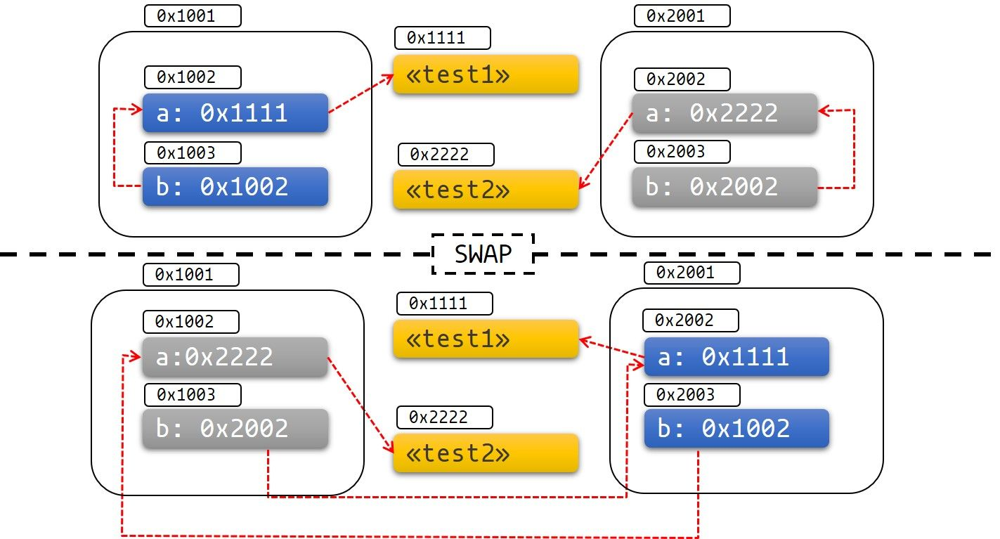

## Rust 异步编程

在艰难的学完 Rust 入门和进阶所有的 70 个章节后，我们终于来到了这里。假如之前攀登的是珠穆朗玛峰，那么现在攀登的就是乔戈里峰（比珠峰还难攀爬... ）。

如果你想开发 Web 服务器、数据库驱动、消息服务等需要高并发的服务，那么本章的内容将值得认真对待和学习，将从以下方面深入讲解 Rust 的异步编程：

- Rust 异步编程的通用概念介绍
- `Future` 以及异步任务调度
- `async/await` 和 `Pin/Unpin`
- 异步编程常用的三方库
- `tokio` 库
- 一些示例

参考：[Asynchronous Programming In Rust](https://rust-lang.github.io/async-book/01_getting_started/01_chapter.html)


### 简介

众所周知，Rust 可以让我们写出性能高且安全的软件，那么异步编程这块儿呢？是否依然在高性能的同时保证了安全？

我们先通过一张 web 框架性能对比图来感受下 Rust 异步编程的性能：


上图并不能说 Rust 写的 `actix` 框架比 Go 的 `gin` 更好、更优秀，但是确实可以一定程度上说明 Rust 的异步性能非常的高！

简单来说，异步编程是一个[并发编程模型](https://course.rs/advance/concurrency-with-threads/concurrency-parallelism.html)，目前主流语言基本都支持了，当然，支持的方式有所不同。异步编程允许我们同时并发运行大量的任务，却仅仅需要几个甚至一个 OS 线程或 CPU 核心，现代化的异步编程在使用体验上跟同步编程也几无区别，例如 Go 语言的 `go` 关键字，也包括我们后面将介绍的 `async/await` 语法，该语法是 `JavaScript` 和 `Rust` 的核心特性之一。


#### async

`async` 是 Rust 选择的异步编程模型，下面我们来介绍下它的优缺点，以及何时适合使用。

##### async vs 其他并发模型

由于并发编程在现代社会非常重要，因此每个主流语言都对自己的并发模型进行过权衡取舍和精心设计，Rust 语言也不例外。下面的列表可以帮助大家理解不同并发模型的取舍：

- **OS 线程**, 它最简单，也无需改变任何编程模型（业务/代码逻辑），因此非常适合作为语言的原生并发模型，我们在[多线程章节](https://course.rs/advance/concurrency-with-threads/concurrency-parallelism.html)也提到过，Rust 就选择了原生支持线程级的并发编程。但是，这种模型也有缺点，例如线程间的同步将变得更加困难，线程间的上下文切换损耗较大。使用线程池在一定程度上可以提升性能，但是对于 IO 密集的场景来说，线程池还是不够。
- **事件驱动（Event driven）**, 这个名词你可能比较陌生，如果说事件驱动常常跟回调（Callback）一起使用，相信大家就恍然大悟了。这种模型性能相当的好，但最大的问题就是存在回调地狱的风险：非线性的控制流和结果处理导致了数据流向和错误传播变得难以掌控，还会导致代码可维护性和可读性的大幅降低，大名鼎鼎的 `JavaScript` 曾经就存在回调地狱。
- **协程（Coroutines）** 可能是目前最火的并发模型，`Go` 语言的协程设计就非常优秀，这也是 `Go` 语言能够迅速火遍全球的杀手锏之一。协程跟线程类似，无需改变编程模型，同时，它也跟 `async` 类似，可以支持大量的任务并发运行。但协程抽象层次过高，导致用户无法接触到底层的细节，这对于系统编程语言和自定义异步运行时是难以接受的。
- **actor 模型**是 erlang 的杀手锏之一，它将所有并发计算分割成一个一个单元，这些单元被称为 `actor` , 单元之间通过消息传递的方式进行通信和数据传递，跟分布式系统的设计理念非常相像。由于 `actor` 模型跟现实很贴近，因此它相对来说更容易实现，但是一旦遇到流控制、失败重试等场景时，就会变得不太好用。
- **async/await**， 该模型性能高，还能支持底层编程，同时又像线程和协程那样无需过多的改变编程模型，但有得必有失，`async` 模型的问题就是内部实现机制过于复杂，对于用户来说，理解和使用起来也没有线程和协程简单，好在前者的复杂性开发者们已经帮我们封装好，而理解和使用起来不够简单，正是本章试图解决的问题。

总之，Rust 经过权衡取舍后，最终选择了同时提供多线程编程和 `async` 编程：

- 前者通过标准库实现，当你无需那么高的并发时，例如需要并行计算时，可以选择它，优点是线程内的代码执行效率更高、实现更直观更简单，这块内容已经在多线程章节进行过深入讲解，不再赘述。
- 后者通过语言特性 + 标准库 + 三方库的方式实现，在你需要高并发、异步 `I/O` 时，选择它就对了。

##### async: Rust vs 其它语言

目前已经有诸多语言都通过 `async` 的方式提供了异步编程，例如 `JavaScript` ，但 `Rust` 在实现上有所区别：

- **Future 在 Rust 中是惰性的**，只有在被轮询（`poll`）时才会运行， 因此丢弃一个 `future` 会阻止它未来再被运行, 你可以将`Future`理解为一个在未来某个时间点被调度执行的任务。
- **Async 在 Rust 中使用开销是零**， 意味着只有你能看到的代码（自己的代码）才有性能损耗，你看不到的（`async` 内部实现）都没有性能损耗，例如，你可以无需分配任何堆内存、也无需任何动态分发来使用 `async` ，这对于热点路径的性能有非常大的好处，正是得益于此，Rust 的异步编程性能才会这么高。
- **Rust 没有内置异步调用所必须的运行时**，但是无需担心，Rust 社区生态中已经提供了非常优异的运行时实现，例如大明星 [tokio](https://tokio.rs/)。
- **运行时同时支持单线程和多线程**，这两者拥有各自的优缺点，稍后会讲。

##### Rust: async vs 多线程

虽然 `async` 和多线程都可以实现并发编程，后者甚至还能通过线程池来增强并发能力，但是这两个方式并不互通，从一个方式切换成另一个需要大量的代码重构工作，因此提前为自己的项目选择适合的并发模型就变得至关重要。

`OS` 线程非常适合少量任务并发，因为线程的创建和上下文切换是非常昂贵的，甚至于空闲的线程都会消耗系统资源。虽说线程池可以有效的降低性能损耗，但是也无法彻底解决问题。当然，线程模型也有其优点，例如它不会破坏你的代码逻辑和编程模型，你之前的顺序代码，经过少量修改适配后依然可以在新线程中直接运行，同时在某些操作系统中，你还可以改变线程的优先级，这对于实现驱动程序或延迟敏感的应用（例如硬实时系统）很有帮助。

对于长时间运行的 CPU 密集型任务，例如并行计算，使用线程将更有优势。 这种密集任务往往会让所在的线程持续运行，任何不必要的线程切换都会带来性能损耗，因此高并发反而在此时成为了一种多余。同时你所创建的线程数应该等于 CPU 核心数，充分利用 CPU 的并行能力，甚至还可以将线程绑定到 CPU 核心上，进一步减少线程上下文切换。

而高并发更适合 `IO` 密集型任务，例如 web 服务器、数据库连接等等网络服务，因为这些任务绝大部分时间都处于等待状态，如果使用多线程，那线程大量时间会处于无所事事的状态，再加上线程上下文切换的高昂代价，让多线程做 `IO` 密集任务变成了一件非常奢侈的事。而使用`async`，既可以有效的降低 `CPU` 和内存的负担，又可以让大量的任务并发的运行，一个任务一旦处于`IO`或者其他等待（阻塞）状态，就会被立刻切走并执行另一个任务，而这里的任务切换的性能开销要远远低于使用多线程时的线程上下文切换。

事实上, `async` 底层也是基于线程实现，但是它基于线程封装了一个运行时，可以将多个任务映射到少量线程上，然后将线程切换变成了任务切换，后者仅仅是内存中的访问，因此要高效的多。

不过`async`也有其缺点，原因是编译器会为`async`函数生成状态机，然后将整个运行时打包进来，这会造成我们编译出的二进制可执行文件体积显著增大。

总之，`async`编程并没有比多线程更好，最终还是根据你的使用场景作出合适的选择，如果无需高并发，或者也不在意线程切换带来的性能损耗，那么多线程使用起来会简单、方便的多！最后再简单总结下：

> 若大家使用 `tokio`，那 CPU 密集的任务尤其需要用线程的方式去处理，例如使用 `spawn_blocking` 创建一个阻塞的线程去完成相应 CPU 密集任务。
>
> 至于具体的原因，不仅是上文说到的那些，还有一个是：`tokio` 是协作式地调度器，如果某个 CPU 密集的异步任务是通过 `tokio` 创建的，那理论上来说，该异步任务需要跟其它的异步任务交错执行，最终大家都得到了执行，皆大欢喜。但实际情况是，CPU 密集的任务很可能会一直霸着着 CPU，此时 `tokio` 的调度方式决定了该任务会一直被执行，这意味着，其它的异步任务无法得到执行的机会，最终这些任务都会因为得不到资源而饿死。
>
> 而使用 `spawn_blocking` 后，会创建一个单独的 OS 线程，该线程并不会被 `tokio` 所调度（被 OS 所调度），因此它所执行的 CPU 密集任务也不会导致 tokio 调度的那些异步任务被饿死。

- 有大量 `IO` 任务需要并发运行时，选 `async` 模型；
- 有部分 `IO` 任务需要并发运行时，选多线程，如果想要降低线程创建和销毁的开销，可以使用线程池；
- 有大量 `CPU` 密集任务需要并行运行时，例如并行计算，选多线程模型，且让线程数等于或者稍大于 `CPU` 核心数；
- 无所谓时，统一选多线程；

##### async 和多线程的性能对比

| 操作     | async    | 线程     |
| -------- | -------- | -------- |
| 创建     | 0.3 微秒 | 17 微秒  |
| 线程切换 | 0.2 微秒 | 1.7 微秒 |

可以看出，`async` 在线程切换的开销显著低于多线程，对于 `IO` 密集的场景，这种性能开销累计下来会非常可怕！

##### 一个例子

在大概理解`async`后，我们再来看一个简单的例子。如果想**并发的下载文件**，你可以**使用多线程**如下实现：

```rust
fn get_two_sites() {
    // 创建两个新线程执行任务
    let thread_one = thread::spawn(|| download("https://course.rs"));
    let thread_two = thread::spawn(|| download("https://fancy.rs"));

    // 等待两个线程的完成
    thread_one.join().expect("thread one panicked");
    thread_two.join().expect("thread two panicked");
}
```

如果是在一个小项目中简单的去下载文件，这么写没有任何问题，但是一旦下载文件的并发请求多起来，那一个下载任务占用一个线程的模式就太重了，会很容易成为程序的瓶颈。好在，我们可以使用`async`的方式来解决：

```rust
async fn get_two_sites_async() {
    // 创建两个不同的`future`，你可以把`future`理解为未来某个时刻会被执行的计划任务
    // 当两个`future`被同时执行后，它们将并发的去下载目标页面
    let future_one = download_async("https://www.foo.com");
    let future_two = download_async("https://www.bar.com");

    // 同时运行两个`future`，直至完成
    join!(future_one, future_two);
}
```

此时，不再有线程创建和切换的昂贵开销，所有的函数都是通过静态的方式进行分发，同时也没有任何内存分配发生。这段代码的性能简直无懈可击！

事实上，`async` 和多线程并不是二选一，在同一应用中，可以根据情况两者一起使用，当然，我们还可以使用其它的并发模型，例如上面提到事件驱动模型，前提是有三方库提供了相应的实现。


#### Async Rust 当前的进展

简而言之，Rust 语言的 `async` 目前还没有达到多线程的成熟度，其中一部分内容还在不断进化中，当然，这并不影响我们在生产级项目中使用，因为社区中还有 `tokio` 这种大杀器。

使用 `async` 时，你会遇到好的，也会遇到不好的，例如：

- 收获卓越的性能；
- 会经常跟进阶语言特性打交道，例如生命周期等，这些家伙可不好对付；
- 一些兼容性问题，例如同步和异步代码、不同的异步运行时（`tokio` 与 `async-std` ）；
- 更昂贵的维护成本，原因是 `async` 和社区开发的运行时依然在不停的进化；

总之，`async` 在 Rust 中并不是一个善茬，你会遇到更多的困难或者说坑，也会带来更高的代码阅读成本及维护成本，但是为了性能，一切都值了，不是吗？

不过好在，这些进化早晚会彻底稳定成熟，而且在实际项目中，我们往往会使用成熟的三方库，例如`tokio`，因此可以避免一些类似的问题，但是对于本章的学习来说，`async` 的一些难点还是我们必须要去面对和征服的。

##### 语言和库的支持

`async` 的底层实现非常复杂，且会导致编译后文件体积显著增加，因此 Rust 没有选择像 Go 语言那样内置了完整的特性和运行时，而是选择了通过 Rust 语言提供了必要的特性支持，再通过社区来提供 `async` 运行时的支持。 因此要完整的使用 `async` 异步编程，你需要依赖以下特性和外部库：

- 所必须的特征（例如 `Future` ）、类型和函数，由标准库提供实现
- 关键字 `async/await` 由 Rust 语言提供，并进行了编译器层面的支持
- 众多实用的类型、宏和函数由官方开发的 [futures](https://github.com/rust-lang/futures-rs) 包提供（不是标准库），它们可以用于任何 `async` 应用中。
- `async` 代码的执行、`IO` 操作、任务创建和调度等等复杂功能由社区的 `async` 运行时提供，例如 [tokio](https://github.com/tokio-rs/tokio) 和 [async-std](https://github.com/async-rs/async-std)

还有，你在同步（ `synchronous` ）代码中使用的一些语言特性在 `async` 中可能将无法再使用，而且 Rust 也不允许你在特征中声明 `async` 函数（可以通过三方库实现）， 总之，你会遇到一些在同步代码中不会遇到的奇奇怪怪、形形色色的问题，不过不用担心，本章会专门用一个章节罗列这些问题，并给出相应的解决方案。

##### 编译和错误

在大多数情况下，`async` 中的编译错误和运行时错误跟之前没啥区别，但是依然有以下几点值得注意：

- 编译错误，由于 `async` 编程时需要经常使用复杂的语言特性，例如生命周期和`Pin`，因此相关的错误可能会出现的更加频繁；
- 运行时错误，编译器会为每一个`async`函数生成状态机，这会导致在栈跟踪时会包含这些状态机的细节，同时还包含了运行时对函数的调用，因此，栈跟踪记录（例如 `panic` 时）将变得更加难以解读；
- 一些隐蔽的错误也可能发生，例如在一个 `async` 上下文中去调用一个阻塞的函数，或者没有正确的实现 `Future` 特征都有可能导致这种错误。这种错误可能会悄无声息的通过编译检查甚至有时候会通过单元测试。好在一旦你深入学习并掌握了本章的内容和 `async` 原理，可以有效的降低遇到这些错误的概率；

##### 性能特性

`async` 代码的性能主要取决于你使用的 `async` 运行时，好在这些运行时都经过了精心的设计，在你能遇到的绝大多数场景中，它们都能拥有非常棒的性能表现。

但是世事皆有例外。目前主流的 `async` 运行时几乎都使用了多线程实现，相比单线程虽然增加了并发表现，但是对于执行性能会有所损失，因为多线程实现会有同步和切换上的性能开销，若你需要极致的顺序执行性能，那么 `async` 目前并不是一个好的选择。

同样的，对于延迟敏感的任务来说，任务的执行次序需要能被严格掌控，而不是交由运行时去自动调度，后者会导致不可预知的延迟，例如一个 web 服务器总是有 `1%` 的请求，它们的延迟会远高于其它请求，因为调度过于繁忙导致了部分任务被延迟调度，最终导致了较高的延时。正因为此，这些延迟敏感的任务非常依赖于运行时或操作系统提供调度次序上的支持。

以上的两个需求，目前的 `async` 运行时并不能很好的支持，在未来可能会有更好的支持，但在此之前，我们可以尝试用多线程解决。


#### async/.await 简单入门

`async/.await` 是 Rust 内置的语言特性，可以让我们用同步的方式去编写异步的代码。

通过 `async` 标记的语法块会被转换成实现了`Future`特征的状态机。 与同步调用阻塞当前线程不同，当`Future`执行并遇到阻塞时，它会让出当前线程的控制权，这样其它的`Future`就可以在该线程中运行，这种方式完全不会导致当前线程的阻塞。

下面我们来通过例子学习 `async/.await` 关键字该如何使用，在开始之前，需要先引入 `futures` 包。编辑 `Cargo.toml` 文件并添加以下内容：

```rust
[dependencies]
futures = "0.3.25"
```

##### 使用 async

首先，使用 `async fn` 语法来创建一个异步函数：

```rust
async fn do_something() {
    println!("go go go !");
}
```

需要注意，**异步函数的返回值是一个 `Future`**，若直接调用该函数，不会输出任何结果，因为 `Future` 还未被执行：

```rust
fn main() {
      do_something();
}
```

运行后，`go go go`并没有打印，同时编译器给予一个提示：`warning: unused implementer of Future that must be used`，告诉我们 `Future` 未被使用，那么到底该如何使用？答案是使用一个执行器（`executor` ）：

```rust
// `block_on`会阻塞当前线程直到指定的`Future`执行完成，这种阻塞当前线程以等待任务完成的方式较为简单、粗暴，
// 好在其它运行时的执行器(executor)会提供更加复杂的行为，例如将多个`future`调度到同一个线程上执行。
use futures::executor::block_on;

async fn hello_world() {
    println!("hello, world!");
}

fn main() {
    let future = hello_world(); // 返回一个Future, 因此不会打印任何输出
    block_on(future); // 执行`Future`并等待其运行完成，此时"hello, world!"会被打印输出
}
```

##### 使用.await

在上述代码的`main`函数中，我们使用`block_on`这个执行器等待`Future`的完成，让代码看上去非常像是同步代码，但是如果你要在一个`async fn`函数中去调用另一个`async fn`并等待其完成后再执行后续的代码，该如何做？例如:

```rust
use futures::executor::block_on;

async fn hello_world() {
    hello_cat();
    println!("hello, world!");
}

async fn hello_cat() {
    println!("hello, kitty!");
}
fn main() {
    let future = hello_world();
    block_on(future);
}
```

这里，我们在`hello_world`异步函数中先调用了另一个异步函数`hello_cat`，然后再输出`hello, world!`，看看运行结果：

```shell
warning: unused implementer of `futures::Future` that must be used
 --> src/main.rs:6:5
  |
6 |     hello_cat();
  |     ^^^^^^^^^^^^
= note: futures do nothing unless you `.await` or poll them
...
hello, world!
```

不出所料，`main`函数中的`future`我们通过`block_on`函数进行了运行，但是这里的`hello_cat`返回的`Future`却没有任何人去执行它，不过好在编译器友善的给出了提示：`futures do nothing unless you .await or poll them`，两种解决方法：

1. 使用`.await`语法；
2. 对`Future`进行轮询（`poll`）；

后者较为复杂，暂且不表，先来使用`.await`试试：

```rust
use futures::executor::block_on;

async fn hello_world() {
    hello_cat().await;
    println!("hello, world!");
}

async fn hello_cat() {
    println!("hello, kitty!");
}
fn main() {
    let future = hello_world();
    block_on(future);
}
```

为`hello_cat()`添加上`.await`后，结果立刻大为不同:

```console
hello, kitty!
hello, world!
```

输出的顺序跟代码定义的顺序完全符合，因此，我们在上面代码中**使用同步的代码顺序实现了异步的执行效果**，非常简单、高效，而且很好理解，未来也绝对不会有回调地狱的发生。

总之，在`async fn`函数中使用`.await`可以等待另一个异步调用的完成。**但是与`block_on`不同，`.await`并不会阻塞当前的线程**，而是异步的等待`Future A`的完成，在等待的过程中，该线程还可以继续执行其它的`Future B`，最终实现了并发处理的效果。

##### 一个例子

考虑一个载歌载舞的例子，如果不用`.await`，我们可能会有如下实现：

```rust
use futures::executor::block_on;

struct Song {
    author: String,
    name: String,
}

async fn learn_song() -> Song {
    Song {
        author: "周杰伦".to_string(),
        name: String::from("《菊花台》"),
    }
}

async fn sing_song(song: Song) {
    println!(
        "给大家献上一首{}的{} ~ {}",
        song.author, song.name, "菊花残，满地伤~ ~"
    );
}

async fn dance() {
    println!("唱到情深处，身体不由自主的动了起来~ ~");
}

fn main() {
    let song = block_on(learn_song());
    block_on(sing_song(song));
    block_on(dance());
}
```

当然，以上代码运行结果无疑是正确的，但。。。它的性能何在？需要通过连续三次阻塞去等待三个任务的完成，一次只能做一件事，实际上我们完全可以载歌载舞啊：

```rust
use futures::executor::block_on;

struct Song {
    author: String,
    name: String,
}

async fn learn_song() -> Song {
    Song {
        author: "曲婉婷".to_string(),
        name: String::from("《我的歌声里》"),
    }
}

async fn sing_song(song: Song) {
    println!(
        "给大家献上一首{}的{} ~ {}",
        song.author, song.name, "你存在我深深的脑海里~ ~"
    );
}

async fn dance() {
    println!("唱到情深处，身体不由自主的动了起来~ ~");
}

async fn learn_and_sing() {
    // 这里使用`.await`来等待学歌的完成，但是并不会阻塞当前线程，该线程在学歌的任务`.await`后，完全可以去执行跳舞的任务
    let song = learn_song().await;

    // 唱歌必须要在学歌之后
    sing_song(song).await;
}

async fn async_main() {
    let f1 = learn_and_sing();
    let f2 = dance();

    // `join!`可以并发的处理和等待多个`Future`，若`learn_and_sing Future`被阻塞，那`dance Future`可以拿过线程的所有权继续执行。若`dance`也变成阻塞状态，那`learn_and_sing`又可以再次拿回线程所有权，继续执行。
    // 若两个都被阻塞，那么`async main`会变成阻塞状态，然后让出线程所有权，并将其交给`main`函数中的`block_on`执行器
    futures::join!(f1, f2);
}

fn main() {
    block_on(async_main());
}
```

上面代码中，学歌和唱歌具有明显的先后顺序，但是这两者都可以跟跳舞一同存在，也就是你可以在跳舞的时候学歌，也可以在跳舞的时候唱歌。如果上面代码不使用`.await`，而是使用`block_on(learn_song())`， 那在学歌时，当前线程就会阻塞，不再可以做其它任何事，包括跳舞。

因此`.await`对于实现异步编程至关重要，它允许我们在同一个线程内并发的运行多个任务，而不是一个一个先后完成。若大家看到这里还是不太明白，强烈建议回头再仔细看一遍，同时亲自上手修改代码试试效果。

至此，读者应该对 Rust 的`async/.await`异步编程有了一个清晰的初步印象，下面让我们一起来看看这背后的原理：`Future`和任务在底层如何被执行。


### Future 执行器与任务调度

异步编程背后到底藏有什么秘密？究竟是哪只幕后之手在操纵这一切？如果你对这些感兴趣，就继续看下去，否则可以直接跳过，因为本章节的内容对于一个 API 工程师并没有太多帮助。

但是如果你希望能深入理解 `Rust` 的 `async/.await` 代码是如何工作、理解运行时和性能，甚至未来想要构建自己的 `async` 运行时或相关工具，那么本章节终究不会辜负于你。


#### Future 特征

`Future` 特征是 Rust 异步编程的核心，毕竟异步函数是异步编程的核心，而 `Future` 恰恰是异步函数的返回值和被执行的关键。

首先，来给出 `Future` 的定义：它是一个能产出值的异步计算（虽然该值可能为空，例如 `()` ）。光看这个定义，可能会觉得很空洞，我们来看看一个简化版的 `Future` 特征：

```rust
trait SimpleFuture {
    type Output;
    fn poll(&mut self, wake: fn()) -> Poll<Self::Output>;
}

enum Poll<T> {
    Ready(T),
    Pending,
}
```

在上一章中，我们提到过 `Future` 需要被执行器`poll`（轮询）后才能运行，诺，这里 `poll` 就来了，通过调用该方法，可以推进 `Future` 的进一步执行，直到被切走为止(（这里不好理解，但是你只需要知道 `Future` 并不能保证在一次 `poll` 中就被执行完，后面会详解介绍）。

若在当前 `poll` 中， `Future` 可以被完成，则会返回 `Poll::Ready(result)` ，反之则返回 `Poll::Pending`， 并且安排一个 `wake` 函数：当未来 `Future` 准备好进一步执行时， 该函数会被调用，然后管理该 `Future` 的执行器(例如上一章节中的`block_on`函数)会再次调用 `poll` 方法，此时 `Future` 就可以继续执行了。

如果没有 `wake `方法，那执行器无法知道某个`Future`是否可以继续被执行，除非执行器定期的轮询每一个 `Future` ，确认它是否能被执行，但这种作法效率较低。而有了 `wake`，`Future` 就可以主动通知执行器，然后执行器就可以精确的执行该 `Future`。 这种“事件通知 → 执行”的方式要远比定期对所有 `Future` 进行一次全遍历来的高效。

也许大家还是迷迷糊糊的，没事，我们用一个例子来说明下。考虑一个需要从 `socket` 读取数据的场景：如果有数据，可以直接读取数据并返回 `Poll::Ready(data)`， 但如果没有数据，`Future` 会被阻塞且不会再继续执行，此时它会注册一个 `wake` 函数，当 `socket` 数据准备好时，该函数将被调用以通知执行器：我们的 `Future` 已经准备好了，可以继续执行。

下面的 `SocketRead` 结构体就是一个 `Future`：

```rust
pub struct SocketRead<'a> {
    socket: &'a Socket,
}

impl SimpleFuture for SocketRead<'_> {
    type Output = Vec<u8>;

    fn poll(&mut self, wake: fn()) -> Poll<Self::Output> {
        if self.socket.has_data_to_read() {
            // socket有数据，写入buffer中并返回
            Poll::Ready(self.socket.read_buf())
        } else {
            // socket中还没数据
            //
            // 注册一个`wake`函数，当数据可用时，该函数会被调用，
            // 然后当前Future的执行器会再次调用`poll`方法，此时就可以读取到数据
            self.socket.set_readable_callback(wake);
            Poll::Pending
        }
    }
}
```

这种 `Future` 模型允许将多个异步操作组合在一起，同时还无需任何内存分配。不仅仅如此，如果你需要同时运行多个 `Future`或链式调用多个 `Future` ，也可以通过无内存分配的状态机实现，例如：

```rust
trait SimpleFuture {
    type Output;
    fn poll(&mut self, wake: fn()) -> Poll<Self::Output>;
}

enum Poll<T> {
    Ready(T),
    Pending,
}

/// 一个SimpleFuture，它会并发地运行两个Future直到它们完成
///
/// 之所以可以并发，是因为两个Future的轮询可以交替进行，一个阻塞，另一个就可以立刻执行，反之亦然
pub struct Join<FutureA, FutureB> {
    // 结构体的每个字段都包含一个Future，可以运行直到完成.
    // 如果Future完成后，字段会被设置为 `None`. 这样Future完成后，就不会再被轮询
    a: Option<FutureA>,
    b: Option<FutureB>,
}

impl<FutureA, FutureB> SimpleFuture for Join<FutureA, FutureB>
where
    FutureA: SimpleFuture<Output = ()>,
    FutureB: SimpleFuture<Output = ()>,
{
    type Output = ();
    fn poll(&mut self, wake: fn()) -> Poll<Self::Output> {
        // 尝试去完成一个 Future `a`
        if let Some(a) = &mut self.a {
            if let Poll::Ready(()) = a.poll(wake) {
                self.a.take();
            }
        }

        // 尝试去完成一个 Future `b`
        if let Some(b) = &mut self.b {
            if let Poll::Ready(()) = b.poll(wake) {
                self.b.take();
            }
        }

        if self.a.is_none() && self.b.is_none() {
            // 两个 Future都已完成 - 我们可以成功地返回了
            Poll::Ready(())
        } else {
            // 至少还有一个 Future 没有完成任务，因此返回 `Poll::Pending`.
            // 当该 Future 再次准备好时，通过调用`wake()`函数来继续执行
            Poll::Pending
        }
    }
}
```

上面代码展示了如何同时运行多个 `Future`， 且在此过程中没有任何内存分配，让并发编程更加高效。 类似的，多个`Future`也可以一个接一个的连续运行：

```rust
/// 一个SimpleFuture, 它使用顺序的方式，一个接一个地运行两个Future
//
// 注意: 由于本例子用于演示，因此功能简单，`AndThenFut` 会假设两个 Future 在创建时就可用了.
// 而真实的`Andthen`允许根据第一个`Future`的输出来创建第二个`Future`，因此复杂的多。
pub struct AndThenFut<FutureA, FutureB> {
    first: Option<FutureA>,
    second: FutureB,
}

impl<FutureA, FutureB> SimpleFuture for AndThenFut<FutureA, FutureB>
where
    FutureA: SimpleFuture<Output = ()>,
    FutureB: SimpleFuture<Output = ()>,
{
    type Output = ();
    fn poll(&mut self, wake: fn()) -> Poll<Self::Output> {
        if let Some(first) = &mut self.first {
            match first.poll(wake) {
                // 我们已经完成了第一个 Future， 可以将它移除， 然后准备开始运行第二个
                Poll::Ready(()) => self.first.take(),
                // 第一个 Future 还不能完成
                Poll::Pending => return Poll::Pending,
            };
        }

        // 运行到这里，说明第一个Future已经完成，尝试去完成第二个
        self.second.poll(wake)
    }
}
```

这些例子展示了在不需要内存对象分配以及深层嵌套回调的情况下，该如何使用 `Future` 特征去表达异步控制流。 在了解了基础的控制流后，我们再来看看真实的 `Future` 特征有何不同之处。

```rust
trait Future {
    type Output;
    fn poll(
        // 首先值得注意的地方是，`self`的类型从`&mut self`变成了`Pin<&mut Self>`:
        self: Pin<&mut Self>,
        // 其次将`wake: fn()` 修改为 `cx: &mut Context<'_>`:
        cx: &mut Context<'_>,
    ) -> Poll<Self::Output>;
}
```

首先这里多了一个 `Pin` ，关于它我们会在后面章节详细介绍，现在你只需要知道使用它可以创建一个无法被移动的 `Future` ，因为无法被移动，因此它将具有固定的内存地址，意味着我们可以存储它的指针(如果内存地址可能会变动，那存储指针地址将毫无意义！)，也意味着可以实现一个自引用数据结构: `struct MyFut { a: i32, ptr_to_a: *const i32 }`。 而对于 `async/await` 来说，`Pin` 是不可或缺的关键特性。

其次，从 `wake: fn()` 变成了 `&mut Context<'_>` 。意味着 `wake` 函数可以携带数据了，为何要携带数据？考虑一个真实世界的场景，一个复杂应用例如 web 服务器可能有数千连接同时在线，那么同时就有数千 `Future` 在被同时管理着，如果不能携带数据，当一个 `Future` 调用 `wake` 后，执行器该如何知道是哪个 `Future` 调用了 `wake` ,然后进一步去 `poll` 对应的 `Future` ？没有办法！那之前的例子为啥就可以使用没有携带数据的 `wake` ？ 因为足够简单，不存在歧义性。

总之，在正式场景要进行 `wake` ，就必须携带上数据。 而 `Context` 类型通过提供一个 `Waker` 类型的值，就可以用来唤醒特定的的任务。


#### 使用 Waker 唤醒

对于 `Future` 来说，第一次被 `poll` 时无法完成任务是很正常的。但它需要确保在未来一旦准备好时，可以通知执行器再次对其进行 `poll` 进而继续往下执行，该通知就是通过 `Waker` 类型完成的。

`Waker` 提供了一个 `wake()` 方法可以用于告诉执行器：相关的任务可以被唤醒了，此时执行器就可以对相应的 `Future` 再次进行 `poll` 操作。

##### 构建一个定时器

下面一起来实现一个简单的定时器 `Future` 。为了让例子尽量简单，当计时器创建时，我们会启动一个线程接着让该线程进入睡眠，等睡眠结束后再通知给 `Future` 。

注意本例子还会在后面继续使用，因此我们重新创建一个工程来演示：使用 `cargo new --lib timer_future` 来创建一个新工程，在 `lib` 包的根路径 `src/lib.rs` 中添加以下内容：

```rust
use std::{
    future::Future,
    pin::Pin,
    sync::{Arc, Mutex},
    task::{Context, Poll, Waker},
    thread,
    time::Duration,
};
```

继续来实现 `Future` 定时器，之前提到：新建线程在睡眠结束后会需要将状态同步给定时器 `Future` ，由于是多线程环境，我们需要使用 `Arc<Mutex<T>>` 来作为一个共享状态，用于在新线程和 `Future` 定时器间共享。

下面给出 `Future` 的具体实现:

```rust
impl Future for TimerFuture {
    type Output = ();
    fn poll(self: Pin<&mut Self>, cx: &mut Context<'_>) -> Poll<Self::Output> {
        // 通过检查共享状态，来确定定时器是否已经完成
        let mut shared_state = self.shared_state.lock().unwrap();
        if shared_state.completed {
            Poll::Ready(())
        } else {
            // 设置`waker`，这样新线程在睡眠(计时)结束后可以唤醒当前的任务，接着再次对`Future`进行`poll`操作,
            //
            // 下面的`clone`每次被`poll`时都会发生一次，实际上，应该是只`clone`一次更加合理。
            // 选择每次都`clone`的原因是： `TimerFuture`可以在执行器的不同任务间移动，如果只克隆一次，
            // 那么获取到的`waker`可能已经被篡改并指向了其它任务，最终导致执行器运行了错误的任务
            shared_state.waker = Some(cx.waker().clone());
            Poll::Pending
        }
    }
}
```

代码很简单，只要新线程设置了 `shared_state.completed = true` ，那任务就能顺利结束。如果没有设置，会为当前的任务克隆一份 `Waker` ，这样新线程就可以使用它来唤醒当前的任务。

最后，再来创建一个 API 用于构建定时器和启动计时线程:

```rust
impl TimerFuture {
    /// 创建一个新的`TimerFuture`，在指定的时间结束后，该`Future`可以完成
    pub fn new(duration: Duration) -> Self {
        let shared_state = Arc::new(Mutex::new(SharedState {
            completed: false,
            waker: None,
        }));

        // 创建新线程
        let thread_shared_state = shared_state.clone();
        thread::spawn(move || {
            // 睡眠指定时间实现计时功能
            thread::sleep(duration);
            let mut shared_state = thread_shared_state.lock().unwrap();
            // 通知执行器定时器已经完成，可以继续`poll`对应的`Future`了
            shared_state.completed = true;
            if let Some(waker) = shared_state.waker.take() {
                waker.wake()
            }
        });

        TimerFuture { shared_state }
    }
}
```

至此，一个简单的定时器 `Future` 就已创建成功，那么该如何使用它呢？相信部分爱动脑筋的读者已经猜到了：我们需要创建一个执行器，才能让程序动起来。


#### 执行器 Executor

Rust 的 `Future` 是惰性的：只有屁股上拍一拍，它才会努力动一动。其中一个推动它的方式就是在 `async` 函数中使用 `.await` 来调用另一个 `async` 函数，但是这个只能解决 `async` 内部的问题，那么这些最外层的 `async` 函数，谁来推动它们运行呢？答案就是我们之前多次提到的执行器 `executor` 。

执行器会管理一批 `Future` （最外层的 `async` 函数），然后通过不停地 `poll` 推动它们直到完成。 最开始，执行器会先 `poll` 一次 `Future` ，后面就不会主动去 `poll` 了，而是等待 `Future` 通过调用 `wake` 函数来通知它可以继续，它才会继续去 `poll` 。这种**wake 通知然后 poll**的方式会不断重复，直到 `Future` 完成。

##### 构建执行器

下面我们将实现一个简单的执行器，它可以同时并发运行多个 `Future` 。例子中，需要用到 `futures` 包的 `ArcWake` 特征，它可以提供一个方便的途径去构建一个 `Waker` 。编辑 `Cargo.toml` ，添加下面依赖：

```rust
[dependencies]
futures = "0.3.25"
```

在之前的内容中，我们在 `src/lib.rs` 中创建了定时器 `Future` ，现在在 `src/main.rs` 中来创建程序的主体内容，开始之前，先引入所需的包：

```rust
use {
    futures::{
        future::{BoxFuture, FutureExt},
        task::{waker_ref, ArcWake},
    },
    std::{
        future::Future,
        sync::mpsc::{sync_channel, Receiver, SyncSender},
        sync::{Arc, Mutex},
        task::{Context, Poll},
        time::Duration,
    },
    // 引入之前实现的定时器模块
    timer_future::TimerFuture,
};
```

执行器需要从一个消息通道( `channel` )中拉取事件，然后运行它们。当一个任务准备好后（可以继续执行），它会将自己放入消息通道中，然后等待执行器 `poll` 。

```rust
/// 任务执行器，负责从通道中接收任务然后执行
struct Executor {
    ready_queue: Receiver<Arc<Task>>,
}

/// `Spawner`负责创建新的`Future`然后将它发送到任务通道中
#[derive(Clone)]
struct Spawner {
    task_sender: SyncSender<Arc<Task>>,
}

/// 一个Future，它可以调度自己(将自己放入任务通道中)，然后等待执行器去`poll`
struct Task {
    /// 进行中的Future，在未来的某个时间点会被完成
    ///
    /// 按理来说`Mutex`在这里是多余的，因为我们只有一个线程来执行任务。但是由于
    /// Rust并不聪明，它无法知道`Future`只会在一个线程内被修改，并不会被跨线程修改。因此
    /// 我们需要使用`Mutex`来满足这个笨笨的编译器对线程安全的执着。
    ///
    /// 如果是生产级的执行器实现，不会使用`Mutex`，因为会带来性能上的开销，取而代之的是使用`UnsafeCell`
    future: Mutex<Option<BoxFuture<'static, ()>>>,

    /// 可以将该任务自身放回到任务通道中，等待执行器的poll
    task_sender: SyncSender<Arc<Task>>,
}

fn new_executor_and_spawner() -> (Executor, Spawner) {
    // 任务通道允许的最大缓冲数(任务队列的最大长度)
    // 当前的实现仅仅是为了简单，在实际的执行中，并不会这么使用
    const MAX_QUEUED_TASKS: usize = 10_000;
    let (task_sender, ready_queue) = sync_channel(MAX_QUEUED_TASKS);
    (Executor { ready_queue }, Spawner { task_sender })
}
```

下面再来添加一个方法用于生成 `Future` , 然后将它放入任务通道中：

```rust
impl Spawner {
    fn spawn(&self, future: impl Future<Output = ()> + 'static + Send) {
        let future = future.boxed();
        let task = Arc::new(Task {
            future: Mutex::new(Some(future)),
            task_sender: self.task_sender.clone(),
        });
        self.task_sender.send(task).expect("任务队列已满");
    }
}
```

在执行器 `poll` 一个 `Future` 之前，首先需要调用 `wake` 方法进行唤醒，然后再由 `Waker` 负责调度该任务并将其放入任务通道中。创建 `Waker` 的最简单的方式就是实现 `ArcWake` 特征，先来为我们的任务实现 `ArcWake` 特征，这样它们就能被转变成 `Waker` 然后被唤醒：

```rust
impl ArcWake for Task {
    fn wake_by_ref(arc_self: &Arc<Self>) {
        // 通过发送任务到任务管道的方式来实现`wake`，这样`wake`后，任务就能被执行器`poll`
        let cloned = arc_self.clone();
        arc_self
            .task_sender
            .send(cloned)
            .expect("任务队列已满");
    }
}
```

当任务实现了 `ArcWake` 特征后，它就变成了 `Waker` ，在调用 `wake()` 对其唤醒后会将任务复制一份所有权( `Arc` )，然后将其发送到任务通道中。最后我们的执行器将从通道中获取任务，然后进行 `poll` 执行：

```rust
impl Executor {
    fn run(&self) {
        while let Ok(task) = self.ready_queue.recv() {
            // 获取一个future，若它还没有完成(仍然是Some，不是None)，则对它进行一次poll并尝试完成它
            let mut future_slot = task.future.lock().unwrap();
            if let Some(mut future) = future_slot.take() {
                // 基于任务自身创建一个 `LocalWaker`
                let waker = waker_ref(&task);
                let context = &mut Context::from_waker(&*waker);
                // `BoxFuture<T>`是`Pin<Box<dyn Future<Output = T> + Send + 'static>>`的类型别名
                // 通过调用`as_mut`方法，可以将上面的类型转换成`Pin<&mut dyn Future + Send + 'static>`
                if future.as_mut().poll(context).is_pending() {
                    // Future还没执行完，因此将它放回任务中，等待下次被poll
                    *future_slot = Some(future);
                }
            }
        }
    }
}
```

恭喜！我们终于拥有了自己的执行器，下面再来写一段代码使用该执行器去运行之前的定时器 `Future` ：

```rust
fn main() {
    let (executor, spawner) = new_executor_and_spawner();

    // 生成一个任务
    spawner.spawn(async {
        println!("howdy!");
        // 创建定时器Future，并等待它完成
        TimerFuture::new(Duration::new(2, 0)).await;
        println!("done!");
    });

    // drop掉任务，这样执行器就知道任务已经完成，不会再有新的任务进来
    drop(spawner);

    // 运行执行器直到任务队列为空
    // 任务运行后，会先打印`howdy!`, 暂停2秒，接着打印 `done!`
    executor.run();
}
```


#### 执行器和系统 IO

前面我们一起看过一个使用 `Future` 从 `Socket` 中异步读取数据的例子：

```rust
pub struct SocketRead<'a> {
    socket: &'a Socket,
}

impl SimpleFuture for SocketRead<'_> {
    type Output = Vec<u8>;

    fn poll(&mut self, wake: fn()) -> Poll<Self::Output> {
        if self.socket.has_data_to_read() {
            // socket有数据，写入buffer中并返回
            Poll::Ready(self.socket.read_buf())
        } else {
            // socket中还没数据
            //
            // 注册一个`wake`函数，当数据可用时，该函数会被调用，
            // 然后当前Future的执行器会再次调用`poll`方法，此时就可以读取到数据
            self.socket.set_readable_callback(wake);
            Poll::Pending
        }
    }
}
```

该例子中，`Future` 将从 `Socket` 读取数据，若当前还没有数据，则会让出当前线程的所有权，允许执行器去执行其它的 `Future` 。当数据准备好后，会调用 `wake()` 函数将该 `Future` 的任务放入任务通道中，等待执行器的 `poll` 。

关于该流程已经反复讲了很多次，相信大家应该非常清楚了。然而该例子中还有一个疑问没有解决：

- `set_readable_callback` 方法到底是怎么工作的？怎么才能知道 `socket` 中的数据已经可以被读取了？

关于第二点，其中一个简单粗暴的方法就是使用一个新线程不停的检查 `socket` 中是否有了数据，当有了后，就调用 `wake()` 函数。该方法确实可以满足需求，但是性能着实太低了，需要为每个阻塞的 `Future` 都创建一个单独的线程！

在现实世界中，该问题往往是通过操作系统提供的 `IO` 多路复用机制来完成，例如 `Linux` 中的 **`epoll`**，`FreeBSD` 和 `macOS` 中的 **`kqueue`** ，`Windows` 中的 **`IOCP`**, `Fuchisa`中的 **`ports`** 等(可以通过 Rust 的跨平台包 `mio` 来使用它们)。借助 IO 多路复用机制，可以实现一个线程同时阻塞地去等待多个异步 IO 事件，一旦某个事件完成就立即退出阻塞并返回数据。相关实现类似于以下代码：

```rust
struct IoBlocker {
    /* ... */
}

struct Event {
    // Event的唯一ID，该事件发生后，就会被监听起来
    id: usize,

    // 一组需要等待或者已发生的信号
    signals: Signals,
}

impl IoBlocker {
    /// 创建需要阻塞等待的异步IO事件的集合
    fn new() -> Self { /* ... */ }

    /// 对指定的IO事件表示兴趣
    fn add_io_event_interest(
        &self,

        /// 事件所绑定的socket
        io_object: &IoObject,

        event: Event,
    ) { /* ... */ }

    /// 进入阻塞，直到某个事件出现
    fn block(&self) -> Event { /* ... */ }
}

let mut io_blocker = IoBlocker::new();
io_blocker.add_io_event_interest(
    &socket_1,
    Event { id: 1, signals: READABLE },
);
io_blocker.add_io_event_interest(
    &socket_2,
    Event { id: 2, signals: READABLE | WRITABLE },
);
let event = io_blocker.block();

// 当socket的数据可以读取时，打印 "Socket 1 is now READABLE"
println!("Socket {:?} is now {:?}", event.id, event.signals);
```

这样，我们只需要一个执行器线程，它会接收 IO 事件并将其分发到对应的 `Waker` 中，接着后者会唤醒相关的任务，最终通过执行器 `poll` 后，任务可以顺利的继续执行, 这种 IO 读取流程可以不停的循环，直到 `socket` 关闭。


### 定海神针 Pin 和 Unpin

在 Rust 异步编程中，有一个定海神针般的存在，它就是 `Pin` ，作用说简单也简单，说复杂也非常复杂，当初刚出来时就连一些 Rust 大佬都一头雾水，何况瑟瑟发抖的我。好在今非昔比，目前网上的资料已经很全，而我就借花献佛，给大家好好讲讲这个`Pin`。

在 Rust 中，所有的类型可以分为两类：

1. **类型的值可以在内存中安全地被移动**，例如数值、字符串、布尔值、结构体、枚举，总之你能想到的几乎所有类型都可以落入到此范畴内；
2. **自引用类型**，大魔王来了，大家快跑，在之前章节我们已经见识过它的厉害；

下面就是一个自引用类型

```rust
struct SelfRef {
    value: String,
    pointer_to_value: *mut String,
}
```

在上面的结构体中，`pointer_to_value` 是一个裸指针，指向第一个字段 `value` 持有的字符串 `String` 。很简单对吧？现在考虑一个情况， 若`String` 被移动了怎么办？

此时一个致命的问题就出现了：新的字符串的内存地址变了，而 `pointer_to_value` 依然指向之前的地址，一个重大 bug 就出现了！

灾难发生，英雄在哪？只见 `Pin` 闪亮登场，它可以防止一个类型在内存中被移动。再来回忆下之前在 `Future` 章节中，我们提到过在 `poll` 方法的签名中有一个 `self: Pin<&mut Self>` ，那么为何要在这里使用 `Pin` 呢？


#### 为何需要 Pin

其实 `Pin` 还有一个小伙伴 `UnPin` ，与前者相反，后者表示类型可以在内存中安全地移动。在深入之前，我们先来回忆下 `async/.await` 是如何工作的:

```rust
let fut_one = /* ... */; // Future 1
let fut_two = /* ... */; // Future 2
async move {
    fut_one.await;
    fut_two.await;
}
```

在底层，`async` 会创建一个实现了 `Future` 的匿名类型，并提供了一个 `poll` 方法：

```rust
// `async { ... }`语句块创建的 `Future` 类型
struct AsyncFuture {
    fut_one: FutOne,
    fut_two: FutTwo,
    state: State,
}

// `async` 语句块可能处于的状态
enum State {
    AwaitingFutOne,
    AwaitingFutTwo,
    Done,
}

impl Future for AsyncFuture {
    type Output = ();

    fn poll(mut self: Pin<&mut Self>, cx: &mut Context<'_>) -> Poll<()> {
        loop {
            match self.state {
                State::AwaitingFutOne => match self.fut_one.poll(..) {
                    Poll::Ready(()) => self.state = State::AwaitingFutTwo,
                    Poll::Pending => return Poll::Pending,
                }
                State::AwaitingFutTwo => match self.fut_two.poll(..) {
                    Poll::Ready(()) => self.state = State::Done,
                    Poll::Pending => return Poll::Pending,
                }
                State::Done => return Poll::Ready(()),
            }
        }
    }
}
```

当 `poll` 第一次被调用时，它会去查询 `fut_one` 的状态，若 `fut_one` 无法完成，则 `poll` 方法会返回。未来对 `poll` 的调用将从上一次调用结束的地方开始。该过程会一直持续，直到 `Future` 完成为止。

然而，如果我们的 `async` 语句块中使用了引用类型，会发生什么？例如下面例子：

```rust
async {
    let mut x = [0; 128];
    let read_into_buf_fut = read_into_buf(&mut x);
    read_into_buf_fut.await;
    println!("{:?}", x);
}
```

这段代码会编译成下面的形式：

```rust
struct ReadIntoBuf<'a> {
    buf: &'a mut [u8], // 指向下面的`x`字段
}

struct AsyncFuture {
    x: [u8; 128],
    read_into_buf_fut: ReadIntoBuf<'what_lifetime?>,
}
```

这里，`ReadIntoBuf` 拥有一个引用字段，指向了结构体的另一个字段 `x` ，一旦 `AsyncFuture` 被移动，那 `x` 的地址也将随之变化，此时对 `x` 的引用就变成了不合法的，也就是 `read_into_buf_fut.buf` 会变为不合法的。

若能将 `Future` 在内存中固定到一个位置，就可以避免这种问题的发生，也就可以安全的创建上面这种引用类型。


#### Unpin

事实上，绝大多数类型都不在意是否被移动(开篇提到的第一种类型)，因此它们都**自动实现**了 `Unpin` 特征。

从名字推测，大家可能以为 `Pin` 和 `Unpin` 都是特征吧？实际上，`Pin` 不按套路出牌，它是一个结构体：

```rust
pub struct Pin<P> {
    pointer: P,
}
```

它包裹一个指针，并且能确保该指针指向的数据不会被移动，例如 `Pin<&mut T>` , `Pin<&T>` , `Pin<Box<T>>` ，都能确保 `T` 不会被移动。


而 `Unpin` 才是一个特征，它表明一个类型可以随意被移动，那么问题来了，可以被 `Pin` 住的值，它有没有实现什么特征呢？ 答案很出乎意料，可以被 `Pin` 住的值实现的特征是 `!Unpin` ，大家可能之前没有见过，但是它其实很简单，`!` 代表没有实现某个特征的意思，`!Unpin` 说明类型没有实现 `Unpin` 特征，那自然就可以被 `Pin` 了。

那是不是意味着类型如果实现了 `Unpin` 特征，就不能被 `Pin` 了？其实，还是可以 `Pin` 的，毕竟它只是一个结构体，你可以随意使用，**但是不再有任何效果而已，该值一样可以被移动**！

例如 `Pin<&mut u8>` ，显然 `u8` 实现了 `Unpin` 特征，它可以在内存中被移动，因此 `Pin<&mut u8>` 跟 `&mut u8` 实际上并无区别，一样可以被移动。

因此，一个类型如果不能被移动，它必须实现 `!Unpin` 特征。如果大家对 `Pin` 、 `Unpin` 还是模模糊糊，建议再重复看一遍之前的内容，理解它们对于我们后面要讲到的内容非常重要！

如果将 `Unpin` 与之前章节学过的 [`Send/Sync`](https://course.rs/advance/concurrency-with-threads/send-sync.html) 进行下对比，会发现它们都很像：

- 都是标记特征( marker trait )，该特征未定义任何行为，非常适用于标记
- 都可以通过`!`语法去除实现
- 绝大多数情况都是自动实现, 无需我们的操心


#### 深入理解 Pin

对于上面的问题，我们可以简单的归结为如何在 Rust 中处理自引用类型(果然，只要是难点，都和自引用脱离不了关系)，下面用一个稍微简单点的例子来理解下 `Pin` :

```rust
#[derive(Debug)]
struct Test {
    a: String,
    b: *const String,
}

impl Test {
    fn new(txt: &str) -> Self {
        Test {
            a: String::from(txt),
            b: std::ptr::null(),
        }
    }

    fn init(&mut self) {
        let self_ref: *const String = &self.a;
        self.b = self_ref;
    }

    fn a(&self) -> &str {
        &self.a
    }

    fn b(&self) -> &String {
        assert!(!self.b.is_null(), "Test::b called without Test::init being called first");
        unsafe { &*(self.b) }
    }
}
```

`Test` 提供了方法用于获取字段 `a` 和 `b` 的值的引用。这里`b` 是 `a` 的一个引用，但是我们并没有使用引用类型而是用了裸指针，原因是：Rust 的借用规则不允许我们这样用，因为不符合生命周期的要求。 此时的 `Test` 就是一个自引用结构体。

如果不移动任何值，那么上面的例子将没有任何问题，例如:

```rust
fn main() {
    let mut test1 = Test::new("test1");
    test1.init();
    let mut test2 = Test::new("test2");
    test2.init();

    println!("a: {}, b: {}", test1.a(), test1.b());
    println!("a: {}, b: {}", test2.a(), test2.b());

}
```

输出非常正常：

```console
a: test1, b: test1
a: test2, b: test2
```

明知山有虎，偏向虎山行，这才是我辈年轻人的风华。既然移动数据会导致指针不合法，那我们就移动下数据试试，将 `test1` 和 `test2` 进行下交换：

```rust
fn main() {
    let mut test1 = Test::new("test1");
    test1.init();
    let mut test2 = Test::new("test2");
    test2.init();

    println!("a: {}, b: {}", test1.a(), test1.b());
    std::mem::swap(&mut test1, &mut test2);
    println!("a: {}, b: {}", test2.a(), test2.b());

}
```

按理来说，这样修改后，输出应该如下:

```rust
a: test1, b: test1
a: test1, b: test1
```

但是实际运行后，却产生了下面的输出:

```rust
a: test1, b: test1
a: test1, b: test2
```

原因是 `test2.b` 指针依然指向了旧的地址，而该地址对应的值现在在 `test1` 里，最终会打印出意料之外的值。

如果大家还是将信将疑，那再看看下面的代码：

```rust
fn main() {
    let mut test1 = Test::new("test1");
    test1.init();
    let mut test2 = Test::new("test2");
    test2.init();

    println!("a: {}, b: {}", test1.a(), test1.b());
    std::mem::swap(&mut test1, &mut test2);
    test1.a = "I've totally changed now!".to_string();
    println!("a: {}, b: {}", test2.a(), test2.b());

}
```

下面的图片也可以帮助更好的理解这个过程：




#### Pin 在实践中的运用

在理解了 `Pin` 的作用后，我们再来看看它怎么帮我们解决问题。

##### 将值固定到栈上

回到之前的例子，我们可以用 `Pin` 来解决指针指向的数据被移动的问题:

```rust
use std::pin::Pin;
use std::marker::PhantomPinned;

#[derive(Debug)]
struct Test {
    a: String,
    b: *const String,
    _marker: PhantomPinned,
}


impl Test {
    fn new(txt: &str) -> Self {
        Test {
            a: String::from(txt),
            b: std::ptr::null(),
            _marker: PhantomPinned, // 这个标记可以让我们的类型自动实现特征`!Unpin`
        }
    }

    fn init(self: Pin<&mut Self>) {
        let self_ptr: *const String = &self.a;
        let this = unsafe { self.get_unchecked_mut() };
        this.b = self_ptr;
    }

    fn a(self: Pin<&Self>) -> &str {
        &self.get_ref().a
    }

    fn b(self: Pin<&Self>) -> &String {
        assert!(!self.b.is_null(), "Test::b called without Test::init being called first");
        unsafe { &*(self.b) }
    }
}
```

上面代码中，我们使用了一个标记类型 `PhantomPinned` 将自定义结构体 `Test` 变成了 `!Unpin` (编译器会自动帮我们实现)，因此该结构体无法再被移动。

一旦类型实现了 `!Unpin` ，那将它的值固定到栈( `stack` )上就是不安全的行为，因此在代码中我们使用了 `unsafe` 语句块来进行处理，你也可以使用 [`pin_utils`](https://docs.rs/pin-utils/) 来避免 `unsafe` 的使用。

> BTW, Rust 中的 unsafe 其实没有那么可怕，虽然听上去很不安全，但是实际上 Rust 依然提供了很多机制来帮我们提升了安全性，因此不必像对待 Go 语言的 `unsafe` 那样去畏惧于使用 Rust 中的 `unsafe` ，大致使用原则总结如下：没必要用时，就不要用，当有必要用时，就大胆用，但是尽量控制好边界，让 `unsafe` 的范围尽可能小。

此时，再去尝试移动被固定的值，就会导致**编译错误** ：

```rust
pub fn main() {
    // 此时的`test1`可以被安全的移动
    let mut test1 = Test::new("test1");
    // 新的`test1`由于使用了`Pin`，因此无法再被移动，这里的声明会将之前的`test1`遮蔽掉(shadow)
    let mut test1 = unsafe { Pin::new_unchecked(&mut test1) };
    Test::init(test1.as_mut());

    let mut test2 = Test::new("test2");
    let mut test2 = unsafe { Pin::new_unchecked(&mut test2) };
    Test::init(test2.as_mut());

    println!("a: {}, b: {}", Test::a(test1.as_ref()), Test::b(test1.as_ref()));
    std::mem::swap(test1.get_mut(), test2.get_mut());
    println!("a: {}, b: {}", Test::a(test2.as_ref()), Test::b(test2.as_ref()));
}
```

注意到之前的粗体字了吗？是的，Rust 并不是在运行时做这件事，而是在编译期就完成了，因此没有额外的性能开销！来看看报错:

```shell
error[E0277]: `PhantomPinned` cannot be unpinned
   --> src/main.rs:47:43
    |
47  |     std::mem::swap(test1.get_mut(), test2.get_mut());
    |                                           ^^^^^^^ within `Test`, the trait `Unpin` is not implemented for `PhantomPinned`
```

> 需要注意的是固定在栈上非常依赖于你写出的 `unsafe` 代码的正确性。我们知道 `&'a mut T` 可以固定的生命周期是 `'a` ，但是我们却不知道当生命周期 `'a` 结束后，该指针指向的数据是否会被移走。如果你的 `unsafe` 代码里这么实现了，那么就会违背 `Pin` 应该具有的作用！
>
> 一个常见的错误就是忘记去遮蔽(shadow )初始的变量，因为你可以 `drop` 掉 `Pin` ，然后在 `&'a mut T` 结束后去移动数据:
>
> ```rust
> fn main() {
>    let mut test1 = Test::new("test1");
>    let mut test1_pin = unsafe { Pin::new_unchecked(&mut test1) };
>    Test::init(test1_pin.as_mut());
> 
>    drop(test1_pin);
>    println!(r#"test1.b points to "test1": {:?}..."#, test1.b);
> 
>    let mut test2 = Test::new("test2");
>    mem::swap(&mut test1, &mut test2);
>    println!("... and now it points nowhere: {:?}", test1.b);
> }
> ```

##### 固定到堆上

将一个 `!Unpin` 类型的值固定到堆上，会给予该值一个稳定的内存地址，它指向的堆中的值在 `Pin` 后是无法被移动的。而且与固定在栈上不同，我们知道堆上的值在整个生命周期内都会被稳稳地固定住。

```rust
use std::pin::Pin;
use std::marker::PhantomPinned;

#[derive(Debug)]
struct Test {
    a: String,
    b: *const String,
    _marker: PhantomPinned,
}

impl Test {
    fn new(txt: &str) -> Pin<Box<Self>> {
        let t = Test {
            a: String::from(txt),
            b: std::ptr::null(),
            _marker: PhantomPinned,
        };
        let mut boxed = Box::pin(t);
        let self_ptr: *const String = &boxed.as_ref().a;
        unsafe { boxed.as_mut().get_unchecked_mut().b = self_ptr };

        boxed
    }

    fn a(self: Pin<&Self>) -> &str {
        &self.get_ref().a
    }

    fn b(self: Pin<&Self>) -> &String {
        unsafe { &*(self.b) }
    }
}

pub fn main() {
    let test1 = Test::new("test1");
    let test2 = Test::new("test2");

    println!("a: {}, b: {}",test1.as_ref().a(), test1.as_ref().b());
    println!("a: {}, b: {}",test2.as_ref().a(), test2.as_ref().b());
}
```

#### [将固定住的 `Future` 变为 `Unpin`](https://course.rs/async-rust/async/pin-unpin.html#将固定住的-future-变为-unpin)

之前的章节我们有提到 `async` 函数返回的 `Future` 默认就是 `!Unpin` 的。

但是，在实际应用中，一些函数会要求它们处理的 `Future` 是 `Unpin` 的，此时，若你使用的 `Future` 是 `!Unpin` 的，必须要使用以下的方法先将 `Future` 进行固定:

- `Box::pin`， 创建一个 `Pin<Box<T>>`
- `pin_utils::pin_mut!`， 创建一个 `Pin<&mut T>`

固定后获得的 `Pin<Box<T>>` 和 `Pin<&mut T>` 既可以用于 `Future` ，**又会自动实现 `Unpin`**。

```rust
use pin_utils::pin_mut; // `pin_utils` 可以在crates.io中找到

// 函数的参数是一个`Future`，但是要求该`Future`实现`Unpin`
fn execute_unpin_future(x: impl Future<Output = ()> + Unpin) { /* ... */ }

let fut = async { /* ... */ };
// 下面代码报错: 默认情况下，`fut` 实现的是`!Unpin`，并没有实现`Unpin`
// execute_unpin_future(fut);

// 使用`Box`进行固定
let fut = async { /* ... */ };
let fut = Box::pin(fut);
execute_unpin_future(fut); // OK

// 使用`pin_mut!`进行固定
let fut = async { /* ... */ };
pin_mut!(fut);
execute_unpin_future(fut); // OK
```


#### 总结

相信大家看到这里，脑袋里已经快被 `Pin` 、 `Unpin` 、 `!Unpin` 整爆炸了，没事，我们再来火上浇油下:)

- 若 `T: Unpin` ( Rust 类型的默认实现)，那么 `Pin<'a, T>` 跟 `&'a mut T` 完全相同，也就是 `Pin` 将没有任何效果, 该移动还是照常移动
- 绝大多数标准库类型都实现了 `Unpin` ，事实上，对于 Rust 中你能遇到的绝大多数类型，该结论依然成立 ，其中一个例外就是：`async/await` 生成的 `Future` 没有实现 `Unpin`
- 你可以通过以下方法为自己的类型添加`!Unpin`约束：
  - 使用文中提到的 `std::marker::PhantomPinned`
  - 使用`nightly` 版本下的 `feature flag`
- 可以将值固定到栈上，也可以固定到堆上
  - 将 `!Unpin` 值固定到栈上需要使用 `unsafe`
  - 将 `!Unpin` 值固定到堆上无需 `unsafe` ，可以通过 `Box::pin` 来简单的实现
- 当固定类型`T: !Unpin`时，你需要保证数据从被固定到被 drop 这段时期内，其内存不会变得非法或者被重用


### async/await 和 Stream 流处理

在入门章节中，我们简单学习了该如何使用 `async/.await`， 同时在后面也了解了一些底层原理，现在是时候继续深入了。

`async/.await`是 Rust 语法的一部分，它在遇到阻塞操作时( 例如 IO )会让出当前线程的所有权而不是阻塞当前线程，这样就允许当前线程继续去执行其它代码，最终实现并发。

有两种方式可以使用`async`： `async fn`用于声明函数，`async { ... }`用于声明语句块，它们会返回一个实现 `Future` 特征的值:

```rust
// `foo()`返回一个`Future<Output = u8>`,
// 当调用`foo().await`时，该`Future`将被运行，当调用结束后我们将获取到一个`u8`值
async fn foo() -> u8 { 5 }

fn bar() -> impl Future<Output = u8> {
    // 下面的`async`语句块返回`Future<Output = u8>`
    async {
        let x: u8 = foo().await;
        x + 5
    }
}
```

`async` 是懒惰的，直到被执行器 `poll` 或者 `.await` 后才会开始运行，其中后者是最常用的运行 `Future` 的方法。 当 `.await` 被调用时，它会尝试运行 `Future` 直到完成，但是若该 `Future` 进入阻塞，那就会让出当前线程的控制权。当 `Future` 后面准备再一次被运行时(例如从 `socket` 中读取到了数据)，执行器会得到通知，并再次运行该 `Future` ，如此循环，直到完成。

以上过程只是一个简述，详细内容在[底层探秘](https://course.rs/async-rust/async/future-excuting.html)中已经被深入讲解过，因此这里不再赘述。


#### async 的生命周期

`async fn` 函数如果拥有引用类型的参数，那它返回的 `Future` 的生命周期就会被这些参数的生命周期所限制：

```rust
async fn foo(x: &u8) -> u8 { *x }

// 上面的函数跟下面的函数是等价的:
fn foo_expanded<'a>(x: &'a u8) -> impl Future<Output = u8> + 'a {
    async move { *x }
}
```

意味着 `async fn` 函数返回的 `Future` 必须满足以下条件: 当 `x` 依然有效时， 该 `Future` 就必须继续等待( `.await` ), 也就是说`x` 必须比 `Future`活得更久。

在一般情况下，在函数调用后就立即 `.await` 不会存在任何问题，例如`foo(&x).await`。但是，若 `Future` 被先存起来或发送到另一个任务或者线程，就可能存在问题了：

```rust
use std::future::Future;
fn bad() -> impl Future<Output = u8> {
    let x = 5;
    borrow_x(&x) // ERROR: `x` does not live long enough
}

async fn borrow_x(x: &u8) -> u8 { *x }
```

以上代码会报错，因为 `x` 的生命周期只到 `bad` 函数的结尾。 但是 `Future` 显然会活得更久：

```shell
error[E0597]: `x` does not live long enough
 --> src/main.rs:4:14
  |
4 |     borrow_x(&x) // ERROR: `x` does not live long enough
  |     ---------^^-
  |     |        |
  |     |        borrowed value does not live long enough
  |     argument requires that `x` is borrowed for `'static`
5 | }
  | - `x` dropped here while still borrowed
```

其中一个常用的解决方法就是将具有引用参数的 `async fn` 函数转变成一个具有 `'static` 生命周期的 `Future` 。 以上解决方法可以通过将参数和对 `async fn` 的调用放在同一个 `async` 语句块来实现:

```rust
use std::future::Future;

async fn borrow_x(x: &u8) -> u8 { *x }

fn good() -> impl Future<Output = u8> {
    async {
        let x = 5;
        borrow_x(&x).await
    }
}
```

如上所示，通过将参数移动到 `async` 语句块内， 我们将它的生命周期扩展到 `'static`， 并跟返回的 `Future` 保持了一致。


#### async move

`async` 允许我们使用 `move` 关键字来将环境中变量的所有权转移到语句块内，就像闭包那样，好处是你不再发愁该如何解决借用生命周期的问题，坏处就是无法跟其它代码实现对变量的共享：

```rust
// 多个不同的 `async` 语句块可以访问同一个本地变量，只要它们在该变量的作用域内执行
async fn blocks() {
    let my_string = "foo".to_string();

    let future_one = async {
        // ...
        println!("{my_string}");
    };

    let future_two = async {
        // ...
        println!("{my_string}");
    };

    // 运行两个 Future 直到完成
    let ((), ()) = futures::join!(future_one, future_two);
}


// 由于`async move`会捕获环境中的变量，因此只有一个`async move`语句块可以访问该变量，
// 但是它也有非常明显的好处： 变量可以转移到返回的 Future 中，不再受借用生命周期的限制
fn move_block() -> impl Future<Output = ()> {
    let my_string = "foo".to_string();
    async move {
        // ...
        println!("{my_string}");
    }
}
```


#### 当.await 遇见多线程执行器

需要注意的是，当使用多线程 `Future` 执行器( `executor` )时， `Future` 可能会在线程间被移动，因此 `async` 语句块中的变量必须要能在线程间传递。 至于 `Future` 会在线程间移动的原因是：它内部的任何`.await`都可能导致它被切换到一个新线程上去执行。

由于需要在多线程环境使用，意味着 `Rc`、 `RefCell` 、没有实现 `Send` 的所有权类型、没有实现 `Sync` 的引用类型，它们都是不安全的，因此无法被使用

> 需要注意！实际上它们还是有可能被使用的，只要在 `.await` 调用期间，它们没有在作用域范围内。

类似的原因，在 `.await` 时使用普通的锁也不安全，例如 `Mutex` 。原因是，它可能会导致线程池被锁：当一个任务获取锁 `A` 后，若它将线程的控制权还给执行器，然后执行器又调度运行另一个任务，该任务也去尝试获取了锁 `A` ，结果当前线程会直接卡死，最终陷入死锁中。

因此，为了避免这种情况的发生，我们需要使用 `futures` 包下的锁 `futures::lock` 来替代 `Mutex` 完成任务。


#### Stream 流处理

`Stream` 特征类似于 `Future` 特征，但是前者在完成前可以生成多个值，这种行为跟标准库中的 `Iterator` 特征倒是颇为相似。

```rust
trait Stream {
    // Stream生成的值的类型
    type Item;

    // 尝试去解析Stream中的下一个值,
    // 若无数据，返回`Poll::Pending`, 若有数据，返回 `Poll::Ready(Some(x))`, `Stream`完成则返回 `Poll::Ready(None)`
    fn poll_next(self: Pin<&mut Self>, cx: &mut Context<'_>)
        -> Poll<Option<Self::Item>>;
}
```

关于 `Stream` 的一个常见例子是消息通道（ `futures` 包中的）的消费者 `Receiver`。每次有消息从 `Send` 端发送后，它都可以接收到一个 `Some(val)` 值， 一旦 `Send` 端关闭(drop)，且消息通道中没有消息后，它会接收到一个 `None` 值。

```rust
async fn send_recv() {
    const BUFFER_SIZE: usize = 10;
    let (mut tx, mut rx) = mpsc::channel::<i32>(BUFFER_SIZE);

    tx.send(1).await.unwrap();
    tx.send(2).await.unwrap();
    drop(tx);

    // `StreamExt::next` 类似于 `Iterator::next`, 但是前者返回的不是值，而是一个 `Future<Output = Option<T>>`，
    // 因此还需要使用`.await`来获取具体的值
    assert_eq!(Some(1), rx.next().await);
    assert_eq!(Some(2), rx.next().await);
    assert_eq!(None, rx.next().await);
}
```

##### 迭代和并发

跟迭代器类似，我们也可以迭代一个 `Stream`。 例如使用`map`，`filter`，`fold`方法，以及它们的*遇到错误提前返回*的版本： `try_map`，`try_filter`，`try_fold`。

但是跟迭代器又有所不同，`for` 循环无法在这里使用，但是命令式风格的循环`while let`是可以用的，同时还可以使用`next` 和 `try_next` 方法:

```rust
async fn sum_with_next(mut stream: Pin<&mut dyn Stream<Item = i32>>) -> i32 {
    use futures::stream::StreamExt; // 引入 next
    let mut sum = 0;
    while let Some(item) = stream.next().await {
        sum += item;
    }
    sum
}

async fn sum_with_try_next(
    mut stream: Pin<&mut dyn Stream<Item = Result<i32, io::Error>>>,
) -> Result<i32, io::Error> {
    use futures::stream::TryStreamExt; // 引入 try_next
    let mut sum = 0;
    while let Some(item) = stream.try_next().await? {
        sum += item;
    }
    Ok(sum)
}
```

上面代码是一次处理一个值的模式，但是需要注意的是：**如果你选择一次处理一个值的模式，可能会造成无法并发，这就失去了异步编程的意义**。 因此，如果可以的话我们还是要选择从一个 `Stream` 并发处理多个值的方式，通过 `for_each_concurrent` 或 `try_for_each_concurrent` 方法来实现:

```rust
async fn jump_around(
    mut stream: Pin<&mut dyn Stream<Item = Result<u8, io::Error>>>,
) -> Result<(), io::Error> {
    use futures::stream::TryStreamExt; // 引入 `try_for_each_concurrent`
    const MAX_CONCURRENT_JUMPERS: usize = 100;

    stream.try_for_each_concurrent(MAX_CONCURRENT_JUMPERS, |num| async move {
        jump_n_times(num).await?;
        report_n_jumps(num).await?;
        Ok(())
    }).await?;

    Ok(())
}
```


### 使用`join!`和`select!`同时运行多个 `Future`

招数单一，杀伤力惊人，说的就是 `.await` ，但是光用它，还真做不到一招鲜吃遍天。比如我们该如何同时运行多个任务，而不是使用`.await`慢悠悠地排队完成。


#### join!

`futures` 包中提供了很多实用的工具，其中一个就是 `join!`宏， 它允许我们同时等待多个不同 `Future` 的完成，且可以并发地运行这些 `Future`。

先来看一个不是很给力的、使用`.await`的版本：

```rust
async fn enjoy_book_and_music() -> (Book, Music) {
    let book = enjoy_book().await;
    let music = enjoy_music().await;
    (book, music)
}
```

这段代码可以顺利运行，但是有一个很大的问题，就是必须先看完书后，才能听音乐。咱们以前，谁又不是那个摇头晃脑爱读书(耳朵里偷偷塞着耳机，听的正 high)的好学生呢？

要支持同时看书和听歌，有些人可能会凭空生成下面代码：

```rust
// WRONG -- 别这么做
async fn enjoy_book_and_music() -> (Book, Music) {
    let book_future = enjoy_book();
    let music_future = enjoy_music();
    (book_future.await, music_future.await)
}
```

看上去像模像样，嗯，在某些语言中也许可以，但是 Rust 不行。因为在某些语言中，`Future`一旦创建就开始运行，等到返回的时候，基本就可以同时结束并返回了。 但是 Rust 中的 `Future` 是惰性的，直到调用 `.await` 时，才会开始运行。而那两个 `await` 由于在代码中有先后顺序，因此它们是顺序运行的。

为了正确的并发运行两个 `Future` ， 我们来试试 `futures::join!` 宏：

```rust
use futures::join;

async fn enjoy_book_and_music() -> (Book, Music) {
    let book_fut = enjoy_book();
    let music_fut = enjoy_music();
    join!(book_fut, music_fut)
}
```

`Duang`，目标顺利达成。同时`join!`会返回一个元组，里面的值是对应的`Future`执行结束后输出的值。

> 如果希望同时运行一个数组里的多个异步任务，可以使用 `futures::future::join_all` 方法。


#### try_join!

由于`join!`必须等待它管理的所有 `Future` 完成后才能完成，如果你希望在某一个 `Future` 报错后就立即停止所有 `Future` 的执行，可以使用 `try_join!`，特别是当 `Future` 返回 `Result` 时:

```rust
use futures::try_join;

async fn get_book() -> Result<Book, String> { /* ... */ Ok(Book) }
async fn get_music() -> Result<Music, String> { /* ... */ Ok(Music) }

async fn get_book_and_music() -> Result<(Book, Music), String> {
    let book_fut = get_book();
    let music_fut = get_music();
    try_join!(book_fut, music_fut)
}
```

有一点需要注意，传给 `try_join!` 的所有 `Future` 都必须拥有相同的错误类型。如果错误类型不同，可以考虑使用来自 `futures::future::TryFutureExt` 模块的 `map_err`和`err_info`方法将错误进行转换:

```rust
use futures::{
    future::TryFutureExt,
    try_join,
};

async fn get_book() -> Result<Book, ()> { /* ... */ Ok(Book) }
async fn get_music() -> Result<Music, String> { /* ... */ Ok(Music) }

async fn get_book_and_music() -> Result<(Book, Music), String> {
    let book_fut = get_book().map_err(|()| "Unable to get book".to_string());
    let music_fut = get_music();
    try_join!(book_fut, music_fut)
}
```

`join!`很好很强大，但是人无完人，J 无完 J, 它有一个很大的问题。


#### select!

`join!`只有等所有 `Future` 结束后，才能集中处理结果，如果你想同时等待多个 `Future` ，且任何一个 `Future` 结束后，都可以立即被处理，可以考虑使用 `futures::select!`:

```rust
use futures::{
    future::FutureExt, // for `.fuse()`
    pin_mut,
    select,
};

async fn task_one() { /* ... */ }
async fn task_two() { /* ... */ }

async fn race_tasks() {
    let t1 = task_one().fuse();
    let t2 = task_two().fuse();

    pin_mut!(t1, t2);

    select! {
        () = t1 => println!("任务1率先完成"),
        () = t2 => println!("任务2率先完成"),
    }
}
```

上面的代码会同时并发地运行 `t1` 和 `t2`， 无论两者哪个先完成，都会调用对应的 `println!` 打印相应的输出，然后函数结束且不会等待另一个任务的完成。

但是，在实际项目中，我们往往需要等待多个任务都完成后，再结束，像上面这种其中一个任务结束就立刻结束的场景着实不多。

##### default 和 complete

`select!`还支持 `default` 和 `complete` 分支:

- `complete` 分支当所有的 `Future` 和 `Stream` 完成后才会被执行，它往往配合`loop`使用，`loop`用于循环完成所有的 `Future`
- `default`分支，若没有任何 `Future` 或 `Stream` 处于 `Ready` 状态， 则该分支会被立即执行

```rust
use futures::future;
use futures::select;
pub fn main() {
    let mut a_fut = future::ready(4);
    let mut b_fut = future::ready(6);
    let mut total = 0;

    loop {
        select! {
            a = a_fut => total += a,
            b = b_fut => total += b,
            complete => break,
            default => panic!(), // 该分支永远不会运行，因为`Future`会先运行，然后是`complete`
        };
    }
    assert_eq!(total, 10);
}
```

以上代码 `default` 分支由于最后一个运行，而在它之前 `complete` 分支已经通过 `break` 跳出了循环，因此`default`永远不会被执行。

如果你希望 `default` 也有机会露下脸，可以将 `complete` 的 `break` 修改为其它的，例如`println!("completed!")`，然后再观察下运行结果。

再回到 `select` 的第一个例子中，里面有一段代码长这样：

```rust
let t1 = task_one().fuse();
let t2 = task_two().fuse();

pin_mut!(t1, t2);
```

当时没有展开讲，相信大家也有疑惑，下面我们来一起看看。

##### 跟 Unpin 和 FusedFutrue 进行交互

首先，`.fuse()`方法可以让 `Future` 实现 `FusedFuture` 特征， 而 `pin_mut!` 宏会为 `Future` 实现 `Unpin`特征，这两个特征恰恰是使用 `select` 所必须的:

- `Unpin`，由于 `select` 不会通过拿走所有权的方式使用`Future`，而是通过可变引用的方式去使用，这样当 `select` 结束后，该 `Future` 若没有被完成，它的所有权还可以继续被其它代码使用。
- `FusedFuture`的原因跟上面类似，当 `Future` 一旦完成后，那 `select` 就不能再对其进行轮询使用。`Fuse`意味着熔断，相当于 `Future` 一旦完成，再次调用`poll`会直接返回`Poll::Pending`。

只有实现了`FusedFuture`，`select` 才能配合 `loop` 一起使用。假如没有实现，就算一个 `Future` 已经完成了，它依然会被 `select` 不停的轮询执行。

`Stream` 稍有不同，它们使用的特征是 `FusedStream`。 通过`.fuse()`(也可以手动实现)实现了该特征的 `Stream`，对其调用`.next()` 或 `.try_next()`方法可以获取实现了`FusedFuture`特征的`Future`:

```rust
use futures::{
    stream::{Stream, StreamExt, FusedStream},
    select,
};

async fn add_two_streams(
    mut s1: impl Stream<Item = u8> + FusedStream + Unpin,
    mut s2: impl Stream<Item = u8> + FusedStream + Unpin,
) -> u8 {
    let mut total = 0;

    loop {
        let item = select! {
            x = s1.next() => x,
            x = s2.next() => x,
            complete => break,
        };
        if let Some(next_num) = item {
            total += next_num;
        }
    }

    total
}
```


#### 在 select 循环中并发

一个很实用但又鲜为人知的函数是 `Fuse::terminated()` ，可以使用它构建一个空的 `Future` ，空自然没啥用，但是如果它能在后面再被填充呢？

考虑以下场景：当你要在`select`循环中运行一个任务，但是该任务却是在`select`循环内部创建时，上面的函数就非常好用了。

```rust
use futures::{
    future::{Fuse, FusedFuture, FutureExt},
    stream::{FusedStream, Stream, StreamExt},
    pin_mut,
    select,
};

async fn get_new_num() -> u8 { /* ... */ 5 }

async fn run_on_new_num(_: u8) { /* ... */ }

async fn run_loop(
    mut interval_timer: impl Stream<Item = ()> + FusedStream + Unpin,
    starting_num: u8,
) {
    let run_on_new_num_fut = run_on_new_num(starting_num).fuse();
    let get_new_num_fut = Fuse::terminated();
    pin_mut!(run_on_new_num_fut, get_new_num_fut);
    loop {
        select! {
            () = interval_timer.select_next_some() => {
                // 定时器已结束，若`get_new_num_fut`没有在运行，就创建一个新的
                if get_new_num_fut.is_terminated() {
                    get_new_num_fut.set(get_new_num().fuse());
                }
            },
            new_num = get_new_num_fut => {
                // 收到新的数字 -- 创建一个新的`run_on_new_num_fut`并丢弃掉旧的
                run_on_new_num_fut.set(run_on_new_num(new_num).fuse());
            },
            // 运行 `run_on_new_num_fut`
            () = run_on_new_num_fut => {},
            // 若所有任务都完成，直接 `panic`， 原因是 `interval_timer` 应该连续不断的产生值，而不是结束
            //后，执行到 `complete` 分支
            complete => panic!("`interval_timer` completed unexpectedly"),
        }
    }
}
```

当某个 `Future` 有多个拷贝都需要同时运行时，可以使用 `FuturesUnordered` 类型。下面的例子跟上个例子大体相似，但是它会将 `run_on_new_num_fut` 的每一个拷贝都运行到完成，而不是像之前那样一旦创建新的就终止旧的。

```rust
use futures::{
    future::{Fuse, FusedFuture, FutureExt},
    stream::{FusedStream, FuturesUnordered, Stream, StreamExt},
    pin_mut,
    select,
};

async fn get_new_num() -> u8 { /* ... */ 5 }

async fn run_on_new_num(_: u8) -> u8 { /* ... */ 5 }


// 使用从 `get_new_num` 获取的最新数字 来运行 `run_on_new_num`
//
// 每当计时器结束后，`get_new_num` 就会运行一次，它会立即取消当前正在运行的`run_on_new_num` ,
// 并且使用新返回的值来替换
async fn run_loop(
    mut interval_timer: impl Stream<Item = ()> + FusedStream + Unpin,
    starting_num: u8,
) {
    let mut run_on_new_num_futs = FuturesUnordered::new();
    run_on_new_num_futs.push(run_on_new_num(starting_num));
    let get_new_num_fut = Fuse::terminated();
    pin_mut!(get_new_num_fut);
    loop {
        select! {
            () = interval_timer.select_next_some() => {
                 // 定时器已结束，若`get_new_num_fut`没有在运行，就创建一个新的
                if get_new_num_fut.is_terminated() {
                    get_new_num_fut.set(get_new_num().fuse());
                }
            },
            new_num = get_new_num_fut => {
                 // 收到新的数字 -- 创建一个新的`run_on_new_num_fut` (并没有像之前的例子那样丢弃掉旧值)
                run_on_new_num_futs.push(run_on_new_num(new_num));
            },
            // 运行 `run_on_new_num_futs`, 并检查是否有已经完成的
            res = run_on_new_num_futs.select_next_some() => {
                println!("run_on_new_num_fut returned {:?}", res);
            },
            // 若所有任务都完成，直接 `panic`， 原因是 `interval_timer` 应该连续不断的产生值，而不是结束
            //后，执行到 `complete` 分支
            complete => panic!("`interval_timer` completed unexpectedly"),
        }
    }
}
```


### 一些疑难问题的解决办法


#### 在 async 语句块中使用?

`async` 语句块和 `async fn` 最大的区别就是前者无法显式的声明返回值，在大多数时候这都不是问题，但是当配合 `?` 一起使用时，问题就有所不同:

```rust
async fn foo() -> Result<u8, String> {
    Ok(1)
}
async fn bar() -> Result<u8, String> {
    Ok(1)
}
pub fn main() {
    let fut = async {
        foo().await?;
        bar().await?;
        Ok(())
    };
}
```

以上代码编译后会报错:

```shell
error[E0282]: type annotations needed
  --> src/main.rs:14:9
   |
11 |     let fut = async {
   |         --- consider giving `fut` a type
...
14 |         Ok(1)
   |         ^^ cannot infer type for type parameter `E` declared on the enum `Result`
```

原因在于编译器无法推断出 `Result<T, E>`中的 `E` 的类型， 而且编译器的提示`consider giving `fut` a type`你也别傻乎乎的相信，然后尝试半天，最后无奈放弃：目前还没有办法为 `async` 语句块指定返回类型。

既然编译器无法推断出类型，那咱就给它更多提示，可以使用 `::< ... >` 的方式来增加类型注释：

```rust
let fut = async {
    foo().await?;
    bar().await?;
    Ok::<(), String>(()) // 在这一行进行显式的类型注释
};
```

给予类型注释后此时编译器就知道`Result<T, E>`中的 `E` 的类型是`String`，进而成功通过编译。


#### async 函数和 Send 特征

在多线程章节我们深入讲过 `Send` 特征对于多线程间数据传递的重要性，对于 `async fn` 也是如此，它返回的 `Future` 能否在线程间传递的关键在于 `.await` 运行过程中，作用域中的变量类型是否是 `Send`。

学到这里，相信大家已经很清楚`Rc`无法在多线程环境使用，原因就在于它并未实现 `Send` 特征，那咱就用它来做例子:

```rust
use std::rc::Rc;

#[derive(Default)]
struct NotSend(Rc<()>);
```

事实上，未实现 `Send` 特征的变量可以出现在 `async fn` 语句块中:

```rust
async fn bar() {}
async fn foo() {
    NotSend::default();
    bar().await;
}

fn require_send(_: impl Send) {}

fn main() {
    require_send(foo());
}
```

即使上面的 `foo` 返回的 `Future` 是 `Send`， 但是在它内部短暂的使用 `NotSend` 依然是安全的，原因在于它的作用域并没有影响到 `.await`，下面来试试声明一个变量，然后让 `.await`的调用处于变量的作用域中试试:

```rust
async fn foo() {
    let x = NotSend::default();
    bar().await;
}
```

不出所料，错误如期而至:

```shell
error: future cannot be sent between threads safely
  --> src/main.rs:17:18
   |
17 |     require_send(foo());
   |                  ^^^^^ future returned by `foo` is not `Send`
   |
   = help: within `impl futures::Future<Output = ()>`, the trait `std::marker::Send` is not implemented for `Rc<()>`
note: future is not `Send` as this value is used across an await
  --> src/main.rs:11:5
   |
10 |     let x = NotSend::default();
   |         - has type `NotSend` which is not `Send`
11 |     bar().await;
   |     ^^^^^^^^^^^ await occurs here, with `x` maybe used later
12 | }
   | - `x` is later dropped here
```

提示很清晰，`.await`在运行时处于 `x` 的作用域内。在之前章节有提到过， `.await` 有可能被执行器调度到另一个线程上运行，而 `Rc` 并没有实现 `Send`，因此编译器无情拒绝了咱们。

其中一个可能的解决方法是在 `.await` 之前就使用 `std::mem::drop` 释放掉 `Rc`，但是很可惜，截止今天，该方法依然不能解决这种问题。

不知道有多少同学还记得语句块 `{ ... }` 在 Rust 中其实具有非常重要的作用(特别是相比其它大多数语言来说时)：可以将变量声明在语句块内，当语句块结束时，变量会自动被 Drop，这个规则可以帮助我们解决很多借用冲突问题，特别是在 `NLL` 出来之前。

```rust
async fn foo() {
    {
        let x = NotSend::default();
    }
    bar().await;
}
```

是不是很简单？最终我们还是通过 Drop 的方式解决了这个问题，当然，还是期待未来 `std::mem::drop` 也能派上用场。


#### 递归使用 async fn

在内部实现中，`async fn`被编译成一个状态机，这会导致递归使用 `async fn` 变得较为复杂， 因为编译后的状态机还需要包含自身。

```rust
// foo函数:
async fn foo() {
    step_one().await;
    step_two().await;
}
// 会被编译成类似下面的类型：
enum Foo {
    First(StepOne),
    Second(StepTwo),
}

// 因此recursive函数
async fn recursive() {
    recursive().await;
    recursive().await;
}

// 会生成类似以下的类型
enum Recursive {
    First(Recursive),
    Second(Recursive),
}
```

这是典型的[动态大小类型](https://course.rs/advance/into-types/sized.html#动态大小类型-dst)，它的大小会无限增长，因此编译器会直接报错:

```shell
error[E0733]: recursion in an `async fn` requires boxing
 --> src/lib.rs:1:22
  |
1 | async fn recursive() {
  |                      ^ an `async fn` cannot invoke itself directly
  |
  = note: a recursive `async fn` must be rewritten to return a boxed future.
```

如果认真学过之前的章节，大家应该知道只要将其使用 `Box` 放到堆上而不是栈上，就可以解决，在这里还是要称赞下 Rust 的编译器，给出的提示总是这么精确`recursion in an `async fn` requires boxing`。

就算是使用 `Box`，这里也大有讲究。如果我们试图使用 `Box::pin` 这种方式去包裹是不行的，因为编译器自身的限制限制了我们(刚夸过它。。。)。为了解决这种问题，我们只能将 `recursive` 转变成一个正常的函数，该函数返回一个使用 `Box` 包裹的 `async` 语句块：

```rust
use futures::future::{BoxFuture, FutureExt};

fn recursive() -> BoxFuture<'static, ()> {
    async move {
        recursive().await;
        recursive().await;
    }.boxed()
}
```


#### 在特征中使用 async

在目前版本中，我们还无法在特征中定义 `async fn` 函数，不过大家也不用担心，目前已经有计划在未来移除这个限制了。

```rust
trait Test {
    async fn test();
}
```

运行后报错:

```shell
error[E0706]: functions in traits cannot be declared `async`
 --> src/main.rs:5:5
  |
5 |     async fn test();
  |     -----^^^^^^^^^^^
  |     |
  |     `async` because of this
  |
  = note: `async` trait functions are not currently supported
  = note: consider using the `async-trait` crate: https://crates.io/crates/async-trait
```

好在编译器给出了提示，让我们使用 [`async-trait`](https://github.com/dtolnay/async-trait) 解决这个问题:

```rust
use async_trait::async_trait;

#[async_trait]
trait Advertisement {
    async fn run(&self);
}

struct Modal;

#[async_trait]
impl Advertisement for Modal {
    async fn run(&self) {
        self.render_fullscreen().await;
        for _ in 0..4u16 {
            remind_user_to_join_mailing_list().await;
        }
        self.hide_for_now().await;
    }
}

struct AutoplayingVideo {
    media_url: String,
}

#[async_trait]
impl Advertisement for AutoplayingVideo {
    async fn run(&self) {
        let stream = connect(&self.media_url).await;
        stream.play().await;

        // 用视频说服用户加入我们的邮件列表
        Modal.run().await;
    }
}
```

不过使用该包并不是免费的，每一次特征中的`async`函数被调用时，都会产生一次堆内存分配。对于大多数场景，这个性能开销都可以接受，但是当函数一秒调用几十万、几百万次时，就得小心这块儿代码的性能了！


### 一个实践项目： Web 服务器

#### 单线程版本

在正式开始前，先来看一个**单线程版本**的 `Web` 服务器，该例子来源于 [Rust Book](https://doc.rust-lang.org/book/ch20-01-single-threaded.html) 一书。

`src/main.rs`：

```rust
use std::fs;
use std::io::prelude::*;
use std::net::TcpListener;
use std::net::TcpStream;

fn main() {
    // 监听本地端口 7878 ，等待 TCP 连接的建立
    let listener = TcpListener::bind("127.0.0.1:7878").unwrap();

    // 阻塞等待请求的进入
    for stream in listener.incoming() {
        let stream = stream.unwrap();

        handle_connection(stream);
    }
}

fn handle_connection(mut stream: TcpStream) {
    // 从连接中顺序读取 1024 字节数据
    let mut buffer = [0; 1024];
    stream.read(&mut buffer).unwrap();

    let get = b"GET / HTTP/1.1\r\n";


    // 处理HTTP协议头，若不符合则返回404和对应的`html`文件
    let (status_line, filename) = if buffer.starts_with(get) {
        ("HTTP/1.1 200 OK\r\n\r\n", "hello.html")
    } else {
        ("HTTP/1.1 404 NOT FOUND\r\n\r\n", "404.html")
    };
    let contents = fs::read_to_string(filename).unwrap();

    // 将回复内容写入连接缓存中
    let response = format!("{status_line}{contents}");
    stream.write_all(response.as_bytes()).unwrap();
    // 使用flush将缓存中的内容发送到客户端
    stream.flush().unwrap();
}
```

`hello.html`:

```html
<!DOCTYPE html>
<html lang="en">
  <head>
    <meta charset="utf-8">
    <title>Hello!</title>
  </head>
  <body>
    <h1>Hello!</h1>
    <p>Hi from Rust</p>
  </body>
</html>
```

`404.html`:

```html
<!DOCTYPE html>
<html lang="en">
  <head>
    <meta charset="utf-8">
    <title>Hello!</title>
  </head>
  <body>
    <h1>Oops!</h1>
    <p>Sorry, I don't know what you're asking for.</p>
  </body>
</html>
```

运行以上代码，并从浏览器访问 `127.0.0.1:7878` 你将看到一条来自 `Ferris` 的问候。

在回忆了单线程版本该如何实现后，我们也将进入正题，一起来实现一个基于 `async` 的异步 Web 服务器。

#### 运行异步代码

一个 Web 服务器必须要能并发的处理大量来自用户的请求，也就是我们不能在处理完上一个用户的请求后，再处理下一个用户的请求。上面的单线程版本可以修改为多线程甚至于线程池来实现并发处理，但是线程还是太重了，使用 `async` 实现 `Web` 服务器才是最适合的。

首先将 `handle_connection` 修改为 `async` 实现:

```rust
async fn handle_connection(mut stream: TcpStream) {
    //<-- snip -->
}
```

该修改会将函数的返回值从 `()` 变成 `Future<Output=()>` ，因此直接运行将不再有任何效果，只用通过`.await`或执行器的`poll`调用后才能获取 `Future` 的结果。

在之前的代码中，我们使用了自己实现的简单的执行器来进行`.await` 或 `poll` ，实际上这只是为了学习原理，**在实际项目中，需要选择一个三方的 `async` 运行时来实现相关的功能**。 具体的选择我们将在下一章节进行讲解，现在先选择 `async-std` ，该包的最大优点就是跟标准库的 API 类似，相对来说更简单易用。

##### 使用 async-std 作为异步运行时

下面的例子将演示如何使用一个异步运行时`async-std`来让之前的 `async fn` 函数运行起来，该运行时允许使用属性 `#[async_std::main]` 将我们的 `fn main` 函数变成 `async fn main` ，这样就可以在 `main` 函数中直接调用其它 `async` 函数，否则你得用之前章节的 `block_on` 方法来让 `main` 去阻塞等待异步函数的完成，但是这种简单粗暴的阻塞等待方式并不灵活。

修改 `Cargo.toml` 添加 `async-std` 包并开启相应的属性：

```toml
[dependencies]
futures = "0.3"

[dependencies.async-std]
version = "1.6"
features = ["attributes"]
```

下面将 `main` 函数修改为异步的，并在其中调用前面修改的异步版本 `handle_connection` :

```rust
#[async_std::main]
async fn main() {
    let listener = TcpListener::bind("127.0.0.1:7878").unwrap();
    for stream in listener.incoming() {
        let stream = stream.unwrap();
        // 警告，这里无法并发
        handle_connection(stream).await;
    }
}
```

**上面的代码虽然已经是异步的，实际上它还无法并发**，原因我们后面会解释，先来模拟一下慢请求:

```rust
use async_std::task;

async fn handle_connection(mut stream: TcpStream) {
    let mut buffer = [0; 1024];
    stream.read(&mut buffer).unwrap();

    let get = b"GET / HTTP/1.1\r\n";
    let sleep = b"GET /sleep HTTP/1.1\r\n";

    let (status_line, filename) = if buffer.starts_with(get) {
        ("HTTP/1.1 200 OK\r\n\r\n", "hello.html")
    } else if buffer.starts_with(sleep) {
        task::sleep(Duration::from_secs(5)).await;
        ("HTTP/1.1 200 OK\r\n\r\n", "hello.html")
    } else {
        ("HTTP/1.1 404 NOT FOUND\r\n\r\n", "404.html")
    };
    let contents = fs::read_to_string(filename).unwrap();

    let response = format!("{status_line}{contents}");
    stream.write(response.as_bytes()).unwrap();
    stream.flush().unwrap();
}
```

上面是全新实现的 `handle_connection` ，它会在内部睡眠 5 秒，模拟一次用户慢请求，需要注意的是，我们并没有使用 `std::thread::sleep` 进行睡眠，原因是该函数是阻塞的，它会让当前线程陷入睡眠中，导致其它任务无法继续运行！因此我们需要一个睡眠函数 `async_std::task::sleep`，它仅会让当前的任务陷入睡眠，然后该任务会让出线程的控制权，这样线程就可以继续运行其它任务。

因此，光把函数变成 `async` 往往是不够的，还需要将它内部的代码也都变成异步兼容的，阻塞线程绝对是不可行的。

现在运行服务器，并访问 `127.0.0.1:7878/sleep`， 你会发现只有在完成第一个用户请求(5 秒后)，才能开始处理第二个用户请求。现在再来看看该如何解决这个问题，让请求并发起来。


#### 并发处理连接

上面代码最大的问题是 `listener.incoming()` 是阻塞的迭代器。当 `listener` 在等待连接时，执行器是无法执行其它`Future`的，而且只有在我们处理完已有的连接后，才能接收新的连接。

解决方法是将 `listener.incoming()` 从一个阻塞的迭代器变成一个非阻塞的 `Stream`， 后者在前面章节有过专门介绍：

```rust
use async_std::net::TcpListener;
use async_std::net::TcpStream;
use futures::stream::StreamExt;

#[async_std::main]
async fn main() {
    let listener = TcpListener::bind("127.0.0.1:7878").await.unwrap();
    listener
        .incoming()
        .for_each_concurrent(/* limit */ None, |tcpstream| async move {
            let tcpstream = tcpstream.unwrap();
            handle_connection(tcpstream).await;
        })
        .await;
}
```

异步版本的 `TcpListener` 为 `listener.incoming()` 实现了 `Stream` 特征，以上修改有两个好处:

- `listener.incoming()` 不再阻塞
- 使用 `for_each_concurrent` 并发地处理从 `Stream` 获取的元素

现在上面的实现的关键在于 `handle_connection` 不能再阻塞:

```rust
use async_std::prelude::*;

async fn handle_connection(mut stream: TcpStream) {
    let mut buffer = [0; 1024];
    stream.read(&mut buffer).await.unwrap();

    //<-- snip -->
    stream.write(response.as_bytes()).await.unwrap();
    stream.flush().await.unwrap();
}
```

在将数据读写改造成异步后，现在该函数也彻底变成了异步的版本，因此一次慢请求不再会阻止其它请求的运行。


#### 使用多线程并行处理请求

聪明的读者不知道有没有发现，之前的例子有一个致命的缺陷：只能使用一个线程并发的处理用户请求。是的，这样也可以实现并发，一秒处理几千次请求问题不大，但是这毕竟没有利用上 CPU 的多核并行能力，无法实现性能最大化。

`async` 并发和多线程其实并不冲突，而 `async-std` 包也允许我们使用多个线程去处理，由于 `handle_connection` 实现了 `Send` 特征且不会阻塞，因此使用 `async_std::task::spawn` 是非常安全的:

```rust
use async_std::task::spawn;

#[async_std::main]
async fn main() {
    let listener = TcpListener::bind("127.0.0.1:7878").await.unwrap();
    listener
        .incoming()
        .for_each_concurrent(/* limit */ None, |stream| async move {
            let stream = stream.unwrap();
            spawn(handle_connection(stream));
        })
        .await;
}
```

至此，我们实现了同时使用并行(多线程)和并发( `async` )来同时处理多个请求！


#### 测试 handle_connection 函数

对于测试 Web 服务器，使用集成测试往往是最简单的，但是在本例子中，将使用单元测试来测试连接处理函数的正确性。

为了保证单元测试的隔离性和确定性，我们使用 `MockTcpStream` 来替代 `TcpStream` 。首先，修改 `handle_connection` 的函数签名让测试更简单，之所以可以修改签名，原因在于 `async_std::net::TcpStream` 实际上并不是必须的，只要任何结构体实现了 `async_std::io::Read`, `async_std::io::Write` 和 `marker::Unpin` 就可以替代它：

```rust
use std::marker::Unpin;
use async_std::io::{Read, Write};

async fn handle_connection(mut stream: impl Read + Write + Unpin) {
```

下面，来构建一个 mock 的 `TcpStream` 并实现了上面这些特征，它包含一些数据，这些数据将被拷贝到 `read` 缓存中, 然后返回 `Poll::Ready` 说明 `read` 已经结束：

```rust
use super::*;
use futures::io::Error;
use futures::task::{Context, Poll};

use std::cmp::min;
use std::pin::Pin;

struct MockTcpStream {
    read_data: Vec<u8>,
    write_data: Vec<u8>,
}

impl Read for MockTcpStream {
    fn poll_read(
        self: Pin<&mut Self>,
        _: &mut Context,
        buf: &mut [u8],
    ) -> Poll<Result<usize, Error>> {
        let size: usize = min(self.read_data.len(), buf.len());
        buf[..size].copy_from_slice(&self.read_data[..size]);
        Poll::Ready(Ok(size))
    }
}
```

`Write`的实现也类似，需要实现三个方法 : `poll_write`, `poll_flush`, 与 `poll_close`。 `poll_write` 会拷贝输入数据到 mock 的 `TcpStream` 中，当完成后返回 `Poll::Ready`。由于 `TcpStream` 无需 `flush` 和 `close`，因此另两个方法直接返回 `Poll::Ready` 即可。

```rust
impl Write for MockTcpStream {
    fn poll_write(
        mut self: Pin<&mut Self>,
        _: &mut Context,
        buf: &[u8],
    ) -> Poll<Result<usize, Error>> {
        self.write_data = Vec::from(buf);

        Poll::Ready(Ok(buf.len()))
    }

    fn poll_flush(self: Pin<&mut Self>, _: &mut Context) -> Poll<Result<(), Error>> {
        Poll::Ready(Ok(()))
    }

    fn poll_close(self: Pin<&mut Self>, _: &mut Context) -> Poll<Result<(), Error>> {
        Poll::Ready(Ok(()))
    }
}
```

最后，我们的 mock 需要实现 `Unpin` 特征，表示它可以在内存中安全的移动，具体内容在[前面章节](https://course.rs/async-rust/async/pin-unpin.html)有讲。

```rust
use std::marker::Unpin;
impl Unpin for MockTcpStream {}
```

现在可以准备开始测试了，在使用初始化数据设置好 `MockTcpStream` 后，我们可以使用 `#[async_std::test]` 来运行 `handle_connection` 函数，该函数跟 `#[async_std::main]` 的作用类似。为了确保 `handle_connection` 函数正确工作，需要根据初始化数据检查正确的数据被写入到 `MockTcpStream` 中。

```rust
use std::fs;

#[async_std::test]
async fn test_handle_connection() {
    let input_bytes = b"GET / HTTP/1.1\r\n";
    let mut contents = vec![0u8; 1024];
    contents[..input_bytes.len()].clone_from_slice(input_bytes);
    let mut stream = MockTcpStream {
        read_data: contents,
        write_data: Vec::new(),
    };

    handle_connection(&mut stream).await;
    let mut buf = [0u8; 1024];
    stream.read(&mut buf).await.unwrap();

    let expected_contents = fs::read_to_string("hello.html").unwrap();
    let expected_response = format!("HTTP/1.1 200 OK\r\n\r\n{}", expected_contents);
    assert!(stream.write_data.starts_with(expected_response.as_bytes()));
}
```