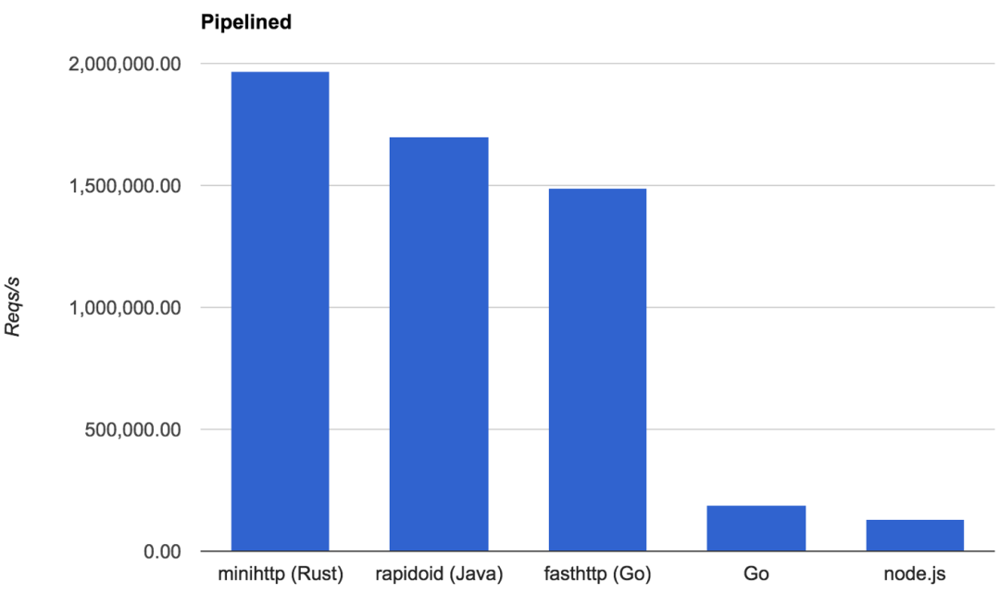

## Tokio 使用指南

在上一个章节中，我们提到了 Rust 异步编程的限制，其中之一就是你必须引入社区提供的异步运行时，其中最有名的就是 `tokio`。在本章中，我们一起来看看 `tokio` 到底有什么优势，以及该如何使用它。

> 本章在内容上大量借鉴和翻译了 tokio 官方文档[Tokio Tutorial](https://tokio.rs/tokio/tutorial), 但是重新组织了内容形式并融入了很多自己的见解和感悟，给大家提供更好的可读性和知识扩展性。


### tokio 概览

对于 Async Rust，最最重要的莫过于底层的异步运行时，它提供了执行器、任务调度、异步 API 等核心服务。简单来说，使用 Rust 提供的 `async/await` 特性编写的异步代码要运行起来，就必须依赖于异步运行时，否则这些代码将毫无用处。


####  异步运行时

Rust 语言本身只提供了异步编程所需的基本特性，例如 `async/await` 关键字，标准库中的 `Future` 特征，官方提供的 `futures` 实用库，这些特性单独使用没有任何用处，因此我们需要一个运行时来将这些特性实现的代码运行起来。

异步运行时是由 Rust 社区提供的，它们的核心是一个 `reactor` 和一个或多个 `executor`(执行器):

- `reactor` 用于提供外部事件的订阅机制，例如 `I/O` 、进程间通信、定时器等
- `executor` 在上一章我们有过深入介绍，它用于调度和执行相应的任务( `Future` )

目前最受欢迎的几个运行时有:

- [tokio](https://github.com/tokio-rs/tokio)，目前最受欢迎的异步运行时，功能强大，还提供了异步所需的各种工具(例如 tracing )、网络协议框架(例如 HTTP，gRPC )等等
- [async-std](https://github.com/async-rs/async-std)，最大的优点就是跟标准库兼容性较强
- [smol](https://github.com/smol-rs/smol), 一个小巧的异步运行时

但是，大浪淘沙，留下的才是金子，随着时间的流逝，`tokio`越来越亮眼，无论是性能、功能还是社区、文档，它在各个方面都异常优秀，时至今日，可以说已成为事实上的标准。

##### 异步运行时的兼容性

为何选择异步运行时这么重要？不仅仅是它们在功能、性能上存在区别，更重要的是当你选择了一个，往往就无法切换到另外一个，除非异步代码很少。

使用异步运行时，往往伴随着对它相关的生态系统的深入使用，因此耦合性会越来越强，直至最后你很难切换到另一个运行时，例如 `tokio` 和 `async-std` ，就存在这种问题。

如果你实在有这种需求，可以考虑使用 [`async-compat`](https://github.com/smol-rs/async-compat)，该包提供了一个中间层，用于兼容 `tokio` 和其它运行时。

##### 结论

相信大家看到现在，心中应该有一个结论了。首先，运行时之间的不兼容性，让我们必须提前选择一个运行时，并且在未来坚持用下去，那这个运行时就应该是最优秀、最成熟的那个，`tokio` 几乎成了不二选择，当然 `tokio` 也有自己的问题：更难上手和运行时之间的兼容性。

如果你只用 `tokio` ，那兼容性自然不是问题，至于难以上手，Rust 这么难，我们都学到现在了，何况区区一个异步运行时，在本书的帮助下，这些都不再是问题：）


#### tokio 简介

tokio 是一个纸醉金迷之地，只要有钱就可以为所欲为，哦，抱歉，走错片场了。`tokio` 是 Rust 最优秀的异步运行时框架，它提供了写异步网络服务所需的几乎所有功能，不仅仅适用于大型服务器，还适用于小型嵌入式设备，它主要由以下组件构成：

- 多线程版本的异步运行时，可以运行使用 `async/await` 编写的代码；
- 标准库中阻塞 API 的异步版本，例如`thread::sleep`会阻塞当前线程，`tokio`中就提供了相应的异步实现版本；
- 构建异步编程所需的生态，甚至还提供了 [tracing](https://github.com/tokio-rs/tracing) 用于日志和分布式追踪， 提供 [console](https://github.com/tokio-rs/console) 用于 Debug 异步编程；

##### 优势

下面一起来看看使用 `tokio` 能给你提供哪些优势。

- **高性能**

  因为快所以快，前者是 Rust 快，后者是 `tokio` 快。 `tokio` 在编写时充分利用了 Rust 提供的各种零成本抽象和高性能特性，而且贯彻了 Rust 的牛逼思想：如果你选择手写代码，那么最好的结果就是跟 `tokio` 一样快！

  以下是一张官方提供的性能参考图，大致能体现出 `tokio` 的性能之恐怖：

  

- **高可靠**

  Rust 语言的安全可靠性顺理成章的影响了 `tokio` 的可靠性，曾经有一个调查给出了令人乍舌的[结论](https://www.zdnet.com/article/microsoft-70-percent-of-all-security-bugs-are-memory-safety-issues/)：软件系统 70%的高危漏洞都是由内存不安全性导致的。

  在 Rust 提供的安全性之外，`tokio` 还致力于提供一致性的行为表现：无论你何时运行系统，它的预期表现和性能都是一致的，例如不会出现莫名其妙的请求延迟或响应时间大幅增加。

- **简单易用**

  通过 Rust 提供的 `async/await` 特性，编写异步程序的复杂性相比当初已经大幅降低，同时 `tokio` 还为我们提供了丰富的生态，进一步大幅降低了其复杂性。

  同时 `tokio` 遵循了标准库的命名规则，让熟悉标准库的用户可以很快习惯于 `tokio` 的语法，再借助于 Rust 强大的类型系统，用户可以轻松地编写和交付正确的代码。

- **使用灵活性**

  `tokio` 支持你灵活的定制自己想要的运行时，例如你可以选择多线程 + 任务盗取模式的复杂运行时，也可以选择单线程的轻量级运行时。总之，几乎你的每一种需求在 `tokio` 中都能寻找到支持(画外音：强大的灵活性需要一定的复杂性来换取，并不是免费的午餐)。

##### 劣势

虽然 `tokio` 对于大多数需要并发的项目都是非常适合的，但是确实有一些场景它并不适合使用:

- **并行运行 CPU 密集型的任务**。`tokio` 非常适合于 IO 密集型任务，这些 IO 任务的绝大多数时间都用于阻塞等待 IO 的结果，而不是刷刷刷的单烤 CPU。如果你的应用是 CPU 密集型(例如并行计算)，建议使用 [rayon](https://github.com/rayon-rs/rayon)，当然，对于其中的 IO 任务部分，你依然可以混用 `tokio`
- **读取大量的文件**。读取文件的瓶颈主要在于操作系统，因为 OS 没有提供异步文件读取接口，大量的并发并不会提升文件读取的并行性能，反而可能会造成不可忽视的性能损耗，因此建议使用线程(或线程池)的方式
- **发送少量 HTTP 请求**。`tokio` 的优势是给予你并发处理大量任务的能力，对于这种轻量级 HTTP 请求场景，`tokio` 除了增加你的代码复杂性，并无法带来什么额外的优势。因此，对于这种场景，你可以使用 [reqwest](https://github.com/seanmonstar/reqwest) 库，它会更加简单易用。

> 若大家使用 tokio，那 CPU 密集的任务尤其需要用线程的方式去处理，例如使用 `spawn_blocking` 创建一个阻塞的线程去完成相应 CPU 密集任务。
>
> 原因是：tokio 是协作式的调度器，如果某个 CPU 密集的异步任务是通过 tokio 创建的，那理论上来说，该异步任务需要跟其它的异步任务交错执行，最终大家都得到了执行，皆大欢喜。但实际情况是，CPU 密集的任务很可能会一直霸着着 CPU，此时 tokio 的调度方式决定了该任务会一直被执行，这意味着，其它的异步任务无法得到执行的机会，最终这些任务都会因为得不到资源而饿死。
>
> 而使用 `spawn_blocking` 后，会创建一个单独的 OS 线程，该线程并不会被 tokio 所调度( 被 OS 所调度 )，因此它所执行的 CPU 密集任务也不会导致 tokio 调度的那些异步任务被饿死


#### 总结

离开三方开源社区提供的异步运行时， `async/await` 什么都不是，甚至还不如一堆破铜烂铁，除非你选择根据自己的需求手撸一个。

而 `tokio` 就是那颗皇冠上的夜明珠，也是值得我们投入时间去深入学习的开源库，它的设计原理和代码实现都异常优秀，在之后的章节中，我们将对其进行深入学习和剖析，敬请期待。

---


### tokio 初印象

又到了喜闻乐见的初印象环节，这个环节决定了你心中的那 24 盏灯最终是全亮还是全灭。

在本文中，我们将看看本专题的学习目标、`tokio`该怎么引入以及如何实现一个 `Hello Tokio` 项目，最终亮灯还是灭灯的决定权留给各位看官。但我提前说好，如果你全灭了，但却找不到更好的，未来还是得回来真香 :P


#### 专题目标

通过 API 学项目无疑是无聊的，因此我们采用一个与众不同的方式：边学边练，在本专题的最后你将拥有一个 `redis` 客户端和服务端，当然不会实现一个完整版本的 `redis` ，只会提供基本的功能和部分常用的命令。

##### mini-redis

`redis` 的项目源码可以在[这里访问](https://github.com/sunface/rust-by-practice/tree/master/zh-CN/assets/mini-redis)，本项目是从[官方地址](https://github.com/tokio-rs/mini-redis) `fork` 而来，在未来会提供注释和文档汉化。

再次声明：该项目仅仅用于学习目的，因此它的文档注释非常全，但是它完全无法作为 `redis` 的替代品。


#### 环境配置

首先，我们假定你已经安装了 Rust 和相关的工具链，例如 `cargo`。其中 Rust 版本的最低要求是 `1.45.0`，建议使用最新版 `1.58`:

```shell
sunfei@sunface $ rustc --version
rustc 1.58.0 (02072b482 2022-01-11)
```

接下来，安装 `mini-redis` 的服务器端，它可以用来测试我们后面将要实现的 `redis` 客户端：

```shell
$ cargo install mini-redis
```

> 如果下载失败，也可以通过[这个地址](https://github.com/sunface/rust-by-practice/tree/master/zh-CN/assets/mini-redis)下载源码，然后在本地通过 `cargo run`运行。

下载成功后，启动服务端:

```shell
$ mini-redis-server
```

然后，再使用客户端测试下刚启动的服务端:

```shell
$ mini-redis-cli set foo 1
OK
$ mini-redis-cli get foo
"1"
```

不得不说，还挺好用的，先自我陶醉下 :) 此时，万事俱备，只欠东风，接下来是时候亮"箭"了：实现我们的 `Hello Tokio` 项目。


#### Hello Tokio

与简单无比的 `Hello World` 有所不同(简单？还记得本书开头时，湖畔边的那个多国语言版本的`你好，世界`嘛~~)，`Hello Tokio` 它承载着"非常艰巨"的任务，那就是向刚启动的 `redis` 服务器写入一个 `key=hello, value=world` ，然后再读取出来，嗯，使用 `mini-redis` 客户端 :)

##### 分析未到，代码先行

在详细讲解之前，我们先来看看完整的代码，让大家有一个直观的印象。首先，创建一个新的 `Rust` 项目:

```shell
$ cargo new my-redis
$ cd my-redis
```

然后在 `Cargo.toml` 中添加相关的依赖:

```toml
[dependencies]
tokio = { version = "1", features = ["full"] }
mini-redis = "0.4"
```

接下来，使用以下代码替换 `main.rs` 中的内容：

```rust
use mini_redis::{client, Result};

#[tokio::main]
async fn main() -> Result<()> {
    // 建立与mini-redis服务器的连接
    let mut client = client::connect("127.0.0.1:6379").await?;

    // 设置 key: "hello" 和 值: "world"
    client.set("hello", "world".into()).await?;

    // 获取"key=hello"的值
    let result = client.get("hello").await?;

    println!("从服务器端获取到结果={:?}", result);

    Ok(())
}
```

不知道你之前启动的 `mini-redis-server` 关闭没有，如果关了，记得重新启动下，否则我们的代码就是意大利空气炮。

最后，运行这个项目:

```shell
$ cargo run
从服务器端获取到结果=Some("world")
```

Perfect, 代码成功运行，是时候来解释下其中蕴藏的至高奥秘了。


#### 原理解释

代码篇幅虽然不长，但是还是有不少值得关注的地方，接下来我们一起来看看。

```rust
let mut client = client::connect("127.0.0.1:6379").await?;
```

[`client::connect`](https://docs.rs/mini-redis/0.4.1/mini_redis/client/fn.connect.html) 函数由`mini-redis` 包提供，它使用异步的方式跟指定的远程 `IP` 地址建立 TCP 长连接，一旦连接建立成功，那 `client` 的赋值初始化也将完成。

特别值得注意的是：虽然该连接是异步建立的，但是从代码本身来看，完全是**同步的代码编写方式**，唯一能说明异步的点就是 `.await`。

##### 什么是异步编程

大部分计算机程序都是按照代码编写的顺序来执行的：先执行第一行，然后第二行，以此类推(当然，还要考虑流程控制，例如循环)。当进行同步编程时，一旦程序遇到一个操作无法被立即完成，它就会进入阻塞状态，直到该操作完成为止。

因此同步编程非常符合我们人类的思维习惯，是一个顺其自然的过程，被几乎每一个程序员所喜欢(本来想说所有，但我不敢打包票，毕竟总有特立独行之士)。例如，当建立 TCP 连接时，当前线程会被阻塞，直到等待该连接建立完成，然后才往下继续进行。

而使用异步编程，无法立即完成的操作会被切到后台去等待，因此当前线程不会被阻塞，它会接着执行其它的操作。一旦之前的操作准备好可以继续执行后，它会通知执行器，然后执行器会调度它并从上次离开的点继续执行。但是大家想象下，如果没有使用 `await`，而是按照这个异步的流程使用通知 -> 回调的方式实现，代码该多么的难写和难读！

好在 Rust 为我们提供了 `async/await` 的异步编程特性，让我们可以像写同步代码那样去写异步的代码，也让这个世界美好依旧。

##### 编译时绿色线程

一个函数可以通过`async fn`的方式被标记为异步函数:

```rust
use mini_redis::Result;
use mini_redis::client::Client;
use tokio::net::ToSocketAddrs;

pub async fn connect<T: ToSocketAddrs>(addr: T) -> Result<Client> {
    // ...
}
```

在上例中，`redis` 的连接函数 `connect` 实现如上，它看上去很像是一个同步函数，但是 `async fn` 出卖了它。 `async fn` 异步函数并不会直接返回值，而是返回一个 `Future`，顾名思义，该 `Future` 会在未来某个时间点被执行，然后最终获取到真实的返回值 `Result<Client>`。

> `async/await` 的原理就算大家不理解，也不妨碍使用 `tokio` 写出能用的服务，但是如果想要更深入的用好，强烈建议认真读下本书的 [`async/await` 异步编程章节](https://course.rs/async-rust/async/intro.html)，你会对 Rust 的异步编程有一个全新且深刻的认识。

由于 `async` 会返回一个 `Future`，因此我们还需要配合使用 `.await` 来让该 `Future` 运行起来，最终获得返回值:

```rust
async fn say_to_world() -> String {
    String::from("world")
}

#[tokio::main]
async fn main() {
    // 此处的函数调用是惰性的，并不会执行 `say_to_world()` 函数体中的代码
    let op = say_to_world();

    // 首先打印出 "hello"
    println!("hello");

    // 使用 `.await` 让 `say_to_world` 开始运行起来
    println!("{}", op.await);
}
```

上面代码输出如下：

```shell
hello
world
```

而大家可能很好奇 `async fn` 到底返回什么吧？它实际上返回的是一个实现了 `Future` 特征的匿名类型: `impl Future<Output = String>`。

##### async main

在代码中，使用了一个与众不同的 `main` 函数 : `async fn main` ，而且是用 `#[tokio::main]` 属性进行了标记。异步 `main` 函数有以下意义：

- `.await` 只能在 `async` 函数中使用，如果是以前的 `fn main`，那它内部是无法直接使用 `async` 函数的！这个会极大的限制了我们的使用场景；
- 异步运行时本身需要初始化；

因此 `#[tokio::main]` 宏在将 `async fn main` 隐式的转换为 `fn main` 的同时还对整个异步运行时进行了初始化。例如以下代码:

```rust
#[tokio::main]
async fn main() {
    println!("hello");
}
```

将被转换成:

```rust
fn main() {
    let mut rt = tokio::runtime::Runtime::new().unwrap();
    rt.block_on(async {
        println!("hello");
    })
}
```

最终，Rust 编译器就愉快地执行这段代码了。


#### cargo feature

在引入 `tokio` 包时，我们在 `Cargo.toml` 文件中添加了这么一行:

```toml
tokio = { version = "1", features = ["full"] }
```

里面有个 `features = ["full"]` 可能大家会比较迷惑，当然，关于它的具体解释在本书的 [Cargo 详解专题](https://course.rs/cargo/intro.html) 有介绍，这里就简单进行说明。

`Tokio` 有很多功能和特性，例如 `TCP`，`UDP`，`Unix sockets`，同步工具，多调度类型等等，不是每个应用都需要所有的这些特性。为了优化编译时间和最终生成可执行文件大小、内存占用大小，应用可以对这些特性进行可选引入。

而这里为了演示的方便，我们使用 `full` ，表示直接引入所有的特性。


#### 总结

大家对 `tokio` 的初印象如何？可否 24 灯全亮通过？

总之，`tokio` 做的事情其实是细雨润无声的，在大多数时候，我们并不能感觉到它的存在，但是它确实是异步编程中最重要的一环(或者之一)，深入了解它对我们的未来之路会有莫大的帮助。

接下来，正式开始 `tokio` 的学习之旅。

---


### 创建异步任务

同志们，抓稳了，我们即将换挡提速，通向 `mini-redis` 服务端的高速之路已经开启。

不过在开始之前，先来做点收尾工作：上一章节中，我们实现了一个简易的 `mini-redis` 客户端并支持了 `SET`/`GET` 操作, 现在将该[代码](https://course.rs/async-rust/tokio/getting-startted.html#分析未到代码先行)移动到 `examples` 文件夹下，因为我们这个章节要实现的是服务器，后面可以通过运行 `example` 的方式，用之前客户端示例对我们的服务器端进行测试:

```shell
$ mkdir -p examples
$ mv src/main.rs examples/hello-redis.rs
```

并在 `Cargo.toml` 里添加 `[[example]]` 说明。关于 `example` 的详细说明，可以在[Cargo使用指南](https://course.rs/cargo/reference/cargo-target.html#示例对象examples)里进一步了解。

```toml
[[example]]
name = "hello-redis"
path = "examples/hello-redis.rs"
```

然后再重新创建一个空的 `src/main.rs` 文件，至此替换文档已经完成，提速正式开始。


#### 接收 sockets

作为服务器端，最基础的工作无疑是接收外部进来的 TCP 连接，可以通过 `tokio::net::TcpListener` 来完成。

> Tokio 中大多数类型的名称都和标准库中对应的同步类型名称相同，而且，如果没有特殊原因，Tokio 的 API 名称也和标准库保持一致，只不过用 `async fn` 取代 `fn` 来声明函数。

`TcpListener` 监听 **6379** 端口，然后通过循环来接收外部进来的连接，每个连接在处理完后会被关闭。对于目前来说，我们的任务很简单：读取命令、打印到标准输出 `stdout`，最后回复给客户端一个错误。

```rust
use tokio::net::{TcpListener, TcpStream};
use mini_redis::{Connection, Frame};

#[tokio::main]
async fn main() {
    // Bind the listener to the address
    // 监听指定地址，等待 TCP 连接进来
    let listener = TcpListener::bind("127.0.0.1:6379").await.unwrap();

    loop {
        // 第二个被忽略的项中包含有新连接的 `IP` 和端口信息
        let (socket, _) = listener.accept().await.unwrap();
        process(socket).await;
    }
}

async fn process(socket: TcpStream) {
    // `Connection` 对于 redis 的读写进行了抽象封装，因此我们读到的是一个一个数据帧frame(数据帧 = redis命令 + 数据)，而不是字节流
    // `Connection` 是在 mini-redis 中定义
    let mut connection = Connection::new(socket);

    if let Some(frame) = connection.read_frame().await.unwrap() {
        println!("GOT: {:?}", frame);

        // 回复一个错误
        let response = Frame::Error("unimplemented".to_string());
        connection.write_frame(&response).await.unwrap();
    }
}
```

现在运行我们的简单服务器 :

```shel
cargo run
```

此时服务器会处于循环等待以接收连接的状态，接下来在一个新的终端窗口中启动上一章节中的 `redis` 客户端，由于相关代码已经放入 `examples` 文件夹下，因此我们可以使用 `--example` 来指定运行该客户端示例:

```shell
$ cargo run --example hello-redis
```

此时，客户端的输出是: `Error: "unimplemented"`, 同时服务器端打印出了客户端发来的由 **redis 命令和数据** 组成的数据帧: `GOT: Array([Bulk(b"set"), Bulk(b"hello"), Bulk(b"world")])`。


#### 生成任务

上面的服务器，如果你仔细看，它其实一次只能接受和处理一条 TCP 连接，只有等当前的处理完并结束后，才能开始接收下一条连接。原因在于 `loop` 循环中的 `await` 会导致当前任务进入阻塞等待，也就是 `loop` 循环会被阻塞。

而这显然不是我们想要的，服务器能并发地处理多条连接的请求，才是正确的打开姿势，下面来看看如何实现真正的并发。

> 关于并发和并行，在[多线程章节中](https://course.rs/advance/concurrency-with-threads/concurrency-parallelism.html)有详细的解释

为了并发的处理连接，需要为每一条进来的连接都生成( `spawn` )一个新的任务, 然后在该任务中处理连接：

```rust
use tokio::net::TcpListener;

#[tokio::main]
async fn main() {
    let listener = TcpListener::bind("127.0.0.1:6379").await.unwrap();

    loop {
        let (socket, _) = listener.accept().await.unwrap();
        // 为每一条连接都生成一个新的任务，
        // `socket` 的所有权将被移动到新的任务中，并在那里进行处理
        tokio::spawn(async move {
            process(socket).await;
        });
    }
}
```

##### 任务

一个 Tokio 任务是一个异步的绿色线程，它们通过 `tokio::spawn` 进行创建，该函数会返回一个 `JoinHandle` 类型的句柄，调用者可以使用该句柄跟创建的任务进行交互。

`spawn` 函数的参数是一个 `async` 语句块，该语句块甚至可以返回一个值，然后调用者可以通过 `JoinHandle` 句柄获取该值：

```rust
#[tokio::main]
async fn main() {
    let handle = tokio::spawn(async {
       10086
    });

    let out = handle.await.unwrap();
    println!("GOT {}", out);
}
```

以上代码会打印出`GOT 10086`。实际上，上面代码中`.await` 会返回一个 `Result` ，若 `spawn` 创建的任务正常运行结束，则返回一个 `Ok(T)`的值，否则会返回一个错误 `Err`：例如任务内部发生了 `panic` 或任务因为运行时关闭被强制取消时。

任务是调度器管理的执行单元。`spawn`生成的任务会首先提交给调度器，然后由它负责调度执行。需要注意的是，执行任务的线程未必是创建任务的线程，任务完全有可能运行在另一个不同的线程上，而且任务在生成后，它还可能会在线程间被移动。

任务在 Tokio 中远比看上去要更轻量，例如创建一个任务仅仅需要一次 64 字节大小的内存分配。因此应用程序在生成任务上，完全不应该有任何心理负担，除非你在一台没那么好的机器上疯狂生成了几百万个任务。。。

##### 'static 约束

当使用 Tokio 创建一个任务时，该任务类型的生命周期必须是 `'static`。意味着，在任务中不能使用外部数据的引用:

```rust
use tokio::task;

#[tokio::main]
async fn main() {
    let v = vec![1, 2, 3];

    task::spawn(async {
        println!("Here's a vec: {:?}", v);
    });
}
```

上面代码中，`spawn` 出的任务引用了外部环境中的变量 `v` ，导致以下报错:

```console
error[E0373]: async block may outlive the current function, but
              it borrows `v`, which is owned by the current function
 --> src/main.rs:7:23
  |
7 |       task::spawn(async {
  |  _______________________^
8 | |         println!("Here's a vec: {:?}", v);
  | |                                        - `v` is borrowed here
9 | |     });
  | |_____^ may outlive borrowed value `v`
  |
note: function requires argument type to outlive `'static`
 --> src/main.rs:7:17
  |
7 |       task::spawn(async {
  |  _________________^
8 | |         println!("Here's a vector: {:?}", v);
9 | |     });
  | |_____^
help: to force the async block to take ownership of `v` (and any other
      referenced variables), use the `move` keyword
  |
7 |     task::spawn(async move {
8 |         println!("Here's a vec: {:?}", v);
9 |     });
  |
```

原因在于：默认情况下，变量并不是通过 `move` 的方式转移进 `async` 语句块的， `v` 变量的所有权依然属于 `main` 函数，因为任务内部的 `println!` 是通过借用的方式使用了 `v`，但是这种借用并不能满足 `'static` 生命周期的要求。

在报错的同时，Rust 编译器还给出了相当有帮助的提示：为 `async` 语句块使用 `move` 关键字，这样就能将 `v` 的所有权从 `main` 函数转移到新创建的任务中。

但是 `move` 有一个问题，一个数据只能被一个任务使用，如果想要多个任务使用一个数据，就有些强人所难。不知道还有多少同学记得 [`Arc`](https://course.rs/advance/smart-pointer/rc-arc.html)，它可以轻松解决该问题，还是线程安全的。

在上面的报错中，还有一句很奇怪的信息`function requires argument type to outlive `'static` `， 函数要求参数类型的生命周期必须比 `'static` 长，问题是 `'static` 已经活得跟整个程序一样久了，难道函数的参数还能活得更久？大家可能会觉得编译器秀逗了，毕竟其它语言编译器也有秀逗的时候:)

先别急着给它扣帽子，虽然我有时候也想这么做。。原因是它说的是类型必须活得比 `'static` 长，而不是值。当我们说一个值是 `'static` 时，意味着它将永远存活。这个很重要，因为编译器无法知道新创建的任务将存活多久，所以唯一的办法就是让任务永远存活。

如果大家对于 `'&static` 和 `T: 'static` 较为模糊，强烈建议回顾下[该章节](https://course.rs/advance/lifetime/static.html)。

##### Send 约束

`tokio::spawn` 生成的任务必须实现 `Send` 特征，因为当这些任务在 `.await` 执行过程中发生阻塞时，Tokio 调度器会将任务在线程间移动。

**一个任务要实现 `Send` 特征，那它在 `.await` 调用的过程中所持有的全部数据都必须实现 `Send` 特征**。当 `.await` 调用发生阻塞时，任务会让出当前线程所有权给调度器，然后当任务准备好后，调度器会从上一次暂停的位置继续执行该任务。该流程能正确的工作，任务必须将`.await`之后使用的所有状态保存起来，这样才能在中断后恢复现场并继续执行。若这些状态实现了 `Send` 特征(可以在线程间安全地移动)，那任务自然也就可以在线程间安全地移动。

例如以下代码可以工作:

```rust
use tokio::task::yield_now;
use std::rc::Rc;

#[tokio::main]
async fn main() {
    tokio::spawn(async {
        // 语句块的使用强制了 `rc` 会在 `.await` 被调用前就被释放，
        // 因此 `rc` 并不会影响 `.await`的安全性
        {
            let rc = Rc::new("hello");
            println!("{}", rc);
        }

        // `rc` 的作用范围已经失效，因此当任务让出所有权给当前线程时，它无需作为状态被保存起来
        yield_now().await;
    });
}
```

但是下面代码就不行：

```rust
use tokio::task::yield_now;
use std::rc::Rc;

#[tokio::main]
async fn main() {
    tokio::spawn(async {
        let rc = Rc::new("hello");


        // `rc` 在 `.await` 后还被继续使用，因此它必须被作为任务的状态保存起来
        yield_now().await;


        // 事实上，注释掉下面一行代码，依然会报错
        // 原因是：是否保存，不取决于 `rc` 是否被使用，而是取决于 `.await`在调用时是否仍然处于 `rc` 的作用域中
        println!("{}", rc);

        // rc 作用域在这里结束
    });
}
```

这里有一个很重要的点，代码注释里有讲到，但是我们再重复一次： `rc` 是否会保存到任务状态中，取决于 `.await` 的调用是否处于它的作用域中，上面代码中，就算你注释掉 `println!` 函数，该报错依然会报错，因为 `rc` 的作用域直到 `async` 的末尾才结束！

下面是相应的报错，在下一章节，我们还会继续深入讨论该错误:

```shell
error: future cannot be sent between threads safely
   --> src/main.rs:6:5
    |
6   |     tokio::spawn(async {
    |     ^^^^^^^^^^^^ future created by async block is not `Send`
    |
   ::: [..]spawn.rs:127:21
    |
127 |         T: Future + Send + 'static,
    |                     ---- required by this bound in
    |                          `tokio::task::spawn::spawn`
    |
    = help: within `impl std::future::Future`, the trait
    |       `std::marker::Send` is not  implemented for
    |       `std::rc::Rc<&str>`
note: future is not `Send` as this value is used across an await
   --> src/main.rs:10:9
    |
7   |         let rc = Rc::new("hello");
    |             -- has type `std::rc::Rc<&str>` which is not `Send`
...
10  |         yield_now().await;
    |         ^^^^^^^^^^^^^^^^^ await occurs here, with `rc` maybe
    |                           used later
11  |         println!("{}", rc);
12  |     });
    |     - `rc` is later dropped here
```


#### 使用 HashMap 存储数据

现在，我们可以继续前进了，下面来实现 `process` 函数，它用于处理进入的命令。相应的值将被存储在 `HashMap` 中: 通过 `SET` 命令存值，通过 `GET` 命令来取值。

同时，我们将使用循环的方式在同一个客户端连接中处理多次连续的请求：

```rust
use tokio::net::TcpStream;
use mini_redis::{Connection, Frame};

async fn process(socket: TcpStream) {
    use mini_redis::Command::{self, Get, Set};
    use std::collections::HashMap;

    // 使用 hashmap 来存储 redis 的数据
    let mut db = HashMap::new();

    // `mini-redis` 提供的便利函数，使用返回的 `connection` 可以用于从 socket 中读取数据并解析为数据帧
    let mut connection = Connection::new(socket);

    // 使用 `read_frame` 方法从连接获取一个数据帧：一条redis命令 + 相应的数据
    while let Some(frame) = connection.read_frame().await.unwrap() {
        let response = match Command::from_frame(frame).unwrap() {
            Set(cmd) => {
                // 值被存储为 `Vec<u8>` 的形式
                db.insert(cmd.key().to_string(), cmd.value().to_vec());
                Frame::Simple("OK".to_string())
            }
            Get(cmd) => {
                if let Some(value) = db.get(cmd.key()) {
                    // `Frame::Bulk` 期待数据的类型是 `Bytes`， 该类型会在后面章节讲解，
                    // 此时，你只要知道 `&Vec<u8>` 可以使用 `into()` 方法转换成 `Bytes` 类型
                    Frame::Bulk(value.clone().into())
                } else {
                    Frame::Null
                }
            }
            cmd => panic!("unimplemented {:?}", cmd),
        };

        // 将请求响应返回给客户端
        connection.write_frame(&response).await.unwrap();
    }
}

// main 函数在之前已实现
```

使用 `cargo run` 运行服务器，然后再打开另一个终端窗口，运行 `hello-redis` 客户端示例: `cargo run --example hello-redis`。

Bingo，在看了这么多原理后，我们终于迈出了小小的第一步，并获取到了存在 `HashMap` 中的值: `从服务器端获取到结果=Some(b"world")`。

但是问题又来了：这些值无法在 TCP 连接中共享，如果另外一个用户连接上来并试图同时获取 `hello` 这个 `key`，他将一无所获。


### 共享状态

上一章节中，咱们搭建了一个异步的 redis 服务器，并成功的提供了服务，但是其隐藏了一个巨大的问题：状态(数据)无法在多个连接之间共享，下面一起来看看该如何解决。

好在 `Tokio` 十分强大，上面问题对应的解决方法也不止一种：

- 使用 `Mutex` 来保护数据的共享访问；
- 生成一个异步任务去管理状态，然后各个连接使用消息传递的方式与其进行交互；

其中，第一种方法适合比较简单的数据，而第二种方法适用于需要异步工作的，例如 I/O 原语。由于我们使用的数据存储类型是 `HashMap`，使用到的相关操作是 `insert` 和 `get` ，又因为这两个操作都不是异步的，因此只要使用 `Mutex` 即可解决问题。

在上面的描述中，说实话第二种方法及其适用的场景并不是很好理解，但没关系，在后面章节会进行详细介绍。


#### 添加 bytes 依赖包

在上一节中，我们使用 `Vec<u8>` 来保存目标数据，但是它有一个问题，对它进行克隆时会将底层数据也整个复制一份，效率很低，但是克隆操作对于我们在多连接间共享数据又是必不可少的。

因此这里咱们新引入一个 `bytes` 包，它包含一个 `Bytes` 类型，当对该类型的值进行克隆时，就不再会克隆底层数据。事实上，`Bytes` 是一个引用计数类型，跟 `Arc` 非常类似，或者准确的说，`Bytes` 就是基于 `Arc` 实现的，但相比后者`Bytes` 提供了一些额外的能力。

在 `Cargo.toml` 的 `[dependencies]` 中引入 `bytes` ：

```toml
bytes = "1"
```


#### 初始化 HashMap

由于 `HashMap` 会在多个任务甚至多个线程间共享，再结合之前的选择，最终我们决定使用 `Arc<Mutex<T>>` 的方式对其进行包裹。

但是，大家先来畅想一下使用它进行包裹后的类型长什么样？ 大概，可能，长这样：`Arc<Mutex<HashMap<String, Bytes>>>`，天哪噜，一不小心，你就遇到了 Rust 的阴暗面：类型大串烧。可以想象，如果要在代码中到处使用这样的类型，可读性会极速下降，因此我们需要一个[类型别名](https://course.rs/advance/custom-type.html#类型别名type-alias)( type alias )来简化下：

```rust
use bytes::Bytes;
use std::collections::HashMap;
use std::sync::{Arc, Mutex};

type Db = Arc<Mutex<HashMap<String, Bytes>>>;
```

此时，`Db` 就是一个类型别名，使用它就可以替代那一大串的东东，等下你就能看到功效。

接着，我们需要在 `main` 函数中对 `HashMap` 进行初始化，然后使用 `Arc` 克隆一份它的所有权并将其传入到生成的异步任务中。事实上在 Tokio 中，这里的 `Arc` 被称为 **handle**，或者更宽泛的说，`handle` 在 Tokio 中可以用来访问某个共享状态。

```rust
use tokio::net::TcpListener;
use std::collections::HashMap;
use std::sync::{Arc, Mutex};

#[tokio::main]
async fn main() {
    let listener = TcpListener::bind("127.0.0.1:6379").await.unwrap();

    println!("Listening");

    let db = Arc::new(Mutex::new(HashMap::new()));

    loop {
        let (socket, _) = listener.accept().await.unwrap();
        // 将 handle 克隆一份
        let db = db.clone();

        println!("Accepted");
        tokio::spawn(async move {
            process(socket, db).await;
        });
    }
}
```

##### 为何使用 `std::sync::Mutex`

上面代码还有一点非常重要，那就是我们使用了 `std::sync::Mutex` 来保护 `HashMap`，而不是使用 `tokio::sync::Mutex`。

在使用 Tokio 编写异步代码时，一个常见的错误无条件地使用 `tokio::sync::Mutex` ，而真相是：Tokio 提供的异步锁只应该在跨多个 `.await`调用时使用，而且 Tokio 的 `Mutex` 实际上内部使用的也是 `std::sync::Mutex`。

多补充几句，在异步代码中，关于锁的使用有以下经验之谈：

- 锁如果在多个 `.await` 过程中持有，应该使用 Tokio 提供的锁，原因是 `.await`的过程中锁可能在线程间转移，若使用标准库的同步锁存在死锁的可能性，例如某个任务刚获取完锁，还没使用完就因为 `.await` 让出了当前线程的所有权，结果下个任务又去获取了锁，造成死锁
- 锁竞争不多的情况下，使用 `std::sync::Mutex`
- 锁竞争多，可以考虑使用三方库提供的性能更高的锁，例如 [`parking_lot::Mutex`](https://docs.rs/parking_lot/0.10.2/parking_lot/type.Mutex.html)


#### 更新 process()

`process()` 函数不再初始化 `HashMap`，取而代之的是它使用了 `HashMap` 的一个 `handle` 作为参数:

```rust
use tokio::net::TcpStream;
use mini_redis::{Connection, Frame};

async fn process(socket: TcpStream, db: Db) {
    use mini_redis::Command::{self, Get, Set};

    let mut connection = Connection::new(socket);

    while let Some(frame) = connection.read_frame().await.unwrap() {
        let response = match Command::from_frame(frame).unwrap() {
            Set(cmd) => {
                let mut db = db.lock().unwrap();
                db.insert(cmd.key().to_string(), cmd.value().clone());
                Frame::Simple("OK".to_string())
            }
            Get(cmd) => {
                let db = db.lock().unwrap();
                if let Some(value) = db.get(cmd.key()) {
                    Frame::Bulk(value.clone())
                } else {
                    Frame::Null
                }
            }
            cmd => panic!("unimplemented {:?}", cmd),
        };

        connection.write_frame(&response).await.unwrap();
    }
}
```


#### 任务、线程和锁竞争

当竞争不多的时候，使用阻塞性的锁去保护共享数据是一个正确的选择。当一个锁竞争触发后，当前正在执行任务(请求锁)的线程会被阻塞，并等待锁被前一个使用者释放。这里的关键就是：**锁竞争不仅仅会导致当前的任务被阻塞，还会导致执行任务的线程被阻塞，因此该线程准备执行的其它任务也会因此被阻塞！**

默认情况下，Tokio 调度器使用了多线程模式，此时如果有大量的任务都需要访问同一个锁，那么锁竞争将变得激烈起来。当然，你也可以使用 [**current_thread**](https://docs.rs/tokio/1.15.0/tokio/runtime/index.html#current-thread-scheduler) 运行时设置，在该设置下会使用一个单线程的调度器(执行器)，所有的任务都会创建并执行在当前线程上，因此不再会有锁竞争。

> current_thread 是一个轻量级、单线程的运行时，当任务数不多或连接数不多时是一个很好的选择。例如你想在一个异步客户端库的基础上提供给用户同步的 API 访问时，该模式就很适用

当同步锁的竞争变成一个问题时，使用 Tokio 提供的异步锁几乎并不能帮你解决问题，此时可以考虑如下选项：

- 创建专门的任务并使用消息传递的方式来管理状态
- 将锁进行分片
- 重构代码以避免锁

在我们的例子中，由于每一个 `key` 都是独立的，因此对锁进行分片将成为一个不错的选择:

```rust
type ShardedDb = Arc<Vec<Mutex<HashMap<String, Vec<u8>>>>>;

fn new_sharded_db(num_shards: usize) -> ShardedDb {
    let mut db = Vec::with_capacity(num_shards);
    for _ in 0..num_shards {
        db.push(Mutex::new(HashMap::new()));
    }
    Arc::new(db)
}
```

在这里，我们创建了 N 个不同的存储实例，每个实例都会存储不同的分片数据，例如我们有`a-i`共 9 个不同的 `key`, 可以将存储分成 3 个实例，那么第一个实例可以存储 `a-c`，第二个`d-f`，以此类推。在这种情况下，访问 `b` 时，只需要锁住第一个实例，此时二、三实例依然可以正常访问，因此锁被成功的分片了。

在分片后，使用给定的 key 找到对应的值就变成了两个步骤：首先，使用 `key` 通过特定的算法寻找到对应的分片，然后再使用该 `key` 从分片中查询到值:

```rust
let shard = db[hash(key) % db.len()].lock().unwrap();
shard.insert(key, value);
```

这里我们使用 `hash` 算法来进行分片，但是该算法有个缺陷：分片的数量不能变，一旦变了后，那之前落入分片 1 的`key`很可能将落入到其它分片中，最终全部乱掉。此时你可以考虑[dashmap](https://docs.rs/dashmap)，它提供了更复杂、更精妙的支持分片的`hash map`。


#### 在 .await 期间持有锁

在某些时候，你可能会不经意写下这种代码:

```rust
use std::sync::{Mutex, MutexGuard};

async fn increment_and_do_stuff(mutex: &Mutex<i32>) {
    let mut lock: MutexGuard<i32> = mutex.lock().unwrap();
    *lock += 1;

    do_something_async().await;
} // 锁在这里超出作用域
```

如果你要 `spawn` 一个任务来执行上面的函数的话，会报错:

```console
error: future cannot be sent between threads safely
   --> src/lib.rs:13:5
    |
13  |     tokio::spawn(async move {
    |     ^^^^^^^^^^^^ future created by async block is not `Send`
    |
   ::: /playground/.cargo/registry/src/github.com-1ecc6299db9ec823/tokio-0.2.21/src/task/spawn.rs:127:21
    |
127 |         T: Future + Send + 'static,
    |                     ---- required by this bound in `tokio::task::spawn::spawn`
    |
    = help: within `impl std::future::Future`, the trait `std::marker::Send` is not implemented for `std::sync::MutexGuard<'_, i32>`
note: future is not `Send` as this value is used across an await
   --> src/lib.rs:7:5
    |
4   |     let mut lock: MutexGuard<i32> = mutex.lock().unwrap();
    |         -------- has type `std::sync::MutexGuard<'_, i32>` which is not `Send`
...
7   |     do_something_async().await;
    |     ^^^^^^^^^^^^^^^^^^^^^^^^^^ await occurs here, with `mut lock` maybe used later
8   | }
    | - `mut lock` is later dropped here
```

错误的原因在于 `std::sync::MutexGuard` 类型并没有实现 `Send` 特征，这意味着你不能将一个 `Mutex` 锁发送到另一个线程，因为 `.await` 可能会让任务转移到另一个线程上执行，这个之前也介绍过。

##### 提前释放锁

要解决这个问题，就必须重构代码，让 `Mutex` 锁在 `.await` 被调用前就被释放掉。

```rust
// 下面的代码可以工作！
async fn increment_and_do_stuff(mutex: &Mutex<i32>) {
    {
        let mut lock: MutexGuard<i32> = mutex.lock().unwrap();
        *lock += 1;
    } // lock在这里超出作用域 (被释放)

    do_something_async().await;
}
```

> 大家可能已经发现，很多错误都是因为 `.await` 引起的，其实你只要记住，在 `.await` 执行期间，任务可能会在线程间转移，那么这些错误将变得很好理解，不必去死记硬背

但是下面的代码不工作：

```rust
use std::sync::{Mutex, MutexGuard};

async fn increment_and_do_stuff(mutex: &Mutex<i32>) {
    let mut lock: MutexGuard<i32> = mutex.lock().unwrap();
    *lock += 1;
    drop(lock);

    do_something_async().await;
}
```

原因我们之前解释过，编译器在这里不够聪明，目前它只能根据作用域的范围来判断，`drop` 虽然释放了锁，但是锁的作用域依然会持续到函数的结束，未来也许编译器会改进，但是现在至少还是不行的。

聪明的读者此时的小脑袋已经飞速运转起来，既然锁没有实现 `Send`， 那我们主动给它实现如何？这样不就可以顺利运行了吗？答案依然是不可以，原因就是我们之前提到过的死锁，如果一个任务获取了锁，然后还没释放就在 `.await` 期间被挂起，接着开始执行另一个任务，这个任务又去获取锁，就会导致死锁。

再来看看其它解决方法：

##### 重构代码：在 .await 期间不持有锁

之前的代码其实也是为了在 `.await` 期间不持有锁，但是我们还有更好的实现方式，例如，你可以把 `Mutex` 放入一个结构体中，并且只在该结构体的非异步方法中使用该锁:

```rust
use std::sync::Mutex;

struct CanIncrement {
    mutex: Mutex<i32>,
}
impl CanIncrement {
    // 该方法不是 `async`
    fn increment(&self) {
        let mut lock = self.mutex.lock().unwrap();
        *lock += 1;
    }
}

async fn increment_and_do_stuff(can_incr: &CanIncrement) {
    can_incr.increment();
    do_something_async().await;
}
```

##### 使用异步任务和通过消息传递来管理状态

该方法常常用于共享的资源是 I/O 类型的资源时，我们在下一章节将详细介绍。

##### 使用 Tokio 提供的异步锁

Tokio 提供的锁最大的优点就是：它可以在 `.await` 执行期间被持有，而且不会有任何问题。但是代价就是，这种异步锁的性能开销会更高，因此如果可以，使用之前的两种方法来解决会更好。

```rust
use tokio::sync::Mutex; // 注意，这里使用的是 Tokio 提供的锁

// 下面的代码会编译
// 但是就这个例子而言，之前的方式会更好
async fn increment_and_do_stuff(mutex: &Mutex<i32>) {
    let mut lock = mutex.lock().await;
    *lock += 1;

    do_something_async().await;
} // 锁在这里被释放
```


### 消息传递

迄今为止，你已经学了不少关于 Tokio 的并发编程的内容，是时候见识下真正的挑战了，接下来，我们一起来实现下客户端这块儿的功能。

首先，将之前实现的 `src/main.rs `文件中的[服务器端代码](https://github.com/tokio-rs/website/blob/master/tutorial-code/shared-state/src/main.rs)放入到一个 bin 文件中，等下可以直接通过该文件来运行我们的服务器:

```console
mkdir src/bin
mv src/main.rs src/bin/server.rs
```

接着创建一个新的 bin 文件，用于包含我们即将实现的客户端代码:

```console
touch src/bin/client.rs
```

由于不再使用 `main.rs` 作为程序入口，我们需要使用以下命令来运行指定的 bin 文件:

```rust
cargo run --bin server
```

此时，服务器已经成功运行起来。 同样的，可以用 `cargo run --bin client` 这种方式运行即将实现的客户端。

万事俱备，只欠代码，一起来看看客户端该如何实现。


#### 错误的实现

如果想要同时运行两个 redis 命令，我们可能会为每一个命令生成一个任务，例如:

```rust
use mini_redis::client;

#[tokio::main]
async fn main() {
    // 创建到服务器的连接
    let mut client = client::connect("127.0.0.1:6379").await.unwrap();

    // 生成两个任务，一个用于获取 key, 一个用于设置 key
    let t1 = tokio::spawn(async {
        let res = client.get("hello").await;
    });

    let t2 = tokio::spawn(async {
        client.set("foo", "bar".into()).await;
    });

    t1.await.unwrap();
    t2.await.unwrap();
}
```

这段代码不会编译，因为两个任务都需要去访问 `client`，但是 `client` 并没有实现 `Copy` 特征，再加上我们并没有实现相应的共享代码，因此自然会报错。还有一个问题，方法 `set` 和 `get` 都使用了 `client` 的可变引用 `&mut self`，由此还会造成同时借用两个可变引用的错误。

在上一节中，我们介绍了几个解决方法，但是它们大部分都不太适用于此时的情况，例如：

- `std::sync::Mutex` 无法被使用，这个问题在之前章节有详解介绍过，同步锁无法跨越 `.await` 调用时使用
- 那么你可能会想，是不是可以使用 `tokio::sync:Mutex` ，答案是可以用，但是同时就只能运行一个请求。若客户端实现了 redis 的 [pipelining](https://redis.io/topics/pipelining), 那这个异步锁就会导致连接利用率不足

这个不行，那个也不行，是不是没有办法解决了？还记得我们上一章节提到过几次的消息传递，但是一直没有看到它的庐山真面目吗？现在可以来看看了。


#### 消息传递

之前章节我们提到可以创建一个专门的任务 `C1` (消费者 Consumer) 和通过消息传递来管理共享的资源，这里的共享资源就是 `client` 。若任务 `P1` (生产者 Producer) 想要发出 Redis 请求，首先需要发送信息给 `C1`，然后 `C1` 会发出请求给服务器，在获取到结果后，再将结果返回给 `P1`。

在这种模式下，只需要建立一条连接，然后由一个统一的任务来管理 `client` 和该连接，这样之前的 `get` 和 `set` 请求也将不存在资源共享的问题。

同时，`P1` 和 `C1` 进行通信的消息通道是有缓冲的，当大量的消息发送给 `C1` 时，首先会放入消息通道的缓冲区中，当 `C1` 处理完一条消息后，再从该缓冲区中取出下一条消息进行处理，这种方式跟消息队列( Message queue ) 非常类似，可以实现更高的吞吐。而且这种方式还有利于实现连接池，例如不止一个 `P` 和 `C` 时，多个 `P` 可以往消息通道中发送消息，同时多个 `C`，其中每个 `C` 都维护一条连接，并从消息通道获取消息。


#### Tokio 的消息通道（channel）

Tokio 提供了多种消息通道，可以满足不同场景的需求:

- [mpsc](https://docs.rs/tokio/1.15.0/tokio/sync/mpsc/index.html), 多生产者，单消费者模式
- [oneshot](https://docs.rs/tokio/1.15.0/tokio/sync/oneshot/index.html), 单生产者单消费，一次只能发送一条消息
- [broadcast](https://docs.rs/tokio/1/tokio/sync/broadcast/index.html)，多生产者，多消费者，其中每一条发送的消息都可以被所有接收者收到，因此是广播
- [watch](https://docs.rs/tokio/1/tokio/sync/watch/index.html)，单生产者，多消费者，只保存一条最新的消息，因此接收者只能看到最近的一条消息，例如，这种模式适用于配置文件变化的监听

细心的同学可能会发现，这里还少了一种类型：多生产者、多消费者，且每一条消息只能被其中一个消费者接收，如果有这种需求，可以使用 [async-channel](https://docs.rs/async-channel/latest/async_channel/) 包。

以上这些消息通道都有一个共同点：适用于 `async` 编程，对于其它场景，你可以使用在[多线程章节](https://course.rs/advance/concurrency-with-threads/message-passing.html)中提到过的 `std::sync::mpsc` 和 `crossbeam::channel`， 这些通道在等待消息时会阻塞当前的线程，因此不适用于 `async` 编程。

在下面的代码中，我们将使用 `mpsc` 和 `oneshot`， 本章节完整的代码见[这里](https://github.com/tokio-rs/website/blob/master/tutorial-code/channels/src/main.rs)。


#### 定义消息类型

在大多数场景中使用消息传递时，都是多个发送者向一个任务发送消息，该任务在处理完后，需要将响应内容返回给相应的发送者。例如我们的例子中，任务需要将 `GET` 和 `SET` 命令处理的结果返回。首先，我们需要定一个 `Command` 枚举用于代表命令：

```rust
use bytes::Bytes;

#[derive(Debug)]
enum Command {
    Get {
        key: String,
    },
    Set {
        key: String,
        val: Bytes,
    }
}
```


#### 创建消息通道

在 `src/bin/client.rs` 的 `main` 函数中，创建一个 `mpsc` 消息通道：

```rust
use tokio::sync::mpsc;

#[tokio::main]
async fn main() {
    // 创建一个新通道，缓冲队列长度是 32
    let (tx, mut rx) = mpsc::channel(32);

    // ... 其它代码
}
```

一个任务可以通过此通道将命令发送给管理 redis 连接的任务，同时由于通道支持多个生产者，因此多个任务可以同时发送命令。创建该通道会返回一个发送和接收句柄，这两个句柄可以分别被使用，例如它们可以被移动到不同的任务中。

通道的缓冲队列长度是 32，意味着如果消息发送的比接收的快，这些消息将被存储在缓冲队列中，一旦存满了 32 条消息，使用`send(...).await`的发送者会**进入睡眠**，直到缓冲队列可以放入新的消息(被接收者消费了)。

```rust
use tokio::sync::mpsc;

#[tokio::main]
async fn main() {
    let (tx, mut rx) = mpsc::channel(32);
    let tx2 = tx.clone();

    tokio::spawn(async move {
        tx.send("sending from first handle").await;
    });

    tokio::spawn(async move {
        tx2.send("sending from second handle").await;
    });

    while let Some(message) = rx.recv().await {
        println!("GOT = {}", message);
    }
}
```

你可以使用 `clone` 方法克隆多个发送者，但是接收者无法被克隆，因为我们的通道是 `mpsc` 类型。

当所有的发送者都被 `Drop` 掉后(超出作用域或被 `drop(...)` 函数主动释放)，就不再会有任何消息发送给该通道，此时 `recv` 方法将返回 `None`，也意味着该通道已经**被关闭**。

在我们的例子中，接收者是在管理 redis 连接的任务中，当该任务发现所有发送者都关闭时，它知道它的使命可以完成了，因此它会关闭 redis 连接。


#### 生成管理任务

下面，我们来一起创建一个管理任务，它会管理 redis 的连接，当然，首先需要创建一条到 redis 的连接:

```rust
use mini_redis::client;
// 将消息通道接收者 rx 的所有权转移到管理任务中
let manager = tokio::spawn(async move {
    // Establish a connection to the server
    // 建立到 redis 服务器的连接
    let mut client = client::connect("127.0.0.1:6379").await.unwrap();

    // 开始接收消息
    while let Some(cmd) = rx.recv().await {
        use Command::*;

        match cmd {
            Get { key } => {
                client.get(&key).await;
            }
            Set { key, val } => {
                client.set(&key, val).await;
            }
        }
    }
});
```

如上所示，当从消息通道接收到一个命令时，该管理任务会将此命令通过 redis 连接发送到服务器。

现在，让两个任务发送命令到消息通道，而不是像最开始报错的那样，直接发送命令到各自的 redis 连接:

```rust
// 由于有两个任务，因此我们需要两个发送者
let tx2 = tx.clone();

// 生成两个任务，一个用于获取 key，一个用于设置 key
let t1 = tokio::spawn(async move {
    let cmd = Command::Get {
        key: "hello".to_string(),
    };

    tx.send(cmd).await.unwrap();
});

let t2 = tokio::spawn(async move {
    let cmd = Command::Set {
        key: "foo".to_string(),
        val: "bar".into(),
    };

    tx2.send(cmd).await.unwrap();
});
```

在 `main` 函数的末尾，我们让 3 个任务，按照需要的顺序开始运行:

```rust
t1.await.unwrap();
t2.await.unwrap();
manager.await.unwrap();
```


#### 接收响应消息

最后一步，就是让发出命令的任务从管理任务那里获取命令执行的结果。为了完成这个目标，我们将使用 `oneshot` 消息通道，因为它针对一发一收的使用类型做过特别优化，且特别适用于此时的场景：接收一条从管理任务发送的结果消息。

```rust
use tokio::sync::oneshot;

let (tx, rx) = oneshot::channel();
```

使用方式跟 `mpsc` 很像，但是它并没有缓存长度，因为只能发送一条，接收一条，还有一点不同：你无法对返回的两个句柄进行 `clone`。

为了让管理任务将结果准确的返回到发送者手中，这个管道的发送端必须要随着命令一起发送, 然后发出命令的任务保留管道的发送端。一个比较好的实现就是将管道的发送端放入 `Command` 的数据结构中，同时使用一个别名来代表该发送端:

```rust
use tokio::sync::oneshot;
use bytes::Bytes;

#[derive(Debug)]
enum Command {
    Get {
        key: String,
        resp: Responder<Option<Bytes>>,
    },
    Set {
        key: String,
        val: Bytes,
        resp: Responder<()>,
    },
}


/// 管理任务可以使用该发送端将命令执行的结果传回给发出命令的任务
type Responder<T> = oneshot::Sender<mini_redis::Result<T>>;
```

下面，更新发送命令的代码：

```rust
let t1 = tokio::spawn(async move {
    let (resp_tx, resp_rx) = oneshot::channel();
    let cmd = Command::Get {
        key: "hello".to_string(),
        resp: resp_tx,
    };

    // 发送 GET 请求
    tx.send(cmd).await.unwrap();

    // 等待回复
    let res = resp_rx.await;
    println!("GOT = {:?}", res);
});

let t2 = tokio::spawn(async move {
    let (resp_tx, resp_rx) = oneshot::channel();
    let cmd = Command::Set {
        key: "foo".to_string(),
        val: "bar".into(),
        resp: resp_tx,
    };

    // 发送 SET 请求
    tx2.send(cmd).await.unwrap();

    // 等待回复
    let res = resp_rx.await;
    println!("GOT = {:?}", res);
});
```

最后，更新管理任务:

```rust
while let Some(cmd) = rx.recv().await {
    match cmd {
        Command::Get { key, resp } => {
            let res = client.get(&key).await;
            // 忽略错误
            let _ = resp.send(res);
        }
        Command::Set { key, val, resp } => {
            let res = client.set(&key, val).await;
            // 忽略错误
            let _ = resp.send(res);
        }
    }
}
```

有一点值得注意，往 `oneshot` 中发送消息时，并没有使用 `.await`，原因是该发送操作要么直接成功、要么失败，并不需要等待。

当 `oneshot` 的接受端被 `drop` 后，继续发送消息会直接返回 `Err` 错误，它表示接收者已经不感兴趣了。对于我们的场景，接收者不感兴趣是非常合理的操作，并不是一种错误，因此可以直接忽略。

本章的完整代码见[这里](https://github.com/tokio-rs/website/blob/master/tutorial-code/channels/src/main.rs)。


#### 对消息通道进行限制

无论何时使用消息通道，我们都需要对缓存队列的长度进行限制，这样系统才能优雅的处理各种负载状况。如果不限制，假设接收端无法及时处理消息，那消息就会迅速堆积，最终可能会导致内存消耗殆尽，就算内存没有消耗完，也可能会导致整体性能的大幅下降。

Tokio 在设计时就考虑了这种状况，例如 `async` 操作在 Tokio 中是惰性的:

```rust
loop {
    async_op();
}
```

如果上面代码中，`async_op` 不是惰性的，而是在每次循环时立即执行，那该循环会立即将一个 `async_op` 发送到缓冲队列中，然后开始执行下一个循环，因为无需等待任务执行完成，这种发送速度是非常恐怖的，一秒钟可能会有几十万、上百万的消息发送到消息队列中。在其它语言编程中，相信大家也或多或少遇到过这种情况。

然后在 `Async Rust` 和 Tokio 中，上面的代码 `async_op` 根本就不会运行，也就不会往消息队列中写入消息。原因是我们没有调用 `.await`，就算使用了 `.await` 上面的代码也不会有问题，因为只有等当前循环的任务结束后，才会开始下一次循环。

```rust
loop {
    // 当前 `async_op` 完成后，才会开始下一次循环
    async_op().await;
}
```

总之，在 Tokio 中我们必须要显式地引入并发和队列:

- `tokio::spawn`
- `select!`
- `join!`
- `mpsc::channel`

当这么做时，我们需要小心的控制并发度来确保系统的安全。例如，当使用一个循环去接收 TCP 连接时，你要确保当前打开的 `socket` 数量在可控范围内，而不是毫无原则的接收连接。 再比如，当使用 `mpsc::channel` 时，要设置一个缓冲值。

挑选一个合适的限制值是 `Tokio` 编程中很重要的一部分，可以帮助我们的系统更加安全、可靠的运行。


# [I/O](https://course.rs/async-rust/tokio/io.html#io)

本章节中我们将深入学习 Tokio 中的 I/O 操作，了解它的原理以及该如何使用。

Tokio 中的 I/O 操作和 `std` 在使用方式上几无区别，最大的区别就是前者是异步的，例如 Tokio 的读写特征分别是 `AsyncRead` 和 `AsyncWrite`:

- 有部分类型按照自己的所需实现了它们: `TcpStream`，`File`，`Stdout`
- 还有数据结构也实现了它们：`Vec<u8>`、`&[u8]`，这样就可以直接使用这些数据结构作为读写器( reader / writer)

## [AsyncRead 和 AsyncWrite](https://course.rs/async-rust/tokio/io.html#asyncread-和-asyncwrite)

这两个特征为字节流的异步读写提供了便利，通常我们会使用 `AsyncReadExt` 和 `AsyncWriteExt` 提供的工具方法，这些方法都使用 `async` 声明，且需要通过 `.await` 进行调用，

#### [async fn read](https://course.rs/async-rust/tokio/io.html#async-fn-read)

`AsyncReadExt::read` 是一个异步方法可以将数据读入缓冲区( `buffer` )中，然后返回读取的字节数。

```rust
use tokio::fs::File;
use tokio::io::{self, AsyncReadExt};

#[tokio::main]
async fn main() -> io::Result<()> {
    let mut f = File::open("foo.txt").await?;
    let mut buffer = [0; 10];

    // 由于 buffer 的长度限制，当次的 `read` 调用最多可以从文件中读取 10 个字节的数据
    let n = f.read(&mut buffer[..]).await?;

    println!("The bytes: {:?}", &buffer[..n]);
    Ok(())
}
```

需要注意的是：当 `read` 返回 `Ok(0)` 时，意味着字节流( stream )已经关闭，在这之后继续调用 `read` 会立刻完成，依然获取到返回值 `Ok(0)`。 例如，字节流如果是 `TcpStream` 类型，那 `Ok(0)` 说明该**连接的读取端已经被关闭**(写入端关闭，会报其它的错误)。

#### [async fn read_to_end](https://course.rs/async-rust/tokio/io.html#async-fn-read_to_end)

`AsyncReadExt::read_to_end` 方法会从字节流中读取所有的字节，直到遇到 `EOF` ：

```rust
use tokio::io::{self, AsyncReadExt};
use tokio::fs::File;

#[tokio::main]
async fn main() -> io::Result<()> {
    let mut f = File::open("foo.txt").await?;
    let mut buffer = Vec::new();

    // 读取整个文件的内容
    f.read_to_end(&mut buffer).await?;
    Ok(())
}
```

#### [async fn write](https://course.rs/async-rust/tokio/io.html#async-fn-write)

`AsyncWriteExt::write` 异步方法会尝试将缓冲区的内容写入到写入器( `writer` )中，同时返回写入的字节数:

```rust
use tokio::io::{self, AsyncWriteExt};
use tokio::fs::File;

#[tokio::main]
async fn main() -> io::Result<()> {
    let mut file = File::create("foo.txt").await?;

    let n = file.write(b"some bytes").await?;

    println!("Wrote the first {} bytes of 'some bytes'.", n);
    Ok(())
}
```

上面代码很清晰，但是大家可能会疑惑 `b"some bytes"` 是什么意思。这种写法可以将一个 `&str` 字符串转变成一个字节数组：`&[u8;10]`，然后 `write` 方法又会将这个 `&[u8;10]` 的数组类型隐式强转为数组切片: `&[u8]`。

#### [async fn write_all](https://course.rs/async-rust/tokio/io.html#async-fn-write_all)

`AsyncWriteExt::write_all` 将缓冲区的内容全部写入到写入器中：

```rust
use tokio::io::{self, AsyncWriteExt};
use tokio::fs::File;

#[tokio::main]
async fn main() -> io::Result<()> {
    let mut file = File::create("foo.txt").await?;

    file.write_all(b"some bytes").await?;
    Ok(())
}
```

以上只是部分方法，实际上还有一些实用的方法由于篇幅有限无法列出，大家可以通过 [API 文档](https://docs.rs/tokio/latest/tokio/io/index.html) 查看完整的列表。

## [实用函数](https://course.rs/async-rust/tokio/io.html#实用函数)

另外，和标准库一样， `tokio::io` 模块包含了多个实用的函数或 API，可以用于处理标准输入/输出/错误等。

例如，`tokio::io::copy` 异步的将读取器( `reader` )中的内容拷贝到写入器( `writer` )中。

```rust
use tokio::fs::File;
use tokio::io;

#[tokio::main]
async fn main() -> io::Result<()> {
    let mut reader: &[u8] = b"hello";
    let mut file = File::create("foo.txt").await?;

    io::copy(&mut reader, &mut file).await?;
    Ok(())
}
```

还记得我们之前提到的字节数组 `&[u8]` 实现了 `AsyncRead` 吗？正因为这个原因，所以这里可以直接将 `&u8` 用作读取器。

## [回声服务( Echo )](https://course.rs/async-rust/tokio/io.html#回声服务-echo-)

就如同写代码必写 `hello, world`，实现 web 服务器，往往会选择实现一个回声服务。该服务会将用户的输入内容直接返回给用户，就像回声壁一样。

具体来说，就是从用户建立的 TCP 连接的 socket 中读取到数据，然后立刻将同样的数据写回到该 socket 中。因此客户端会收到和自己发送的数据一模一样的回复。

下面我们将使用两种稍有不同的方法实现该回声服务。

#### [使用 `io::copy()`](https://course.rs/async-rust/tokio/io.html#使用-iocopy)

先来创建一个新的 bin 文件，用于运行我们的回声服务：

```console
touch src/bin/echo-server-copy.rs
```

然后可以通过以下命令运行它(跟上一章节的方式相同)：

```console
cargo run --bin echo-server-copy
```

至于客户端，可以简单的使用 `telnet` 的方式来连接，或者也可以使用 `tokio::net::TcpStream`，它的[文档示例](https://docs.rs/tokio/1/tokio/net/struct.TcpStream.html#examples)非常适合大家进行参考。

先来实现一下基本的服务器框架：通过 loop 循环接收 TCP 连接，然后为每一条连接创建一个单独的任务去处理。

```rust
use tokio::io;
use tokio::net::TcpListener;

#[tokio::main]
async fn main() -> io::Result<()> {
    let listener = TcpListener::bind("127.0.0.1:6142").await?;

    loop {
        let (mut socket, _) = listener.accept().await?;

        tokio::spawn(async move {
            // 在这里拷贝数据
        });
    }
}
```

下面，来看看重头戏 `io::copy` ，它有两个参数：一个读取器，一个写入器，然后将读取器中的数据直接拷贝到写入器中，类似的实现代码如下：

```rust
io::copy(&mut socket, &mut socket).await
```

这段代码相信大家一眼就能看出问题，由于我们的读取器和写入器都是同一个 socket，因此需要对其进行两次可变借用，这明显违背了 Rust 的借用规则。

##### [分离读写器](https://course.rs/async-rust/tokio/io.html#分离读写器)

显然，使用同一个 socket 是不行的，为了实现目标功能，必须将 `socket` 分离成一个读取器和写入器。

任何一个读写器( reader + writer )都可以使用 `io::split` 方法进行分离，最终返回一个读取器和写入器，这两者可以独自的使用，例如可以放入不同的任务中。

例如，我们的回声客户端可以这样实现，以实现同时并发读写：

```rust
use tokio::io::{self, AsyncReadExt, AsyncWriteExt};
use tokio::net::TcpStream;

#[tokio::main]
async fn main() -> io::Result<()> {
    let socket = TcpStream::connect("127.0.0.1:6142").await?;
    let (mut rd, mut wr) = io::split(socket);

    // 创建异步任务，在后台写入数据
    tokio::spawn(async move {
        wr.write_all(b"hello\r\n").await?;
        wr.write_all(b"world\r\n").await?;

        // 有时，我们需要给予 Rust 一些类型暗示，它才能正确的推导出类型
        Ok::<_, io::Error>(())
    });

    let mut buf = vec![0; 128];

    loop {
        let n = rd.read(&mut buf).await?;

        if n == 0 {
            break;
        }

        println!("GOT {:?}", &buf[..n]);
    }

    Ok(())
}
```

实际上，`io::split` 可以用于任何同时实现了 `AsyncRead` 和 `AsyncWrite` 的值，它的内部使用了 `Arc` 和 `Mutex` 来实现相应的功能。如果大家觉得这种实现有些重，可以使用 Tokio 提供的 `TcpStream`，它提供了两种方式进行分离:

- [`TcpStream::split`](https://docs.rs/tokio/1.15.0/tokio/net/struct.TcpStream.html#method.split)会获取字节流的引用，然后将其分离成一个读取器和写入器。但由于使用了引用的方式，它们俩必须和 `split` 在同一个任务中。 优点就是，这种实现没有性能开销，因为无需 `Arc` 和 `Mutex`。
- [`TcpStream::into_split`](https://docs.rs/tokio/1.15.0/tokio/net/struct.TcpStream.html#method.into_split)还提供了一种分离实现，分离出来的结果可以在任务间移动，内部是通过 `Arc` 实现

再来分析下我们的使用场景，由于 `io::copy()` 调用时所在的任务和 `split` 所在的任务是同一个，因此可以使用性能最高的 `TcpStream::split`:

```rust
tokio::spawn(async move {
    let (mut rd, mut wr) = socket.split();

    if io::copy(&mut rd, &mut wr).await.is_err() {
        eprintln!("failed to copy");
    }
});
```

使用 `io::copy` 实现的完整代码见[此处](https://github.com/tokio-rs/website/blob/master/tutorial-code/io/src/echo-server-copy.rs)。

#### [手动拷贝](https://course.rs/async-rust/tokio/io.html#手动拷贝)

程序员往往拥有一颗手动干翻一切的心，因此如果你不想用 `io::copy` 来简单实现，还可以自己手动去拷贝数据:

```rust
use tokio::io::{self, AsyncReadExt, AsyncWriteExt};
use tokio::net::TcpListener;

#[tokio::main]
async fn main() -> io::Result<()> {
    let listener = TcpListener::bind("127.0.0.1:6142").await?;

    loop {
        let (mut socket, _) = listener.accept().await?;

        tokio::spawn(async move {
            let mut buf = vec![0; 1024];

            loop {
                match socket.read(&mut buf).await {
                    // 返回值 `Ok(0)` 说明对端已经关闭
                    Ok(0) => return,
                    Ok(n) => {
                        // Copy the data back to socket
                        // 将数据拷贝回 socket 中
                        if socket.write_all(&buf[..n]).await.is_err() {
                            // 非预期错误，由于我们这里无需再做什么，因此直接停止处理
                            return;
                        }
                    }
                    Err(_) => {
                      // 非预期错误，由于我们无需再做什么，因此直接停止处理
                        return;
                    }
                }
            }
        });
    }
}
```

建议这段代码放入一个和之前 `io::copy` 不同的文件中 `src/bin/echo-server.rs` ， 然后使用 `cargo run --bin echo-server` 运行。

下面一起来看看这段代码有哪些值得注意的地方。首先，由于使用了 `write_all` 和 `read` 方法，需要先将对应的特征引入到当前作用域内:

```rust
use tokio::io::{self, AsyncReadExt, AsyncWriteExt};
```

##### [在堆上分配缓冲区](https://course.rs/async-rust/tokio/io.html#在堆上分配缓冲区)

在上面代码中，我们需要将数据从 `socket` 中读取到一个缓冲区 `buffer` 中：

```rust
let mut buf = vec![0; 1024];
```

可以看到，此处的缓冲区是一个 `Vec` 动态数组，它的数据是存储在堆上，而不是栈上(若改成 `let mut buf = [0; 1024];`，则存储在栈上)。

在之前，我们提到过一个数据如果想在 `.await` 调用过程中存在，那它必须存储在当前任务内。在我们的代码中，`buf` 会在 `.await` 调用过程中被使用，因此它必须要存储在任务内。

若该缓冲区数组创建在栈上，那每条连接所对应的任务的内部数据结构看上去可能如下所示：

```rust
struct Task {
    task: enum {
        AwaitingRead {
            socket: TcpStream,
            buf: [BufferType],
        },
        AwaitingWriteAll {
            socket: TcpStream,
            buf: [BufferType],
        }

    }
}
```

可以看到，栈数组要被使用，就必须存储在相应的结构体内，其中两个结构体分别持有了不同的栈数组 `[BufferType]`，这种方式会导致任务结构变得很大。特别地，我们选择缓冲区长度往往会使用分页长度(page size)，因此使用栈数组会导致任务的内存大小变得很奇怪甚至糟糕：`$page-size + 一些额外的字节`。

当然，编译器会帮助我们做一些优化。例如，会进一步优化 `async` 语句块的布局，而不是像上面一样简单的使用 `enum`。在实践中，变量也不会在枚举成员间移动。

但是再怎么优化，任务的结构体至少也会跟其中的栈数组一样大，因此通常情况下，使用堆上的缓冲区会高效实用的多。

> 当任务因为调度在线程间移动时，存储在栈上的数据需要进行保存和恢复，过大的栈上变量会带来不小的数据拷贝开销
>
> 因此，存储大量数据的变量最好放到堆上

##### [处理 EOF](https://course.rs/async-rust/tokio/io.html#处理-eof)

当 TCP 连接的读取端关闭后，再调用 `read` 方法会返回 `Ok(0)`。此时，再继续下去已经没有意义，因此我们需要退出循环。忘记在 EOF 时退出读取循环，是网络编程中一个常见的 bug :

```rust
loop {
    match socket.read(&mut buf).await {
        Ok(0) => return,
        // ... 其余错误处理
    }
}
```

大家不妨深入思考下，如果没有退出循环会怎么样？之前我们提到过，一旦读取端关闭后，那后面的 `read` 调用就会立即返回 `Ok(0)`，而不会阻塞等待，因此这种无阻塞循环会最终导致 CPU 立刻跑到 100% ，并将一直持续下去，直到程序关闭。


# [解析数据帧](https://course.rs/async-rust/tokio/frame.html#解析数据帧)

现在，鉴于大家已经掌握了 Tokio 的基本 I/O 用法，我们可以开始实现 `mini-redis` 的帧 `frame`。通过帧可以将字节流转换成帧组成的流。每个帧就是一个数据单元，例如客户端发送的一次请求就是一个帧。

```rust
use bytes::Bytes;

enum Frame {
    Simple(String),
    Error(String),
    Integer(u64),
    Bulk(Bytes),
    Null,
    Array(Vec<Frame>),
}
```

可以看到帧除了数据之外，并不具备任何语义。命令解析和实现会在更高的层次进行(相比帧解析层）。我们再来通过 HTTP 的帧来帮大家加深下相关的理解：

```rust
enum HttpFrame {
    RequestHead {
        method: Method,
        uri: Uri,
        version: Version,
        headers: HeaderMap,
    },
    ResponseHead {
        status: StatusCode,
        version: Version,
        headers: HeaderMap,
    },
    BodyChunk {
        chunk: Bytes,
    },
}
```

为了实现 `mini-redis` 的帧，我们需要一个 `Connection` 结构体，里面包含了一个 `TcpStream` 以及对帧进行读写的方法:

```rust
use tokio::net::TcpStream;
use mini_redis::{Frame, Result};

struct Connection {
    stream: TcpStream,
    // ... 这里定义其它字段
}

impl Connection {
    /// 从连接读取一个帧
    ///
    /// 如果遇到EOF，则返回 None
    pub async fn read_frame(&mut self)
        -> Result<Option<Frame>>
    {
      // 具体实现
    }

    /// 将帧写入到连接中
    pub async fn write_frame(&mut self, frame: &Frame)
        -> Result<()>
    {
        // 具体实现
    }
}
```

关于 Redis 协议的说明，可以看看[官方文档](https://redis.io/topics/protocol)，`Connection` 代码的完整实现见[这里](https://github.com/tokio-rs/mini-redis/blob/tutorial/src/connection.rs).

## [缓冲读取(Buffered Reads)](https://course.rs/async-rust/tokio/frame.html#缓冲读取buffered-reads)

`read_frame` 方法会等到一个完整的帧都读取完毕后才返回，与之相比，它底层调用的`TcpStream::read` 只会返回任意多的数据(填满传入的缓冲区 buffer )，它可能返回帧的一部分、一个帧、多个帧，总之这种读取行为是不确定的。

当 `read_frame` 的底层调用 `TcpStream::read` 读取到部分帧时，会将数据先缓冲起来，接着继续等待并读取数据。如果读到多个帧，那第一个帧会被返回，然后剩下的数据依然被缓冲起来，等待下一次 `read_frame` 被调用。

为了实现这种功能，我们需要为 `Connection` 增加一个读取缓冲区。数据首先从 `socket` 中读取到缓冲区中，接着这些数据会被解析为帧，当一个帧被解析后，该帧对应的数据会从缓冲区被移除。

这里使用 [`BytesMut`](https://docs.rs/bytes/1/bytes/struct.BytesMut.html) 作为缓冲区类型，它是 [`Bytes`](https://docs.rs/bytes/1/bytes/struct.Bytes.html) 的可变版本。

```rust
use bytes::BytesMut;
use tokio::net::TcpStream;

pub struct Connection {
    stream: TcpStream,
    buffer: BytesMut,
}

impl Connection {
    pub fn new(stream: TcpStream) -> Connection {
        Connection {
            stream,
            // 分配一个缓冲区，具有4kb的缓冲长度
            buffer: BytesMut::with_capacity(4096),
        }
    }
}
```

接下来，实现 `read_frame` 方法:

```rust
use tokio::io::AsyncReadExt;
use bytes::Buf;
use mini_redis::Result;

pub async fn read_frame(&mut self)
    -> Result<Option<Frame>>
{
    loop {
        // 尝试从缓冲区的数据中解析出一个数据帧，
        // 只有当数据足够被解析时，才返回对应的帧
        if let Some(frame) = self.parse_frame()? {
            return Ok(Some(frame));
        }

        // 如果缓冲区中的数据还不足以被解析为一个数据帧，
        // 那么我们需要从 socket 中读取更多的数据
        //
        // 读取成功时，会返回读取到的字节数，0 代表着读到了数据流的末尾
        if 0 == self.stream.read_buf(&mut self.buffer).await? {
            // 代码能执行到这里，说明了对端关闭了连接，
            // 需要看看缓冲区是否还有数据，若没有数据，说明所有数据成功被处理，
            // 若还有数据，说明对端在发送帧的过程中断开了连接，导致只发送了部分数据
            if self.buffer.is_empty() {
                return Ok(None);
            } else {
                return Err("connection reset by peer".into());
            }
        }
    }
}
```

`read_frame` 内部使用循环的方式读取数据，直到一个完整的帧被读取到时，才会返回。当然，当远程的对端关闭了连接后，也会返回。

#### [`Buf` 特征](https://course.rs/async-rust/tokio/frame.html#buf-特征)

在上面的 `read_frame` 方法中，我们使用了 `read_buf` 来读取 socket 中的数据，该方法的参数是来自 [`bytes`](https://docs.rs/bytes/) 包的 `BufMut`。

可以先来考虑下该如何使用 `read()` 和 `Vec<u8>` 来实现同样的功能 :

```rust
use tokio::net::TcpStream;

pub struct Connection {
    stream: TcpStream,
    buffer: Vec<u8>,
    cursor: usize,
}

impl Connection {
    pub fn new(stream: TcpStream) -> Connection {
        Connection {
            stream,
            // 4kb 大小的缓冲区
            buffer: vec![0; 4096],
            cursor: 0,
        }
    }
}
```

下面是相应的 `read_frame` 方法:

```rust
use mini_redis::{Frame, Result};

pub async fn read_frame(&mut self)
    -> Result<Option<Frame>>
{
    loop {
        if let Some(frame) = self.parse_frame()? {
            return Ok(Some(frame));
        }

        // 确保缓冲区长度足够
        if self.buffer.len() == self.cursor {
            // 若不够，需要增加缓冲区长度
            self.buffer.resize(self.cursor * 2, 0);
        }

        // 从游标位置开始将数据读入缓冲区
        let n = self.stream.read(
            &mut self.buffer[self.cursor..]).await?;

        if 0 == n {
            if self.cursor == 0 {
                return Ok(None);
            } else {
                return Err("connection reset by peer".into());
            }
        } else {
            // 更新游标位置
            self.cursor += n;
        }
    }
}
```

在这段代码中，我们使用了非常重要的技术：通过游标( cursor )跟踪已经读取的数据，并将下次读取的数据写入到游标之后的缓冲区中，只有这样才不会让新读取的数据将之前读取的数据覆盖掉。

一旦缓冲区满了，还需要增加缓冲区的长度，这样才能继续写入数据。还有一点值得注意，在 `parse_frame` 方法的内部实现中，也需要通过游标来解析数据: `self.buffer[..self.cursor]`，通过这种方式，我们可以准确获取到目前已经读取的全部数据。

在网络编程中，通过字节数组和游标的方式读取数据是非常普遍的，因此 `bytes` 包提供了一个 `Buf` 特征，如果一个类型可以被读取数据，那么该类型需要实现 `Buf` 特征。与之对应，当一个类型可以被写入数据时，它需要实现 `BufMut` 。

当 `T: BufMut` ( 特征约束，说明类型 `T` 实现了 `BufMut` 特征 ) 被传给 `read_buf()` 方法时，缓冲区 `T` 的内部游标会自动进行更新。正因为如此，在使用了 `BufMut` 版本的 `read_frame` 中，我们并不需要管理自己的游标。

除了游标之外，`Vec<u8>` 的使用也值得关注，该缓冲区在使用时必须要被初始化: `vec![0; 4096]`，该初始化会创建一个 4096 字节长度的数组，然后将数组的每个元素都填充上 0 。当缓冲区长度不足时，新创建的缓冲区数组依然会使用 0 被重新填充一遍。 事实上，这种初始化过程会存在一定的性能开销。

与 `Vec<u8>` 相反， `BytesMut` 和 `BufMut` 就没有这个问题，它们无需被初始化，而且 `BytesMut` 还会阻止我们读取未初始化的内存。

## [帧解析](https://course.rs/async-rust/tokio/frame.html#帧解析)

在理解了该如何读取数据后， 再来看看该如何通过两个部分解析出一个帧：

- 确保有一个完整的帧已经被写入了缓冲区，找到该帧的最后一个字节所在的位置
- 解析帧

```rust
use mini_redis::{Frame, Result};
use mini_redis::frame::Error::Incomplete;
use bytes::Buf;
use std::io::Cursor;

fn parse_frame(&mut self)
    -> Result<Option<Frame>>
{
    // 创建 `T: Buf` 类型
    let mut buf = Cursor::new(&self.buffer[..]);

    // 检查是否读取了足够解析出一个帧的数据
    match Frame::check(&mut buf) {
        Ok(_) => {
            // 获取组成该帧的字节数
            let len = buf.position() as usize;

            // 在解析开始之前，重置内部的游标位置
            buf.set_position(0);

            // 解析帧
            let frame = Frame::parse(&mut buf)?;

            // 解析完成，将缓冲区该帧的数据移除
            self.buffer.advance(len);

            // 返回解析出的帧
            Ok(Some(frame))
        }
        // 缓冲区的数据不足以解析出一个完整的帧
        Err(Incomplete) => Ok(None),
        // 遇到一个错误
        Err(e) => Err(e.into()),
    }
}
```

完整的 `Frame::check` 函数实现在[这里](https://github.com/tokio-rs/mini-redis/blob/tutorial/src/frame.rs#L63-L100)，感兴趣的同学可以看看，在这里我们不会对它进行完整的介绍。

值得一提的是, `Frame::check` 使用了 `Buf` 的字节迭代风格的 API。例如，为了解析一个帧，首先需要检查它的第一个字节，该字节用于说明帧的类型。这种首字节检查是通过 `Buf::get_u8` 函数完成的，该函数会获取游标所在位置的字节，然后将游标位置向右移动一个字节。

## [缓冲写入(Buffered writes)](https://course.rs/async-rust/tokio/frame.html#缓冲写入buffered-writes)

关于帧操作的另一个 API 是 `write_frame(frame)` 函数，它会将一个完整的帧写入到 socket 中。 每一次写入，都会触发一次或数次系统调用，当程序中有大量的连接和写入时，系统调用的开销将变得非常高昂，具体可以看看 SyllaDB 团队写过的一篇[性能调优文章](https://www.scylladb.com/2022/01/12/async-rust-in-practice-performance-pitfalls-profiling/)。

为了降低系统调用的次数，我们需要使用一个写入缓冲区，当写入一个帧时，首先会写入该缓冲区，然后等缓冲区数据足够多时，再集中将其中的数据写入到 socket 中，这样就将多次系统调用优化减少到一次。

还有，缓冲区也不总是能提升性能。 例如，考虑一个 `bulk` 帧(多个帧放在一起组成一个 bulk，通过批量发送提升效率)，该帧的特点就是：由于由多个帧组合而成，因此帧体数据可能会很大。所以我们不能将其帧体数据写入到缓冲区中，因为数据较大时，先写入缓冲区再写入 socket 会有较大的性能开销(实际上缓冲区就是为了批量写入，既然 bulk 已经是批量了，因此不使用缓冲区也很正常)。

为了实现缓冲写，我们将使用 [`BufWriter`](https://docs.rs/tokio/1/tokio/io/struct.BufWriter.html) 结构体。该结构体实现了 `AsyncWrite` 特征，当 `write` 方法被调用时，不会直接写入到 socket 中，而是先写入到缓冲区中。当缓冲区被填满时，其中的内容会自动刷到(写入到)内部的 socket 中，然后再将缓冲区清空。当然，其中还存在某些优化，通过这些优化可以绕过缓冲区直接访问 socket。

由于篇幅有限，我们不会实现完整的 `write_frame` 函数，想要看完整代码可以访问[这里](https://github.com/tokio-rs/mini-redis/blob/tutorial/src/connection.rs#L159-L184)。

首先，更新下 `Connection` 的结构体:

```rust
use tokio::io::BufWriter;
use tokio::net::TcpStream;
use bytes::BytesMut;

pub struct Connection {
    stream: BufWriter<TcpStream>,
    buffer: BytesMut,
}

impl Connection {
    pub fn new(stream: TcpStream) -> Connection {
        Connection {
            stream: BufWriter::new(stream),
            buffer: BytesMut::with_capacity(4096),
        }
    }
}
```

接着来实现 `write_frame` 函数:

```rust
use tokio::io::{self, AsyncWriteExt};
use mini_redis::Frame;

async fn write_frame(&mut self, frame: &Frame)
    -> io::Result<()>
{
    match frame {
        Frame::Simple(val) => {
            self.stream.write_u8(b'+').await?;
            self.stream.write_all(val.as_bytes()).await?;
            self.stream.write_all(b"\r\n").await?;
        }
        Frame::Error(val) => {
            self.stream.write_u8(b'-').await?;
            self.stream.write_all(val.as_bytes()).await?;
            self.stream.write_all(b"\r\n").await?;
        }
        Frame::Integer(val) => {
            self.stream.write_u8(b':').await?;
            self.write_decimal(*val).await?;
        }
        Frame::Null => {
            self.stream.write_all(b"$-1\r\n").await?;
        }
        Frame::Bulk(val) => {
            let len = val.len();

            self.stream.write_u8(b'$').await?;
            self.write_decimal(len as u64).await?;
            self.stream.write_all(val).await?;
            self.stream.write_all(b"\r\n").await?;
        }
        Frame::Array(_val) => unimplemented!(),
    }

    self.stream.flush().await;

    Ok(())
}
```

这里使用的方法由 `AsyncWriteExt` 提供，它们在 `TcpStream` 中也有对应的函数。但是在没有缓冲区的情况下最好避免使用这种逐字节的写入方式！不然，每写入几个字节就会触发一次系统调用，写完整个数据帧可能需要几十次系统调用，可以说是丧心病狂！

- `write_u8` 写入一个字节
- `write_all` 写入所有数据
- `write_decimal`由 mini-redis 提供

在函数结束前，我们还额外的调用了一次 `self.stream.flush().await`，原因是缓冲区可能还存在数据，因此需要手动刷一次数据：`flush` 的调用会将缓冲区中剩余的数据立刻写入到 socket 中。

当然，当帧比较小的时候，每写一次帧就 flush 一次的模式性能开销会比较大，此时我们可以选择在 `Connection` 中实现 `flush` 函数，然后将等帧积累多个后，再一次性在 `Connection` 中进行 flush。当然，对于我们的例子来说，简洁性是非常重要的，因此选了将 `flush` 放入到 `write_frame` 中。


# [深入 Tokio 背后的异步原理](https://course.rs/async-rust/tokio/async.html#深入-tokio-背后的异步原理)

在经过多个章节的深入学习后，Tokio 对我们来说不再是一座隐于云雾中的高山，它其实蛮简单好用的，甚至还有一丝丝的可爱!?

但从现在开始，如果想要进一步的深入 Tokio ，首先需要深入理解 `async` 的原理，其实我们在[之前的章节](https://course.rs/async/intro.html)已经深入学习过，这里结合 Tokio 再来回顾下。

## [Future](https://course.rs/async-rust/tokio/async.html#future)

先来回顾一下 `async fn` 异步函数 :

```rust
use tokio::net::TcpStream;

async fn my_async_fn() {
    println!("hello from async");
    // 通过 .await 创建 socket 连接
    let _socket = TcpStream::connect("127.0.0.1:3000").await.unwrap();
    println!("async TCP operation complete");
    // 关闭socket
}
```

接着对它进行调用获取一个返回值，再在返回值上调用 `.await`：

```rust
#[tokio::main]
async fn main() {
    let what_is_this = my_async_fn();
    // 上面的调用不会产生任何效果

    // ... 执行一些其它代码


    what_is_this.await;
    // 直到 .await 后，文本才被打印，socket 连接也被创建和关闭
}
```

在上面代码中 `my_async_fn` 函数为何可以惰性执行( 直到 .await 调用时才执行)？秘密就在于 `async fn` 声明的函数返回一个 `Future`。

`Future` 是一个实现了 [`std::future::Future`](https://doc.rust-lang.org/std/future/trait.Future.html) 特征的值，该值包含了一系列异步计算过程，而这个过程直到 `.await` 调用时才会被执行。

`std::future::Future` 的定义如下所示:

```rust
use std::pin::Pin;
use std::task::{Context, Poll};

pub trait Future {
    type Output;

    fn poll(self: Pin<&mut Self>, cx: &mut Context)
        -> Poll<Self::Output>;
}
```

代码中有几个关键点：

- [关联类型](https://course.rs/basic/trait/advance-trait.html#关联类型) `Output` 是 `Future` 执行完成后返回的值的类型
- `Pin` 类型是在异步函数中进行借用的关键，在[这里](https://course.rs/async/pin-unpin.html)有非常详细的介绍

和其它语言不同，Rust 中的 `Future` 不代表一个发生在后台的计算，而是 `Future` 就代表了计算本身，因此 `Future` 的所有者有责任去推进该计算过程的执行，例如通过 `Future::poll` 函数。听上去好像还挺复杂？但是大家不必担心，因为这些都在 Tokio 中帮你自动完成了 :)

#### [实现 Future](https://course.rs/async-rust/tokio/async.html#实现-future)

下面来一起实现个五脏俱全的 `Future`，它将：1. 等待某个特定时间点的到来 2. 在标准输出打印文本 3. 生成一个字符串

```rust
use std::future::Future;
use std::pin::Pin;
use std::task::{Context, Poll};
use std::time::{Duration, Instant};

struct Delay {
    when: Instant,
}

// 为我们的 Delay 类型实现 Future 特征
impl Future for Delay {
    type Output = &'static str;

    fn poll(self: Pin<&mut Self>, cx: &mut Context<'_>)
        -> Poll<&'static str>
    {
        if Instant::now() >= self.when {
            // 时间到了，Future 可以结束
            println!("Hello world");
            // Future 执行结束并返回 "done" 字符串
            Poll::Ready("done")
        } else {
            // 目前先忽略下面这行代码
            cx.waker().wake_by_ref();
            Poll::Pending
        }
    }
}

#[tokio::main]
async fn main() {
    let when = Instant::now() + Duration::from_millis(10);
    let future = Delay { when };

    // 运行并等待 Future 的完成
    let out = future.await;

    // 判断 Future 返回的字符串是否是 "done"
    assert_eq!(out, "done");
}
```

以上代码很清晰的解释了如何自定义一个 `Future`，并指定它如何通过 `poll` 一步一步执行，直到最终完成返回 `"done"` 字符串。

#### [async fn 作为 Future](https://course.rs/async-rust/tokio/async.html#async-fn-作为-future)

大家有没有注意到，上面代码我们在 `main` 函数中初始化一个 `Future` 并使用 `.await` 对其进行调用执行，如果你是在 `fn main` 中这么做，是会报错的。

原因是 `.await` 只能用于 `async fn` 函数中，因此我们将 `main` 函数声明成 `async fn main` 同时使用 `#[tokio::main]` 进行了标注，此时 `async fn main` 生成的代码类似下面：

```rust
use std::future::Future;
use std::pin::Pin;
use std::task::{Context, Poll};
use std::time::{Duration, Instant};

enum MainFuture {
    // 初始化，但永远不会被 poll
    State0,
    // 等待 `Delay` 运行，例如 `future.await` 代码行
    State1(Delay),
    // Future 执行完成
    Terminated,
}

impl Future for MainFuture {
    type Output = ();

    fn poll(mut self: Pin<&mut Self>, cx: &mut Context<'_>)
        -> Poll<()>
    {
        use MainFuture::*;

        loop {
            match *self {
                State0 => {
                    let when = Instant::now() +
                        Duration::from_millis(10);
                    let future = Delay { when };
                    *self = State1(future);
                }
                State1(ref mut my_future) => {
                    match Pin::new(my_future).poll(cx) {
                        Poll::Ready(out) => {
                            assert_eq!(out, "done");
                            *self = Terminated;
                            return Poll::Ready(());
                        }
                        Poll::Pending => {
                            return Poll::Pending;
                        }
                    }
                }
                Terminated => {
                    panic!("future polled after completion")
                }
            }
        }
    }
}
```

可以看出，编译器会将 `Future` 变成状态机， 其中 `MainFuture` 包含了 `Future` 可能处于的状态：从 `State0` 状态开始，当 `poll` 被调用时， `Future` 会尝试去尽可能的推进内部的状态，若它可以被完成时，就会返回 `Poll::Ready`，其中还会包含最终的输出结果。

若 `Future` 无法被完成，例如它所等待的资源还没有准备好，此时就会返回 `Poll::Pending`，该返回值会通知调用者： `Future` 会在稍后才能完成。

同时可以看到：当一个 `Future` 由其它 `Future` 组成时，调用外层 `Future` 的 `poll` 函数会同时调用一次内部 `Future` 的 `poll` 函数。

## [执行器( Excecutor )](https://course.rs/async-rust/tokio/async.html#执行器-excecutor-)

`async fn` 返回 `Future` ，而后者需要通过被不断的 `poll` 才能往前推进状态，同时该 `Future` 还能包含其它 `Future` ，那么问题来了谁来负责调用最外层 `Future` 的 `poll` 函数？

回一下之前的内容，为了运行一个异步函数，我们必须使用 `tokio::spawn` 或 通过 `#[tokio::main]` 标注的 `async fn main` 函数。它们有一个非常重要的作用：将最外层 `Future` 提交给 Tokio 的执行器。该执行器负责调用 `poll` 函数，然后推动 `Future` 的执行，最终直至完成。

#### [mini tokio](https://course.rs/async-rust/tokio/async.html#mini-tokio)

为了更好理解相关的内容，我们一起来实现一个迷你版本的 Tokio，完整的代码见[这里](https://github.com/tokio-rs/website/blob/master/tutorial-code/mini-tokio/src/main.rs)。

先来看一段基础代码:

```rust
use std::collections::VecDeque;
use std::future::Future;
use std::pin::Pin;
use std::task::{Context, Poll};
use std::time::{Duration, Instant};
use futures::task;

fn main() {
    let mut mini_tokio = MiniTokio::new();

    mini_tokio.spawn(async {
        let when = Instant::now() + Duration::from_millis(10);
        let future = Delay { when };

        let out = future.await;
        assert_eq!(out, "done");
    });

    mini_tokio.run();
}

struct MiniTokio {
    tasks: VecDeque<Task>,
}

type Task = Pin<Box<dyn Future<Output = ()> + Send>>;

impl MiniTokio {
    fn new() -> MiniTokio {
        MiniTokio {
            tasks: VecDeque::new(),
        }
    }

    /// 生成一个 Future并放入 mini-tokio 实例的任务队列中
    fn spawn<F>(&mut self, future: F)
    where
        F: Future<Output = ()> + Send + 'static,
    {
        self.tasks.push_back(Box::pin(future));
    }

    fn run(&mut self) {
        let waker = task::noop_waker();
        let mut cx = Context::from_waker(&waker);

        while let Some(mut task) = self.tasks.pop_front() {
            if task.as_mut().poll(&mut cx).is_pending() {
                self.tasks.push_back(task);
            }
        }
    }
}
```

以上代码运行了一个 `async` 语句块 `mini_tokio.spawn(async {...})`， 还创建了一个 `Delay` 实例用于等待所需的时间。看上去相当不错，但这个实现有一个 **重大缺陷**：我们的执行器永远也不会休眠。执行器会持续的循环遍历所有的 `Future` ，然后不停的 `poll` 它们，但是事实上，大多数 `poll` 都是没有用的，因为此时 `Future` 并没有准备好，因此会继续返回 `Poll::Pending` ，最终这个循环遍历会让你的 CPU 疲于奔命，真打工人！

鉴于此，我们的 mini-tokio 只应该在 `Future` 准备好可以进一步运行后，才去 `poll` 它，例如该 `Future` 之前阻塞等待的**资源**已经准备好并可以被使用了，就可以对其进行 `poll`。再比如，如果一个 `Future` 任务在阻塞等待从 TCP socket 中读取数据，那我们只想在 `socket` 中有数据可以读取后才去 `poll` 它，而不是没事就 `poll` 着玩。

回到上面的代码中，mini-tokio 只应该当任务的延迟时间到了后，才去 `poll` 它。 为了实现这个功能，我们需要 `通知 -> 运行` 机制：当任务可以进一步被推进运行时，它会主动通知执行器，然后执行器再来 `poll`。

## [Waker](https://course.rs/async-rust/tokio/async.html#waker)

一切的答案都在 `Waker` 中，资源可以用它来通知正在等待的任务：该资源已经准备好，可以继续运行了。

再来看下 `Future::poll` 的定义：

```rust
fn poll(self: Pin<&mut Self>, cx: &mut Context)
    -> Poll<Self::Output>;
```

`Context` 参数中包含有 `waker()`方法。该方法返回一个绑定到当前任务上的 `Waker`，然后 `Waker` 上定义了一个 `wake()` 方法，用于通知执行器相关的任务可以继续执行。

准确来说，当 `Future` 阻塞等待的资源已经准备好时(例如 socket 中有了可读取的数据)，该资源可以调用 `wake()` 方法，来通知执行器可以继续调用该 `Future` 的 `poll` 函数来推进任务的执行。

#### [发送 wake 通知](https://course.rs/async-rust/tokio/async.html#发送-wake-通知)

现在，为 `Delay` 添加下 `Waker` 支持：

```rust
use std::future::Future;
use std::pin::Pin;
use std::task::{Context, Poll};
use std::time::{Duration, Instant};
use std::thread;

struct Delay {
    when: Instant,
}

impl Future for Delay {
    type Output = &'static str;

    fn poll(self: Pin<&mut Self>, cx: &mut Context<'_>)
        -> Poll<&'static str>
    {
        if Instant::now() >= self.when {
            println!("Hello world");
            Poll::Ready("done")
        } else {
            // 为当前任务克隆一个 waker 的句柄
            let waker = cx.waker().clone();
            let when = self.when;

            // 生成一个计时器线程
            thread::spawn(move || {
                let now = Instant::now();

                if now < when {
                    thread::sleep(when - now);
                }

                waker.wake();
            });

            Poll::Pending
        }
    }
}
```

此时，计时器用来模拟一个阻塞等待的资源，一旦计时结束(该资源已经准备好)，资源会通过 `waker.wake()` 调用通知执行器我们的任务再次被调度执行了。

当然，现在的实现还较为粗糙，等会我们会来进一步优化，在此之前，先来看看如何监听这个 `wake` 通知。

> 当 Future 会返回 `Poll::Pending` 时，一定要确保 `wake` 能被正常调用，否则会导致任务永远被挂起，再也不会被执行器 `poll`。
>
> **忘记在返回 `Poll::Pending` 时调用 `wake` 是很多难以发现 bug 的潜在源头！**

再回忆下最早实现的 `Delay` 代码：

```rust
impl Future for Delay {
    type Output = &'static str;

    fn poll(self: Pin<&mut Self>, cx: &mut Context<'_>)
        -> Poll<&'static str>
    {
        if Instant::now() >= self.when {
            // 时间到了，Future 可以结束
            println!("Hello world");
            // Future 执行结束并返回 "done" 字符串
            Poll::Ready("done")
        } else {
            // 目前先忽略下面这行代码
            cx.waker().wake_by_ref();
            Poll::Pending
        }
    }
}
```

在返回 `Poll::Pending` 之前，先调用了 `cx.waker().wake_by_ref()` ，由于此时我们还没有模拟计时资源，因此这里直接调用了 `wake` 进行通知，这样做会导致当前的 `Future` 被立即再次调度执行。

由此可见，这种通知的控制权是在你手里的，甚至可以像上面代码这样，还没准备好资源，就直接进行 `wake` 通知，但是总归意义不大，而且浪费了 CPU，因为这种 `执行 -> 立即通知再调度 -> 执行` 的方式会造成一个非常繁忙的循环。

#### [处理 wake 通知](https://course.rs/async-rust/tokio/async.html#处理-wake-通知)

下面，让我们更新 mint-tokio 服务，让它能接收 wake 通知：当 `waker.wake()` 被调用后，相关联的任务会被放入执行器的队列中，然后等待执行器的调用执行。

为了实现这一点，我们将使用消息通道来排队存储这些被唤醒并等待调度的任务。有一点需要注意，从消息通道接收消息的线程(执行器所在的线程)和发送消息的线程（唤醒任务时所在的线程）可能是不同的，因此消息( `Waker` )必须要实现 `Send`和 `Sync`，才能跨线程使用。

> 关于 `Send` 和 `Sync` 的具体讲解见[这里](https://course.rs/advance/concurrency-with-threads/send-sync.html)

基于以上理由，我们选择使用来自于 `crossbeam` 的消息通道，因为标准库中的消息通道不是 `Sync` 的。在 `Cargo.toml` 中添加以下依赖：

```toml
crossbeam = "0.8"
```

再来更新下 `MiniTokio` 结构体：

```rust
use crossbeam::channel;
use std::sync::Arc;

struct MiniTokio {
    scheduled: channel::Receiver<Arc<Task>>,
    sender: channel::Sender<Arc<Task>>,
}

struct Task {
    // 先空着，后面会填充代码
}
```

`Waker` 实现了 `Sync` 特征，同时还可以被克隆，当 `wake` 被调用时，任务就会被调度执行。

为了实现上述的目的，我们引入了消息通道，当 `waker.wake()` 函数被调用时，任务会被发送到该消息通道中:

```rust
use std::sync::{Arc, Mutex};

struct Task {
    // `Mutex` 是为了让 `Task` 实现 `Sync` 特征，它能保证同一时间只有一个线程可以访问 `Future`。
    // 事实上 `Mutex` 并没有在 Tokio 中被使用，这里我们只是为了简化： Tokio 的真实代码实在太长了 :D
    future: Mutex<Pin<Box<dyn Future<Output = ()> + Send>>>,
    executor: channel::Sender<Arc<Task>>,
}

impl Task {
    fn schedule(self: &Arc<Self>) {
        self.executor.send(self.clone());
    }
}
```

接下来，我们需要让 `std::task::Waker` 能准确的找到所需的调度函数 关联起来，对此标准库中提供了一个底层的 API [`std::task::RawWakerVTable`](https://doc.rust-lang.org/std/task/struct.RawWakerVTable.html) 可以用于手动的访问 `vtable`，这种实现提供了最大的灵活性，但是需要大量 `unsafe` 的代码。

因此我们选择更加高级的实现：由 `futures` 包提供的 [`ArcWake`](https://docs.rs/futures/0.3.19/futures/task/trait.ArcWake.html) 特征，只要简单实现该特征，就可以将我们的 `Task` 转变成一个 `waker`。在 `Cargo.toml` 中添加以下包：

```toml
futures = "0.3"
```

然后为我们的任务 `Task` 实现 `ArcWake`:

```rust
use futures::task::{self, ArcWake};
use std::sync::Arc;
impl ArcWake for Task {
    fn wake_by_ref(arc_self: &Arc<Self>) {
        arc_self.schedule();
    }
}
```

当之前的计时器线程调用 `waker.wake()` 时，所在的任务会被推入到消息通道中。因此接下来，我们需要实现接收端的功能，然后 `MiniTokio::run()` 函数中执行该任务:

```rust
impl MiniTokio {
    // 从消息通道中接收任务，然后通过 poll 来执行
    fn run(&self) {
        while let Ok(task) = self.scheduled.recv() {
            task.poll();
        }
    }

    /// 初始化一个新的 mini-tokio 实例
    fn new() -> MiniTokio {
        let (sender, scheduled) = channel::unbounded();

        MiniTokio { scheduled, sender }
    }


    /// 在下面函数中，通过参数传入的 future 被 `Task` 包裹起来，然后会被推入到调度队列中，当 `run` 被调用时，该 future 将被执行
    fn spawn<F>(&self, future: F)
    where
        F: Future<Output = ()> + Send + 'static,
    {
        Task::spawn(future, &self.sender);
    }
}

impl Task {
    fn poll(self: Arc<Self>) {
        // 基于 Task 实例创建一个 waker, 它使用了之前的 `ArcWake`
        let waker = task::waker(self.clone());
        let mut cx = Context::from_waker(&waker);

        // 没有其他线程在竞争锁时，我们将获取到目标 future
        let mut future = self.future.try_lock().unwrap();

        // 对 future 进行 poll
        let _ = future.as_mut().poll(&mut cx);
    }

    // 使用给定的 future 来生成新的任务
    //
    // 新的任务会被推到 `sender` 中，接着该消息通道的接收端就可以获取该任务，然后执行
    fn spawn<F>(future: F, sender: &channel::Sender<Arc<Task>>)
    where
        F: Future<Output = ()> + Send + 'static,
    {
        let task = Arc::new(Task {
            future: Mutex::new(Box::pin(future)),
            executor: sender.clone(),
        });

        let _ = sender.send(task);
    }

}
```

首先，我们实现了 `MiniTokio::run()` 函数，它会持续从消息通道中接收被唤醒的任务，然后通过 `poll` 来推动其继续执行。

其次，`MiniTokio::new()` 和 `MiniTokio::spawn()` 使用了消息通道而不是一个 `VecDeque` 。当新任务生成后，这些任务中会携带上消息通道的发送端，当任务中的资源准备就绪时，会使用该发送端将该任务放入消息通道的队列中，等待执行器 `poll`。

`Task::poll()` 函数使用 `futures` 包提供的 `ArcWake` 创建了一个 `waker`，后者可以用来创建 `task::Context`，最终该 `Context` 会被传给执行器调用的 `poll` 函数。

> 注意，Task::poll 和执行器调用的 poll 是完全不同的，大家别搞混了

## [一些遗留问题](https://course.rs/async-rust/tokio/async.html#一些遗留问题)

至此，我们的程序已经差不多完成，还剩几个遗留问题需要解决下。

#### [在异步函数中生成异步任务](https://course.rs/async-rust/tokio/async.html#在异步函数中生成异步任务)

之前实现 `Delay Future` 时，我们提到有几个问题需要解决。Rust 的异步模型允许一个 Future 在执行过程中可以跨任务迁移:

```rust
use futures::future::poll_fn;
use std::future::Future;
use std::pin::Pin;

#[tokio::main]
async fn main() {
    let when = Instant::now() + Duration::from_millis(10);
    let mut delay = Some(Delay { when });

    poll_fn(move |cx| {
        let mut delay = delay.take().unwrap();
        let res = Pin::new(&mut delay).poll(cx);
        assert!(res.is_pending());
        tokio::spawn(async move {
            delay.await;
        });

        Poll::Ready(())
    }).await;
}
```

首先，`poll_fn` 函数使用闭包创建了一个 `Future`，其次，上面代码还创建一个 `Delay` 实例，然后在闭包中，对其进行了一次 `poll` ，接着再将该 `Delay` 实例发送到一个新的任务，在此任务中使用 `.await` 进行了执行。

在例子中，`Delay:poll` 被调用了不止一次，且使用了不同的 `Waker` 实例，在这种场景下，你必须确保调用最近一次 `poll` 函数中的 `Waker` 参数中的`wake`方法。也就是调用最内层 `poll` 函数参数( `Waker` )上的 `wake` 方法。

当实现一个 `Future` 时，很关键的一点就是要假设每次 `poll` 调用都会应用到一个不同的 `Waker` 实例上。因此 `poll` 函数必须要使用一个新的 `waker` 去更新替代之前的 `waker`。

我们之前的 `Delay` 实现中，会在每一次 `poll` 调用时都生成一个新的线程。这么做问题不大，但是当 `poll` 调用较多时会出现明显的性能问题！一个解决方法就是记录你是否已经生成了一个线程，然后只有在没有生成时才去创建一个新的线程。但是一旦这么做，就必须确保线程的 `Waker` 在后续 `poll` 调用中被正确更新，否则你无法唤醒最近的 `Waker` ！

这一段大家可能会看得云里雾里的，没办法，原文就饶来绕去，好在终于可以看代码了。。我们可以通过代码来解决疑惑：

```rust
use std::future::Future;
use std::pin::Pin;
use std::sync::{Arc, Mutex};
use std::task::{Context, Poll, Waker};
use std::thread;
use std::time::{Duration, Instant};

struct Delay {
    when: Instant,
    // 用于说明是否已经生成一个线程
    // Some 代表已经生成， None 代表还没有
    waker: Option<Arc<Mutex<Waker>>>,
}

impl Future for Delay {
    type Output = ();

    fn poll(mut self: Pin<&mut Self>, cx: &mut Context<'_>) -> Poll<()> {
        // 若这是 Future 第一次被调用，那么需要先生成一个计时器线程。
        // 若不是第一次调用(该线程已在运行)，那要确保已存储的 `Waker` 跟当前任务的 `waker` 匹配
        if let Some(waker) = &self.waker {
            let mut waker = waker.lock().unwrap();

            // 检查之前存储的 `waker` 是否跟当前任务的 `waker` 相匹配.
            // 这是必要的，原因是 `Delay Future` 的实例可能会在两次 `poll` 之间被转移到另一个任务中，然后
            // 存储的 waker 被该任务进行了更新。
            // 这种情况一旦发生，`Context` 包含的 `waker` 将不同于存储的 `waker`。
            // 因此我们必须对存储的 `waker` 进行更新
            if !waker.will_wake(cx.waker()) {
                *waker = cx.waker().clone();
            }
        } else {
            let when = self.when;
            let waker = Arc::new(Mutex::new(cx.waker().clone()));
            self.waker = Some(waker.clone());

            // 第一次调用 `poll`，生成计时器线程
            thread::spawn(move || {
                let now = Instant::now();

                if now < when {
                    thread::sleep(when - now);
                }

                // 计时结束，通过调用 `waker` 来通知执行器
                let waker = waker.lock().unwrap();
                waker.wake_by_ref();
            });
        }

        // 一旦 waker 被存储且计时器线程已经开始，我们就需要检查 `delay` 是否已经完成
        // 若计时已完成，则当前 Future 就可以完成并返回 `Poll::Ready`
        if Instant::now() >= self.when {
            Poll::Ready(())
        } else {
            // 计时尚未结束，Future 还未完成，因此返回 `Poll::Pending`.
            //
            // `Future` 特征要求当 `Pending` 被返回时，那我们要确保当资源准备好时，必须调用 `waker` 以通
            // 知执行器。 在我们的例子中，会通过生成的计时线程来保证
            //
            // 如果忘记调用 waker， 那等待我们的将是深渊：该任务将被永远的挂起，无法再执行
            Poll::Pending
        }
    }
}
```

这着实有些复杂(原文。。)，但是简单来看就是：在每次 `poll` 调用时，都会检查 `Context` 中提供的 `waker` 和我们之前记录的 `waker` 是否匹配。若匹配，就什么都不用做，若不匹配，那之前存储的就必须进行更新。

#### [Notify](https://course.rs/async-rust/tokio/async.html#notify)

我们之前证明了如何用手动编写的 `waker` 来实现 `Delay Future`。 `Waker` 是 Rust 异步编程的基石，因此绝大多数时候，我们并不需要直接去使用它。例如，在 `Delay` 的例子中， 可以使用 [`tokio::sync::Notify`](https://docs.rs/tokio/1.16.0/tokio/sync/struct.Notify.html) 去实现。

该 `Notify` 提供了一个基础的任务通知机制，它会处理这些 `waker` 的细节，包括确保两次 `waker` 的匹配:

```rust
use tokio::sync::Notify;
use std::sync::Arc;
use std::time::{Duration, Instant};
use std::thread;

async fn delay(dur: Duration) {
    let when = Instant::now() + dur;
    let notify = Arc::new(Notify::new());
    let notify2 = notify.clone();

    thread::spawn(move || {
        let now = Instant::now();

        if now < when {
            thread::sleep(when - now);
        }

        notify2.notify_one();
    });


    notify.notified().await;
}
```

当使用 `Notify` 后，我们就可以轻松的实现如上的 `delay` 函数。

## [总结](https://course.rs/async-rust/tokio/async.html#总结)

在看完这么长的文章后，我们来总结下，否则大家可能还会遗忘:

- 在 Rust 中，`async` 是惰性的，直到执行器 `poll` 它们时，才会开始执行
- `Waker` 是 `Future` 被执行的关键，它可以链接起 `Future` 任务和执行器
- 当资源没有准备时，会返回一个 `Poll::Pending`
- 当资源准备好时，会通过 `waker.wake` 发出通知
- 执行器会收到通知，然后调度该任务继续执行，此时由于资源已经准备好，因此任务可以顺利往前推进了


# [select!](https://course.rs/async-rust/tokio/select.html#select)

在实际使用时，一个重要的场景就是同时等待多个异步操作的结果，并且对其结果进行进一步处理，在本章节，我们来看看，强大的 `select!` 是如何帮助咱们更好的控制多个异步操作并发执行的。

## [tokio::select!](https://course.rs/async-rust/tokio/select.html#tokioselect)

`select!` 允许同时等待多个计算操作，然后当其中一个操作完成时就退出等待:

```rust
use tokio::sync::oneshot;

#[tokio::main]
async fn main() {
    let (tx1, rx1) = oneshot::channel();
    let (tx2, rx2) = oneshot::channel();

    tokio::spawn(async {
        let _ = tx1.send("one");
    });

    tokio::spawn(async {
        let _ = tx2.send("two");
    });

    tokio::select! {
        val = rx1 => {
            println!("rx1 completed first with {:?}", val);
        }
        val = rx2 => {
            println!("rx2 completed first with {:?}", val);
        }
    }

    // 任何一个 select 分支结束后，都会继续执行接下来的代码
}
```

这里用到了两个 `oneshot` 消息通道，虽然两个操作的创建在代码上有先后顺序，但在实际执行时却不这样。因此， `select` 在从两个通道**阻塞等待**接收消息时，`rx1` 和 `rx2` 都有可能被先打印出来。

需要注意，任何一个 `select` 分支完成后，都会继续执行后面的代码，没被执行的分支会被丢弃( `dropped` )。

#### [取消](https://course.rs/async-rust/tokio/select.html#取消)

对于 `Async Rust` 来说，释放( drop )掉一个 `Future` 就意味着取消任务。从上一章节可以得知， `async` 操作会返回一个 `Future`，而后者是惰性的，直到被 `poll` 调用时，才会被执行。一旦 `Future` 被释放，那操作将无法继续，因为所有相关的状态都被释放。

对于 Tokio 的 `oneshot` 的接收端来说，它在被释放时会发送一个关闭通知到发送端，因此发送端可以通过释放任务的方式来终止正在执行的任务。

```rust
use tokio::sync::oneshot;

async fn some_operation() -> String {
    // 在这里执行一些操作...
}

#[tokio::main]
async fn main() {
    let (mut tx1, rx1) = oneshot::channel();
    let (tx2, rx2) = oneshot::channel();

    tokio::spawn(async {
        // 等待 `some_operation` 的完成
        // 或者处理 `oneshot` 的关闭通知
        tokio::select! {
            val = some_operation() => {
                let _ = tx1.send(val);
            }
            _ = tx1.closed() => {
                // 收到了发送端发来的关闭信号
                // `select` 即将结束，此时，正在进行的 `some_operation()` 任务会被取消，任务自动完成，
                // tx1 被释放
            }
        }
    });

    tokio::spawn(async {
        let _ = tx2.send("two");
    });

    tokio::select! {
        val = rx1 => {
            println!("rx1 completed first with {:?}", val);
        }
        val = rx2 => {
            println!("rx2 completed first with {:?}", val);
        }
    }
}
```

上面代码的重点就在于 `tx1.closed` 所在的分支，一旦发送端被关闭，那该分支就会被执行，然后 `select` 会退出，并清理掉还没执行的第一个分支 `val = some_operation()` ，这其中 `some_operation` 返回的 `Future` 也会被清理，根据之前的内容，`Future` 被清理那相应的任务会立即取消，因此 `some_operation` 会被取消，不再执行。

#### [Future 的实现](https://course.rs/async-rust/tokio/select.html#future-的实现)

为了更好的理解 `select` 的工作原理，我们来看看如果使用 `Future` 该如何实现。当然，这里是一个简化版本，在实际中，`select!` 会包含一些额外的功能，例如一开始会随机选择一个分支进行 `poll`。

```rust
use tokio::sync::oneshot;
use std::future::Future;
use std::pin::Pin;
use std::task::{Context, Poll};

struct MySelect {
    rx1: oneshot::Receiver<&'static str>,
    rx2: oneshot::Receiver<&'static str>,
}

impl Future for MySelect {
    type Output = ();

    fn poll(mut self: Pin<&mut Self>, cx: &mut Context<'_>) -> Poll<()> {
        if let Poll::Ready(val) = Pin::new(&mut self.rx1).poll(cx) {
            println!("rx1 completed first with {:?}", val);
            return Poll::Ready(());
        }

        if let Poll::Ready(val) = Pin::new(&mut self.rx2).poll(cx) {
            println!("rx2 completed first with {:?}", val);
            return Poll::Ready(());
        }

        Poll::Pending
    }
}

#[tokio::main]
async fn main() {
    let (tx1, rx1) = oneshot::channel();
    let (tx2, rx2) = oneshot::channel();

    // 使用 tx1 和 tx2

    MySelect {
        rx1,
        rx2,
    }.await;
}
```

`MySelect` 包含了两个分支中的 `Future`，当它被 `poll` 时，第一个分支会先执行。如果执行完成，那取出的值会被使用，然后 `MySelect` 也随之结束。而另一个分支对应的 `Future` 会被释放掉，对应的操作也会被取消。

还记得上一章节中很重要的一段话吗？

> 当一个 `Future` 返回 `Poll::Pending` 时，它必须确保会在某一个时刻通过 `Waker` 来唤醒，不然该 `Future` 将永远地被挂起

但是仔细观察我们之前的代码，里面并没有任何的 `wake` 调用！事实上，这是因为参数 `cx` 被传入了内层的 `poll` 调用。 只要内部的 `Future` 实现了唤醒并且返回了 `Poll::Pending`，那 `MySelect` 也等于实现了唤醒！

## [语法](https://course.rs/async-rust/tokio/select.html#语法)

目前来说，`select!` 最多可以支持 64 个分支，每个分支形式如下：

```rust
<模式> = <async 表达式> => <结果处理>,
```

当 `select` 宏开始执行后，所有的分支会开始并发的执行。当任何一个**表达式**完成时，会将结果跟**模式**进行匹配。若匹配成功，则剩下的表达式会被释放。

最常用的**模式**就是用变量名去匹配表达式返回的值，然后该变量就可以在**结果处理**环节使用。

如果当前的模式不能匹配，剩余的 `async` 表达式将继续并发的执行，直到下一个完成。

由于 `select!` 使用的是一个 `async` 表达式，因此我们可以定义一些更复杂的计算。

例如从在分支中进行 TCP 连接：

```rust
use tokio::net::TcpStream;
use tokio::sync::oneshot;

#[tokio::main]
async fn main() {
    let (tx, rx) = oneshot::channel();

    // 生成一个任务，用于向 oneshot 发送一条消息
    tokio::spawn(async move {
        tx.send("done").unwrap();
    });

    tokio::select! {
        socket = TcpStream::connect("localhost:3465") => {
            println!("Socket connected {:?}", socket);
        }
        msg = rx => {
            println!("received message first {:?}", msg);
        }
    }
}
```

再比如，在分支中进行 TCP 监听:

```rust
use tokio::net::TcpListener;
use tokio::sync::oneshot;
use std::io;

#[tokio::main]
async fn main() -> io::Result<()> {
    let (tx, rx) = oneshot::channel();

    tokio::spawn(async move {
        tx.send(()).unwrap();
    });

    let mut listener = TcpListener::bind("localhost:3465").await?;

    tokio::select! {
        _ = async {
            loop {
                let (socket, _) = listener.accept().await?;
                tokio::spawn(async move { process(socket) });
            }

            // 给予 Rust 类型暗示
            Ok::<_, io::Error>(())
        } => {}
        _ = rx => {
            println!("terminating accept loop");
        }
    }

    Ok(())
}
```

分支中接收连接的循环会一直运行，直到遇到错误才停止，或者当 `rx` 中有值时，也会停止。 `_` 表示我们并不关心这个值，这样使用唯一的目的就是为了结束第一分支中的循环。

## [返回值](https://course.rs/async-rust/tokio/select.html#返回值)

`select!` 还能返回一个值:

```rust
async fn computation1() -> String {
    // .. 计算
}

async fn computation2() -> String {
    // .. 计算
}

#[tokio::main]
async fn main() {
    let out = tokio::select! {
        res1 = computation1() => res1,
        res2 = computation2() => res2,
    };

    println!("Got = {}", out);
}
```

需要注意的是，此时 `select!` 的所有分支必须返回一样的类型，否则编译器会报错！

## [错误传播](https://course.rs/async-rust/tokio/select.html#错误传播)

在 Rust 中使用 `?` 可以对错误进行传播，但是在 `select!` 中，`?` 如何工作取决于它是在分支中的 `async` 表达式使用还是在结果处理的代码中使用:

- 在分支中 `async` 表达式使用会将该表达式的结果变成一个 `Result`
- 在结果处理中使用，会将错误直接传播到 `select!` 之外

```rust
use tokio::net::TcpListener;
use tokio::sync::oneshot;
use std::io;

#[tokio::main]
async fn main() -> io::Result<()> {
    // [设置 `rx` oneshot 消息通道]

    let listener = TcpListener::bind("localhost:3465").await?;

    tokio::select! {
        res = async {
            loop {
                let (socket, _) = listener.accept().await?;
                tokio::spawn(async move { process(socket) });
            }

            Ok::<_, io::Error>(())
        } => {
            res?;
        }
        _ = rx => {
            println!("terminating accept loop");
        }
    }

    Ok(())
}
```

`listener.accept().await?` 是分支表达式中的 `?`，因此它会将表达式的返回值变成 `Result` 类型，然后赋予给 `res` 变量。

与之不同的是，结果处理中的 `res?;` 会让 `main` 函数直接结束并返回一个 `Result`，可以看出，这里 `?` 的用法跟我们平时的用法并无区别。

## [模式匹配](https://course.rs/async-rust/tokio/select.html#模式匹配)

既然是模式匹配，我们需要再来回忆下 `select!` 的分支语法形式:

```rust
<模式> = <async 表达式> => <结果处理>,
```

迄今为止，我们只用了变量绑定的模式，事实上，[任何 Rust 模式](https://course.rs/basic/match-pattern/all-patterns.html)都可以在此处使用。

```rust
use tokio::sync::mpsc;

#[tokio::main]
async fn main() {
    let (mut tx1, mut rx1) = mpsc::channel(128);
    let (mut tx2, mut rx2) = mpsc::channel(128);

    tokio::spawn(async move {
        // 用 tx1 和 tx2 干一些不为人知的事
    });

    tokio::select! {
        Some(v) = rx1.recv() => {
            println!("Got {:?} from rx1", v);
        }
        Some(v) = rx2.recv() => {
            println!("Got {:?} from rx2", v);
        }
        else => {
            println!("Both channels closed");
        }
    }
}
```

上面代码中，`rx` 通道关闭后，`recv()` 方法会返回一个 `None`，可以看到没有任何模式能够匹配这个 `None`，那为何不会报错？秘密就在于 `else` 上：当使用模式去匹配分支时，若之前的所有分支都无法被匹配，那 `else` 分支将被执行。

## [借用](https://course.rs/async-rust/tokio/select.html#借用)

当在 Tokio 中生成( spawn )任务时，其 async 语句块必须拥有其中数据的所有权。而 `select!` 并没有这个限制，它的每个分支表达式可以直接借用数据，然后进行并发操作。只要遵循 Rust 的借用规则，多个分支表达式可以不可变的借用同一个数据，或者在一个表达式可变的借用某个数据。

来看个例子，在这里我们同时向两个 TCP 目标发送同样的数据:

```rust
use tokio::io::AsyncWriteExt;
use tokio::net::TcpStream;
use std::io;
use std::net::SocketAddr;

async fn race(
    data: &[u8],
    addr1: SocketAddr,
    addr2: SocketAddr
) -> io::Result<()> {
    tokio::select! {
        Ok(_) = async {
            let mut socket = TcpStream::connect(addr1).await?;
            socket.write_all(data).await?;
            Ok::<_, io::Error>(())
        } => {}
        Ok(_) = async {
            let mut socket = TcpStream::connect(addr2).await?;
            socket.write_all(data).await?;
            Ok::<_, io::Error>(())
        } => {}
        else => {}
    };

    Ok(())
}
```

这里其实有一个很有趣的题外话，由于 TCP 连接过程是在模式中发生的，因此当某一个连接过程失败后，它通过 `?` 返回的 `Err` 类型并无法匹配 `Ok`，因此另一个分支会继续被执行，继续连接。

如果你把连接过程放在了结果处理中，那连接失败会直接从 `race` 函数中返回，而不是继续执行另一个分支中的连接！

还有一个非常重要的点，**借用规则在分支表达式和结果处理中存在很大的不同**。例如上面代码中，我们在两个分支表达式中分别对 `data` 做了不可变借用，这当然 ok，但是若是两次可变借用，那编译器会立即进行报错。但是转折来了：当在结果处理中进行两次可变借用时，却不会报错，大家可以思考下为什么，提示下：思考下分支在执行完成后会发生什么？

```rust
use tokio::sync::oneshot;

#[tokio::main]
async fn main() {
    let (tx1, rx1) = oneshot::channel();
    let (tx2, rx2) = oneshot::channel();

    let mut out = String::new();

    tokio::spawn(async move {
    });

    tokio::select! {
        _ = rx1 => {
            out.push_str("rx1 completed");
        }
        _ = rx2 => {
            out.push_str("rx2 completed");
        }
    }

    println!("{}", out);
}
```

例如以上代码，就在两个分支的结果处理中分别进行了可变借用，并不会报错。原因就在于：`select!`会保证只有一个分支的结果处理会被运行，然后在运行结束后，另一个分支会被直接丢弃。

## [循环](https://course.rs/async-rust/tokio/select.html#循环)

来看看该如何在循环中使用 `select!`，顺便说一句，跟循环一起使用是最常见的使用方式。

```rust
use tokio::sync::mpsc;

#[tokio::main]
async fn main() {
    let (tx1, mut rx1) = mpsc::channel(128);
    let (tx2, mut rx2) = mpsc::channel(128);
    let (tx3, mut rx3) = mpsc::channel(128);

    loop {
        let msg = tokio::select! {
            Some(msg) = rx1.recv() => msg,
            Some(msg) = rx2.recv() => msg,
            Some(msg) = rx3.recv() => msg,
            else => { break }
        };

        println!("Got {}", msg);
    }

    println!("All channels have been closed.");
}
```

在循环中使用 `select!` 最大的不同就是，当某一个分支执行完成后，`select!` 会继续循环等待并执行下一个分支，直到所有分支最终都完成，最终匹配到 `else` 分支，然后通过 `break` 跳出循环。

老生常谈的一句话：`select!` 中哪个分支先被执行是无法确定的，因此不要依赖于分支执行的顺序！想象一下，在异步编程场景，若 `select!` 按照分支的顺序来执行会如何：若 `rx1` 中总是有数据，那每次循环都只会去处理第一个分支，后面两个分支永远不会被执行。

#### [恢复之前的异步操作](https://course.rs/async-rust/tokio/select.html#恢复之前的异步操作)

```rust
async fn action() {
    // 一些异步逻辑
}

#[tokio::main]
async fn main() {
    let (mut tx, mut rx) = tokio::sync::mpsc::channel(128);

    let operation = action();
    tokio::pin!(operation);

    loop {
        tokio::select! {
            _ = &mut operation => break,
            Some(v) = rx.recv() => {
                if v % 2 == 0 {
                    break;
                }
            }
        }
    }
}
```

在上面代码中，我们没有直接在 `select!` 分支中调用 `action()` ，而是在 `loop` 循环外面先将 `action()` 赋值给 `operation`，因此 `operation` 是一个 `Future`。

**重点来了**，在 `select!` 循环中，我们使用了一个奇怪的语法 `&mut operation`，大家想象一下，如果不加 `&mut` 会如何？答案是，每一次循环调用的都是一次全新的 `action()`调用，但是当加了 `&mut operatoion` 后，每一次循环调用就变成了对同一次 `action()` 的调用。也就是我们实现了在每次循环中恢复了之前的异步操作！

`select!` 的另一个分支从消息通道收取消息，一旦收到值是偶数，就跳出循环，否则就继续循环。

还有一个就是我们使用了 `tokio::pin!`，具体的细节这里先不介绍，值得注意的点是：如果要在一个引用上使用 `.await`，那么引用的值就必须是不能移动的或者实现了 `Unpin`，关于 `Pin` 和 `Unpin` 可以参见[这里](https://course.rs/async/pin-unpin.html)。

一旦移除 `tokio::pin!` 所在行的代码，然后试图编译，就会获得以下错误:

```console
error[E0599]: no method named `poll` found for struct
     `std::pin::Pin<&mut &mut impl std::future::Future>`
     in the current scope
  --> src/main.rs:16:9
   |
16 | /         tokio::select! {
17 | |             _ = &mut operation => break,
18 | |             Some(v) = rx.recv() => {
19 | |                 if v % 2 == 0 {
...  |
22 | |             }
23 | |         }
   | |_________^ method not found in
   |             `std::pin::Pin<&mut &mut impl std::future::Future>`
   |
   = note: the method `poll` exists but the following trait bounds
            were not satisfied:
           `impl std::future::Future: std::marker::Unpin`
           which is required by
           `&mut impl std::future::Future: std::future::Future`
```

虽然我们已经学了很多关于 `Future` 的知识，但是这个错误依然不太好理解。但是它不难解决：当你试图在**一个引用上调用 `.await` 然后遇到了 `Future 未实现` 这种错误时**，往往只需要将对应的 `Future` 进行固定即可: `tokio::pin!(operation);`。

#### [修改一个分支](https://course.rs/async-rust/tokio/select.html#修改一个分支)

下面一起来看一个稍微复杂一些的 `loop` 循环，首先，我们拥有：

- 一个消息通道可以传递 `i32` 类型的值
- 定义在 `i32` 值上的一个异步操作

想要实现的逻辑是：

- 在消息通道中等待一个偶数出现
- 使用该偶数作为输入来启动一个异步操作
- 等待异步操作完成，与此同时监听消息通道以获取更多的偶数
- 若在异步操作完成前一个新的偶数到来了，终止当前的异步操作，然后接着使用新的偶数开始异步操作

```rust
async fn action(input: Option<i32>) -> Option<String> {
    // 若 input（输入）是None，则返回 None
    // 事实上也可以这么写: `let i = input?;`
    let i = match input {
        Some(input) => input,
        None => return None,
    };

    // 这里定义一些逻辑
}

#[tokio::main]
async fn main() {
    let (mut tx, mut rx) = tokio::sync::mpsc::channel(128);

    let mut done = false;
    let operation = action(None);
    tokio::pin!(operation);

    tokio::spawn(async move {
        let _ = tx.send(1).await;
        let _ = tx.send(3).await;
        let _ = tx.send(2).await;
    });

    loop {
        tokio::select! {
            res = &mut operation, if !done => {
                done = true;

                if let Some(v) = res {
                    println!("GOT = {}", v);
                    return;
                }
            }
            Some(v) = rx.recv() => {
                if v % 2 == 0 {
                    // `.set` 是 `Pin` 上定义的方法
                    operation.set(action(Some(v)));
                    done = false;
                }
            }
        }
    }
}
```

当第一次循环开始时， 第一个分支会立即完成，因为 `operation` 的参数是 `None`。当第一个分支执行完成时，`done` 会变成 `true`，此时第一个分支的条件将无法被满足，开始执行第二个分支。

当第二个分支收到一个偶数时，`done` 会被修改为 `false`，且 `operation` 被设置了值。 此后再一次循环时，第一个分支会被执行，且 `operation` 返回一个 `Some(2)`，因此会触发 `return` ，最终结束循环并返回。

这段代码引入了一个新的语法: `if !done`，在解释之前，先看看去掉后会如何：

```console
thread 'main' panicked at '`async fn` resumed after completion', src/main.rs:1:55
note: run with `RUST_BACKTRACE=1` environment variable to display a backtrace
```

`'`async fn` resumed after completion'` 错误的含义是：`async fn` 异步函数在完成后，依然被恢复了(继续使用)。

回到例子中来，这个错误是由于 `operation` 在它已经调用完成后依然被使用。通常来说，当使用 `.await` 后，调用 `.await` 的值会被消耗掉，因此并不存在这个问题。但是在这例子中，我们在引用上调用 `.await`，因此之后该引用依然可以被使用。

为了避免这个问题，需要在第一个分支的 `operation` 完成后禁止再使用该分支。这里的 `done` 的引入就很好的解决了问题。对于 `select!` 来说 `if !done` 的语法被称为预条件( **precondition** )，该条件会在分支被 `.await` 执行前进行检查。

那大家肯定有疑问了，既然 `operation` 不能再被调用了，我们该如何在有偶数值时，再回到第一个分支对其进行调用呢？答案就是 `operation.set(action(Some(v)));`，该操作会重新使用新的参数设置 `operation`。

## [spawn 和 select! 的一些不同](https://course.rs/async-rust/tokio/select.html#spawn-和-select-的一些不同)

学到现在，相信大家对于 `tokio::spawn` 和 `select!` 已经非常熟悉，它们的共同点就是都可以并发的运行异步操作。 然而它们使用的策略大相径庭。

`tokio::spawn` 函数会启动新的任务来运行一个异步操作，每个任务都是一个独立的对象可以单独被 Tokio 调度运行，因此两个不同的任务的调度都是独立进行的，甚至于它们可能会运行在两个不同的操作系统线程上。鉴于此，生成的任务和生成的线程有一个相同的限制：不允许对外部环境中的值进行借用。

而 `select!` 宏就不一样了，它在同一个任务中并发运行所有的分支。正是因为这样，在同一个任务中，这些分支无法被同时运行。 `select!` 宏在单个任务中实现了多路复用的功能。


# [Stream](https://course.rs/async-rust/tokio/stream.html#stream)

大家有没有想过， Rust 中的迭代器在迭代时能否异步进行？若不可以，是不是有相应的解决方案？

以上的问题其实很重要，因为在实际场景中，迭代一个集合，然后异步的去执行是很常见的需求，好在 Tokio 为我们提供了 `stream`，我们可以在异步函数中对其进行迭代，甚至和迭代器 `Iterator` 一样，`stream` 还能使用适配器，例如 `map` ! Tokio 在 [`StreamExt`](https://docs.rs/tokio-stream/0.1.8/tokio_stream/trait.StreamExt.html) 特征上定义了常用的适配器。

要使用 `stream` ，目前还需要手动引入对应的包：

```rust
tokio-stream = "0.1"
```

> stream 没有放在 `tokio` 包的原因在于标准库中的 `Stream` 特征还没有稳定，一旦稳定后，`stream` 将移动到 `tokio` 中来

## [迭代](https://course.rs/async-rust/tokio/stream.html#迭代)

目前， Rust 语言还不支持异步的 `for` 循环，因此我们需要 `while let` 循环和 [`StreamExt::next()`](https://docs.rs/tokio-stream/0.1.8/tokio_stream/trait.StreamExt.html#method.next) 一起使用来实现迭代的目的:

```rust
use tokio_stream::StreamExt;

#[tokio::main]
async fn main() {
    let mut stream = tokio_stream::iter(&[1, 2, 3]);

    while let Some(v) = stream.next().await {
        println!("GOT = {:?}", v);
    }
}
```

和迭代器 `Iterator` 类似，`next()` 方法返回一个 `Option<T>`，其中 `T` 是从 `stream` 中获取的值的类型。若收到 `None` 则意味着 `stream` 迭代已经结束。

#### [mini-redis 广播](https://course.rs/async-rust/tokio/stream.html#mini-redis-广播)

下面我们来实现一个复杂一些的 mini-redis 客户端，完整代码见[这里](https://github.com/tokio-rs/website/blob/master/tutorial-code/streams/src/main.rs)。

在开始之前，首先启动一下完整的 mini-redis 服务器端：

```console
$ mini-redis-server
use tokio_stream::StreamExt;
use mini_redis::client;

async fn publish() -> mini_redis::Result<()> {
    let mut client = client::connect("127.0.0.1:6379").await?;

    // 发布一些数据
    client.publish("numbers", "1".into()).await?;
    client.publish("numbers", "two".into()).await?;
    client.publish("numbers", "3".into()).await?;
    client.publish("numbers", "four".into()).await?;
    client.publish("numbers", "five".into()).await?;
    client.publish("numbers", "6".into()).await?;
    Ok(())
}

async fn subscribe() -> mini_redis::Result<()> {
    let client = client::connect("127.0.0.1:6379").await?;
    let subscriber = client.subscribe(vec!["numbers".to_string()]).await?;
    let messages = subscriber.into_stream();

    tokio::pin!(messages);

    while let Some(msg) = messages.next().await {
        println!("got = {:?}", msg);
    }

    Ok(())
}

#[tokio::main]
async fn main() -> mini_redis::Result<()> {
    tokio::spawn(async {
        publish().await
    });

    subscribe().await?;

    println!("DONE");

    Ok(())
}
```

上面生成了一个异步任务专门用于发布消息到 min-redis 服务器端的 `numbers` 消息通道中。然后，在 `main` 中，我们订阅了 `numbers` 消息通道，并且打印从中接收到的消息。

还有几点值得注意的:

- [`into_stream`](https://docs.rs/mini-redis/0.4.1/mini_redis/client/struct.Subscriber.html#method.into_stream) 会将 `Subscriber` 变成一个 `stream`
- 在 `stream` 上调用 `next` 方法要求该 `stream` 被固定住([`pinned`](https://doc.rust-lang.org/std/pin/index.html))，因此需要调用 `tokio::pin!`

> 关于 Pin 的详细解读，可以阅读[这篇文章](https://course.rs/async/pin-unpin.html)

大家可以去掉 `pin!` 的调用，然后观察下报错，若以后你遇到这种错误，可以尝试使用下 `pin!`。

此时，可以运行下我们的客户端代码看看效果(别忘了先启动前面提到的 mini-redis 服务端):

```console
got = Ok(Message { channel: "numbers", content: b"1" })
got = Ok(Message { channel: "numbers", content: b"two" })
got = Ok(Message { channel: "numbers", content: b"3" })
got = Ok(Message { channel: "numbers", content: b"four" })
got = Ok(Message { channel: "numbers", content: b"five" })
got = Ok(Message { channel: "numbers", content: b"6" })
```

在了解了 `stream` 的基本用法后，我们再来看看如何使用适配器来扩展它。

## [适配器](https://course.rs/async-rust/tokio/stream.html#适配器)

在前面章节中，我们了解了迭代器有[两种适配器](https://course.rs/advance/functional-programing/iterator.html#消费者与适配器)：

- 迭代器适配器，会将一个迭代器转变成另一个迭代器，例如 `map`，`filter` 等
- 消费者适配器，会消费掉一个迭代器，最终生成一个值，例如 `collect` 可以将迭代器收集成一个集合

与迭代器类似，`stream` 也有适配器，例如一个 `stream` 适配器可以将一个 `stream` 转变成另一个 `stream` ，例如 `map`、`take` 和 `filter`。

在之前的客户端中，`subscribe` 订阅一直持续下去，直到程序被关闭。现在，让我们来升级下，让它在收到三条消息后就停止迭代，最终结束。

```rust
let messages = subscriber
    .into_stream()
    .take(3);
```

这里关键就在于 `take` 适配器，它会限制 `stream` 只能生成最多 `n` 条消息。运行下看看结果：

```console
got = Ok(Message { channel: "numbers", content: b"1" })
got = Ok(Message { channel: "numbers", content: b"two" })
got = Ok(Message { channel: "numbers", content: b"3" })
```

程序终于可以正常结束了。现在，让我们过滤 `stream` 中的消息，只保留数字类型的值:

```rust
let messages = subscriber
    .into_stream()
    .filter(|msg| match msg {
        Ok(msg) if msg.content.len() == 1 => true,
        _ => false,
    })
    .take(3);
```

运行后输出：

```console
got = Ok(Message { channel: "numbers", content: b"1" })
got = Ok(Message { channel: "numbers", content: b"3" })
got = Ok(Message { channel: "numbers", content: b"6" })
```

需要注意的是，适配器的顺序非常重要，`.filter(...).take(3)` 和 `.take(3).filter(...)` 的结果可能大相径庭，大家可以自己尝试下。

现在，还有一件事要做，咱们的消息被不太好看的 `Ok(...)` 所包裹，现在通过 `map` 适配器来简化下:

```rust
let messages = subscriber
    .into_stream()
    .filter(|msg| match msg {
        Ok(msg) if msg.content.len() == 1 => true,
        _ => false,
    })
    .map(|msg| msg.unwrap().content)
    .take(3);
```

注意到 `msg.unwrap` 了吗？大家可能会以为我们是出于示例的目的才这么用，实际上并不是，由于 `filter` 的先执行， `map` 中的 `msg` 只能是 `Ok(...)`，因此 `unwrap` 非常安全。

```console
got = b"1"
got = b"3"
got = b"6"
```

还有一点可以改进的地方：当 `filter` 和 `map` 一起使用时，你往往可以用一个统一的方法来实现 [`filter_map`](https://docs.rs/tokio-stream/0.1.8/tokio_stream/trait.StreamExt.html#method.filter_map)。

```rust
let messages = subscriber
    .into_stream()
    .filter_map(|msg| match msg {
        Ok(msg) if msg.content.len() == 1 => msg.unwrap().content,
        _ => None,
    })
    .take(3);
```

想要学习更多的适配器，可以看看 [`StreamExt`](https://docs.rs/tokio-stream/0.1.8/tokio_stream/trait.StreamExt.html) 特征。

## [实现 Stream 特征](https://course.rs/async-rust/tokio/stream.html#实现-stream-特征)

如果大家还没忘记 `Future` 特征，那 `Stream` 特征相信你也会很快记住，因为它们非常类似：

```rust
use std::pin::Pin;
use std::task::{Context, Poll};

pub trait Stream {
    type Item;

    fn poll_next(
        self: Pin<&mut Self>,
        cx: &mut Context<'_>
    ) -> Poll<Option<Self::Item>>;

    fn size_hint(&self) -> (usize, Option<usize>) {
        (0, None)
    }
}
```

`Stream::poll_next()` 函数跟 `Future::poll` 很相似，区别就是前者为了从 `stream` 收到多个值需要重复的进行调用。 就像在 [`深入async`](https://course.rs/tokio/async.html) 章节提到的那样，当一个 `stream` 没有做好返回一个值的准备时，它将返回一个 `Poll::Pending` ，同时将任务的 `waker` 进行注册。一旦 `stream` 准备好后， `waker` 将被调用。

通常来说，如果想要手动实现一个 `Stream`，需要组合 `Future` 和其它 `Stream`。下面，还记得在[`深入async`](https://course.rs/tokio/async.html) 中构建的 `Delay Future` 吗？现在让我们来更进一步，将它转换成一个 `stream`，每 10 毫秒生成一个值，总共生成 3 次:

```rust
use tokio_stream::Stream;
use std::pin::Pin;
use std::task::{Context, Poll};
use std::time::Duration;

struct Interval {
    rem: usize,
    delay: Delay,
}

impl Stream for Interval {
    type Item = ();

    fn poll_next(mut self: Pin<&mut Self>, cx: &mut Context<'_>)
        -> Poll<Option<()>>
    {
        if self.rem == 0 {
            // 去除计时器实现
            return Poll::Ready(None);
        }

        match Pin::new(&mut self.delay).poll(cx) {
            Poll::Ready(_) => {
                let when = self.delay.when + Duration::from_millis(10);
                self.delay = Delay { when };
                self.rem -= 1;
                Poll::Ready(Some(()))
            }
            Poll::Pending => Poll::Pending,
        }
    }
}
```

#### [async-stream](https://course.rs/async-rust/tokio/stream.html#async-stream)

手动实现 `Stream` 特征实际上是相当麻烦的事，不幸地是，Rust 语言的 `async/await` 语法目前还不能用于定义 `stream`，虽然相关的工作已经在进行中。

作为替代方案，[`async-stream`](https://docs.rs/async-stream/latest/async_stream/) 包提供了一个 `stream!` 宏，它可以将一个输入转换成 `stream`，使用这个包，上面的代码可以这样实现：

```rust
use async_stream::stream;
use std::time::{Duration, Instant};

stream! {
    let mut when = Instant::now();
    for _ in 0..3 {
        let delay = Delay { when };
        delay.await;
        yield ();
        when += Duration::from_millis(10);
    }
}
```

嗯，看上去还是相当不错的，代码可读性大幅提升！

是不是发现了一个关键字 `yield` ，他是用来配合生成器使用的。详见[原文](https://doc.rust-lang.org/beta/unstable-book/language-features/generators.html)


# [优雅的关闭](https://course.rs/async-rust/tokio/graceful-shutdown.html#优雅的关闭)

如果你的服务是一个小说阅读网站，那大概率用不到优雅关闭的，简单粗暴的关闭服务器，然后用户再次请求时获取一个错误就是了。但如果是一个 web 服务或数据库服务呢？当前的连接很可能在做着重要的事情，一旦关闭会导致数据的丢失甚至错误，此时，我们就需要优雅的关闭(graceful shutdown)了。

要让一个异步应用优雅的关闭往往需要做到 3 点：

- 找出合适的关闭时机
- 通知程序的每一个子部分开始关闭
- 在主线程等待各个部分的关闭结果

在本文的下面部分，我们一起来看看该如何做到这三点。如果想要进一步了解在真实项目中该如何使用，大家可以看看 mini-redis 的完整代码实现，特别是 [`src/server.rs`](https://github.com/tokio-rs/mini-redis/blob/master/src/server.rs) 和 [`src/shutdown.rs`](https://github.com/tokio-rs/mini-redis/blob/master/src/shutdown.rs)。

## [找出合适的关闭时机](https://course.rs/async-rust/tokio/graceful-shutdown.html#找出合适的关闭时机)

一般来说，何时关闭是取决于应用自身的，但是一个常用的关闭准则就是当应用收到来自于操作系统的关闭信号时。例如通过 `ctrl + c` 来关闭正在运行的命令行程序。

为了检测来自操作系统的关闭信号，`Tokio` 提供了一个 `tokio::signal::ctrl_c` 函数，它将一直睡眠直到收到对应的信号:

```rust
use tokio::signal;

#[tokio::main]
async fn main() {
    // ... spawn application as separate task ...
    // 在一个单独的任务中处理应用逻辑

    match signal::ctrl_c().await {
        Ok(()) => {},
        Err(err) => {
            eprintln!("Unable to listen for shutdown signal: {}", err);
        },
    }

    //  发送关闭信号给应用所在的任务，然后等待
}
```

## [通知程序的每一个部分开始关闭](https://course.rs/async-rust/tokio/graceful-shutdown.html#通知程序的每一个部分开始关闭)

大家看到这个标题，不知道会想到用什么技术来解决问题，反正我首先想到的是，真的很像广播哎。。

事实上也是如此，最常见的通知程序各个部分关闭的方式就是使用一个广播消息通道。关于如何实现，其实也不复杂：应用中的每个任务都持有一个广播消息通道的接收端，当消息被广播到该通道时，每个任务都可以收到该消息，并关闭自己:

```rust
let next_frame = tokio::select! {
    res = self.connection.read_frame() => res?,
    _ = self.shutdown.recv() => {
        // 当收到关闭信号后，直接从 `select!` 返回，此时 `select!` 中的另一个分支会自动释放，其中的任务也会结束
        return Ok(());
    }
};
```

在 `mini-redis` 中，当收到关闭消息时，任务会立即结束，但在实际项目中，这种方式可能会过于理想，例如当我们向文件或数据库写入数据时，立刻终止任务可能会导致一些无法预料的错误，因此，在结束前做一些收尾工作会是非常好的选择。

除此之外，还有两点值得注意:

- 将广播消息通道作为结构体的一个字段是相当不错的选择, 例如[这个例子](https://github.com/tokio-rs/mini-redis/blob/master/src/shutdown.rs)
- 还可以使用 [`watch channel`](https://docs.rs/tokio/1.16.1/tokio/sync/watch/index.html) 实现同样的效果，与之前的方式相比，这两种方法并没有太大的区别

## [等待各个部分的结束](https://course.rs/async-rust/tokio/graceful-shutdown.html#等待各个部分的结束)

在之前章节，我们讲到过一个 [`mpsc`](https://docs.rs/tokio/1/tokio/sync/mpsc/index.html) 消息通道有一个重要特性：当所有发送端都 `drop` 时，消息通道会自动关闭，此时继续接收消息就会报错。

大家发现没？这个特性特别适合优雅关闭的场景：主线程持有消息通道的接收端，然后每个代码部分拿走一个发送端，当该部分结束时，就 `drop` 掉发送端，因此所有发送端被 `drop` 也就意味着所有的部分都已关闭，此时主线程的接收端就会收到错误，进而结束。

```rust
use tokio::sync::mpsc::{channel, Sender};
use tokio::time::{sleep, Duration};

#[tokio::main]
async fn main() {
    let (send, mut recv) = channel(1);

    for i in 0..10 {
        tokio::spawn(some_operation(i, send.clone()));
    }

    // 等待各个任务的完成
    //
    // 我们需要 drop 自己的发送端，因为等下的 `recv()` 调用会阻塞, 如果不 `drop` ，那发送端就无法被全部关闭
    // `recv` 也将永远无法结束，这将陷入一个类似死锁的困境
    drop(send);

    // 当所有发送端都超出作用域被 `drop` 时 (当前的发送端并不是因为超出作用域被 `drop` 而是手动 `drop` 的)
    // `recv` 调用会返回一个错误
    let _ = recv.recv().await;
}

async fn some_operation(i: u64, _sender: Sender<()>) {
    sleep(Duration::from_millis(100 * i)).await;
    println!("Task {} shutting down.", i);

    // 发送端超出作用域，然后被 `drop`
}
```

关于忘记 `drop` 本身持有的发送端进而导致 bug 的问题，大家可以看看[这篇文章](https://course.rs/compiler/pitfalls/main-with-channel-blocked.html)。


# [异步跟同步共存](https://course.rs/async-rust/tokio/bridging-with-sync.html#异步跟同步共存)

一些异步程序例如 tokio 指南 章节中的绝大多数例子，它们整个程序都是异步的，包括程序入口 `main` 函数：

```rust
#[tokio::main]
async fn main() {
    println!("Hello world");
}
```

在一些场景中，你可能只想在异步程序中运行一小部分同步代码，这种需求可以考虑下 [`spawn_blocking`](https://docs.rs/tokio/1.16.1/tokio/task/fn.spawn_blocking.html)。

但是在很多场景中，我们只想让程序的某一个部分成为异步的，也许是因为同步代码更好实现，又或许是同步代码可读性、兼容性都更好。例如一个 `GUI` 应用可能想要让 `UI` 相关的代码在主线程中，然后通过另一个线程使用 `tokio` 的运行时来处理一些异步任务。

因此本章节的目标很纯粹：如何在同步代码中使用一小部分异步代码。

## [`#[tokio::main\]` 的展开](https://course.rs/async-rust/tokio/bridging-with-sync.html#tokiomain-的展开)

在 Rust 中， `main` 函数不能是异步的，有同学肯定不愿意了，我们在之前章节..不对，就在开头，你还用到了 `async fn main` 的声明方式，怎么就不能异步了呢？

其实，`#[tokio::main]` 该宏仅仅是提供语法糖，目的是让大家可以更简单、更一致的去写异步代码，它会将你写下的`async fn main` 函数替换为：

```rust
fn main() {
    tokio::runtime::Builder::new_multi_thread()
        .enable_all()
        .build()
        .unwrap()
        .block_on(async {
            println!("Hello world");
        })
}
```

注意到上面的 `block_on` 方法了嘛？在我们自己的同步代码中，可以使用它开启一个 `async/await` 世界。

## [mini-redis 的同步接口](https://course.rs/async-rust/tokio/bridging-with-sync.html#mini-redis-的同步接口)

在下面，我们将一起构建一个同步的 `mini-redis` ，为了实现这一点，需要将 `Runtime` 对象存储起来，然后利用上面提到的 `block_on` 方法。

首先，创建一个文件 `src/blocking_client.rs`，然后使用下面代码将异步的 `Client` 结构体包裹起来:

```rust
use tokio::net::ToSocketAddrs;
use tokio::runtime::Runtime;

pub use crate::client::Message;

/// 建立到 redis 服务端的连接
pub struct BlockingClient {
    /// 之前实现的异步客户端 `Client`
    inner: crate::client::Client,

    /// 一个 `current_thread` 模式的 `tokio` 运行时，
    /// 使用阻塞的方式来执行异步客户端 `Client` 上的操作
    rt: Runtime,
}

pub fn connect<T: ToSocketAddrs>(addr: T) -> crate::Result<BlockingClient> {
    // 构建一个 tokio 运行时： Runtime
    let rt = tokio::runtime::Builder::new_current_thread()
        .enable_all()
        .build()?;

    // 使用运行时来调用异步的连接方法
    let inner = rt.block_on(crate::client::connect(addr))?;

    Ok(BlockingClient { inner, rt })
}
```

在这里，我们使用了一个构造器函数用于在同步代码中执行异步的方法：使用 `Runtime` 上的 `block_on` 方法来执行一个异步方法并返回结果。

有一个很重要的点，就是我们还使用了 [`current_thread`](https://docs.rs/tokio/1.16.1/tokio/runtime/struct.Builder.html#method.new_current_thread) 模式的运行时。这个可不常见，原因是异步程序往往要利用多线程的威力来实现更高的吞吐性能，相对应的模式就是 [`multi_thread`](https://docs.rs/tokio/1.16.1/tokio/runtime/struct.Builder.html#method.new_multi_thread)，该模式会生成多个运行在后台的线程，它们可以高效的实现多个任务的同时并行处理。

但是对于我们的使用场景来说，在同一时间点只需要做一件事，无需并行处理，多个线程并不能帮助到任何事情，因此 `current_thread` 此时成为了最佳的选择。

在构建 `Runtime` 的过程中还有一个 [`enable_all`](https://docs.rs/tokio/1.16.1/tokio/runtime/struct.Builder.html#method.enable_all) 方法调用，它可以开启 `Tokio` 运行时提供的 IO 和定时器服务。

> 由于 `current_thread` 运行时并不生成新的线程，只是运行在已有的主线程上，因此只有当 `block_on` 被调用后，该运行时才能执行相应的操作。一旦 `block_on` 返回，那运行时上所有生成的任务将再次冻结，直到 `block_on` 的再次调用。
>
> 如果这种模式不符合使用场景的需求，那大家还是需要用 `multi_thread` 运行时来代替。事实上，在 tokio 之前的章节中，我们默认使用的就是 `multi_thread` 模式。

```rust
use bytes::Bytes;
use std::time::Duration;

impl BlockingClient {
    pub fn get(&mut self, key: &str) -> crate::Result<Option<Bytes>> {
        self.rt.block_on(self.inner.get(key))
    }

    pub fn set(&mut self, key: &str, value: Bytes) -> crate::Result<()> {
        self.rt.block_on(self.inner.set(key, value))
    }

    pub fn set_expires(
        &mut self,
        key: &str,
        value: Bytes,
        expiration: Duration,
    ) -> crate::Result<()> {
        self.rt.block_on(self.inner.set_expires(key, value, expiration))
    }

    pub fn publish(&mut self, channel: &str, message: Bytes) -> crate::Result<u64> {
        self.rt.block_on(self.inner.publish(channel, message))
    }
}
```

这代码看上去挺长，实际上很简单，通过 `block_on` 将异步形式的 `Client` 的方法变成同步调用的形式。例如 `BlockingClient` 的 `get` 方法实际上是对内部的异步 `get` 方法的同步调用。

与上面的平平无奇相比，下面的代码将更有趣，因为它将 `Client` 转变成一个 `Subscriber` 对象:

```rust
/// 下面的客户端可以进入 pub/sub (发布/订阅) 模式
///
/// 一旦客户端订阅了某个消息通道，那就只能执行 pub/sub 相关的命令。
/// 将`BlockingClient` 类型转换成 `BlockingSubscriber` 是为了防止非 `pub/sub` 方法被调用
pub struct BlockingSubscriber {
    /// 异步版本的 `Subscriber`
    inner: crate::client::Subscriber,

    /// 一个 `current_thread` 模式的 `tokio` 运行时，
    /// 使用阻塞的方式来执行异步客户端 `Client` 上的操作
    rt: Runtime,
}

impl BlockingClient {
    pub fn subscribe(self, channels: Vec<String>) -> crate::Result<BlockingSubscriber> {
        let subscriber = self.rt.block_on(self.inner.subscribe(channels))?;
        Ok(BlockingSubscriber {
            inner: subscriber,
            rt: self.rt,
        })
    }
}

impl BlockingSubscriber {
    pub fn get_subscribed(&self) -> &[String] {
        self.inner.get_subscribed()
    }

    pub fn next_message(&mut self) -> crate::Result<Option<Message>> {
        self.rt.block_on(self.inner.next_message())
    }

    pub fn subscribe(&mut self, channels: &[String]) -> crate::Result<()> {
        self.rt.block_on(self.inner.subscribe(channels))
    }

    pub fn unsubscribe(&mut self, channels: &[String]) -> crate::Result<()> {
        self.rt.block_on(self.inner.unsubscribe(channels))
    }
}
```

由上可知，`subscribe` 方法会使用运行时将一个异步的 `Client` 转变成一个异步的 `Subscriber`，此外，`Subscriber` 结构体有一个非异步的方法 `get_subscribed`，对于这种方法，只需直接调用即可，而无需使用运行时。

## [其它方法](https://course.rs/async-rust/tokio/bridging-with-sync.html#其它方法)

上面介绍的是最简单的方法，但是，如果只有这一种， tokio 也不会如此大名鼎鼎。

#### [runtime.spawn](https://course.rs/async-rust/tokio/bridging-with-sync.html#runtimespawn)

可以通过 `Runtime` 的 `spawn` 方法来创建一个基于该运行时的后台任务：

```rust
use tokio::runtime::Builder;
use tokio::time::{sleep, Duration};

fn main() {
    let runtime = Builder::new_multi_thread()
        .worker_threads(1)
        .enable_all()
        .build()
        .unwrap();

    let mut handles = Vec::with_capacity(10);
    for i in 0..10 {
        handles.push(runtime.spawn(my_bg_task(i)));
    }

    // 在后台任务运行的同时做一些耗费时间的事情
    std::thread::sleep(Duration::from_millis(750));
    println!("Finished time-consuming task.");

    // 等待这些后台任务的完成
    for handle in handles {
        // `spawn` 方法返回一个 `JoinHandle`，它是一个 `Future`，因此可以通过  `block_on` 来等待它完成
        runtime.block_on(handle).unwrap();
    }
}

async fn my_bg_task(i: u64) {
    let millis = 1000 - 50 * i;
    println!("Task {} sleeping for {} ms.", i, millis);

    sleep(Duration::from_millis(millis)).await;

    println!("Task {} stopping.", i);
}
```

运行该程序，输出如下:

```console
Task 0 sleeping for 1000 ms.
Task 1 sleeping for 950 ms.
Task 2 sleeping for 900 ms.
Task 3 sleeping for 850 ms.
Task 4 sleeping for 800 ms.
Task 5 sleeping for 750 ms.
Task 6 sleeping for 700 ms.
Task 7 sleeping for 650 ms.
Task 8 sleeping for 600 ms.
Task 9 sleeping for 550 ms.
Task 9 stopping.
Task 8 stopping.
Task 7 stopping.
Task 6 stopping.
Finished time-consuming task.
Task 5 stopping.
Task 4 stopping.
Task 3 stopping.
Task 2 stopping.
Task 1 stopping.
Task 0 stopping.
```

在此例中，我们生成了 10 个后台任务在运行时中运行，然后等待它们的完成。作为一个例子，想象一下在图形渲染应用( GUI )中，有时候需要通过网络访问远程服务来获取一些数据，那上面的这种模式就非常适合，因为这些网络访问比较耗时，而且不会影响图形的主体渲染，因此可以在主线程中渲染图形，然后使用其它线程来运行 Tokio 的运行时，并通过该运行时使用异步的方式完成网络访问，最后将这些网络访问的结果发送到 GUI 进行数据渲染，例如一个进度条。

还有一点很重要，在本例子中只能使用 `multi_thread` 运行时。如果我们使用了 `current_thread`，你会发现主线程的耗时任务会在后台任务开始之前就完成了。因为在 `current_thread` 模式下，生成的任务只会在 `block_on` 期间才执行。

在 `multi_thread` 模式下，我们并不需要通过 `block_on` 来触发任务的运行，这里仅仅是用来阻塞并等待最终的结果。而除了通过 `block_on` 等待结果外，你还可以：

- 使用消息传递的方式，例如 `tokio::sync::mpsc`，让异步任务将结果发送到主线程，然后主线程通过 `.recv`方法等待这些结果
- 通过共享变量的方式，例如 `Mutex`，这种方式非常适合实现 GUI 的进度条: GUI 在每个渲染帧读取该变量即可。

#### [发送消息](https://course.rs/async-rust/tokio/bridging-with-sync.html#发送消息)

在同步代码中使用异步的另一个方法就是生成一个运行时，然后使用消息传递的方式跟它进行交互。这个方法虽然更啰嗦一些，但是相对于之前的两种方法更加灵活：

```rust
use tokio::runtime::Builder;
use tokio::sync::mpsc;

pub struct Task {
    name: String,
    // 一些信息用于描述该任务
}

async fn handle_task(task: Task) {
    println!("Got task {}", task.name);
}

#[derive(Clone)]
pub struct TaskSpawner {
    spawn: mpsc::Sender<Task>,
}

impl TaskSpawner {
    pub fn new() -> TaskSpawner {
        // 创建一个消息通道用于通信
        let (send, mut recv) = mpsc::channel(16);

        let rt = Builder::new_current_thread()
            .enable_all()
            .build()
            .unwrap();

        std::thread::spawn(move || {
            rt.block_on(async move {
                while let Some(task) = recv.recv().await {
                    tokio::spawn(handle_task(task));
                }

                // 一旦所有的发送端超出作用域被 drop 后，`.recv()` 方法会返回 None，同时 while 循环会退出，然后线程结束
            });
        });

        TaskSpawner {
            spawn: send,
        }
    }

    pub fn spawn_task(&self, task: Task) {
        match self.spawn.blocking_send(task) {
            Ok(()) => {},
            Err(_) => panic!("The shared runtime has shut down."),
        }
    }
}
```

为何说这种方法比较灵活呢？以上面代码为例，它可以在很多方面进行配置。例如，可以使用信号量 [`Semaphore`](https://docs.rs/tokio/1.16.1/tokio/sync/struct.Semaphore.html)来限制当前正在进行的任务数，或者你还可以使用一个消息通道将消息反向发送回任务生成器 `spawner`。

抛开细节，抽象来看，这是不是很像一个 Actor ？