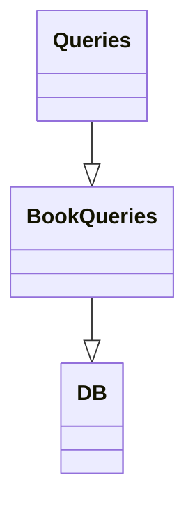

# Golang Web Framework —— Fiber


### 参考

- **文章参考** https://dev.to/koddr/go-fiber-by-examples-how-can-the-fiber-web-framework-be-useful-487a
- **RESTful** https://restfulapi.cn/
- **官方文档** https://docs.gofiber.io/guide


### 特征

- **RESTful** API


### 快速开始

```go
package main

import "github.com/gofiber/fiber/v2"

func main() {
    app := fiber.New()

    app.Get("/", func(c *fiber.Ctx) error {
        return c.SendString("Hello, World 👋!")
    })

    app.Listen(":3000")
}
```


#### 基本路由和端点（route and endpoint）

```
GET：   读取（Read）
POST：  新建（Create）
PUT：   更新（Update）
PATCH： 更新（Update），通常是部分更新
DELETE：删除（Delete）
```

```go
// Get registers a route for GET methods that requests a representation
// of the specified resource. Requests using GET should only retrieve data.
func (app *App) Get(path string, handlers ...Handler) Router {
	return app.Head(path, handlers...).Add(MethodGet, path, handlers...)
}

// Post registers a route for POST methods that is used to submit an entity to the
// specified resource, often causing a change in state or side effects on the server.
func (app *App) Post(path string, handlers ...Handler) Router {
	return app.Add(MethodPost, path, handlers...)
}

// Put registers a route for PUT methods that replaces all current representations
// of the target resource with the request payload.
func (app *App) Put(path string, handlers ...Handler) Router {
	return app.Add(MethodPut, path, handlers...)
}

// Patch registers a route for PATCH methods that is used to apply partial
// modifications to a resource.
func (app *App) Patch(path string, handlers ...Handler) Router {
	return app.Add(MethodPatch, path, handlers...)
}

// Delete registers a route for DELETE methods that deletes the specified resource.
func (app *App) Delete(path string, handlers ...Handler) Router {
	return app.Add(MethodDelete, path, handlers...)
}
```


#### 中间件（middleware）

```go
// Middleware function
app.Use(func(c *fiber.Ctx) error {
    // print current date and time to console
    fmt.Println("Date:", time.Now())

    // passing the request to the next endpoint
    return c.Next()
})
```

##### 暂时不知道是啥但能用的中间件

```go
func (app *App) Get(path string, handlers ...Handler) Router {
	return app.Head(path, handlers...).Add(MethodGet, path, handlers...)
}
```

- 在请求处理中，`...Handler`可以添加多个处理方法，即在返回最终内容前可以使用中间件，`ctx.Next()`承接下一个请求处理；

```go
// Middleware function
app.Use(func(c *fiber.Ctx) error {
  // print current date and time to console
  fmt.Println("Date:", time.Now())

  // passing the request to the next endpoint
  return c.Next()
})
```


#### 模板引擎（templates）

- 模板引擎，常见模板

| Templates  | Links                                      |
| :--------- | :----------------------------------------- |
| Pug        | https://pugjs.org/api/getting-started.html |
| Jade       | https://jade-lang.com/                     |
| Mustache   | https://mustache.github.io/                |
| Handlebars | https://handlebarsjs.com/                  |

```go

import 	"github.com/gofiber/template/html"

// Initialize Pug template engine in ./views folder
// Create a new Fiber instance
app := fiber.New(fiber.Config{
  Views: html.New("./views", ".html"), // set template engine for rendering
})

// Create a new endpoint
app.Get("/", func(c *fiber.Ctx) error {
  // rendering the "index" template with content passing
  return c.Render("index", fiber.Map{
    "Title":   "Hey!",
    "Message": "This is the index template.",
  })
})
```

```html
<!--html template-->
<!DOCTYPE html>
<body>
<h1>{{.Title}}</h1>
<p>{{.Message}}</p>
</body>
</html>
```

- 前后端分离，也使用了`html`模板；


### Fiber应用

#### 默认初始化

- 初始化实例（默认配置）

```go
import "github.com/gofiber/fiber/v2"

func main() {
  // Create a new Fiber instance, called 'app'
  app := fiber.New()
  // ...
}
```


#### 配置

- 使用特殊数据结构的`fiber.Config`来调整细节；

```go
// Create config variable
config := fiber.Config{
  ServerHeader: "My Server", // add custom server header
}
// Create a new Fiber instance with custom config
app := fiber.New(config)
```

```
在Response header里会标明Server的命名：

Access-Control-Allow-Origin: 	*
Content-Length: 				51
Content-Type: 					application/json
Date: 							Mon, 03 May 2021 07:00:39 GMT
Server: 						My Server
Vary: 							Origin
```


##### Prefork

- Type: `bool`, default: `false`.

- Enables use of the `SO_REUSEPORT` socket option. This will spawn multiple **Go** processes listening on the same port. Also, it's called socket sharding. If enabled, the application will need to be run through a shell because prefork mode sets environment variables.

> ☝️ **Note:** When using **Docker**, make sure the application is running with `CMD ./app` or `CMD ["sh", "-c", "/app"]` into project's `Dockerfile`.

##### ServerHeader

- Type: `string`, default: `""` (empty string).

- Enables the Server HTTP header with the given value.

##### StrictRouting

- Type: `bool`, default: `false`.

- When enabled, the Fiber router treats `/foo` and `/foo/` as different routes. This can be useful, if we want to improve the **SEO** (Search Engine Optimization) of the website.（/敏感）

##### CaseSensitive

- Type: `bool`, default: `false`.

- When enabled, the **Fiber** router treats `/Foo` and `/foo` as different routes. （大小写敏感）

##### Immutable ？？？

- Type: `bool`, default: `false`.

- When enabled, all values returned by context methods are immutable. By default, they are valid until you return from the handler.（不可变参数）

##### UnescapePath

- Type: `bool`, default: `false`.

- Converts all encoded characters in the route back before setting the path for the context, so that the routing can also work with URL encoded special characters.（带特殊字符的URL）

##### ETag

- Type: `bool`, default: `false`.

- Enable [ETag](https://developer.mozilla.org/ru/docs/Web/HTTP/Headers/ETag) header generation, since both weak and strong etags are generated using the same hashing method ([CRC-32](https://en.wikipedia.org/wiki/Cyclic_redundancy_check#CRC-32_algorithm)).

- **`ETag`**HTTP 响应头是资源的特定版本的标识符。这可以让缓存更高效，并节省带宽，因为如果内容没有改变，Web 服务器不需要发送完整的响应。而如果内容发生了变化，使用 ETag 有助于防止资源的同时更新相互覆盖（“空中碰撞”）。

  如果给定 URL 中的资源更改，则一定要生成新的 Etag 值。 因此 Etags 类似于指纹，也可能被某些服务器用于跟踪。 比较 etags 能快速确定此资源是否变化，但也可能被跟踪服务器永久存留。

##### BodyLimit

- Type: `int`, default: `4 * 1024 * 1024`.

- Sets the maximum allowed size for a request body. If the size exceeds the configured limit, it sends [HTTP 413 Payload Too Large](https://developer.mozilla.org/ru/docs/Web/HTTP/Status/413) response.（请求内容长度限制，4MB）

##### Concurrency

- Type: `int`, default: `256 * 1024`.

- Maximum number of concurrent connections.（最多同步连接）

##### Views

- `Views` is the interface to provide your own template engine and contains `Load` and `Render` methods.

  The `Load` method is executed by **Fiber** on app initialization to load/parse the templates. And the `Render` method is linked to the `ctx.Render` function that accepts a template name and binding data.

  The **Fiber** team supports [template](https://github.com/gofiber/template) package that provides wrappers for multiple template engines:

  - Standard Go's [html/template engine](https://github.com/gofiber/template/tree/master/html)

  - [Ace](https://github.com/gofiber/template/tree/master/ace)

  - [Amber](https://github.com/gofiber/template/tree/master/amber)

  - DTL or [Django Template Language](https://github.com/gofiber/template/tree/master/django)

  - [Handlebars](https://github.com/gofiber/template/tree/master/handlebars)

  - [Jet](https://github.com/gofiber/template/tree/master/jet)

  - [Mustache](https://github.com/gofiber/template/tree/master/mustache)

  - [Pug](https://github.com/gofiber/template/tree/master/pug)

##### ReadTimeout

- Type: `time.Duration`, default: `nil`.

- The amount of time allowed to read the full request, including the body. Set to `nil` for unlimited timeout.

##### WriteTimeout

- Type: `time.Duration`, default: `nil`.

- The maximum duration before timing out writes of the response. Set to `nil` for unlimited timeout.

##### IdleTimeout

- Type: `time.Duration`, default: `nil`.

- The maximum amount of time to wait for the next request when keep-alive is enabled.

> ☝️ **Note:** If IdleTimeout is zero, the value of ReadTimeout is used.

##### ReadBufferSize

- Type: `int`, default: `4096`.

- Per-connection buffer size for requests' reading. This also limits the maximum header size. Increase this buffer, if your clients send multi-KB RequestURIs and/or multi-KB headers.

##### WriteBufferSize

- Type: `int`, default: `4096`.

- Per-connection buffer size for responses' writing.

##### CompressedFileSuffix

- Type: `string`, default: `".fiber.gz"`.

- Adds a suffix to the original file name and tries saving the resulting compressed file under the new file name.（尝试压缩文件）

##### ProxyHeader

- Type: `string`, default: `""` (empty string).

- This will enable `ctx.IP` to return the value of the given header key. By default, `ctx.IP` will return the Remote IP from the TCP connection.

> ☝️ **Note:** This property can be useful if you are behind a load balancer, e.g. `X-Forwarded-*`.

##### GETOnly

- Type: `bool`, default: `false`.

- Enables to rejects all non-GET requests. This option is useful as anti-DoS protection for servers accepting only GET requests.

> ☝️ **Note:** If `GETOnly` is set to true, the request size is limited by `ReadBufferSize`.

##### ErrorHandler

- Type: `ErrorHandler`, default: `DefaultErrorHandler`.

- `ErrorHandler` is executed, when an error is returned from `fiber.Handler`.

##### DisableKeepalive

- Type: `bool`, default: `false`.

- Disable keep-alive connections. The server will close incoming connections after sending the first response to the client.

##### DisableDefaultDate

- Type: `bool`, default: `false`.

- When set to `true` causes the default date header to be excluded from the response.

##### DisableDefaultContentType

- Type: `bool`, default: `false`.

- When set to true, causes the default `Content-Type` header to be excluded from the Response.

##### DisableHeaderNormalizing

- Type: `bool`, default: `false`.

- By default, all header names are normalized. For example, header `cOnteNT-tYPE` will convert to more readable `Content-Type`.

##### DisableStartupMessage

- Type: `bool`, default: `false`.

- When set to true, it will not print out debug information and startup message, like this:

  


#### 路由技术

任何应用程序（尤其是RESTful API）的核心部分都是将请求路由到适当的端点。对于为任何任务创建路由器，Fiber提供了一组很好的选项。

> ☝️ **Note:** Route paths, combined with a request method, define the endpoints at which requests can be made. Route paths can be **strings** or **string patterns**.

##### 简单路由

- 略

##### 命名路由

- 必填参数

```go
app.Get("/test/:author/books/:title", func(c *fiber.Ctx) error {
    str := fmt.Sprintf("%s, %s", c.Params("author"), c.Params("title"))
    return c.SendString(str)
})
```

- 可选参数

```go
app.Get("/test/:name?/:message?", func(c *fiber.Ctx) error {
    return c.Render("test", fiber.Map{
        "Title":   c.Params("name", "default"),
        "Message": c.Params("message", "OK"),
    })
})
```

- 带贪婪匹配参数
  - `+`号会匹配所有的字符串，哪怕出现了分隔符`/`，但是参数不能为空
  - `*`号会匹配所有的字符串，哪怕出现了分隔符`/`，但是参数可以为空

```go
app.Get("/test/greedy/+", func(c *fiber.Ctx) error {
    return c.SendString(c.Params("+"))
})
// get /test/greedy 👉 cannot get
```

```go
app.Get("/test/greedy/*", func(c *fiber.Ctx) error {
    return c.SendString(c.Params("+"))
})
// get /test/greedy 👉 <empty string>""
```

- 复杂路由

```go
app.Get("/flights/:from-:to/time::at", func(c *fiber.Ctx) error {
  str := fmt.Sprintf("%s-%s at %s", c.Params("from"), c.Params("to"), c.Params("at"))
  return c.SendString(str)
})
```

- 正则化路由
  - 不支持，很傻逼，会变慢

##### 路径字符串限制

- 路径中出现了一些特殊字符，例如上文中的`+` `*` `:` `?`等，需要通过转义字符`\\`来标明

```go
app.Get("/boats/:from-:to/time\\:at", func(c *fiber.Ctx) error {
    str := fmt.Sprintf("%s-%s at %s", c.Params("from"), c.Params("to"), c.Params("at"))
    return c.SendString(str)
})
```


#### 内置方法

##### Static

- Use the `Static` method to serve static files such as images, CSS, and JavaScript. By default, it will serve `index.html` files in response to a request on a directory.

- The following code serves all files and folders in the directory named `./public` (in the root folder of our project).
- 对单页面的应用十分友好。

```go
app.Static("/", "./public")
```

```
http://localhost:3000/page.html
http://localhost:3000/js/script.js
http://localhost:3000/css/style.css
```

- `fiber.Static`配置类

```go
// Create a new config for Static method
config := fiber.Static{
  Compress:      true,
  ByteRange:     true,
  Browse:        true,
  Index:         "page.html"
  CacheDuration: 60 * time.Second,
  MaxAge:        3600,
  Next:          nil
}

// Serve files from './public' directory with config
app.Static("/", "./public", config)
```

###### Compress

- Type: `bool`, default: `false`.

- When set to true, the server tries minimizing CPU usage by caching compressed files.

> ☝️ **Note:** This works differently than the [compression middleware](https://github.com/gofiber/compression), which is supported by the **Fiber** team.

###### ByteRange

- Type: `bool`, default: `false`.

- When set to `true`, enables byte range requests.

###### Browse

- Type: `bool`, default: `false`.

- When set to `true`, enables directory browsing.

###### Index

- Type: `string`, default: `"index.html"`.

- The name of the index file for serving a directory.

###### CacheDuration

- Type: `time.Duration`, default: `10 * time.Second`.

- Expiration duration for inactive file handlers. Use a negative `time.Duration` to disable it.

###### MaxAge

- Type: `int`, default: `0`.

- The value for the `Cache-Control` HTTP header that is set on the file response. `MaxAge` is defined in seconds.

###### Next

- Type: `func(c *Ctx) bool`, default: `nil`.

- Next defines a function to skip this middleware, when `true` is returned.

> ☝️ **Note:** The setting can be useful when it is necessary to serve a folder with files, as a result of some external state changes or user requests in the application.


##### Mount

- Use the `Mount` method for mount one Fiber instance to another by creating the `*Mount` struct.

```go
// ./go/mount.go

package main

import "github.com/gofiber/fiber/v2"

func main() {
  // Create the first Fiber instance
  micro := fiber.New()

  // Create a new route for the first instance
  micro.Get("/doe", func(c *fiber.Ctx) error {
    return c.SendStatus(fiber.StatusOK) // send HTTP 200 OK
  })

  // Create the second Fiber instance
  app := fiber.New()

  // Create a new route for the second instance,
  // with included first instance's route
  app.Mount("/john", micro)

  // Start server on port 3000
  app.Listen(":3000")
}
```

- The `/john/doe` route of this **Fiber** application will now give a status (HTTP 200) OK.

##### Group

- Use `Group` method for grouping routes by creating the `*Group` struct.

```go
func main() {
  // Create a new Fiber instance
  app := fiber.New()

  // Create a new route group '/api'
  api := app.Group("/api", handler)

  // Create a new route for API v1
  v1 := api.Group("/v1", handler)
  v1.Get("/list", handler)

  // Create a new route for API v1
  v2 := api.Group("/v2", handler)
  v2.Get("/list", handler)

  // Start server on port 3000
  app.Listen(":3000")
}
```

##### Server

- Use `Server` method for returns the underlying [fasthttp](https://pkg.go.dev/github.com/valyala/fasthttp#Server) server.（又是老熟人valyala的杰作）

```go
// Set the fasthttp option 'MaxConnsPerIP' to '1'
app.Server().MaxConnsPerIP = 1
```

##### Stack

- Use `Stack` method for return the original router stack.

```go
func main() {
  // Create a new Fiber instance
  app := fiber.New()

  // Create new routes
  app.Get("/john/:age", handler)
  app.Post("/register", handler)

  // Print the router stack in JSON format
  data, _ := json.MarshalIndent(app.Stack(), "", "  ")
  fmt.Println(string(data))

  // Start server on port 3000
  app.Listen(":3000")
}
```

##### Config

- Use `Config` method for return the app config as value (read-only).

```go
// Print ServerHeader value
fmt.Println(app.Config().ServerHeader)
```

##### Listen

- Use `Listen` method for serve HTTP requests from the given address.

```go
// Listen on port 8080 
app.Listen(":8080")

// Listen on the custom host and port
app.Listen("127.0.0.2:9090")
```

##### ListenTLS

- User `ListenTLS` method for serve HTTPS (*secure HTTP*) requests from the given address using `certFile` and `keyFile` paths to TLS certificate and key.

```go
// Listen on port 443 with TLS cert and key
app.ListenTLS(":443", "./cert.pem", "./cert.key")
```

##### Listener

- Use `Listener` method for pass custom [net.Listener](https://golang.org/pkg/net/#Listener). This method can be used to enable TLS/HTTPS with a custom [tls.Config](https://golang.org/pkg/crypto/tls/#Config).

```go
// Create a new net.Listener TCP instance on port 3000
ln, _ := net.Listen("tcp", ":3000")

// Set TLS key pair (certificate and key)
certs, _ := tls.LoadX509KeyPair("./server.crt", "./server.key")

// Configure a new TLS listener with params
lr := tls.NewListener(
  ln,
  &tls.Config{
    Certificates: []tls.Certificate{
      certs,
    },
  },
)

// Start server with TLS listener
app.Listener(lr)
```

##### NewError

- Use `NewError` method for create a new HTTP error instance with an optional message.

```go
// Create a custom error with HTTP code 782
app.Get("/error", func(c *fiber.Ctx) error {
  return fiber.NewError(782, "Custom error message")
})
// IsChild
// Use IsChild method for determine, if the current process is a result of Prefork.
// Create a new Fiber instance with config
app := fiber.New(fiber.Config{
  Prefork: true, // enable Prefork
})

// Cheking current process
if fiber.IsChild() {
  fmt.Println("I'm a child process")
} else {
  fmt.Println("I'm the parent process")
}

// ...
```


#### 上下文方法

##### BodyParser

- Binds the request body to a struct. `BodyParser` supports decoding query parameters and the following content types based on the `Content-Type` header:
  - application/json
  - application/xml
  - application/x-www-form-urlencoded
  - multipart/form-data

```go
package main

import (
  "fmt"

  "github.com/gofiber/fiber/v2"
)

// Define the Person struct
type Person struct {
  Name  string `json:"name" xml:"name" form:"name"`
  Email string `json:"email" xml:"email" form:"email"`
}

func main() {
  // Create a new Fiber instance
  app := fiber.New()

  // Create a new route with POST method
  app.Post("/create", func(c *fiber.Ctx) error {
    // Define a new Person struct
    person := new(Person)

    // Binds the request body to the Person struct
    if err := c.BodyParser(person); err != nil {
      return err
    }

    // Print data from the Person struct
    fmt.Println(person.Name, person.Email)

    return nil
  })

  // Start server on port 3000
  app.Listen(":3000")
}
```

#####  JSON

- Converts any interface or string to JSON using the [segmentio/encoding](https://github.com/segmentio/encoding) package. Also, the JSON method sets the content header to `application/json`.

```go
package main

import "github.com/gofiber/fiber/v2"

func main() {
  // Create a new Fiber instance
  app := fiber.New()

  // Create a new route with GET method
  app.Get("/json", func(c *fiber.Ctx) error {
    // Return response in JSON format
    return c.JSON(fiber.Map{
      "name": "John",
      "age":  33,
    })
  })

  // Start server on port 3000
  app.Listen(":3000")
}
```

##### Params

- The `Params` method can be used to get the route parameters. We can pass an optional default value that will be returned, if the param key does not exist.

```go
package main

import (
  "fmt"

  "github.com/gofiber/fiber/v2"
)

func main() {
  // Create a new Fiber instance
  app := fiber.New()

  // Create a new route with named params
  app.Get("/user/:name", func(c *fiber.Ctx) error {
    // Print name from params
    fmt.Println(c.Params("name"))

    return nil
  })

  // Create a new route with optional greedy params
  app.Get("/user/*", func(c *fiber.Ctx) error {
    // Print all data, given from '*' param
    fmt.Println(c.Params("*"))

    return nil
  })

  // Start server on port 3000
  app.Listen(":3000")
}
```

##### Query

- `Query` method is an object containing a property for each query string parameter in the route. We can pass an optional default value that will be returned, if the query key does not exist.

```go
package main

import (
  "fmt"

  "github.com/gofiber/fiber/v2"
)

func main() {
  // Create a new Fiber instance
  app := fiber.New()

  // Create a new route with query params
  // send 127.0.0.1:3000/user?name=test
  app.Get("/user", func(c *fiber.Ctx) error {
    // Print name from query param
    // print test
    fmt.Println(c.Query("name"))
    return nil
  })

  // Start server on port 3000
  app.Listen(":3000")
}
```

##### Set

The `Set` method sets the response’s HTTP header field to the specified key and value.

```go
// Create a new route with text/plain content type
app.Get("/text", func(c *fiber.Ctx) error {
  // Set a new Content-Type for this route
  c.Set("Content-Type", "text/plain")

  // ...
})
```

##### Status

- The `Status` and `SendStatus` methods set the HTTP status code for the response and the correct status message in the body, if the response body is empty. But there is a small difference in the options for using these methods.

- The `Status` method is a chainable. This means that it can be used in conjunction with other methods, like this:

```go
// Create a new route with HTTP status
app.Get("/bad-request", func(c *fiber.Ctx) error {
  // Return status with a custom message
  return c.Status(fiber.StatusBadRequest).SendString("Bad Request")
})
```

- And method `SendStatus` should be used only when we don't need anything except returning HTTP code. For example:

```go
// Create a new route with HTTP status
app.Get("/forbidden", func(c *fiber.Ctx) error {
  // Return only status
  return c.SendStatus(fiber.StatusForbidden)
})
```

> ☝️ **Note:** We can view all supported Fiber helpers for HTTP statuses [here](https://github.com/gofiber/fiber/blob/v2.17.0/helpers.go#L448).


### Fiber测试

- We will use both the features built into the language and the framework for testing and some third-party tools. For example, the very popular **Go** testing package [Testify](https://github.com/stretchr/testify). Typically, each test function contains:

  - A structure that describes the incoming conditions.
  - A collection of test cases, according to the structure.
  - A test instance of an application with some simple state.
  - A loop with test logic inside, to do an enumeration of test cases.

- Now, let's look at an example of such a test function on a very simple example: we're going to check one of the application paths for what HTTP methods it gives back:

  - If it gives a status of HTTP 200 OK, then this test case will be successful (*PASS*). In the case, if it will give a status of HTTP 404 Not Found, then it will fail. But we will be ready for this error.

  - Such a test case is needed to test our target function not only for a positive scenario, but also for a negative (*FAIL*) scenario, which may also occur as a result of using the application in the future.

```go
package routes

import (
  "net/http/httptest"
  "testing"

  "github.com/gofiber/fiber/v2"
  "github.com/stretchr/testify/assert" // add Testify package
)

func TestHelloRoute(t *testing.T) {
  // Define a structure for specifying input and output data
  // of a single test case
  tests := []struct {
    description  string // description of the test case
    route        string // route path to test
    expectedCode int    // expected HTTP status code
  }{
    // First test case
    {
      description:  "get HTTP status 200",
      route:        "/hello",
      expectedCode: 200,
    },
    // Second test case
    {
      description:  "get HTTP status 404, when route is not exists",
      route:        "/not-found",
      expectedCode: 404,
    },
  }

  // Define Fiber app.
  app := fiber.New()

  // Create route with GET method for test
  app.Get("/hello", func(c *fiber.Ctx) error {
    // Return simple string as response
    return c.SendString("Hello, World!")
  })

  // Iterate through test single test cases
  for _, test := range tests {
    // Create a new http request with the route from the test case
    req := httptest.NewRequest("GET", test.route, nil)

    // Perform the request plain with the app,
    // the second argument is a request latency
    // (set to -1 for no latency)
    resp, _ := app.Test(req, 1)

    // Verify, if the status code is as expected
    assert.Equalf(t, test.expectedCode, resp.StatusCode, test.description)
  }
}
```


### 中间件

- Security middlewares in the Fiber web framework perform the task of protecting your application from various types of hacker attacks. This is **critical** for projects that work in production with real users.

> ☝️ **Note:** However, even if you don't plan to put your project into production now, knowing about such middleware is still a useful skill.

#### Helmet middleware

- Helmet middleware helps to secure our Fiber application by setting various HTTP headers:

  - [XSS Protection](https://developer.mozilla.org/en-US/docs/Web/HTTP/Headers/X-XSS-Protection)

  - [Content-Type No Sniff](https://developer.mozilla.org/en-US/docs/Web/HTTP/Headers/X-Content-Type-Options)

  - [X-Frame Options](https://developer.mozilla.org/en-US/docs/Web/HTTP/Headers/X-Frame-Options)

  - [HSTS](https://developer.mozilla.org/en-US/docs/Web/HTTP/Headers/Strict-Transport-Security) Max Age

  - [CSP Report Only](https://developer.mozilla.org/en-US/docs/Web/HTTP/Headers/Content-Security-Policy-Report-Only)

  - Exclude Subdomains & Preload Enabled

  - Content Security & Referrer Policies

```go
import "github.com/gofiber/helmet/v2"

// ...

// Use middlewares for each route
app.Use(
  helmet.New(), // add Helmet middleware
)
```


#### CSRF middleware

- CSRF middleware for Fiber that provides [Cross-Site request forgery](https://en.wikipedia.org/wiki/Cross-site_request_forgery) protection by passing a CSRF token via cookies.

- This cookie value will be used to compare against the client CSRF token in the POST requests. When the CSRF token is invalid, this middleware will delete the `csrf_` cookie and return the `fiber.ErrForbidden` error.

```go
import "github.com/gofiber/fiber/v2/middleware/crsf"

// ...

// Use middlewares for each route
app.Use(
  csrf.New(), // add CSRF middleware
)
```

We can retrieve the CSRF token with `c.Locals(key)`, where key is the option name in the custom middleware configuration.

The CSRF middleware custom config may look like this:

```go
// Set config for CSRF middleware
csrfConfig := csrf.Config{
  KeyLookup:      "header:X-Csrf-Token", // string in the form of '<source>:<key>' that is used to extract token from the request
  CookieName:     "my_csrf_",            // name of the session cookie
  CookieSameSite: "Strict",              // indicates if CSRF cookie is requested by SameSite
  Expiration:     3 * time.Hour,         // expiration is the duration before CSRF token will expire
  KeyGenerator:   utils.UUID,            // creates a new CSRF token
}

// Use middlewares for each route
app.Use(
  csrf.New(csrfConfig), // add CSRF middleware with config
)
```


#### Limiter middleware

- Limiter middleware for Fiber used to limit repeated requests to public APIs or endpoints such as password reset etc. Moreover, useful for API clients, web crawling, or other tasks that need to be throttled.

```go
// ./go/security_middlewares.go

import "github.com/gofiber/fiber/v2/middleware/limiter"

// ...

// Use middlewares for each route
app.Use(
  limiter.New(), // add Limiter middleware
)
```

- Most of the time, you will probably be using this middleware along with your configuration. It's easy to add a config like this:

```go
// Set config for Limiter middleware
limiterConfig := limiter.Config{
  Next: func(c *fiber.Ctx) bool {
    return c.IP() == "127.0.0.1" // limit will apply to this IP
  },
  Max:        20,                // max count of connections
  Expiration: 30 * time.Second,  // expiration time of the limit
  Storage:    myCustomStorage{}, // used to store the state of the middleware
  KeyGenerator: func(c *fiber.Ctx) string {
    return c.Get("x-forwarded-for") // allows you to generate custom keys
  },
  LimitReached: func(c *fiber.Ctx) error {
    return c.SendFile("./too-fast-page.html") // called when a request hits the limit
  },
}

// Use middlewares for each route
app.Use(
  limiter.New(limiterConfig), // add Limiter middleware with config
)
```


#### Explore Logging middleware

- Like any other framework, Fiber also has its built-in middleware for logging HTTP request/response details and displaying results in the console.

- Let's look at an example of what this might look like:

```go
// ./go/logger_middlewares.go

import "github.com/gofiber/fiber/v2/middleware/logger"

// ...

// Use middlewares for each route
app.Use(
  logger.New(), // add Logger middleware
)
```

- And the console output looks like this:

```
08:17:42 | 404 |   85ms |  127.0.0.1 | GET   | /v1/user/123 
08:18:07 | 204 |  145ms |  127.0.0.1 | POST  | /v1/webhook/postmark 
08:19:53 | 201 |  138ms |  127.0.0.1 | PUT   | /v1/article/create 
```

- Yes, Logger middleware connects in the same way as the middleware reviewed earlier. Furthermore, we can save all logs to a file, not console output, like this:

```go
// Define file to logs
file, err := os.OpenFile("./my_logs.log", os.O_RDWR|os.O_CREATE|os.O_APPEND, 0666)
if err != nil {
  log.Fatalf("error opening file: %v", err)
}
defer file.Close()

// Set config for logger
loggerConfig := logger.Config{
  Output: file, // add file to save output
}

// Use middlewares for each route
app.Use(
  logger.New(loggerConfig), // add Logger middleware with config
)
```


# 案例


### 参考

- https://dev.to/koddr/build-a-restful-api-on-go-fiber-postgresql-jwt-and-swagger-docs-in-isolated-docker-containers-475j


### 目标

> Let's create a REST API for an online library application in which we create new books, view them, and update & delete their information. But some methods will require us to authorize through providing a valid JWT access token. I'll store all the information about the books, as usual, in my beloved PostgreSQL.


### 提供的API接口

- **Public**

  | Type |        Route        |        Description        |
  | :--: | :-----------------: | :-----------------------: |
  | GET  |   `/api/v1/books`   |       get all books       |
  | GET  | `/api/v1/book/{id}` |  get a book by given id   |
  | GET  | `/api/v1/token/new` | create a new access token |

- **Private** (JWT protected)

  |  Type  |     Route      |       Description       |
  | :----: | :------------: | :---------------------: |
  |  POST  | `/api/v1/book` |    create a new book    |
  | PATCH  | `/api/v1/book` | update an existing book |
  | DELETE | `/api/v1/book` | delete an existing book |


### 文件组织架构

##### 业务逻辑文件夹

- `./app`文件夹里的文件并不关心底层逻辑，比如使用了什么数据库驱动，或者采用了什么缓存策略，以及更多第三方的内容。
  - `./aoo/controllers`在路由里使用的函数控制器？（直译的，就是controller层）
  - `./app/models`描述业务逻辑的模型和方法。
  - `./app/queries`描述模型使用的数据库查询。

##### API文档

- `./docs`存放Swagger配置文件的文件夹，用于自动生成API文档。

##### 具有项目特定功能的文件夹

- `./pkg` 文件夹包含所有为你的业务用例量身定制的项目特定代码。
  - `./pkg/configs`放配置文件
  - `./pkg/middleware` 放增加的中间件
  - `./pkg/routes` 描述使用的路由
  - `./pkg/utils` 放服务生成器和服务启动器等实用函数。

##### 具有平台级逻辑的文件夹

- `./platform` 文件夹包含所有平台级的逻辑，这些逻辑将构建实际的项目，比如设置数据库或缓存服务器实例和存储迁移。

  - `./platform/database` 具有数据库设置功能的文件夹

  - `./platform/migrations` 存放迁移文件的文件夹


### 数据库部分

- 不同于文章，我选用了`clickhouse`作为数据库，这不是一个合适的选择，因为`clickhouse`更多作为OLTP数据库存在，此处系我偷懒......
- 同理，我把属性换成了`tags`字段。
- 路径是：`./platform/migrate`

1. 创建一个`init_tables.up.sql`和一个`init_tables.down.sql`用作数据库初始化挂载和取消。

```sql
CREATE TABLE default.books
(
    `id` UUID,
    `createTime` DateTime DEFAULT now(),
    `updateTime` DateTime DEFAULT now(),
    `title` String,
    `author` String,
    `status` Int32,
    `tags` Array(String)
)
ENGINE = MergeTree
ORDER BY id
SETTINGS index_granularity = 8192;
```

```sql
DROP TABLE IF EXISTS books;
```

2. 使用`golang-migrate/migrate`

#### 使用`migrate`

- repo路径：https://github.com/golang-migrate/migrate

- 使用`scoop`安装：https://github.com/GiannisChen/migrate/tree/master/cmd/migrate & https://scoop.sh/

  ```shell
  // install scoop
  $ Set-ExecutionPolicy RemoteSigned -Scope CurrentUser # Optional: Needed to run a remote script the first time
  $ irm get.scoop.sh | iex
  
  // install migrate
  $ scoop install migrate
  ```

- 然后可以使用`migrate`来做数据库的`up/down/forward/backward`

  ```shell
  $ migrate -help
  Usage: migrate OPTIONS COMMAND [arg...]
         migrate [ -version | -help ]
  
  Options:
    -source          Location of the migrations (driver://url)
    -path            Shorthand for -source=file://path
    -database        Run migrations against this database (driver://url)
    -prefetch N      Number of migrations to load in advance before executing (default 10)
    -lock-timeout N  Allow N seconds to acquire database lock (default 15)
    -verbose         Print verbose logging
    -version         Print version
    -help            Print usage
  
  Commands:
    create [-ext E] [-dir D] [-seq] [-digits N] [-format] NAME
                 Create a set of timestamped up/down migrations titled NAME, in directory D with extension E.
                 Use -seq option to generate sequential up/down migrations with N digits.
                 Use -format option to specify a Go time format string.
    goto V       Migrate to version V
    up [N]       Apply all or N up migrations
    down [N]     Apply all or N down migrations
    drop         Drop everything inside database
    force V      Set version V but don't run migration (ignores dirty state)
    version      Print current migration version
  ```

- 一般使用的语法：（我还没成功，但是Windows，so u know...）

  ```shell
  $ migrate -path ./platform/migrations -database clickhouse://192.168.47.128:9000?username=default1&password=12345678&database=default&x-multi-statement=true up 1 init_tables
  ```


#### 模型层

- `./app/models/book.go`

```go
type book struct {
	ID         uuid.UUID `json:"id"`	// > github.com/google/uuid
	CreateTime time.Time `json:"create_time"`
	UpdateTime time.Time `json:"update_time"`
	Title      string    `json:"title"`
	Author     string    `json:"author"`
	Status     int       `json:"status"`
	Tags       []string  `json:"tags"`
}
```

> 👍 I recommend to use the [google/uuid](https://github.com/google/uuid) package to create unique IDs, because this is a more versatile way to protect your application against common number brute force attacks. *Especially if your REST API will have public methods without authorization and request limit*.


#### UUID验证器

- 在给业务逻辑处理传参数的时候，需要验证参数的正确性，用户的输入不可信；

- `./app/utils/validator.go`

```go
package utils

import (
    "github.com/go-playground/validator/v10"
    "github.com/google/uuid"
)

// NewValidator func for create a new validator for model fields.
func NewValidator() *validator.Validate {
    // Create a new validator for a Book model.
    validate := validator.New()

    // Custom validation for uuid.UUID fields.
    _ = validate.RegisterValidation("uuid", func(fl validator.FieldLevel) bool {
        field := fl.Field().String()
        if _, err := uuid.Parse(field); err != nil {
            return true
        }
        return false
    })

    return validate
}

// ValidatorErrors func for show validation errors for each invalid fields.
func ValidatorErrors(err error) map[string]string {
    // Define fields map.
    fields := map[string]string{}

    // Make error message for each invalid field.
    for _, err := range err.(validator.ValidationErrors) {
        fields[err.Field()] = err.Error()
    }

    return fields
}
```


#### 数据库连接

- 创建连接方式，为了可拓展性显然给包了两层，一层`*sql.DB`，一层`*sqlx.DB`；
- `./platform/database/clickhouse.go`

```go
package database

import (
	"fmt"
	"github.com/ClickHouse/clickhouse-go/v2"
	"github.com/jmoiron/sqlx"
	"time"
)

func ClickHouseConnection() (*sqlx.DB, error) {
	db := sqlx.NewDb(clickhouse.OpenDB(&clickhouse.Options{
		Addr: []string{"192.168.47.128:9000"},
		Auth: clickhouse.Auth{
			Database: "default",
			Username: "default1",
			Password: "12345678",
		},
		Settings: clickhouse.Settings{
			"max_execution_time": 60,
		},
		DialTimeout: 5 * time.Second,
		Compression: &clickhouse.Compression{
			Method: clickhouse.CompressionLZ4,
		},
	}), "clickhouse")

	// Set database connection settings.
	db.SetMaxOpenConns(100)
	db.SetMaxIdleConns(10)
	db.SetConnMaxLifetime(time.Duration(60))

	if db.DB == nil {
		return nil, fmt.Errorf("error, not connected to database")
	}
	// Try to ping database.
	if err := db.Ping(); err != nil {
		defer db.Close() // close database connection
		return nil, fmt.Errorf("error, not sent ping to database, %w", err)
	}

	return db, nil
}
```

- `./platform/database/open_db_connection.go`

```go
package database

import "github.com/GiannisChen/AwesomeGoFiberDemo/app/queries"

type Queries struct {
	*queries.BookQueries
}

func OpenDBConnection() (*Queries, error) {
	// Define a new ClickHouse connection.
	db, err := ClickHouseConnection()
	if err != nil {
		return nil, err
	}

	return &Queries{
		// Set queries from models:
		BookQueries: &queries.BookQueries{DB: db}, // from Book model
	}, nil
}
```




#### 创建查询语句

##### 数据库查询

- 显然使用了驱动和查询分离的策略；

```go
type BookQueries struct {
	*sqlx.DB	// > github.com/jmorion/sqlx
}

func (q *BookQueries) GetBooks() ([]models.Book, error) {
	var books []models.Book
	if err := q.Get(&books, `select * from books`); err != nil {
		return books, err
	}
	return books, nil
}

func (q *BookQueries) GetBook(id uuid.UUID) (models.Book, error) {
	var book models.Book
	if err := q.Get(&book, `select * from books prewhere id = $1`, id); err != nil {
		return book, err
	}
	return book, nil
}

func (q *BookQueries) CreateBook(b *models.Book) error {
	if _, err := q.Exec(`insert into books values ($1,$2,$3,$4,$5,$6,$7)`,
		b.ID, b.CreateTime, b.UpdateTime, b.Title, b.Author, b.Status, b.Tags); err != nil {
		return err
	}
	return nil
}

func (q *BookQueries) UpdateBook(id uuid.UUID, b *models.Book) error {
	if _, err := q.Exec(`alter table books update updateTime=$2, title=$3, author=$4, status=$5, tags=$6 where id = $1`,
		id, b.UpdateTime, b.Title, b.Author, b.Status, b.Tags); err != nil {
		return err
	}
	return nil
}

func (q *BookQueries) DeleteBook(id uuid.UUID) error {
	if _, err := q.Exec(`alter table books where id=$1`, id); err != nil {
		return err
	}
	return nil
}
```


### 工具方法

#### JWT

- For generate a valid JWT
- `./utils/jwt_generator.go` & `./utils/jwt_parser.go`

```go
package utils

import (
	"github.com/golang-jwt/jwt"
	"time"
)

func GenerateNewAccessToken() (string, error) {
	// set secret key
	secret := "secret"
	// set expires minutes count for secret key
	minutesCount := 5
	// create a new claims
	claims := jwt.MapClaims{}
	// set public claims
	claims["exp"] = time.Now().Add(time.Minute * time.Duration(minutesCount))
	// create a new JWT access token with claims
	token := jwt.NewWithClaims(jwt.SigningMethodHS256, claims)
	// generate token
	if t, err := token.SignedString([]byte(secret)); err != nil {
		return "", err
	} else {
		return t, nil
	}
}

```

```go
package utils

import (
	"github.com/gofiber/fiber"
	"github.com/golang-jwt/jwt"
	"strings"
)

type TokenMetaData struct {
	Expires int64
}

func ExtractTokenMetaData(c *fiber.Ctx) (*TokenMetaData, error) {
	token, err := verifyToken(c)
	if err != nil {
		return nil, err
	}
	// setting and checking token and credentials
	if claims, ok := token.Claims.(jwt.MapClaims); ok && token.Valid {
		expires := int64(claims["exp"].(float64))
		return &TokenMetaData{Expires: expires}, nil
	} else {
		return nil, err
	}
}

func verifyToken(c *fiber.Ctx) (*jwt.Token, error) {
	tokenString := extractToken(c)
	if token, err := jwt.Parse(tokenString, jwtKeyFunc); err != nil {
		return nil, err
	} else {
		return token, nil
	}
}

func jwtKeyFunc(_ *jwt.Token) (interface{}, error) {
	return []byte("secret"), nil
}

func extractToken(c *fiber.Ctx) string {
	bearToken := c.Get("Authorization")
	// normally Authorization HTTP header
	onlyToken := strings.Split(bearToken, " ")
	if len(onlyToken) == 2 {
		return onlyToken[1]
	}
	return ""
}

```


### controller层

#### GET

- The principle of the `GET` methods:

  - Make request to the API endpoint;

  - Make a connection to the database (or an error);

  - Make a query to get record(s) from the table `books` (or an error);

  - Return the status `200` and JSON with a founded book(s);

```go
package controllers

import (
	"github.com/GiannisChen/AwesomeGoFiberDemo/platform/database"
	"github.com/gofiber/fiber/v2"
	"github.com/google/uuid"
)

func GetBooks(c *fiber.Ctx) error {
	db, err := database.OpenDBConnection()
	if err != nil {
		return c.Status(fiber.StatusInternalServerError).JSON(fiber.Map{
			"error": true,
			"msg":   err.Error(),
		})
	}

	// Get all books.
	if books, err := db.GetBooks(); err != nil {
		return c.Status(fiber.StatusNotFound).JSON(fiber.Map{
			"error": true,
			"msg":   "books were not found",
			"count": 0,
			"books": nil,
		})
	} else {
		return c.JSON(fiber.Map{
			"error": false,
			"msg":   nil,
			"count": len(books),
			"books": books,
		})
	}
}

func GetBook(c *fiber.Ctx) error {
	// Catch book ID from URL
	id, err := uuid.Parse(c.Params("id"))
	if err != nil {
		return c.Status(fiber.StatusInternalServerError).JSON(fiber.Map{
			"error": true,
			"msg":   err.Error(),
		})
	}

	db, err := database.OpenDBConnection()
	if err != nil {
		return c.Status(fiber.StatusInternalServerError).JSON(fiber.Map{
			"error": true,
			"msg":   err.Error(),
		})
	}

	if book, err := db.GetBook(id); err != nil {
		// Return, if book not found.
		return c.Status(fiber.StatusNotFound).JSON(fiber.Map{
			"error": true,
			"msg":   "book with the given ID is not found",
			"book":  nil,
		})
	} else {
		return c.JSON(fiber.Map{
			"error": false,
			"msg":   nil,
			"book":  book,
		})
	}
}
```

#### POST

- The principle of the `POST` methods:

  - Make a request to the API endpoint;

  - Check, if request `Header` has a valid JWT;

  - Check, if expire date from JWT greather than now (or an error);

  - Parse Body of request and bind fields to the Book struct (or an error);

  - Make a connection to the database (or an error);

  - Validate struct fields with a new content from Body (or an error);

  - Make a query to create a new record in the table `books` (or an error);

  - Return the status `200` and JSON with a new book;

```go
func Create(c *fiber.Ctx) error {
	now := time.Now().Unix()
	// get claims from JWT
	claims, err := token.ExtractTokenMetaData(c)
	if err != nil {
		// return status 500 and JWT parse error
		return c.Status(fiber.StatusInternalServerError).JSON(fiber.Map{
			"error": true,
			"msg":   err.Error(),
		})
	}
	// set expiration time from JWT data of current book
	expires := claims.Expires
	// checking, if now time greater than expiration from JWT
	if now > expires {
		return c.Status(fiber.StatusUnauthorized).JSON(fiber.Map{
			"error": true,
			"msg":   "unauthorized, check expiration time of your token",
		})
	}

	book := models.Book{}
	// check, if received JSON data is valid
	if err := c.BodyParser(&book); err != nil {
		// return status 400 and error message.
		return c.Status(fiber.StatusBadRequest).JSON(fiber.Map{
			"error": true,
			"msg":   err.Error(),
		})
	}

	db, err := database.OpenDBConnection()
	if err != nil {
		// return status 500 and database connection error.
		return c.Status(fiber.StatusInternalServerError).JSON(fiber.Map{
			"error": true,
			"msg":   err.Error(),
		})
	}

	// create a new validator for a Book model
	validate := utils.NewValidator()
	// set initialized default data for book
	book.ID = uuid.New()
	book.CreateTime = time.Now()
	book.Status = 1

	// validate book fields
	if err := validate.Struct(book); err != nil {
		// return, if some fields are not valid.
		return c.Status(fiber.StatusBadRequest).JSON(fiber.Map{
			"error": true,
			"msg":   utils.ValidatorErrors(err),
		})
	}

	// create book by given id
	if err := db.CreateBook(&book); err != nil {
		// Return status 500 and error message.
		return c.Status(fiber.StatusInternalServerError).JSON(fiber.Map{
			"error": true,
			"msg":   err.Error(),
		})
	} else {
		// return status 200 OK.
		return c.JSON(fiber.Map{
			"error": false,
			"msg":   nil,
			"book":  book,
		})
	}
}

```

#### PUT

- The principle of the `PUT` methods:

  - Make a request to the API endpoint;

  - Check, if request `Header` has a valid JWT;

  - Check, if expire date from JWT greather than now (or an error);

  - Parse Body of request and bind fields to the Book struct (or an error);

  - Make a connection to the database (or an error);

  - Validate struct fields with a new content from Body (or an error);

  - Check, if book with this ID is exists (or an error);

  - Make a query to update this record in the table `books` (or an error);

  - Return the status `201` without content;

```go
func UpdateBook(c *fiber.Ctx) error {
	now := time.Now().Unix()
	// get claims from JWT
	claims, err := token.ExtractTokenMetaData(c)
	if err != nil {
		// return status 500 and JWT parse error
		return c.Status(fiber.StatusInternalServerError).JSON(fiber.Map{
			"error": true,
			"msg":   err.Error(),
		})
	}
	// set expiration time from JWT data of current book
	expires := claims.Expires
	// checking, if now time greater than expiration from JWT
	if now > expires {
		return c.Status(fiber.StatusUnauthorized).JSON(fiber.Map{
			"error": true,
			"msg":   "unauthorized, check expiration time of your token",
		})
	}

	book := models.Book{}
	// check, if received JSON data is valid
	if err := c.BodyParser(&book); err != nil {
		// return status 400 and error message.
		return c.Status(fiber.StatusBadRequest).JSON(fiber.Map{
			"error": true,
			"msg":   err.Error(),
		})
	}

	db, err := database.OpenDBConnection()
	if err != nil {
		// return status 500 and database connection error.
		return c.Status(fiber.StatusInternalServerError).JSON(fiber.Map{
			"error": true,
			"msg":   err.Error(),
		})
	}

	// checking, if book with given ID is exists
	foundedBook, err := db.GetBook(book.ID)
	if err != nil {
		// return status 404 and book not found error
		return c.Status(fiber.StatusNotFound).JSON(fiber.Map{
			"error": true,
			"msg":   "book with this ID not found",
		})
	}

	// create a new validator for a Book model
	validate := utils.NewValidator()

	book.UpdateTime = time.Now()

	// validate book fields
	if err := validate.Struct(book); err != nil {
		// return, if some fields are not valid.
		return c.Status(fiber.StatusBadRequest).JSON(fiber.Map{
			"error": true,
			"msg":   utils.ValidatorErrors(err),
		})
	}

	// update book by given id
	if err := db.UpdateBook(foundedBook.ID, &book); err != nil {
		// Return status 500 and error message.
		return c.Status(fiber.StatusInternalServerError).JSON(fiber.Map{
			"error": true,
			"msg":   err.Error(),
		})
	} else {
		// return status 200 OK.
		//return c.SendStatus(fiber.StatusCreated)
		return c.SendStatus(fiber.StatusCreated)
	}
}

```

#### DELETE

- The principle of the `DELETE` methods:

  - Make a request to the API endpoint;

  - Check, if request `Header` has a valid JWT;

  - Check, if expire date from JWT greather than now (or an error);

  - Parse Body of request and bind fields to the Book struct (or an error);

  - Make a connection to the database (or an error);

  - Validate struct fields with a new content from Body (or an error);

  - Check, if book with this ID is exists (or an error);

  - Make a query to delete this record from the table `books` (or an error);

  - Return the status `204` without content;

```go
func DeleteBook(c *fiber.Ctx) error {
	now := time.Now().Unix()
	// get claims from JWT
	claims, err := token.ExtractTokenMetaData(c)
	if err != nil {
		// return status 500 and JWT parse error
		return c.Status(fiber.StatusInternalServerError).JSON(fiber.Map{
			"error": true,
			"msg":   err.Error(),
		})
	}
	// set expiration time from JWT data of current book
	expires := claims.Expires
	// checking, if now time greater than expiration from JWT
	if now > expires {
		return c.Status(fiber.StatusUnauthorized).JSON(fiber.Map{
			"error": true,
			"msg":   "unauthorized, check expiration time of your token",
		})
	}

	book := models.Book{}
	// check, if received JSON data is valid
	if err := c.BodyParser(&book); err != nil {
		// return status 400 and error message.
		return c.Status(fiber.StatusBadRequest).JSON(fiber.Map{
			"error": true,
			"msg":   err.Error(),
		})
	}

	db, err := database.OpenDBConnection()
	if err != nil {
		// return status 500 and database connection error.
		return c.Status(fiber.StatusInternalServerError).JSON(fiber.Map{
			"error": true,
			"msg":   err.Error(),
		})
	}

	// create a new validator for a Book model
	validate := utils.NewValidator()

	// validate book fields
	if err := validate.StructPartial(book, "id"); err != nil {
		// return, if some fields are not valid.
		return c.Status(fiber.StatusBadRequest).JSON(fiber.Map{
			"error": true,
			"msg":   utils.ValidatorErrors(err),
		})
	}

	// checking, if book with given ID is exists.
	foundedBook, err := db.GetBook(book.ID)
	if err != nil {
		// return status 404 and book not found error.
		return c.Status(fiber.StatusNotFound).JSON(fiber.Map{
			"error": true,
			"msg":   "book with this ID not found",
		})
	}

	// delete book by given ID.
	if err := db.DeleteBook(foundedBook.ID); err != nil {
		// return status 500 and error message.
		return c.Status(fiber.StatusInternalServerError).JSON(fiber.Map{
			"error": true,
			"msg":   err.Error(),
		})
	} else {
		// return status 204 no content.
		return c.SendStatus(fiber.StatusNoContent)
	}
}

```

#### TOKEN

- Method for get a new Access token (JWT)

  - Make request to the API endpoint;

  - Return the status `200` and JSON with a new access token;

```go

package controllers

import (
    "github.com/gofiber/fiber/v2"
    "github.com/koddr/tutorial-go-fiber-rest-api/pkg/utils"
)

// GetNewAccessToken method for create a new access token.
// @Description Create a new access token.
// @Summary create a new access token
// @Tags Token
// @Accept json
// @Produce json
// @Success 200 {string} status "ok"
// @Router /v1/token/new [get]
func GetNewAccessToken(c *fiber.Ctx) error {
    // Generate a new Access token.
    token, err := utils.GenerateNewAccessToken()
    if err != nil {
        // Return status 500 and token generation error.
        return c.Status(fiber.StatusInternalServerError).JSON(fiber.Map{
            "error": true,
            "msg":   err.Error(),
        })
    }

    return c.JSON(fiber.Map{
        "error":        false,
        "msg":          nil,
        "access_token": token,
    })
}
```


### 中间件

#### JWT

- middleware JWT

```go
package middleware

import (
    "os"

    "github.com/gofiber/fiber/v2"

    jwtMiddleware "github.com/gofiber/jwt/v2"
)

// JWTProtected func for specify routes group with JWT authentication.
// See: https://github.com/gofiber/jwt
func JWTProtected() func(*fiber.Ctx) error {
    // Create config for JWT authentication middleware.
    config := jwtMiddleware.Config{
        SigningKey:   []byte(os.Getenv("JWT_SECRET_KEY")),
        ContextKey:   "jwt", // used in private routes
        ErrorHandler: jwtError,
    }

    return jwtMiddleware.New(config)
}

func jwtError(c *fiber.Ctx, err error) error {
    // Return status 401 and failed authentication error.
    if err.Error() == "Missing or malformed JWT" {
        return c.Status(fiber.StatusBadRequest).JSON(fiber.Map{
            "error": true,
            "msg":   err.Error(),
        })
    }

    // Return status 401 and failed authentication error.
    return c.Status(fiber.StatusUnauthorized).JSON(fiber.Map{
        "error": true,
        "msg":   err.Error(),
    })
}
```

#### Fiber

- 


### Route

- normal routes

```go
package routes

import (
	"github.com/GiannisChen/AwesomeGoFiberDemo/app/controllers"
	"github.com/GiannisChen/AwesomeGoFiberDemo/pkg/middleware"
	"github.com/gofiber/fiber/v2"
)

// PublicRoutes func for describe group of public routes
func PublicRoutes(a *fiber.App) {
	route := a.Group("/api/v1")
	route.Get("/books", controllers.GetBooks)
	route.Get("/book/:id", controllers.GetBook)
	route.Get("/token/new", controllers.GetNewAccessToken)
}

// PrivateRoutes func for describe group of private routes.
func PrivateRoutes(a *fiber.App) {
	route := a.Group("/api/v1")
	route.Post("/book", middleware.JWTProtected(), controllers.CreateBook)
	route.Put("/book", middleware.JWTProtected(), controllers.UpdateBook)
	route.Delete("/book", middleware.JWTProtected(), controllers.DeleteBook)
}
```

-  404 route

```go
package routes

import "github.com/gofiber/fiber/v2"

// NotFoundRoute func for describe 404 Error route.
func NotFoundRoute(a *fiber.App) {
    // Register new special route.
    a.Use(
        // Anonimus function.
        func(c *fiber.Ctx) error {
            // Return HTTP 404 status and JSON response.
            return c.Status(fiber.StatusNotFound).JSON(fiber.Map{
                "error": true,
                "msg":   "sorry, endpoint is not found",
            })
        },
    )
}
```


### Swagger

- 使用`github.com/gofiber/swagger`

1. 确定swagger的配置，通过注释的方式进行，可惜暂时没有找到自动生成的方式，哪怕在Goland里，悲

```go
// ./main.go

package main

import (
	"github.com/GiannisChen/AwesomeGoFiberDemo/pkg/configs"
	"github.com/GiannisChen/AwesomeGoFiberDemo/pkg/middleware"
	"github.com/GiannisChen/AwesomeGoFiberDemo/pkg/routes"
	"github.com/GiannisChen/AwesomeGoFiberDemo/pkg/utils"
	"github.com/gofiber/fiber/v2"

	_ "github.com/GiannisChen/AwesomeGoFiberDemo/docs"
)

// @title API
// @version 1.0
// @description This is an auto-generated API Docs.
// @termsOfService http://swagger.io/terms/
// @contact.name API Support
// @contact.email giannischen@nuaa.edu.cn
// @license.name Apache 2.0
// @license.url http://www.apache.org/licenses/LICENSE-2.0.html
// @securityDefinitions.apikey ApiKeyAuth
// @name Authorization
// @in header
// @BasePath /api/v1
func main() {
	app := fiber.New(configs.FiberConfig())
	// middlewares
	middleware.FiberMiddleware(app)
	// routes
	routes.SwaggerRoute(app)
	routes.PublicRoutes(app)
	routes.PrivateRoutes(app)
	routes.NotFoundRoute(app)

	// start server
	utils.StartServerWithGracefulShutdown(app)
}
```

2. 在`controller`层以同样的方式实现

```go
// UpdateBook func for updates book by given ID.
// @Description Update book.
// @Summary update book
// @Tags Book
// @Accept 	x-www-form-urlencoded
// @Produce json
// @Param id formData string true "ID"
// @Param title formData string false "Title"
// @Param author formData string false "Author"
// @Param tags formData []string false "Tags"
// @Success 201 {string} status "ok"
// @Failure 500 {bool} error true
// @Failure 401 {bool} error true
// @Security ApiKeyAuth
// @Router /book [put]
func UpdateBook(c *fiber.Ctx) error {
	now := time.Now().Unix()
	// get claims from JWT
	claims, err := token.ExtractTokenMetaData(c)
	if err != nil {
		// return status 500 and JWT parse error
		return c.Status(fiber.StatusInternalServerError).JSON(fiber.Map{
			"error": true,
			"msg":   err.Error(),
		})
	}
	// set expiration time from JWT data of current book
	expires := claims.Expires
	// checking, if now time greater than expiration from JWT
	if now > expires {
		return c.Status(fiber.StatusUnauthorized).JSON(fiber.Map{
			"error": true,
			"msg":   "unauthorized, check expiration time of your token",
		})
	}

	book := models.Book{}
	// check, if received JSON data is valid
	if err := c.BodyParser(&book); err != nil {
		// return status 400 and error message.
		return c.Status(fiber.StatusBadRequest).JSON(fiber.Map{
			"error": true,
			"msg":   err.Error(),
		})
	}

	db, err := database.OpenDBConnection()
	if err != nil {
		// return status 500 and database connection error.
		return c.Status(fiber.StatusInternalServerError).JSON(fiber.Map{
			"error": true,
			"msg":   err.Error(),
		})
	}

	// checking, if book with given ID is exists
	foundedBook, err := db.GetBook(book.ID)
	if err != nil {
		// return status 404 and book not found error
		return c.Status(fiber.StatusNotFound).JSON(fiber.Map{
			"error": true,
			"msg":   "book with this ID not found",
		})
	}

	// create a new validator for a Book model
	validate := utils.NewValidator()

	if strings.TrimSpace(book.Title) == "" {
		book.Title = foundedBook.Title
	}
	if strings.TrimSpace(book.Author) == "" {
		book.Author = foundedBook.Author
	}
	if len(book.Tags) == 0 {
		book.Tags = foundedBook.Tags
	}
	book.CreateTime = foundedBook.CreateTime
	book.Status = foundedBook.Status
	book.UpdateTime = time.Now()

	// validate book fields
	if err := validate.Struct(book); err != nil {
		// return, if some fields are not valid.
		return c.Status(fiber.StatusBadRequest).JSON(fiber.Map{
			"error": true,
			"msg":   utils.ValidatorErrors(err),
		})
	}

	// update book by given id
	if err := db.UpdateBook(foundedBook.ID, &book); err != nil {
		// Return status 500 and error message.
		return c.Status(fiber.StatusInternalServerError).JSON(fiber.Map{
			"error": true,
			"msg":   err.Error(),
		})
	} else {
		// return status 200 OK.
		//return c.SendStatus(fiber.StatusCreated)
		return c.SendStatus(fiber.StatusCreated)
	}
}
```

​	以`UpdateBook`为例，使用`json`是教程原文采用的方法，但是swagger使用`json`的话没法进行`BodyParser`，	因为返回报文里的数据会以奇怪的方式，即只返回最后一个参数值，然后我改用了`formData`表单的方式，让数	据更加整齐一点......

3. 使用`swag init`来自动生成doc文件等。
4. 

#### ROUTE

```go
package routes

import (
    "github.com/gofiber/fiber/v2"

    swagger "github.com/arsmn/fiber-swagger/v2"
)

// SwaggerRoute func for describe group of API Docs routes.
func SwaggerRoute(a *fiber.App) {
    // Create routes group.
    route := a.Group("/swagger")

    // Routes for GET method:
    route.Get("*", swagger.Handler) // get one user by ID
}
```


### 启动服务

```go
package main

import (
	"github.com/GiannisChen/AwesomeGoFiberDemo/pkg/configs"
	"github.com/GiannisChen/AwesomeGoFiberDemo/pkg/middleware"
	"github.com/GiannisChen/AwesomeGoFiberDemo/pkg/routes"
	"github.com/GiannisChen/AwesomeGoFiberDemo/pkg/utils"
	"github.com/gofiber/fiber/v2"

	_ "github.com/GiannisChen/AwesomeGoFiberDemo/docs"
)

// @title API
// @version 1.0
// @description This is an auto-generated API Docs.
// @termsOfService http://swagger.io/terms/
// @contact.name API Support
// @contact.email giannischen@nuaa.edu.cn
// @license.name Apache 2.0
// @license.url http://www.apache.org/licenses/LICENSE-2.0.html
// @securityDefinitions.apikey ApiKeyAuth
// @name Authorization
// @in header
// @BasePath /api/v1
func main() {
	app := fiber.New(configs.FiberConfig())
	// middlewares
	middleware.FiberMiddleware(app)
	// routes
	routes.SwaggerRoute(app)
	routes.PublicRoutes(app)
	routes.PrivateRoutes(app)
	routes.NotFoundRoute(app)

	// start server
	utils.StartServerWithGracefulShutdown(app)
}

```


### 注册为Docker服务（todo）


### Makefile（todo）

- 使用`Makefile`来进行项目管理。

